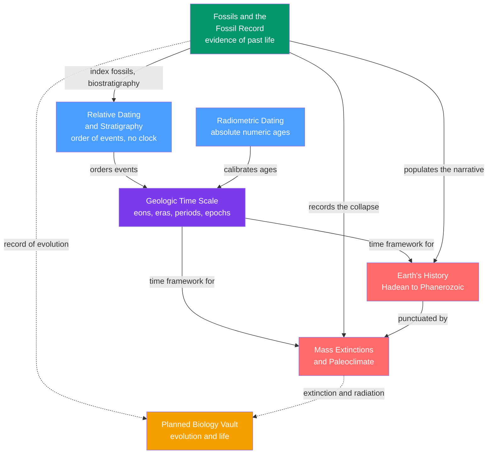

# ⏳ Historical Geology & Deep Time — Map of Content

> [!abstract] What This Section Covers
> Historical geology is the discipline of reading the **4.567-billion-year** diary of the planet. This section builds the toolkit twice over: first the **relative** methods (Steno's principles, stratigraphy, unconformities) that order events without clocks, then the **absolute** clock of radiometric decay that hangs numbers on that order — together they construct the **geologic time scale**. Onto that calibrated framework the section pours the *content* of deep time: the **fossil record** as a biased-but-priceless sample of past life, the **narrative of Earth's four eons** from the Hadean magma ocean to the age of mammals, and the **mass extinctions and paleoclimate swings** that punctuate the story. Every note opens with an everyday analogy and deepens to graduate-level treatment. This section is also the natural **bridge to the planned Biology vault** — the fossil record and the extinction-and-radiation rhythm are the raw evidence for evolution and the history of life itself.

## Concept Map

*(Blue = the two dating methods that build the scale · Purple = the geologic time scale they calibrate · Green = the fossil record · Red = the deep-time content that fills the scale · Orange = the forward bridge to Biology · dashed arrows = "evidence for evolution".)*

## Learning Path

*Recommended order for a first pass through deep time:*

1. [[Geologic_Time_Scale]] — meet the calendar of Earth history and the visceral scale of deep time before anything else.
2. [[Relative_Dating_and_Stratigraphy]] — learn how the *order* of events was read from rock long before any absolute age existed.
3. [[Radiometric_Dating]] — add the physical clock that converts that relative order into ages in millions of years.
4. [[Fossils_and_the_Fossil_Record]] — see how preserved life both calibrates the scale (biostratigraphy) and documents evolution.
5. [[Earths_History_Hadean_to_Phanerozoic]] — walk the full narrative across the four eons, from magma ocean to the age of mammals.
6. [[Mass_Extinctions_and_Paleoclimate]] — study the catastrophes and climate swings that punctuate and reset that history.

## All Notes in This Section

| Note | Core Idea | Difficulty |
|------|-----------|------------|
| [[Geologic_Time_Scale]] | The nested eon–era–period–epoch–age hierarchy that partitions 4.567 Gyr; built relatively, then calibrated to absolute ages, with GSSP golden spikes and astrochronology. | Secondary → Graduate |
| [[Relative_Dating_and_Stratigraphy]] | Steno–Hutton–Smith principles (superposition, cross-cutting, faunal succession) and unconformities that order events and correlate strata without clocks. | Secondary → Graduate |
| [[Radiometric_Dating]] | Parent–daughter isotopic decay at a fixed rate as the physical clock of geology; U–Pb, K–Ar, Rb–Sr, and ¹⁴C, isochrons, and the age of the Earth. | Secondary → Graduate |
| [[Fossils_and_the_Fossil_Record]] | Taphonomy and preservation bias, index fossils and biostratigraphy, paleoenvironmental proxies, and the record as a filtered sample of past life. | Secondary → Graduate |
| [[Earths_History_Hadean_to_Phanerozoic]] | The narrative of the four eons — magma ocean, Great Oxidation, Snowball Earth, Cambrian explosion — as the co-evolution of life, air, and climate. | Secondary → Graduate |
| [[Mass_Extinctions_and_Paleoclimate]] | The Big Five extinctions, their volcanic and impact triggers, deep-time climate proxies and hothouse–icehouse swings, and the sixth-extinction question. | Secondary → Graduate |

## Key Questions This Section Answers

- How do geologists know the Earth is 4.54 billion years old, and how do independent radiometric clocks cross-check that number?
- How was the entire geologic time scale built *before* a single absolute age was ever measured?
- Why is the fossil record a biased sample rather than a fair census of past life, and how do paleobiologists correct for it?
- What actually happened across the four eons of Earth history, and why is 88% of that time nearly invisible?
- What triggers a mass extinction, and why do the "Big Five" almost always coincide with a violent lurch in climate?
- What can deep-time climate crises tell us about the modern carbon spike and a possible sixth mass extinction?

## Related Sections

- [[_MOC_Earth_Science_Master|↑ Earth Science Master MOC]]
- [[_MOC_Biology_Master|→ Biology (planned)]] — the fossil record and the extinction-and-radiation rhythm are the raw evidence for evolution and the history of life.
- [[_MOC_Rocks_Petrology|→ Rocks & Petrology]] — [[Sedimentary_Rocks_and_Environments]] host most fossils and record the strata that stratigraphy reads.
- [[_MOC_Plate_Tectonics|→ Plate Tectonics]] — supercontinent cycles and drifting continents orchestrate long-term climate and biotic change.

#MOC #EarthScience #HistoricalGeology
