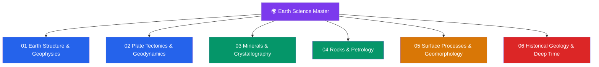

# 🌍 Earth Science & Geology — Master Map of Content

> [!abstract] About This Vault
> A comprehensive Earth-science / geology reference spanning **senior secondary through graduate level** — **~38 notes across 6 sections**. Every note opens with an everyday analogy, builds through undergraduate theory and quantitative treatment, and reaches graduate depth with research connections. Sections cover **Earth Structure & Geophysics**, **Plate Tectonics & Geodynamics**, **Minerals & Crystallography**, **Rocks & Petrology**, **Surface Processes & Geomorphology**, and **Historical Geology & Deep Time** — the solid-Earth story from the core to the landscape to the 4.6-billion-year record. Each note pairs geological intuition with the physics and chemistry beneath it, real-world applications (hazards, resources, climate), and tiered review questions. This is the "Earth Science / Geology" pillar of the natural-science base, sitting beside [[_MOC_Physics_Master|Physics]] and [[_MOC_Chemistry_Master|Chemistry]].

## Vault Architecture

## Sections at a Glance

| # | Section | Notes | Entry Point | Level Range |
|---|---------|-------|-------------|-------------|
| 01 | Earth Structure & Geophysics | 6 | [[_MOC_Earth_Structure_Geophysics]] | Secondary → Graduate |
| 02 | Plate Tectonics & Geodynamics | 6 | [[_MOC_Plate_Tectonics]] | Secondary → Graduate |
| 03 | Minerals & Crystallography | 6 | [[_MOC_Minerals_Crystallography]] | Secondary → Graduate |
| 04 | Rocks & Petrology | 7 | [[_MOC_Rocks_Petrology]] | Secondary → Graduate |
| 05 | Surface Processes & Geomorphology | 7 | [[_MOC_Geomorphology]] | Secondary → Graduate |
| 06 | Historical Geology & Deep Time | 6 | [[_MOC_Historical_Geology]] | Secondary → Graduate |

---

## Section Contents

**01 — Earth Structure & Geophysics** — [[_MOC_Earth_Structure_Geophysics]]
- [[Earth_Formation_and_Differentiation]]
- [[Earth_Internal_Structure]]
- [[Seismology_and_Earthquakes]]
- [[Earths_Internal_Heat_and_Geothermal_Gradient]]
- [[Geomagnetism_and_Paleomagnetism]]
- [[Gravity_Isostasy_and_the_Geoid]]

**02 — Plate Tectonics & Geodynamics** — [[_MOC_Plate_Tectonics]]
- [[Continental_Drift_and_the_Plate_Tectonics_Revolution]]
- [[Plate_Boundaries_and_Plate_Motions]]
- [[Seafloor_Spreading_and_Ocean_Basins]]
- [[Subduction_Zones_and_Mountain_Building]]
- [[Mantle_Convection_and_Hotspots]]
- [[Wilson_Cycle_and_Supercontinents]]

**03 — Minerals & Crystallography** — [[_MOC_Minerals_Crystallography]]
- [[What_Is_a_Mineral]]
- [[Crystal_Systems_and_Symmetry]]
- [[Silicate_Minerals]]
- [[Non_Silicate_and_Ore_Minerals]]
- [[Mineral_Properties_and_Identification]]
- [[Mineral_Stability_and_Phase_Diagrams]]

**04 — Rocks & Petrology** — [[_MOC_Rocks_Petrology]]
- [[The_Rock_Cycle]]
- [[Magma_Generation_and_Bowens_Series]]
- [[Igneous_Rocks_and_Classification]]
- [[Volcanism_and_Volcanic_Hazards]]
- [[Sedimentary_Rocks_and_Environments]]
- [[Metamorphism_and_Metamorphic_Facies]]
- [[Economic_Geology_and_Resources]]

**05 — Surface Processes & Geomorphology** — [[_MOC_Geomorphology]]
- [[Weathering_and_Soils]]
- [[Mass_Wasting_and_Slope_Stability]]
- [[Rivers_and_Fluvial_Landscapes]]
- [[Glaciers_and_Glacial_Landscapes]]
- [[Deserts_and_Aeolian_Processes]]
- [[Coastal_Processes_and_Landforms]]
- [[Groundwater_and_Karst]]

**06 — Historical Geology & Deep Time** — [[_MOC_Historical_Geology]]
- [[Geologic_Time_Scale]]
- [[Relative_Dating_and_Stratigraphy]]
- [[Radiometric_Dating]]
- [[Fossils_and_the_Fossil_Record]]
- [[Earths_History_Hadean_to_Phanerozoic]]
- [[Mass_Extinctions_and_Paleoclimate]]

---

## Learning Paths

### Path 1 — Senior Secondary Student
> Best for: grades 11–12 building the foundation.

[[Earth_Internal_Structure]] → [[Continental_Drift_and_the_Plate_Tectonics_Revolution]] → [[Plate_Boundaries_and_Plate_Motions]] → [[What_Is_a_Mineral]] → [[The_Rock_Cycle]] → [[Weathering_and_Soils]] → [[Rivers_and_Fluvial_Landscapes]] → [[Geologic_Time_Scale]] → [[Fossils_and_the_Fossil_Record]]

### Path 2 — Solid-Earth / Geophysics Track
> Best for: understanding Earth's interior and dynamics.

[[Earth_Formation_and_Differentiation]] → [[Earth_Internal_Structure]] → [[Seismology_and_Earthquakes]] → [[Earths_Internal_Heat_and_Geothermal_Gradient]] → [[Geomagnetism_and_Paleomagnetism]] → [[Gravity_Isostasy_and_the_Geoid]] → [[Mantle_Convection_and_Hotspots]]

### Path 3 — Plate Tectonics Deep Dive
> Best for: the unifying theory of geology.

[[Continental_Drift_and_the_Plate_Tectonics_Revolution]] → [[Seafloor_Spreading_and_Ocean_Basins]] → [[Plate_Boundaries_and_Plate_Motions]] → [[Subduction_Zones_and_Mountain_Building]] → [[Mantle_Convection_and_Hotspots]] → [[Wilson_Cycle_and_Supercontinents]]

### Path 4 — Minerals & Rocks (Petrology) Track
> Best for: the materials of the Earth.

[[What_Is_a_Mineral]] → [[Crystal_Systems_and_Symmetry]] → [[Silicate_Minerals]] → [[Mineral_Properties_and_Identification]] → [[The_Rock_Cycle]] → [[Magma_Generation_and_Bowens_Series]] → [[Igneous_Rocks_and_Classification]] → [[Sedimentary_Rocks_and_Environments]] → [[Metamorphism_and_Metamorphic_Facies]]

### Path 5 — Surface Processes & Landscapes
> Best for: how landscapes form and change.

[[Weathering_and_Soils]] → [[Mass_Wasting_and_Slope_Stability]] → [[Rivers_and_Fluvial_Landscapes]] → [[Glaciers_and_Glacial_Landscapes]] → [[Deserts_and_Aeolian_Processes]] → [[Coastal_Processes_and_Landforms]] → [[Groundwater_and_Karst]]

### Path 6 — Deep Time & Earth History
> Best for: reading the 4.6-billion-year record.

[[Geologic_Time_Scale]] → [[Relative_Dating_and_Stratigraphy]] → [[Radiometric_Dating]] → [[Fossils_and_the_Fossil_Record]] → [[Earths_History_Hadean_to_Phanerozoic]] → [[Mass_Extinctions_and_Paleoclimate]]

---

## Cross-Vault Links

Earth science is applied physics and chemistry at planetary scale:

- **Physics** — [[_MOC_Physics_Master]]: [[Wave_Motion_and_Properties]] and [[Oscillations_and_SHM]] underlie seismology; [[Newtons_Laws_and_Kinematics]] and [[Work_Energy_and_Conservation]] govern isostasy and surface processes; [[Laws_of_Thermodynamics]] drive Earth's heat engine and mantle convection; [[Magnetism_and_Biot_Savart]] and [[Maxwells_Equations]] explain the geodynamo; [[Radioactive_Decay]] and [[Nuclear_Structure]] power radiometric dating and Earth's internal heat.
- **Chemistry** — [[_MOC_Chemistry_Master]]: [[Solid_State_and_Crystal_Structures]] *is* mineral crystallography; [[Chemical_Bonding_and_Molecular_Geometry]] and [[Periodic_Trends_and_Main_Group_Chemistry]] explain silicate structures; [[Phase_Equilibria_and_Colligative_Properties]] and [[Chemical_Thermodynamics]] govern mineral stability and melting; [[Acids_Bases_and_pH]] and [[Chemical_Kinetics]] drive chemical weathering; [[Atomic_Structure_and_Subatomic_Particles]] (isotopes) grounds geochronology.
- **Mathematics** — [[_MOC_Mathematics_Master]]: differential equations (heat flow, diffusion), statistics (geochronology error).
- **Signals & Systems** — [[_MOC_SS_Master]]: the [[Fourier_Transform]] is central to seismic-signal processing.

---

## Section MOC Index

- [[_MOC_Earth_Structure_Geophysics]] — Earth's origin, layered interior, seismology, internal heat, magnetism, and gravity/isostasy.
- [[_MOC_Plate_Tectonics]] — the unifying theory: drift, boundaries, seafloor spreading, subduction, mantle convection, and supercontinent cycles.
- [[_MOC_Minerals_Crystallography]] — the building blocks: what a mineral is, crystal symmetry, silicates and ores, identification, and stability.
- [[_MOC_Rocks_Petrology]] — the rock cycle and the three rock families: igneous, sedimentary, metamorphic, plus volcanism and resources.
- [[_MOC_Geomorphology]] — surface processes and landforms: weathering, mass wasting, rivers, glaciers, deserts, coasts, and groundwater.
- [[_MOC_Historical_Geology]] — deep time: the geologic time scale, dating methods, fossils, Earth history, and mass extinctions.

#MOC #EarthScience #Geology #MasterMOC
