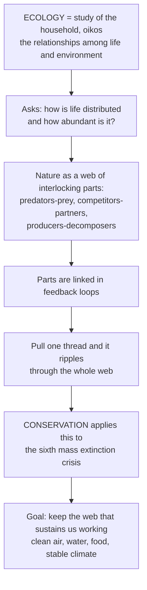

# 🌍 Ecology and Conservation Overview

> [!abstract] TL;DR
> **Ecology** is the scientific study of how organisms are **distributed**, how **abundant** they are, and how they **interact** with each other and their environment — literally the "study of the household" (Greek *oikos*, home). **Conservation** is ecology with a mission: applying that understanding to stop the human-driven **sixth mass extinction** and safeguard the ecosystems that give us clean air, water, food, and a stable climate. This note is the entry point and roadmap to the whole vault.

---

## Intuition

**Analogy:** Imagine nature as an unimaginably complex machine of interlocking parts — predators and prey, competitors and partners, producers and decomposers — every piece linked to every other through **feedback loops**. Ecology is the study of that great web of relationships that connects every living thing to each other and to the ground, air, and water around it. It asks the two deepest questions about life: *where* does it live and *how much* of it is there? Why do polar bears live in the Arctic and not the tropics? Why do some populations boom while others crash? How do thousands of species weave together into a rainforest or a coral reef, and how does energy flow through the whole system?

The crucial insight of the machine is that you cannot pull one thread without the whole tapestry moving. Remove the wolves and the deer explode, the young trees vanish, the rivers change course. Warm the water and the coral bleaches, the fish leave, the reef collapses. Clear the forest and the rain stops falling. **Conservation** is what happens when we realize humanity is now yanking on many threads at once — tearing the web apart faster than at almost any moment in Earth's 4-billion-year history — and decide to do something about it. Understanding ecology is understanding how the living world actually works; conservation is the urgent effort to keep it working.

---

## How It Works

### The shape of the field

Ecology organizes life into a **hierarchy of levels** — organism, population, community, ecosystem, biosphere — and studies the processes that operate at each. It combines biology, earth science, and chemistry, and increasingly leans on mathematics, data science, and economics. From that foundation grow four core questions:

1. **What determines where species live and how many there are?** — population and community ecology (growth, demography, competition, predation, mutualism, the niche).
2. **How do energy and nutrients flow?** — ecosystem ecology (food webs, trophic pyramids, biogeochemical cycles).
3. **How do systems change and self-regulate?** — succession, feedbacks, resilience, stability, tipping points.
4. **How do we keep it intact?** — conservation biology and applied ecology, confronting the biodiversity crisis.

**Conservation** is applied ecology aimed at the drivers of biodiversity loss, often remembered by the acronym **HIPPO**: **H**abitat loss, **I**nvasive species, **P**ollution, **P**opulation and overexploitation, and (over)harvesting — compounded by climate change. Its purpose is to protect **biodiversity** and the **ecosystem services** — pollination, water purification, carbon storage, fisheries — that human civilization silently depends on.

### Flow / Architecture



---

## Key Concepts

### Secondary
- **Ecology** — the study of living things in relation to one another and their surroundings; the word comes from *oikos*, "household."
- **Levels of organization** — organism → population → community → ecosystem → biosphere. Each level asks different questions.
- **Food chains and food webs** — who eats whom; energy passes from producers (plants) to herbivores to carnivores, losing about 90% at each step.
- **Biodiversity** — the variety of life: genes, species, and ecosystems. It underpins the stability and productivity of nature.
- **Conservation** — protecting species and habitats from extinction and degradation.

### Undergraduate
- **Distribution and abundance** — the two quantities ecology fundamentally tries to explain, set by abiotic factors (climate, soil) and biotic factors (competition, predation).
- **Population dynamics** — exponential vs **logistic growth**, carrying capacity (*K*), density dependence, and demographic structure.
- **Species interactions** — competition, predation, herbivory, parasitism, and mutualism; the **ecological niche** as an *n*-dimensional description of where and how a species lives.
- **Trophic structure and energy flow** — primary productivity, trophic levels, ecological efficiency, and the pyramid of energy; nutrients cycle while energy flows one way.
- **Biogeochemical cycles** — carbon, nitrogen, phosphorus, and water moving between organisms, atmosphere, oceans, and rocks.
- **The biodiversity crisis** — current extinction rates run ~100–1000× the geological background rate, marking a plausible **sixth mass extinction**.

### Graduate
- **Metapopulations and spatial ecology** — patch occupancy, colonization–extinction dynamics, and source–sink structure across fragmented landscapes.
- **Community assembly and stability** — niche vs neutral theory, the diversity–stability debate, and **alternative stable states** with hysteresis and regime shifts.
- **Ecosystem function and resilience** — thresholds, tipping points, and **planetary boundaries**; ecosystems as complex adaptive systems with nonlinear feedbacks.
- **Macroecology** — large-scale statistical patterns such as the **latitudinal biodiversity gradient**, species–area relationships, and metabolic scaling.
- **Conservation genetics and small-population biology** — extinction vortices, inbreeding depression, minimum viable populations, and effective population size *(Ne)*.
- **Ecological economics** — valuing **natural capital** and ecosystem services, and the governance of the commons in the **Anthropocene**.

---

## Python Demo

```python
# Two signatures of the living world:
#   (A) POPULATION DYNAMICS  — logistic growth toward a carrying capacity K,
#       showing that ecological systems are dynamic and self-regulating.
#   (B) BIODIVERSITY PATTERN — the latitudinal gradient: species richness
#       peaks at the equator and falls toward the poles.
import numpy as np
import matplotlib.pyplot as plt

# ---- (A) Logistic population growth: dN/dt = r*N*(1 - N/K) ----
r, K, N0 = 0.6, 1000.0, 10.0          # growth rate, carrying capacity, start
t = np.linspace(0, 25, 400)
N = K / (1 + ((K - N0) / N0) * np.exp(-r * t))   # closed-form logistic solution

# ---- (B) Latitudinal biodiversity gradient ----
lat = np.linspace(-90, 90, 361)
richness = 100 * np.exp(-(lat**2) / (2 * 35.0**2))  # Gaussian peak at equator

fig, (ax1, ax2) = plt.subplots(1, 2, figsize=(12, 4.5))

ax1.plot(t, N, color="seagreen", lw=2.5, label="Population N(t)")
ax1.axhline(K, color="firebrick", ls="--", lw=1.5, label=f"Carrying capacity K={int(K)}")
ax1.set_title("(A) Logistic Population Growth")
ax1.set_xlabel("Time"); ax1.set_ylabel("Population size N")
ax1.legend(); ax1.grid(alpha=0.3)

ax2.plot(lat, richness, color="darkorange", lw=2.5)
ax2.fill_between(lat, richness, color="darkorange", alpha=0.2)
ax2.axvline(0, color="steelblue", ls="--", lw=1.2, label="Equator")
ax2.set_title("(B) Latitudinal Biodiversity Gradient")
ax2.set_xlabel("Latitude (degrees)"); ax2.set_ylabel("Relative species richness")
ax2.legend(); ax2.grid(alpha=0.3)

plt.tight_layout()
plt.show()

print(f"Population reaches 95% of K at t = {t[np.argmax(N >= 0.95*K)]:.1f}")
print(f"Peak richness at latitude {lat[np.argmax(richness)]:.0f} degrees")
```

The left panel shows a foundational ecological dynamic: a small model (three parameters) reproduces the real S-shaped approach of a population to its **carrying capacity**. The right panel shows a signature macroecological pattern — life is not spread evenly across the planet; it clusters spectacularly toward the tropics, which is why tropical deforestation is so catastrophic for global biodiversity.

---

## Real-World Applications

- **Fisheries management** — logistic-growth and predator–prey models set catch quotas (maximum sustainable yield); ignoring them collapsed the Atlantic cod fishery in 1992.
- **Wildlife restoration** — reintroducing wolves to Yellowstone in 1995 triggered a **trophic cascade** that reshaped elk behavior, vegetation, and even river channels, a textbook demonstration of pulling one thread and moving the web.
- **Protected-area design** — species–area relationships and metapopulation theory guide the size, number, and connectivity of reserves and wildlife corridors.
- **Climate and carbon policy** — ecosystem-ecology accounting of forest, wetland, and soil carbon underpins REDD+, blue-carbon credits, and IPCC land-use scenarios.
- **Agroecology and pest control** — understanding food webs enables biological pest control and pollinator-friendly farming instead of blanket pesticide use.
- **Ecosystem-services valuation** — cities such as New York protect watershed forests (the Catskills) because intact ecosystems purify water far more cheaply than filtration plants.

---

## Common Pitfalls

- **Confusing energy flow with nutrient cycling.** Energy flows *through* an ecosystem one way (sun → producers → consumers → heat) and must be constantly resupplied; matter (C, N, P) *cycles* and is reused. Mixing these up breaks every ecosystem argument.
- **Assuming balance-of-nature equilibrium.** Ecosystems are dynamic, path-dependent, and full of feedbacks and tipping points — not static systems that always return to a fixed point. Many important states are alternative stable states with hysteresis.
- **Ignoring scale.** A pattern true for one plot, one season, or one region may reverse at another scale. Population, community, ecosystem, and global questions demand different tools.
- **Treating conservation as saving cute species one at a time.** The real target is *processes and habitats* — energy flow, connectivity, keystone interactions — because losing them dooms species you were not even watching.
- **Correlation-as-causation in field data.** Observational ecology is noisy and confounded; strong claims need controlled experiments, long-term monitoring, or careful causal inference.

---

## Related Concepts

This overview is the deep-dive companion to Biology's ecology section, and it bridges the earth, systems, and economic sciences.

- [[Population_Ecology]] — Biology's treatment of growth, demography, and regulation that this vault's population section extends into metapopulations and dynamics.
- [[Community_Ecology]] — species interactions, niches, and food webs; the community level between populations and ecosystems.
- [[Ecosystems_and_Energy_Flow]] — trophic structure and energy transfer, the core of ecosystem ecology.
- [[Biogeochemical_Cycles]] — the carbon, nitrogen, phosphorus, and water cycles that move matter through ecosystems.
- [[Biodiversity_and_Conservation]] — Biology's entry to the biodiversity crisis, which this vault develops into full conservation biology.
- [[Ecological_Resilience_and_Ecosystems]] — ecosystems as complex adaptive systems with thresholds and regime shifts.
- [[Feedback_Loops_and_Causality]] — the reinforcing and balancing loops that make "pull one thread" behavior possible.
- [[Sustainability_and_Planetary_Boundaries]] — the planetary limits that frame conservation in the Anthropocene.
- [[Mass_Extinctions_and_Paleoclimate]] — the five past mass extinctions in the geologic record against which the current sixth is measured.
- [[Anthropogenic_Climate_Change]] — the climate driver reshaping species ranges, phenology, and extinction risk.

**Vault map (in-vault siblings — sections of this vault):** this hub opens six sections. (1) *Foundations & Population Ecology* — Levels_of_Ecological_Organization, Population_Growth_and_Regulation, demography, predator–prey, and metapopulations. (2) *Community Ecology* — Community_Ecology_and_Species_Interactions, the niche, food webs, succession, and biodiversity. (3) *Ecosystem Ecology & Biogeochemistry* — Ecosystem_Ecology_and_Energy_Flow, nutrient cycles, biomes, ecosystem services, and stability. (4) *Biodiversity & Conservation Biology* — Conservation_Biology_and_the_Biodiversity_Crisis, extinction, habitat loss, small populations, invasives, and protected areas. (5) *Global Change & Applied Ecology* — climate-change ecology, overexploitation, pollution, restoration, and agroecology. (6) *Ecological Economics, Policy & Frontiers* — natural capital, governance, the Anthropocene, and conservation technology, closing with The_Reach_and_Future_of_Ecology.

---

## Review Questions

1. **Secondary** — In your own words, what two questions does ecology fundamentally try to answer about living things, and what does the word *oikos* have to do with it?
2. **Undergraduate** — Explain the difference between how energy and how nutrients move through an ecosystem. Why does this difference mean an ecosystem needs a constant external energy supply but not a constant external supply of carbon?
3. **Graduate** — Given a fragmented landscape where a species persists as a metapopulation near its extinction threshold, and given that HIPPO drivers are intensifying, what conservation interventions would you prioritize, and how would concepts of connectivity, alternative stable states, and minimum viable population size shape your decision?

---

## Sources

- Begon, M., Townsend, C. R., & Harper, J. L. — *Ecology: From Individuals to Ecosystems* (Blackwell).
- Ricklefs, R. E., & Relyea, R. — *The Economy of Nature* (W. H. Freeman).
- Molles, M. C. — *Ecology: Concepts and Applications* (McGraw-Hill).
- Primack, R. B. — *Essentials of Conservation Biology* (Sinauer / Oxford University Press).

---

#ecology #conservation #biodiversity #ecosystems #environmental-science
