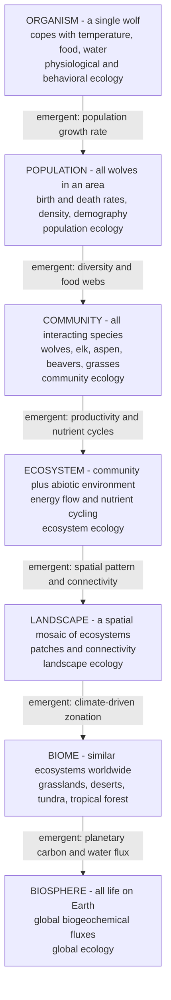

# 🪆 Levels of Ecological Organization

> [!abstract] TL;DR
> Ecology studies life as a **nested hierarchy** — organism → population → community → ecosystem → landscape → biome → biosphere — where each level *contains* the ones below it and displays **emergent properties** (population growth, community diversity, ecosystem energy flow, global biogeochemical cycles) that simply do not exist at the level beneath. Knowing which level a question belongs to, distinguishing **biotic** from **abiotic** factors, separating **habitat** from **niche**, and respecting the pervasive role of **scale** is the organizing framework for the entire science.

---

## Intuition

**Analogy:** Ecology is organized like a set of **Russian nesting dolls**. Each doll contains the ones below it, and opening a bigger doll reveals a pattern the smaller ones could never show.

At the very center is a single **organism** — one wolf — and how it copes with its surroundings: temperature, food, water. Zoom out and many wolves of the same species form a **population** — all the wolves in Yellowstone — and now you can ask a brand-new kind of question: what is the birth rate, the death rate, the density, the growth curve? None of those exist for a single wolf. Zoom out again and all the *different* species living together form a **community** — wolves, elk, aspen, beavers, grasses — and now you see competition, predation, and food webs. Add the non-living stage they act on — soil, water, air, sunlight, nutrients — and the community becomes an **ecosystem**, where you can finally trace *energy flowing* and *nutrients cycling* through the whole thing. Group similar ecosystems across the planet and you get **biomes** (all the world's grasslands, or deserts, or tropical forests). And the sum of all life everywhere is the **biosphere** — the thin living skin of Earth.

The crucial insight: **each level has emergent properties** — questions and patterns that don't exist one doll down. A population has a growth rate; an individual doesn't. A community has diversity; a single population doesn't. An ecosystem has productivity and nutrient cycles; a community without its abiotic stage doesn't. The biosphere has global carbon flux; no single ecosystem does. Figuring out *which doll* your question lives in is the first move in all of ecology.

---

## How It Works

### Core Mechanics

1. **The hierarchy is nested and inclusive.** Every higher level literally contains the lower ones. A population is made of organisms; a community is made of populations; an ecosystem is a community plus its abiotic environment. You cannot have a community without organisms, but the community has features none of its organisms possess.
2. **Each level defines a sub-discipline.** Physiological/behavioral ecology studies the *organism*; population ecology studies *abundance and dynamics*; community ecology studies *species interactions and diversity*; ecosystem ecology studies *energy flow and nutrient cycling*; landscape ecology studies *spatial mosaics*; global ecology / Earth-system science studies the *biosphere*.
3. **Moving up a level adds a new emergent property.** Aggregate individuals with births and deaths and a *growth rate* appears. Assemble populations of many species and *diversity* and *food-web structure* appear. Couple the biota to the abiotic environment and *productivity* and *biogeochemical cycles* appear.
4. **Biotic vs abiotic runs through every level.** The **biotic** component is the living part (other organisms, predators, competitors, mutualists); the **abiotic** component is the non-living part (climate, soil, water, light, nutrients). The ecosystem is precisely the level where biotic and abiotic are studied as one integrated system.
5. **Scale is not a detail — it is structural.** Different levels operate at vastly different spatial and temporal scales (a beetle over centimetres and weeks; the biosphere over continents and millennia). The pattern you observe *depends on the scale of observation*, so matching the question to the right level and scale is a methodological necessity, not a nicety.

### Flow / Architecture



---

## Key Concepts

### Secondary (foundational)

- **The levels, simply.** From smallest to largest: **organism** (one living thing) → **population** (many of the *same* species in one area) → **community** (many *different* species living together) → **ecosystem** (community + non-living surroundings) → **biome** (major ecosystem type like desert or rainforest) → **biosphere** (all life on Earth).
- **Biotic vs abiotic.** *Biotic* = the living things (predators, prey, plants, microbes). *Abiotic* = the non-living conditions (sunlight, temperature, water, soil, nutrients). Both shape where and how organisms live.
- **Habitat.** The *place* an organism lives — the address. A trout's habitat is a cold, fast, oxygen-rich stream.

### Undergraduate (core)

- **Emergent properties — the heart of the concept.** A property is *emergent* when it appears at a level but has no meaning one level below:

| Level | Studied by | Emergent property that first appears |
|---|---|---|
| Organism | Physiological/behavioral ecology | tolerance, adaptation, individual niche |
| Population | Population ecology | density, **growth rate**, age structure, dynamics |
| Community | Community ecology | **species diversity**, food-web structure, interactions |
| Ecosystem | Ecosystem ecology | **primary productivity**, energy flow, nutrient cycling |
| Landscape | Landscape ecology | patch connectivity, spatial heterogeneity |
| Biome | Biogeography | climate–vegetation zonation |
| Biosphere | Global ecology | **global biogeochemical fluxes** (C, N, water) |

- **Habitat vs niche.** *Habitat* is *where* an organism lives; the **niche** is the organism's *role and requirements* — the full set of biotic and abiotic conditions under which it can persist plus how it affects its surroundings. Two species can share a habitat but occupy different niches. (Fundamental niche = what's physiologically possible; realized niche = what's actually occupied after competition.)
- **Domains of study.** *Population ecology* asks about numbers and their change over time; *community ecology* asks who interacts with whom (competition, predation, mutualism) and how diversity is maintained; *ecosystem ecology* traces the flow of energy and the cycling of matter through biotic and abiotic compartments together.
- **Reductionism vs holism.** Reductionism explains a level from its parts (predict a population from individual physiology); holism insists that higher levels have properties requiring their own laws. Ecology is inescapably both — you cannot derive an ecosystem's nutrient cycle purely from one wolf's metabolism.

### Graduate (advanced)

- **The problem of pattern and scale (Levin 1992).** There is *no single natural scale* at which ecological problems should be studied; the description of a system changes with the **grain** (resolution) and **extent** (total area or time) of observation. A pattern that looks like random noise at one scale becomes structured at another. Translating understanding across scales — *upscaling* and *downscaling* — is a central, unsolved challenge.
- **Hierarchy theory (Allen & Starr; O'Neill).** Levels are held together by a difference in **rates**: lower levels operate fast and are constrained *from above* (slow context) while providing the mechanisms *from below*. A given level is best predicted by knowing the level above (its constraints) and the level below (its parts) — the "triadic" view.
- **Landscape ecology as an explicit-scale level.** Between ecosystem and biome, the **landscape** treats space itself as a variable: patch size, edge, corridors, and connectivity determine metapopulation persistence and disturbance spread — properties invisible in a spatially averaged ecosystem model.
- **Cross-level inference is dangerous.** Correlations at the community or ecosystem level need not hold for the constituent populations or organisms (an ecological version of the ecological fallacy). Matching the *inferential level* to the *level of the data* is a methodological requirement.
- **Emergence, formally.** Emergent properties are often *non-linear aggregates* plus *interactions*: population growth emerges from density-dependent feedback among individuals; food-web stability emerges from the topology of interactions, not from any single link. This links ecology directly to complexity science.

---

## Python Demo

```python
# Levels of ecological organization: (A) emergence across scales, and
# (B) the hierarchy drawn as a spatial-temporal scale map.
# numpy + matplotlib only.
import numpy as np
import matplotlib.pyplot as plt

rng = np.random.default_rng(42)

# ---------- Panel A: emergence across scales ----------
# A single ORGANISM has no "growth rate" -- its internal state just
# fluctuates around a mean. But a POPULATION of such organisms, born and
# dying, shows an emergent directional S-curve. And a COMMUNITY of several
# populations has a diversity value no single population possesses.
T = 200

# (1) one organism's internal state: a bounded random walk (no trend)
organism = np.empty(T)
organism[0] = 50.0
for t in range(1, T):
    organism[t] = np.clip(organism[t-1] + rng.normal(0, 4), 0, 100)

# (2) individual-based population: stochastic logistic birth-death
K, b0, d0 = 500, 0.12, 0.02
N = np.empty(T)
N[0] = 5                                   # a handful of founders
for t in range(1, T):
    n = N[t-1]
    births = rng.poisson(b0 * n)
    d = d0 + (b0 - d0) * n / K             # death rate rises with crowding
    deaths = rng.poisson(max(d, 0.0) * n)  # density dependence -> emergent K
    N[t] = max(n + births - deaths, 0)

# (3) emergent COMMUNITY property: Shannon diversity of several populations
abundances = np.array([240, 120, 60, 30, 15, 8])   # a community of 6 species
p = abundances / abundances.sum()
H = -np.sum(p * np.log(p))

fig, (ax1, ax2) = plt.subplots(1, 2, figsize=(13, 5.2))

ax1.plot(organism / organism.max(), color="0.6", lw=1.2,
         label="single organism state (no growth trend)")
ax1.plot(N / K, color="C2", lw=2.5,
         label="population N/K (emergent S-curve)")
ax1.axhline(1.0, ls="--", color="C3", lw=1, label="carrying capacity K")
ax1.set_xlabel("time"); ax1.set_ylabel("normalized value")
ax1.set_title("Emergence across scales:\n'growth rate' exists only above the individual")
ax1.legend(loc="center right", fontsize=8)
ax1.text(0.02, 0.03,
         f"Community Shannon diversity H = {H:.2f}\n(emergent at the community level)",
         transform=ax1.transAxes, fontsize=8,
         bbox=dict(boxstyle="round", fc="white", ec="0.7"))

# ---------- Panel B: spatial-temporal scale map ----------
levels  = ["organism", "population", "community", "ecosystem",
           "landscape", "biome", "biosphere"]
space_m = np.array([1e0, 1e3, 1e4, 1e5, 1e6, 5e6, 4e7])   # characteristic length
time_yr = np.array([1e0, 1e1, 1e2, 1e3, 1e3, 1e4, 1e6])   # characteristic time

ax2.plot(space_m, time_yr, color="0.7", lw=1, ls="--", zorder=1)
ax2.scatter(space_m, time_yr, s=90, color="C0", zorder=3)
for x, y, name in zip(space_m, time_yr, levels):
    ax2.annotate(name, (x, y), textcoords="offset points", xytext=(8, 6), fontsize=9)
ax2.set_xscale("log"); ax2.set_yscale("log")
ax2.set_xlabel("characteristic spatial scale (m)")
ax2.set_ylabel("characteristic temporal scale (years)")
ax2.set_title("The hierarchy as a scale map:\nlarger levels span more space AND time")
ax2.grid(True, which="both", ls=":", alpha=0.4)

plt.tight_layout()
plt.savefig("levels_of_ecological_organization.png", dpi=120)
plt.show()

print(f"Individual state ranges {organism.min():.0f}-{organism.max():.0f} with no trend.")
print(f"Population reached N = {N[-1]:.0f} (K = {K}).")
print(f"Emergent community diversity H = {H:.2f}.")
```

**What it shows.** Panel A makes emergence concrete: the grey line (one organism) wanders with no direction, yet the sum of many such organisms — with births and deaths — produces a smooth logistic S-curve, and a *growth rate* and *carrying capacity* appear from nowhere. The community's Shannon diversity is a third property that belongs to no single population. Panel B plots each level's characteristic space against its characteristic time on log-log axes, revealing the near-linear march from an individual (metres, years) to the biosphere (thousands of kilometres, millennia) — the visual signature of the "problem of scale."

---

## Real-World Applications

> **Example:** The **Yellowstone gray wolf reintroduction (1995)** is a live demonstration of the hierarchy. The intervention was at the **organism/population** level — release a few dozen wolves. The consequences cascaded *upward*: wolves suppressed and redistributed elk (a **population** effect), releasing browsed aspen and willow (a **community** effect through a trophic cascade), which stabilized stream banks and returned beavers and songbirds, altering **ecosystem**-level energy flow and even river geomorphology. No level in isolation predicts the outcome — the emergent, cross-level chain is the point.

- **Conservation strategy.** Managers must choose the right level: single-species recovery (population), maintaining interaction webs (community), or protecting whole functioning systems (ecosystem-based management). Picking the wrong level is a common cause of failed conservation.
- **Global change science.** Climate policy operates at the **biosphere** level — the global carbon cycle and biogeochemical fluxes — properties that only emerge when all ecosystems are summed. Long-Term Ecological Research (LTER) networks deliberately sample across levels to bridge organism physiology and global flux.
- **Remote sensing & scale.** Satellite ecology forces explicit choices of grain and extent; a forest looks homogeneous at 1 km resolution and patchy at 10 m — a direct application of Levin's scale problem.

---

## Common Pitfalls

- **Confusing habitat with niche.** "Habitat" is the address (where it lives); "niche" is the profession (its role and requirements). Two species in the same habitat can have completely different niches — mixing these up muddles competition and coexistence reasoning.
- **Cross-level (ecological) fallacy.** Assuming a pattern seen at the ecosystem or community level holds for individual populations or organisms — or vice versa. Aggregate correlations need not apply to the parts.
- **Ignoring scale.** Reporting a pattern without stating its grain and extent. A relationship (e.g., diversity vs productivity) can reverse sign at different scales, so a scale-blind claim is often meaningless.
- **Treating levels as rigid boxes.** The hierarchy is nested and *fuzzy*: landscapes overlap ecosystems, and the biotic/abiotic boundary is a modeling choice. Forcing a question into one tidy box can hide cross-scale interactions.
- **Naive reductionism.** Believing ecosystem behavior can be fully predicted from individual physiology. Emergent properties (food-web stability, nutrient cycling) require their own, level-appropriate models.

---

## Related Concepts

This note is the map for the whole **Ecology_and_Conservation** vault. Its sibling notes each unpack one level of the hierarchy: the **Ecology_and_Conservation_Overview** frames the discipline; **Population_Growth_and_Regulation** develops the population level (density, growth, carrying capacity); **Community_Ecology_and_Species_Interactions** develops the community level (competition, predation, diversity, food webs); **Ecosystem_Ecology_and_Energy_Flow** develops the ecosystem level (energy and nutrients through biotic and abiotic compartments); and **Biomes_and_Global_Ecology** develops the biome and biosphere levels.

Cross-vault connections (verified to exist):

- [[Population_Ecology]] — the biology-vault treatment of the population level: density, dispersion, exponential vs logistic growth, and carrying capacity.
- [[Community_Ecology]] — species interactions, diversity, and food-web structure that emerge at the community level.
- [[Ecosystems_and_Energy_Flow]] — trophic levels, productivity, and energy transfer once biotic and abiotic are coupled into a system.
- [[Biogeochemical_Cycles]] — nutrient cycling (C, N, P, water) that emerges at the ecosystem and biosphere levels.
- [[Biodiversity_and_Conservation]] — why the level you protect (species vs system) determines conservation strategy.
- [[Natural_Selection_and_Adaptation]] — the evolutionary process that shapes the individual organism's tolerance and niche, the base of the hierarchy.
- [[Emergence_and_Self_Organization]] — the general principle that new properties arise at higher levels of organization, applied here to ecology.
- [[System_Boundaries_and_Hierarchy]] — hierarchy theory and how choosing a level and boundary structures any systems analysis.
- [[Ecological_Resilience_and_Ecosystems]] — how the ecosystem and landscape levels absorb disturbance, an emergent, cross-scale property.

---

## Review Questions

1. **(Secondary)** List the levels of ecological organization from smallest to largest, and give one example of a *biotic* and one *abiotic* factor that affect an organism.
2. **(Undergraduate)** What is an *emergent property*? Give a specific example of a property that exists at the population level but not the organism level, and one that exists at the ecosystem level but not the community level. Explain *why* each emerges.
3. **(Undergraduate)** Distinguish *habitat* from *niche*, and *fundamental* from *realized* niche. Why can two species share a habitat yet not compete to extinction?
4. **(Graduate)** Levin (1992) argued there is "no single correct scale" in ecology. Using grain and extent, explain how the *same* diversity–productivity data could yield different — even opposite — conclusions at different scales, and what this implies for cross-level inference.
5. **(Graduate)** The Yellowstone wolf reintroduction was an organism/population-level action with ecosystem-level consequences. Explain, using hierarchy theory (constraint from above, mechanism from below), why you could not have predicted the outcome from wolf physiology alone.

---

## Sources

- Begon, M., Townsend, C.R., & Harper, J.L. (2006). *Ecology: From Individuals to Ecosystems* (4th ed.). Blackwell. — the canonical individuals-to-ecosystems structuring of the field.
- Odum, E.P., & Barrett, G.W. (2005). *Fundamentals of Ecology* (5th ed.). Thomson Brooks/Cole. — classic articulation of levels of organization and emergent properties.
- Ricklefs, R.E., & Relyea, R. (2018). *The Economy of Nature* (8th ed.). W.H. Freeman. — accessible treatment of the ecological hierarchy and scale.
- Levin, S.A. (1992). "The Problem of Pattern and Scale in Ecology." *Ecology* 73(6): 1943–1967. [DOI](https://doi.org/10.2307/1941447) — the foundational paper on scale.
- Allen, T.F.H., & Starr, T.B. (1982). *Hierarchy: Perspectives for Ecological Complexity*. University of Chicago Press. — hierarchy theory and constraint across levels.

---

#ecology #levels-of-organization #population #community #ecosystem
