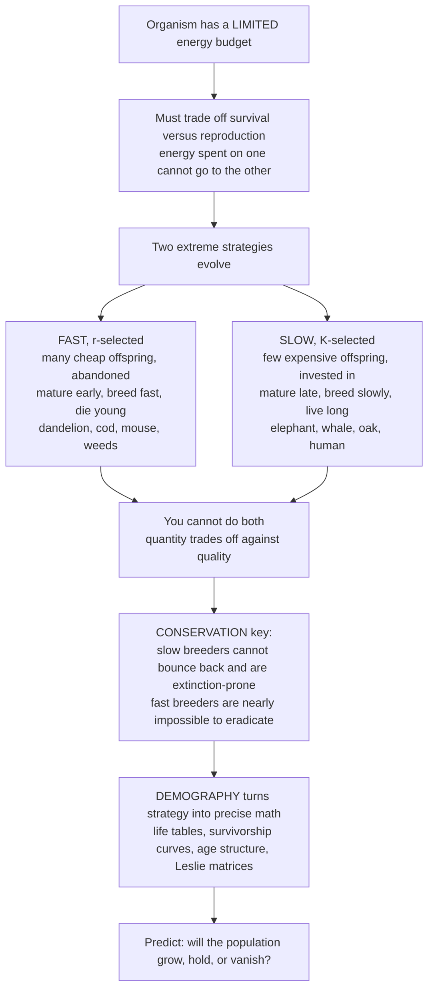

# 🐘 Life History Strategies and Demography

> [!abstract] TL;DR
> Every organism runs on a **limited energy budget** and must "decide" how to split it between **surviving** and **reproducing** — and it cannot maximize both at once. That single trade-off produces a **fast–slow continuum** of life strategies, from prolific weeds and fish that flood the world with cheap offspring (**r-selected**) to elephants, whales, and oaks that make a few costly offspring and invest heavily (**K-selected**). **Demography** — life tables, survivorship curves, and age-structured matrix models — turns these strategies into the precise math that predicts whether a population will grow, hold, or vanish, and it explains why slow breeders are the most **extinction-prone** species we have.

---

## Intuition

**Analogy:** Imagine every living thing is handed the same fixed paycheck of energy each year and told to run a household with it. It must divide that money between two competing bills: **staying alive** (repairing tissue, fighting disease, escaping predators) and **making the next generation**. Spend it all on children and you burn out young; hoard it for your own survival and you leave no heirs. Crucially, you **cannot pay both bills in full** — a dollar spent on quantity of offspring is a dollar not spent on quality, or on your own future. So different species have evolved strikingly different budgeting philosophies.

At one extreme is the **"live fast, die young, breed like crazy"** household: a dandelion firing thousands of windborne seeds, a cod releasing millions of eggs, a mouse breeding in weeks and dead within a year. It spends everything on cheap offspring and abandons them, betting that a lucky few survive. At the other extreme is the **"slow and careful"** household: an elephant that produces one calf every few years and nurtures it for a decade, a human, an oak tree that lives for centuries. Ecologists once labelled these **r-selected** (fast) and **K-selected** (slow), and the reason the two extremes exist is the same universal trade-off — you can't buy both quantity and quality with one paycheck.

This is not academic bookkeeping. It is the key to **conservation**: slow-budget species (whales, sharks, old-growth trees) **can't bounce back** when hit, so they are the first to slide toward extinction, while fast breeders (rats, weeds, pests) are nearly impossible to eradicate. And **demography** — the detailed accounting of who is born, who dies, and at what age — turns these philosophies into the exact equations conservationists use to forecast a species' fate.

---

## How It Works

### Core mechanics

1. **A limited budget forces allocation.** Energy and resources are finite, so an organism's life history is a *schedule* of when to grow, when to mature, how much to reproduce, and how long to live — all shaped by natural selection to maximize lifetime reproductive success given the budget.
2. **Trade-offs are the central law.** Allocating energy to one function subtracts it from another. The key trade-offs are: **quantity vs quality** of offspring, **current vs future reproduction** (the *cost of reproduction* — breeding now lowers later survival or fecundity), **early vs late maturity**, and **size vs number** of offspring.
3. **How often to reproduce.** **Semelparous** organisms make one massive reproductive event and then die (Pacific salmon, agave, many insects); **iteroparous** organisms reproduce repeatedly over a lifetime (most mammals, birds, and trees).
4. **The r/K continuum organizes the extremes.** **r-selected** species pour the budget into rapid growth, early maturity, and many small unattended offspring — opportunists that thrive in unstable, disturbed habitats. **K-selected** species live near carrying capacity **K**, growing slowly, maturing late, and making few large, well-tended offspring — competitors that win in stable, crowded habitats.
5. **Demography makes it quantitative.** A **life table** records age-specific survival (**lₓ**) and fecundity (**mₓ**). From it we compute the **net reproductive rate R₀ = Σ lₓ mₓ** (offspring per individual per lifetime), the **generation time T**, and the **intrinsic rate of increase r**. **Survivorship curves** (Type I, II, III) visualize the survival schedule, and **age structure** plus **Leslie matrix** models project the whole structured population forward.
6. **The conservation payoff.** Low-fecundity, late-maturing K-strategists have little demographic slack: remove adults and the population cannot regenerate fast enough, so they are the most extinction-prone — the exact insight behind population viability analysis.

### Flow / Architecture



---

## Key Concepts

### Secondary
- **Life history** — the schedule of an organism's big life events: being born, growing up, reproducing, and dying.
- **Energy budget and trade-off** — a creature has only so much energy; spending it on one thing leaves less for another, so it cannot make *many* offspring *and* care carefully for each one.
- **Fast vs slow (r vs K)** — "live fast, die young, lots of babies" (dandelion, mouse) versus "slow, careful, few well-cared-for babies" (elephant, oak).
- **Survivorship curve** — a graph showing how many members of a group are still alive at each age; it comes in three basic shapes.
- **Why conservation cares** — slow breeders cannot replace their losses quickly, so they are far more likely to go extinct.

### Undergraduate
- **The core trade-offs** — quantity vs quality of offspring; **current vs future reproduction** (the *cost of reproduction*, or reproductive effort); early vs late maturity; size vs number of offspring. These are why no organism can be optimal at everything.
- **Semelparity vs iteroparity** — a single "big bang" reproduction then death (salmon, agave) versus repeated bouts across a lifetime (most vertebrates, trees). Which wins depends on adult vs juvenile survival.
- **r-selected traits** — high **r**, small body, early maturity, many small offspring, little or no parental care, short life; "opportunist" colonizers of unstable, disturbed environments (weeds, insects, small rodents).
- **K-selected traits** — population near **carrying capacity K**, large body, late maturity, few large offspring, heavy parental investment, long life; "competitors" favored in stable, crowded environments (elephants, whales, large trees, humans).
- **Life tables** — age-specific survival **lₓ** and fecundity **mₓ**. A **cohort** (dynamic) table follows one birth cohort through time; a **static** (time-specific) table takes a snapshot of all ages at once and assumes stability.
- **Survivorship curves** — **Type I** (high survival then late die-off: humans, elephants), **Type II** (constant mortality rate at all ages: many birds, small mammals), **Type III** (massive early death, survivors persist: fish, plants, many invertebrates). They only read correctly on a **log** survivorship axis.
- **Key demographic rates** — **net reproductive rate R₀ = Σ lₓ mₓ** (R₀ > 1 grows, R₀ < 1 declines), **generation time T = Σ x·lₓ·mₓ / R₀**, and the **intrinsic rate of increase r ≈ ln R₀ / T**.
- **Age structure / population pyramids** — expansive (wide base = growing), stationary (columnar = stable), and constrictive (narrow base = declining). Age structure predicts future growth even before birth rates change.

### Graduate
- **Life-history theory formalized** — optimality and allocation models maximize *lifetime* fitness; the **Euler–Lotka equation** Σ e^(−r·x)·lₓ·mₓ = 1 defines the true intrinsic rate r, and Fisher's **reproductive value** ranks the expected future contribution of each age class.
- **Cost of reproduction and senescence** — aging itself is a life-history outcome. **Antagonistic pleiotropy** (Williams) and the **disposable soma** theory (Kirkwood) explain senescence as the price of early-life reproductive investment; the shape of mortality (Gompertz) follows from declining selection with age.
- **Bet-hedging** — in unpredictable environments, selection maximizes the **geometric-mean** fitness across generations, favoring variance-reducing strategies (spread germination, variable clutch size) even at a cost to arithmetic-mean output — a direct bridge to evolutionary strategy theory.
- **Beyond r/K** — the r/K scheme is a useful heuristic but has been superseded by richer frameworks: Grime's **CSR triangle** (competitor–stress-tolerator–ruderal), the demographic **fast–slow continuum**, and the Winemiller–Rose **trilateral** (opportunistic / periodic / equilibrium) that separates fecundity, survival, and maturation axes.
- **Matrix population models** — **Leslie** (age-structured) and **Lefkovitch** (stage-structured) matrices project a population vector forward. The **dominant eigenvalue λ** is the finite growth rate (λ > 1 grows), the associated right eigenvector is the **stable age distribution**, and the left eigenvector is the **reproductive-value** vector — pure linear algebra doing ecology.
- **Conservation demography** — **sensitivity** and **elasticity** analysis of a matrix identifies *which* vital rate most controls λ. For long-lived K-strategists (whales, sea turtles, sharks) elasticity concentrates on **adult survival**, which is exactly why harvesting adults is so devastating and why these species dominate extinction-risk lists — the quantitative core of Population Viability Analysis.

---

## Python Demo

```python
# Life history and demography, three views:
#   (A) SURVIVORSHIP CURVES  — Type I / II / III on a LOG axis, each tied to a strategy.
#   (B) r vs K TRADE-OFF     — offspring number vs offspring size across real species (log-log).
#   (C) LIFE TABLE (printed) — compute lx, dx, qx, R0, generation time T, and r for a cohort.
import numpy as np
import matplotlib.pyplot as plt

# ------------------------------------------------------------------
# (A) The three classic survivorship curves: survivors per 1000 born
# ------------------------------------------------------------------
a = np.linspace(0.0, 1.0, 200)                 # relative age (0 = birth, 1 = max lifespan)
type_I   = 1000.0 * (1.0 - a**3)               # high survival, then late die-off (elephant, human)
type_II  = 1000.0 * np.exp(-4.0 * a)           # constant mortality: straight line on a log axis
type_III = 1000.0 * np.exp(-7.0 * np.sqrt(a))  # heavy early death, then survivors persist (cod, oak)
for arr in (type_I, type_II, type_III):
    np.clip(arr, 1.0, None, out=arr)           # floor at 1 so log scale is well-defined

# ------------------------------------------------------------------
# (B) The r-K trade-off: many tiny offspring  <-->  few large offspring
# ------------------------------------------------------------------
species  = ["Oyster","Cod","Dandelion","Mouse","Songbird","Rabbit",
            "Dog","Deer","Human","Elephant","Blue whale"]
n_off    = np.array([1e6, 5e5, 2e3, 6, 4, 5, 6, 1.5, 1, 1, 1])          # offspring per bout
size_g   = np.array([1e-4, 1e-3, 5e-4, 1.0, 2.0, 40, 300, 3e3,          # offspring mass (g)
                     3.3e3, 1e5, 2e6])
is_r     = n_off >= 100                                                  # r-strategist flag

# ------------------------------------------------------------------
# (C) A cohort life table  ->  R0, generation time, intrinsic rate r
# ------------------------------------------------------------------
x   = np.array([0, 1, 2, 3, 4, 5])              # age classes
Sx  = np.array([1000, 700, 500, 300, 120, 0])   # survivors entering each age
lx  = Sx / Sx[0]                                 # survivorship (fraction surviving to age x)
mx  = np.array([0.0, 2.0, 3.0, 2.0, 1.0, 0.0])  # age-specific fecundity (female offspring)
dx  = np.append(-np.diff(lx), lx[-1])            # fraction dying within each interval
qx  = np.divide(dx, lx, out=np.zeros_like(dx), where=lx > 0)  # age-specific mortality rate
R0  = np.sum(lx * mx)                            # net reproductive rate (offspring / lifetime)
T   = np.sum(x * lx * mx) / R0                   # mean generation time
r   = np.log(R0) / T                             # approx. intrinsic rate of increase

print("Cohort life table")
print(f"{'x':>3}{'lx':>8}{'mx':>7}{'qx':>8}{'lx*mx':>8}")
for xi, lxi, mxi, qxi in zip(x, lx, mx, qx):
    print(f"{xi:>3}{lxi:>8.3f}{mxi:>7.1f}{qxi:>8.3f}{lxi*mxi:>8.3f}")
print(f"\nR0 (net reproductive rate) = {R0:.2f}   -> {'GROWING' if R0 > 1 else 'DECLINING'}")
print(f"Generation time T          = {T:.2f}")
print(f"Intrinsic rate r ~ lnR0/T  = {r:.3f} per time unit")

# ------------------------------------------------------------------
# Plot (A) survivorship curves and (B) the r-K trade-off
# ------------------------------------------------------------------
fig, (ax1, ax2) = plt.subplots(1, 2, figsize=(13, 5))

ax1.plot(a, type_I,   lw=2.5, color="seagreen",  label="Type I  (elephant, human)")
ax1.plot(a, type_II,  lw=2.5, color="steelblue", label="Type II (many birds)")
ax1.plot(a, type_III, lw=2.5, color="firebrick", label="Type III (cod, oak)")
ax1.set_yscale("log")
ax1.set_title("(A) Survivorship Curves = the survival schedule")
ax1.set_xlabel("Relative age  (0 = birth, 1 = max lifespan)")
ax1.set_ylabel("Survivors per 1000 (log scale)")
ax1.legend(); ax1.grid(alpha=0.3, which="both")

ax2.scatter(size_g[is_r],  n_off[is_r],  s=90, color="firebrick",
            label="r-selected (many, tiny)")
ax2.scatter(size_g[~is_r], n_off[~is_r], s=90, color="seagreen",
            label="K-selected (few, large)")
for xs, ys, name in zip(size_g, n_off, species):
    ax2.annotate(name, (xs, ys), fontsize=8, xytext=(4, 4),
                 textcoords="offset points")
# trend line in log-log space shows the quantity-quality trade-off
b, logc = np.polyfit(np.log10(size_g), np.log10(n_off), 1)
xs_fit = np.logspace(-4, 6.4, 50)
ax2.plot(xs_fit, 10**logc * xs_fit**b, "k--", lw=1.3,
         label=f"trade-off slope = {b:.2f}")
ax2.set_xscale("log"); ax2.set_yscale("log")
ax2.set_title("(B) The r-K Trade-off: quantity vs quality")
ax2.set_xlabel("Offspring size / investment (g, log)")
ax2.set_ylabel("Number of offspring per bout (log)")
ax2.legend(); ax2.grid(alpha=0.3, which="both")

plt.tight_layout()
plt.show()
```

Panel **(A)** shows why the log axis matters: **Type II** mortality is a perfectly straight line only in log space, **Type I** stays high then plunges late (the K-strategist signature), and **Type III** crashes at birth then flattens (the r-strategist signature). Panel **(B)** makes the trade-off tangible — a steep negative slope on the log-log plot means every order of magnitude of extra offspring "costs" roughly an order of magnitude in the size and provisioning each one receives; you simply cannot have both. The printed **life table** closes the loop: from raw survival and fecundity counts it computes **R₀**, and because R₀ > 1, the population is projected to grow — the exact arithmetic conservationists run in reverse to flag species heading for zero.

---

## Real-World Applications

- **Fisheries collapse and recovery.** Life history predicts resilience: fast, high-r sardines and anchovies rebound after crashes, while slow, low-r **sharks, orange roughy, and bluefin tuna** collapse and stay collapsed for decades. Managers set catch limits from R₀, generation time, and matrix models rather than raw biomass.
- **Sea turtle conservation (a demography success story).** Crouse, Crowder & Caswell's **stage-structured (Lefkovitch) matrix** showed that protecting eggs on beaches barely moved λ, whereas protecting **large juveniles and adults** dominated the growth rate. That elasticity result drove the adoption of **Turtle Excluder Devices** in trawl nets — policy set by linear algebra.
- **Invasive species and pest control.** r-strategists (rats, mice, weeds, insects) have such high reproductive output that eradication is nearly hopeless once established; control programs target the reproductive rate (sterilization, breeding-season timing) rather than trying to kill every individual.
- **Human population forecasting.** National **age pyramids** predict decades of momentum: a wide-based pyramid keeps growing even after fertility falls to replacement, while a top-heavy one foretells decline — the demographic engine behind pension, labor, and immigration policy.
- **Wildlife harvest and culling.** Leslie matrices for deer, elephants, and whales identify sustainable off-take and which age classes can be harvested without collapsing λ.
- **Extinction-risk triage (IUCN Red List).** Slow life-history traits — late maturity, low fecundity, long generation time — are red flags that a species cannot recover from exploitation, guiding which species get scarce conservation funding first.

---

## Common Pitfalls

- **Treating r/K as a rigid dichotomy.** It is a **continuum**, and modern ecology has largely superseded it with multi-axis schemes (CSR, fast–slow, Winemiller–Rose). Species are only r- or K-*relative to one another*; calling something "an r-strategist" in absolute terms is a red flag.
- **Confusing survivorship (lₓ) with mortality (qₓ).** lₓ is the fraction surviving *from birth to age x* (a cumulative quantity that only falls); qₓ is the fraction of those *present at age x* that die *within that interval*. They tell different stories and are easy to swap.
- **Cohort vs static life table mix-ups.** A static (time-specific) table assumes the population is stationary and unchanging; applying it to a growing or declining population silently biases every rate. Know which table you built.
- **Reading survivorship curves off an arithmetic axis.** Type II looks curved and Type I vs III can look similar unless survivorship is plotted on a **log** scale — the classification is defined in log space.
- **Assuming "high fecundity = safe" and "low fecundity = doomed."** r-strategist populations still crash hard between booms, and a low-fecundity species can be perfectly stable if adult survival is high. What matters is the *whole* schedule (R₀ and λ), not fecundity alone.
- **Ignoring density dependence.** The "r" and "K" labels describe selection under different density regimes; the optimal life history shifts with crowding, disturbance, and environment, so no single strategy is universally best.

---

## Related Concepts

Life-history theory sits at the crossroads of evolution, population dynamics, and the linear algebra of structured populations. The Glob-verified cross-vault links below connect it to those foundations.

- [[Population_Ecology]] — the population-growth and regulation backbone (exponential vs logistic growth, carrying capacity K) that demography's rates R₀ and r feed into.
- [[Natural_Selection_and_Adaptation]] — life histories *are* adaptations: the fast–slow continuum is what selection produces when it optimizes lifetime fitness under an energy-budget constraint.
- [[Eigenvalues_and_Eigenvectors]] — the mathematical engine of Leslie and Lefkovitch models, where the **dominant eigenvalue** is the population growth rate λ and its eigenvectors give the stable age distribution and reproductive values.
- [[Evolution_of_Mutation_and_Bet_Hedging]] — bet-hedging as a life-history strategy, where selection maximizes geometric-mean fitness in unpredictable environments rather than expected output.
- [[Biodiversity_and_Conservation]] — the conservation stakes: why slow, low-fecundity life histories dominate extinction-risk assessments.

Within this vault's *Foundations and Population Ecology* section, this note is the strategy-and-math counterpart to its siblings (linked in prose only). **Population_Growth_and_Regulation** supplies the exponential and logistic dynamics on which R₀ and r operate; **Levels_of_Ecological_Organization** places demography at the population level of the hierarchy; **Predator_Prey_and_Population_Interactions** shows how mortality schedules are shaped by the interactions above; **Population_Viability_and_Small_Population_Biology** applies life tables and matrix models directly to extinction forecasting; and **Extinction_and_the_Sixth_Mass_Extinction** is where the vulnerability of slow K-strategists becomes the central conservation crisis.

---

## Review Questions

1. **Secondary** — A dandelion makes thousands of tiny seeds and abandons them, while an elephant makes one calf every few years and cares for it for years. Using the idea of a limited energy budget, explain why an animal cannot do both at once, and say which of the two is more likely to go extinct if humans start killing many adults.
2. **Undergraduate** — You build a cohort life table and calculate **R₀ = 0.8** with a generation time of 4 years. Is this population growing or declining, and roughly what is its intrinsic rate of increase r? Then explain why a species with a **Type III** survivorship curve can still have a high R₀ despite enormous juvenile mortality.
3. **Graduate** — Two endangered species have the same population size: one is a fast-maturing rodent (Type III, high fecundity), the other a long-lived shark (Type I, low fecundity, late maturity). Using elasticity analysis of a Leslie/Lefkovitch matrix, explain which vital rate you would prioritize protecting for each, why the dominant eigenvalue λ formalizes "growing vs vanishing," and why the shark is intrinsically more extinction-prone despite identical current numbers.

---

## Sources

- Stearns, S. C. — *The Evolution of Life Histories* (Oxford University Press, 1992).
- Gotelli, N. J. — *A Primer of Ecology* (Sinauer Associates).
- Begon, M., Townsend, C. R., & Harper, J. L. — *Ecology: From Individuals to Ecosystems* (Blackwell).
- Pianka, E. R. — "On r- and K-Selection," *The American Naturalist* 104(940): 592–597 (1970).
- Crouse, D. T., Crowder, L. B., & Caswell, H. — "A Stage-Based Population Model for Loggerhead Sea Turtles and Implications for Conservation," *Ecology* 68(5): 1412–1423 (1987).

---

#ecology #life-history #r-K-selection #demography #survivorship-curves
