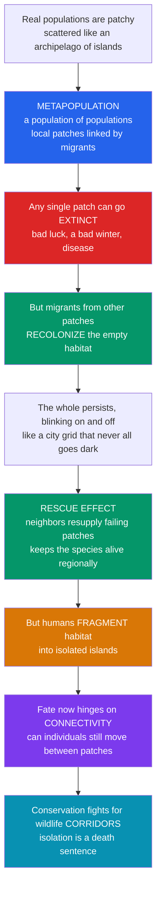

# 🗺️ Metapopulations and Spatial Ecology

> [!abstract] TL;DR
> A **metapopulation** is a "population of populations" — a set of local populations, each occupying a discrete habitat **patch**, linked by occasional **dispersal**. Any one patch can wink out to local **extinction** by bad luck, but as long as migrants from other patches **recolonize** empty habitat, the whole persists at a regional occupancy equilibrium — blinking on and off like a city grid that never all goes dark. Captured by the **Levins model** (persistence requires colonization > extinction), this insight reframed most modern conservation: because humans have fragmented habitat into isolated islands, endangered species now survive as metapopulations whose fate hinges on **connectivity** — the scientific rationale for wildlife **corridors** and reserve networks.

---

## Intuition

**Analogy:** Real populations rarely live as one uniform blob. They are scattered across a patchy landscape like an **archipelago of islands** — separate sub-populations, each on its own patch of good habitat, with stretches of hostile ground between them. Now picture a **city grid of lights at night**: individual windows flick off (a household leaves) and flick back on (someone new moves in), yet the grid as a whole never goes fully dark. A metapopulation is exactly this — local lights blinking off and on, the network glowing on.

The profound twist is that **spatial structure changes everything about survival**. A single patch might go extinct — a bad winter, a disease outbreak, or sheer bad luck wipes out that local group. In an isolated blob, that would be the end. But in a connected network, migrants from *other* patches drift in and recolonize the empty habitat. Neighbors resupply failing populations — the **rescue effect** — so the species persists at the regional scale even as any given patch turns over. This is not abstract: humans have shattered forests and wetlands into disconnected fragments sliced by roads and farms, so most endangered species now survive *as* metapopulations. Their fate hinges on **connectivity** — whether individuals can still move between patches. Cut off a patch, and when its local population inevitably blinks out, there is no rescue. That is why isolation is a death sentence and why conservationists fight for wildlife **corridors**.

---

## How It Works

### Core Mechanics

1. **Space is patchy, not well-mixed.** Suitable habitat exists as discrete patches embedded in an inhospitable **matrix**. Classical population models assume one homogeneous pool; spatial ecology insists that *where* individuals are — and how far apart — matters as much as how many.
2. **Local populations turn over.** Each patch supports a local population that can grow, shrink, and go **locally extinct**. Small isolated populations are especially prone to extinction from demographic and environmental stochasticity.
3. **Dispersal is the glue.** Individuals move between patches. Dispersers reaching an **empty** patch can found a new local population — **colonization**. Dispersers reaching an **occupied** patch boost its numbers, lowering its extinction risk — the **rescue effect**.
4. **The regional balance.** The metapopulation persists not because patches are stable but because **colonization keeps pace with extinction**. Occupancy settles at a dynamic equilibrium — a roughly constant *fraction* of patches occupied — while the *identity* of occupied patches keeps shifting ("blinking").
5. **The Levins threshold.** In the simplest model, the fraction of occupied patches `p` obeys `dp/dt = c·p·(1 − p) − e·p`. Its non-trivial equilibrium is `p* = 1 − e/c`. The metapopulation persists only if colonization exceeds extinction (`c > e`); if `e ≥ c`, `p*` drops to zero and the whole network goes **globally extinct**.
6. **Connectivity sets the colonization rate.** How reachable patches are — distance, corridors, matrix permeability — controls `c`. Fragmentation lowers `c` (isolation) and can raise `e` (smaller patches), pushing a viable metapopulation across the extinction threshold.

### Flow / Architecture



---

## Key Concepts

### Secondary (intuitive foundations)

- **Patch and matrix.** A *patch* is a chunk of good habitat; the *matrix* is the unfriendly land in between. A metapopulation lives across many patches, not one.
- **Population of populations.** Each patch holds a *local* population. The metapopulation is the whole set of them, linked by animals or seeds moving between patches.
- **Blinking on and off.** A patch can lose its population (local extinction) and later be refilled by newcomers (colonization). At any moment some patches are lit, some dark — but the network as a whole stays alive.
- **Rescue effect.** When new arrivals reinforce a struggling patch before it dies out, neighbors have "rescued" it. Connected patches rescue each other; isolated ones cannot.
- **Corridors matter.** Strips of habitat that let animals travel between patches keep the blinking network alive. Cut them, and isolated patches go dark for good.

### Undergraduate (the models)

- **The Levins model (1969).** Track the *fraction* of occupied patches `p`, ignoring internal dynamics. `dp/dt = c·p·(1 − p) − e·p`: colonization fills empty patches at rate proportional to occupied `p` times available empty `(1 − p)`; extinction empties them at rate `e·p`. Equilibrium `p* = 1 − e/c`; **persistence requires `c > e`**.
- **Extinction–colonization balance.** The metapopulation is a stochastic steady state, not a fixed configuration. Occupancy is stable even though which patches are occupied constantly changes — the defining "turnover."
- **Source–sink dynamics.** Where habitat quality varies, high-quality **source** patches produce a surplus of emigrants that subsidize low-quality **sink** patches (where deaths exceed births). Sinks persist only because of source input — a spatial subsidy invisible in a single-patch census.
- **Metapopulation structures.** *Classic (Levins)*: many similar patches, all subject to extinction and recolonization. *Mainland–island*: a large stable "mainland" continuously seeds small extinction-prone islands. *Patchy / non-equilibrium*: high dispersal (effectively one population) versus declining networks with no rescue.
- **Connectivity.** How reachable a patch is, set by inter-patch distance, corridors, and matrix permeability. It scales the effective colonization rate `c`.

### Graduate (structure, extensions, and application)

- **Spatially realistic metapopulation theory.** The **Incidence Function Model** (Hanski) and **spatially explicit / individual-based models** replace the mean-field `p` with actual patch coordinates, areas, and distance-decayed dispersal kernels, yielding the **metapopulation capacity** `λ_M` — a landscape eigenvalue that must exceed a threshold `e/c` for persistence. This lets managers rank which patches contribute most to regional survival.
- **Habitat fragmentation as a metapopulation problem.** Fragmentation simultaneously shrinks patches (raising local extinction `e`) and isolates them (lowering colonization `c`), a double blow that can collapse a network that either alone would survive. Ties directly to **island biogeography** — patches behave like habitat islands whose "distance from mainland" is connectivity.
- **Extinction debt and time lags.** After fragmentation, occupancy relaxes slowly toward a new, lower equilibrium; species can appear present yet be committed to eventual loss — a debt paid over decades.
- **Population Viability Analysis (PVA) and reserve design.** Metapopulation viability analysis feeds spatial reserve-network design: **stepping stones**, corridor placement, and matrix management to preserve dispersal. **Assisted migration** artificially supplies the colonization that broken connectivity no longer provides.
- **Canonical study systems.** Glanville fritillary and other **butterflies** (the empirical backbone of metapopulation theory), American **pika** on isolated talus slopes, northern **spotted owl** across managed forests, and pond-breeding **amphibians** — all textbook cases where regional persistence depends on inter-patch dispersal.

---

## Python Demo

```python
# Metapopulations: (a) the Levins patch-occupancy model and its persistence
# threshold, and (b) a spatially explicit stochastic patch-blinking simulation
# showing that removing connectivity collapses the metapopulation.
import numpy as np
import matplotlib.pyplot as plt

rng = np.random.default_rng(42)

# ----------------------------------------------------------------------
# (a) LEVINS MODEL: dp/dt = c * p * (1 - p) - e * p
#     Equilibrium p* = 1 - e/c ; persists only if c > e.
# ----------------------------------------------------------------------
def levins(p0, c, e, t_end=60.0, dt=0.01):
    steps = int(t_end / dt)
    p = np.empty(steps)
    p[0] = p0
    for k in range(steps - 1):
        dp = c * p[k] * (1.0 - p[k]) - e * p[k]
        p[k + 1] = min(max(p[k] + dp * dt, 0.0), 1.0)
    return np.linspace(0, t_end, steps), p

c = 0.6  # colonization rate (set by connectivity / dispersal)
scenarios = [
    ("e = 0.15  (c > e: persists)", 0.15, "#059669"),
    ("e = 0.35  (c > e: persists, lower p*)", 0.35, "#2563eb"),
    ("e = 0.60  (e = c: at threshold)", 0.60, "#d97706"),
    ("e = 0.75  (e > c: global extinction)", 0.75, "#dc2626"),
]

# Occupancy trajectories toward equilibrium p* = 1 - e/c
fig, axes = plt.subplots(2, 2, figsize=(13, 9))
ax = axes[0, 0]
for label, e, col in scenarios:
    t, p = levins(p0=0.05, c=c, e=e, t_end=60)
    ax.plot(t, p, color=col, lw=2, label=label)
    p_star = max(1.0 - e / c, 0.0)
    ax.axhline(p_star, color=col, ls=":", lw=1, alpha=0.7)
ax.set_title("(a) Levins model: occupancy reaches p* = 1 - e/c")
ax.set_xlabel("time"); ax.set_ylabel("fraction of patches occupied  p")
ax.set_ylim(-0.02, 1.0); ax.legend(fontsize=8); ax.grid(alpha=0.3)

# Persistence threshold: equilibrium occupancy vs extinction rate
ax = axes[0, 1]
e_grid = np.linspace(0, 1.0, 400)
p_star = np.clip(1.0 - e_grid / c, 0.0, 1.0)
ax.plot(e_grid, p_star, color="#7c3aed", lw=2.5)
ax.fill_between(e_grid, 0, p_star, where=p_star > 0, color="#7c3aed", alpha=0.15)
ax.axvline(c, color="#dc2626", ls="--", lw=1.5, label=f"threshold e = c = {c}")
ax.set_title("(a) Persistence threshold: metapopulation collapses when e >= c")
ax.set_xlabel("local extinction rate  e"); ax.set_ylabel("equilibrium occupancy  p*")
ax.legend(fontsize=9); ax.grid(alpha=0.3)

# ----------------------------------------------------------------------
# (b) SPATIALLY EXPLICIT PATCH-BLINKING SIMULATION
#     Patches on a grid. Each step: occupied patches go extinct with prob e0;
#     empty patches are colonized with prob rising with the number of nearby
#     occupied patches. "Connectivity radius" R controls who can rescue whom.
#     Large R = corridors intact; R = 1 = isolated fragments (no rescue).
# ----------------------------------------------------------------------
def simulate(grid=12, steps=400, e0=0.25, col=0.35, radius=3.0, seed=0):
    g = np.random.default_rng(seed)
    xs, ys = np.meshgrid(np.arange(grid), np.arange(grid))
    coords = np.column_stack([xs.ravel(), ys.ravel()])
    n = len(coords)
    # pairwise distances; "neighbours" within the connectivity radius
    d = np.sqrt(((coords[:, None, :] - coords[None, :, :]) ** 2).sum(-1))
    neigh = (d <= radius) & (d > 0)
    occ = g.random(n) < 0.5          # start half-occupied
    frac = np.empty(steps)
    for s in range(steps):
        frac[s] = occ.mean()
        # colonization: empty patch fills with prob that grows with occupied neighbours
        occ_neighbours = neigh @ occ.astype(float)
        p_col = 1.0 - (1.0 - col) ** occ_neighbours   # more lit neighbours -> more rescue
        births = (~occ) & (g.random(n) < p_col)
        # extinction: occupied patch winks out with prob e0
        deaths = occ & (g.random(n) < e0)
        occ = (occ | births) & ~deaths
    return frac

steps = 400
connected = simulate(radius=3.5, seed=1)   # corridors intact: wide rescue network
isolated  = simulate(radius=1.0, seed=1)   # fragments cut off: no rescue

ax = axes[1, 0]
ax.plot(connected, color="#059669", lw=2, label="connected (corridors intact)")
ax.plot(isolated, color="#dc2626", lw=2, label="isolated (connectivity removed)")
ax.set_title("(b) Blinking patches: cutting connectivity collapses the metapopulation")
ax.set_xlabel("time step"); ax.set_ylabel("fraction of patches occupied")
ax.set_ylim(0, 1); ax.legend(fontsize=9); ax.grid(alpha=0.3)

# (b) sweep: mean occupancy vs connectivity radius (the corridor payoff curve)
ax = axes[1, 1]
radii = np.linspace(1.0, 5.0, 12)
means = [np.mean([simulate(radius=r, steps=300, seed=k)[-150:].mean()
                  for k in range(6)]) for r in radii]
ax.plot(radii, means, "o-", color="#2563eb", lw=2)
ax.axhline(0.0, color="grey", lw=0.8)
ax.set_title("(b) More connectivity -> higher persistence")
ax.set_xlabel("connectivity radius  R  (corridor reach)")
ax.set_ylabel("long-run mean occupancy")
ax.grid(alpha=0.3)

plt.tight_layout()
plt.savefig("metapopulations.png", dpi=120)
print("Levins p* for c=0.6:", [round(max(1 - e / c, 0), 3) for _, e, _ in scenarios])
print("Final occupancy  connected:", round(connected[-1], 3),
      " isolated:", round(isolated[-1], 3))
```

Running this shows the two halves of the theory. In panel (a) occupancy climbs to `p* = 1 − e/c` whenever `c > e` and collapses to zero once `e ≥ c` — the Levins persistence threshold. In panel (b) the same landscape survives as a blinking network when corridors keep patches connected but crashes toward extinction when connectivity is removed, and the sweep shows persistence rising smoothly with corridor reach — the quantitative case for connectivity.

---

## Real-World Applications

- **Glanville fritillary butterfly (Åland Islands, Finland).** Ilkka Hanski's decades-long study of ~4,000 dry-meadow patches is the empirical gold standard for metapopulation theory. Local populations routinely go extinct and are recolonized; regional survival depends on patch network connectivity, and the Incidence Function Model predicts occupancy patch by patch.
- **Northern spotted owl (Pacific Northwest, USA).** Old-growth logging fragmented forest into patches. Metapopulation and PVA models underpinned the reserve-network design in federal recovery plans, prioritizing large core patches plus dispersal connectivity between them.
- **American pika (western North American mountains).** Cold-adapted pikas occupy isolated talus slopes like sky-islands. As warming shrinks and isolates suitable talus, recolonization fails and low-elevation patches wink out with no rescue — a metapopulation contracting under climate change.
- **Amphibians and pond networks.** Frogs and salamanders breed in ponds that dry, freeze, or fail in bad years; regional persistence depends on adults dispersing overland between ponds. Roads and development sever these links, converting resilient pond networks into isolated, doomed fragments.
- **Wildlife corridors and reserve networks.** From the Yellowstone-to-Yukon initiative to highway wildlife overpasses, corridor and stepping-stone design is metapopulation theory operationalized: maintain dispersal so that rescue and recolonization can keep fragmented populations alive.

---

## Common Pitfalls

- **Confusing a metapopulation with one big population.** If dispersal is so high that patches never independently go extinct, it is effectively a single population — not a metapopulation. The concept requires meaningful local extinction *and* recolonization; genuine turnover is the signature.
- **Assuming an occupied patch is a healthy patch.** Source–sink dynamics mean a patch can be permanently occupied only because immigrants keep refilling a local population that is actually dying (a sink). Censusing presence hides the subsidy; protect the sources, not just the occupied cells.
- **Ignoring the matrix.** Patches are not the whole story — the hostile land between them determines whether dispersers survive the crossing. A "connected" map on paper can be functionally disconnected if the matrix is impassable.
- **Overlooking extinction debt.** After fragmentation, occupancy declines with a lag. Species still present today may already be committed to loss; a snapshot survey overstates viability.
- **Treating all patches as interchangeable.** Metapopulation capacity is dominated by a few large, well-connected patches. Losing a small isolated patch may cost little; losing a central hub patch can collapse the whole network. Spatially explicit ranking matters.
- **Building reserves without connectivity.** Protecting patches in isolation ignores the mechanism that keeps them occupied. Without corridors or stepping stones, each protected fragment eventually blinks out with no rescue.

---

## Related Concepts

- [[Population_Ecology]] — the single-patch growth and regulation dynamics (exponential, logistic, carrying capacity) that operate *within* each local population of a metapopulation.
- [[Community_Ecology]] — metapopulation ideas extend to metacommunities, where multiple interacting species disperse across the same patch network.
- [[Biodiversity_and_Conservation]] — fragmentation and connectivity are central threats and levers; metapopulation theory is the scientific rationale for corridors and reserve networks.
- [[Ecosystems_and_Energy_Flow]] — patches and the matrix are the spatial containers within which energy and nutrient flows play out across a heterogeneous landscape.
- [[Network_Science_Fundamentals]] — patches as nodes and dispersal routes as edges make a metapopulation a literal network; connectivity, hubs, and percolation thresholds map directly onto persistence.
- [[Resilience_and_Robustness]] — the rescue effect and redundant patches are a mechanism of ecological resilience; removing connectivity turns a robust network fragile.
- [[Ecological_Resilience_and_Ecosystems]] — spatial redundancy and recolonization are how ecosystems absorb local disturbance without regional collapse.
- [[First_Order_ODEs]] — the Levins model `dp/dt = c·p·(1 − p) − e·p` is a first-order nonlinear ODE; its equilibria and stability are analyzed with exactly those tools.
- [[Systems_of_ODEs]] — multi-patch and source–sink models generalize Levins into coupled systems of ODEs across space.

This note sits alongside its vault siblings Population_Growth_and_Regulation (within-patch dynamics that feed local extinction risk), Levels_of_Ecological_Organization (metapopulation as the level between population and community), Habitat_Loss_Fragmentation_and_Island_Biogeography (the landscape process that forces species into metapopulation structure), Population_Viability_and_Small_Population_Biology (why small isolated local populations wink out), and Protected_Areas_and_Conservation_Strategies (corridors, stepping stones, and reserve-network design as the applied payoff).

---

## Review Questions

**Secondary.** In one or two sentences, explain what the "rescue effect" is and why a wildlife corridor between two habitat patches helps a species survive.

**Undergraduate.** In the Levins model `dp/dt = c·p·(1 − p) − e·p`, derive the non-trivial equilibrium `p*` and state the exact condition on `c` and `e` for the metapopulation to persist. If `c = 0.5` and `e = 0.2`, what fraction of patches is occupied at equilibrium, and what happens if fragmentation raises `e` to 0.5?

**Graduate.** A conservation agency can protect one of two configurations of equal total habitat area: (i) several small patches spread widely apart, or (ii) fewer larger patches clustered close together with corridors. Using metapopulation capacity, the extinction–colonization balance, source–sink dynamics, and extinction debt, argue which configuration you would choose and identify what field data would change your answer.

---

## Sources

- Levins, R. (1969). "Some demographic and genetic consequences of environmental heterogeneity for biological control." *Bulletin of the Entomological Society of America*, 15(3), 237–240.
- Hanski, I. (1999). *Metapopulation Ecology*. Oxford University Press.
- Hanski, I., & Gilpin, M. E. (Eds.) (1997). *Metapopulation Biology: Ecology, Genetics, and Evolution*. Academic Press.
- Gotelli, N. J. (2008). *A Primer of Ecology* (4th ed.), Chapter on metapopulation dynamics. Sinauer Associates.
- Hanski, I., & Ovaskainen, O. (2000). "The metapopulation capacity of a fragmented landscape." *Nature*, 404, 755–758.

---

#ecology #metapopulation #spatial-ecology #connectivity #wildlife-corridors
