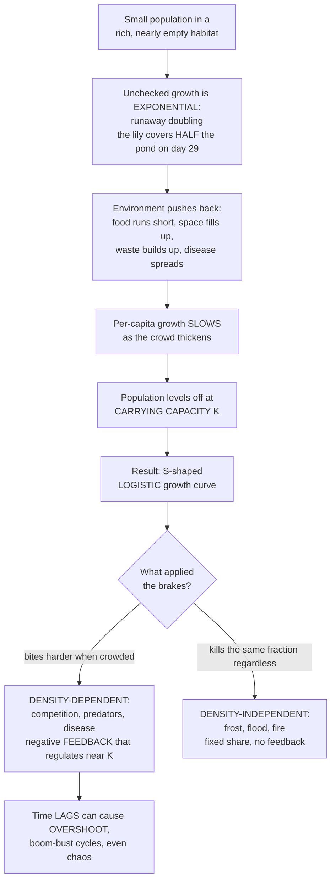

# 📈 Population Growth and Regulation

> [!abstract] TL;DR
> Left unchecked, a population grows **exponentially** — a runaway doubling driven by its **per-capita growth rate $r$** (the biotic potential), described by $dN/dt = rN$ with solution $N(t) = N_0 e^{rt}$. Nothing grows exponentially for long: as the crowd thickens, food runs short, space fills, waste builds up and disease spreads, so per-capita growth **slows** and the population levels off at the **carrying capacity $K$** — the sustainable maximum. This bends the J-curve into the S-shaped **logistic curve**, $dN/dt = rN\left(1 - N/K\right)$, whose growth *rate* peaks at $N = K/2$ (the basis of maximum sustainable yield). The brakes come in two flavours: **density-dependent** factors (competition, predation, disease — they bite *harder* when crowded, giving negative **feedback** that regulates the population around $K$) and **density-independent** factors (frost, flood, fire — they kill the same *fraction* regardless of density). Add a **time lag** and the population overshoots and oscillates; push the discrete version hard enough and it descends into **deterministic chaos**. These few equations are the quantitative foundation for predicting pest outbreaks, setting fishing quotas, rescuing endangered species, and grasping the human population's own trajectory.

---

## Intuition

**Analogy — the pond lily.** A pond lily doubles its coverage every day and blankets the whole pond in 30 days. On which day was the pond *half* covered? Not day 15 — **day 29**. That single question captures the terror of exponential growth: for 29 days the pond looks fine, then in one final doubling it is gone. Leave any population unchecked — bacteria dropped into fresh nutrient broth, rabbits released on a predator-free island — and it does exactly this: doubling and doubling in a runaway explosion, because the more individuals there are, the more births there are to add.

But nothing doubles forever, because **the environment pushes back**. Food runs short, space fills up, waste piles higher, disease spreads faster in the crowd. As the population gets denser, growth **slows** and finally levels off at the maximum the habitat can sustain — the **carrying capacity**. The runaway J bends over into a graceful **S-shaped (logistic) curve**: fast at first, then flattening into a plateau.

The forces that hit the brakes are **density-dependent** — they intensify the more crowded things get. Competitors fight harder for each scrap of food; predators concentrate wherever prey is thickest; epidemics rip through dense populations. This is a **negative feedback loop** that automatically reins the population back toward $K$. Other forces are **density-independent**: a hard frost or a flash flood kills the same *fraction* of the population whether it is sparse or packed. Understanding what makes populations grow and what stops them is the foundation of everything downstream — predicting a locust outbreak, setting a sustainable fishing quota, saving a species from extinction, or reading the trajectory of humanity itself.

---

## How It Works

### Core Mechanics

1. **A population is a dynamic quantity.** Its **size $N$** (number of individuals) and **density** (individuals per unit area) change through four demographic flows, summarised by **BIDE**: **B**irths and **I**mmigration add individuals; **D**eaths and **E**migration remove them. In a closed population, $dN/dt = B - D$, and dividing by $N$ gives the **per-capita growth rate $r = b - d$**.

2. **Unchecked, growth is exponential.** With constant per-capita birth and death rates, $dN/dt = rN$. Each individual contributes the same surplus, so the more individuals there are, the faster the total grows — a self-reinforcing (positive) feedback. The solution $N(t) = N_0 e^{rt}$ has a fixed **doubling time** $t_2 = \ln 2 / r$, independent of $N$.

3. **Resources are finite, so growth is density-dependent.** As $N$ rises, resources per capita fall, so the *realised* per-capita growth rate shrinks. The **logistic** model encodes this with a braking term: $dN/dt = rN\left(1 - N/K\right)$. When $N \ll K$ the bracket is near 1 (near-exponential); as $N \to K$ it goes to 0 (growth stalls).

4. **Carrying capacity is the equilibrium.** $K$ is the stable fixed point where births balance deaths. The population *rate* $dN/dt$ is maximised at the inflection point $N = K/2$, giving the S its steepest slope — the value harvesters target for **maximum sustainable yield**.

5. **Regulation is feedback.** Density-dependent factors form the negative feedback that pulls $N$ back toward $K$; density-independent factors merely perturb it. Add a **time lag** between crowding and its demographic effect and the smooth approach becomes **overshoot**, damped oscillation, or sustained cycles.

### Flow



---

## Key Concepts

### Secondary — the shapes and the words

- **Population size and density.** How many individuals, and how tightly packed. Both change over time as individuals are born, die, immigrate, or emigrate (**BIDE**).
- **Exponential (J-shaped) growth.** With unlimited resources a population doubles again and again — slow-looking at first, then explosive. Real but temporary: it shows up in invasions, algal blooms, and populations recovering from a crash.
- **Logistic (S-shaped) growth.** In the real world, growth starts fast, then slows, then flattens at a ceiling. That ceiling is the **carrying capacity ($K$)** — the largest population the environment can support long-term.
- **Two kinds of brakes.** **Density-dependent** factors (competition, predators, disease) get *stronger* as the population gets more crowded. **Density-independent** factors (a frost, a flood) hit hard no matter how many individuals there are.

### Undergraduate — the equations

- **Per-capita growth rate $r$** (the *intrinsic rate of increase* or **biotic potential**): the maximum per-individual surplus of births over deaths under ideal conditions.
- **Continuous exponential model:** $\dfrac{dN}{dt} = rN \;\Rightarrow\; N(t) = N_0 e^{rt}$. Doubling time $t_2 = \ln 2 / r$.
- **Discrete (geometric) model:** $N_{t+1} = \lambda N_t \;\Rightarrow\; N_t = N_0 \lambda^{t}$, where $\lambda$ is the finite rate of increase. For small growth, $\lambda \approx e^{r}$, i.e. $r \approx \ln \lambda$. Discrete models suit species with pulsed, seasonal reproduction.
- **Logistic model:** $\dfrac{dN}{dt} = rN\left(1 - \dfrac{N}{K}\right)$, with closed-form solution $N(t) = \dfrac{K}{1 + A e^{-rt}}$, where $A = (K - N_0)/N_0$.
- **The braking term $\left(1 - N/K\right)$** is the fraction of the environment's capacity still unused. The **realised per-capita rate** $\frac{1}{N}\frac{dN}{dt} = r\left(1 - N/K\right)$ declines *linearly* with density — the mathematical signature of density dependence.
- **Inflection at $N = K/2$:** the population's absolute growth rate $dN/dt$ is maximised at half of $K$ (value $rK/4$). This is why **maximum sustainable yield** in fisheries targets a stock held near half its unfished biomass.

### Graduate — regulation, lags, and chaos

- **The regulation debate.** *Density-dependent* factors (intraspecific competition, predation, parasitism/disease, territoriality, physiological stress) are the only ones that can *regulate* a population — return it toward an equilibrium — because their effect scales with $N$, providing negative feedback. *Density-independent* factors (weather, catastrophe) cause mortality and set the *level* of fluctuation but cannot stabilise. The historical Nicholson (regulation) vs Andrewartha–Birch (density-independent limitation) debate resolved into: most populations are *limited* by resources and *regulated* by density-dependent feedback, buffeted by density-independent noise.
- **Time lags and complex dynamics.** Real reproduction responds to *past* conditions. The **delayed logistic** (Hutchinson) $dN/dt = rN\left(1 - N(t-\tau)/K\right)$ produces **overshoot**, damped oscillation, or a stable **limit cycle** as the lag $\tau$ or $r$ grows — the mechanism behind many boom-and-bust population cycles.
- **The logistic map and deterministic chaos.** The discrete analogue $x_{n+1} = r\,x_n\left(1 - x_n\right)$ is deceptively simple yet, as $r$ rises past ~3.57, undergoes a **period-doubling cascade** into **chaos** — bounded, aperiodic, sensitively dependent on initial conditions. Robert May's 1976 demonstration that a one-line ecological model can behave chaotically reshaped how ecologists think about "noisy" field data.
- **Allee effects (positive density dependence).** At *low* density some populations grow *slower* or shrink — mates are hard to find, group defence and cooperative foraging collapse. Below a **critical threshold** the per-capita rate turns negative and the population spirals to extinction. This inverts the logistic assumption and is central to small-population conservation.
- **Stochasticity.** Beyond deterministic dynamics, **demographic stochasticity** (chance birth/death events, important when $N$ is small) and **environmental stochasticity** (year-to-year variation in $r$ and $K$) drive real populations and their extinction risk.

---

## Python Demo

```python
# Population growth and regulation:
#   Panel 1 - EXPONENTIAL vs LOGISTIC growth on the same axes (mark K and K/2)
#   Panel 2 - DENSITY DEPENDENCE: per-capita growth rate falls linearly with N
#   Panel 3 - TIME LAG -> OVERSHOOT and damped oscillation around K
import numpy as np
import matplotlib.pyplot as plt

# ------------------------------------------------------------------ parameters
r   = 0.8        # intrinsic per-capita growth rate
K   = 1000.0     # carrying capacity
N0  = 10.0       # initial population size
T   = 24.0       # total time
dt  = 0.01
steps = int(T / dt)
t = np.linspace(0.0, T, steps + 1)

# ------------------------------------ (a) exponential vs logistic (Euler steps)
N_exp = np.empty(steps + 1); N_exp[0] = N0
N_log = np.empty(steps + 1); N_log[0] = N0
for i in range(steps):
    N_exp[i + 1] = N_exp[i] + dt * (r * N_exp[i])                         # dN/dt = rN
    N_log[i + 1] = N_log[i] + dt * (r * N_log[i] * (1.0 - N_log[i] / K))  # dN/dt = rN(1 - N/K)

# ------------------------------ (b) per-capita growth rate vs density (logistic)
N_axis = np.linspace(0.0, K, 200)
per_capita = r * (1.0 - N_axis / K)          # declines linearly -> density dependence

# ------------------------------ (c) delayed logistic -> overshoot / oscillation
tau = 2.6                                    # reproductive time lag
lag = int(tau / dt)
N_lag = np.empty(steps + 1); N_lag[:] = N0
for i in range(steps):
    delayed = N_lag[i - lag] if i >= lag else N0
    N_lag[i + 1] = N_lag[i] + dt * (r * N_lag[i] * (1.0 - delayed / K))

# ------------------------------------------------------------------------- plot
fig, ax = plt.subplots(1, 3, figsize=(16, 4.6))

ax[0].plot(t, N_exp, color="crimson",     lw=2, label="Exponential  dN/dt = rN")
ax[0].plot(t, N_log, color="seagreen",    lw=2, label="Logistic  dN/dt = rN(1 - N/K)")
ax[0].axhline(K,     color="black", ls="--", lw=1, label=f"K = {K:.0f}")
ax[0].axhline(K / 2, color="gray",  ls=":",  lw=1, label="K/2  (max growth rate, MSY)")
ax[0].set_ylim(0, 2.2 * K)
ax[0].set_xlabel("Time"); ax[0].set_ylabel("Population size N")
ax[0].set_title("Exponential vs Logistic growth"); ax[0].legend(fontsize=8); ax[0].grid(alpha=0.3)

ax[1].plot(N_axis, per_capita, color="royalblue", lw=2)
ax[1].axhline(0, color="black", lw=0.8)
ax[1].axvline(K, color="black", ls="--", lw=1, label=f"K = {K:.0f}")
ax[1].set_xlabel("Population size N"); ax[1].set_ylabel("Per-capita rate  (1/N) dN/dt")
ax[1].set_title("Density dependence: per-capita rate falls as N rises")
ax[1].legend(fontsize=8); ax[1].grid(alpha=0.3)

ax[2].plot(t, N_lag, color="darkorchid", lw=2, label=f"Delayed logistic  (lag tau = {tau})")
ax[2].axhline(K, color="black", ls="--", lw=1, label=f"K = {K:.0f}")
ax[2].set_xlabel("Time"); ax[2].set_ylabel("Population size N")
ax[2].set_title("Time lag -> overshoot and oscillation"); ax[2].legend(fontsize=8); ax[2].grid(alpha=0.3)

plt.tight_layout()
plt.show()

# Sanity check: the logistic curve should settle near K, the exponential should not
print(f"Logistic N at t=T:  {N_log[-1]:.1f}   (K = {K:.0f})")
print(f"Exponential N at t=T: {N_exp[-1]:.3e}  (unbounded)")
```

The first panel shows the two models starting together and then diverging violently as density rises: the exponential J rockets off the top of the plot while the logistic S bends over and settles at $K$. The second panel makes the mechanism explicit — the per-capita growth rate falls in a straight line to zero at $K$. The third shows that a reproductive **lag** makes the population sail past $K$, then oscillate back down toward it.

---

## Real-World Applications

> **Fisheries and maximum sustainable yield.** Because logistic growth peaks at $N = K/2$, the largest catch a stock can replace comes from holding it near half its unfished biomass. Fishing a stock *below* $K/2$ *reduces* future yield — the counterintuitive trap behind the 1992 collapse of the Atlantic cod fishery off Newfoundland, which has still not recovered.

- **Pest and invasive-species management.** r-selected invaders released without their predators — rabbits in Australia, zebra mussels in the Great Lakes, cane toads — display textbook near-exponential blow-ups. Control aims to keep effective $r$ negative or hold the population below outbreak density.
- **Epidemiology and outbreaks.** Early-stage disease spread and algal blooms are effectively exponential; density-dependent depletion of susceptibles (or nutrients) is what eventually flattens the curve — the same logistic logic under a different name.
- **Conservation of small populations.** Endangered species with **Allee effects** can collapse once they fall below a critical density even if habitat remains, because mates and cooperative behaviours vanish — a decisive consideration in captive-breeding and reintroduction programs.
- **The human population.** Twentieth-century human growth was roughly exponential (global $r$ peaked around 1968); it is now decelerating as fertility falls. Whether humanity approaches a logistic-style $K$ set by planetary limits, and where that $K$ lies, is one of the defining questions of the Anthropocene.

---

## Common Pitfalls

- **"Exponential means fast."** Exponential describes the *shape* — a constant per-capita rate — not the speed. A population with tiny $r$ still grows exponentially, just slowly. The hallmark is **acceleration** and a fixed doubling time, not magnitude. (The pond looked fine until day 29.)
- **"Carrying capacity is a fixed number of nature."** $K$ is an emergent property of resources and conditions; it shifts with season, disturbance, and the population's own impact on its habitat. Treating it as a constant is a modelling convenience, not a fact.
- **"Density-independent factors regulate populations."** A frost or flood *kills* individuals but does not *regulate*: regulation requires negative feedback that intensifies with density. Density-independent events set the noise; only density-dependent feedback provides the restoring force toward $K$.
- **"The logistic always glides smoothly up to $K$."** Time lags produce overshoot, damped oscillation, limit cycles, and — in the discrete map — chaos. Smooth approach is the idealised exception, not the rule.
- **"More individuals always means faster per-capita growth."** Below a threshold, **Allee effects** reverse this: sparse populations can grow *slower* and slide to extinction. Assuming standard density dependence at low $N$ can badly misjudge extinction risk.
- **"$r$ from a discrete model equals $r$ from a continuous one."** The finite rate $\lambda$ and the instantaneous rate $r$ are related by $r = \ln\lambda$, not $r = \lambda - 1$; mixing them up mis-projects populations, especially at high growth.

---

## Related Concepts

- [[Population_Ecology]] — the broader Biology-vault companion covering dispersion, mark-recapture, survivorship curves, and r/K life histories that this note formalises quantitatively.
- [[First_Order_ODEs]] — the logistic equation is a separable first-order ODE; that note derives the closed-form solution $N(t) = K / (1 + A e^{-rt})$ used here.
- [[Feedback_Loops_and_Causality]] — density dependence *is* negative feedback; exponential growth *is* positive (reinforcing) feedback. Population regulation is a canonical worked example of both.
- [[Chaos_Theory_and_Sensitive_Dependence]] — the discrete logistic map's period-doubling route to deterministic chaos (May 1976) is the bridge from this note's dynamics to complexity theory.
- [[Sustainability_and_Planetary_Boundaries]] — connects carrying capacity, overshoot, and limits-to-growth to the human population and the planet's finite $K$.

Within this vault, population growth is the quantitative backbone for its siblings. Levels_of_Ecological_Organization places the population between the individual and the community. Life_History_Strategies_and_Demography unpacks the birth and death schedules behind $r$. Predator_Prey_and_Population_Interactions turns the single-species logistic into coupled two-species dynamics. Population_Viability_and_Small_Population_Biology extends the Allee-effect and stochasticity threads to extinction risk, and Overexploitation_and_Sustainable_Harvesting builds directly on the $K/2$ maximum-sustainable-yield result.

---

## Review Questions

1. **(Secondary)** A pond lily doubles its coverage each day and fills the pond on day 30. On what day was the pond half covered, and what does your answer reveal about the danger of exponential growth? Sketch how the curve would change if the pond imposed a carrying capacity.
2. **(Undergraduate)** A population has $r = 0.5\,\text{yr}^{-1}$ and $K = 1000$. Compute $dN/dt$ under both the exponential and logistic models at $N = 50$ and at $N = 500$. Explain why the two models nearly agree at $N = 50$ but diverge sharply at $N = 500$, and identify the population size at which the logistic *rate* is greatest.
3. **(Graduate)** Distinguish density-dependent from density-independent factors and explain precisely why only the former can *regulate* a population around $K$. Then describe two mechanisms — one involving a time lag, one involving the discrete logistic map — by which a population governed by density-dependent feedback can nonetheless fail to settle smoothly at $K$.

---

## Sources

- Gotelli, N. J. (2008). *A Primer of Ecology* (4th ed.). Sinauer Associates.
- Begon, M., Townsend, C. R., & Harper, J. L. (2006). *Ecology: From Individuals to Ecosystems* (4th ed.). Blackwell Publishing.
- Ricklefs, R. E., & Relyea, R. (2018). *The Economy of Nature* (8th ed.). W. H. Freeman.
- May, R. M. (1976). "Simple mathematical models with very complicated dynamics." *Nature*, 261, 459–467.

---

#ecology #population-growth #logistic-growth #carrying-capacity #density-dependence
