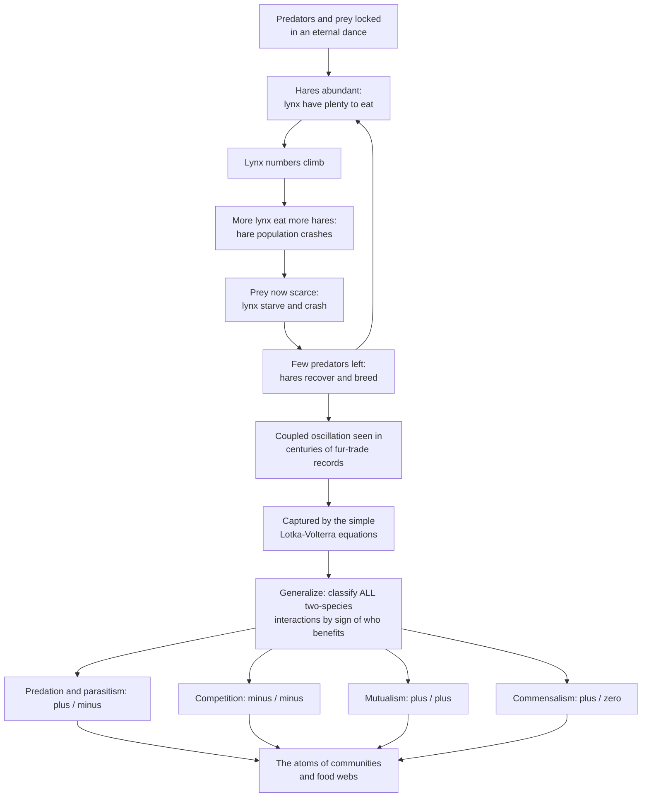

# 🦊 Predator-Prey and Population Interactions

> [!abstract] TL;DR
> Two species that share a landscape push and pull on each other's numbers. The most famous case is **predator and prey**: prey feed predators, predators eat prey, so their populations chase each other up and down in a **coupled oscillation** — the lynx–hare cycle written into centuries of fur-trade records and captured by the deceptively simple **Lotka–Volterra equations** that founded theoretical ecology. Predation is just one cell of a larger table: ecologists classify *every* two-species relationship by the **sign of its effect on each partner** — predation and parasitism ($+/-$), competition ($-/-$), mutualism ($+/+$), commensalism ($+/0$). These pairwise interactions are the atoms from which communities and food webs are built, and getting them right underpins pest control, fisheries, biological control, and rewilding.

---

## Intuition

**Analogy:** Predators and their prey are locked in an eternal dance that makes their populations rise and fall in linked steps. Picture lynx and snowshoe hares in the northern boreal forest. When hares are abundant, lynx have plenty to eat, so lynx numbers climb — but more lynx eat more hares, so the hare population crashes — which starves the lynx, so lynx numbers crash too — which releases the surviving hares to breed and recover — and the whole cycle begins again. Predator peaks chase prey peaks around and around, always a beat behind, a coupled oscillation that shows up in real data spanning more than a century of Hudson's Bay Company fur returns.

That single dance is the flagship, but it is only one flavor of how two species can affect each other. Ecologists map **all** the flavors with a simple bookkeeping trick: write down whether each partner benefits ($+$), is harmed ($-$), or is unaffected ($0$). Predation and parasitism are $+/-$ (one wins, one loses); competition is $-/-$ (both harmed as they fight over the same limited resource); mutualism is $+/+$ (both benefit — like bees and flowers); commensalism is $+/0$ (one benefits, the other shrugs). These pairwise sign-pairs are the atoms from which whole communities and food webs assemble — and they carry huge real-world stakes: predators *regulate* prey, so pull the wolves out of a forest and the deer explode and strip it bare.

---

## How It Works

### Core mechanics

1. **The coupled loop.** Prey abundance raises predator birth rate (more food → more predators). Rising predators raise prey death rate (more mouths → fewer prey). Falling prey then starves predators back down, which *releases* the prey to rebound. Each cause is delayed, so instead of settling, the system overshoots and **oscillates**.
2. **The lag.** Because a predator population can only grow *after* it has eaten well, the predator peak always trails the prey peak by roughly a quarter-cycle. This phase lag is the fingerprint of true predator-driven coupling.
3. **The Lotka–Volterra model.** The simplest math that produces the loop: prey grow exponentially, predators kill by **mass action** (encounters $\propto$ prey $\times$ predator), predators convert eaten prey into new predators, and predators die at a constant rate.
   $$\frac{dV}{dt} = aV - bVP \qquad \frac{dP}{dt} = c\,bVP - dP$$
   where $V$ = prey (victims), $P$ = predators, $a$ = prey growth, $b$ = attack rate, $c$ = conversion efficiency, $d$ = predator death rate. This yields **neutral cycles** — closed orbits whose size is set entirely by the starting point.
4. **Adding realism.** Real cycles are not neutral. Give prey a **carrying capacity** $K$ (logistic growth) and the cycle *damps* to a stable equilibrium. Give predators a saturating **functional response** (Type II) and the cycle can *destabilize* — the paradox of enrichment.
5. **The sign framework.** Zoom out from predation to *all* interactions by tabulating the effect on each partner: predation/parasitism ($+/-$), competition ($-/-$), mutualism ($+/+$), commensalism ($+/0$), amensalism ($-/0$), neutralism ($0/0$).

### Flow / Architecture



---

## Key Concepts

### Secondary
- **Predator and prey** — a predator hunts and eats another organism (the prey). Lynx eat hares; foxes eat rabbits; ladybirds eat aphids.
- **The predator–prey cycle** — predator and prey numbers rise and fall together, the predator always a step behind: lots of prey → more predators → fewer prey → fewer predators → prey recover.
- **Kinds of relationships** — predation (one eats another), competition (both want the same resource), mutualism (both help each other, like bees and flowers), and commensalism (one benefits, the other is unaffected).
- **Predators keep prey in check** — remove the top predator and the prey can explode. Remove the wolves and the deer multiply until they strip the forest of young trees.

### Undergraduate
- **The sign framework ($+/-/0$)** — classify any interspecific interaction by its effect on each partner: **predation/herbivory/parasitism** ($+/-$, a consumer–resource link), **competition** ($-/-$, shared limited resource), **mutualism** ($+/+$), **commensalism** ($+/0$), **amensalism** ($-/0$), and **neutralism** ($0/0$).
- **Lotka–Volterra model** — exponential prey growth, mass-action predation, a predator numerical response, and constant predator death. It produces **neutral oscillations** and captures the predator lag, but its assumptions (no prey self-limitation, linear predation, no age structure) are unrealistic.
- **Carrying-capacity refinement** — replace exponential prey growth with logistic growth ($K$). Prey self-limitation **damps** the oscillation to a stable equilibrium (a spiral into a fixed point), a far more realistic outcome.
- **Functional responses (Holling)** — how per-predator kill rate scales with prey density: **Type I** (linear), **Type II** (saturating — handling time limits intake at high prey density), **Type III** (sigmoid — low predation at low prey density, e.g. from prey refuges or predator switching). Type II tends to destabilize; Type III can stabilize at low densities.
- **Keystone predation & trophic cascades** — a predator whose removal restructures the whole community: wolves → elk → aspen and willow; sea otters → urchins → kelp forests. Losing the predator cascades down through multiple trophic levels.
- **Numerical vs functional response** — the numerical response is the change in *predator numbers* with prey density; the functional response is the change in *per-predator consumption*. Both feed the coupling.

### Graduate
- **Stability analysis** — linearize about the equilibrium and read the Jacobian's eigenvalues. Pure Lotka–Volterra has purely imaginary eigenvalues (a **neutral center**: structurally unstable, amplitude fixed by initial conditions). Adding $K$ moves them into the left half-plane (stable spiral); a Type II response can push them right, birthing a **stable limit cycle** (Rosenzweig–MacArthur).
- **The paradox of enrichment** — increasing prey carrying capacity $K$ (enrichment) can *destabilize* an otherwise stable predator–prey system, driving ever-larger oscillations that risk extinction — a counterintuitive result with real consequences for eutrophication and fertilized systems.
- **Coevolution and the Red Queen** — predators and prey (and hosts and parasites) impose reciprocal selection: faster prey select faster predators, better defenses select better offenses. The evolutionary **arms race** means each species must keep evolving just to hold its ground (Red Queen dynamics).
- **Host–parasite / host–pathogen dynamics** — a $+/-$ interaction whose math overlaps epidemic (SIR-type) models; parasites regulate host abundance and can drive cycles just as predators do.
- **Community embedding** — pairwise signs are the atoms, but real dynamics include **apparent competition** (two prey sharing a predator), **intraguild predation**, and indirect effects that only emerge in the full food web.
- **Empirical dissection of the hare cycle** — the classic 10-year snowshoe hare cycle is not pure Lotka–Volterra; the Krebs et al. (1995) factorial field experiment showed it is driven jointly by **food supply and predation** (with maternal/stress effects), a caution against reading a single mechanism off a matching pair of curves.

---

## Python Demo

```python
# Predator-prey dynamics from the simplest model to realistic refinements:
#   (A) LOTKA-VOLTERRA time series  -> coupled cycles, predator peak LAGS prey
#   (B) PHASE PLANE                 -> nested NEUTRAL orbits (amplitude set by start)
#   (C) PREY CARRYING CAPACITY K    -> logistic prey DAMPS to a stable equilibrium
#   (D) HOLLING FUNCTIONAL RESPONSES-> Type I / II / III kill-rate curves
import numpy as np
import matplotlib.pyplot as plt

# ---- RK4 integrator for a 2D system dz/dt = f(z) (LV drifts badly under Euler) ----
def rk4(f, z0, t):
    z = np.zeros((len(t), len(z0)))
    z[0] = z0
    for i in range(len(t) - 1):
        h = t[i+1] - t[i]
        k1 = f(z[i]); k2 = f(z[i] + 0.5*h*k1)
        k3 = f(z[i] + 0.5*h*k2); k4 = f(z[i] + h*k3)
        z[i+1] = z[i] + (h/6.0)*(k1 + 2*k2 + 2*k3 + k4)
    return z

# ---- Classic Lotka-Volterra: dV/dt = a*V - b*V*P ; dP/dt = c*b*V*P - d*P ----
a, b, c, d = 1.0, 0.1, 0.5, 0.75          # growth, attack, conversion, death
prey_eq, pred_eq = d / (c*b), a / b        # coexistence equilibrium (15, 10)

def lv(z):
    V, P = z
    return np.array([a*V - b*V*P, c*b*V*P - d*P])

t = np.linspace(0, 40, 8000)
sol = rk4(lv, [20.0, 4.0], t)
prey, pred = sol[:, 0], sol[:, 1]

# ---- Same model from several starts -> nested closed (neutral) orbits ----
orbits = [rk4(lv, [prey_eq, p0], t) for p0 in (3, 5, 7, 9)]

# ---- Add prey carrying capacity K: dV/dt = a*V*(1 - V/K) - b*V*P ----
K = 40.0
def lv_logistic(z):
    V, P = z
    return np.array([a*V*(1 - V/K) - b*V*P, c*b*V*P - d*P])
sol_log = rk4(lv_logistic, [20.0, 4.0], t)

# ---- Holling functional responses: per-predator kill rate vs prey density N ----
N = np.linspace(0, 60, 400)
atk, hT = 0.08, 0.3
type1 = np.minimum(atk*N, 4.0)                 # linear, then a satiation ceiling
type2 = atk*N / (1 + atk*hT*N)                 # saturating (handling time)
type3 = atk*N**2 / (1 + atk*hT*N**2)           # sigmoid (refuge / switching)

# ---- Plot ----
fig, ax = plt.subplots(2, 2, figsize=(13, 9))

ax[0,0].plot(t, prey, color="seagreen", lw=2, label="Prey (hares)")
ax[0,0].plot(t, pred, color="firebrick", lw=2, label="Predator (lynx)")
ax[0,0].set_title("(A) Lotka-Volterra cycles: predator peak LAGS prey")
ax[0,0].set_xlabel("Time"); ax[0,0].set_ylabel("Population")
ax[0,0].set_xlim(0, 40); ax[0,0].legend(); ax[0,0].grid(alpha=0.3)

for orb in orbits:
    ax[0,1].plot(orb[:,0], orb[:,1], lw=1.3)
ax[0,1].plot(prey_eq, pred_eq, "ko", ms=7, label="Neutral center")
ax[0,1].set_title("(B) Phase plane: nested NEUTRAL cycles")
ax[0,1].set_xlabel("Prey"); ax[0,1].set_ylabel("Predator")
ax[0,1].legend(); ax[0,1].grid(alpha=0.3)

ax[1,0].plot(sol_log[:,0], sol_log[:,1], color="purple", lw=1.3)
ax[1,0].plot(sol_log[0,0], sol_log[0,1], "go", label="start")
ax[1,0].plot(sol_log[-1,0], sol_log[-1,1], "r*", ms=14, label="stable equilibrium")
ax[1,0].set_title("(C) Prey carrying capacity K damps to a STABLE point")
ax[1,0].set_xlabel("Prey"); ax[1,0].set_ylabel("Predator")
ax[1,0].legend(); ax[1,0].grid(alpha=0.3)

ax[1,1].plot(N, type1, lw=2, label="Type I (linear)")
ax[1,1].plot(N, type2, lw=2, label="Type II (saturating)")
ax[1,1].plot(N, type3, lw=2, label="Type III (sigmoid)")
ax[1,1].set_title("(D) Holling functional responses")
ax[1,1].set_xlabel("Prey density N"); ax[1,1].set_ylabel("Kills per predator")
ax[1,1].legend(); ax[1,1].grid(alpha=0.3)

plt.tight_layout(); plt.show()

# ---- Quantify the lag and the damped equilibrium ----
prey_peak = t[np.argmax(prey[:2000])]      # first peak within t < 10
pred_peak = t[np.argmax(pred[:2000])]
print(f"Neutral equilibrium: prey* = {prey_eq:.1f}, predator* = {pred_eq:.1f}")
print(f"First prey peak t = {prey_peak:.2f}, predator peak t = {pred_peak:.2f} "
      f"(predator lags by {pred_peak - prey_peak:.2f})")
print(f"Logistic model settles near prey = {sol_log[-1,0]:.1f}, "
      f"predator = {sol_log[-1,1]:.1f}")
```

Panel **(A)** shows the coupled cycle with the predator curve trailing the prey curve — the phase lag that signals genuine predator–prey coupling and matches the lynx–hare fur record. Panel **(B)** exposes the model's dirty secret: the orbits are *neutral* closed loops whose amplitude is fixed by where you start, which is why raw Lotka–Volterra is a beautiful cartoon rather than a predictive tool. Panel **(C)** adds prey self-limitation ($K$) and the wobble spirals into a stable equilibrium — realism as a damper. Panel **(D)** shows how the *shape* of the predator's response to prey density (linear, saturating, sigmoid) governs whether the whole system stabilizes or blows up.

---

## Real-World Applications

- **Biological pest control** — releasing a predator or parasitoid to suppress a pest is applied predator–prey dynamics. The classic 1888 introduction of the **vedalia beetle** (*Rodolia*) crushed the cottony-cushion scale devastating California citrus; parasitoid wasps (*Aphytis*, *Encarsia*) protect crops today. The math tells you the release ratio and whether the pair will cycle or settle.
- **Fisheries management** — predator–prey and logistic models set catch quotas and maximum sustainable yield; ignoring the coupling between predator fish, forage fish (anchovy/sardine), and fishing pressure has repeatedly triggered collapses.
- **Rewilding and trophic cascades** — reintroducing **wolves to Yellowstone (1995)** relaxed elk browsing, letting aspen, willow, and beaver recover and even reshaping stream channels — the textbook demonstration that removing (or restoring) a top predator ripples through the whole community.
- **Kelp forest conservation** — **sea otters** eat sea urchins that graze kelp; where otters were hunted out, urchin barrens replaced kelp forests. Protecting the predator protects an entire habitat, a keystone-predation cascade.
- **Invasive-species impact** — an introduced predator meeting naive prey with no coevolved defenses can drive extinctions: the **brown tree snake** erased most of Guam's forest birds; cane toads poison Australian predators. These are predator–prey (and coevolution) failures at continental scale.

---

## Common Pitfalls

- **Treating Lotka–Volterra as predictive.** Its cycles are *neutral* (structurally unstable) — amplitude is set by initial conditions and any perturbation shifts the orbit permanently. Use it for intuition, not forecasting; real systems need $K$, functional responses, and stochasticity.
- **Reading one mechanism off matching curves.** Two beautifully out-of-phase population series do *not* prove predation drives the cycle. The snowshoe hare cycle turned out to be food *and* predation *and* physiological stress (Krebs et al. 1995). Correlation of oscillations is not a mechanism.
- **The paradox of enrichment surprise.** Boosting prey carrying capacity feels stabilizing but can *destabilize* the system into extinction-scale swings. Enrichment (fertilization, eutrophication) is not automatically good for a predator–prey pair.
- **Ignoring the functional response.** Assuming predators kill in simple proportion to prey (Type I) misses satiation. A Type II saturating response can flip a stable system into sustained limit cycles; a Type III can rescue prey at low density via refuges or predator switching.
- **Numerical artifacts.** Euler integration makes Lotka–Volterra spuriously spiral outward, faking instability that is a bug, not biology. Use RK4 or an implicit/symplectic scheme (this demo uses RK4).
- **Confusing numerical and functional responses.** They are different curves — one is how predator *numbers* track prey, the other is how *per-capita consumption* tracks prey density. Both matter, and conflating them muddles any stability argument.

---

## Related Concepts

This note is the population-interaction cornerstone of the vault, and it reaches across biology, mathematics, systems science, and evolution.

- [[Population_Ecology]] — the single-species growth and demography that predation *regulates*; predator–prey dynamics are what happens when two such populations are coupled.
- [[Community_Ecology]] — Biology's community level, where these pairwise $+/-/0$ interactions assemble into food webs, niches, and the balance of whole assemblages.
- [[Systems_of_ODEs]] — the mathematics of coupled differential equations and **phase-plane analysis**; Lotka–Volterra is the canonical nonlinear ODE system, and eigenvalues of its Jacobian decide stability.
- [[Nonlinearity_and_Feedback]] — predator–prey is a textbook **balancing feedback loop with delay**, exactly the ingredient that turns a regulating loop into a sustained oscillation.
- [[Dynamical_Systems_and_Attractors]] — neutral centers, stable spirals, and **limit cycles** are the attractor types this model moves through as you add carrying capacity and functional responses.
- [[Host_Pathogen_and_Coevolution]] — host–parasite dynamics are the $+/-$ sibling of predation, and both drive the **Red Queen** evolutionary arms race between attacker and defender.

Within this vault, this note sits alongside its foundational siblings **Population_Growth_and_Regulation** (the single-species engine that predation modulates) and **Life_History_Strategies_and_Demography** (how age structure and reproductive schedules shape the dynamics), and it feeds forward into the community section — **Community_Ecology_and_Species_Interactions** (the full interaction table), **Competition_and_Niche_Theory** (the $-/-$ interaction and resource partitioning), and **Food_Webs_and_Trophic_Dynamics** (where trophic cascades and keystone predation play out) — all reachable from the **Ecology_and_Conservation_Overview** hub.

---

## Review Questions

1. **Secondary** — In the lynx–hare cycle, why does the number of lynx keep rising for a while *after* the number of hares has already started to fall? Explain the delay in plain language.
2. **Undergraduate** — Write down the Lotka–Volterra predator–prey equations and identify what each term means. Then explain what changes when you give the prey a carrying capacity $K$: what happens to the cycles, and why?
3. **Graduate** — You observe a predator–prey system that cycles with growing amplitude after a lake is fertilized. Name the phenomenon, explain via functional response and stability (Jacobian/eigenvalue) reasoning why enrichment can *destabilize* the system, and describe one feature (e.g. a Type III response or a prey refuge) that could restore stability.

---

## Sources

- Gotelli, N. J. — *A Primer of Ecology* (Sinauer). Clear derivations of Lotka–Volterra predation, competition, and stability analysis.
- Begon, M., Townsend, C. R., & Harper, J. L. — *Ecology: From Individuals to Ecosystems* (Blackwell). Comprehensive treatment of interspecific interactions and functional responses.
- Lotka, A. J. — *Elements of Physical Biology* (1925); Volterra, V. — "Fluctuations in the abundance of a species considered mathematically," *Nature* (1926). The founding predator–prey papers.
- Holling, C. S. — "The components of predation as revealed by a study of small-mammal predation," *The Canadian Entomologist* (1959). Origin of the Type I/II/III functional responses.
- Krebs, C. J., et al. — "Impact of food and predation on the snowshoe hare cycle," *Science* 269:1112–1115 (1995). The factorial field test dissecting the iconic 10-year cycle.

---

#ecology #predator-prey #lotka-volterra #species-interactions #trophic-cascade
