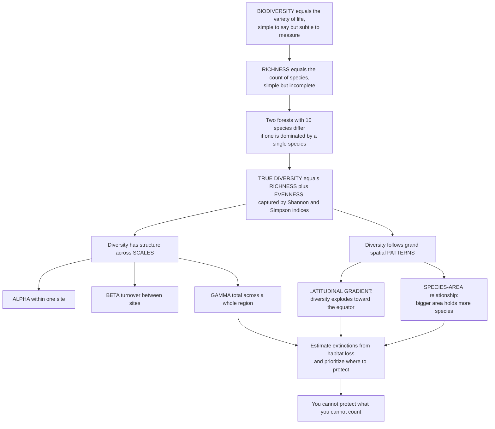

# 🌈 Biodiversity and Species Richness

> [!abstract] TL;DR
> **Biodiversity** — the variety of life — sounds simple, but measuring it well is surprisingly subtle, and getting it right is the foundation of conservation. The crudest measure is **species richness**: just count the species. But that misses **evenness** — two forests with 10 species each are not equally diverse if one is dominated by a single species and the other splits abundance evenly. **True diversity combines richness and evenness**, captured by indices like **Shannon** and **Simpson** and unified by **Hill numbers**. Diversity also has structure across scales: within a site (**alpha**), the turnover between sites (**beta**), and the total across a region (**gamma**). And it obeys ancient, striking **patterns** — the **latitudinal gradient** (life explodes toward the equator) and the **species–area relationship** (bigger areas hold more species, in a predictable power law that underpins extinction estimates from habitat loss). This is the measurement-and-patterns view of biodiversity: you cannot protect, prioritize, or even mourn what you cannot count.

---

## Intuition

**Analogy:** Imagine two orchestras, each with exactly ten instruments. In the first, all ten play at equal volume — you hear a full, balanced ensemble. In the second, a single tuba blasts at 91% of the total sound while the other nine instruments are barely audible. Both have the same *number* of instruments (the same **richness**), yet nobody would call them equally rich in sound. The first is more *diverse* in the way that matters — its variety is actually expressed. That missing ingredient is **evenness**: how equitably the total is shared among the parts.

That is the whole subtlety of biodiversity in one image. **Species richness** is just the instrument count; **true diversity** blends richness with evenness, and that is exactly what indices like Shannon and Simpson measure. Now zoom out. Biodiversity has *structure at different scales* — the variety within one meadow (**alpha**), how sharply the species swap out as you walk to the next meadow (**beta**), and the grand total across the whole region (**gamma**). And nature paints biodiversity onto the map in bold, ancient strokes: the **latitudinal gradient** — a few hectares of Amazon rainforest hold more tree species than all of temperate North America, and diversity mysteriously thins toward the poles (one of the oldest unsolved puzzles in ecology) — and the **species–area relationship**, the reliable rule that bigger areas hold more species, which lets us estimate how many species a shrinking forest will lose. Understanding what biodiversity *is*, how to *measure* it, and *where* it lives is the bedrock of conservation, because we cannot protect what we cannot count.

---

## How It Works

### Core mechanics

Biodiversity is measured, not merely admired. Doing it rigorously means separating three questions — *how much variety is here, how is it spread, and how does it change across space* — and knowing the patterns that govern where variety concentrates.

1. **Richness is the count, and it is sample-size-dependent.** Species richness (**S**) is simply the number of species present. But you will always find more species the more you look, so a raw count from a small sample understates diversity and cannot be compared fairly to a bigger sample. **Rarefaction** (statistically down-sampling the larger dataset) and **extrapolation** put counts on equal footing before comparison.
2. **Evenness captures how abundance is shared.** A community where all species are equally common is maximally even; one dominated by a single species is highly uneven. Evenness is what richness alone throws away, and it is the reason the two "10-species" forests are not equally diverse.
3. **Diversity indices combine richness and evenness into one number.** The **Shannon index** H' is the entropy of the abundance distribution — mathematically identical to Shannon entropy from information theory — weighting rare and common species relatively evenly. The **Simpson index** measures the probability that two randomly drawn individuals belong to the same species, so it is dominated by the common species. **Hill numbers** unify them as the *effective number of species* — the count of equally-common species that would give the same index value — indexed by a parameter q that tunes how much rare species count.
4. **Species-abundance distributions describe the whole community.** Ranking species from most to least abundant gives a **rank-abundance (Whittaker) curve**: a few common species and a long tail of rare ones, well described by log-normal or geometric distributions. The steepness of the curve *is* evenness made visible.
5. **Diversity is scaled by Whittaker's alpha, beta, gamma.** **Alpha** is local within-site diversity; **gamma** is the total for a whole region; **beta** is the *turnover* between sites — how much the species list changes as you move across the landscape. Roughly, gamma reflects both the average local richness and how different sites are from one another, so high beta means each site adds new species to the regional pool.
6. **Grand spatial patterns govern where diversity lives.** The **latitudinal diversity gradient** — richness rising dramatically toward the equator — is the most prominent global pattern, with competing explanations (more energy and productivity, more evolutionary time and climatic stability, larger tropical area, faster speciation rates) still debated. The **species–area relationship**, S = cA^z, is a power law: larger areas hold more species along a straight line in log-log space. It anchors **island biogeography** and lets ecologists estimate extinctions from **habitat loss** — shrink an area to a fraction f of its original size and the fraction of species expected to persist is about f^z.

### Flow / Architecture



---

## Key Concepts

### Secondary
- **Biodiversity** — the variety of life in a place: how many different kinds of living things there are, and how they are mixed.
- **Species richness** — the simplest measure of biodiversity: just the number of different species you can count.
- **Evenness** — whether the species are shared out equally or one species hogs everything. Ten species split evenly is "more diverse" than ten where one dominates.
- **Diversity index** — a single number, like the Shannon or Simpson index, that combines *how many* species with *how evenly* they are spread.
- **The equator is the most diverse place on Earth** — rainforests near the equator hold far more species than forests near the poles. A few hectares of the Amazon can beat a whole continent.

### Undergraduate
- **Richness vs evenness, and why diversity is not just a count** — two communities with identical richness can have very different diversity because abundance can be even or dominated; diversity indices exist precisely to capture that difference.
- **Shannon and Simpson indices** — Shannon H' = −Σ pᵢ ln pᵢ is the entropy of the relative abundances pᵢ and weights rare species relatively strongly; Simpson's D = Σ pᵢ² is the probability two random individuals are the same species and is driven by the common ones. Report **1−D** (Gini-Simpson) or **1/D** (inverse Simpson) so that bigger means more diverse.
- **Hill numbers (effective number of species)** — ⁰D = richness, ¹D = exp(H') is the exponential of Shannon, ²D = 1/D is inverse Simpson. All are on the intuitive "number of equally-common species" scale, so a community of 10 evenly-shared species has ¹D = ²D = 10, while a dominated one may have ¹D near 1.6 despite the same richness of 10.
- **Rarefaction** — because richness grows with sampling effort, comparing raw counts is unfair; rarefaction interpolates every sample down to a common number of individuals (or a common coverage) so richness can be compared honestly.
- **Species–area relationship** — S = cA^z, a power law (log S linear in log A) with the exponent z typically 0.15–0.35; it is the empirical backbone of island biogeography and of extinction estimates from habitat loss.

### Graduate
- **Whittaker's alpha–beta–gamma decomposition** — gamma (regional) diversity partitions into alpha (mean local) and beta (turnover). Multiplicative (γ = α × β) and additive (γ = α + β) partitions coexist; modern approaches partition **Hill numbers**, giving a beta with a clean interpretation as the effective number of distinct communities.
- **The parameter q and diversity profiles** — Hill numbers ^qD form a continuous family: q = 0 ignores abundance (richness), q = 1 weights species by frequency (Shannon), q = 2 favors dominants (Simpson). Plotting ^qD against q gives a **diversity profile** that summarizes a community's whole richness-evenness structure and can reveal when two communities' rankings cross.
- **Beyond taxonomic diversity** — **functional diversity** (spread of traits) and **phylogenetic diversity** (summed evolutionary branch length, e.g. Faith's PD) often matter more for ecosystem function and conservation than species counts, because they measure how *different* the species are, not just how *many*.
- **Explanations for the latitudinal gradient** — no single mechanism has won: the **energy/productivity** hypothesis (more available energy supports more species), the **time-and-stability** hypothesis (tropics are older and climatically more stable, accumulating species), the **species-energy/area** and **diversification-rate** hypotheses (faster speciation or slower extinction in the tropics). Hillebrand's meta-analysis established the gradient's generality across taxa while leaving the cause open.
- **Estimating extinction from habitat loss** — inverting the species–area relationship gives the expected proportion of species retained after habitat reduction as ≈ f^z, where f is the remaining area fraction. This "SAR method" is the classic tool for projecting biodiversity loss, though it is known to *overestimate* immediate extinctions and understate the delayed **extinction debt**.

---

## Python Demo

```python
# Biodiversity and species richness, two demonstrations:
#   (A) DIVERSITY != RICHNESS -- two communities with the SAME richness (S = 10)
#       but different EVENNESS. Richness is identical; Shannon and Simpson
#       diversity are not. We show rank-abundance curves and the Hill numbers.
#   (B) SPECIES-AREA relationship -- S = c * A**z, a power law (log-log linear),
#       and its use to estimate extinctions from habitat loss via S_remaining/S0 ~ f**z.
import numpy as np
import matplotlib.pyplot as plt

# ---------- (A) Same richness, different evenness ----------
S = 10
# Community 1: perfectly even -- every species equally common
p_even = np.full(S, 1.0 / S)
# Community 2: dominated -- one species is 91%, the other nine share 9%
p_dom = np.array([0.91] + [0.01] * 9)

def shannon(p):                       # H' = -sum p ln p
    p = p[p > 0]
    return -np.sum(p * np.log(p))

def simpson_D(p):                     # D = sum p^2 (dominance)
    return np.sum(p ** 2)

def hill(p):                          # effective numbers: q=0,1,2
    q0 = np.sum(p > 0)                # richness
    q1 = np.exp(shannon(p))           # exp(Shannon)
    q2 = 1.0 / simpson_D(p)           # inverse Simpson
    return q0, q1, q2

H_even, H_dom = shannon(p_even), shannon(p_dom)
D_even, D_dom = simpson_D(p_even), simpson_D(p_dom)
hill_even, hill_dom = hill(p_even), hill(p_dom)

# ---------- (B) Species-area relationship S = c * A**z ----------
rng = np.random.default_rng(7)
z, c = 0.25, 12.0                                     # z in the classic 0.15-0.35 band
A = np.logspace(0, 5, 40)                             # areas 1 .. 100000 units
S_true = c * A ** z
S_obs = S_true * rng.lognormal(0.0, 0.12, size=A.size)  # sampling scatter

# Extinction estimate: keep fraction f of area -> ~ f**z of species persist
f = np.linspace(0.02, 1.0, 200)
frac_species = f ** z
f90 = 0.10                                            # 90% habitat lost
persist90 = f90 ** z

# ---------- Plot ----------
fig, axes = plt.subplots(1, 3, figsize=(15.5, 4.6))
ax1, ax2, ax3 = axes

# Panel A1: rank-abundance curves (evenness made visible)
ranks = np.arange(1, S + 1)
ax1.semilogy(ranks, np.sort(p_even)[::-1], "o-", color="seagreen", lw=2, label="Even (S=10)")
ax1.semilogy(ranks, np.sort(p_dom)[::-1], "s-", color="firebrick", lw=2, label="Dominated (S=10)")
ax1.set_title("(A) Same richness, different evenness")
ax1.set_xlabel("Species rank")
ax1.set_ylabel("Relative abundance (log)")
ax1.legend(); ax1.grid(alpha=0.3)

# Panel A2: Hill numbers -- richness identical, diversity collapses
labels = ["q=0\nrichness", "q=1\nexp(Shannon)", "q=2\ninv. Simpson"]
x = np.arange(3); w = 0.38
ax2.bar(x - w/2, hill_even, w, color="seagreen", label="Even")
ax2.bar(x + w/2, hill_dom, w, color="firebrick", label="Dominated")
ax2.set_xticks(x); ax2.set_xticklabels(labels, fontsize=9)
ax2.set_ylabel("Effective number of species")
ax2.set_title("(A) Diversity != richness")
ax2.legend(); ax2.grid(axis="y", alpha=0.3)

# Panel B: species-area power law on log-log + extinction estimate
ax3.loglog(A, S_obs, "o", color="steelblue", ms=4, alpha=0.7, label="Observed")
ax3.loglog(A, S_true, "-", color="navy", lw=2, label=f"S = {c:.0f} A^{z}")
ax3.set_title("(B) Species-area relationship")
ax3.set_xlabel("Area (log)"); ax3.set_ylabel("Species richness (log)")
ax3.legend(); ax3.grid(which="both", alpha=0.3)

plt.tight_layout()
plt.show()

print("=== (A) Same richness (S=10), different evenness ===")
print(f"Even      : Shannon H'={H_even:.3f}  Simpson 1-D={1-D_even:.3f}  Hill(0,1,2)="
      f"({hill_even[0]:.0f}, {hill_even[1]:.2f}, {hill_even[2]:.2f})")
print(f"Dominated : Shannon H'={H_dom:.3f}  Simpson 1-D={1-D_dom:.3f}  Hill(0,1,2)="
      f"({hill_dom[0]:.0f}, {hill_dom[1]:.2f}, {hill_dom[2]:.2f})")
print("\n=== (B) Extinction estimate from the species-area law ===")
print(f"z = {z}: losing 90% of habitat (f={f90}) retains {persist90:.1%} of species "
      f"-> about {1-persist90:.1%} committed to extinction")
```

**Panel (A)** is the central lesson made numerical. Both communities have richness ⁰D = 10, but their rank-abundance curves diverge sharply: the even community is a flat line, the dominated one plunges. The Hill numbers expose what the raw count hides — the exponential-of-Shannon effective diversity falls from 10 to about 1.6, and inverse Simpson from 10 to about 1.2, so by any abundance-weighted measure the dominated forest behaves like a near-monoculture. **Panel (B)** shows the species–area power law as a straight line in log-log space; inverting it (retained species ≈ f^z) turns habitat loss into an extinction projection — with z = 0.25, losing 90% of an area is expected to strand roughly 44% of its species, the logic behind biodiversity-loss forecasts.

---

## Real-World Applications

- **Conservation prioritization and hotspots** — Myers' **biodiversity hotspots** (the tropical Andes, Madagascar, Sundaland, the Mediterranean Basin, and dozens more) are defined by exceptional richness *and* endemism under high threat; ranking regions by measured diversity is how limited conservation dollars are allocated for maximum species-per-dollar.
- **Estimating extinction from deforestation** — governments and NGOs use the species–area relationship to forecast how many species a shrinking rainforest will lose, feeding directly into IPBES and IUCN assessments of the biodiversity crisis.
- **Reserve design (SLOSS and island biogeography)** — the species–area curve and beta-diversity turnover inform whether a **Single Large Or Several Small** reserve captures more species, and how big protected areas must be to hold viable communities.
- **Ecological monitoring and bioindication** — freshwater and marine health is scored with Shannon and Simpson indices of invertebrate or fish communities; a falling diversity index flags pollution or degradation before species are actually lost.
- **Rarefaction in biodiversity surveys** — comparing sites sampled with unequal effort (different numbers of traps, transects, or sequencing reads in eDNA/metabarcoding) requires rarefaction or coverage standardization to avoid mistaking sampling effort for real diversity differences.
- **Global change ecology** — the latitudinal gradient is the baseline against which range shifts are measured; as climate warms, tropical species pushed poleward and mountaintop species pushed upslope reshape the very gradient that structures global biodiversity.

---

## Common Pitfalls

- **Confusing richness with diversity.** A raw species count ignores evenness, so two communities with identical richness can have wildly different real diversity. Always pair richness with an abundance-weighted index (Shannon, Simpson) or report Hill numbers, which put both on one interpretable scale.
- **Comparing richness across unequal sample sizes.** Because you find more species the harder you look, an unrarefied count rewards whoever sampled more. Comparing raw richness between a large and a small survey is a classic error; rarefy or standardize coverage first.
- **Reading Simpson's D backwards.** Simpson's D = Σpᵢ² is a *dominance* measure — bigger D means *less* diversity. Report 1−D (Gini-Simpson) or 1/D (inverse Simpson) so that larger consistently means more diverse, and state which you used.
- **Assuming one index tells the whole story.** Shannon and Simpson weight rare and common species differently and can rank the same two communities in opposite orders. A diversity *profile* (Hill numbers across q) is safer than cherry-picking a single index.
- **Treating the species–area extinction estimate as exact.** The SAR method tends to overestimate immediate extinctions and ignores **extinction debt** — species committed to loss that persist for decades. It is a projection, not a body count, and its z value must match the sampling scheme.
- **Explaining the latitudinal gradient with one cause.** Energy, area, time, stability, and diversification rate are all correlated with latitude; asserting a single mechanism overstates a debate that remains genuinely unresolved.

---

## Related Concepts

This note is the measurement-and-patterns anchor of the community section, and it sits among several in-vault siblings that develop the biology and applications introduced here. **Community_Ecology_and_Species_Interactions** supplies the interaction web from which the emergent diversity properties measured here arise; **Ecological_Succession_and_Disturbance** explains how diversity changes through time and why intermediate disturbance can maximize it; **Conservation_Biology_and_the_Biodiversity_Crisis** is where the measurement toolkit here becomes the basis for prioritizing protection; **Habitat_Loss_Fragmentation_and_Island_Biogeography** takes up the species–area relationship and the extinction estimates sketched here in full; and **Ecosystem_Services** develops why the diversity we measure matters functionally, through the diversity–stability and diversity–productivity links. Those five are prose references because they are in-vault siblings of this note.

- [[Ecology_and_Conservation_Overview]] — the vault hub that places biodiversity measurement within the broader levels-of-organization and conservation arc.
- [[Biodiversity_and_Conservation]] — Biology's conservation-facing treatment of biodiversity; this note is the complementary measurement-and-patterns view that supplies its quantitative backbone.
- [[Community_Ecology]] — the community level whose composition, richness, and evenness are exactly what the indices here quantify.
- [[Population_Ecology]] — the population level below: abundances of populations are the raw input to every diversity index and rank-abundance curve.
- [[Speciation_and_Macroevolution]] — the evolutionary engine that *generates* biodiversity, whose tempo underlies the diversification-rate explanations for the latitudinal gradient.
- [[Entropy_and_Information_Content]] — the Shannon diversity index *is* Shannon entropy applied to species abundances; H' is literally the entropy of the relative-abundance distribution.
- [[Common_Probability_Distributions]] — species-abundance distributions (log-normal, geometric) that shape rank-abundance curves are these same probability distributions applied to ecology.

---

## Review Questions

1. **Secondary** — Two ponds each contain 8 species of fish. In one, all 8 are about equally common; in the other, a single species makes up almost all the fish. They have the same *species richness* — so why would an ecologist call the first pond more *diverse*? What word describes the difference?
2. **Undergraduate** — Define the Shannon and Simpson indices and explain how each weights rare versus common species. Given two communities with identical richness, describe what their rank-abundance curves and their Hill numbers (⁰D, ¹D, ²D) would look like if one is even and the other dominated, and explain why ⁰D is identical while ¹D and ²D differ.
3. **Graduate** — You must decide whether to protect one large reserve or several small ones in a region with high beta diversity. Using the alpha–beta–gamma framework and the species–area relationship (including how you would estimate extinctions from habitat loss via f^z), lay out the argument on each side, and explain the key caveats — extinction debt, the choice of z, and why a single diversity index may mislead your ranking.

---

## Sources

- Magurran, A. E. (2004). *Measuring Biological Diversity*. Blackwell Publishing.
- Whittaker, R. H. (1972). "Evolution and Measurement of Species Diversity." *Taxon* 21(2/3): 213–251.
- Hillebrand, H. (2004). "On the Generality of the Latitudinal Diversity Gradient." *The American Naturalist* 163(2): 192–211.
- Rosenzweig, M. L. (1995). *Species Diversity in Space and Time*. Cambridge University Press.
- Jost, L. (2006). "Entropy and Diversity." *Oikos* 113(2): 363–375 (Hill numbers / effective number of species).

---

#ecology #biodiversity #species-richness #diversity-indices #latitudinal-gradient
