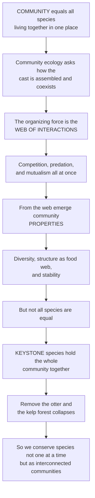

# 🕸️ Community Ecology and Species Interactions

> [!abstract] TL;DR
> A **community** is all the species living together in one place — every plant, animal, fungus, and microbe in a pond, forest, or coral reef — and **community ecology** asks how that cast of characters is assembled and held together. The answer is the **web of interactions** between species: some **compete**, some **eat** each other, some **cooperate**, all at once. From that web emerge the community's **properties** — its diversity, its structure (who eats whom), and its stability. A pivotal discovery is that not all species matter equally: some are **keystone species** whose loss collapses the whole community far out of proportion to their numbers. This is the opener to the community section, framing the competition, mutualism, food-web, succession, and biodiversity notes that follow.

---

## Intuition

**Analogy:** Think of a community as the full **cast of an ongoing drama** playing out in one place — a pond, a forest, a reef — where dozens of species are on stage at once, and the plot is written by their relationships. Some characters are rivals fighting over the same prize (two birds after the same insects). Some are predator and prey (the fox and the hare). Some are partners who cannot succeed without each other (a tree and the fungi wrapped around its roots). Community ecology is the study of this drama: not any single character, but how the whole ensemble is assembled and how it holds together.

The central question is simple to state and hard to answer: **what determines which species coexist here, and how many?** The answer lies in the tangle of interactions between them. And out of that tangle emerge the community's **properties** — its *diversity* (how many species, how evenly spread), its *structure* (the food web of who eats whom), and its *stability* (whether it snaps back after a shock or falls apart). The deepest twist in the plot is that **the cast is not democratic**: some characters are load-bearing. Remove the **sea otter** and the kelp forest collapses — otters eat the urchins that would otherwise mow down the kelp. Remove the **wolf** and an entire valley transforms as deer explode and young trees vanish. These **keystone species** reveal that species are not independent actors but a deeply interdependent web — which is exactly why we cannot conserve them one at a time. They survive, or they fall, together.

---

## How It Works

### Core mechanics

Community ecology sits one level above populations in the hierarchy of organization: a **community** is an assemblage of interacting populations of different species coexisting in the same space and time. Its guiding questions are about **composition** (which species), **diversity** (how many, how evenly), **relative abundance** (a few common, many rare), and **structure** (the food web and its spatial-temporal pattern) — and how all of these change.

1. **Interactions are the organizing force.** Every pair of species can be classified by the *sign* of the effect each has on the other (+, −, or 0). **Competition** is (−/−): both suffer from sharing a limited resource. **Predation, herbivory, and parasitism** are (+/−): one gains, one loses. **Mutualism** is (+/+): both benefit. **Commensalism** (+/0) and **amensalism** (−/0) round out the framework. This sign-based scheme is the shared vocabulary for every interaction note that follows.
2. **Effects can be direct or indirect.** Species A can affect species C *through* species B without ever touching it. A **trophic cascade** (otter → urchin → kelp) and **apparent competition** (two prey sharing a predator) are indirect effects — often stronger than the direct ones, and the reason communities behave as webs, not chains of independent pairs.
3. **Community properties emerge from the web.** No single interaction produces *diversity* or *stability*; these are **emergent properties** of the whole interaction network — measured as species **richness**, **evenness**, the shape of the **rank-abundance** distribution, and the **trophic structure** of the food web.
4. **Not all species are equal.** **Keystone species** exert influence far out of proportion to their abundance (Paine's sea stars and sea otters); **ecosystem engineers** like beavers physically remodel the habitat; **foundation** and **dominant** species define it by sheer biomass. Losing a keystone triggers collapse; **functional redundancy** among species buffers against it.
5. **Communities are assembled, not given.** The species present are drawn from a **regional species pool** and filtered — first by **dispersal** (can it get here?), then by **environmental filtering** (can it tolerate the abiotic conditions?), then by **biotic interactions** (can it survive competitors, predators, and find mutualists?). Whether the outcome is governed by species' distinct niches (**niche theory**) or by chance and dispersal alone (**neutral theory**) remains a central debate — as does the historical split between Clements' view of the community as a tightly-integrated **superorganism** and Gleason's view of it as a loose, **individualistic** assemblage.

### Flow / Architecture



---

## Key Concepts

### Secondary
- **Community** — all the different kinds of living things sharing one place: every plant, animal, fungus, and microbe in a pond, forest, or reef.
- **Species interaction** — a relationship between two species: **competition** (both hurt), **predator and prey** (one eats the other), or **mutualism** (both help each other).
- **Food web** — the map of who eats whom in a community; energy flows from plants to plant-eaters to meat-eaters.
- **Biodiversity** — the variety of species in a community; more kinds, more evenly balanced, usually means a healthier system.
- **Keystone species** — a species that holds the whole community together, so removing it makes the community fall apart even if it was never very common.

### Undergraduate
- **Composition, richness, and evenness** — a community is described by *which* species are present (composition), *how many* kinds (richness), and how *evenly* individuals are split among them (evenness); richness and evenness together define **diversity**.
- **The interaction sign-matrix** — every interaction is (+/−/0): competition (−/−), predation/herbivory/parasitism (+/−), mutualism (+/+), commensalism (+/0), amensalism (−/0). This framework organizes the entire community section.
- **Direct vs indirect effects** — **trophic cascades** and **apparent competition** show that one species can shape another through a third, so communities cannot be reduced to independent pairwise interactions.
- **Rank-abundance distributions** — plotting species from most to least abundant on a log scale gives the characteristic Whittaker curve: a few very common species and a long tail of rare ones. The steepness encodes evenness.
- **Keystones, engineers, and foundation species** — keystones act through **interactions** (otters eating urchins), ecosystem **engineers** through **physical modification** (beavers building dams), and foundation/dominant species through sheer **biomass** (kelp, corals, canopy trees).

### Graduate
- **Community assembly theory** — the local community is the **regional species pool** filtered by dispersal, **environmental filtering** (abiotic tolerance), and biotic interactions; "assembly rules" attempt to predict which combinations of species can coexist.
- **Niche vs neutral theory** — the deterministic view (coexistence requires niche differences that stabilize competitors) versus Hubbell's **neutral theory** (ecological equivalence, where diversity patterns arise from dispersal, speciation, and drift alone); most real communities sit somewhere between.
- **Diversity–stability relationships** — whether more diverse communities are more stable is scale- and definition-dependent; the **insurance hypothesis** and **functional redundancy** link diversity to resistance and resilience, while individual populations may fluctuate more.
- **The Clements–Gleason debate** — the historical and still-live tension between the **superorganism** (tightly co-evolved, discrete communities) and **individualistic** (species distributed independently along gradients, communities as arbitrary slices) conceptions of what a community even *is*.
- **Modularity and network structure** — food webs and mutualistic networks show **nestedness**, **modularity**, and skewed **connectance**; these architectural features govern how perturbations propagate and how robust the community is to species loss.

---

## Python Demo

```python
# Community ecology, two views:
#   (A) KEYSTONE CASCADE  -- a tri-trophic community (sea otter -> urchin -> kelp).
#       When otters are present they crop urchins, kelp thrives, and many species
#       depend on the kelp forest. Remove the keystone otter and urchins explode,
#       kelp collapses, and dependent diversity crashes -- the outsized effect.
#   (B) RANK-ABUNDANCE   -- a community's structure: a few common species and a
#       long tail of rare ones (the classic Whittaker curve).
import numpy as np
import matplotlib.pyplot as plt

# ---- (A) Tri-trophic community model, integrated with simple Euler steps ----
r, Kmax = 1.0, 1.0          # kelp intrinsic growth, kelp carrying capacity
aKU, eKU = 1.0, 0.5         # urchin grazing on kelp, kelp-to-urchin conversion
aUO, eUO = 1.5, 0.4         # otter predation on urchin, urchin-to-otter conversion
dU, dO = 0.05, 0.10         # urchin and otter death rates

def steady_state(otter_present, steps=40000, dt=0.005):
    K, U, O = 0.5, 0.3, (0.2 if otter_present else 0.0)
    for _ in range(steps):
        dK = r * K * (1 - K / Kmax) - aKU * K * U
        dUt = eKU * aKU * K * U - aUO * U * O - dU * U
        dOt = (eUO * aUO * U * O - dO * O) if otter_present else 0.0
        K = max(K + dK * dt, 0.0)
        U = max(U + dUt * dt, 0.0)
        O = max(O + dOt * dt, 0.0)
    return K, U, O

K_on, U_on, O_on = steady_state(True)    # keystone present
K_off, U_off, O_off = steady_state(False)  # keystone removed

base_richness = 40.0                       # species that depend on kelp habitat
rich_on = base_richness * (K_on / Kmax)
rich_off = base_richness * (K_off / Kmax)

# ---- (B) Rank-abundance (Whittaker) curve ----
rng = np.random.default_rng(42)
S = 60
abund = np.sort(rng.lognormal(mean=3.0, sigma=1.3, size=S))[::-1]
ranks = np.arange(1, S + 1)

fig, (ax1, ax2) = plt.subplots(1, 2, figsize=(12.5, 4.6))

# Panel A: grouped bars, community composition before vs after otter removal
labels = ["Otters", "Sea urchins", "Kelp cover", "Dependent\nrichness / 40"]
before = [O_on, U_on, K_on, rich_on / base_richness]
after = [O_off, U_off, K_off, rich_off / base_richness]
x = np.arange(len(labels)); w = 0.38
ax1.bar(x - w/2, before, w, color="seagreen", label="Otter present")
ax1.bar(x + w/2, after, w, color="firebrick", label="Otter removed")
ax1.set_xticks(x); ax1.set_xticklabels(labels, fontsize=9)
ax1.set_ylabel("Relative abundance / cover")
ax1.set_title("(A) Keystone cascade: otter removal collapses the community")
ax1.legend(); ax1.grid(axis="y", alpha=0.3)

# Panel B: rank-abundance curve on a log scale
ax2.semilogy(ranks, abund, "o-", color="darkorange", lw=2, ms=4)
ax2.set_title("(B) Rank-abundance: few common, many rare")
ax2.set_xlabel("Species rank (most -> least abundant)")
ax2.set_ylabel("Abundance (log scale)")
ax2.annotate("few common species", xy=(3, abund[2]),
             xytext=(12, abund[0]*0.9), fontsize=9,
             arrowprops=dict(arrowstyle="->", color="gray"))
ax2.annotate("long tail of rare species", xy=(52, abund[52]),
             xytext=(20, abund[-1]*3), fontsize=9,
             arrowprops=dict(arrowstyle="->", color="gray"))
ax2.grid(alpha=0.3)

plt.tight_layout()
plt.show()

print(f"Otter present : kelp={K_on:.2f}  urchin={U_on:.2f}  otter={O_on:.2f}  richness={rich_on:.0f}")
print(f"Otter removed : kelp={K_off:.2f}  urchin={U_off:.2f}  otter={O_off:.2f}  richness={rich_off:.0f}")
```

**Panel (A)** is the keystone effect made quantitative: with otters present the community settles at high kelp cover, cropped urchins, and rich dependent diversity; delete the otter — never abundant to begin with — and the same equations drive urchins up, kelp to near zero, and dependent richness from roughly 33 species to about 4. **Panel (B)** shows the emergent *structure* of any real community: abundance is spectacularly uneven — a handful of dominants and a long tail of rare species — which is why measuring diversity means capturing both richness and evenness.

---

## Real-World Applications

- **Kelp forest conservation (Pacific coast)** — the sea otter is the textbook keystone: protecting otters is protecting the entire kelp-forest community and the fisheries, carbon storage, and coastline it supports. The urchin-barren collapse when otters vanish is exactly the Panel-A cascade.
- **Trophic rewilding (Yellowstone wolves)** — reintroducing wolves in 1995 restored a top-down interaction chain (wolf → elk → willow/aspen → beaver, birds, rivers), demonstrating that managing a community means managing its keystone *interactions*, not just counting species.
- **Reserve design and functional redundancy** — conservation planners prioritize keystones, foundation species, and interaction networks over single charismatic species, because functional groups and their redundancy determine whether a community resists collapse.
- **Invasive-species risk assessment** — community assembly theory predicts which introduced species will pass dispersal and environmental filters and disrupt biotic interactions, guiding biosecurity and eradication triage.
- **Coral reef and pollinator-network management** — reefs (coral as foundation species) and plant–pollinator mutualistic webs are managed as whole interaction networks; their nestedness and modularity predict how many co-extinctions follow the loss of a key partner.
- **Restoration ecology** — rebuilding a degraded community means re-assembling it in the right order, respecting dispersal limits, environmental filters, and the interactions needed for target species to establish.

---

## Common Pitfalls

- **Treating species as independent.** The whole lesson of community ecology is interdependence: a species' fate is set by its competitors, predators, and mutualists. Managing or counting species in isolation misses the indirect effects (cascades, apparent competition) that often dominate.
- **Assuming abundance equals importance.** Keystone species are frequently *rare*. Ranking species by biomass or population size and protecting only the abundant ones can leave the load-bearing species unprotected — precisely the ones whose loss collapses the community.
- **Confusing richness with diversity.** Two communities with the same number of species can differ hugely in *evenness*. Diversity indices (Shannon, Simpson) and rank-abundance curves capture this; a raw species count does not.
- **Reifying "the community" as a fixed superorganism.** Communities are assembled, contingent, and shift along gradients (the Gleasonian point). Expecting a discrete, tightly co-evolved unit that always returns to one balanced state overstates their integration and stability.
- **Ignoring scale and the regional pool.** Which species *can* be present is set by the regional pool and dispersal, not just local conditions. A local absence may reflect a dispersal or history filter, not a lack of suitable niche — a distinction that changes every management decision.

---

## Related Concepts

This note is the section opener for community ecology; the interactions and properties it surveys are each developed in a dedicated sibling note. **Competition and niche theory** covers the (−/−) interaction and how niche differences allow coexistence; **mutualism, commensalism, and symbiosis** develop the (+/+) and (+/0) partnerships; **food webs and trophic dynamics** formalize the who-eats-whom structure and trophic cascades; **ecological succession and disturbance** track how communities change through time; and **biodiversity and species richness** quantify the emergent diversity properties introduced here. Those five are prose references because they are in-vault siblings of this opener.

- [[Ecology_and_Conservation_Overview]] — the vault hub that places community ecology between population and ecosystem ecology in the levels of organization.
- [[Community_Ecology]] — Biology's foundational treatment of the same level; this note is the deep-dive, interaction-web view that extends it.
- [[Population_Ecology]] — the level below: communities are assemblages of interacting *populations*, so population dynamics feed directly into community outcomes.
- [[Ecosystems_and_Energy_Flow]] — the level above: a community plus its abiotic environment and energy budget forms an ecosystem.
- [[Biodiversity_and_Conservation]] — why community-level thinking is essential to conservation, since species persist or fall as interconnected wholes.
- [[Network_Science_Fundamentals]] — food webs and mutualistic networks are ecological networks; centrality, modularity, and robustness map directly onto keystones and community stability.
- [[Emergence_and_Self_Organization]] — diversity, structure, and stability are emergent properties arising from local interactions, not designed from above.
- [[Complex_Adaptive_Systems]] — a community is a canonical complex adaptive system: many interacting agents producing nonlinear, sometimes tipping-point behavior.
- [[Ecological_Resilience_and_Ecosystems]] — the stability, thresholds, and regime shifts that determine whether a community absorbs disturbance or collapses.
- [[Host_Pathogen_and_Coevolution]] — the evolutionary game-theory view of the (+/−) parasitism interaction and reciprocal adaptation between interacting species.
- [[Natural_Selection_and_Adaptation]] — species interactions are powerful selective pressures, driving the coevolution that shapes who can coexist.

---

## Review Questions

1. **Secondary** — What is an ecological *community*, and what do we mean by a *keystone species*? Give an example of what happens to a community when its keystone species is removed.
2. **Undergraduate** — Distinguish *direct* from *indirect* effects using a trophic cascade. Then explain why two communities with identical species richness can still differ in diversity, referring to evenness and a rank-abundance curve.
3. **Graduate** — A degraded coastal community has lost its keystone predator and shifted to a low-diversity alternative state. Using community assembly theory (regional pool, dispersal, environmental filtering, biotic interactions) and the niche-versus-neutral debate, outline how you would design a restoration program, and explain what functional redundancy and network structure imply about whether your restored community will resist future collapse.

---

## Sources

- Morin, P. J. — *Community Ecology* (2nd ed., Wiley-Blackwell).
- Mittelbach, G. G., & McGill, B. J. — *Community Ecology* (2nd ed., Oxford University Press).
- Begon, M., Townsend, C. R., & Harper, J. L. — *Ecology: From Individuals to Ecosystems* (Blackwell).
- Paine, R. T. (1966) — "Food Web Complexity and Species Diversity," *The American Naturalist* 100(910): 65–75 (the keystone-species concept).

---

#ecology #community-ecology #species-interactions #keystone-species #community-assembly
