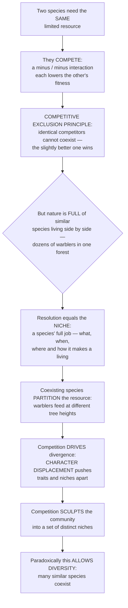

# 🪺 Competition and Niche Theory

> [!abstract] TL;DR
> When two species need the same limited resource, they **compete** — a mutually damaging **(−/−)** interaction that reduces each other's fitness. A foundational rule, the **competitive exclusion principle** (Gause: *"complete competitors cannot coexist"*), states it bluntly: two species that exploit a limiting resource in *exactly* the same way cannot stably coexist — the slightly superior competitor drives the other to local extinction. Yet nature overflows with similar species living together — dozens of warblers in one forest, hundreds of fish on one reef. The resolution is one of ecology's most elegant ideas: the **niche**, a species' entire "profession" — *what* it eats, *when*, *where*, and *how* it makes a living (Hutchinson's **n-dimensional hypervolume**). Coexisting similar species have **partitioned** the resource — each specializes on a slightly different slice (MacArthur's warblers foraging at different canopy heights). Competition itself *drives* this divergence: species evolve to differ (**character displacement**) precisely to avoid competing head-on. Distinguishing the **fundamental niche** (where a species *could* live) from the **realized niche** (where competition actually confines it), and reading the **Lotka–Volterra** isoclines that predict exclusion versus coexistence, is central to explaining community structure, species distributions, adaptive radiation, invasions, and why the world is packed with so many coexisting species. Competition does not merely eliminate — it **sculpts** communities, forcing species apart and thereby, paradoxically, permitting diversity.

---

## Intuition

**Analogy — the crowded street of shops.** Imagine a single street where two cafés open next door to each other, selling the *identical* menu at the identical hours to the identical customers. They cannot both thrive: whichever is a shade cheaper, faster, or better located slowly captures the trade until the other shutters. That is **competitive exclusion** — *complete competitors cannot coexist.* Now look at a real thriving high street: a café, a bakery, a bar, a coffee cart that only works the morning rush. They all "sell caffeine and calories," yet they persist side by side because each has carved out a distinct **niche** — a different product, a different hour, a different corner, a different clientele. That distinct "job description" — *what* you sell, *when* you open, *where* you stand, *who* you serve — is exactly what ecologists mean by a species' **niche**.

The punchline is that the pressure of competition is what *creates* the variety. Faced with a rival next door, the smart move is not to fight head-on but to differentiate — shift your hours, change your specialty, move down the block. Species do the same over evolutionary time: they diverge in beak size, feeding height, or active season (**character displacement**) precisely to stop competing. So competition is a harsh judge that eliminates the redundant, but in doing so it forces survivors apart into separate niches — and *that* is why one forest can hold a dozen warblers and one reef can hold hundreds of fish. Competition does not just cull diversity; it **sculpts** it.

---

## How It Works

### Core Mechanics

1. **Competition is a shared-resource problem.** Whenever two organisms both draw on the same **limiting** resource — food of a certain size, nest sites, a patch of sunlight, soil nitrogen — and there is not enough to go around, each depresses the other's growth, survival, or reproduction. The interaction is symmetric in *sign* (both harmed, **−/−**) even if unequal in magnitude.

2. **Two arenas.** **Intraspecific** competition is *within* a species — it is the density-dependent brake behind logistic regulation (crowding among conspecifics). **Interspecific** competition is *between* species and is the focus here. The pivotal fact for coexistence, developed below, is that stable coexistence requires each species to limit *itself* (intraspecific) more than it limits its competitor (interspecific).

3. **Two mechanisms.** **Exploitation (resource) competition** is *indirect*: species never touch — one simply draws the shared resource down to a level the other cannot tolerate (Tilman's **R\*** rule: the species that persists at the *lowest* equilibrium resource level wins). **Interference competition** is *direct*: fighting, territoriality, overgrowth, or **allelopathy** (chemical suppression). A third, subtler route — **apparent competition** — has two prey species harm each other not through a resource but through a *shared predator* whose numbers one prey inflates.

4. **The exclusion principle.** If two species compete for the same resource in the *same way*, one is always at least slightly better and, given time and constant conditions, drives the other to extinction. Gause's *Paramecium* cultures showed this: grown separately both flourished; grown together, one always eliminated the other.

5. **The niche resolves the paradox.** A species' **niche** is the full n-dimensional set of conditions and resources it uses — its role, not its address. When coexisting species differ enough along at least one niche axis (**resource partitioning**), each becomes its own best competitor for its own slice, intraspecific limitation exceeds interspecific, and both persist.

6. **Competition feeds back on evolution.** Because differing pays, natural selection favors individuals that overlap least with competitors, pushing traits apart (**character displacement**) and, over longer timescales, fueling niche diversification and **adaptive radiation**.

### Flow / Architecture



---

## Key Concepts

### Secondary — competition and the niche in plain words

- **Competition.** Two organisms wanting the same thing in short supply — food, space, light, water — and each getting less because of the other. Both lose out, so ecologists write it as **(−/−)**.
- **Competitive exclusion.** If two species make a living in *exactly* the same way, they can't share for long — the better one gradually crowds the other out. Gause's slogan: *"complete competitors cannot coexist."*
- **The niche.** A species' "job" in nature — everything about how it lives: what it eats, when it is active, where it forages, how it gets its food. Not the *place* it lives (that's the **habitat**, its "address"), but its whole *profession*.
- **Resource partitioning.** How similar species dodge exclusion: they split the resource up, each taking a different slice. Warblers in one tree feed at different heights; finches on one island eat different-sized seeds. Sharing by *specializing*.
- **The big idea.** Competition doesn't only remove species — it pushes survivors to become *different*, and that difference is exactly why so many similar species can live together.

### Undergraduate — the machinery

- **Intraspecific vs interspecific.** Within-species crowding (the density dependence behind logistic growth) versus between-species competition. Both depress per-capita growth; their *relative strength* decides coexistence.
- **Exploitation vs interference.** **Exploitation**: indirect, via drawing down a shared resource — formalized by Tilman's **R\*** (the minimum resource concentration at which a species breaks even; the lowest-R\* species wins pure resource competition). **Interference**: direct antagonism — territoriality, aggression, overgrowth, **allelopathy** (e.g. black walnut's juglone, *Salvia* terpenes).
- **The Grinnellian, Eltonian, and Hutchinsonian niche.** **Grinnell (1917)** emphasized *requirements* and habitat (where a species can persist); **Elton (1927)** emphasized *functional role* (what it does — its "occupation" in the food web); **Hutchinson (1957)** unified these as an **n-dimensional hypervolume** — a species occupies a volume in a space whose axes are every relevant environmental variable and resource.
- **Fundamental vs realized niche.** The **fundamental niche** is the full hypervolume a species could occupy in the *absence* of competitors and enemies. The **realized niche** is the (usually smaller) portion it *actually* occupies once interactions constrain it. **Connell's barnacles** (1961) are the classic demonstration: *Chthamalus* can physiologically live low on the shore but is competitively excluded there by faster-growing *Balanus*, so its realized zone is squeezed to the upper shore.
- **Resource partitioning and limiting similarity.** Coexisting species differ along niche axes — diet, microhabitat, timing, body size. **MacArthur's (1958) warblers**: five *Dendroica* species coexist in one spruce by feeding in different zones of the canopy (treetops, mid-canopy, inner branches, trunk). **Limiting similarity** asks how *alike* competitors can be and still coexist — often summarized by the ratio of niche separation $d$ to niche width $w$; when $d/w$ drops below roughly 1, overlap forces exclusion.
- **The Lotka–Volterra competition model.** Two coupled logistic equations linked by **competition coefficients** $\alpha_{12}, \alpha_{21}$ (the per-capita effect of species 2 on species 1, in units of species-1 equivalents, and vice versa):
$$\frac{dN_1}{dt} = r_1 N_1\frac{K_1 - N_1 - \alpha_{12} N_2}{K_1}, \qquad \frac{dN_2}{dt} = r_2 N_2\frac{K_2 - N_2 - \alpha_{21} N_1}{K_2}.$$
Setting each rate to zero gives the **zero-growth isoclines** (straight lines in the $N_1$–$N_2$ phase plane). Their arrangement predicts the outcome — see below.

### Graduate — coexistence theory and the four outcomes

- **The four Lotka–Volterra outcomes.** Comparing where the two isoclines cross gives four cases: (1) species 1 always wins; (2) species 2 always wins; (3) **founder control / priority effect** — an *unstable* interior point where whoever starts commoner excludes the other (each limits the *other* more than itself, $\alpha_{12}\alpha_{21} > 1$); (4) **stable coexistence** — a locally stable interior equilibrium requiring **each species to limit itself more than it limits the other** ($\alpha_{12} < K_1/K_2$ *and* $\alpha_{21} < K_2/K_1$; with equal $K$, both $\alpha < 1$). This is the mathematical statement of "niche differences stabilize coexistence."
- **Tilman's R\* and mechanistic resource competition.** Reframing competition around the *resource* rather than a phenomenological $\alpha$: at equilibrium each species draws the limiting resource to its own break-even level $R^*$; the lowest-$R^*$ species competitively displaces the rest on a single resource. On **two** limiting resources with a trade-off, species coexist when each is limited by (and consumes more of) the resource that limits it most — a resource-ratio theory of coexistence and a mechanistic underpinning of niche partitioning.
- **Modern coexistence theory (Chesson).** Coexistence is decomposed into **stabilizing niche differences** (mechanisms that make each species limit itself more than its competitors — resource partitioning, natural enemies, temporal/spatial storage effects) versus **relative fitness differences** (average competitive superiority). Two species stably coexist when stabilizing niche differences are large enough to overcome their fitness difference — a unifying restatement of both Lotka–Volterra and Tilman.
- **The paradox of the plankton (Hutchinson 1961).** In a well-mixed water column, dozens of phytoplankton species coexist on a handful of limiting resources — apparently defying competitive exclusion, which permits at most one species per limiting resource at equilibrium. Resolutions include **non-equilibrium dynamics** (environments fluctuate faster than exclusion completes), spatial/temporal heterogeneity, chaotic internally generated fluctuations, and enemy-mediated (predator/pathogen) coexistence. The paradox is a standing reminder that exclusion is an *equilibrium* prediction, and nature is rarely at equilibrium.
- **Character displacement.** When two species overlap in **sympatry** but not in **allopatry**, competition can drive evolutionary trait divergence that reduces overlap. **Darwin's finches**: *Geospiza fortis* and *G. fuliginosa* have similar beak sizes on islands where each occurs alone, but diverge where they co-occur — and Grant & Grant documented *contemporary* displacement on Daphne Major after a competitor arrived. This is niche differentiation written into the phenotype by selection.
- **Apparent competition.** Two prey with no shared resource can still appear to compete because both feed a **shared predator**; boosting one prey raises predator numbers, depressing the other. Distinguishing true resource competition from apparent competition is a recurring empirical challenge and matters for biological control and invasions.
- **From competition to macroevolution.** Ecological opportunity plus competition for it drives **adaptive radiation** — the rapid diversification of a lineage into many niches (Galápagos finches, Hawaiian honeycreepers, African rift-lake cichlids). Niche theory is thus not only about who coexists now but about how diversity is *generated* over deep time.

---

## Python Demo

```python
# Competition and niche theory, four panels:
#   (A) Lotka-Volterra phase plane -> STABLE COEXISTENCE (isoclines + trajectories)
#   (B) Lotka-Volterra phase plane -> COMPETITIVE EXCLUSION (species 1 wins)
#   (C) Resource partitioning: separated niche-utilization curves allow coexistence
#   (D) Character displacement: high overlap -> niches shift apart, overlap falls
import numpy as np
import matplotlib.pyplot as plt

# ----------------------------------------------------------- LV competition model
def lv_run(N0, r1, r2, K1, K2, a12, a21, dt=0.01, steps=6000):
    """Euler-integrate the two-species Lotka-Volterra competition equations."""
    N1 = np.empty(steps + 1); N2 = np.empty(steps + 1)
    N1[0], N2[0] = N0
    for i in range(steps):
        dN1 = r1 * N1[i] * (K1 - N1[i] - a12 * N2[i]) / K1
        dN2 = r2 * N2[i] * (K2 - N2[i] - a21 * N1[i]) / K2
        N1[i + 1] = N1[i] + dt * dN1
        N2[i + 1] = N2[i] + dt * dN2
    return N1, N2

r1 = r2 = 1.0
K1 = K2 = 1.0
starts = [(0.05, 0.9), (0.9, 0.05), (0.08, 0.08), (0.9, 0.9), (0.5, 0.05), (0.05, 0.5)]

# COEXISTENCE: each species limits itself MORE than the other (a12, a21 < 1)
a12_c, a21_c = 0.5, 0.5
# EXCLUSION: species 2 strongly suppressed by species 1 -> species 1 wins
a12_e, a21_e = 0.5, 1.6

# ---------------------------------------- niche-utilization curves along a resource axis
x = np.linspace(0, 12, 500)
gauss = lambda mu, w: np.exp(-(x - mu) ** 2 / (2.0 * w ** 2))
w = 1.0

# (C) partitioned niches: well-separated means -> low overlap -> coexistence
part_means = [2.5, 6.0, 9.5]

# (D) character displacement: two competitors, before (close) vs after (pushed apart)
before = [5.2, 6.8]      # high overlap in sympatry (strong competition)
after  = [3.8, 8.2]      # displaced apart (reduced overlap)

def overlap(mu_a, mu_b, w):
    """Overlap integral of two equal-width Gaussians (Pianka-style), analytic value."""
    return np.exp(-(mu_a - mu_b) ** 2 / (4.0 * w ** 2))

# ------------------------------------------------------------------------- plotting
fig, ax = plt.subplots(2, 2, figsize=(13.5, 10.5))

# --- (A) COEXISTENCE phase plane -----------------------------------------------
axc = ax[0, 0]
n2 = np.linspace(0, K1 / a12_c, 100)          # species 1 isocline: N1 = K1 - a12*N2
axc.plot(K1 - a12_c * n2, n2, color="crimson", lw=2, label="Species 1 isocline")
n1 = np.linspace(0, K2 / a21_c, 100)          # species 2 isocline: N2 = K2 - a21*N1
axc.plot(n1, K2 - a21_c * n1, color="royalblue", lw=2, label="Species 2 isocline")
for s in starts:
    N1, N2 = lv_run(s, r1, r2, K1, K2, a12_c, a21_c)
    axc.plot(N1, N2, color="gray", lw=0.9, alpha=0.8)
# stable interior equilibrium
den = 1 - a12_c * a21_c
eqx = (K1 - a12_c * K2) / den; eqy = (K2 - a21_c * K1) / den
axc.plot(eqx, eqy, "ko", ms=9, label="Stable coexistence")
axc.set_xlim(0, 1.15); axc.set_ylim(0, 1.15)
axc.set_xlabel("N1  (species 1)"); axc.set_ylabel("N2  (species 2)")
axc.set_title("(A) COEXISTENCE: each limits itself > the other\n(a12, a21 = 0.5)")
axc.legend(fontsize=8, loc="upper right"); axc.grid(alpha=0.3)

# --- (B) EXCLUSION phase plane -------------------------------------------------
axe = ax[0, 1]
n2 = np.linspace(0, K1 / a12_e, 100)
axe.plot(K1 - a12_e * n2, n2, color="crimson", lw=2, label="Species 1 isocline")
n1 = np.linspace(0, K2 / a21_e, 100)
axe.plot(n1, K2 - a21_e * n1, color="royalblue", lw=2, label="Species 2 isocline")
for s in starts:
    N1, N2 = lv_run(s, r1, r2, K1, K2, a12_e, a21_e)
    axe.plot(N1, N2, color="gray", lw=0.9, alpha=0.8)
axe.plot(K1, 0.0, "o", color="crimson", ms=10, label="Species 1 wins  (N2 -> 0)")
axe.set_xlim(0, 1.15); axe.set_ylim(0, 1.15)
axe.set_xlabel("N1  (species 1)"); axe.set_ylabel("N2  (species 2)")
axe.set_title("(B) EXCLUSION: species 1 suppresses 2 strongly\n(a12 = 0.5, a21 = 1.6)")
axe.legend(fontsize=8, loc="upper right"); axe.grid(alpha=0.3)

# --- (C) resource partitioning -------------------------------------------------
axp = ax[1, 0]
colors = ["seagreen", "darkorange", "purple"]
for mu, col in zip(part_means, colors):
    axp.plot(x, gauss(mu, w), color=col, lw=2)
    axp.fill_between(x, gauss(mu, w), color=col, alpha=0.18)
axp.set_xlabel("Resource axis  (e.g. prey size or foraging height)")
axp.set_ylabel("Resource use")
axp.set_title("(C) RESOURCE PARTITIONING: separated niches\nlow overlap -> coexistence")
axp.grid(alpha=0.3)

# --- (D) character displacement ------------------------------------------------
axd = ax[1, 1]
axd.plot(x, gauss(before[0], w), color="crimson",   ls="--", lw=2, label="Before: sp.1 (overlap)")
axd.plot(x, gauss(before[1], w), color="royalblue", ls="--", lw=2, label="Before: sp.2 (overlap)")
axd.plot(x, gauss(after[0],  w), color="crimson",   lw=2.4, label="After: sp.1 (displaced)")
axd.plot(x, gauss(after[1],  w), color="royalblue", lw=2.4, label="After: sp.2 (displaced)")
axd.annotate("", xy=(after[0], 1.05), xytext=(before[0], 1.05),
             arrowprops=dict(arrowstyle="->", color="crimson"))
axd.annotate("", xy=(after[1], 1.05), xytext=(before[1], 1.05),
             arrowprops=dict(arrowstyle="->", color="royalblue"))
axd.set_ylim(0, 1.2)
axd.set_xlabel("Trait / resource axis  (e.g. beak or body size)")
axd.set_ylabel("Resource use")
axd.set_title("(D) CHARACTER DISPLACEMENT: niches shift apart")
axd.legend(fontsize=7.5, loc="upper center"); axd.grid(alpha=0.3)

plt.tight_layout(); plt.show()

# ------------------------------------------------------------------- printed summary
print(f"Coexistence interior equilibrium: N1* = {eqx:.3f}, N2* = {eqy:.3f}")
print(f"Niche overlap BEFORE displacement: {overlap(*before, w):.3f}")
print(f"Niche overlap AFTER  displacement: {overlap(*after,  w):.3f}  (competition relaxed)")
```

Panel **(A)** shows the coexistence geometry: the two zero-growth isoclines cross at an interior point and every trajectory — no matter where it starts — spirals into it, so both species persist. Panel **(B)** perturbs a single competition coefficient ($\alpha_{21}$ from 0.5 to 1.6): now species 1's isocline lies entirely outside species 2's, no interior crossing exists, and every trajectory collapses onto the $N_2 = 0$ axis — competitive exclusion. Panel **(C)** plots niche-utilization curves that barely overlap, the signature of resource partitioning that permits coexistence, while panel **(D)** shows character displacement pushing two initially overlapping curves apart; the printed overlap integral falls from roughly 0.42 to 0.024, quantifying how much competition the divergence relieves.

---

## Real-World Applications

> **Example — MacArthur's warblers and the R\* rule in the lab.** Robert MacArthur's 1958 study of five North American *Dendroica* warblers feeding in the *same* spruce trees is the textbook demonstration of resource partitioning: by painstakingly recording where each species foraged, he showed they occupy different vertical and radial zones of the canopy (treetops, outer mid-canopy, inner branches, lower trunk) and differ in feeding behavior — dividing what looked like one niche into five. On the mechanistic side, David Tilman's chemostat experiments with diatoms competing for silicate and phosphate confirmed the **R\*** prediction quantitatively: the species that drew a limiting nutrient to the lowest level always won on that nutrient, and the outcome flipped predictably with the resource supply ratio — turning "who wins" from a slogan into an equation.

- **Invasive species.** Many successful invaders thrive by **escaping their competitors** (and enemies) and by exploiting an under-used niche in the new range; conversely, some fail because a resident already occupies that niche. Predicting invasibility, and whether a native will be competitively excluded, rests directly on niche overlap and R\* reasoning.
- **Conservation and reintroduction.** Restoring a species requires that its **realized niche** still exists — that competitors have not annexed it. Managers use niche models to ask whether a reintroduced or climate-displaced species will find room, and whether two species of concern will compete.
- **Species distribution modeling.** Climate-envelope and ecological-niche models (MaxEnt and kin) formalize the Grinnellian niche to project range shifts under climate change — but they estimate the *realized* niche, so they can mislead where biotic interactions or dispersal, not climate, set the limits.
- **Agriculture and biological control.** Intercropping and cover-crop design exploit niche complementarity (different rooting depths, nitrogen fixers plus non-fixers) to raise total yield. Biological-control programs must reckon with **apparent competition**, where an introduced control agent perturbs shared predators and non-target species.
- **Microbial ecology and the microbiome.** Gut and soil communities are competition arenas where R\*-style resource competition, cross-feeding, and interference (bacteriocins, antibiotics) determine who coexists — central to probiotics, fermentation, and colonization resistance against pathogens.

---

## Common Pitfalls

- **"Competitive exclusion means one species always dies out."** It is an *equilibrium* statement about *complete* competitors under *constant* conditions. Real species partition resources, environments fluctuate (the paradox of the plankton), and coexistence is the frequent outcome. Exclusion is the *pressure*, not the inevitable result.
- **Confusing niche with habitat.** The habitat is the "address" (where a species lives); the niche is the "profession" (how it lives). Two species can share a habitat yet occupy different niches — that is precisely how they coexist.
- **Forgetting fundamental vs realized.** Observing where a species lives shows its *realized* niche, already shrunk by competition. Inferring its physiological limits or its no-competitor potential from field distribution alone (as many species-distribution models implicitly do) can badly mis-estimate the true range.
- **Reading the sign of an interaction as its magnitude.** Competition is symmetric in sign (−/−) but almost never symmetric in strength; $\alpha_{12} \neq \alpha_{21}$. The *asymmetry* usually decides who wins, and treating competition as reciprocal and equal misses the mechanism.
- **Assuming any overlap forces exclusion.** Coexistence tolerates substantial overlap; what matters is that each species limits *itself* more than its competitor (stabilizing niche difference), not that overlap be zero. **Limiting similarity** sets how alike competitors can be, not a demand that they be different in every dimension.
- **Mistaking apparent competition for resource competition.** Two species can decline together through a shared predator with no shared resource at all. Without manipulating the resource (or the predator), a negative correlation is not evidence of resource competition.
- **Treating character displacement as automatic.** Divergence requires heritable trait variation, real fitness costs to overlap, and shows up as the sympatry-vs-allopatry pattern. Not every co-occurring pair displaces; asserting it without the comparative or selection evidence overreaches.

---

## Related Concepts

- [[Population_Growth_and_Regulation]] — the single-species logistic and its density-dependent (intraspecific) brake are exactly the terms the Lotka–Volterra competition model couples between two species; competition is interspecific density dependence.
- [[Community_Ecology]] — the broader Biology-vault companion that situates competition and the niche among predation, mutualism, keystone species, and succession.
- [[Natural_Selection_and_Adaptation]] — character displacement *is* natural selection acting to reduce competitive overlap; this note supplies the ecological driver behind trait divergence.
- [[Speciation_and_Macroevolution]] — competition for ecological opportunity powers adaptive radiation, linking niche differentiation to the *generation* of diversity over deep time.
- [[Systems_of_ODEs]] — the mathematical machinery of the demo: the Lotka–Volterra competition equations are a two-dimensional nonlinear ODE system whose fixed points and isocline (nullcline) analysis are the phase-plane methods developed there.

Within this vault, this note sits at the heart of the community section. Community_Ecology_and_Species_Interactions catalogs the full sign-based scheme of interactions of which competition is the (−/−) case; Predator_Prey_and_Population_Interactions supplies the (+/−) coupling behind *apparent* competition and the enemy-mediated coexistence that helps resolve the plankton paradox; Mutualism_Commensalism_and_Symbiosis covers the (+/+) and (+/0) interactions that complete the interaction typology; Biodiversity_and_Species_Richness inherits directly from resource partitioning and limiting similarity, which explain *why* so many species can pack into one place; and Invasive_Species_and_Biological_Invasions applies competitive release and niche availability to predict which invaders establish.

---

## Review Questions

1. **(Secondary)** A single spruce tree is home to five species of warbler that all eat insects. According to the competitive exclusion principle they should not be able to coexist — yet they do. Explain, using the idea of the niche, how resource partitioning lets them share the tree, and give the everyday-shop analogy for what each warbler is "doing" differently.
2. **(Undergraduate)** In the Lotka–Volterra competition model with $K_1 = K_2 = 1$, state the condition on the competition coefficients $\alpha_{12}$ and $\alpha_{21}$ for *stable coexistence*, and contrast it with the condition for *founder control*. Sketch the zero-growth isoclines for each case and explain, in words, why "each species limiting itself more than the other" is the mathematical meaning of a stabilizing niche difference.
3. **(Graduate)** Hutchinson's "paradox of the plankton" asks how dozens of phytoplankton species coexist on a handful of limiting resources when competitive exclusion permits at most one species per limiting resource at equilibrium. Propose two distinct mechanistic resolutions, explain how each breaks the equilibrium assumption or adds a stabilizing niche difference, and describe an observation or experiment that could distinguish them.

---

## Sources

- Gause, G. F. (1934). *The Struggle for Existence.* Williams & Wilkins.
- Hutchinson, G. E. (1957). "Concluding remarks." *Cold Spring Harbor Symposia on Quantitative Biology*, 22, 415–427. (The n-dimensional niche.)
- MacArthur, R. H. (1958). "Population ecology of some warblers of northeastern coniferous forests." *Ecology*, 39(4), 599–619.
- Tilman, D. (1982). *Resource Competition and Community Structure.* Princeton University Press.
- Chase, J. M., & Leibold, M. A. (2003). *Ecological Niches: Linking Classical and Contemporary Approaches.* University of Chicago Press.

---

#ecology #competition #niche #competitive-exclusion #resource-partitioning
