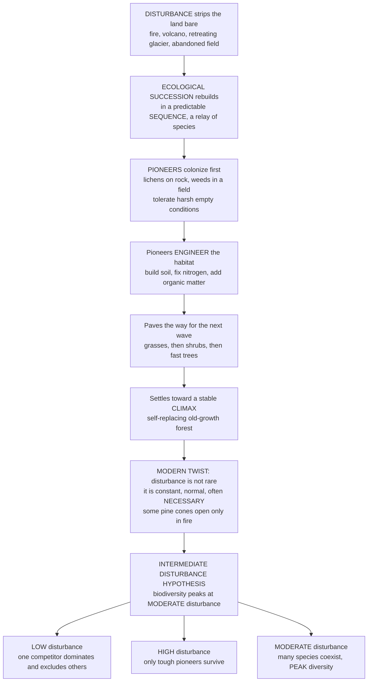

# 🌱 Ecological Succession and Disturbance

> [!abstract] TL;DR
> After a disturbance strips the land bare — a lava flow, a wildfire, a retreating glacier, an abandoned field — nature does not rebuild all at once. It reassembles in a **predictable relay** called **ecological succession**: hardy **pioneers** (lichens, weeds) tolerate the harsh emptiness and *build soil*, paving the way for grasses, shrubs, and finally trees, drifting toward a relatively stable **climax** community. The modern twist that overturned the old tidy picture is that **disturbance is not a rare interruption of a static end-state — it is constant, normal, and often *necessary***: some pine cones open only in fire, prairies need burning, and biodiversity frequently **peaks at *intermediate* disturbance**. These dynamics explain how ecosystems recover, why "just leave it alone" and total fire suppression can backfire, and how to restore damaged land.

---

## Intuition

**Analogy:** Picture a construction site wiped clean by a demolition — bare, exposed, hostile. No one builds the finished skyscraper first. Instead, a **relay race** begins. The first runners are tough, fast, undemanding **pioneers**: crews that can work in mud with no power and no shelter (lichens gripping bare rock, weeds sprouting in a plowed field). Crucially, as they work they *change the site itself* — laying foundations, hauling in soil, trickling in nutrients — making conditions better for the next crew and, in the process, worse for themselves. They hand the baton to grasses, who hand it to shrubs, who hand it to fast-growing pioneer trees, who finally hand it to the slow, towering hardwoods. Each stage **engineers the conditions that doom itself and favor its successors**, until the site settles into a mature, self-perpetuating **climax** — an old-growth forest that replaces itself and can persist for centuries.

For a hundred years ecologists imagined this relay always ended at one fixed, stable finish line. Then came the twist that rewrote the field: **the demolitions never stop.** Fires, storms, floods, and falling trees are constantly re-clearing patches of the landscape, resetting the relay in one place while it runs to completion in another. And here is the deep part — **many ecosystems don't merely tolerate this; they depend on it.** Some pine cones are glued shut with resin and open *only* in the heat of a fire; prairies revert to scrub without periodic burning; cottonwood seedlings need the bare wet gravel that only a flood leaves behind. This gave rise to a profound insight — the **Intermediate Disturbance Hypothesis**: the richest mix of species is found not in the untouched climax (where one dominant competitor takes over) nor in the constantly hammered site (where only the toughest pioneers cling on), but in the **middle**, where disturbance keeps any single winner from monopolizing the ground while still leaving room for many species to persist.

---

## How It Works

### Core mechanics

1. **A disturbance opens space.** Ecological succession is the *directional, more-or-less predictable* change in community composition over time following a disturbance or on newly exposed substrate. The clock starts when something clears the field.
2. **Primary vs secondary.** **Primary succession** begins on a *lifeless substrate with no soil* — bare rock, cooled lava, glacial till, fresh dunes — so pioneers must **build the soil itself** before much else can grow; it is very slow (centuries to millennia). **Secondary succession** begins where *soil, seeds, and roots remain* after a disturbance — an abandoned field, a burned or logged forest — so it is far **faster** (decades) because the biological legacy is still there.
3. **The seral relay.** The community passes through **seral stages** (a *sere*): from **pioneer** species — r-selected colonizers that are tolerant, highly dispersive, and environment-modifying — through intermediate stages toward the **climax** community, a relatively stable, self-replacing late-successional state.
4. **Three mechanisms drive the handoff (Connell & Slatyer 1977).** **Facilitation** — early species modify conditions to *favor* later ones (nitrogen-fixing pioneers building fertile soil). **Tolerance** — later species simply *outlast and outcompete* over time, indifferent to the pioneers. **Inhibition** — early occupants *resist replacement* and hold the ground until a disturbance removes them.
5. **Disturbance is a regime, not an accident.** A **disturbance** is a discrete event that disrupts community structure and frees resources (fire, storm, flood, treefall gap, drought, landslide, clearing). Ecosystems are shaped by their **disturbance regime**: its **frequency, intensity, size/extent, and timing**. Many communities are **disturbance-adapted** and even *dependent* — fire-adapted pines with **serotinous** cones, flood-dependent riparian forests, fire-maintained prairies.
6. **The landscape is a shifting mosaic.** Because patches are disturbed at different times, a large landscape is a **patchwork of stands at every successional stage** — a *shifting mosaic* whose steady-state diversity is maintained *by* ongoing disturbance, not despite it.
7. **Diversity peaks in the middle.** The **Intermediate Disturbance Hypothesis** (Connell 1978): species richness is highest at *moderate* disturbance. Too little disturbance lets a dominant competitor exclude the rest; too much leaves only a few tough pioneers.

### Flow / Architecture



---

## Key Concepts

### Secondary
- **Ecological succession** — nature rebuilding a stripped area in a predictable order, one wave of species handing off to the next.
- **Pioneer species** — the first tough colonizers (lichens on bare rock, weeds in a plowed field) that survive harsh empty conditions and begin *building soil*.
- **Climax community** — the relatively stable, mature end community that can replace itself, classically an old-growth forest.
- **Disturbance** — an event that clears or resets part of an ecosystem: a fire, a storm, a flood, a fallen tree.
- **Disturbance can be good** — many ecosystems *need* it: some pine cones open only in a fire, and prairies turn into scrub without periodic burning.
- **The "just right" idea** — the most kinds of species tend to live where disturbance is *moderate* — not so rare that one bully takes over, not so frequent that only the toughest survive.

### Undergraduate
- **Primary vs secondary succession** — primary starts on *lifeless substrate with no soil* (bare rock, lava, glacial till, new dunes) and is slow because pioneers must first build soil; secondary starts where *soil and propagules remain* after a disturbance (old fields, burned forest) and is much faster.
- **Sere and seral stages** — the ordered sequence of communities from pioneer stage through intermediate stages to climax; the whole trajectory is a *sere*.
- **r-to-K along the sere** — early pioneers are **r-selected** opportunists (fast, dispersive, short-lived); late climax species are **K-selected** competitors (slow, large, long-lived) — the same fast–slow logic that governs life-history strategy.
- **Connell & Slatyer mechanisms** — **facilitation** (early species improve conditions for later ones), **tolerance** (later species just outlast the earlier), and **inhibition** (early occupants block replacement until disturbed out).
- **Clements vs Gleason** — Clements' **superorganism / deterministic single-climax** view (the community marches to one inevitable endpoint) versus Gleason's **individualistic** view (species respond independently, trajectories are contingent). The modern synthesis sides largely with Gleason: multiple pathways, no single fixed climax.
- **Disturbance regime** — the multidimensional signature of disturbance: **frequency, intensity, size/extent, and timing/seasonality**. It is the regime, not any single event, that shapes a community.
- **Disturbance-adapted ecosystems** — fire-adapted pines with **serotinous** (heat-opened) cones, fire-maintained grasslands, and flood-dependent riparian systems that require the bare, wet substrate a flood leaves behind.
- **Intermediate Disturbance Hypothesis (Connell 1978)** — a **hump-shaped** relationship between diversity and disturbance: competitive exclusion suppresses richness at low disturbance, and disturbance-driven mortality suppresses it at high disturbance, so richness peaks in between.
- **Shifting mosaic / patch dynamics** — the landscape as a patchwork of stands at different successional ages; steady-state landscape diversity is *maintained by* ongoing disturbance.

### Graduate
- **Non-equilibrium ecology** — the paradigm shift from communities as static climax endpoints to **dynamic, disturbance-driven, rarely-at-equilibrium** systems. Disturbance and history are structural, not noise.
- **Alternative stable states and hysteresis** — a site may have *multiple* possible stable communities (grassland vs forest, clear vs turbid lake); crossing a threshold flips it, and reversing the driver does not simply reverse the state — a regime shift with **hysteresis**, tied directly to tipping-point and resilience theory.
- **Models of the successional pathway** — facilitation, tolerance, and inhibition make *different predictions* about trajectory and endpoint; add **priority effects**, **assembly rules**, and **dispersal limitation** and succession becomes contingent, with alternative transient and terminal states rather than one deterministic climax.
- **Mechanisms behind the diversity–disturbance hump** — the IDH is one of several explanations. Huston's **dynamic equilibrium model** couples disturbance frequency with productivity/growth rate; the **competition–colonization trade-off**, the **storage effect**, and **successional niche** partitioning all generate coexistence under intermediate disturbance. The IDH itself has been sharply critiqued (Fox 2013) as neither logically necessary nor empirically general — real diversity–disturbance curves are positive, negative, U-shaped, or flat depending on scale and mechanism.
- **Trait-based and mechanistic succession** — modern succession is analyzed through demographic and functional **traits** (dispersal, growth rate, shade tolerance, longevity) rather than fixed species lists, connecting successional position to life-history and physiological trade-offs.
- **Resilience and the adaptive cycle** — Holling's distinction between **engineering resilience** (return rate to equilibrium) and **ecological resilience** (magnitude of disturbance a system absorbs before flipping states); the **panarchy** adaptive cycle (exploitation → conservation → release → reorganization) frames succession and disturbance as a recurring loop across scales.
- **Applied non-equilibrium management** — fire-regime restoration, environmental-flow releases below dams, and **restoration ecology** all treat disturbance as a *tool*; the emergence of **novel ecosystems** questions whether any historical climax is a valid restoration target at all.

---

## Python Demo

```python
# Ecological succession and disturbance, three views:
#   (A) SUCCESSIONAL HANDOFF     -- seral groups peak in sequence (pioneers -> climax).
#   (B) BIOMASS + DIVERSITY      -- total biomass builds (primary slow vs secondary fast);
#                                   Shannon diversity peaks mid-succession then falls at climax.
#   (C) INTERMEDIATE DISTURBANCE -- the hump-shaped diversity vs disturbance curve.
import numpy as np
import matplotlib.pyplot as plt

# ------------------------------------------------------------------
# (A) The successional relay: each seral group is a hump peaking in sequence
# ------------------------------------------------------------------
t = np.linspace(0, 200, 400)                        # years since disturbance
groups = ["Pioneers (lichen/weed, r)", "Grasses & herbs",
          "Shrubs", "Fast trees", "Climax hardwoods (K)"]
peaks  = np.array([15, 45, 85, 135, 210])           # year of peak cover (climax peaks past window)
widths = np.array([16, 24, 34, 46, 70])             # breadth of each group's tenure
colors = ["#8d6e63", "#9ccc65", "#66bb6a", "#2e7d32", "#1b5e20"]

# absolute cover of each group over time (Gaussian humps that rise, crest, then hand off)
cover = np.array([np.exp(-((t - p) / w) ** 2) for p, w in zip(peaks, widths)])

# relative composition (each time-slice sums to 1) -> Shannon diversity of the community
prop = cover / cover.sum(axis=0)
H = -np.sum(np.where(prop > 0, prop * np.log(prop), 0.0), axis=0)   # Shannon H(t)

# ------------------------------------------------------------------
# (B) Total biomass accumulation: PRIMARY (no soil, slow, delayed) vs SECONDARY (soil remains, fast)
# ------------------------------------------------------------------
Bmax = 100.0
biomass_primary   = Bmax / (1 + np.exp(-(t - 120) / 30))   # slow: soil must be built first
biomass_secondary = Bmax / (1 + np.exp(-(t -  40) / 16))   # fast: seeds, roots, soil already there

# ------------------------------------------------------------------
# (C) Intermediate Disturbance Hypothesis: two opposing forces make a hump
# ------------------------------------------------------------------
d = np.linspace(0.001, 1.0, 400)          # disturbance frequency / intensity (normalized)
N_pool = 40                               # regional species pool
a_rise, b_fall = 2.5, 1.5
comp_relief = 1 - np.exp(-a_rise * d)     # rises: disturbance frees space from the dominant competitor
tol_limit   = np.exp(-b_fall * d)         # falls: only disturbance-tolerant pioneers survive high d
richness    = N_pool * comp_relief * tol_limit
d_star      = d[np.argmax(richness)]      # disturbance level of PEAK diversity
print(f"IDH peak diversity at disturbance level d* = {d_star:.2f} "
      f"(S = {richness.max():.1f} of {N_pool})")

# ------------------------------------------------------------------
# Plot all three panels
# ------------------------------------------------------------------
fig, (axA, axB, axC) = plt.subplots(1, 3, figsize=(17, 5))

# (A) the handoff of seral groups
for c, col, name in zip(cover, colors, groups):
    axA.plot(t, c, lw=2.4, color=col, label=name)
    axA.fill_between(t, c, alpha=0.12, color=col)
axA.set_title("(A) Successional Handoff: a relay of species")
axA.set_xlabel("Years since disturbance")
axA.set_ylabel("Relative cover of each seral group")
axA.legend(fontsize=8, loc="upper right"); axA.grid(alpha=0.3)

# (B) biomass (primary vs secondary) with Shannon diversity on a twin axis
axB.plot(t, biomass_primary,   lw=2.5, color="#5d4037", label="Biomass: PRIMARY (bare rock, slow)")
axB.plot(t, biomass_secondary, lw=2.5, color="#8d6e63", ls="--", label="Biomass: SECONDARY (soil, fast)")
axB.set_title("(B) Biomass builds; diversity peaks mid-succession")
axB.set_xlabel("Years since disturbance")
axB.set_ylabel("Total biomass (relative)")
axB.grid(alpha=0.3)
axBt = axB.twinx()
axBt.plot(t, H, lw=2.5, color="#1565c0", label="Shannon diversity H")
axBt.set_ylabel("Shannon diversity H", color="#1565c0")
axBt.tick_params(axis="y", labelcolor="#1565c0")
l1, lab1 = axB.get_legend_handles_labels()
l2, lab2 = axBt.get_legend_handles_labels()
axB.legend(l1 + l2, lab1 + lab2, fontsize=8, loc="center right")

# (C) the intermediate-disturbance hump plus its two opposing components
axC.plot(d, richness, lw=3, color="#6a1b9a", label="Species richness (observed)")
axC.plot(d, N_pool * comp_relief, lw=1.6, ls="--", color="#2e7d32",
         label="limited by competitive exclusion")
axC.plot(d, N_pool * tol_limit, lw=1.6, ls="--", color="#c62828",
         label="limited by disturbance tolerance")
axC.axvline(d_star, color="grey", ls=":", lw=1.5)
axC.annotate("PEAK diversity\nat MODERATE disturbance",
             xy=(d_star, richness.max()), xytext=(d_star + 0.12, richness.max() * 0.75),
             fontsize=9, arrowprops=dict(arrowstyle="->", color="grey"))
axC.set_title("(C) Intermediate Disturbance Hypothesis")
axC.set_xlabel("Disturbance frequency / intensity")
axC.set_ylabel("Species richness")
axC.legend(fontsize=8, loc="upper right"); axC.grid(alpha=0.3)

plt.tight_layout()
plt.show()
```

Panel **(A)** makes the relay visible: pioneers surge first and then *decline* as the very conditions they created favor their successors, and each later group crests in turn until the slow climax hardwoods dominate the far end — the successional handoff, not a simultaneous build-up. Panel **(B)** shows two independent truths: total biomass accumulates along a sigmoid, and **secondary succession reaches the plateau far faster than primary** because it inherits soil and propagules rather than building them from bare rock; meanwhile **Shannon diversity peaks in mid-succession** — when many seral groups coexist — and *falls again at the climax* as one competitor dominates, foreshadowing the intermediate-disturbance logic. Panel **(C)** derives that logic mechanistically: richness is the product of two opposing curves — one *rising* (disturbance relieving competitive exclusion) and one *falling* (only tolerant pioneers surviving heavy disturbance) — and their product is the classic **hump**, peaking at intermediate disturbance.

---

## Real-World Applications

- **Glacier Bay, Alaska (the textbook primary sere).** As glaciers retreated over 250 years they exposed a chronosequence of bare till: pioneer mats of *Dryas* and alder **fix nitrogen** into the sterile mineral soil (facilitation), after which spruce and hemlock forest establishes — a living time-transect of primary succession that shaped soil-development theory.
- **Mount St. Helens (1980) and Krakatau (1883).** Volcanic devastation reset whole landscapes, but recovery was governed by surviving **biological legacies** (buried roots, seed banks, snow-sheltered organisms), showing that even "primary" disturbances rarely start from a truly blank slate and that pioneers arrive by both survival and dispersal.
- **Old-field succession on abandoned farmland.** The US Piedmont sequence — crabgrass and horseweed → asters and broomsedge → pines → oak-hickory hardwoods — is the archetypal secondary sere and a foundation of community-ecology theory (Odum, Keever).
- **Fire management, Yellowstone 1988, and the suppression trap.** Decades of total fire suppression let fuel accumulate until an unstoppable megafire erupted, teaching that excluding disturbance from a **fire-adapted** system stores catastrophe. **Jack pine** and lodgepole pine hold **serotinous** cones that open only in fire; the endangered **Kirtland's warbler** nests only in young post-fire jack pine — a species that would vanish *without* fire.
- **Prairie and savanna burning.** Land managers deliberately reintroduce fire to grasslands to halt woody encroachment and maintain the grass-dominated state, a direct application of disturbance-as-necessity.
- **Coral reefs and rainforest gaps (the origin of the IDH).** Connell's field studies of tropical reefs and forest treefall gaps produced the intermediate-disturbance hypothesis: patches disturbed at moderate frequency held the most species, while calm and hammered patches held fewer.
- **Restoration ecology and environmental flows.** Restoration accelerates or *guides* succession — using nurse plants and facilitation to jump-start degraded ground — while dam-release **environmental flows** restore the flood pulses that flood-dependent cottonwood and riparian forests need to recruit.

---

## Common Pitfalls

- **Treating the climax as a single, fixed, inevitable endpoint.** The Clementsian monoclimax is largely abandoned; real succession has **multiple pathways, contingency, priority effects, and alternative stable states**. There is rarely one "correct" endpoint a site must reach.
- **Believing "leave nature alone" is always best.** For **disturbance-adapted** systems this backfires: suppress fire and fire-dependent species disappear while fuel builds toward catastrophe; block floods and riparian forests fail to regenerate. Absence of disturbance is itself a management choice with consequences.
- **Taking the IDH as a universal law.** The hump is *one* possible outcome. Empirically, diversity–disturbance relationships are frequently positive, negative, U-shaped, or flat, and the hypothesis has been criticized as neither logically necessary nor generally supported. Report the mechanism and scale, not a slogan.
- **Ignoring biological legacies (primary vs secondary confusion).** Secondary succession inherits soil, seed banks, and roots, so it is fast and its trajectory is preset by survivors; treating every disturbance as a return to bare rock badly misjudges both rate and outcome.
- **Collapsing the disturbance regime into a single "disturbance level."** Frequency, intensity, size, and timing are distinct axes; a rare intense fire and frequent light grazing are not interchangeable "amounts" of disturbance and can favor entirely different communities.
- **Confusing successional change with mere biomass recovery.** Succession is a *compositional*, biotically driven reordering of species; watching total biomass return says little about whether the community's structure and diversity are following the expected sere.
- **Ignoring scale.** Diversity–disturbance patterns and the very definition of "climax" are strongly **scale-dependent**; a patch, a stand, and a landscape can each tell a different story.

---

## Related Concepts

Succession and disturbance sit at the heart of community ecology and bridge into geomorphology, climatology, and complex-systems theory. The wikilinks below are Glob-verified to existing vault notes; sibling notes within this vault's *Community Ecology* section are referenced in prose.

- [[Community_Ecology]] — the community-level context of competition, coexistence, and species interactions that succession rearranges over time.
- [[Ecological_Resilience_and_Ecosystems]] — Holling's resilience and the adaptive cycle, the systems-thinking frame for how disturbed communities absorb, reorganize, and recover.
- [[Dissipative_Structures_and_Nonequilibrium]] — the non-equilibrium, far-from-steady-state view that underpins the modern reframing of communities as disturbance-driven rather than static.
- [[Bifurcations_and_Tipping_Points]] — the mathematics of alternative stable states, regime shifts, and hysteresis that explains why a disturbed community may flip rather than return.
- [[Weathering_and_Soils]] — pedogenesis and soil formation, the substrate-building process that pioneer species accelerate and that gates the pace of primary succession.
- [[Glaciers_and_Glacial_Landscapes]] — glacial retreat that exposes bare till and moraine, the classic proving ground of primary succession chronosequences.
- [[Droughts_and_Floods]] — flood and drought as disturbance agents, including the flood pulses that flood-dependent riparian systems require.

Within this vault's *Community Ecology* section, this note is the change-over-time and disturbance counterpart to its siblings (referenced here in prose only). **Community_Ecology_and_Species_Interactions** supplies the competition and coexistence dynamics that disturbance interrupts; **Biodiversity_and_Species_Richness** is where the intermediate-disturbance and shifting-mosaic ideas cash out as measurable diversity; **Life_History_Strategies_and_Demography** provides the r/K fast–slow continuum that distinguishes pioneers from climax species; **Ecological_Stability_Resilience_and_Tipping_Points** extends non-equilibrium dynamics into alternative stable states and regime shifts; and **Restoration_Ecology** applies succession and disturbance as tools to accelerate, guide, and rebuild damaged communities.

---

## Review Questions

1. **Secondary** — A wildfire burns through a forest, and a landslide scrapes a nearby slope down to bare rock. Both recover, but one takes decades and the other takes centuries. Explain which is which and *why*, using the ideas of pioneers and soil. Then give one example of a species or ecosystem that actually *needs* fire to survive.
2. **Undergraduate** — Sketch the Intermediate Disturbance Hypothesis curve and explain, in terms of **competitive exclusion** at one end and **disturbance tolerance** at the other, why diversity peaks in the middle rather than at either extreme. Then contrast the **facilitation, tolerance, and inhibition** mechanisms of succession and say which one predicts that an early species could *delay* the arrival of the climax community.
3. **Graduate** — A grassland preserve has been protected from all fire and grazing for 40 years and is steadily converting to shrubland, with falling plant diversity. Framing this as a **non-equilibrium, alternative-stable-states** problem, explain (a) why removing disturbance *reduced* diversity, (b) why simply reintroducing occasional fire now may not restore the grassland (hysteresis), and (c) what the panarchy adaptive cycle and the IDH critique (Fox 2013) each add to how you would design the intervention.

---

## Sources

- Connell, J. H., & Slatyer, R. O. — "Mechanisms of Succession in Natural Communities and Their Role in Community Stability and Organization," *The American Naturalist* 111(982): 1119–1144 (1977).
- Connell, J. H. — "Diversity in Tropical Rain Forests and Coral Reefs," *Science* 199(4335): 1302–1310 (1978).
- Pickett, S. T. A., & White, P. S. (eds.) — *The Ecology of Natural Disturbance and Patch Dynamics* (Academic Press, 1985).
- Begon, M., Townsend, C. R., & Harper, J. L. — *Ecology: From Individuals to Ecosystems* (Blackwell Publishing, 4th ed.).
- Fox, J. W. — "The Intermediate Disturbance Hypothesis Should Be Abandoned," *Trends in Ecology & Evolution* 28(2): 86–92 (2013).

---

#ecology #succession #disturbance #intermediate-disturbance-hypothesis #climax-community
