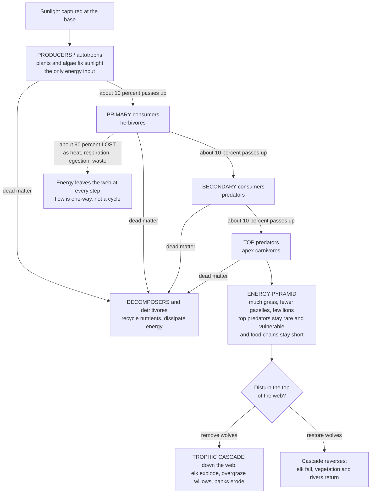

# 🍽️ Food Webs and Trophic Dynamics

> [!abstract] TL;DR
> A **food web** is the map of **who eats whom** in a community — the wiring diagram that traces how energy captured from the sun flows through all life. Organisms sit at **trophic levels** (feeding levels): **producers** (plants and algae that photosynthesize — the energy base), **primary consumers** (herbivores), **secondary and tertiary consumers** (carnivores), on up to **top predators**, with **decomposers** (fungi, bacteria) recycling everything at the end. The single most consequential law of this flow is brutal: at each step *up* the chain, roughly **90% of the energy is lost** — as respiration heat, movement, incomplete consumption, and waste — so only about **10% passes to the next level** (the *10% rule*, Lindeman 1942). This dictates nature's fundamental shape: a huge biomass of grass, less of gazelles, only a few lions — an **energy pyramid**, wide at the bottom, narrow at the top. It explains why **top predators are always rare and vulnerable**, why **food chains are short** (energy runs out after ~4–5 links), and why eating low on the chain feeds more people. Because the strands are connected, disturbances **cascade**: remove Yellowstone's wolves and elk explode and overgraze; restore the wolves and the whole ecosystem — even the rivers — recovers. Toxins do the reverse of energy: they **biomagnify** *upward*. Pull one strand and the whole web trembles.

---

## Intuition

**Analogy — the community as a giant meal-sharing map.** Draw an arrow from every creature to whatever eats it. Grass feeds the grasshopper, the grasshopper feeds the shrew, the shrew feeds the hawk. Do this for every species and you get a tangled diagram of **who is dinner for whom** — a **food web**. Every arrow is a pipe carrying **energy**, and all the energy entered at one place: the sun, captured by green plants at the bottom.

Now the crucial twist. Each pipe is **leaky — catastrophically so**. When a grasshopper eats grass, it burns most of that energy just staying alive (breathing, moving, keeping warm), loses more in droppings, and never eats the whole plant. By the time you tally what's left to build *grasshopper* that a shrew could eat, only about a **tenth** of the grass's energy made it through. Then the shrew loses 90% again, and the hawk loses 90% again. Energy doesn't recycle up the chain — it **drains away as heat at every step**.

That leak is why nature is shaped like a **pyramid**: enormous fields of grass, fewer gazelles, only a handful of lions. There is simply not enough energy left near the top to feed many big predators — which is exactly why **apex predators are always rare and the first to vanish**, why **food chains are short** (after four or five steps the energy is gone), and why a field of wheat feeds far more people than the cattle that same field could raise. And because every creature is a knot in the web, yanking one strand shakes the rest: pull out the wolves and the elk explode, strip the willows bare, and the riverbanks erode — a **trophic cascade** rippling top-to-bottom. Put the wolves back, and the cascade runs in reverse and the land heals.

---

## How It Works

### Core mechanics

1. **Energy enters once, at the bottom.** **Producers** (autotrophs — plants, algae, cyanobacteria; and chemoautotrophs at deep-sea vents) fix external energy into chemical bonds via photosynthesis (or chemosynthesis). This **primary production** is the *only* energy input to the whole web; everything above merely re-routes it.

2. **Consumers pass it up, level by level.** A **primary consumer** (herbivore) eats producers; a **secondary consumer** eats herbivores; a **tertiary consumer** or **top predator** eats those. An organism's **trophic level** is its number of feeding steps above the producers. **Omnivores** and most real predators feed at several levels at once, so trophic level is often a fractional average, not an integer.

3. **The 10% rule: most energy is lost at every transfer.** Of the energy in one level, only a fraction — the **trophic (ecological) transfer efficiency**, on average ~**10%** (empirically 5–20%) — becomes biomass available to the next. The rest exits as: **respiration** (heat, the Second Law taking its cut), **egestion** (undigested matter in feces), **excretion**, and **unconsumed/uneaten** production. Energy flow is therefore **one-way and dissipative** — it is *not* a cycle. (Nutrients like nitrogen and carbon *do* cycle; energy does not.)

4. **Decomposers close the loop for matter, not energy.** **Decomposers and detritivores** (fungi, bacteria, earthworms, dung beetles) consume dead bodies and waste — the **detrital web**, which in most ecosystems processes *more* energy than the grazing web. They recycle **nutrients** back to producers but still dissipate the energy as heat.

5. **Consequences fall out of the arithmetic.** Because ~90% leaks per step, biomass and available energy shrink ~10-fold each level up — the **ecological pyramid**. Chains stay **short** (energy is exhausted by level 4–5); **top predators are rare** (too little energy to support many, so their populations are small and extinction-prone); and fat-soluble toxins do the opposite of energy — they **biomagnify**, concentrating ~10-fold *up* each step.

6. **Structure and control.** Food webs are **networks** describable by **connectance** (fraction of possible links realized) and **linkage density**. Two forces set abundances: **bottom-up control** (producers/resources limit what the levels above can build) and **top-down control** (predators regulate the levels below). When top-down control dominates, removing or adding a top predator triggers a **trophic cascade** that flips abundances in an **alternating** pattern down the web.

### Flow



---

## Key Concepts

### Secondary — who eats whom, and where the energy goes

- **Food chain vs food web.** A **food chain** is a single linear path (grass → grasshopper → shrew → hawk). A **food web** is the realistic tangle of *many* interlinked chains — because most animals eat, and are eaten by, several things.
- **Trophic levels — the feeding floors.** **Producers** (plants/algae) make food from sunlight and form the base. **Primary consumers** (herbivores) eat producers. **Secondary/tertiary consumers** (carnivores) eat other animals. **Decomposers** (fungi, bacteria) break down the dead and recycle it.
- **The 10% rule.** Only about **one-tenth** of the energy at one level reaches the next; the other ~90% is used up living or lost as waste and heat. This is the master fact of the whole topic.
- **The energy pyramid.** Stack the levels and each is ~10× smaller than the one below — lots of grass, fewer gazelles, few lions. That is why **big predators are rare** and why **food chains are short**.

### Undergraduate — efficiency, pyramids, and the second law

- **Trophic (ecological) transfer efficiency.** The percentage of energy passed to the next level: $\text{TE} = \dfrac{\text{production at level } n{+}1}{\text{production at level } n}\times 100$. Averages ~10%, but ranges 5–20% (higher for aquatic/ectotherm-dominated webs, lower where endotherms burn energy on body heat).
- **Where the energy leaks.** Of energy ingested, only part is assimilated (**assimilation efficiency**), only part of that becomes new tissue (**net production efficiency** — endotherms respire away most of it), and only part of a level's production is actually eaten (**consumption/exploitation efficiency**). Their product is the transfer efficiency.
- **Ecological pyramids — three flavors.** A **pyramid of energy** is *always* right-side-up (thermodynamics forbids otherwise). A **pyramid of biomass** usually narrows upward but can **invert** (e.g., open ocean: a small, fast-turning-over biomass of phytoplankton supports a larger standing biomass of zooplankton). A **pyramid of numbers** can be top-heavy (one oak tree feeds thousands of insects).
- **Why chains are short.** Start with 100,000 units at the producers; after four 10% steps only ~10 remain — not enough to build a viable population. This energetic exhaustion (plus the instability of long chains) caps most chains at ~4–5 links.
- **The Second Law connection.** The ~90% loss is the **Second Law of Thermodynamics** operating in an ecosystem: every energy transformation exports entropy as low-grade heat. An ecosystem is a **dissipative structure** that maintains order by continuously degrading high-quality solar energy — see [[Entropy_and_Second_Law]].
- **Biomagnification.** Persistent, fat-soluble toxins (**DDT**, **methylmercury**, PCBs) are *not* excreted, so unlike energy they **accumulate and concentrate ~10× per step up** — which is why top predators (ospreys, tuna, orcas) carry the highest toxic loads even when water concentrations are minuscule.

### Graduate — web structure, stability, and cascades

- **Food-web network metrics.** Treat species as nodes ($S$) and feeding links as edges ($L$). **Connectance** $C = L/S^2$ (fraction of possible links realized); **linkage density** $L/S$. Real webs are sparse ($C \approx 0.03$–$0.30$) with characteristic motifs (omnivory, apparent competition, intraguild predation). Trophic level can be computed as the average chain length weighted over prey, yielding **fractional trophic positions**.
- **The diversity–stability debate (May's paradox).** Intuition (Elton, MacArthur) held that more complex webs are more stable. **Robert May (1972)** showed mathematically the opposite for random webs: as species richness, connectance, and interaction strength rise, the probability of a stable equilibrium *falls* ($\sqrt{SC}\,\sigma < 1$ roughly bounds stability). The resolution: real webs are *not* random — they are stabilized by many **weak interactions**, few strong ones, skewed link distributions, and modular structure, which damp oscillations. See [[Network_Science_Fundamentals]] and [[Resilience_and_Robustness]].
- **Top-down vs bottom-up control.** **Bottom-up:** resource/producer supply limits each higher level (add nutrients → more plants → more herbivores → more predators). **Top-down:** predators cap the level below. Most real systems mix both; which dominates varies with productivity, body size, and system type (the *exploitation ecosystems / green-world* hypotheses).
- **Trophic cascades.** In a top-down-controlled chain, perturbing the apex propagates downward with **alternating sign**: predator ↓ → herbivore ↑ → plant ↓ (and the reverse on restoration). **Paine's (1966)** *Pisaster* sea-star removal — the founding **keystone predation** experiment — showed one predator maintaining whole-community diversity; **Estes & Palmisano** documented **sea otters → urchins → kelp**; **Yellowstone wolves → elk → willows/beaver/rivers** is the charismatic terrestrial case.
- **Apex-predator loss and its knock-on effects.** Removing top predators triggers **mesopredator release** (mid-level predators explode when their controllers vanish) and, at planetary scale, the **trophic downgrading of Planet Earth** (Ripple, Estes et al. 2011): the loss of large predators and herbivores is argued to be humankind's most pervasive influence on nature, reshaping fire regimes, disease, carbon storage, and invasion.
- **Fishing down the food web.** Industrial fisheries first strip large, high-trophic-level predators, then target progressively smaller, lower-level species — the **mean trophic level of catches declines** over time (Pauly et al. 1998), a signature of serial ecosystem depletion.

---

## Python Demo

```python
# Food webs & trophic dynamics — three views of the same energetic logic:
#   Panel 1  ENERGY PYRAMID / 10% RULE: energy collapses ~10-fold each level up
#   Panel 2  TROPHIC CASCADE: remove the top predator -> herbivores boom, plants crash
#   Panel 3  FOOD-WEB NETWORK: species as nodes, feeding links as edges, connectance
import numpy as np
import matplotlib.pyplot as plt

# ============================================================ Panel 1: pyramid
levels = ["Producers", "Herbivores", "Carnivores", "Top predators"]
colors = ["#2e8b57", "#d4a017", "#e8722c", "#b22222"]
eff    = 0.10                                   # 10% trophic transfer efficiency
E0     = 100_000.0                              # energy units fixed by producers
energy = E0 * eff ** np.arange(len(levels))     # [1e5, 1e4, 1e3, 1e2]

# plants-vs-meat: to deliver 2000 kcal to a human, cost in primary production
target = 2000.0
cost_as = {lv: target / eff ** (i) for i, lv in enumerate(
    ["as producers (grain)", "as herbivores (beef)", "as carnivores"])}
print("Primary production needed to put 2000 kcal on a human plate:")
for k, v in cost_as.items():
    print(f"  {k:<26}: {v:>10,.0f} kcal  ({v/target:.0f}x)")

# ============================================================ Panel 2: cascade
# Tri-trophic model: Plant P, Herbivore H, Predator C (logistic plant, type-I)
r, K = 1.0, 1.0        # plant growth, carrying capacity
a, e = 1.0, 0.5        # herbivore attack on plant, conversion
m, b = 0.15, 1.0       # herbivore death, predator attack on herbivore
f, d = 0.5, 0.2        # predator conversion, predator death
dt, T = 0.005, 120.0
steps = int(T / dt)
t_remove = 60.0                                 # wolves removed here
t = np.linspace(0.0, T, steps + 1)
P = np.empty(steps + 1); H = np.empty(steps + 1); C = np.empty(steps + 1)
P[0], H[0], C[0] = 0.60, 0.40, 0.15             # start at with-predator equilibrium
for i in range(steps):
    p, h, c = P[i], H[i], C[i]
    if t[i] >= t_remove:
        c = 0.0                                 # top predator removed (stays gone)
    dP = r * p * (1 - p / K) - a * p * h
    dH = e * a * p * h - m * h - b * h * c
    dC = f * b * h * c - d * c
    P[i + 1] = p + dt * dP
    H[i + 1] = h + dt * dH
    C[i + 1] = max(c + dt * dC, 0.0)

# ============================================================ Panel 3: network
# name: (x, y=trophic level)
nodes = {
    "Grass": (0.6, 0), "Shrub": (2.6, 0),
    "Hopper": (0.2, 1), "Rabbit": (1.6, 1), "Mouse": (2.9, 1),
    "Spider": (0.7, 2), "Snake": (2.3, 2),
    "Hawk": (1.2, 3), "Fox": (2.7, 3),
}
edges = [                                        # (prey -> predator)
    ("Grass", "Hopper"), ("Grass", "Rabbit"), ("Grass", "Mouse"),
    ("Shrub", "Rabbit"), ("Shrub", "Mouse"),
    ("Hopper", "Spider"), ("Hopper", "Snake"),
    ("Mouse", "Snake"), ("Mouse", "Fox"), ("Mouse", "Hawk"),
    ("Rabbit", "Fox"), ("Rabbit", "Hawk"),
    ("Spider", "Snake"), ("Spider", "Hawk"), ("Snake", "Hawk"),
]
S, L = len(nodes), len(edges)
connectance = L / S ** 2
level_color = {0: "#2e8b57", 1: "#d4a017", 2: "#e8722c", 3: "#b22222"}

# =================================================================== plotting
fig, ax = plt.subplots(1, 3, figsize=(17, 5.2))

# Panel 1 — centered horizontal bars (classic pyramid), annotated with energy
for i, (lv, en, col) in enumerate(zip(levels, energy, colors)):
    ax[0].barh(i, en, left=-en / 2, height=0.6, color=col, edgecolor="black")
    ax[0].text(0, i, f"{lv}\n{en:,.0f} energy units", ha="center", va="center",
               fontsize=8, fontweight="bold")
ax[0].set_xlim(-E0 * 0.6, E0 * 0.6)
ax[0].set_yticks([]); ax[0].set_xticks([])
ax[0].set_title("Energy pyramid — 10% rule\n(each level ~10x smaller)")
for s in ["top", "right", "left", "bottom"]:
    ax[0].spines[s].set_visible(False)

# Panel 2 — the cascade
ax[1].plot(t, P, color="#2e8b57", lw=2, label="Plants (producers)")
ax[1].plot(t, H, color="#d4a017", lw=2, label="Herbivores")
ax[1].plot(t, C, color="#6a0dad", lw=2, label="Top predator")
ax[1].axvline(t_remove, color="black", ls="--", lw=1)
ax[1].text(t_remove + 1, 0.72, "predator\nremoved", fontsize=8)
ax[1].set_xlabel("Time"); ax[1].set_ylabel("Relative abundance")
ax[1].set_title("Trophic cascade\npredator down -> herbivore up -> plant down")
ax[1].legend(fontsize=8, loc="center left"); ax[1].grid(alpha=0.3)

# Panel 3 — food-web network
for prey, pred in edges:
    x0, y0 = nodes[prey]; x1, y1 = nodes[pred]
    ax[2].annotate("", xy=(x1, y1), xytext=(x0, y0),
                   arrowprops=dict(arrowstyle="->", color="0.6", lw=1))
for name, (x, y) in nodes.items():
    ax[2].scatter(x, y, s=650, color=level_color[y], edgecolor="black", zorder=3)
    ax[2].text(x, y, name, ha="center", va="center", fontsize=7,
               fontweight="bold", zorder=4)
ax[2].set_ylim(-0.5, 3.5); ax[2].set_xlim(-0.4, 3.6)
ax[2].set_yticks(range(4))
ax[2].set_yticklabels(["Producers", "Herbivores", "Carnivores", "Top preds"], fontsize=8)
ax[2].set_xticks([])
ax[2].set_title(f"Food-web network\nS={S} species, L={L} links, "
                f"connectance={connectance:.2f}")

plt.tight_layout()
plt.show()

print(f"\nEnergy at each level: {dict(zip(levels, energy.astype(int)))}")
print(f"With predator  -> P={P[int(t_remove/dt)-1]:.2f} H={H[int(t_remove/dt)-1]:.2f}")
print(f"Predator gone  -> P={P[-1]:.2f} H={H[-1]:.2f}  (plants crash, herbivores boom)")
```

**Panel 1** shows the crux: linear bar widths make the drama unmissable — the producer band dwarfs everything, herbivores are a tenth of it, and carnivores and top predators are near-invisible slivers. That is *why* apex predators are rare. **Panel 2** starts at a three-level equilibrium; the instant the predator is removed the herbivore population booms and the plants collapse — the textbook cascade, with the alternating up/down/up signature. **Panel 3** draws the realistic tangle a food *web* really is, and prints its **connectance** — the structural number ecologists use to compare web complexity. The printout also makes the plants-vs-meat point: delivering the same calories as beef costs ~10× the primary production of delivering them as grain.

---

## Real-World Applications

> **Yellowstone wolves — the cascade made visible.** After wolves (*Canis lupus*) were reintroduced in 1995 following ~70 years of absence, elk numbers fell and — more importantly — elk stopped lingering in exposed river valleys. Willows and aspen regrew, beavers returned and built dams, songbird and fish habitat recovered, and stabilized banks changed how streams meandered. It is the most cited terrestrial **trophic cascade**, illustrating both top-down control and how apex-predator restoration can heal an ecosystem — the empirical anchor for **rewilding** and *trophic restoration* (developed in this vault's *Ecosystem_Based_Management_and_Rewilding*).

- **Fisheries — fishing down the web and the MSY trap.** Because energy thins toward the top, large predatory fish (cod, tuna, sharks) support only small populations and crash first; fleets then shift to smaller, lower-trophic species, lowering the **mean trophic level** of catches. Ecosystem-based fisheries management uses food-web models (Ecopath) to set quotas that account for these linkages rather than one stock at a time.
- **Biomagnification and pollution control.** DDT concentrating up to raptors (thinning eggshells, near-extirpating the bald eagle and peregrine) and **methylmercury** in tuna and swordfish are direct consequences of trophic dynamics running in reverse for fat-soluble toxins — the founding logic of ecotoxicology and of dietary-mercury advisories (developed in *Pollution_and_Ecotoxicology*).
- **Agriculture and food security.** The 10% rule is why a plant-based diet has a far smaller land-and-energy footprint than a meat-based one: each trophic step up multiplies the primary production (and land, water, emissions) required per calorie by roughly ten. This single principle underlies much of the sustainability case around diet.
- **Marine protected areas and kelp forests.** Protecting **sea otters** restores urchin control and lets kelp forests — themselves major carbon sinks and nurseries — regrow, a cascade with direct conservation and blue-carbon payoffs.
- **Pest control via natural enemies.** Conserving or introducing predators to suppress herbivorous pests (biological control) is applied top-down control — powerful when it works, catastrophic (cane toad, mongoose) when the introduced predator finds other prey.

---

## Common Pitfalls

- **"Energy cycles through the ecosystem."** It does not. **Matter (nutrients) cycles; energy flows one way and dissipates as heat.** Every ecosystem needs a continuous *new* input of solar energy precisely because the old energy is gone for good — the Second Law, not a bookkeeping quirk.
- **"The 10% is a law of physics fixing exactly 10%."** It is an empirical *average*; real transfer efficiencies span ~5–20% depending on whether the level is dominated by energy-expensive endotherms (lower) or efficient ectotherms (higher). Use it as an order-of-magnitude rule, not a constant.
- **"Pyramids always narrow upward."** Only the **energy** pyramid must. **Biomass pyramids can invert** (fast-cycling phytoplankton supporting a larger standing zooplankton biomass) and **number pyramids can be top-heavy** (one tree, thousands of insects). Confusing the three is a classic exam trap.
- **"A food chain describes reality."** Chains are teaching simplifications. Real communities are **webs** with omnivory and cross-links; ignoring them makes cascade predictions and extinction-risk assessments badly wrong.
- **"More complex webs are automatically more stable."** May's paradox showed random complexity is *de*stabilizing; real webs persist because of *structured* complexity (weak links, modularity), not complexity per se. Don't assume diversity guarantees stability.
- **"Losing a rare top predator barely matters — it's just a few animals."** Keystone and apex predators exert influence out of all proportion to their biomass. Removing them can trigger cascades and mesopredator release that reorganize the entire community. Rarity is a *reason for concern*, not for complacency.
- **"Biomagnification works like energy loss."** Opposite direction: energy *thins* upward, but persistent fat-soluble toxins *concentrate* upward — which is why apex predators are simultaneously the rarest organisms and the most contaminated.

---

## Related Concepts

- [[Ecosystems_and_Energy_Flow]] — the Biology-vault companion that sets food-web energetics inside whole-ecosystem primary production, GPP/NPP, and nutrient cycling; this note zooms into the trophic wiring that carries that energy.
- [[Community_Ecology]] — food webs *are* the interaction network of a community; keystone predation, competition, and species interactions all live here, and trophic cascades are community-level phenomena.
- [[Population_Growth_and_Regulation]] — supplies the single-species logistic and predator regulation that, when coupled across trophic levels, generate the cascade dynamics simulated above (top-down vs bottom-up control of $N$).
- [[Entropy_and_Second_Law]] — the ~90% loss at each transfer *is* the Second Law: every trophic step exports entropy as heat, which is why energy flow is one-way and pyramids of energy can never invert.
- [[Network_Science_Fundamentals]] — food webs are directed networks; connectance, linkage density, motifs, and the diversity–stability (May) debate are network-science questions applied to who-eats-whom.
- [[Resilience_and_Robustness]] — why *structured* complexity (weak links, modularity) stabilizes real webs, and how apex-predator loss erodes the resilience that keeps a community in its current configuration.

Within this section of the vault, this note is the energetic backbone of community ecology. Community_Ecology_and_Species_Interactions supplies the competition, predation, and mutualism links that the web is woven from; Predator_Prey_and_Population_Interactions provides the coupled two-species dynamics that scale up into the tri-trophic cascade modeled here; Ecosystem_Ecology_and_Energy_Flow carries the same energy up to the whole-ecosystem scale of primary production and nutrient cycling; Ecosystem_Based_Management_and_Rewilding applies trophic cascades to restoration (the Yellowstone wolves); and Pollution_and_Ecotoxicology follows the reverse flow of biomagnifying toxins up the very same chain.

---

## Review Questions

1. **(Secondary)** A meadow captures 100,000 energy units in its grass. Using the 10% rule, roughly how much energy reaches the hawks four trophic levels up? Explain in your own words why this arithmetic means there can only ever be a *few* hawks and why food chains rarely have more than four or five links.
2. **(Undergraduate)** Distinguish the pyramid of *energy*, of *biomass*, and of *numbers*. Give one real example where the biomass pyramid **inverts** and one where the number pyramid is **top-heavy**, and explain why the *energy* pyramid can never invert (name the physical law responsible).
3. **(Graduate)** A reserve loses its apex predator and its mid-sized herbivores and mesopredators then explode. (a) Name the two phenomena at work and predict the sign of the effect on producers. (b) May's 1972 result says random complex webs are *less* stable, yet species-rich real webs persist — reconcile these, naming at least two structural features that stabilize real food webs. (c) How would top-down versus bottom-up control change your prediction?

---

## Sources

- Lindeman, R. L. (1942). "The trophic-dynamic aspect of ecology." *Ecology*, 23(4), 399–417. — the paper that introduced trophic levels and the ~10% energy-transfer concept.
- Pimm, S. L. (2002). *Food Webs* (2nd ed.). University of Chicago Press. — the foundational synthesis of food-web structure, stability, and complexity.
- Paine, R. T. (1966). "Food web complexity and species diversity." *The American Naturalist*, 100(910), 65–75. — the *Pisaster* keystone-predation and trophic-cascade experiment.
- Ripple, W. J., Estes, J. A., et al. (2011). "Trophic downgrading of Planet Earth." *Science*, 333(6040), 301–306. — the global significance of apex-predator loss.
- May, R. M. (1972). "Will a large complex system be stable?" *Nature*, 238, 413–414. — the diversity–stability paradox that reframed food-web theory.

---

#ecology #food-webs #trophic-levels #energy-pyramid #trophic-cascade
