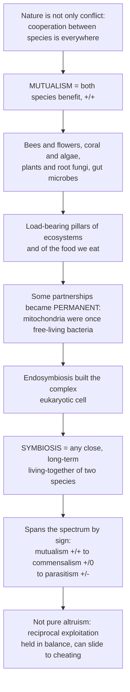

# 🐝 Mutualism, Commensalism, and Symbiosis

> [!abstract] TL;DR
> Nature is not only "red in tooth and claw" — **cooperation between species is everywhere, and life as we know it could not exist without it**. **Symbiosis** is any close, long-term living-together of two species, and it spans a spectrum by *sign*: **mutualism** (+/+, both benefit), **commensalism** (+/0, one benefits and the other is unaffected), and **parasitism** (+/−, one benefits at the other's expense). The load-bearing partnerships are the mutualisms — bees and flowers, corals and their algae, plants and root fungi, the microbes in your gut — and the deepest one, **endosymbiosis**, literally built the complex cell. But mutualism is *not* altruism: it is reciprocal self-interest held in balance, and it can slide toward cheating when the payoff shifts.

---

## Intuition

**Analogy:** Picture two shopkeepers on the same street. The baker needs flour; the miller needs bread. Neither is being kind — each simply trades what is cheap for them to make for what is expensive to get elsewhere, and *both walk away richer than they started*. That is **mutualism**: a deal between two different species in which both come out ahead. And these deals are not marginal curiosities — they are the load-bearing pillars of the living world. A bee visits a flower for a sip of nectar and, in doing so, carries pollen from bloom to bloom, quietly underwriting most of the food on your plate. A coral shelters microscopic algae inside its own tissue; the algae photosynthesize and feed the coral, and in return the coral gives them a safe, sunlit home — an exchange that builds every reef on Earth. Nearly all land plants wrap their roots in fungal threads that mine the soil for nutrients and get paid in sugar. Even *you* are a partnership: trillions of gut microbes digest food your own cells cannot.

Some of these deals became so profound that the partners never parted. The **mitochondria** powering every one of your cells were once free-living bacteria that entered a mutualism so deep that the two organisms merged into one — the event called **endosymbiosis** that built the complex, energy-hungry cell all animals, plants, and fungi are made of. Cooperation, quite literally, assembled us.

The broad word for any of this close living-together is **symbiosis**, and it runs across a whole spectrum by who gains and who loses: from **mutualism** (both win, +/+) through **commensalism** (one gains, the other neither wins nor loses, +/0 — like a bird nesting in a tree that neither helps nor harms the tree) to **parasitism** (one gains at the other's expense, +/−). The subtle, crucial insight is that mutualisms are not acts of generosity. They are *reciprocal exploitation held in balance* — each partner extracting a service — and when the balance of costs and benefits shifts, a "friend" can quietly become a "cheat" or even a parasite. Understanding cooperation between species reveals that ecosystems are woven together as much by partnership as by conflict, and that some of our most vital resources — pollination, healthy soils, coral reefs — hang on these fragile alliances.

---

## How It Works

### Core mechanics

1. **Symbiosis is the umbrella term.** It means only "living together" (Greek *sym-* + *bios*) — a prolonged, intimate association between two different species. It says *nothing* about who benefits. Classifying a symbiosis means asking the sign of the outcome for each partner.
2. **The sign convention.** Ecologists label an interaction by its net fitness effect on each of the two species: **mutualism (+/+)**, **commensalism (+/0)**, **parasitism/predation (+/−)**, competition (−/−), and amensalism (−/0). Mutualism, commensalism, and parasitism are the three *symbiotic* faces of this table.
3. **Mutualism works by reciprocal exchange.** Each partner supplies a good or service that is *cheap for it to produce but valuable to the other*: nectar and sugars (food), physical shelter or defense (protection), or movement of pollen and seeds (transport). Because each side gains more than it pays, both partners' survival and reproduction — their **fitness** — rise, which in population terms *raises the effective carrying capacity* of each.
4. **Dependence varies.** A mutualism can be **facultative** (helpful but optional — a generalist bee visiting many flowers) or **obligate** (neither partner can survive or reproduce without the other — a fig and its single species of fig wasp). It can be **endosymbiotic** (one partner lives *inside* the other, like algae inside coral) or **ectosymbiotic** (living on the surface, like cleaner fish).
5. **The deepest mutualisms fuse the partners.** When an endosymbiont becomes permanently integrated and heritable, the two lineages become one organism. The **endosymbiotic theory** holds that mitochondria and chloroplasts arose this way — free-living bacteria engulfed by an ancestral cell, retained because the partnership paid off in energy.
6. **Mutualism is not altruism, so it must be stabilized.** Because each partner would do even better by taking the benefit without paying the cost, mutualisms are perpetually vulnerable to **cheaters**. They persist only when cheating is punished or made unprofitable — through **partner choice**, **host sanctions**, **partner-fidelity feedback**, or spatial structure — otherwise they erode and can slide along the **mutualism–parasitism continuum**.

### Flow / Architecture



---

## Key Concepts

### Secondary
- **Symbiosis** — two different species living closely together for a long time. The word means only "living together" and does not say who benefits.
- **Mutualism (+/+)** — both partners benefit. Bees get nectar while flowers get pollinated; clownfish get shelter while anemones get cleaned and defended.
- **Commensalism (+/0)** — one partner benefits and the other is neither helped nor harmed, such as a bird nesting in a tree or barnacles riding on a whale.
- **Parasitism (+/−)** — one partner benefits at the other's expense, like a tapeworm in a gut. It is the "dark twin" of mutualism.
- **Pollination** — the mutualism between flowering plants and their animal pollinators; roughly three of every four food crops depend at least partly on it.
- **Why it matters** — cooperation between species, not just competition, holds ecosystems together and underpins much of the food we eat.

### Undergraduate
- **Obligate vs facultative** — obligate mutualists cannot live or reproduce without the partner (fig–fig wasp, many corals); facultative ones benefit but can get by alone (generalist pollinators).
- **Endo- vs ecto-symbiosis** — the partner lives inside the host's cells or body (zooxanthellae in coral, *Rhizobium* in root nodules) versus on its surface (cleaner fish, gut lining microbes at the interface).
- **Trophic, defensive, and dispersive mutualisms** — nutrient/energy exchange (mycorrhizae, nitrogen fixation, coral–algae), protection (ant–acacia, cleaner fish), and transport (pollination, seed dispersal by frugivores).
- **Mycorrhizae** — fungi sheathing plant roots trade soil-mined phosphorus and nitrogen for the plant's photosynthetic sugars; they support roughly 90% of land plant species and vastly extend the effective root surface.
- **Nitrogen-fixing symbiosis** — legumes house *Rhizobium* bacteria in root nodules; the bacteria convert atmospheric N₂ into usable ammonia in exchange for carbon, the biological engine behind crop rotation.
- **Coral–zooxanthellae** — reef-building corals host photosynthetic dinoflagellate algae that supply up to ~90% of the coral's energy; heat stress causes the coral to expel them (**bleaching**), starving the reef and linking this mutualism directly to climate change.
- **Coevolution** — reciprocal evolutionary change between partners, producing exquisite matches such as a moth's tongue length tracking a flower's nectar-spur depth.

### Graduate
- **Endosymbiotic theory** — Lynn Margulis's argument that mitochondria and chloroplasts descend from once-free-living bacteria; the ultimate mutualism, in which a +/+ partnership became a single organism and made the eukaryotic cell possible.
- **The mutualism–parasitism continuum** — the sign of an interaction is *context-dependent*: mycorrhizae become parasitic in nutrient-rich soil (the plant pays sugar for little return), and cleaner fish cheat by eating host mucus. The same partnership can be +/+, +/0, or +/− depending on environment and partner state.
- **Biological markets** — mutualisms modeled as trade under supply, demand, and outside options; partners that offer better "exchange rates" attract more custom, and commodities are exchanged much like goods in a market.
- **Stabilization against cheaters** — mechanisms that keep +/+ from collapsing to +/−: **partner choice** (rewarding good partners), **host sanctions** (legumes starve nodules that fix little N₂), **partner-fidelity feedback** (repeated interaction couples partner welfare to your own), and spatial population structure.
- **Population dynamics and instability** — in Lotka–Volterra terms, mutualism raises each partner's carrying capacity, but *unbounded* positive feedback produces an "orgy of mutual benefaction" (May) that runs away to infinity; real mutualisms are stabilized by saturating benefits and self-limitation.
- **Mutualistic networks** — plant–pollinator and plant–frugivore webs are typically **nested** and **modular**, an architecture that buffers communities but can propagate **co-extinction** when hub species are lost.

---

## Python Demo

```python
# Two faces of mutualism and symbiosis:
#   (A) POPULATION DYNAMICS  - two mutualists each raise the other's
#       effective carrying capacity (facilitation), so both settle
#       ABOVE the level they would reach alone.
#   (B) COST-BENEFIT / THE CONTINUUM - the SAME partnership flips from
#       mutualism (+/+) to parasitism (+/-) when the context (here, soil
#       richness) shifts the balance of benefit and cost.
import numpy as np
import matplotlib.pyplot as plt

# ============================================================
# (A) MUTUALISM POPULATION DYNAMICS
#   dN1/dt = r1*N1*(1 - N1/K1 + a12*N2/K1)
#   dN2/dt = r2*N2*(1 - N2/K2 + a21*N1/K2)
# a12, a21 > 0 : each partner boosts the other's carrying capacity.
# Stable only while a12*a21 < 1, else (+/+) growth runs away.
# ============================================================
r1, r2 = 0.8, 0.7
K1, K2 = 100.0, 120.0
a12, a21 = 0.6, 0.5                    # a12*a21 = 0.30 < 1  -> stable

dt, T = 0.01, 60.0
steps = int(T / dt)
t = np.linspace(0, T, steps)

def run(mutualism=True):
    N1 = np.zeros(steps); N2 = np.zeros(steps)
    N1[0] = N2[0] = 5.0
    b12 = a12 if mutualism else 0.0
    b21 = a21 if mutualism else 0.0
    for i in range(steps - 1):
        dN1 = r1 * N1[i] * (1 - N1[i] / K1 + b12 * N2[i] / K1)
        dN2 = r2 * N2[i] * (1 - N2[i] / K2 + b21 * N1[i] / K2)
        N1[i + 1] = N1[i] + dt * dN1
        N2[i + 1] = N2[i] + dt * dN2
    return N1, N2

N1m, N2m = run(True)     # with the mutualistic partner
N1s, N2s = run(False)    # each species alone (no partner benefit)

# ============================================================
# (B) COST-BENEFIT: THE MUTUALISM-PARASITISM CONTINUUM
# A plant-mycorrhiza partnership. The fungus is valuable when the
# soil is poor; the plant always pays a fixed sugar cost. As soil
# richness rises, the NET effect on the plant flips sign.
# ============================================================
soil    = np.linspace(0, 1, 400)      # soil nutrient availability (context)
benefit = 1.0 * (1 - soil)            # partner worth more in poor soil
cost    = 0.45 * np.ones_like(soil)   # fixed sugar cost of hosting the fungus
net     = benefit - cost              # net fitness effect on the plant
flip    = soil[np.argmin(np.abs(net))]  # context where +/+ becomes +/-

# ---- plot ----
fig, (ax1, ax2) = plt.subplots(1, 2, figsize=(12, 4.6))

ax1.plot(t, N1m, color="seagreen",   lw=2.4, label="Species 1 with partner")
ax1.plot(t, N2m, color="darkorange", lw=2.4, label="Species 2 with partner")
ax1.plot(t, N1s, color="seagreen",   lw=1.6, ls="--", label="Species 1 alone")
ax1.plot(t, N2s, color="darkorange", lw=1.6, ls="--", label="Species 2 alone")
ax1.axhline(K1, color="gray", ls=":", lw=1)
ax1.axhline(K2, color="gray", ls=":", lw=1)
ax1.set_title("(A) Mutualism lifts both partners above K")
ax1.set_xlabel("Time"); ax1.set_ylabel("Population size")
ax1.legend(fontsize=8); ax1.grid(alpha=0.3)

ax2.plot(soil, benefit, color="seagreen", lw=2.2, label="Benefit from partner")
ax2.plot(soil, cost,    color="firebrick", lw=2.2, ls="--", label="Cost of hosting")
ax2.plot(soil, net,     color="navy", lw=2.6, label="Net effect on plant")
ax2.axhline(0, color="black", lw=1)
ax2.axvline(flip, color="purple", ls=":", lw=1.5)
ax2.fill_between(soil, net, 0, where=(net >= 0), color="seagreen", alpha=0.15)
ax2.fill_between(soil, net, 0, where=(net < 0),  color="firebrick", alpha=0.15)
ax2.text(flip * 0.35, 0.35, "MUTUALISM\n+/+", ha="center", color="seagreen", fontsize=9)
ax2.text(0.5 + flip * 0.5, -0.28, "PARASITISM\n+/-", ha="center", color="firebrick", fontsize=9)
ax2.set_title("(B) The mutualism-parasitism continuum")
ax2.set_xlabel("Soil nutrient availability (context)")
ax2.set_ylabel("Fitness effect on plant")
ax2.legend(fontsize=8, loc="upper right"); ax2.grid(alpha=0.3)

plt.tight_layout(); plt.show()

print(f"Species 1: alone -> {N1s[-1]:.1f}, with partner -> {N1m[-1]:.1f}")
print(f"Species 2: alone -> {N2s[-1]:.1f}, with partner -> {N2m[-1]:.1f}")
print(f"Mutualism flips to parasitism at soil richness ~ {flip:.2f}")
```

Panel **(A)** shows the signature of mutualism: with a reciprocal partner, both species settle *above* the carrying capacity they reach alone — cooperation raises the ceiling on abundance (facilitation). Panel **(B)** shows why mutualism is not a fixed category: model a plant's mycorrhizal fungus as a fixed-cost partner whose benefit shrinks as soil grows rich, and the net effect on the plant crosses zero — the *same* relationship is a mutualism in poor soil and a parasitism in fertile soil. The sign of an interaction is a property of the context, not just the species.

---

## Real-World Applications

- **Crop pollination.** Roughly 75% of leading global food crops and about a third of production volume depend at least partly on animal pollinators; declines in managed honeybees and wild bees (habitat loss, pesticides, disease) threaten yields of fruit, nuts, and vegetables and drive pollinator-friendly farming and hedgerow restoration.
- **Mycorrhizal and rhizobial biofertilizers.** Inoculating crops and reforestation seedlings with mycorrhizal fungi improves phosphorus uptake and drought tolerance, while legume–*Rhizobium* nitrogen fixation (exploited through crop rotation and cover cropping) reduces the need for synthetic fertilizer and its emissions.
- **Coral reef conservation under climate change.** Because reef corals depend on their algal symbionts for most of their energy, marine heatwaves that trigger **bleaching** are an existential threat to reefs; conservation efforts breed and transplant heat-tolerant coral–algae pairings and manage local stressors to buy the mutualism time.
- **The human gut microbiome in medicine.** Gut microbes digest fiber, synthesize vitamins, and train the immune system; medicine now manipulates this mutualism deliberately through fecal microbiota transplants for *C. difficile* infection, probiotics, and microbiome-aware drug design.
- **Restoration and rewilding.** Rebuilding a degraded ecosystem often fails unless its key mutualists return too — reintroducing pollinators, seed-dispersing frugivores, or soil fungi is frequently the hidden prerequisite for plant communities to re-establish.

---

## Common Pitfalls

- **Treating mutualism as altruism.** Mutualism is reciprocal *self-interest*, not kindness. Each partner is extracting a benefit, and each would do better still by cheating — which is exactly why sanctions and partner choice exist. Framing it as generosity misses the entire evolutionary problem.
- **Confusing symbiosis with mutualism.** "Symbiotic" in everyday speech means "cooperative," but in ecology symbiosis is the *broad* term for close living-together and explicitly includes parasitism. A tapeworm is symbiotic; it is not your friend.
- **Assuming interactions have a fixed sign.** Mutualisms sit on a continuum and are context-dependent: mycorrhizae turn parasitic in rich soil, cleaner fish cheat, and cleaners' payoffs shift with hunger. Labeling a relationship "+/+" for all time ignores how easily the balance flips.
- **Reading commensalism as truly neutral.** Exact 0 effect on one partner is rare; an epiphyte shading a branch or a nesting bird fouling a limb usually has *some* small effect. Commensalism is often just a mutualism or mild parasitism we have not measured carefully.
- **Believing obligate mutualisms are robust.** Deep dependence is a *fragility*, not a strength: lose one partner and the other goes with it (co-extinction). Highly specialized fig–wasp or coral–algae partnerships are among the most vulnerable to disturbance.
- **Forgetting the cheater problem when modeling.** A naive positive-feedback mutualism model runs off to infinity ("orgy of mutual benefaction"). Realistic models require saturating benefits, self-limitation, and enforcement against exploitation.

---

## Related Concepts

Within this vault, mutualism sits inside the broader study of **Community_Ecology_and_Species_Interactions**, complements the antagonistic interactions covered in **Competition_and_Niche_Theory** and **Predator_Prey_and_Population_Interactions**, feeds the energy accounting of **Food_Webs_and_Trophic_Dynamics**, and connects directly to **Climate_Change_Ecology** through coral bleaching and pollinator disruption. The **Ecology_and_Conservation_Overview** hub frames how these species interactions build communities.

Across the wider vault, the following notes deepen specific threads (all verified present):

- [[Community_Ecology]] — Biology's treatment of species interactions and community structure, where symbiosis sits alongside competition and predation.
- [[Population_Ecology]] — the growth, carrying-capacity, and Lotka–Volterra machinery that mutualism modifies by raising *K*.
- [[Mitochondria_and_Chloroplasts]] — the organelles that the endosymbiotic theory identifies as once-free-living bacteria, the deepest mutualism of all.
- [[Photosynthesis]] — the process the algal symbionts of coral (and ancestral chloroplasts) run to feed their hosts.
- [[Natural_Selection_and_Adaptation]] — the selective engine behind coevolution and the exquisite fit between mutualistic partners.
- [[Host_Pathogen_and_Coevolution]] — reciprocal evolution that also governs how mutualisms tune and destabilize over time.
- [[The_Prisoners_Dilemma_and_Cooperation]] — the game-theoretic core of why cooperation is fragile and how it can still evolve.
- [[Direct_Reciprocity_and_Repeated_Games]] — repeated-interaction logic underlying partner-fidelity feedback and biological markets.
- [[Microbial_Games_and_Public_Goods]] — cheaters, sanctions, and public goods in microbial mutualisms, the clearest experimental test bed.

---

## Review Questions

1. **Secondary** — Define symbiosis, mutualism, commensalism, and parasitism, giving one real example of each. Why is it wrong to assume that "symbiotic" means "friendly"?
2. **Undergraduate** — A legume is grown first in nitrogen-poor soil and then in heavily fertilized soil while hosting the *same Rhizobium* bacteria. Explain, using costs and benefits, why the relationship can be mutualistic in one case and effectively parasitic in the other. What does this reveal about classifying interactions by sign?
3. **Graduate** — Mutualisms are perpetually vulnerable to cheaters, yet obligate mutualisms like fig–fig wasp persist for millions of years. Describe two distinct mechanisms that stabilize a mutualism against cheating, explain why each works, and discuss what conditions could push such a partnership along the mutualism–parasitism continuum toward breakdown or co-extinction.

---

## Sources

- Bronstein, J. L. (ed.) — *Mutualism* (Oxford University Press, 2015).
- Boucher, D. H. (ed.) — *The Biology of Mutualism: Ecology and Evolution* (Oxford University Press, 1985).
- Margulis, L. — *Origin of Eukaryotic Cells* (Yale University Press, 1970); "On the Origin of Mitosing Cells" (*J. Theoretical Biology*, 1967).
- Begon, M., Townsend, C. R., & Harper, J. L. — *Ecology: From Individuals to Ecosystems* (Blackwell) — chapters on mutualism and symbiosis.
- Bronstein, J. L. — "The exploitation of mutualisms" (*Ecology Letters*, 2001) — the mutualism–parasitism continuum and cheating.

---

#ecology #mutualism #symbiosis #pollination #endosymbiosis
