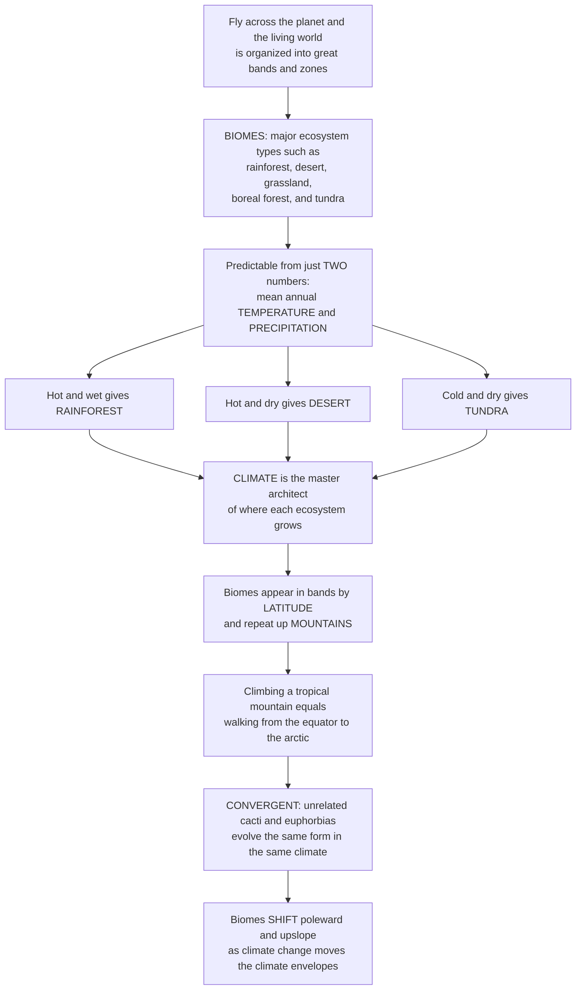

# 🌍 Biomes and Global Ecology

> [!abstract] TL;DR
> Fly across the planet and the living world resolves into great bands: steaming **tropical rainforest** near the equator, ringed by **deserts**, then temperate **forests** and **grasslands**, then dark **boreal forest**, and finally treeless **tundra** near the poles. These major ecosystem types are **biomes**, and the astonishing thing is that they are *predictable* — you can forecast which one grows anywhere on Earth from just **two numbers: mean annual temperature and precipitation** (how warm and how wet). Plot any location on those two axes — the classic **Whittaker diagram** — and it lands in its biome: hot-and-wet gives rainforest, hot-and-dry gives desert, cold-and-dry gives tundra. **Climate is the master architect.** That is why biomes appear in bands by **latitude** (temperature falls from equator to pole) *and* up **mountains** (climbing a tropical peak passes through the same sequence as walking to the arctic). Biomes are **convergent** — unrelated plants evolve the same forms in the same climates worldwide — and they **shift** as climate changes, migrating poleward and upslope. This is the global geography of life, and it is the frame for understanding where biodiversity and productivity live and how they will move.

---

## Intuition

**Analogy:** Imagine you are an astronaut looking down as your capsule slowly drifts from the equator toward the pole. You do not see a random smear of green and brown — you see **stripes**. A broad, dark, humid belt of rainforest hugs the equator. Flanking it, sharp bands of tawny desert. Then temperate forests and vast grasslands. Then a nearly unbroken dark-green ring of coniferous boreal forest. And finally, near the top of the world, a treeless brown-and-white band of tundra. The planet is *organized*, and it is organized the same way in the northern and southern hemispheres — a mirror image across the equator. Now here is the trick that turns geography into science: hand someone only **two numbers for any spot on Earth — how warm it is on average and how much rain falls — and they can tell you which stripe it belongs to**, without ever seeing it. Hot and wet? Rainforest. Hot and dry? Desert. Cold and dry? Tundra. Temperate and moderate? Deciduous forest.

That is the whole idea of biomes in one image. **Climate is the master architect of the living world**, and it works with just two main tools — temperature and precipitation (plus their seasonality). This is why the same logic that stacks biomes by *latitude* also stacks them by *elevation*: climb a single tropical mountain and you walk through rainforest, then cloud forest, then alpine meadow, then bare rock and snow — the same sequence you would meet trekking from the equator to the arctic, compressed into a few vertical kilometers, because temperature falls whether you go poleward or upward. And because climate, not ancestry, calls the shots, biomes are **convergent**: American deserts are full of spiny cacti while African deserts are full of spiny euphorbias that look almost identical — completely unrelated plants that evolved the same solution to the same climate on different continents. Understanding biomes — the planetary geography of life set by climate — tells you where Earth's biodiversity and productivity are concentrated, and, crucially, how they will *migrate* as climate change slides the temperature-and-precipitation envelopes that define every biome.

---

## How It Works

### Core mechanics

A biome is a **major, recognizable ecosystem type defined by its characteristic vegetation structure** — rainforest, grassland, tundra — that recurs wherever a similar climate recurs, regardless of which species happen to live there. The mechanism that places them is climate acting on plants.

1. **Vegetation is the visible signature of climate.** Plants cannot move, so the growth form that survives at a site is dictated by its water and energy budget. Enough warmth *and* water year-round builds a multi-layered forest; too little water builds a desert; too little warmth builds tundra. Because vegetation structure defines the biome, and climate defines vegetation, **climate predicts the biome**.
2. **Two variables carry most of the signal.** Robert Whittaker showed that plotting biomes on axes of **mean annual temperature** (x) and **mean annual precipitation** (y) sorts them into distinct, non-overlapping territories — the **Whittaker diagram**. Hot-wet corners hold tropical rainforest; hot-dry corners hold desert; the cold end holds tundra regardless of moisture. Soil and disturbance (especially fire) are *modifiers* that shift boundaries, but temperature and precipitation set the stage.
3. **Seasonality splits the biomes that share an annual mean.** Two sites with the same yearly totals can be different biomes if the *timing* differs. Rain concentrated in a wet season with a long dry season gives **savanna** or **Mediterranean shrubland** (fire-driven), whereas the same total spread evenly gives forest. Temperature seasonality separates aseasonal tropical forest from strongly seasonal temperate forest.
4. **Global circulation lays down the climate template.** The atmosphere's Hadley cells dump rain at the equator (rising, cooling air) and dry it out near 30° latitude (sinking air) — which is exactly why the planet's great deserts ring both subtropics. So the *pattern* of temperature and precipitation across latitude is not random; it is produced by physics, and the biomes simply track it.
5. **The same climate gradient runs vertically.** Air cools about 6.5°C per kilometer of ascent (the lapse rate), so climbing a mountain lowers temperature just as moving poleward does. The result is **elevational zonation** — a stack of life zones up a mountainside that parallels the latitudinal sequence. Roughly, gaining ~1 km of elevation is like moving ~1000 km poleward.
6. **Convergence proves climate is in charge.** Unrelated lineages on different continents evolve nearly identical forms under the same climate — succulent cacti in the Americas and succulent euphorbias in Africa, or the shrubby "Mediterranean" flora that appears independently in California, Chile, the Cape, and Australia. Same climate, same design, different ancestors.
7. **Because biomes are climate envelopes, they move when climate moves.** Warming shifts each biome's suitable temperature-precipitation window **poleward and upslope**. Boundaries migrate, mountaintop and polar biomes get squeezed toward vanishing, and some future climates have **no modern analog**, assembling "no-analog" communities that exist nowhere today.

### Flow / Architecture



---

## Key Concepts

### Secondary
- **Biome** — a major kind of ecosystem, named for its plants and climate: rainforest, desert, grassland, boreal forest, tundra. The same biome appears wherever the climate is the same.
- **Climate decides the biome** — how *warm* and how *wet* a place is tells you what grows there. Hot and wet makes rainforest; hot and dry makes desert; cold makes tundra.
- **Bands by latitude** — because the equator is warm and the poles are cold, biomes form stripes running around the planet, roughly mirrored north and south.
- **Up a mountain is like going toward the pole** — it gets colder as you climb, so a tall tropical mountain has rainforest at the bottom and tundra-like meadows near the top.
- **Same climate, same look** — desert plants on different continents (spiny American cacti and spiny African euphorbias) look alike even though they are not related, because they solved the same dry, hot problem.

### Undergraduate
- **The Whittaker diagram** — plot mean annual temperature against mean annual precipitation and every major terrestrial biome occupies a distinct region: tropical rainforest (hot, very wet), tropical seasonal forest and savanna (hot, seasonal), subtropical desert (hot, dry), temperate grassland and desert (dry), woodland/shrubland (Mediterranean, fire-prone), temperate deciduous and rainforest (moist temperate), boreal forest/taiga (cold, coniferous), and tundra (cold, treeless). Two axes, most of the map.
- **The major terrestrial biomes and their traits** — **tropical rainforest**: aseasonal, most biodiverse, high NPP but nutrient-poor soils (nutrients held in living biomass). **Savanna/tropical grassland**: seasonal rain, fire- and grazer-maintained. **Desert**: water-limited, sparse, high day-night temperature swings. **Temperate grassland/prairie**: seasonal, deep fertile mollisols. **Temperate deciduous forest**: cold winters, leaf drop. **Mediterranean/chaparral**: mild wet winters, dry summers, fire-adapted. **Boreal forest/taiga**: cold, coniferous, a vast global carbon store. **Tundra**: cold, treeless, underlain by permafrost.
- **Seasonality and disturbance as second-order controls** — annual means alone do not separate savanna from forest or chaparral from grassland; the *timing* of rain and the *frequency of fire* do. Fire is the keystone disturbance that keeps savannas and grasslands from becoming forest even where climate could support trees.
- **Elevational zonation and lapse rate** — temperature drops ~6.5°C/km of ascent, so mountains stack life zones vertically that mirror the latitudinal sequence; a tropical mountain runs from rainforest through montane and cloud forest to alpine meadow and permanent snow.
- **Aquatic systems follow an analogous but distinct logic** — marine (open ocean, coral **reefs**, kelp forests, estuaries, intertidal, deep sea) and freshwater (lakes, rivers, **wetlands**) systems are structured not by air temperature and rain but by **light, nutrients, temperature, salinity, and depth/flow** — the same idea (a few physical variables set the ecosystem) with different variables.

### Graduate
- **Climate as dominant control, with modifiers** — at the global scale, temperature and precipitation (and their seasonality) explain most variance in vegetation type and hence biome, but **edaphic** factors (soil texture, depth, fertility, drainage) and **disturbance regimes** (fire return interval, herbivory, flooding) produce major exceptions — e.g. fire-maintained savannas and grasslands occupying climate space that could otherwise be forest. Biomes are climate-driven but not climate-determined.
- **Biogeographic realms vs biomes** — a **biome** is a climate-defined structural class; a **biogeographic realm** (Wallace's realms — Nearctic, Neotropical, Palearctic, Afrotropical, Indomalayan, Australasian) is a region defined by shared *evolutionary lineage*, separated by historical barriers (oceans, mountains, tectonics). This is why the *same* biome on two continents has convergent but phylogenetically *unrelated* species: same climate (same biome), different realm (different ancestry).
- **Global patterns of NPP and carbon** — net primary productivity and carbon storage are unevenly partitioned across biomes: tropical rainforests dominate global NPP; boreal forests and tundra/permafrost store disproportionate soil carbon; oceans account for roughly half of global photosynthesis via phytoplankton. The biosphere's carbon budget is a weighted sum over biomes, which is why biome shifts have planetary consequences.
- **Ecoregions and the finer partition** — the Olson et al. (2001) framework nests ~14 biomes and 8 realms into ~867 **terrestrial ecoregions**, the working unit for global conservation planning; biomes are the coarse climatic scaffold, ecoregions the biotically distinct tiles within them.
- **Biome shift, climate velocity, and no-analog futures** — under warming, isotherms migrate poleward and upslope at a **climate velocity** (km/yr) that species must track to persist; where required velocities exceed dispersal capacity, biome boundaries lag and communities disassemble. Mountaintop and high-latitude biomes face "**escalator to extinction**" squeeze, and novel combinations of temperature and precipitation with **no modern analog** are projected to generate **no-analog communities** — assemblages that occupy Whittaker-diagram regions currently empty.

---

## Python Demo

```python
# Biomes and Global Ecology, two demonstrations:
#   (A) WHITTAKER BIOME DIAGRAM -- the major terrestrial biomes occupy distinct
#       regions of the mean-annual-TEMPERATURE vs mean-annual-PRECIPITATION plane.
#       Real cities are plotted and land in their biomes: two climate numbers predict
#       the ecosystem. (Boxes are schematic approximations of the classic diagram.)
#   (B) LATITUDINAL / ELEVATIONAL ZONATION + CLIMATE SHIFT -- temperature falls from
#       equator to pole (and up a mountain), banding biomes; warming slides that
#       curve up, migrating a biome boundary POLEWARD and UPSLOPE (range migration).
import numpy as np
import matplotlib.pyplot as plt
from matplotlib.patches import Rectangle

# ---------- (A) Whittaker biome diagram ----------
# Each biome: (Tmin, Tmax [C], Pmin, Pmax [cm/yr], label, color)
biomes = [
    (-15, -2,   0,  40, "Tundra",              "#c9d6df"),
    ( -6,  4,  30, 100, "Boreal forest",       "#4a7c59"),
    (  2, 18,   0,  45, "Temperate\ngrassland/desert", "#d9c26a"),
    ( 18, 30,   0,  45, "Subtropical\ndesert", "#e3a857"),
    ( 10, 22,  45, 100, "Woodland /\nshrubland","#b5a642"),
    (  4, 18, 100, 200, "Temperate\ndecid. forest","#6ab04c"),
    (  6, 18, 200, 380, "Temperate\nrainforest","#2f8f5b"),
    ( 20, 30,  45, 180, "Tropical\nsavanna",    "#9acd32"),
    ( 20, 30, 180, 430, "Tropical\nrainforest", "#146b3a"),
]

# Real locations: (name, mean annual T [C], mean annual precip [cm/yr])
cities = [
    ("Singapore",   27, 230),   # tropical rainforest
    ("Cairo",       21, 2.5),   # subtropical desert
    ("Phoenix",     23, 20),    # subtropical desert
    ("Chicago",     10, 95),    # temperate deciduous / grassland edge
    ("Fairbanks",   -3, 29),    # boreal
    ("Utqiagvik",  -11, 11),    # tundra
    ("Nairobi",     19, 90),    # tropical savanna
    ("Los Angeles", 18, 38),    # Mediterranean woodland/shrubland
]

fig, axes = plt.subplots(1, 3, figsize=(17, 5.2))
axA, axB, axC = axes

for Tmin, Tmax, Pmin, Pmax, label, color in biomes:
    axA.add_patch(Rectangle((Tmin, Pmin), Tmax - Tmin, Pmax - Pmin,
                            facecolor=color, edgecolor="white", alpha=0.75, lw=1.2))
    axA.text((Tmin + Tmax) / 2, (Pmin + Pmax) / 2, label,
             ha="center", va="center", fontsize=7.5, color="black")

for name, T, P in cities:
    axA.plot(T, P, "o", color="black", ms=6, zorder=5)
    axA.annotate(name, (T, P), textcoords="offset points", xytext=(6, 5),
                 fontsize=8, fontweight="bold", zorder=6)

axA.set_xlim(-16, 31); axA.set_ylim(0, 440)
axA.set_xlabel("Mean annual temperature  (deg C)")
axA.set_ylabel("Mean annual precipitation  (cm / yr)")
axA.set_title("(A) Whittaker diagram: 2 numbers predict the biome")
axA.grid(alpha=0.15)

# ---------- (B) Latitudinal & elevational zonation ----------
lat = np.linspace(0, 90, 400)
T_lat = 30 - (50 / 90) * lat                 # ~30 C at equator -> ~ -20 C at pole
# Biome bands by temperature thresholds (schematic)
bands = [(22, 31, "Tropical",   "#146b3a"),
         (14, 22, "Subtropical","#e3a857"),
         (4,  14, "Temperate",  "#6ab04c"),
         (-6,  4, "Boreal",     "#4a7c59"),
         (-25, -6,"Tundra/Ice", "#c9d6df")]
for Tlo, Thi, name, color in bands:
    axB.axhspan(Tlo, Thi, color=color, alpha=0.35)
    axB.text(2, (Tlo + Thi) / 2, name, fontsize=8, va="center")
axB.plot(lat, T_lat, "k-", lw=2.5, label="T vs latitude")
axB.set_xlim(0, 90); axB.set_ylim(-25, 31)
axB.set_xlabel("Latitude  (degrees from equator)")
axB.set_ylabel("Mean temperature  (deg C)")
axB.set_title("(B) Zonation: latitude ~ elevation\n(~1 deg lat = ~77 m up)")
# Twin axis: equivalent elevation on a tropical mountain (lapse 6.5 C/km)
elev_km = (30 - T_lat) / 6.5                  # elevation giving same T from a 30 C base
axtop = axB.secondary_xaxis("top",
        functions=(lambda l: (50 / 90) * l / 6.5,     # latitude -> elevation km
                   lambda e: e * 6.5 * 90 / 50))       # elevation km -> latitude
axtop.set_xlabel("Equivalent elevation on a tropical mountain  (km)")
axB.legend(loc="upper right", fontsize=8)

# ---------- (C) Climate shift: boundary migrates poleward & upslope ----------
warming = 4.0                                 # +4 C scenario
T_now = 30 - (50 / 90) * lat
T_future = T_now + warming
boundary_iso = -6.0                           # boreal/tundra treeline isotherm
lat_now = np.interp(-boundary_iso, -T_now, lat)       # where T_now crosses isotherm
lat_future = np.interp(-boundary_iso, -T_future, lat) # crossing after warming
poleward_deg = lat_future - lat_now
upslope_km = warming / 6.5                     # same warming climbed away vertically

axC.plot(lat, T_now, "b-", lw=2, label="Present climate")
axC.plot(lat, T_future, "r-", lw=2, label=f"+{warming:.0f} C warmer")
axC.axhline(boundary_iso, color="gray", ls="--", lw=1.2,
            label=f"Treeline isotherm ({boundary_iso:.0f} C)")
axC.axvline(lat_now, color="blue", ls=":", lw=1)
axC.axvline(lat_future, color="red", ls=":", lw=1)
axC.annotate("", xy=(lat_future, boundary_iso + 3), xytext=(lat_now, boundary_iso + 3),
             arrowprops=dict(arrowstyle="->", color="black", lw=2))
axC.text((lat_now + lat_future) / 2, boundary_iso + 5,
         f"poleward\n{poleward_deg:.1f} deg", ha="center", fontsize=8, fontweight="bold")
axC.set_xlim(40, 90); axC.set_ylim(-25, 15)
axC.set_xlabel("Latitude  (degrees)")
axC.set_ylabel("Mean temperature  (deg C)")
axC.set_title("(C) Warming shifts the biome boundary")
axC.legend(loc="upper right", fontsize=7.5)

plt.tight_layout()
plt.show()

print("=== (A) Two climate numbers predict the biome ===")
print("Singapore (27C, 230cm) -> tropical rainforest;  Cairo (21C, 2.5cm) -> desert")
print("Fairbanks (-3C, 29cm)  -> boreal;               Utqiagvik (-11C, 11cm) -> tundra")
print("\n=== (C) Climate-shift range migration under +4 C ===")
print(f"Treeline isotherm ({boundary_iso:.0f} C) now at latitude {lat_now:.1f} deg")
print(f"After +{warming:.0f} C it sits at latitude {lat_future:.1f} deg")
print(f"-> biome boundary migrates ~{poleward_deg:.1f} deg poleward "
      f"(~{poleward_deg*111:.0f} km) OR ~{upslope_km*1000:.0f} m upslope")
```

**Panel (A)** is the core claim made concrete: each biome owns a distinct patch of the temperature-precipitation plane, and every real city drops into the right patch — Singapore into tropical rainforest, Cairo and Phoenix into desert, Fairbanks into boreal, Utqiagvik into tundra. Two climate numbers, and you have named the ecosystem. **Panel (B)** shows why biomes band: temperature falls smoothly from equator to pole, slicing the world into latitudinal zones — and the top axis makes the stunning parallel explicit, converting each latitude into the elevation on a tropical mountain that would be equally cold (roughly 1° of latitude per 77 m of climb). **Panel (C)** turns the same curve into a forecast: warm the planet by 4°C and the whole temperature-vs-latitude curve slides up, so the treeline isotherm that marks the boreal-tundra boundary migrates several degrees **poleward** — equivalently ~600 m **upslope** — which is exactly the range migration ecologists are already measuring as biomes chase their shifting climate envelopes.

---

## Real-World Applications

- **Conservation planning at planetary scale** — the biome/ecoregion framework (Olson et al.'s ~867 terrestrial ecoregions nested in ~14 biomes and 8 realms) is the backbone of WWF's "Global 200" and of gap analyses that ask which biomes are under-protected; you cannot design a representative reserve network without a map of the world's ecosystem types.
- **Predicting vegetation for climate and Earth-system models** — biome-scale relationships between climate and vegetation are encoded in dynamic global vegetation models (DGVMs) and biogeography models (e.g. BIOME, LPJ) that feed carbon, water, and albedo back into climate simulations; the Whittaker logic is the empirical seed of these models.
- **Forecasting biome shift under climate change** — climate-envelope and species-distribution models project how biome boundaries and species ranges migrate poleward and upslope, informing assisted-migration debates, treeline-monitoring programs, and IPCC/IPBES assessments of ecosystem risk.
- **Agriculture and land-use suitability** — matching crops and cultivars to the temperature-precipitation regime of a region is applied biome thinking; shifting climate envelopes are already redrawing viticulture zones, coffee belts, and wheat frontiers.
- **Carbon-budget accounting** — because carbon storage is partitioned so unevenly across biomes (tropical forest biomass, boreal and permafrost soils), REDD+ programs, blue-carbon (mangrove/seagrass) initiatives, and permafrost-thaw risk assessments all depend on knowing which biome holds the carbon and how stable it is.
- **Detecting global change from convergence and range edges** — because biomes are convergent and climate-controlled, upslope creep of treelines, poleward advance of shrubs into tundra ("Arctic greening"), and desert-margin dynamics serve as sensitive, worldwide fingerprints of a warming climate.

---

## Common Pitfalls

- **Confusing a biome with a biogeographic realm.** A biome is defined by *climate and structure* (tropical rainforest everywhere is a rainforest); a realm is defined by *evolutionary lineage* (Neotropical vs Afrotropical). Amazonian and Congolese rainforests are the same biome in different realms — which is exactly why their species are convergent but unrelated. Treating "similar-looking ecosystem" as "same flora and fauna" is a classic error.
- **Assuming temperature and precipitation determine everything.** They dominate at global scale, but **soil** and **fire** are major modifiers: fire-maintained savannas and grasslands occupy climate space that could support forest. Reading a biome straight off the Whittaker diagram without checking disturbance and edaphics will mislabel these fire-dependent systems.
- **Ignoring seasonality by using only annual means.** Two sites with identical annual temperature and rainfall totals can be different biomes if one has a pronounced dry season (savanna, Mediterranean) and the other spreads moisture evenly (forest). The *distribution* of climate through the year matters as much as the mean.
- **Treating biome boundaries as sharp lines.** Real transitions are broad **ecotones** that shift year to year and decade to decade; the crisp boxes on a Whittaker diagram or a map are idealizations, not fences. This matters enormously when detecting climate-driven boundary movement against natural fuzziness.
- **Forgetting that biomes migrate, and can hit walls.** Because biomes are climate envelopes, they move — but species must *disperse* to track them, and mountaintop and polar biomes can be squeezed to extinction ("escalator to extinction") with nowhere cooler to go. Assuming ecosystems will simply slide intact underestimates lags, extinction debt, and no-analog reshuffling.
- **Mapping the terrestrial scheme directly onto the oceans.** Aquatic systems are structured by light, nutrients, salinity, temperature, and depth/flow, not air temperature and rainfall; a coral reef or kelp forest is not "the marine rainforest" in any mechanistic sense, even if the productivity analogy is tempting.

---

## Related Concepts

This note is the global-geography capstone of the ecosystem section, and it rests on several in-vault siblings developed elsewhere in the *Ecology and Conservation* vault. **Ecosystem_Ecology_and_Energy_Flow** supplies the productivity-and-energy machinery whose global sum is partitioned across the biomes mapped here; **Levels_of_Ecological_Organization** places biomes and the biosphere at the top of the organizational hierarchy that this note operates in; **Biodiversity_and_Species_Richness** provides the latitudinal-diversity-gradient pattern that biomes physically embody and that convergence and biogeographic realms help explain; **Climate_Change_Ecology** takes up the biome-shift, range-migration, and no-analog-community threads sketched here in full; and **Global_Biogeochemical_Cycles** develops the carbon and nutrient budgets whose uneven distribution across biomes makes biome shift a planetary concern. Those five are prose references because they are in-vault siblings of this note.

- [[Ecology_and_Conservation_Overview]] — the vault hub that situates biomes within the levels-of-organization and conservation arc.
- [[Koppen_Climate_Classification]] — the meteorological twin of the biome map: Köppen's climate zones are built from the very temperature-and-precipitation criteria that predict biomes, so the two maps nearly overlay.
- [[Global_Atmospheric_Circulation]] — Hadley/Ferrel/polar cells generate the wet-equator, dry-subtropics precipitation template that positions rainforests and the great subtropical deserts.
- [[Anthropogenic_Climate_Change]] — the driver that slides every biome's temperature-precipitation envelope poleward and upslope, forcing the range migration modeled in the demo.
- [[Ecosystems_and_Energy_Flow]] — Biology's ecosystem-level treatment; global NPP summed across biomes is the planetary expression of this energy flow.
- [[Biogeochemical_Cycles]] — Biology's carbon/nitrogen/water cycling; biomes are the compartments across which the global carbon budget is unevenly stored.
- [[Community_Ecology]] — the community level whose climate-driven convergence across continents produces look-alike-but-unrelated biome floras.
- [[Biodiversity_and_Conservation]] — the conservation frame in which biome and ecoregion maps become the units of global protection planning.
- [[Deserts_and_Aeolian_Processes]] — the geomorphology of the desert biome, including the rain-shadow mechanism that produces arid climate space.
- [[Weathering_and_Soils]] — soils are the key edaphic modifier that shifts biome boundaries away from what climate alone would predict.

---

## Review Questions

1. **Secondary** — An astronaut looking down at Earth sees the living world in stripes: a dark humid belt at the equator, deserts to either side, then forests and grasslands, then a dark green ring, then a treeless band near the poles. These stripes are biomes. Using just *two* things about a place's weather, explain how you could predict which stripe it belongs to — and why the top of a tall tropical mountain looks like the far north.
2. **Undergraduate** — Sketch the Whittaker diagram and label where tropical rainforest, subtropical desert, temperate deciduous forest, boreal forest, and tundra fall on its temperature and precipitation axes. Then explain two cases where climate alone would predict the *wrong* biome, and name the modifier (fire, soil, or seasonality) responsible in each case.
3. **Graduate** — The Amazon and Congo rainforests are the same biome but hold largely unrelated species, while a Californian chaparral shrub and a South African fynbos shrub converge on nearly identical form. Using the distinction between **biomes** and **biogeographic realms**, explain both observations. Then, given a projected +3°C of warming, describe how you would forecast the poleward/upslope migration of a boreal-tundra boundary, and identify the three factors (climate velocity vs dispersal, mountaintop squeeze, and no-analog climates) that would make the real outcome depart from a simple envelope shift.

---

## Sources

- Whittaker, R. H. (1975). *Communities and Ecosystems* (2nd ed.). Macmillan. (Origin of the temperature-precipitation biome diagram.)
- Ricklefs, R. E., & Relyea, R. (2018). *The Economy of Nature* (8th ed.), chapters on biomes and terrestrial/aquatic ecosystems. W. H. Freeman.
- Woodward, F. I. (1987). *Climate and Plant Distribution*. Cambridge University Press.
- Olson, D. M., et al. (2001). "Terrestrial Ecoregions of the World: A New Map of Life on Earth." *BioScience* 51(11): 933–938.
- Whittaker, R. H. (1967). "Gradient Analysis of Vegetation." *Biological Reviews* 42(2): 207–264. (Elevational and latitudinal zonation.)

---

#ecology #biomes #global-ecology #whittaker-diagram #biogeography
