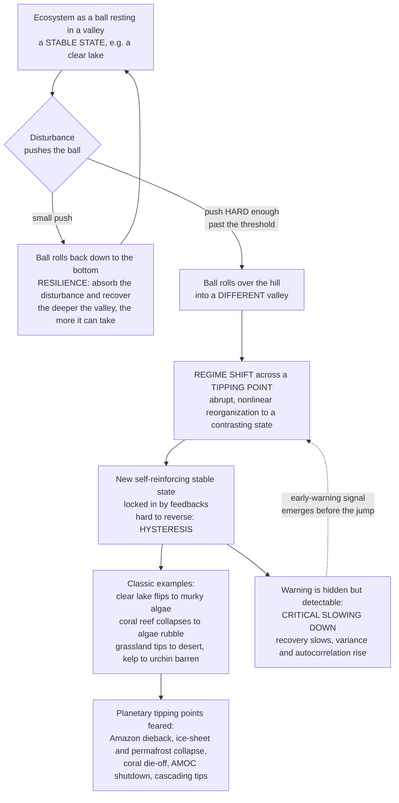

# 🎢 Ecological Stability, Resilience, and Tipping Points

> [!abstract] TL;DR
> Ecosystems can absorb an astonishing amount of stress and spring back — until, suddenly, they can't. **Stability** is really several distinct ideas: **resistance** (how hard you can push before anything changes), **engineering resilience** (how *fast* a system returns to equilibrium after a shock — Holling's "recovery speed"), and the far deeper **ecological resilience** (how *much* disturbance a system can absorb before it flips into a *different* self-reinforcing state). That flip is a **regime shift** across a **tipping point**: a clear lake loaded with farm runoff looks fine for years, then abruptly turns murky and algae-choked and *stays* there; a coral reef collapses to an algae-covered rubble field; grassland tips to desert; kelp forest to urchin barren. The terror is threefold — these shifts are **abrupt**, **surprising**, and often **irreversible**, because feedbacks lock in the new state and reversing the driver isn't enough to reverse the effect (**hysteresis**). The one hopeful thread: a system nearing a tipping point recovers ever more slowly from small knocks — **critical slowing down** — leaving a statistical fingerprint (rising variance and autocorrelation) that may serve as a generic **early-warning signal**. Scaled up, this is the logic behind feared **planetary tipping points** (Amazon dieback, ice-sheet collapse, coral die-off, AMOC shutdown). Understanding stability, resilience, and tipping points *is* understanding how ecosystems endure — and how they suddenly, irreversibly break.

---

## Intuition

**Analogy — the ball rolling in a landscape of valleys.** Picture an ecosystem as a ball resting at the bottom of a valley. The valley is a **stable state** — say, a clear, plant-rich lake. Nudge the ball and it rolls right back down to the bottom: that bounce-back is **resilience**, the ability to absorb a disturbance and recover. A *deep* valley means the ball can take a big shove and still return; a *shallow* valley means even a modest push sends it far. So far, so comforting: the lake weathers a storm, a drought, a bad year, and returns to clear.

But now imagine slowly *tilting the whole landscape* — dumping in fertilizer runoff year after year. The valley the ball sits in gets shallower, and a **second valley** (a murky, algae-dominated lake) deepens beside it, separated by a hill. For a long time nothing visible happens; the ball still sits in the clear-water valley, just a little more easily disturbed. Then one ordinary push — an average storm — is finally enough to send the ball **over the hill into the other valley**. The lake flips to green, murky, and turbid. That jump is a **regime shift across a tipping point**.

Here is the cruel twist: once the ball is in the murky valley, that state defends itself. Algae shade out the plants that would have anchored the sediment; fish that ate the algae are gone; the muck resuspends and blocks light — a web of **self-reinforcing feedbacks** holds the ball in the new valley. To get back, you can't just stop adding fertilizer; you must drag the driver *far* below the point where it originally tipped — the path back is different from the path in. That gap is **hysteresis**, and it is why regime shifts are so often effectively **irreversible**. The final unsettling fact: the landscape gives almost no warning. The lake looks stable right up until it snaps. But scientists have found a tell — as a valley flattens, the ball takes longer and longer to settle after each nudge (**critical slowing down**), and its wobbles grow larger and more sluggish. That growing wobble is the **early-warning signal** we now hunt for in reefs, forests, and the climate itself.

---

## How It Works

### Core mechanics

1. **Stability is not one thing.** Ecologists mean several distinct properties: **resistance** (how little a system changes under a given disturbance), **resilience** (its capacity to recover or absorb), **persistence** (how long it lasts unchanged), and **constancy/variability** (how much it fluctuates). A system can be highly resistant but slow to recover, or fragile to small pushes yet quick to bounce back — these are independent axes, not one dial.

2. **Two meanings of resilience — the crucial split (Holling 1973).** **Engineering resilience** measures the *speed* of return to a single equilibrium after a small disturbance — it assumes one stable state and asks "how fast back?" **Ecological resilience** measures the *magnitude* of disturbance a system can absorb *before it reorganizes into a different regime* — it assumes **multiple** possible states and asks "how far can I be pushed before I fall into a different valley?" The second is the deeper, more dangerous idea, and the rest of this note lives there.

3. **Alternative stable states.** Under the *same* external conditions, an ecosystem can rest in more than one self-maintaining configuration — a lake clear *or* turbid, a reef coral-dominated *or* algae-dominated. Each state is a **basin of attraction** (a valley); which one the system occupies depends on its history, not just current conditions. The valleys exist because of **feedbacks** that make each state reinforce itself.

4. **Regime shifts and tipping points.** A **regime shift** is an abrupt, often large, and persistent reorganization from one state to a contrasting one. It happens when a slowly changing **driver** (nutrient load, temperature, grazing pressure, fishing) pushes the system past a **threshold** — the **tipping point** — where the current state loses stability. Mathematically this is a **fold (saddle-node) bifurcation**: the valley the system sits in flattens out and vanishes, so the system has nowhere to go but the other valley. The shift is **nonlinear** — a tiny extra change in the driver triggers a disproportionately huge change in state.

5. **Hysteresis and irreversibility.** Because two stable states overlap over a range of driver values, the forward jump (state A → B) and the backward jump (B → A) happen at *different* driver thresholds. To recover, you must reduce the driver *well past* the point where collapse occurred — sometimes to levels that are physically or politically impossible. This **hysteresis loop** is why "just stop the pressure" rarely undoes a regime shift.

6. **Critical slowing down and early-warning signals.** As a driver nears the fold, the dominant eigenvalue of the system approaches zero — recovery from any perturbation gets slower and slower (**critical slowing down**). Under ever-present environmental noise this produces measurable fingerprints *before* the tip: **rising variance**, **rising lag-1 autocorrelation** ("memory"), skewness, and **flickering** between states. These are candidate **generic early-warning signals** of an approaching transition (Scheffer et al. 2009).

### The stability landscape and the tipping cascade



---

## Key Concepts

### Secondary — bounce back, or break?

- **Resilience is the bounce-back.** An ecosystem is *resilient* if it can take a disturbance — a fire, a flood, a bad year — and recover to roughly what it was. Think of the ball rolling back to the bottom of its valley.
- **A tipping point is the point of no easy return.** Push a system too far and it doesn't just get a bit worse — it flips into a *completely different* state (clear lake to green scum, coral reef to bare rubble) and gets stuck there.
- **The change is sudden and surprising.** For a long time the ecosystem looks fine, absorbing the pressure. Then it crosses a hidden threshold and changes fast. The calm before the flip is exactly what makes tipping points dangerous.
- **Going back is hard (hysteresis).** Once flipped, simply easing off the pressure usually isn't enough — you often have to reduce it far more than the amount that caused the tip. Sometimes you can't get back at all.
- **Diversity can be a buffer.** A community with many species is often steadier: if one species fails, another can pick up its job. Diversity acts like insurance against shocks.

### Undergraduate — measuring stability and mapping the flip

- **The many faces of stability.** **Resistance** = how much a system withstands a disturbance without changing. **Resilience** = its capacity to recover/absorb. **Persistence**, **constancy**, and **variability** describe how long it lasts and how much it fluctuates. Distinguishing them is the first step to not talking past each other.
- **Engineering vs ecological resilience (Holling 1973).** *Engineering:* return **rate** to a single equilibrium — fast recovery = resilient. *Ecological:* the **amount** of disturbance absorbable before switching to a different regime — a large basin = resilient. The two can point in opposite directions: a fast-recovering monoculture may have engineering resilience yet tiny ecological resilience (it flips easily).
- **Equilibrium vs non-equilibrium views.** Classic theory assumed communities sit at a single stable equilibrium. Modern ecology recognizes that disturbance, succession, and stochasticity keep many systems in **non-equilibrium** dynamics — and that multiple equilibria (alternative stable states) are common. This reframes disturbance and succession as part of how stability is generated, not just noise around a fixed point.
- **The diversity–stability debate.** *Intuition (Elton, MacArthur):* more diverse communities should be more stable. *The insurance / portfolio hypothesis:* with many species differing in their responses (**response diversity**) and overlapping in function (**functional redundancy**), aggregate ecosystem function is buffered — when one species declines, another compensates. *May's 1972 counterpoint:* in *randomly* assembled model webs, greater complexity (more species, more/stronger links) *reduces* the probability of a stable equilibrium. **Reconciliation:** diversity tends to **stabilize aggregate ecosystem properties** (total biomass, productivity) even while it may **destabilize individual populations** — real webs are stabilized by many weak interactions and structure, not random complexity. See [[Biodiversity_and_Species_Richness]] and [[Food_Webs_and_Trophic_Dynamics]].
- **Alternative stable states and the stability landscape.** The "ball-in-a-basin" picture: valleys are stable states (attractors), hilltops are unstable thresholds, and the landscape itself is reshaped by slowly changing drivers. **Resilience = the width and depth of the basin** the system currently occupies. Losing resilience = the basin flattening, even before any visible change in state.
- **Feedbacks lock in each state.** In a shallow lake: submerged plants stabilize sediment, keep water clear, and support zooplankton that graze algae (clear-state feedback); once turbid, algae shade out plants, sediment resuspends, and fish shift to types that eat zooplankton (turbid-state feedback). Each configuration reinforces itself — which is *why* two states can persist under identical nutrient loads.

### Graduate — bifurcations, hysteresis, and detecting collapse

- **The fold bifurcation as the engine of tipping.** Model the state $x$ under driver $c$ as $\dot{x} = f(x, c)$. Equilibria satisfy $f = 0$; stability requires $\partial f / \partial x < 0$. A **saddle-node (fold) bifurcation** occurs where a stable and an unstable equilibrium collide and annihilate ($\partial f/\partial x = 0$): the occupied basin vanishes and the system slides catastrophically to the remaining attractor. When two folds bracket a range of $c$, the system has **two alternative stable states** over that range — the geometry of a **catastrophic regime shift** (Scheffer et al. 2001). See [[Bifurcations_and_Tipping_Points]].
- **Hysteresis, quantified.** Between the forward fold (at driver $c_{+}$) and the backward fold (at $c_{-}$), *both* states are stable; which is realized depends on history. The **hysteresis width** $c_{+} - c_{-}$ sets how far you must reverse the driver to recover. Systems with strong positive feedbacks have wide hysteresis and are effectively irreversible on management timescales.
- **Critical slowing down — the mechanism.** Near a fold the leading eigenvalue $\lambda \to 0^{-}$, so the recovery timescale $\tau = 1/|\lambda| \to \infty$. Under additive noise the system behaves like an Ornstein–Uhlenbeck process: stationary **variance** $\sigma_x^2 \approx \sigma_\eta^2 / (2|\lambda|)$ **rises**, and **lag-1 autocorrelation** $\rho_1 \approx e^{\lambda \Delta t} \to 1$ **rises**, as the tipping point is approached. These, plus rising skewness and spatial correlation, are the **generic early-warning indicators** (Scheffer et al. 2009; Dakos, Carpenter et al.).
- **Limits and caveats of early warnings.** They are not infallible: **B-tipping** (crossing a bifurcation) shows slowing down, but **N-tipping** (a large stochastic shock jumping the basin) and **R-tipping** (too-fast a rate of change) need not. False positives/negatives, non-stationary noise, short records, and shifts that are not fold-type all complicate detection. Treat rising variance and autocorrelation as *suggestive*, not proof.
- **Spatial and cascading dimensions.** In spatially extended systems, regime shifts can propagate as **fronts**, show **self-organized patchiness** (Turing-like vegetation patterns in drylands are argued to be indicators of approaching desertification), and exhibit **spatial early-warning signals** (rising spatial variance and correlation length). At the largest scale, **tipping elements** in the Earth system (Lenton et al. 2008) may be coupled, so one tip (Arctic sea-ice loss, permafrost thaw) raises the odds of another — **cascading tipping points**.
- **Managing for resilience.** Because thresholds are hard to see and shifts hard to reverse, resilience-based management aims to *keep systems far from tipping points*: maintain functional and response diversity, protect the feedbacks that hold the desired state, avoid loading drivers toward folds, and monitor for early-warning signals. Restoration after a tip must overcome hysteresis — often requiring driver reduction *below* the original threshold plus active intervention to re-establish the lost feedbacks.

---

## Python Demo

```python
# Ecological stability, resilience & tipping points — three views of one story.
# Model (cusp / fold normal form for a bistable ecosystem):
#     dx/dt = -x^3 + x - c        x = ecosystem state (e.g. lake clarity / vegetation)
#                                  c = slow driver (nutrient load / grazing / warming)
# Equilibria satisfy c = x - x^3.  Stable where d(dx/dt)/dx = -3x^2 + 1 < 0, i.e. |x| > 1/sqrt(3).
# Two folds at x = +/-1/sqrt(3), c = +/-0.385  ->  a range of c with TWO stable states.
#   Panel 1  ALTERNATIVE STABLE STATES + HYSTERESIS: folded equilibrium curve
#   Panel 2  STABILITY LANDSCAPE: ball-in-a-valley potential wells shifting with the driver
#   Panel 3  CRITICAL SLOWING DOWN: recovery slows & autocorrelation rises near the tip
import numpy as np
import matplotlib.pyplot as plt

xc = 1.0 / np.sqrt(3.0)                 # fold state,  ~0.577
cc = xc - xc**3                         # fold driver, ~0.385
print(f"Fold (tipping) points at  x = +/-{xc:.3f},  c = +/-{cc:.3f}")
print(f"Hysteresis width in driver c: {2*cc:.3f}  (must reverse driver this far to recover)")

# ================================================= Panel 1: fold / hysteresis curve
x_curve = np.linspace(-1.4, 1.4, 800)
c_curve = x_curve - x_curve**3          # driver required for each equilibrium state
stable  = np.abs(x_curve) > xc          # outer branches stable, middle unstable

# ================================================= Panel 2: potential landscapes
#   dx/dt = -dV/dx  =>  V(x) = x^4/4 - x^2/2 + c*x
def V(x, c): return x**4/4.0 - x**2/2.0 + c*x
xx = np.linspace(-1.7, 1.7, 400)
drivers = [(-0.55, "#2e8b57", "low driver: one deep valley (clear-lake state)"),
           ( 0.00, "#d4a017", "mid driver: TWO valleys, ball still in upper"),
           ( 0.55, "#b22222", "high driver: upper valley GONE, ball crashes down")]

# ================================================= Panel 3: critical slowing down
# March UP the upper stable branch toward the fold; use 'stress' = c so tip is to the right.
x_branch = np.linspace(1.25, xc + 1e-3, 300)   # upper branch, approaching the fold
c_branch = x_branch - x_branch**3              # driver; rises toward cc as x -> fold
recovery = 3.0*x_branch**2 - 1.0               # |eigenvalue| = recovery rate -> 0 at fold
dt_obs, sig2 = 1.0, 0.02
ar1 = np.exp(-recovery * dt_obs)               # lag-1 autocorrelation -> 1 near fold
var = sig2 / (2.0 * recovery)                  # fluctuation variance -> infinity near fold

# =========================================================================== plot
fig, ax = plt.subplots(1, 3, figsize=(17, 5.2))

# --- Panel 1: alternative stable states + hysteresis loop -------------------------
xs, cs = x_curve[stable], c_curve[stable]
ax[0].plot(cs[xs > 0], xs[xs > 0], color="#2e8b57", lw=3, label="stable states")
ax[0].plot(cs[xs < 0], xs[xs < 0], color="#2e8b57", lw=3)
xu = x_curve[~stable]; cu = c_curve[~stable]
ax[0].plot(cu, xu, color="0.55", lw=2, ls="--", label="unstable threshold")
ax[0].axvspan(-cc, cc, color="orange", alpha=0.12)
ax[0].annotate("", xy=(cc, -xc), xytext=(cc, xc),                # forward collapse
               arrowprops=dict(arrowstyle="-|>", color="#b22222", lw=2.5))
ax[0].annotate("", xy=(-cc, xc), xytext=(-cc, -xc),              # recovery jump
               arrowprops=dict(arrowstyle="-|>", color="#1f6feb", lw=2.5))
ax[0].text(cc + 0.02, 0.0, "tip DOWN\n(collapse)", color="#b22222", fontsize=8)
ax[0].text(-cc - 0.02, 0.0, "recover\n(different c!)", color="#1f6feb",
           fontsize=8, ha="right")
ax[0].text(0, xc + 0.35, "HYSTERESIS gap\n(two stable states)", ha="center", fontsize=8)
ax[0].set_xlabel("driver  c  (nutrient load / grazing / warming) ->")
ax[0].set_ylabel("ecosystem state  x  (clarity / vegetation)")
ax[0].set_title("Alternative stable states + hysteresis")
ax[0].legend(fontsize=8, loc="lower left"); ax[0].grid(alpha=0.3)

# --- Panel 2: the stability landscape (ball in a valley) --------------------------
for c, col, lab in drivers:
    ax[1].plot(xx, V(xx, c), color=col, lw=2.2, label=f"c = {c:+.2f}")
    # place the "ball" at the current occupied stable minimum
    roots = np.roots([1.0, 0.0, -1.0, c])          # x^3 - x + c = 0  -> equilibria
    roots = np.real(roots[np.abs(roots.imag) < 1e-6])
    stab  = roots[3*roots**2 - 1 > 0]              # stable minima
    ball  = stab[np.argmax(stab)] if c <= 0 else stab[np.argmin(stab)]
    ax[1].scatter(ball, V(ball, c), s=170, color=col,
                  edgecolor="black", zorder=5)
ax[1].set_xlabel("ecosystem state  x")
ax[1].set_ylabel("potential  V(x)   (lower = more stable)")
ax[1].set_title("Stability landscape: valleys shift with the driver")
ax[1].legend(fontsize=7.5, loc="upper center"); ax[1].grid(alpha=0.3)

# --- Panel 3: critical slowing down = early-warning signal ------------------------
axb = ax[2].twinx()
l1, = ax[2].plot(c_branch, recovery, color="#1f6feb", lw=2.5,
                 label="recovery rate |lambda|")
l2, = axb.plot(c_branch, ar1, color="#b22222", lw=2.5,
               label="lag-1 autocorrelation")
ax[2].axvline(cc, color="black", ls="--", lw=1.2)
ax[2].text(cc, 1.55, "TIPPING\nPOINT", ha="center", fontsize=8, color="black")
ax[2].set_xlabel("driver  c  (stress) ->  approaching tipping point")
ax[2].set_ylabel("recovery rate  (falls to 0)", color="#1f6feb")
axb.set_ylabel("autocorrelation  (rises to 1)", color="#b22222")
ax[2].set_ylim(0, 2.0); axb.set_ylim(0, 1.05)
ax[2].set_title("Critical slowing down (early-warning signal)")
ax[2].legend(handles=[l1, l2], fontsize=8, loc="center left")
ax[2].grid(alpha=0.3)

plt.tight_layout(); plt.show()

# --- numbers behind the picture ---------------------------------------------------
print("\nAs the driver nears the fold (tipping point):")
print(f"  recovery rate     {recovery[0]:.3f}  ->  {recovery[-1]:.3f}   (collapses toward 0)")
print(f"  autocorrelation   {ar1[0]:.3f}  ->  {ar1[-1]:.3f}   (climbs toward 1)")
print(f"  fluctuation var   {var[0]:.3f}  ->  {var[-1]:.2f}   (blows up)")
```

**Panel 1** draws the signature of alternative stable states: a **folded (S-shaped) equilibrium curve**. Over the shaded band two stable branches coexist (upper = clear lake, lower = turbid), separated by an unstable threshold (dashed). Load the driver rightward and the upper branch runs out at the fold — the red arrow marks the sudden **collapse**; to recover you must reverse the driver all the way to the *left* fold (blue arrow), a *different* value — the **hysteresis** gap. **Panel 2** is the same physics as a stability landscape: at low driver the ball sits in one deep valley; at mid driver a second valley opens but the ball stays put; push the driver high and the upper valley *disappears*, so the ball has no choice but to crash into the lower state — a regime shift. **Panel 3** delivers the hopeful part: as the driver approaches the tip, the **recovery rate collapses toward zero** (critical slowing down) while the **lag-1 autocorrelation climbs toward one** and fluctuation variance explodes — the generic **early-warning signals** ecologists mine from real monitoring data before a system snaps.

---

## Real-World Applications

> **Shallow-lake eutrophication — the textbook regime shift (Scheffer).** A clear, macrophyte-rich lake loaded gradually with phosphorus from agricultural runoff can persist in the clear state for years, then abruptly flip to a **turbid, algae-dominated** state after a trigger (a storm, a warm year, a fish kill). The turbid state is held by feedbacks — algae shade out plants, resuspended sediment blocks light, planktivorous fish suppress the zooplankton that graze algae. Reversing it requires cutting nutrient loading *far below* the level that caused the tip, and often **biomanipulation** (removing planktivorous fish to release zooplankton). This is the empirical anchor of alternative-stable-states theory and directly informs lake and reservoir management.

- **Coral reef → macroalgae collapse.** Reefs stressed by warming (bleaching), overfishing of herbivores, and nutrient pollution can tip abruptly from coral-dominated to **algae-dominated rubble fields**. Loss of grazing fish and urchins removes the feedback that kept algae in check; once algae dominate, they outcompete coral recruits, locking in the degraded state. Managing herbivore populations and water quality is managing reef *resilience*, not just coral cover — central to reef conservation under climate change (see *Climate_Change_Ecology* in this section).
- **Drylands and desertification.** Semi-arid grasslands can tip to **shrubland or bare desert** when grazing pressure or drought crosses a threshold; vegetation–soil–moisture feedbacks (plants trap water and seeds; bare soil sheds them) make the shift self-reinforcing and hard to reverse. Self-organized **vegetation patterning** is studied as a spatial early-warning signal of approaching collapse — a direct link to restoration and rangeland management (*Restoration_Ecology*).
- **Kelp forest ↔ urchin barren.** Loss of sea otters (or urchin disease dynamics) lets urchins overgraze kelp, flipping productive kelp forests to barren **urchin-dominated rock**. The two states persist under similar conditions, a classic marine alternative-stable-state and a caution for trophic management.
- **Fishery collapses.** The Newfoundland **northern cod** stock collapsed abruptly in the early 1990s and failed to recover for decades despite a moratorium — consistent with hysteresis and a possible regime shift (altered predator–prey and recruitment feedbacks), a cautionary tale for single-species maximum-sustainable-yield thinking.
- **Planetary tipping elements.** Amazon rainforest **dieback** (forest–rainfall feedback), Greenland and West Antarctic **ice-sheet collapse**, **permafrost** carbon release, tropical **coral die-off**, and **AMOC** (Atlantic overturning) slowdown are studied as coupled tipping elements in the Earth system (Lenton et al. 2008); crossing one can raise the odds of others (**cascading tipping**). This ties ecological resilience directly to the climate crisis via [[Anthropogenic_Climate_Change]] and [[Climate_Sensitivity_and_Feedbacks]].

---

## Common Pitfalls

- **Conflating the two resiliences.** "Resilient" is ambiguous. **Engineering resilience** (fast recovery to one equilibrium) and **ecological resilience** (large disturbance absorbable before switching regimes) are different — and can point opposite ways. A fast-recovering monoculture can have *low* ecological resilience (it flips easily). Always specify which you mean.
- **Assuming gradual driver = gradual response.** The whole point of tipping points is that response is **nonlinear**: a system can look stable while a driver ramps up, then change catastrophically at a threshold. Extrapolating a smooth past trend straight through a fold is exactly how regime shifts blindside managers.
- **Believing "stop the pressure and it recovers."** Hysteresis means the recovery threshold is *different* (usually much lower) than the collapse threshold. Restoration often fails because managers reduce the driver only back to pre-collapse levels — not far enough to climb back out of the new basin.
- **Treating early-warning signals as guarantees.** Rising variance and autocorrelation are *suggestive*, not proof. They appear reliably only for **bifurcation-type** (fold) tips, can be masked by non-stationary noise or short records, and can give false alarms. Absence of a signal is not safety; shocks and rate-induced tips need not slow down first.
- **Assuming diversity always means stability.** The diversity–stability relationship is nuanced: diversity tends to stabilize **aggregate** function but can *destabilize* individual populations, and May showed random complexity is destabilizing. It is *structured* diversity (response diversity, weak interactions, functional redundancy) that buffers systems — not species count alone.
- **Ignoring the feedbacks that lock in a state.** Regime shifts persist because feedbacks reinforce the new state. Restoration that only addresses the original driver, without re-establishing the lost stabilizing feedbacks (e.g., grazers on a reef, macrophytes in a lake), tends to slide right back.
- **Reading a single equilibrium into a non-equilibrium world.** Many ecosystems are shaped by ongoing disturbance and stochasticity, not a fixed balance-of-nature point. Forcing an equilibrium assumption hides the multiple states and thresholds that actually govern them.

---

## Related Concepts

- [[Bifurcations_and_Tipping_Points]] — the systems-science engine beneath this note: fold/saddle-node bifurcations, hysteresis, and critical slowing down are the mathematics that a lake, reef, or ice sheet obeys when it tips. This is the single densest bridge to the Systems Thinking vault.
- [[Ecological_Resilience_and_Ecosystems]] — the complementary Systems Thinking treatment of Holling's resilience, adaptive cycles, and panarchy; read alongside for the general-systems framing of ecological stability.
- [[Resilience_and_Robustness]] — the network/complex-systems view of why *structured* complexity (weak links, modularity, redundancy) confers robustness, and how resilience erodes as systems approach thresholds.
- [[Nonlinearity_and_Feedback]] — the reinforcing feedbacks that create multiple valleys and the nonlinearity that makes a tiny driver change trigger an abrupt regime shift.
- [[Dynamical_Systems_and_Attractors]] — basins of attraction, stability, and equilibria formalize the "ball-in-a-valley" stability landscape used throughout this note.
- [[Sustainability_and_Planetary_Boundaries]] — scales resilience thinking to the whole Earth system: planetary boundaries are, in effect, attempts to keep global systems safely away from tipping points.
- [[Anthropogenic_Climate_Change]] — the driver pushing many ecological tipping elements (coral die-off, Amazon dieback, ice-sheet collapse) toward their folds; ecological resilience and the climate crisis are inseparable.
- [[Biodiversity_and_Species_Richness]] — the diversity side of the diversity–stability debate: response diversity and functional redundancy are the insurance that buffers ecosystem function against shocks.
- [[Food_Webs_and_Trophic_Dynamics]] — where May's diversity–stability paradox originated and where trophic feedbacks (predator loss, cascades) trigger and lock in alternative stable states.
- [[Predator_Prey_and_Population_Interactions]] — the coupled population dynamics whose feedbacks (grazing, predation) underlie many regime shifts, from kelp–urchin barrens to lake trophic states.

Within this section of the vault, this note is the "how ecosystems break" capstone. Ecosystem_Ecology_and_Energy_Flow supplies the whole-system energy and matter budgets whose feedbacks the tipping points reorganize; Ecological_Succession_and_Disturbance provides the equilibrium-vs-non-equilibrium and disturbance framing that resilience theory grew out of; Global_Biogeochemical_Cycles carries the nutrient loading (phosphorus, nitrogen) that drives lake and coastal regime shifts; Climate_Change_Ecology is the driver pushing reefs, forests, and polar systems toward planetary tipping points; and Restoration_Ecology confronts the hysteresis that makes tipped ecosystems so stubbornly hard to bring back.

---

## Review Questions

1. **(Secondary)** A clear lake stays clear for years as nearby farms slowly add more fertilizer, then one summer it suddenly turns green and murky and won't clear up even when the farming eases off. Explain, using the "ball rolling between two valleys" picture, what a **tipping point** and **hysteresis** mean here, and why the lake didn't just get *gradually* greener.
2. **(Undergraduate)** Distinguish **engineering resilience** from **ecological resilience**, and explain why a fast-recovering system is not necessarily one that can absorb a large disturbance. Then summarize the **diversity–stability debate**: why did May's 1972 result seem to contradict ecological intuition, and how is the contradiction reconciled by distinguishing population-level from aggregate ecosystem stability?
3. **(Graduate)** A coral reef and a shallow lake are both approaching regime shifts. (a) Explain, in terms of a **fold (saddle-node) bifurcation** and the leading eigenvalue, why **critical slowing down** produces rising variance and lag-1 autocorrelation before the tip. (b) A manager monitoring the reef sees *no* rising autocorrelation, yet the reef collapses anyway — give two mechanisms (hint: not all tipping is bifurcation-type) by which a system can shift without a critical-slowing-down warning. (c) Why does restoring the driver to its pre-collapse level typically fail to reverse either system, and what must a restoration program additionally do?

---

## Sources

- Holling, C. S. (1973). "Resilience and stability of ecological systems." *Annual Review of Ecology and Systematics*, 4, 1–23. — the founding distinction between engineering and ecological resilience.
- Scheffer, M., Carpenter, S., Foley, J. A., Folke, C., & Walker, B. (2001). "Catastrophic shifts in ecosystems." *Nature*, 413, 591–596. — alternative stable states, hysteresis, and regime shifts across lakes, reefs, and drylands.
- Scheffer, M., Bascompte, J., Brock, W. A., et al. (2009). "Early-warning signals for critical transitions." *Nature*, 461, 53–59. — critical slowing down and the generic indicators of approaching tipping points.
- Lenton, T. M., Held, H., Kriegler, E., et al. (2008). "Tipping elements in the Earth's climate system." *PNAS*, 105(6), 1786–1793. — the planetary-scale tipping elements framework.
- May, R. M. (1972). "Will a large complex system be stable?" *Nature*, 238, 413–414. — the diversity–stability paradox that reframed how ecologists think about complexity and stability.

---

#ecology #resilience #tipping-points #regime-shifts #alternative-stable-states
