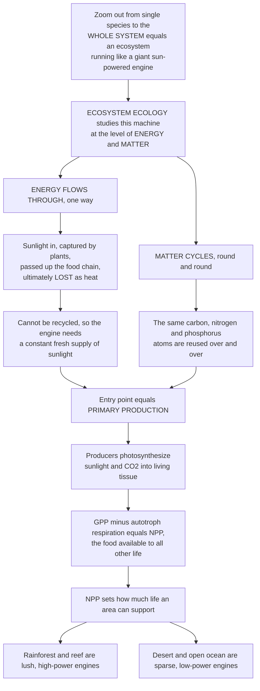

# ☀️ Ecosystem Ecology and Energy Flow

> [!abstract] TL;DR
> Zoom out from individual species to the whole system and an **ecosystem** runs like a giant engine powered by the sun. **Ecosystem ecology** studies this machine at the level of **energy** and **matter**, and one master distinction governs everything: **energy flows through** an ecosystem in a single direction — it enters as sunlight, is captured by plants, passes up the food chain, and is ultimately **lost as heat** (it cannot be recycled, so the engine needs a constant fresh supply of sunlight) — while **matter cycles**, the same carbon, nitrogen, and phosphorus atoms being used over and over. The entry point of energy is **primary production**: photosynthesis converting sunlight and CO₂ into living tissue, with **Gross Primary Production (GPP) minus plant respiration equal to Net Primary Production (NPP)** — the food available to all other life. How productive that engine is (lush rainforest vs sparse desert) ultimately sets how much life an area can support. This is the opener to the ecosystem-ecology section, framing the nutrient-cycling, biogeochemistry, ecosystem-services, biome, and stability notes that follow.

---

## Intuition

**Analogy:** Picture an ecosystem as a **giant engine powered by the sun**. Like any engine, it has one input it cannot do without — a steady stream of fuel — and it obeys an unbreakable rule: the fuel it burns can never be burned twice. That fuel is **sunlight**. Green plants are the intake valve, capturing a sliver of the incoming light and packing it into living tissue; that stored energy then runs up through everything that eats, and everything that eats *them*, powering the whole machine — until, step by step, it all radiates away as waste **heat**. Turn off the sun and the engine coasts to a stop within days, because used energy is gone for good.

Now notice the second thing about this engine that no ordinary machine shares: the **atoms** it is built from are never thrown away. The carbon in a leaf, the nitrogen in a muscle, the phosphorus in a bone get released by decomposers and **used again** — a nitrogen atom in your body was once in the air, a rock, perhaps a dinosaur. This is the pivotal split that organizes all of ecosystem ecology: **energy flows through** (one-way, dissipated as heat, needing constant resupply) while **matter cycles** (conserved, reused endlessly). The engine's power output is set by **primary production** — how much sunlight the plants capture as new growth (Gross Primary Production, minus what the plants themselves respire, equals the Net Primary Production available to feed everything else). Some engines are lush and high-powered — a rainforest, a coral reef, an estuary — and some are sparse — a desert, the open ocean, the tundra. That output is what ultimately decides how much life the place can hold. Grasping the ecosystem as a **sun-powered, matter-cycling engine** is the foundation for understanding how the entire living planet is actually powered.

---

## How It Works

### Core Mechanics

1. **The ecosystem is the community plus its abiotic stage, studied as one integrated system.** Where population ecology counts individuals and community ecology maps who interacts with whom, ecosystem ecology deliberately stops tracking species and instead tracks the **fluxes of energy and matter** through *compartments* — producers, consumers, decomposers, soil, water, air. The unit of analysis is the flow, not the organism.
2. **Two master principles run in parallel.** **Energy flows** unidirectionally: it enters as solar radiation, is fixed by photosynthesis, moves up trophic levels, and at every step a large fraction is dissipated as low-grade **heat** by respiration — obeying the laws of thermodynamics. It cannot be recycled, so the system requires a *constant external input*. **Matter cycles**: atoms are conserved, so the same carbon, nitrogen, and phosphorus are fixed, passed along, released by decomposition, and taken up again, round and round, essentially forever.
3. **Primary production is the energy base.** **Primary producers** (autotrophs — plants, algae, cyanobacteria; and chemosynthetic bacteria at hydrothermal vents) fix energy and CO₂ into organic matter. **Gross Primary Production (GPP)** is the *total* carbon fixed; the producers burn a large share to run their own metabolism (**autotroph respiration, Rₐ**); what remains is **Net Primary Production (NPP = GPP − Rₐ)** — the new plant tissue actually available to consumers and the ecosystem. NPP, not GPP, is the true food supply.
4. **Productivity is a rate, biomass is a stock.** *Productivity* is how fast new tissue is made (e.g., grams of carbon per m² per year); *standing biomass* is how much tissue is present at one instant. The two can decouple sharply: the open ocean carries almost no standing biomass yet, because its phytoplankton turn over in days, contributes roughly half of all global NPP. A forest is the reverse — huge biomass, slower turnover.
5. **Energy climbs the trophic ladder with heavy losses.** From producers, energy passes to **primary consumers** (herbivores), then higher consumers, and to **decomposers**. Only about **10%** of the energy at one trophic level is captured by the next (the rest is lost to respiration, unassimilated waste, and heat), so food chains are short and top predators are rare — this is **Lindeman's trophic-dynamic** view.
6. **Most energy actually flows through decomposition, not grazing.** In most ecosystems the majority of NPP is never eaten alive; it dies and enters the **detrital / decomposer pathway**, where fungi and microbes release its energy and recycle its nutrients. The grazing food chain we picture first is usually the *minor* route.
7. **What limits the engine.** Primary production is capped by **light, water, temperature, and nutrients** (especially nitrogen and phosphorus on land, nitrogen and iron in the sea). Because these vary enormously across the planet, so does productivity — from >2,000 g C/m²/yr in tropical forests and reefs down to <100 in deserts and the open ocean — and their sum is the **global NPP budget** (~105 Pg C/yr on land, a similar amount in the ocean).

### Flow / Architecture



---

## Key Concepts

### Secondary (foundational)

- **Ecosystem** — a living **community** (all the plants, animals, and microbes) together with its **non-living surroundings** (sunlight, air, water, soil), studied as one working system.
- **Energy flows, matter cycles** — the one big idea: energy moves through the ecosystem in **one direction** (sun → plants → animals → heat) and is *used up*, while atoms (carbon, nitrogen, phosphorus) are **recycled** again and again.
- **Producers and primary production** — **producers** (green plants, algae) capture sunlight by **photosynthesis** and turn it into food; the total new plant growth is the ecosystem's food base for everything else.
- **The 10% rule** — only about a tenth of the energy at one feeding level reaches the next, so most energy is lost as heat and there is far more grass than there are lions.
- **Productive vs unproductive ecosystems** — a rainforest or coral reef makes huge amounts of new growth; a desert or the open ocean makes very little, which is why one teems with life and the other is sparse.

### Undergraduate (core)

- **GPP, NPP, and respiration** — **GPP** is the total energy fixed by photosynthesis; autotrophs spend a large fraction on their own **respiration (Rₐ)**; **NPP = GPP − Rₐ** is the tissue actually available to consumers. Roughly half of GPP is respired away, so NPP is often ~50% of GPP.
- **Productivity (rate) vs standing biomass (stock)** — productivity measures *flux* (g C m⁻² yr⁻¹); biomass measures *the amount present now*. High-turnover systems (phytoplankton) can have low biomass yet high productivity; slow-turnover systems (forests) the opposite.
- **Trophic transfer efficiency and Lindeman** — the ~**10% ecological efficiency** between trophic levels is the product of *exploitation*, *assimilation*, and *production* efficiencies; it limits food-chain length and produces the classic energy pyramid. Lindeman (1942) first framed the ecosystem as a chain of energy transfers.
- **Grazing vs detrital pathways** — energy leaves the producers by two routes: the **grazing chain** (eaten alive) and the **detrital / decomposer chain** (dies, then decomposed). In most terrestrial and many aquatic systems, the *detrital* pathway carries the majority of energy and is where nutrients are regenerated.
- **Limiting factors and the global budget** — productivity is set by light, water, temperature, and nutrient supply (**N** and **P** especially); Liebig's "law of the minimum" says the *scarcest* essential resource caps growth. Summed over the biosphere, terrestrial NPP is ~105 Pg C/yr and marine NPP a comparable amount, split among strikingly unequal biomes.

### Graduate (advanced)

- **The ecosystem as an open thermodynamic system** — an ecosystem is a **far-from-equilibrium, open system** that imports high-quality (low-entropy) solar energy, does work building and maintaining biological order, and exports degraded (high-entropy) heat. The one-way energy flux and the impossibility of recycling energy are direct consequences of the **first and second laws of thermodynamics**; some frameworks quantify this with **exergy** and maximum-power / maximum-entropy-production arguments.
- **The full carbon-balance hierarchy** — beyond NPP lie **Net Ecosystem Production (NEP = GPP − Rₐ − R_heterotroph)**, which measures whether the whole system is a net carbon sink or source, and **Net Biome Production (NBP)**, which subtracts disturbance losses (fire, harvest). These distinctions are central to whether a forest cools or warms the climate.
- **Decomposing ecological efficiency** — trophic transfer is not a fixed 10%: **assimilation efficiency** is high for carnivores and low for detritivores; **production efficiency** is high for ectotherms (~30–40%) and low for endotherms (~1–3%) because mammals and birds burn energy on body heat. This is *why* endotherm-topped food chains are especially short.
- **Nutrient limitation theory** — Liebig single-limitation is a simplification; real systems show **co-limitation** and shifting limitation (N-limited young ecosystems, P-limited old tropical soils, **iron-limited** open ocean — the basis of ocean-fertilization proposals). Redfield stoichiometry (C:N:P ≈ 106:16:1) links productivity to the coupled biogeochemical cycles.
- **Productivity–biodiversity and metabolic theory** — the **species–energy hypothesis** links available energy (NPP) to how much biomass and how many species a region supports, though the productivity–diversity relationship is often hump-shaped and scale-dependent. **Metabolic scaling theory** grounds ecosystem fluxes in the temperature- and body-size-dependence of individual metabolism, connecting cellular energetics to whole-ecosystem production.

---

## Python Demo

```python
# Ecosystem energy flow, two views:
#   (A) ENERGY BUDGET / GPP-NPP CASCADE -- follow the energy through an ecosystem:
#       incoming solar -> a tiny fraction captured as GPP -> minus autotroph
#       respiration = NPP -> then climbing trophic levels at ~10% each step.
#       Shows the small sliver of sunlight that becomes living tissue and the
#       relentless heat losses that make food chains short.
#   (B) NPP ACROSS BIOMES -- the huge variation in "engine power": why rainforests
#       and reefs teem while deserts and the open ocean are sparse.
import numpy as np
import matplotlib.pyplot as plt

# ---------- (A) Energy budget: sun -> GPP -> NPP -> trophic ladder ----------
# Illustrative energy flux in kJ per square metre per year.
incoming_solar = 1_000_000.0      # total solar energy reaching the canopy
capture_frac   = 0.01             # ~1% of sunlight is fixed by photosynthesis
GPP            = incoming_solar * capture_frac      # gross primary production
Ra_frac        = 0.5              # autotrophs respire ~half of GPP
NPP            = GPP * (1 - Ra_frac)                # net primary production
transfer_eff   = 0.10             # ~10% ecological efficiency per trophic step

# Build the descending energy cascade
stages = ["Incoming\nsolar", "GPP\n(gross)", "NPP\n(net)",
          "Herbivores", "Carnivores", "Top\ncarnivores"]
energy = [incoming_solar, GPP, NPP,
          NPP * transfer_eff,
          NPP * transfer_eff**2,
          NPP * transfer_eff**3]

# ---------- (B) Net primary productivity across biomes ----------
# Whittaker's classic mean NPP estimates (g dry matter / m^2 / yr).
biomes = ["Coral reef", "Tropical\nrainforest", "Estuary", "Temperate\nforest",
          "Savanna", "Grassland", "Tundra", "Open\nocean", "Desert"]
npp    = [2500, 2200, 1500, 1250, 900, 600, 140, 125, 90]
colors = ["#1b9e77" if v >= 1000 else "#d95f02" if v >= 400 else "#7570b3"
          for v in npp]

fig, (ax1, ax2) = plt.subplots(1, 2, figsize=(13.5, 5.2))

# Panel A: energy cascade on a log scale (spans 6 orders of magnitude)
xA = np.arange(len(stages))
barsA = ax1.bar(xA, energy, color=["#f6c85f", "#2ca25f", "#238b45",
                                    "#66c2a4", "#41ae76", "#006d2c"])
ax1.set_yscale("log")
ax1.set_xticks(xA); ax1.set_xticklabels(stages, fontsize=8)
ax1.set_ylabel("Energy flux  (kJ / m^2 / yr, log scale)")
ax1.set_title("(A) Energy budget: only a sliver of sunlight\n"
              "becomes tissue, then ~10% survives each step")
for x, e in zip(xA, energy):
    ax1.text(x, e * 1.4, f"{e:,.0f}", ha="center", va="bottom", fontsize=7.5)
ax1.annotate("~1% of sunlight\ncaptured as GPP",
             xy=(1, GPP), xytext=(1.4, GPP * 12), fontsize=8,
             arrowprops=dict(arrowstyle="->", color="gray"))
ax1.annotate("GPP - respiration\n= NPP (the real food)",
             xy=(2, NPP), xytext=(2.2, NPP * 14), fontsize=8,
             arrowprops=dict(arrowstyle="->", color="gray"))
ax1.set_ylim(1, incoming_solar * 5)
ax1.grid(axis="y", which="both", ls=":", alpha=0.4)

# Panel B: NPP across biomes
yB = np.arange(len(biomes))
ax2.barh(yB, npp, color=colors)
ax2.set_yticks(yB); ax2.set_yticklabels(biomes, fontsize=8)
ax2.invert_yaxis()
ax2.set_xlabel("Net primary productivity  (g / m^2 / yr)")
ax2.set_title("(B) Engine power varies ~25x across biomes:\n"
              "lush reefs and forests vs sparse desert and open ocean")
for y, v in zip(yB, npp):
    ax2.text(v + 30, y, f"{v}", va="center", fontsize=8)
ax2.grid(axis="x", ls=":", alpha=0.4)

plt.tight_layout()
plt.savefig("ecosystem_energy_flow.png", dpi=120)
plt.show()

print(f"Sunlight captured as GPP : {GPP:,.0f} kJ/m2/yr  ({capture_frac:.0%} of incoming)")
print(f"NPP after respiration    : {NPP:,.0f} kJ/m2/yr  ({NPP/GPP:.0%} of GPP)")
print(f"Energy at top carnivores : {energy[-1]:,.0f} kJ/m2/yr  "
      f"({energy[-1]/incoming_solar:.5%} of incoming sunlight)")
```

**What it shows.** **Panel A** makes the one-way energy budget concrete: of a million units of sunlight, only ~1% is fixed as **GPP**, roughly half of *that* is immediately respired to leave **NPP**, and each trophic step keeps only about a tenth — so top carnivores run on a few *thousandths of a percent* of the original sunlight. Plotted on a log axis, the cascade drops six orders of magnitude, which is exactly why food chains are short and apex predators are rare. **Panel B** shows the ecosystem "engine power" — Whittaker's NPP estimates span roughly 25-fold, from coral reefs and rainforests down to tundra, open ocean, and desert, visually explaining why productivity sets how much life a place can hold. (Note the productivity–biomass twist: the open ocean's *per-area* NPP is low, yet its vast area still makes it a giant of the global carbon budget.)

---

## Real-World Applications

> **Example:** **Satellite measurement of global NPP (NASA MODIS).** The exact GPP−respiration=NPP logic in Panel A is computed operationally for the entire planet: MODIS sensors estimate GPP from the fraction of sunlight absorbed by canopies (a light-use-efficiency model), subtract modeled autotroph respiration, and deliver global maps of NPP every 8 days. These maps quantify the biosphere's ~105 Pg C/yr land carbon uptake and reveal which ecosystems are gaining or losing carbon — the empirical backbone of the global carbon cycle.

- **Climate and the carbon cycle** — whether a forest, peatland, or grassland is a net carbon **sink or source** depends on **NEP (GPP − all respiration)**. Ecosystem-ecology energy budgets underpin carbon-offset accounting, REDD+ forest programs, and Earth-system climate models.
- **Agriculture and human appropriation of NPP (HANPP)** — crops are simply managed primary production; humans now co-opt roughly a quarter of terrestrial NPP for food, fiber, and fuel. Tracking HANPP is a core sustainability indicator, because there is a hard ceiling set by how much the sun-powered engine produces.
- **Fisheries and food-chain length** — because only ~10% transfers per level, the fish we eat depend on primary production two or three steps below. Regional primary productivity (upwelling zones, estuaries) predicts fishery yields, and the 10% rule explains why harvesting high-trophic-level predators is so energetically "expensive" and easily overexploited.
- **Eutrophication and dead zones** — nutrients limit production, so dumping nitrogen and phosphorus (fertilizer runoff, sewage) into lakes and coasts *removes* the limit, triggering algal blooms; their decomposition consumes oxygen and creates hypoxic **dead zones** (Gulf of Mexico, Baltic). Understanding nutrient limitation is the lever for both the problem and its management.
- **Restoration and blue-carbon** — restoring high-NPP, high-storage systems (mangroves, salt marshes, seagrass, wetlands) sequesters carbon precisely because they are lush engines whose detrital pathway buries organic matter faster than it decomposes.

---

## Common Pitfalls

- **Thinking energy is recycled like matter.** The single most common error. **Matter cycles; energy does not.** Every joule that enters is eventually radiated away as heat, which is why an ecosystem needs a *continuous* solar (or chemosynthetic) input and cannot run on a fixed stockpile. Conflating the two erases the whole point of the section.
- **Confusing GPP with NPP.** GPP is gross fixation; the producers respire a huge fraction of it. Only **NPP (= GPP − Rₐ)** is available to consumers, so using GPP as "the food supply" overstates it roughly two-fold and misstates every downstream energy budget.
- **Equating productivity with standing biomass.** A rate is not a stock. The open ocean has almost no biomass yet enormous total NPP because phytoplankton turn over in days; a redwood forest is the opposite. Judging an ecosystem's productivity by how much biomass you can *see* is often exactly backwards.
- **Ignoring the detrital pathway.** The vivid grazing food chain (grass → antelope → lion) usually carries a *minority* of the energy. Most NPP dies uneaten and flows through decomposers, which also regenerate the nutrients producers need. Leaving out decomposition misses where most energy and nutrient cycling actually happen.
- **Treating the 10% transfer as a law.** Ecological efficiency varies widely — endotherms (mammals, birds) burn most of their intake as body heat and pass on only ~1–3%, while some ectotherm and detritivore links transfer far more. Ten percent is a rough average, not a constant, and food-chain length reflects these differences.

---

## Related Concepts

This note is the **section opener for ecosystem ecology and biogeochemistry**; the topics it surveys are each developed in a dedicated sibling note. **Global biogeochemical cycles** trace the matter-cycling half of the master principle for carbon, nitrogen, and phosphorus at planetary scale; **nutrient cycling and decomposition** develop the detrital pathway and how decomposers regenerate the atoms producers reuse; **food webs and trophic dynamics** formalize the who-eats-whom structure and the trophic-transfer efficiencies introduced here; **ecosystem services** translate primary production and nutrient cycling into the benefits humans depend on; and **biomes and global ecology** map the huge NPP variation onto the world's ecosystem types. Those five are prose references because they are in-vault siblings of this opener.

- [[Levels_of_Ecological_Organization]] — the ecosystem is precisely the level where the biotic community and its abiotic environment are studied as one integrated system; this note develops that level's emergent properties (productivity, energy flow).
- [[Community_Ecology_and_Species_Interactions]] — the level below: a community plus its abiotic stage and energy budget *is* an ecosystem, so the interaction webs there become the trophic pathways here.
- [[Population_Growth_and_Regulation]] — carrying capacity and how many individuals a place supports are ultimately bounded by the ecosystem's primary production.
- [[Ecology_and_Conservation_Overview]] — the vault hub that places ecosystem ecology between community ecology and global/biosphere ecology.
- [[Ecosystems_and_Energy_Flow]] — Biology's foundational treatment of trophic levels and energy pyramids; **this note is the deep-dive, energy-and-matter-flux view** that extends it (distinct basename by design).
- [[Biogeochemical_Cycles]] — the Biology-vault companion on the matter-cycling side (C, N, P, water), the conserved counterpart to this note's one-way energy flow.
- [[Photosynthesis]] — the molecular mechanism of primary production: exactly how producers convert sunlight and CO₂ into the organic matter that is GPP.
- [[Laws_of_Thermodynamics]] — why energy flow is unidirectional and requires constant input: ecosystems are open systems governed by the first and second laws.
- [[Entropy_and_Second_Law]] — the deeper reason usable energy inevitably degrades to waste heat and can never be recycled within the ecosystem.

---

## Review Questions

1. **(Secondary)** Explain, in your own words, the difference between how **energy** and **matter** move through an ecosystem. Why does an ecosystem need a constant supply of sunlight, but does *not* need a constant supply of new carbon atoms?
2. **(Undergraduate)** Define **GPP** and **NPP** and give the equation relating them. If a forest fixes 2,000 g C m⁻² yr⁻¹ as GPP and respires 55% of it, what is its NPP, and why is NPP — not GPP — the correct measure of the food available to consumers?
3. **(Undergraduate)** Using the ~10% trophic-transfer efficiency, explain why food chains are short and why the open ocean can have very low standing biomass yet contribute about half of global NPP. Distinguish clearly between *productivity* and *biomass*.
4. **(Graduate)** An ecosystem is described as an "open, far-from-equilibrium thermodynamic system." Using the first and second laws, explain what enters, what leaves, and why the impossibility of recycling energy follows directly from thermodynamics rather than from biology.
5. **(Graduate)** Two grasslands have identical NPP, but one is topped by a food chain of endotherms (birds, mammals) and the other by ectotherms (insects, reptiles). Predict which supports the longer food chain and the greater top-predator biomass, and justify your answer using assimilation and production efficiencies. Then explain how nutrient co-limitation (Liebig's law, Redfield stoichiometry) could constrain the NPP itself.

---

## Sources

- Chapin, F. S. III, Matson, P. A., & Vitousek, P. M. (2011). *Principles of Terrestrial Ecosystem Ecology* (2nd ed.). Springer. — the standard modern text on energy and nutrient fluxes through ecosystems.
- Odum, E. P., & Barrett, G. W. (2005). *Fundamentals of Ecology* (5th ed.). Thomson Brooks/Cole. — classic articulation of the ecosystem concept, energy flow, and productivity.
- Lindeman, R. L. (1942). "The Trophic-Dynamic Aspect of Ecology." *Ecology* 23(4): 399–417. [DOI](https://doi.org/10.2307/1930126) — the founding paper framing ecosystems as chains of energy transfer.
- Begon, M., Townsend, C. R., & Harper, J. L. (2006). *Ecology: From Individuals to Ecosystems* (4th ed.). Blackwell. — comprehensive treatment of production, energy flow, and the decomposer pathway.
- Field, C. B., Behrenfeld, M. J., Randerson, J. T., & Falkowski, P. (1998). "Primary Production of the Biosphere: Integrating Terrestrial and Oceanic Components." *Science* 281(5374): 237–240. [DOI](https://doi.org/10.1126/science.281.5374.237) — the global NPP budget balancing land and ocean.

---

#ecology #ecosystem-ecology #energy-flow #primary-production #NPP
