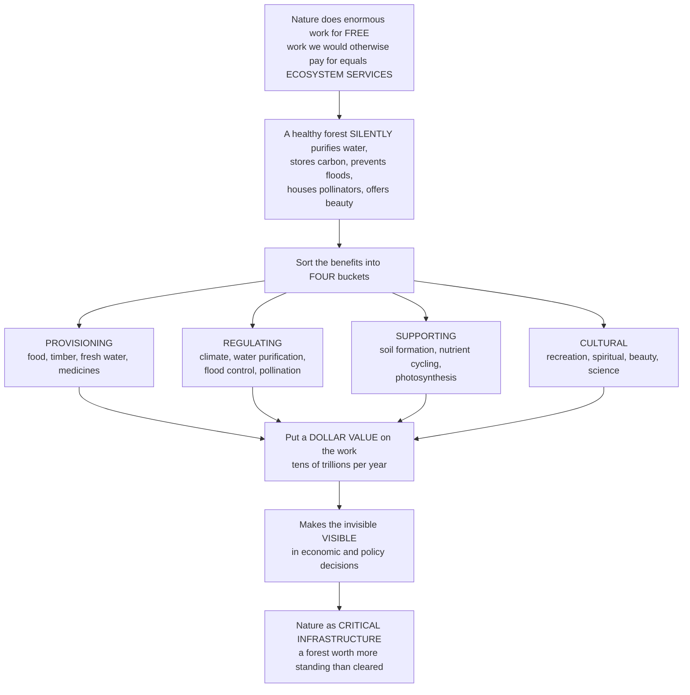

# 🌳 Ecosystem Services

> [!abstract] TL;DR
> **Ecosystem services** are the benefits people obtain from functioning ecosystems — the enormous, mostly invisible, mostly *free* work that nature does for humanity every day. A healthy forest silently purifies water, stores carbon, buffers floods, houses the pollinators behind a third of our crops, forms soil, and offers beauty and recreation. Popularized by the **Millennium Ecosystem Assessment (2005)**, the framework sorts these benefits into four buckets — **provisioning** (tangible goods: food, timber, fresh water, medicines), **regulating** (climate regulation, water purification, flood control, pollination, disease control), **supporting** (the foundational processes: soil formation, nutrient cycling, photosynthesis), and **cultural** (recreation, spiritual value, beauty, science). The controversial-but-powerful move is to put a **dollar value** on this work — Costanza et al. famously estimated global services at *tens of trillions* of dollars a year, dwarfing the entire human economy — precisely to make the invisible visible in economic and policy decisions, so a forest is recognized as worth more standing than cleared. The concept reframes nature not as a sentimental luxury but as **critical infrastructure** our economy and survival utterly depend on.

---

## Intuition

**Analogy:** Imagine you inherited a mansion staffed by an army of invisible workers who never send a bill. One purifies every drop of water before it reaches your tap. Another sucks carbon out of the air and locks it away. A crew reinforces the hillside so it never slides onto your house, while a squadron of tiny couriers pollinates the orchard that feeds you, and a groundskeeper quietly manufactures fresh soil from bare rock. You never see them, you never pay them, so you assume the water, the stable ground, the fruit, and the soil are simply *free* — until one day the workers quit, and you discover that replacing even one of them costs more than you can afford, and some jobs no factory on Earth can do at all.

That invisible, unpaid workforce is exactly what an ecosystem is, and its labor is what ecologists call **ecosystem services**. New York City learned this literally: rather than build an $8–10 billion water-filtration plant, it spent a fraction of that protecting the forested Catskill watershed that had been purifying the city's water for free all along — because the forest was doing the plant's job better and cheaper. The whole point of the ecosystem-services concept is to drag those invisible workers into the ledger. We sort their jobs into four buckets — **provisioning** (the goods they hand you), **regulating** (the stabilizing they do behind the scenes), **supporting** (the foundational chores that make every other job possible), and **cultural** (the beauty and meaning they provide) — and then we do the audacious thing: we estimate what their labor is *worth in dollars*, tens of trillions a year, more than the entire measured economy. Not because nature is a commodity, but because a number is the only language a budget meeting understands. Put a price on the invisible, and suddenly a standing forest is worth more than the timber you would get by cutting it down.

---

## How It Works

### Core mechanics

The ecosystem-services framework does three things: it **names** the benefits, **classifies** them into functional categories, and (most contentiously) **values** them so they enter economic decisions. Understanding each step is what turns a vague sense that "nature is good" into a tool that changes land-use policy.

1. **Nature does work; that work yields benefits.** Ecological processes — photosynthesis fixing carbon, roots holding soil, microbes cycling nitrogen, insects moving pollen — are not just biology for its own sake. Each generates an output humans depend on. The stock of ecosystems that produces this flow of benefits is called **natural capital**, exactly analogous to built capital (factories) or human capital (skills); the services are the "interest" that natural capital pays.
2. **The Millennium Ecosystem Assessment sorts services into four categories.** **Provisioning** services are the tangible products harvested from ecosystems — food, fresh water, timber and fiber, fuel, genetic resources, medicines. **Regulating** services are benefits from the regulation of ecosystem processes — climate regulation via carbon storage, water purification and waste treatment, flood and erosion control, pollination, pest and disease regulation, air-quality control. **Supporting** services are the foundational processes that make all the others possible — soil formation, nutrient cycling, photosynthesis and primary production, water cycling — the "services behind the services." **Cultural** services are the non-material benefits — recreation and ecotourism, aesthetic and spiritual value, sense of place, education and scientific discovery.
3. **Most valuable services are unpriced, so markets ignore them.** Provisioning goods pass through markets and have prices (a log of timber, a bushel of wheat). But regulating and supporting services are typically **public goods** with no market and no owner — nobody bills you for flood control or clean air. Because they are invisible to the price system, standard economic decisions treat them as free and inexhaustible, which is precisely why they get degraded. Naming and valuing them is the corrective.
4. **Valuation makes the invisible visible.** To bring unpriced services into a decision, economists estimate their value using **market prices** (for provisioning), **replacement/avoided cost** (what it would cost to build a technological substitute — the New York watershed logic: forest protection versus a filtration plant), **contingent valuation** (surveying what people would pay), **travel cost** (inferring recreation value from what visitors spend to get there), and **hedonic pricing** (how much clean views or air add to property prices). Total economic value decomposes into **use value**, **option value** (keeping the option open for future use, e.g. undiscovered medicines), and **non-use / existence value** (what people are willing to pay simply to know a species or wilderness continues to exist).
5. **The valuation is powerful and contested.** Costanza et al. (1997) aggregated per-hectare values across biomes to a global figure on the order of tens of trillions of dollars per year — larger than global GDP at the time — with a 2014 update revising it far higher. Critics object that valuation **commodifies** nature, embeds ethical category errors (some things are "priceless" and incommensurable with money), rests on huge uncertainty, and can be gamed. Defenders reply that decisions are made with numbers whether we like it or not, and a rough, explicit estimate beats an implicit value of zero.
6. **Policy turns the concept into action.** **Payments for Ecosystem Services (PES)** pay landowners to maintain services (Costa Rica pays farmers to keep forests standing; **REDD+** pays tropical nations for avoided-deforestation carbon). **Natural-capital accounting** adds ecosystem stocks to national balance sheets. **Ecosystem-service mapping and trade-off analysis** guides land-use planning, and a growing **business and insurance case** treats reefs and wetlands as cheaper coastal defenses than seawalls.
7. **The stakes are the whole point.** The MEA's headline finding was that roughly 60% of assessed services were being **degraded or used unsustainably** — we are drawing down the natural capital that human wellbeing and the Sustainable Development Goals depend on. Ecosystem services supply the central **utilitarian** argument for conservation: protect nature not only because it is intrinsically valuable, but because it is critical infrastructure we cannot afford to lose.

### Flow / Architecture



---

## Key Concepts

### Secondary
- **Ecosystem service** — a benefit that nature gives people for free, like clean water, food, or protection from floods. If nature stopped providing it, we would have to pay for it ourselves.
- **The four buckets** — scientists group these free benefits into four kinds: **goods** we take (food, wood, water), **stabilizing** (clean air, flood control, bees pollinating crops), **foundations** (making soil, recycling nutrients), and **culture** (beautiful places to visit, spiritual meaning).
- **Free but not unlimited** — because these benefits arrive for free, people forget they can run out. A polluted river or a cleared forest stops doing its free work.
- **Nature has a dollar value** — scientists estimate all the world's ecosystem services are worth tens of trillions of dollars a year, more than the whole economy, to show governments that protecting nature is not a luxury but a necessity.
- **Worth more standing** — a forest left alone can be worth more (clean water, stored carbon, tourism) than the money you would make by cutting it down.

### Undergraduate
- **The MEA four-category framework** — provisioning (marketed goods), regulating (process regulation: climate, water purification, pollination, flood control, disease), supporting (soil formation, nutrient cycling, primary production — the services underpinning all others), and cultural (recreation, aesthetic, spiritual, educational). Supporting services differ in that they benefit people only *indirectly*, through the other three.
- **Natural capital and the stock–flow distinction** — ecosystems are a *stock* of natural capital; services are the *flow* of benefits it yields. Overharvesting draws down the stock and reduces future flows, exactly like spending capital instead of living off interest.
- **Why services get degraded — the public-goods and externality problem** — most regulating and supporting services are non-excludable public goods with no market price, so private actors treat them as free. Degrading them is a negative externality imposed on everyone; this market failure is the economic root of ecosystem decline.
- **Valuation methods** — market price (provisioning), replacement/avoided cost (the New York City Catskill watershed: protection cost ~$1–1.5B versus a filtration plant at ~$8–10B plus operating costs), contingent valuation (stated willingness-to-pay surveys), travel cost (revealed recreation value), and hedonic pricing (property-value premiums for environmental amenities).
- **Costanza et al. (1997)** — the landmark aggregation estimating global ecosystem services at roughly US$33 trillion per year (1997 dollars), against a global GNP near $18 trillion — the number that catapulted the concept into policy by showing services rival or exceed the entire marketed economy.

### Graduate
- **Total economic value decomposition** — TEV = use value (direct + indirect) + option value + non-use (existence + bequest) value. Non-use values are real but capturable only by stated-preference methods, which carry hypothetical-bias and embedding critiques; ignoring them, however, understates conservation benefits systematically.
- **Marginal versus total value, and the aggregation critique** — Costanza-style global totals multiply average per-hectare values by area, but the policy-relevant quantity is the *marginal* value of a specific hectare, which can differ enormously (the value of the *last* unit of a scarce service, e.g. the final wetlands buffering a city, may be near-infinite while the average is modest). Conflating average and marginal, and summing willingness-to-pay beyond total income, are the standard economists' objections.
- **Incommensurability and strong sustainability** — critics from ecological economics argue some services are *incommensurable* with money (no exchange rate exists) and that natural capital is only weakly substitutable by built capital, motivating **strong-sustainability** constraints (maintain critical natural capital in physical terms) rather than pure cost-benefit trade-offs.
- **Payments for Ecosystem Services design** — effective PES requires **additionality** (paying only for services that would not otherwise be provided), addressing **leakage** (deforestation displaced elsewhere), **permanence** (guarding against later reversal), and monitoring. REDD+ operationalizes these for forest carbon; Costa Rica's PSA program and New York's watershed agreements are the canonical field cases.
- **Ecosystem services, biodiversity, and the SDGs** — services depend on ecological functioning and often on biodiversity (functional redundancy underpins resilience of service provision), linking this framework to conservation prioritization and to human-wellbeing outcomes across the Sustainable Development Goals. The MEA finding that most services are declining reframes the biodiversity crisis as an infrastructure crisis, and grounds the utilitarian case for conservation alongside the intrinsic-value case.

---

## Python Demo

```python
# Ecosystem services, three demonstrations:
#   (A) VALUE BY MEA CATEGORY -- global annual value split into the four buckets,
#       showing that unpriced REGULATING + SUPPORTING services dwarf the marketed
#       PROVISIONING ones (illustrative figures in the spirit of Costanza et al. 1997).
#   (B) VALUE PER HECTARE BY ECOSYSTEM -- wetlands and coral reefs are worth far
#       more per hectare per year than forests, grasslands, or open ocean.
#   (C) NATURE-vs-BUILT TRADE-OFF -- converting intact forest to cropland RAISES the
#       marketed provisioning value but COLLAPSES the total: a net loss ("worth more
#       standing"), because the large regulating/supporting value is destroyed.
import numpy as np
import matplotlib.pyplot as plt

# ---------- (A) Global value by MEA category (trillions USD/yr, illustrative) ----------
categories = ["Provisioning", "Regulating", "Supporting", "Cultural"]
value_T = np.array([3.0, 9.0, 17.0, 4.0])       # supporting (nutrient cycling) is largest
priced = np.array([True, False, False, False])   # only provisioning is broadly marketed
total_T = value_T.sum()

# ---------- (B) Value per hectare per year by ecosystem type (USD/ha/yr, illustrative) ----------
ecosystems = ["Coral\nreef", "Coastal\nwetland", "Tropical\nforest",
              "Grassland", "Cropland", "Open\nocean"]
value_ha = np.array([352000, 140000, 5000, 4000, 5500, 660])

# ---------- (C) Nature-vs-built: 1 ha, intact forest vs cleared cropland (USD/ha/yr) ----------
svc = ["Provisioning", "Regulating", "Supporting", "Cultural"]
forest = np.array([1000, 4000, 2000, 500])      # standing forest: modest goods, big regulation
cropland = np.array([2500, 300, 150, 50])       # cleared: goods UP, everything else collapses
forest_total, crop_total = forest.sum(), cropland.sum()

# ---------- Plot ----------
fig, (ax1, ax2, ax3) = plt.subplots(1, 3, figsize=(16, 4.8))

# Panel A: value by category, priced vs unpriced
colors_A = ["#2ca02c" if p else "#8c564b" for p in priced]
bars = ax1.bar(categories, value_T, color=colors_A)
ax1.set_title("(A) Global value by MEA category\n(unpriced services dwarf marketed goods)")
ax1.set_ylabel("Value (trillion USD / yr)")
for b, v in zip(bars, value_T):
    ax1.text(b.get_x() + b.get_width()/2, v + 0.3, f"${v:.0f}T",
             ha="center", fontsize=9)
ax1.text(0.02, 0.92, f"Total ~ ${total_T:.0f}T/yr\nonly provisioning is priced",
         transform=ax1.transAxes, fontsize=9, va="top",
         bbox=dict(boxstyle="round", fc="wheat", alpha=0.6))
ax1.grid(axis="y", alpha=0.3)

# Panel B: value per hectare (log scale -- spans three orders of magnitude)
ax2.bar(ecosystems, value_ha, color="steelblue")
ax2.set_yscale("log")
ax2.set_title("(B) Value per hectare per year\n(reefs and wetlands are richest)")
ax2.set_ylabel("USD / ha / yr (log scale)")
ax2.grid(axis="y", which="both", alpha=0.3)

# Panel C: nature-vs-built trade-off -- stacked bars, total collapses
palette = ["#8c564b", "#1f77b4", "#2ca02c", "#9467bd"]
x = np.arange(2)
bottom = np.zeros(2)
for i, name in enumerate(svc):
    heights = np.array([forest[i], cropland[i]])
    ax3.bar(x, heights, bottom=bottom, color=palette[i], label=name)
    bottom += heights
ax3.set_xticks(x)
ax3.set_xticklabels(["Intact\nforest", "Cleared\ncropland"])
ax3.set_ylabel("Ecosystem value (USD / ha / yr)")
ax3.set_title("(C) Convert forest -> cropland:\nprovisioning UP, TOTAL down (net loss)")
ax3.legend(fontsize=8, loc="upper right")
ax3.annotate("", xy=(1, crop_total + 200), xytext=(0, forest_total + 200),
             arrowprops=dict(arrowstyle="->", color="red", lw=2))
ax3.text(0.5, forest_total + 400,
         f"net loss ${forest_total-crop_total:,}/ha/yr",
         ha="center", color="red", fontsize=9)
ax3.grid(axis="y", alpha=0.3)

plt.tight_layout()
plt.show()

print("=== (A) Global ecosystem-service value by MEA category (illustrative) ===")
for cat, v, p in zip(categories, value_T, priced):
    tag = "priced/marketed" if p else "UNPRICED (public good)"
    print(f"  {cat:13s}: ${v:5.1f}T/yr   [{tag}]")
print(f"  {'TOTAL':13s}: ${total_T:5.1f}T/yr   "
      f"(regulating+supporting = {100*(value_T[1]+value_T[2])/total_T:.0f}% of value, mostly unpriced)")

print("\n=== (C) Nature-vs-built: 1 hectare, forest vs cropland ===")
print(f"  Intact forest total : ${forest_total:,}/ha/yr")
print(f"  Cleared cropland    : ${crop_total:,}/ha/yr "
      f"(provisioning rose {forest[0]}->{cropland[0]})")
print(f"  NET CHANGE          : ${crop_total-forest_total:,}/ha/yr "
      f"-> worth MORE standing")
```

**Panel (A)** is the framework's punchline as a bar chart: the marketed provisioning bucket (the only one with prices) is a small slice, while the unpriced regulating and supporting services — nutrient cycling, climate regulation, water purification — account for the large majority of total value. This is why leaving services out of decisions is not a rounding error; it omits most of nature's actual worth. **Panel (B)** shows value per hectare spanning three orders of magnitude on a log scale: coral reefs and coastal wetlands are worth vastly more per hectare than open ocean or even forests, which is exactly why converting a mangrove to a shrimp farm can be a catastrophic trade even when it looks locally profitable. **Panel (C)** dramatizes the "worth more standing" logic: clearing forest for cropland *raises* the marketed provisioning value (goods you can sell), yet the total plummets because the far larger regulating and supporting services are destroyed — a decision that shows up as a private gain and a much larger social loss. That gap between private and social value is the market failure the whole ecosystem-services project exists to fix.

---

## Real-World Applications

- **The New York City watershed** — the canonical replacement-cost case: rather than build an $8–10 billion filtration plant (with hundreds of millions in annual operating costs), NYC invested roughly $1–1.5 billion protecting and restoring the forested Catskill/Delaware watershed, letting the ecosystem purify drinking water for nine million people for a fraction of the engineered cost. Proof that a natural service can outcompete its technological substitute on pure dollars.
- **Costa Rica's Payments for Environmental Services (PSA)** — since 1997 the national program has paid landowners for forest carbon, watershed protection, biodiversity, and scenic beauty, funded partly by a fuel tax; it helped reverse one of the world's highest deforestation rates and became the global template for PES.
- **REDD+ and forest carbon markets** — the UN framework pays tropical nations for avoided deforestation, monetizing the climate-regulation service of standing forests; it turns stored carbon into a tradable ecosystem-service asset, wrestling with additionality, leakage, and permanence in practice.
- **Coastal defense by reefs and mangroves** — insurers and the World Bank now value coral reefs and mangroves as flood-protection infrastructure worth billions annually; some reefs are literally insured (e.g. Mexico's Mesoamerican Reef) because rebuilding their wave-attenuation service with seawalls is far more expensive.
- **Pollination and agriculture** — animal pollination underpins roughly a third of global crop production; when wild pollinators decline, farmers must rent managed bees or hand-pollinate (as in parts of China's Sichuan apple and pear orchards), directly revealing the market value of a service that was previously free.
- **Natural-capital accounting and TEEB** — nations and corporations increasingly include ecosystem-service stocks and flows in accounts (the UN SEEA Ecosystem Accounting standard, the TEEB studies), so that GDP-style figures stop treating the liquidation of natural capital as pure income.

---

## Common Pitfalls

- **Treating unpriced services as worthless.** Because regulating and supporting services carry no market price, decisions implicitly value them at zero — the single biggest driver of ecosystem loss. The corrective is not to pretend they are priceless-and-therefore-ignorable, but to estimate their value explicitly, even roughly, so they enter the ledger at all.
- **Confusing average value with marginal value.** Aggregate figures like "$33 trillion per year" multiply average per-hectare values by total area, but real decisions turn on the value of *one more* or *one fewer* hectare. The marginal value of the last remaining wetland protecting a city can be enormous even when the global average looks modest; using totals where marginals belong misleads both critics and advocates.
- **Assuming built capital can always substitute for natural capital.** Some services can be replaced by technology (filtration plants), but many cannot be replicated at any price (a functioning climate, deep evolutionary genetic libraries, self-repairing soil). Weak-substitutability assumptions justify liquidating irreplaceable natural capital; strong-sustainability thinking guards the critical stocks in physical terms.
- **Ignoring who gains and who loses.** Valuation aggregates willingness-to-pay, which is bounded by ability-to-pay, so the poor's dependence on subsistence services is systematically undercounted. Ecosystem-service policy that ignores distribution can protect a service while dispossessing the people who relied on it.
- **Designing PES without additionality, leakage, and permanence checks.** Paying landowners to protect forest they would never have cleared buys nothing (no additionality); protecting one patch while deforestation moves next door achieves nothing (leakage); paying for carbon that burns a decade later achieves nothing (no permanence). PES that skips these safeguards spends money for zero real service.
- **Reducing nature entirely to dollars.** Valuation is a decision aid, not a moral theory. Presenting the monetary figure as the *whole* value of nature invites the commodification critique and can crowd out intrinsic and cultural reasons for conservation; the framework works best alongside, not instead of, non-monetary arguments.

---

## Related Concepts

This note sits in the ecosystem-ecology section and is the concept that turns the biology of energy and matter flow into an argument for conservation. Its immediate in-vault siblings are prose references: **Ecosystem_Ecology_and_Energy_Flow** supplies the primary-production and trophic machinery that *generates* provisioning and supporting services; **Nutrient_Cycling_and_Decomposition** is the supporting service of nutrient cycling examined mechanistically; **Ecological_Economics_and_Natural_Capital** develops the natural-capital accounting, valuation debates, and strong-sustainability ideas sketched here; **Conservation_Biology_and_the_Biodiversity_Crisis** is where ecosystem services become the utilitarian case for protecting species and habitats; and **Environmental_Policy_and_Governance** takes up PES, REDD+, and natural-capital accounting as instruments of policy. Those five are prose-only because they are in-vault siblings of this note.

- [[Ecology_and_Conservation_Overview]] — the vault hub that places ecosystem services within the broader levels-of-organization and conservation arc.
- [[Biodiversity_and_Species_Richness]] — the measurement-and-patterns view of the biodiversity that underpins the resilience and functioning of service provision; it explicitly develops the diversity–stability and diversity–productivity links behind services.
- [[Ecosystems_and_Energy_Flow]] — Biology's treatment of the energy flow and primary production that is the physical basis of provisioning and supporting services.
- [[Biogeochemical_Cycles]] — Biology's account of the nutrient and water cycling that *is* the supporting-services layer this framework names.
- [[Biodiversity_and_Conservation]] — Biology's conservation-facing note; ecosystem services supply its central utilitarian justification for protecting biodiversity.
- [[Market_Failures]] — the microeconomic reason unpriced services get degraded: ecosystems are largely public goods and their loss is a negative externality.
- [[Public_Goods]] — most regulating and supporting services are non-excludable, non-rival public goods, which is why markets underprovide them and PES is needed.
- [[Externalities_and_Pigouvian_Tax]] — degrading ecosystem services is a classic negative externality; PES is essentially a Pigouvian-style payment aligning private and social value.
- [[Sustainability_and_Planetary_Boundaries]] — the systems-scale framing of the ecosystem-service degradation the MEA documented, as humanity presses against planetary limits.
- [[Ecological_Resilience_and_Ecosystems]] — the resilience of ecosystems determines whether their service flows persist under disturbance and how close they are to collapse thresholds.

---

## Review Questions

1. **Secondary** — A town is deciding whether to cut down the forest above its reservoir to sell the timber. An ecologist says the forest is "worth more standing." Name two free services the forest provides that the town would lose, and explain why the timber money might not make up for losing them.
2. **Undergraduate** — Define the four Millennium Ecosystem Assessment categories and give an example of each. Explain why regulating and supporting services are usually far more valuable in total than provisioning services, yet are the ones that get degraded — using the ideas of public goods and market failure. Why did Costanza et al.'s trillion-dollar estimate matter for policy even though the exact number is uncertain?
3. **Graduate** — You are designing a Payments for Ecosystem Services scheme to protect a tropical watershed. Explain how you would handle additionality, leakage, and permanence, and why each matters. Then critique the underlying valuation: distinguish average from marginal value, address the incommensurability and distributional objections, and argue whether ecosystem-service valuation strengthens or weakens the case for conservation compared with an intrinsic-value argument.

---

## Sources

- Millennium Ecosystem Assessment (2005). *Ecosystems and Human Well-being: Synthesis*. Island Press.
- Costanza, R. et al. (1997). "The value of the world's ecosystem services and natural capital." *Nature* 387: 253–260.
- Daily, G. C. (ed.) (1997). *Nature's Services: Societal Dependence on Natural Ecosystems*. Island Press.
- TEEB (2010). *The Economics of Ecosystems and Biodiversity: Ecological and Economic Foundations*. Earthscan.
- Costanza, R. et al. (2014). "Changes in the global value of ecosystem services." *Global Environmental Change* 26: 152–158.

---

#ecology #ecosystem-services #natural-capital #ecosystem-valuation #conservation
