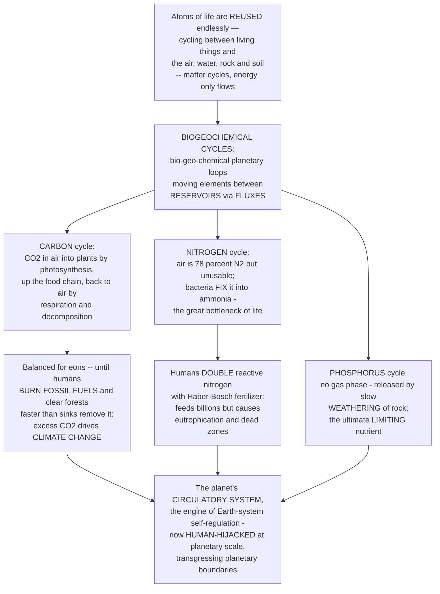

# 🌍 Global Biogeochemical Cycles

> [!abstract] TL;DR
> **Energy flows *through* an ecosystem and is lost as heat, but the *atoms* of life are used over and over.** **Biogeochemical cycles** trace the grand planetary loops those atoms take — *"bio"* (life) *"geo"* (rock and earth) *"chemical"* (elements) — endlessly shuttling carbon, nitrogen, phosphorus, and the rest between **biotic** reservoirs (living things) and **abiotic** ones (atmosphere, ocean, rock, soil). Two numbers describe any cycle: **reservoirs** (how much is stored where) and **fluxes** (how fast it moves between stores), whose ratio gives a **residence time**. **Gaseous cycles** with an atmospheric phase (carbon, nitrogen, oxygen, water) are fast and globally well-mixed; **sedimentary cycles** with no significant gas phase (phosphorus, sulfur) are slow and rock-bound. The **carbon cycle** is the most consequential: CO₂ is fixed into the biosphere by photosynthesis and returned by respiration and decomposition — a loop balanced for eons, until humans began digging up ancient carbon (fossil fuels) and burning it faster than sinks can remove it, driving atmospheric CO₂ up and the climate with it — the **ecology behind the climate crisis**. The **nitrogen cycle** is life's great bottleneck: the air is 78 percent N₂ gas, yet almost nothing can use it, so life depends on **nitrogen-fixing** bacteria — until the **Haber-Bosch** process let humans manufacture fertilizer, roughly **doubling** the reactive nitrogen entering the biosphere, feeding billions but flooding waterways (eutrophication, dead zones). The **phosphorus cycle** has no gas phase at all — it comes from the slow **weathering of rock**, making it the ultimate **limiting nutrient**. **Liebig's law of the minimum** says growth is capped by whichever resource is scarcest. Together these cycles are the **planet's circulatory system** — the master processes by which the Earth system self-regulates — and humanity has now **hijacked** them at planetary scale, transgressing several **planetary boundaries**. Understanding them is understanding ecosystem function, agriculture, and the human transformation of the biosphere.

---

## Intuition

**Analogy — the library versus the sunlight.** Picture an ecosystem's energy as **sunlight streaming through a window**: it pours in, does its work, and leaves as waste heat — a **one-way flow** that must be resupplied every single day or the lights go out. Now picture the *atoms* that build every leaf, muscle, and bone as the **books in a library**: they are never consumed, only **checked out and returned, again and again**. The carbon atom in your breath this morning was, at various times, limestone on a seafloor, sugar in a blade of grass, a molecule of ancient swamp turned to coal, and CO₂ in the air a dinosaur exhaled. Nothing is created or destroyed; the same finite stock of atoms is **recirculated forever** between the living world and the air, water, rock, and soil. That endless recirculation is what a **biogeochemical cycle** is — the librarian's ledger of where each element is stored and how fast it moves between shelves.

The three most important "books" have very different personalities. **Carbon** is the easy-going one that moves fast through air and life on a balanced loop — until humans started pulling ancient copies off a locked shelf (fossil fuels) and dumping them into circulation faster than the library can re-file them, and the whole catalog began to overflow (this overflow *is* climate change). **Nitrogen** is the frustrating book that is *everywhere* — 78 percent of the very air — yet almost impossible to check out, because it is chained shut as inert N₂; only a few specialist bacteria hold the key, and life rationed itself around that scarcity for billions of years, until we invented an industrial key (the Haber-Bosch process) and roughly **doubled** the copies in circulation, feeding half the planet but littering the water with the excess. **Phosphorus** is the rare book with no air-mail service at all — it can only arrive by the achingly slow crumbling of rock, which is why it so often runs out first and caps how much life a place can support. Hold these three in mind as the atoms of a planet's circulation, moving between reservoirs — and you are ready to see how the Earth system regulates itself, and how one species has hijacked the ledger.

---

## How It Works

### Core Mechanics

1. **Matter cycles; energy flows.** This is the master distinction. The Sun's energy enters as light, is captured by photosynthesis, passes up the food chain, and is dissipated as low-grade heat that leaves the planet — a **non-renewable, one-way flux** (energy is degraded, not recycled). The chemical elements that energy shuttles around, by contrast, are **conserved**: they cycle indefinitely between organisms and the physical environment. An ecosystem therefore needs a *constant* energy subsidy but recycles its *matter*.

2. **Reservoirs and fluxes are the two numbers that matter.** A **reservoir** (or pool) is an amount of an element stored somewhere — carbon in the atmosphere, nitrogen in soil organic matter, phosphorus in rock. A **flux** is the *rate* at which the element moves between two reservoirs (for example, photosynthesis moves carbon from air to plants). Divide the reservoir by the flux out of it and you get the element's **residence time** — how long, on average, an atom sits in that pool. A carbon atom stays in the atmosphere for years; a phosphorus atom stays locked in rock for millions.

3. **Gaseous versus sedimentary cycles.** Elements whose main mobile form is a **gas** — carbon (CO₂), nitrogen (N₂), oxygen, and water (vapor) — have a large, fast, globally **well-mixed atmospheric reservoir**; disturb them anywhere and the whole planet feels it within years. Elements with **no significant gas phase** — chiefly **phosphorus** and, largely, **sulfur** — are **sedimentary**: they move by the slow geology of weathering, erosion, deposition, and uplift, so they cycle sluggishly and tend to accumulate locally. This one structural fact explains why phosphorus is so often the ultimate brake on life.

4. **The carbon cycle has a fast loop and a slow loop.** The **fast (biological) cycle** swaps carbon between air, life, soil, and surface ocean on timescales of days to centuries: photosynthesis fixes CO₂ into organic matter; respiration and decomposition oxidize it back to CO₂. The **slow (geological) cycle** operates over thousands to millions of years: silicate **weathering** consumes atmospheric CO₂, rivers carry carbon to the sea, organisms and chemistry deposit it as carbonate and organic sediment, and volcanism eventually returns it. Fossil fuels are the slow cycle's buried organic carbon — which humans are now injecting into the fast cycle in a geological instant.

5. **The nitrogen cycle is a chain of microbial transformations.** Inert **N₂** must first be **fixed** into reactive ammonia (by specialized bacteria, or lightning, or industry). From there nitrogen is **nitrified** (ammonia to nitrate), **assimilated** into biomass, released by decomposition as ammonium (**ammonification**), and finally **denitrified** back to N₂ gas, closing the loop. Each arrow is run by a different guild of microbes, and the whole cycle is a slow, leaky relay.

6. **Humans have hijacked all three cycles.** Fossil-fuel combustion and deforestation add carbon to the atmosphere faster than sinks remove it. Industrial **Haber-Bosch** fixation roughly doubled the reactive nitrogen entering the biosphere. Phosphate mining and fertilizer moved vast quantities of phosphorus from rock to farmland to water. These perturbations are large enough to register as transgressed **planetary boundaries** — the cycles are no longer purely natural.

### Flow / Architecture



---

## Key Concepts

### Secondary — the atoms that never wear out

- **Matter is recycled; energy is not.** Sunlight is used once and lost as heat, so it must be resupplied daily. The *atoms* in living things — carbon, nitrogen, phosphorus — are used over and over, passed between the living world and the air, water, and rock. A **biogeochemical cycle** ("bio-geo-chemical") is the round trip an element makes.
- **Stores and flows.** Elements sit in **reservoirs** (the atmosphere, the ocean, the soil, rock, living things) and move between them along **fluxes**. Think bathtubs and pipes: how much water is in each tub, and how fast it flows between them.
- **The carbon cycle.** Plants pull CO₂ out of the air and turn it into sugar (**photosynthesis**); animals eat plants; everything breathes CO₂ back out (**respiration**), and decomposers release the rest. For millions of years this loop stayed balanced — until people started burning **fossil fuels** (ancient buried carbon), adding CO₂ faster than nature removes it. That extra CO₂ traps heat: this is the cause of **climate change**.
- **The nitrogen cycle.** Living things need nitrogen for proteins and DNA. The air is *78 percent* nitrogen gas — but almost nothing can use it in that form. Special **bacteria "fix"** nitrogen into a usable form; life depended on them for billions of years. Then humans invented a way to make nitrogen fertilizer (the **Haber-Bosch** process), which feeds much of the world but also pollutes rivers and lakes.
- **The phosphorus cycle.** Phosphorus has **no gas form** — it comes only from **rock slowly wearing away** (weathering). Because it arrives so slowly, it often runs out first and **limits** how much can grow. Farmers add it as fertilizer.
- **The big picture.** These cycles are the **planet's circulatory system**, moving the atoms of life around the whole Earth. Humans have now changed them so much that we are reshaping the planet itself.

### Undergraduate — the machinery of each cycle

- **Reservoirs, fluxes, and residence time.** A reservoir is a stock (units of mass, e.g. gigatonnes of carbon, GtC); a flux is a rate (mass per time). **Residence time** ≈ reservoir ÷ (outgoing flux). Carbon's atmospheric residence time is on the order of years; water's atmospheric residence is about 9 days; phosphorus in the deep sediment reservoir is millions of years. Short residence + large well-mixed reservoir = a cycle that responds fast and globally.
- **Gaseous vs sedimentary cycles.** **Gaseous** cycles (C, N, O, H₂O) have an atmospheric phase and equilibrate globally in years to decades. **Sedimentary** cycles (P, S) lack a meaningful gas phase, so the mobilizing steps are **weathering** and **erosion** and the returns are **sedimentation** and **tectonic uplift** — inherently slow and spatially patchy.
- **The carbon cycle in detail.** Photosynthesis (gross primary production, GPP) fixes ~120 GtC/yr from the atmosphere into terrestrial plants; autotrophic + heterotrophic respiration and decomposition return nearly the same. The **ocean** exchanges ~90 GtC/yr each way with the air via two pumps: the **solubility pump** (cold, dense surface water dissolves CO₂ and sinks) and the **biological pump** (phytoplankton fix carbon that sinks as detritus to the deep). Dissolving CO₂ also acidifies seawater — **ocean acidification** (CO₂ + H₂O ⇌ carbonic acid ⇌ bicarbonate + H⁺). The **human perturbation**: fossil-fuel combustion + deforestation add ~10 GtC/yr; land and ocean sinks absorb roughly half, so the **airborne fraction** (~45 percent) accumulates, raising CO₂ from ~285 ppm to over 410 ppm.
- **The nitrogen cycle transformations.** (1) **Fixation**: N₂ → NH₃/NH₄⁺, by free-living and symbiotic bacteria (*Rhizobium*, cyanobacteria) using the **nitrogenase** enzyme, plus lightning and industry — the rate-limiting bottleneck. (2) **Nitrification**: NH₄⁺ → NO₂⁻ → NO₃⁻ (aerobic, by *Nitrosomonas*/*Nitrobacter*). (3) **Assimilation**: plants take up NO₃⁻/NH₄⁺ into amino acids and nucleic acids. (4) **Ammonification**: decomposers convert organic N back to NH₄⁺. (5) **Denitrification**: NO₃⁻ → N₂ (anaerobic), returning nitrogen to the atmosphere and closing the loop. Nitrogen is the most common **limiting nutrient** in terrestrial and marine systems.
- **The phosphorus cycle.** Phosphate (PO₄³⁻) is released by **weathering of apatite-bearing rock**, taken up by plants and cycled through food webs, returned by decomposition, and ultimately washed to the sea where it is buried in sediment — recovered only by geological uplift. No atmospheric shortcut exists, so P is the classic **long-term limiting nutrient**, especially in freshwater and over geological time.
- **Liebig's law of the minimum.** Growth is limited not by the total resources available but by the **single scarcest** one relative to need. Adding more of an abundant nutrient does nothing; only relieving the *minimum* nutrient raises the ceiling — the reason phosphorus additions can trigger algal blooms while nitrogen additions do nothing, or vice versa.
- **Other cycles.** The **hydrologic (water) cycle** — evaporation, transpiration, condensation, precipitation, runoff — is the fastest gaseous cycle and the solvent that carries every other element. The **sulfur** and **oxygen** cycles couple tightly to carbon (photosynthesis/respiration) and to weathering and combustion.

### Graduate — coupling, stoichiometry, and Earth-system regulation

- **The nitrogen cascade (Galloway et al.).** A single atom of human-fixed reactive nitrogen does not act once and stop — it **cascades** through the environment, sequentially causing effects in different reservoirs: as NOₓ it forms smog and tropospheric ozone; as nitrate it acidifies soils and pollutes groundwater; in rivers and coasts it drives **eutrophication** and **hypoxic dead zones**; and as **N₂O** it is a greenhouse gas ~300× more potent than CO₂ per molecule and a stratospheric-ozone destroyer — all before it is finally denitrified. One atom, many sequential harms: the cost of having no fast "off" switch on industrial fixation.
- **Redfield stoichiometry.** Marine plankton assimilate carbon, nitrogen, and phosphorus in a remarkably constant molar ratio of about **C:N:P = 106:16:1** (the **Redfield ratio**). This links the three cycles quantitatively: the N:P supply ratio of a water body predicts whether N or P is limiting, and deviations from Redfield diagnose which pump or transformation dominates. Ecological **stoichiometry** generalizes this: organisms have characteristic elemental ratios, and mismatches between resource and consumer stoichiometry structure food webs and nutrient recycling.
- **The ocean carbon system and the Revelle factor.** Seawater does not absorb added CO₂ in proportion to the increase, because the carbonate buffer resists: the **Revelle (buffer) factor** (~10) means a 10 percent rise in atmospheric CO₂ yields only ~1 percent rise in dissolved inorganic carbon, so the ocean sink saturates as it warms and acidifies. Falling carbonate-ion concentration lowers the aragonite/calcite saturation state, threatening calcifiers (corals, pteropods, coccolithophores) — a feedback on the biological pump itself.
- **The silicate-weathering thermostat (the slow carbon cycle).** Over million-year timescales, atmospheric CO₂ is regulated by a negative feedback: warmer, wetter climates accelerate **silicate weathering** (CaSiO₃ + CO₂ → CaCO₃ + SiO₂), which consumes CO₂ and cools the planet; cooling slows weathering, letting volcanic CO₂ rebuild — the **Walker feedback** that has kept Earth habitable for billions of years. Human emissions are ~100× faster than this thermostat can respond, which is precisely why the perturbation persists.
- **Denitrification, anammox, and the marine N budget.** Fixed nitrogen is removed from the ocean by heterotrophic **denitrification** and by **anammox** (anaerobic ammonium oxidation, NH₄⁺ + NO₂⁻ → N₂), both concentrated in oxygen-minimum zones. Whether the marine nitrogen budget is balanced — fixation matching loss — remains debated, and it matters because nitrogen availability co-limits the biological carbon pump.
- **Cycle coupling and the land carbon sink.** The cycles are not independent: the terrestrial carbon sink that currently absorbs ~30 percent of emissions is itself **nutrient-limited** — extra CO₂ can only build extra biomass if enough N and P are available (**progressive nitrogen limitation**). Whether the land sink strengthens or weakens under rising CO₂ hinges on this C-N-P coupling, one of the largest uncertainties in climate projections.
- **Planetary boundaries.** Of the nine proposed **planetary boundaries** (Rockström, Steffen et al.), the **biogeochemical-flow boundary** for nitrogen and phosphorus is the *most* transgressed — human interference with the N and P cycles is judged to exceed the safe operating space by a wider margin than climate change itself. Climate change (the carbon boundary) and biogeochemical flows are both "core" boundaries whose transgression can destabilize the whole Earth system.

---

## Python Demo

```python
# Global biogeochemical cycles, four panels:
#   (A) CARBON BOX MODEL: a small persistent human flux unbalances the
#       cycle and drives atmospheric CO2 up (the Keeling-curve logic)
#   (B) LIEBIG'S LAW OF THE MINIMUM: growth set by the SCARCEST nutrient
#   (C) THE NITROGEN DOUBLING: Haber-Bosch pushes human reactive-N inputs
#       past the natural biological-fixation background
#   (D) CARBON RESERVOIR SIZES: why a small atmospheric store is fragile
import numpy as np
import matplotlib.pyplot as plt

GTC_PER_PPM = 2.13            # GtC held in the atmosphere per ppm of CO2

# ------------------------------------------------- (A) carbon box model
years = np.arange(1850, 2021)
t     = years - 1850
C_pre = 285.0                                  # preindustrial CO2 (ppm)

# Human emissions (GtC/yr): grow ~2.3%/yr from ~0.2 (1850) toward ~10 (2020)
E_gtc = 0.2 * np.exp(0.023 * t)
e_ppm = E_gtc / GTC_PER_PPM                     # emissions expressed in ppm/yr

# Box model:  dC/dt = emissions - sink,  sink = k*(C - C_pre)
# The ocean+land sink GROWS with the atmospheric excess, but it cannot
# keep pace with a persistently rising input -> CO2 accumulates.
k = 0.013                                       # fractional sink rate per year
C_human   = np.empty_like(e_ppm); C_human[0] = C_pre
C_natural = np.full_like(e_ppm, C_pre)          # no human flux -> stays balanced
for i in range(len(t) - 1):
    sink = k * (C_human[i] - C_pre)
    C_human[i + 1] = C_human[i] + e_ppm[i] - sink

# ------------------------------------------------- (B) Liebig's law
supply      = np.linspace(0, 10, 400)           # supply of the focal nutrient (N)
growth_by_N = 1.6 * supply / (2.0 + supply)     # rises then saturates with N
ceiling_P   = np.full_like(supply, 0.85)        # a FIXED phosphorus supply caps growth
realized    = np.minimum(growth_by_N, ceiling_P)  # law of the minimum

# ------------------------------------------------- (C) the nitrogen doubling
natural_fix = 60.0                              # Tg N/yr, natural biological fixation
anthro      = 165.0 / (1 + np.exp(-0.045 * (years - 1975)))  # Haber-Bosch era, logistic
total_N     = natural_fix + anthro

# ------------------------------------------------- (D) carbon reservoirs (GtC)
labels = ["Atmosphere", "Vegetation", "Soils", "Fossil\nfuels",
          "Ocean\n(DIC)", "Rock &\nsediments"]
stocks = [875, 550, 1600, 1500, 38000, 1e7]

# ================================================================= plot
fig, ax = plt.subplots(2, 2, figsize=(13.5, 10.5))

# (A) carbon box model ---------------------------------------------------
a = ax[0, 0]
a.plot(years, C_natural, color="seagreen", lw=2, ls="--",
       label="Natural cycle (balanced)")
a.plot(years, C_human, color="crimson", lw=2.4,
       label="With human flux (fossil C + deforestation)")
a.axhline(C_pre, color="gray", lw=0.8, ls=":")
a.set_title("(A) Carbon box model: a small persistent\nhuman flux unbalances the cycle")
a.set_xlabel("Year"); a.set_ylabel("Atmospheric CO2 (ppm)")
a.legend(fontsize=8, loc="upper left"); a.grid(alpha=0.3)
a.annotate(f"~{C_human[-1]:.0f} ppm", xy=(2016, C_human[-1]),
           xytext=(1958, C_human[-1] + 4), fontsize=9, color="crimson")

# (B) Liebig's law of the minimum ---------------------------------------
b = ax[0, 1]
b.plot(supply, growth_by_N, color="royalblue", ls="--", lw=2,
       label="Growth allowed by nitrogen")
b.plot(supply, ceiling_P, color="darkorange", ls="--", lw=2,
       label="Ceiling set by phosphorus")
b.plot(supply, realized, color="black", lw=2.6,
       label="Realized growth = MINIMUM")
b.fill_between(supply, realized, color="black", alpha=0.06)
b.set_title("(B) Liebig's law of the minimum:\ngrowth set by the scarcest nutrient")
b.set_xlabel("Nitrogen supply"); b.set_ylabel("Growth rate")
b.legend(fontsize=8, loc="lower right"); b.grid(alpha=0.3)

# (C) the nitrogen doubling ---------------------------------------------
c = ax[1, 0]
c.fill_between(years, 0, natural_fix, color="seagreen", alpha=0.5,
               label="Natural biological fixation")
c.fill_between(years, natural_fix, total_N, color="crimson", alpha=0.4,
               label="Anthropogenic (Haber-Bosch + cultivation)")
c.plot(years, total_N, color="black", lw=2, label="Total reactive N")
c.axhline(2 * natural_fix, color="gray", ls=":", lw=1,
          label="2x natural background")
c.set_title("(C) The nitrogen doubling: humans now\nrival all natural fixation")
c.set_xlabel("Year"); c.set_ylabel("Reactive N created (Tg N / yr)")
c.legend(fontsize=8, loc="upper left"); c.grid(alpha=0.3)

# (D) carbon reservoir sizes --------------------------------------------
d = ax[1, 1]
colors = ["skyblue", "seagreen", "sienna", "black", "navy", "gray"]
d.bar(range(len(stocks)), stocks, color=colors)
d.set_yscale("log")
d.set_xticks(range(len(labels))); d.set_xticklabels(labels, fontsize=8)
d.set_ylabel("Carbon stored (GtC, log scale)")
d.set_title("(D) Carbon reservoirs: the atmosphere is a\nSMALL store, easily tipped by fluxes")
d.grid(alpha=0.3, axis="y")

plt.tight_layout(); plt.show()

# ------------------------------------------------------ printed summary
print(f"Modeled CO2 in 2020 : {C_human[-1]:.0f} ppm  (preindustrial {C_pre:.0f} ppm)")
print(f"Cumulative emissions: {np.sum(E_gtc):.0f} GtC")
print(f"Reactive N in 2020  : {total_N[-1]:.0f} Tg/yr "
      f"(natural background {natural_fix:.0f} Tg/yr)")
```

Panel **(A)** is a minimal **carbon box model**: with no human flux the atmosphere sits flat at its preindustrial ~285 ppm (the natural cycle's photosynthesis and respiration exactly balance). Switch on a *small* but *persistent* fossil-fuel-plus-deforestation flux and the ocean-plus-land sink — modeled as removing a share of the atmospheric excess each year — cannot keep pace, so CO₂ climbs relentlessly toward the ~410 ppm of the modern era. Panel **(B)** draws **Liebig's law of the minimum**: nitrogen would permit ever more growth (blue), but a fixed phosphorus supply imposes a hard ceiling (orange), so realized growth (black) tracks the *lower* of the two — pour on nitrogen past the crossover and nothing happens, because phosphorus is now the minimum. Panel **(C)** shows the **nitrogen doubling**: the natural biological-fixation background (green) is roughly constant, but Haber-Bosch and cultivation-induced fixation (red) have grown to rival and exceed it, so total reactive nitrogen entering the biosphere blows past twice the natural rate within a century. Panel **(D)** puts the perturbation in perspective on a log scale: the atmosphere is one of the *smallest* carbon reservoirs, dwarfed by the ocean and by rock, which is exactly why moving even a few percent of the fossil or ocean stock into the air shifts the atmosphere so dramatically.

---

## Real-World Applications

> **Example — the Keeling Curve and the Haber-Bosch harvest.** Since 1958, Charles Keeling's continuous CO₂ measurements atop Mauna Loa have traced the single most famous line in Earth science: a saw-toothed but inexorable rise from ~315 ppm to over 420 ppm, the direct fingerprint of the carbon cycle's human perturbation and the empirical basis for attributing modern warming to fossil carbon. Its mirror image in the nitrogen cycle is the **Haber-Bosch process** (1909): industrial fixation of N₂ into ammonia now supplies the reactive nitrogen in synthetic fertilizer that feeds an estimated **~half of humanity** — while the leaked surplus is the largest single cause of coastal **eutrophication**, from the Gulf of Mexico dead zone to the Baltic. Two graphs, two hijacked cycles, and between them the physical basis of both the climate crisis and the modern food system.

- **Climate policy and carbon accounting.** Carbon-cycle science underlies every carbon budget, offset scheme, and net-zero target: knowing the airborne fraction, the size of land and ocean sinks, and their saturation determines how much CO₂ humanity can still emit for a given temperature target.
- **Agriculture and fertilizer management.** Liebig's law and N-P-K stoichiometry are the operating logic of fertilization: matching the *limiting* nutrient to crop demand maximizes yield per unit input, while precision-agriculture and controlled-release fertilizers aim to cut the nitrogen and phosphorus that would otherwise cascade into waterways.
- **Managing eutrophication and dead zones.** Because freshwater is usually **phosphorus-limited** and coastal seas often **nitrogen-limited**, restoring lakes (Lake Erie, Lake Washington) targets phosphorus while coastal management targets nitrogen — a direct application of which nutrient is the minimum.
- **Wastewater and nutrient recovery.** Modern treatment plants engineer the nitrogen cycle deliberately — nitrification and denitrification (and anammox reactors) to strip nitrogen — and increasingly recover phosphorus as struvite, hedging against long-term **phosphate rock scarcity**.
- **Earth-system and biosphere monitoring.** Satellite CO₂ and chlorophyll sensors, ocean pH and oxygen floats, and global flux networks quantify reservoirs and fluxes in near-real time, feeding the coupled carbon-nitrogen-phosphorus modules of the Earth-system models used for climate projection.

---

## Common Pitfalls

- **"Energy is recycled like matter."** The single most common confusion. Matter cycles; energy flows one-way and degrades to heat. An ecosystem recycles its carbon and nitrogen but must be *continuously* resupplied with energy. Conflating the two makes the whole framework incoherent.
- **Ignoring residence time.** A large reservoir is not automatically a slow one, and a small flux is not automatically negligible. What matters is reservoir ÷ flux. The atmosphere is a *small* carbon store, which is precisely why a *small* persistent human flux shifts it fast — the intuition that "the ocean is huge, so our emissions are a drop in the bucket" fails because the buffer factor and slow mixing throttle the ocean's uptake.
- **Assuming nitrogen is always limiting.** Terrestrial and marine systems are often N-limited, but **freshwater and long-term systems are frequently phosphorus-limited**, and many systems are **co-limited**. Fertilizing the wrong (non-minimum) nutrient wastes money and pollutes without raising yield — the operational meaning of Liebig's law.
- **Treating the carbon cycle as inherently unbalanced.** The *natural* fast cycle is closed and balanced to a fraction of a percent; the disequilibrium is entirely the human addition. Framing rising CO₂ as "nature out of balance" obscures that the perturbation has a specific, fossil, human source.
- **Forgetting the fast/slow distinction.** The slow geological carbon cycle (weathering, sedimentation, volcanism) genuinely regulates CO₂ over millions of years — but it is ~100× too slow to counter emissions on human timescales. "The Earth will rebalance itself" is true geologically and useless politically.
- **Overlooking N₂O and the nitrogen cascade.** Nitrogen pollution is not just eutrophication. One fixed-N atom cascades through smog, acid rain, groundwater nitrate, dead zones, and the potent greenhouse gas / ozone-destroyer **N₂O** before it is denitrified. Counting only the fertilizer benefit ignores a long tail of downstream costs.
- **Reading reservoir bar charts without the flux arrows.** Static stock diagrams tempt the reader to compare only sizes. The dynamics live in the *fluxes* and their *imbalances*; a reservoir can be enormous yet irrelevant on the timescale of interest if little flows in or out of it.

---

## Related Concepts

- [[Biogeochemical_Cycles]] — the Biology-vault ecology-level companion; this note is the global, deep-dive view that builds directly on that ecosystem-scale treatment of the carbon, nitrogen, and phosphorus cycles.
- [[Anthropogenic_Climate_Change]] — the carbon cycle's human perturbation is the *mechanism* behind anthropogenic warming; that note carries the radiative-forcing and climate-response half of the same story.
- [[Weathering_and_Soils]] — chemical weathering of rock is the *source* term of the phosphorus (sedimentary) cycle and the CO₂-consuming step of the slow carbon cycle; the Earth-Science treatment of weathering underpins both.
- [[The_Rock_Cycle]] — the sedimentary cycles (phosphorus, sulfur) and the slow carbon cycle are embedded in the rock cycle's weathering-deposition-uplift loop; geology sets the pace of the elements with no gas phase.
- [[Sustainability_and_Planetary_Boundaries]] — human disruption of the carbon, nitrogen, and phosphorus cycles constitutes two of the nine planetary boundaries (climate change and biogeochemical flows), the latter the most transgressed.
- [[Chemical_Equilibrium]] — the chemistry beneath two key steps: the Haber-Bosch synthesis (a Le Chatelier equilibrium pushed by pressure and temperature) and the ocean carbonate equilibria behind CO₂ buffering and acidification.

Within this section of the vault, this note is the biogeochemical spine that the surrounding ecosystem-ecology notes hang on. **Ecosystem_Ecology_and_Energy_Flow** supplies the complementary half — the one-way energy flow that *drives* the matter cycling described here (matter cycles, energy flows). **Nutrient_Cycling_and_Decomposition** zooms in on the local, biological engine (decomposers returning elements to the soil) that closes these global loops at the ecosystem scale. **Ecological_Stability_Resilience_and_Tipping_Points** treats the feedbacks and thresholds — such as the silicate-weathering thermostat and sink saturation — that determine whether a perturbed cycle self-corrects or tips. **Climate_Change_Ecology** takes the disrupted carbon cycle developed here as its point of departure. And **Human_Population_and_the_Anthropocene** frames the doubling of the nitrogen cycle and the flooding of the carbon cycle as defining signatures of the human-dominated epoch.

---

## Review Questions

1. **(Secondary)** Explain the difference between how *energy* and how *matter* move through an ecosystem, and use it to describe what a biogeochemical cycle is. Then explain, in the carbon cycle, why burning fossil fuels raises atmospheric CO₂ even though photosynthesis and respiration had kept the cycle balanced for millions of years.
2. **(Undergraduate)** Contrast a **gaseous** cycle (carbon or nitrogen) with a **sedimentary** cycle (phosphorus) in terms of reservoirs, fluxes, residence time, and speed of global response. Using **Liebig's law of the minimum**, explain why adding nitrogen fertilizer to a phosphorus-limited lake fails to increase productivity, and predict what happens when phosphorus is added instead.
3. **(Graduate)** The terrestrial carbon sink currently absorbs roughly a third of human CO₂ emissions, but its future strength is one of the largest uncertainties in climate projection. Explain how **C-N-P coupling** (progressive nitrogen limitation and phosphorus availability) could constrain the sink's response to rising CO₂, and connect your answer to the Redfield ratio, the nitrogen cascade, and the planetary-boundary framing of biogeochemical flows.

---

## Sources

- Schlesinger, W. H., & Bernhardt, E. S. (2020). *Biogeochemistry: An Analysis of Global Change* (4th ed.). Academic Press.
- Chapin, F. S., Matson, P. A., & Vitousek, P. M. (2011). *Principles of Terrestrial Ecosystem Ecology* (2nd ed.). Springer.
- Galloway, J. N., et al. (2003). "The Nitrogen Cascade." *BioScience*, 53(4), 341–356.
- Steffen, W., et al. (2015). "Planetary boundaries: Guiding human development on a changing planet." *Science*, 347(6223), 1259855.
- Falkowski, P., et al. (2000). "The Global Carbon Cycle: A Test of Our Knowledge of Earth as a System." *Science*, 290(5490), 291–296.

---

#ecology #biogeochemical-cycles #carbon-cycle #nitrogen-cycle #planetary-boundaries
