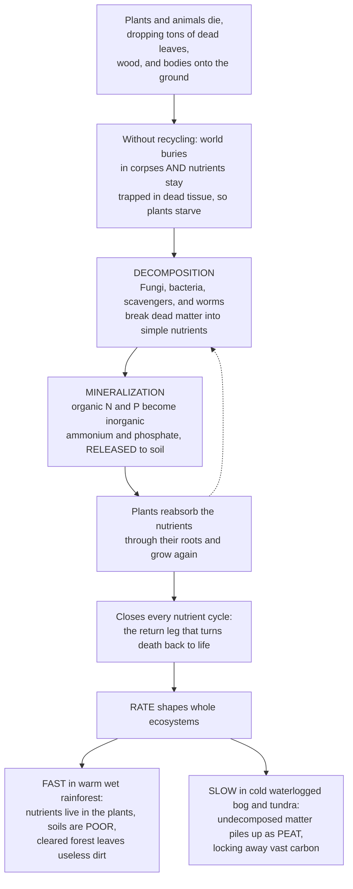

# 🍂 Nutrient Cycling and Decomposition

> [!abstract] TL;DR
> **Decomposers are nature's recycling crew, and their unglamorous work is what makes all life possible.** Every year, plants and animals die and drop tons of dead leaves, wood, and bodies onto the ground. If nothing broke them down, the world would bury miles deep in corpses — and, far worse, the **nitrogen, phosphorus, and minerals** locked inside would be trapped forever and plants would starve. **Decomposition** solves both problems: an army of **fungi and bacteria** (plus scavengers, worms, and insects) breaks dead organic matter back into simple **inorganic nutrients** — a process called **mineralization** — and releases them to the soil for plants to reuse. This is the **return leg** that closes every nutrient cycle, turning death back into life. And the *rate* at which it happens shapes whole ecosystems: **fast** in warm, wet tropics (which is why rainforest soils are surprisingly poor — the nutrients live in the plants, not the dirt) and **slow** in cold, waterlogged bogs and tundra (where undecomposed matter piles up as **peat**, locking away vast carbon).

---

## Intuition

**Analogy:** Imagine a city where garbage is *never* collected. Every day, more waste piles up in the streets — and within a year you would be wading through it. But there is a second, subtler catastrophe hiding behind the obvious one. Everything valuable in that city — the metal, the glass, the building materials — is now trapped inside the garbage heaps, unreachable. New construction grinds to a halt because there is nothing left to build with. That is exactly what would happen to an ecosystem without **decomposers**. Every autumn a forest sheds tons of dead leaves; every year animals die. Without a recycling crew, the forest floor would rise miles deep in corpses and litter — and the **nutrients** every plant needs to grow (nitrogen, phosphorus, potassium) would stay locked inside that dead tissue forever. The plants would slowly starve in a world drowning in their own dead.

**Decomposition** is the recycling crew that prevents both disasters at once. An immense, invisible army of **fungi and bacteria** secretes enzymes that dissolve dead matter chemically, while **detritivores** — earthworms, millipedes, beetles, vultures — shred and process it physically. Together they break complex dead tissue back down into the *simple inorganic nutrients* that plants can drink up through their roots again. This is not a side process; it is the **return leg of every nutrient cycle**, the loop-closer that turns death back into the raw material for new life. It is why forests do not drown in leaf litter, why a compost heap enriches a garden, and why soil is fertile at all.

And here is the twist that turns a plumbing detail into an ecological master key: the **rate** of decomposition varies enormously, and that rate *builds the world*. In a warm, wet rainforest, decomposers work so fast that a fallen leaf vanishes in weeks — nutrients are recycled almost instantly, straight back into the living canopy. That is the paradox of the rainforest: its soils are famously **poor**, because the nutrients never sit in the ground; they live inside the plants. Clear the forest and you are left with useless dirt. In a cold peat bog or Arctic tundra, decomposition is so slow — chilled and starved of oxygen underwater — that dead matter barely rots at all and instead accumulates for millennia as **peat**, quietly stockpiling one of the planet's largest reserves of **carbon**. Understanding decomposition and nutrient cycling reveals the hidden foundation beneath all soil fertility, all agriculture, and all productivity — and a climate feedback that could reshape the century.

---

## How It Works

### Core mechanics

1. **The raw material is detritus.** Dead organic matter — fallen leaves, dead wood, animal carcasses, feces — is collectively **detritus**. It is packed with energy and nutrients but locked in complex organic molecules that living plants cannot use directly. Decomposition is the process of unlocking it.
2. **Two crews, working together.** **Detritivores** (earthworms, millipedes, springtails, beetles, vultures) do the *physical* work — fragmenting litter into smaller pieces, mixing it into soil, and multiplying the surface area available for attack. **Fungi and bacteria**, the primary *chemical* decomposers, then secrete extracellular **enzymes** that break the fragments down molecule by molecule, absorbing the products. Fungi lead the assault on tough, woody material rich in **lignin**; bacteria dominate wetter, more easily digested substrates.
3. **The stages.** Fresh litter first loses soluble compounds by **leaching** in rain, is then **fragmented** by detritivores, and is finally **chemically decomposed** by microbes. What resists breakdown is chemically transformed into dark, stable **humus** through **humification**, building the long-lived organic fraction of **soil**.
4. **Mineralization is the key output.** As decomposers respire the organic matter for energy, they convert its nutrients from *organic* forms back into *inorganic* ones — organic nitrogen becomes **ammonium**, organic phosphorus becomes **phosphate**. This is **mineralization**, and it is the payoff: only inorganic nutrients can be reabsorbed by plant roots. Mineralization is literally the **return leg** of every biogeochemical cycle.
5. **Immobilization is the counter-flow.** When decomposers grow, they also *consume* nutrients to build their own bodies, tying them up in microbial biomass — **immobilization**. Whether a decomposing residue *releases* net nutrients or *withholds* them depends on its **carbon-to-nitrogen (C:N) ratio**: low-C:N material (fresh green leaves, manure) mineralizes fast; high-C:N material (straw, wood, sawdust) makes microbes rob nitrogen from the soil until they have burned off the excess carbon.
6. **The rate is set by a few master controls.** **Temperature** and **moisture** dominate — warm and moist speeds decomposition, cold or dry or *waterlogged* (anaerobic) slows it to a crawl. **Litter quality** matters next: *labile* compounds (sugars, proteins) go fast, *recalcitrant* ones (lignin, high C:N) go slow. **Oxygen** availability and the **decomposer community** finish the picture. These controls explain the whole spectrum from instant tropical recycling to millennia-long peat accumulation.
7. **The internal cycle, and the leaks.** Within an ecosystem nutrients cycle *tightly*: plant **uptake** → **litterfall / death** → **decomposition** → **mineralization** → **re-uptake**. Small **inputs** (rock **weathering**, atmospheric **deposition**, nitrogen **fixation**) and small **outputs** (**leaching**, **erosion**, gaseous loss) trickle across the ecosystem boundary — the balance famously measured by the **Hubbard Brook** watershed experiments, where clear-cutting a forest caused nitrate losses in streamwater to spike, proving that living vegetation and its recycling loop are what keep nutrients from washing away.

### Flow / Architecture



---

## Key Concepts

### Secondary
- **Decomposition** — the breakdown of dead plants and animals into simpler substances. It is nature's recycling, done mostly by fungi and bacteria.
- **Decomposers** — organisms that feed on dead matter and break it down: chiefly **fungi and bacteria**, joined by scavengers and soil animals.
- **Detritus** — the dead leaves, wood, carcasses, and waste that decomposers feed on; the "raw garbage" of the ecosystem.
- **Detritivores** — animals such as earthworms, millipedes, woodlice, and vultures that eat and physically shred dead matter, speeding decomposition.
- **Nutrient cycling** — the way nutrients like nitrogen and phosphorus are used by living things, released when they die and decompose, and used again — over and over.
- **Why it matters** — without decomposers the world would pile up with dead matter and plants would run out of nutrients; recycling by decomposers keeps soil fertile and life going.

### Undergraduate
- **Mineralization** — decomposers converting **organic** nutrients into plant-available **inorganic** forms (organic N → ammonium, organic P → phosphate). This is the crucial output of decomposition and the **return leg** of biogeochemical cycles.
- **Immobilization** — the opposite flux: nutrients taken *up* into decomposer biomass and temporarily locked away. Net mineralization versus immobilization is the balance that determines soil fertility at any moment.
- **The C:N ratio** — the master switch between the two: below roughly 25:1 residues release nitrogen (net mineralization); above it, microbes draw nitrogen *out* of the soil (net immobilization), which is why tilling in straw or sawdust can starve a crop of nitrogen.
- **Litter quality — labile vs recalcitrant** — sugars, starches, and proteins decompose quickly (**labile**); lignin, cellulose, tannins, and waxes resist (**recalcitrant**). Lignin content and C:N together predict decay rate better than any single trait.
- **The decomposition constant k** — litter mass typically declines exponentially, mass remaining = e^(−kt); **k** is the decay-rate constant, rising with temperature and moisture and falling with litter recalcitrance. Half-life = ln(2)/k.
- **Humus and soil organic matter** — the dark, stable, long-lived fraction left after humification; it stores nutrients and water, binds soil into crumb structure, and forms the **soil carbon** reservoir at the interface between biology and geology.
- **Inputs and outputs of the ecosystem cycle** — internal recycling is nearly closed, but small inputs (**weathering**, **deposition**, N **fixation**) and outputs (**leaching**, **erosion**, gaseous N loss) set the long-term nutrient budget, as quantified at Hubbard Brook.

### Graduate
- **Nutrient-use efficiency and cycle "tightness"** — nutrient-poor ecosystems evolve toward *tight* cycles: high nutrient resorption from senescing leaves before litterfall, low leaching losses, and mycorrhizal scavenging, so that a scarce atom of phosphorus may be cycled dozens of times before it is lost. Cycle openness is itself an ecosystem-level adaptation.
- **The Hubbard Brook watershed experiment** — Likens and Bormann's paired-catchment mass balances showed that an intact forest retains nutrients almost perfectly, but experimental **deforestation** caused stream nitrate to rise more than fiftyfold, demonstrating that biotic uptake and decomposition together regulate whole-watershed nutrient export.
- **The soil carbon reservoir and its climate feedback** — global soils hold more carbon than the atmosphere and all vegetation combined, most of it as slowly decomposing organic matter in cold or waterlogged systems (**peatlands, permafrost, boreal soils**). Warming accelerates decomposition (raising **k**), potentially releasing CO₂ and methane in a **positive feedback** on climate — one of the largest uncertainties in Earth-system projections.
- **The tropical soil paradox** — high rainfall and heat drive decomposition and weathering so fast that nutrients are mineralized and either re-taken instantly by dense root mats or leached away; the nutrient capital resides in **living biomass**, not the deeply weathered, oxide-rich soil. This explains why slash-and-burn releases a one-time nutrient pulse and why cleared rainforest agriculture collapses within a few seasons.
- **Anaerobic decomposition and peat formation** — below the water table, oxygen is absent and decomposition shifts to slow anaerobic pathways (fermentation, methanogenesis) that cannot fully break down lignin; production outpaces decay and organic matter accumulates as **peat**, sequestering carbon for millennia until drainage or warming reverses it.
- **Stoichiometric and enzymatic controls** — decomposition is increasingly modeled through **ecological stoichiometry** (elemental ratios of substrate vs decomposer demand) and microbial **enzyme kinetics**, linking litter chemistry, microbial physiology, and temperature sensitivity (Q₁₀) into predictive biogeochemical models.
- **The brown food web** — the detrital ("brown") energy channel that processes dead matter often moves *more* energy than the green grazing channel; decomposition is not a footnote to the food web but frequently its dominant pathway.

---

## Python Demo

```python
# Decomposition and nutrient cycling: the recycling machinery that closes the loop.
#   (A) LITTER DECAY  - dead organic matter decays exponentially as decomposers
#       work on it: mass remaining = exp(-k*t). The rate constant k rises with
#       temperature and moisture, so the SAME leaf vanishes in weeks in a warm-wet
#       tropical forest but persists for centuries in a cold, waterlogged bog.
#   (B) THE CLOSED LOOP - as litter decomposes it MINERALIZES nutrients into a
#       plant-available soil pool, which plants take up into biomass: death -> soil
#       -> life. We also contrast WHERE nutrients are stored (biomass vs soil) in a
#       fast-cycling tropical forest vs a slow-cycling boreal one.
import numpy as np
import matplotlib.pyplot as plt

# ============================================================
# (A) LITTER DECAY:  mass_remaining = exp(-k * t)
# k is the decomposition-rate constant (per year).
# ============================================================
t = np.linspace(0, 20, 400)                       # years
regimes = {
    "Tropical (warm/wet)":  (2.00, "firebrick"),  # fast: leaf gone in months
    "Temperate forest":     (0.40, "darkorange"),
    "Boreal (cold)":        (0.10, "seagreen"),
    "Peat bog (waterlogged)":(0.02, "navy"),       # slow: accumulates as peat
}

# ============================================================
# (B) THE CLOSED RECYCLING LOOP (a simple 3-pool model)
#   Litter L  ->  Soil available nutrient A  ->  Plant biomass B
#   dL/dt = -k*L                (mineralization releases nutrient)
#   dA/dt =  k*L - u*A          (released to soil, drawn down by uptake)
#   dB/dt =  u*A                (plants reabsorb it -> new growth)
# ============================================================
k, u = 1.0, 0.8                                   # decay & plant-uptake rates /yr
dt, T = 0.01, 15.0
steps = int(T / dt)
tt = np.linspace(0, T, steps)
L = np.zeros(steps); A = np.zeros(steps); B = np.zeros(steps)
L[0], A[0], B[0] = 100.0, 0.0, 0.0                # 100 units of N locked in litter
for i in range(steps - 1):
    dL = -k * L[i]
    dA =  k * L[i] - u * A[i]
    dB =  u * A[i]
    L[i+1] = L[i] + dt * dL
    A[i+1] = A[i] + dt * dA
    B[i+1] = B[i] + dt * dB

# ============================================================
# (C) WHERE ARE THE NUTRIENTS STORED?  biomass vs soil
# Tropical: fast cycling -> nutrients in living plants, POOR soil.
# Boreal:   slow cycling -> nutrients accumulate in soil / peat.
# ============================================================
systems   = ["Tropical\nrainforest", "Boreal\nforest"]
in_biomass = np.array([0.76, 0.20])               # fraction of nutrient capital
in_soil    = 1.0 - in_biomass

# ---- plot ----
fig, (ax1, ax2, ax3) = plt.subplots(1, 3, figsize=(15, 4.6))

for label, (kk, color) in regimes.items():
    ax1.plot(t, np.exp(-kk * t), color=color, lw=2.3, label=f"{label}  k={kk}")
ax1.axhline(0.5, color="gray", ls=":", lw=1)
ax1.text(0.2, 0.53, "half of litter mass remaining", fontsize=8, color="gray")
ax1.set_title("(A) Litter decay: mass = exp(-k*t)")
ax1.set_xlabel("Years since litterfall"); ax1.set_ylabel("Fraction of mass remaining")
ax1.legend(fontsize=8); ax1.grid(alpha=0.3)

ax2.plot(tt, L, color="saddlebrown", lw=2.4, label="Litter (dead matter)")
ax2.plot(tt, A, color="darkorange",  lw=2.4, label="Soil available nutrient")
ax2.plot(tt, B, color="seagreen",    lw=2.4, label="Plant biomass (reused)")
ax2.set_title("(B) The closed loop: death -> soil -> life")
ax2.set_xlabel("Years"); ax2.set_ylabel("Nutrient (units of N)")
ax2.legend(fontsize=8); ax2.grid(alpha=0.3)

ax3.bar(systems, in_biomass, color="seagreen",  label="In living biomass")
ax3.bar(systems, in_soil, bottom=in_biomass, color="saddlebrown", label="In soil / litter")
ax3.set_title("(C) Where the nutrients are stored")
ax3.set_ylabel("Share of nutrient capital"); ax3.set_ylim(0, 1)
ax3.legend(fontsize=8)

plt.tight_layout(); plt.show()

# Numeric takeaways
for label, (kk, _) in regimes.items():
    print(f"{label:24s} half-life = {np.log(2)/kk:6.1f} yr")
print(f"After 15 yr the loop returned {B[-1]:.1f} of 100 N units to plant biomass")
```

Panel **(A)** shows the single most important fact about decomposition: it is an exponential decay whose *rate* varies by two orders of magnitude across climates. A tropical leaf (k ≈ 2) is half gone in about four months and effectively vanished within two years; peat-bog litter (k ≈ 0.02) has a half-life of *35 years* and simply accumulates. Panel **(B)** shows the closed loop in action — nutrient locked in litter is mineralized into a soil-available pool that pulses up and is then drawn down as plants take it back into biomass: death becomes life. Panel **(C)** shows the ecological consequence of decay *rate*: fast-cycling tropical forests keep their nutrient capital in the living plants (leaving poor soils), while slow-cycling boreal systems bank it in the soil — the reason the two biomes respond so differently to clearing and to warming.

---

## Real-World Applications

- **Composting and soil-fertility management.** Composting is decomposition engineered on purpose: gardeners and municipalities manage moisture, aeration, and the **C:N ratio** (mixing "greens" and "browns") to speed mineralization and produce nutrient-rich humus. The same logic drives manure management, cover cropping, and no-till farming, all of which feed the decomposer community that regenerates soil fertility.
- **Understanding why some soils are rich and others poor.** Decomposition rate explains the map of global agriculture: deeply weathered, fast-cycling **tropical soils** are nutrient-poor and fragile, which is why slash-and-burn cropping fails within a few seasons, while cool, slow-cycling temperate grassland soils accumulate deep, fertile humus (the world's breadbaskets). Matching land use to decomposition regime is central to sustainable agriculture.
- **The permafrost and peatland carbon-climate feedback.** Cold and waterlogged soils store immense carbon precisely *because* decomposition is suppressed. As the Arctic warms and peatlands are drained, decomposers reactivate, raising **k** and releasing CO₂ and methane — a positive feedback that Earth-system models treat as one of the largest tipping-point risks, and a direct reason to protect and rewet peatlands.
- **Forest and watershed management.** The Hubbard Brook finding — that clearing vegetation causes catastrophic nutrient leaching — underpins riparian buffer laws, selective-logging rules, and the recognition that intact forests provide clean water as a service of their tight nutrient cycle.
- **Wastewater treatment and bioremediation.** Sewage treatment plants are essentially cultivated decomposer ecosystems, using bacterial mineralization to convert organic waste into inorganic nutrients and clean water; the same microbial breakdown is harnessed to degrade oil spills and organic pollutants.

---

## Common Pitfalls

- **Thinking decomposers just "clean up" dead matter.** The removal of corpses is the *visible* service; the *essential* one is **mineralization** — returning locked-up nutrients to plant-available forms. Without that return leg, nutrient cycles would run one way into dead tissue and productivity would collapse even if the litter somehow disappeared.
- **Assuming fast decomposition means rich soil.** It is the opposite. Fast tropical decomposition means nutrients are recycled so quickly that they never accumulate in the ground — the soil is poor and the capital lives in the plants. Slow decomposition is what *builds* deep, fertile, carbon-rich soils. Rate and soil richness are inversely related.
- **Confusing mineralization with immobilization.** Adding high-carbon residue (straw, sawdust, wood chips) does *not* fertilize a crop in the short term — its high **C:N ratio** makes microbes immobilize soil nitrogen to build their own biomass, temporarily *starving* the plants. Whether decomposition releases or withholds nutrients depends entirely on substrate chemistry.
- **Ignoring oxygen and water.** Decomposition is not just about temperature. Waterlogging shuts off oxygen and switches microbes to slow anaerobic pathways, which is why a warm swamp can still accumulate peat. Drainage — not just warming — can trigger massive carbon release by re-admitting oxygen.
- **Treating soil carbon as permanent.** The vast soil and peat carbon store is a *dynamic balance* between inputs and decomposition, not a locked vault. Warming, drainage, and tillage all raise decomposition and can flip a soil from a carbon sink to a carbon source.
- **Overlooking the brown food web.** Textbooks emphasize the green, grazing food chain, but the detrital ("brown") pathway often processes the majority of an ecosystem's energy and nutrients. Modeling productivity while ignoring decomposition badly misrepresents how the ecosystem actually works.

---

## Related Concepts

Within this vault, nutrient cycling and decomposition are the **return leg** that completes the picture begun in the sibling notes of this section. The energy side of the same story — how the *energy* in that dead matter flows through the detrital food web — is covered in **Ecosystem_Ecology_and_Energy_Flow**, while the element-by-element chemistry of carbon, nitrogen, and phosphorus moving through the biosphere is the subject of **Global_Biogeochemical_Cycles**, for which decomposition supplies the crucial mineralization step. The detritivores and microbial recyclers described here form the "brown" channel of **Food_Webs_and_Trophic_Dynamics**; the applied management of decomposition for soil fertility runs through **Agroecology_and_Food_Systems**; and the vulnerability of peat and permafrost soil carbon to warming connects directly to **Climate_Change_Ecology**.

Across the wider vault, the following notes deepen specific threads (all verified present):

- [[Ecosystems_and_Energy_Flow]] — Biology's treatment of ecosystem structure and energy flow, where decomposers close the loop that primary production opens.
- [[Biogeochemical_Cycles]] — the carbon, nitrogen, and phosphorus cycles for which decomposition and mineralization provide the return leg.
- [[Bacteria_and_Archaea]] — the microbial workhorses whose extracellular enzymes and respiration actually perform mineralization.
- [[Weathering_and_Soils]] — Earth Science's account of how rock weathering and organic decomposition together build soil, the interface where this recycling happens.

---

## Review Questions

1. **Secondary** — Explain what would happen to a forest if all its decomposers suddenly disappeared. Describe *two* separate problems this would cause, and name the kinds of organisms that normally prevent them.
2. **Undergraduate** — A gardener digs a large amount of dry straw into a vegetable bed and finds that the plants turn yellow and grow poorly for several weeks before recovering. Using the concepts of **mineralization**, **immobilization**, and the **C:N ratio**, explain exactly why this happens and how the gardener could have avoided it.
3. **Graduate** — Tropical rainforests grow lush on nutrient-poor soils, while cold peat bogs accumulate enormous carbon stores on top of slowly decaying litter. Explain how a *single* variable — the rate of decomposition and its master controls — accounts for both patterns, and discuss why this makes the two biomes respond very differently to (a) clearing for agriculture and (b) a warming climate.

---

## Sources

- Chapin, F. S. III, Matson, P. A., & Vitousek, P. M. — *Principles of Terrestrial Ecosystem Ecology* (2nd ed., Springer, 2011).
- Swift, M. J., Heal, O. W., & Anderson, J. M. — *Decomposition in Terrestrial Ecosystems* (University of California Press, 1979).
- Likens, G. E., & Bormann, F. H. — *Biogeochemistry of a Forested Ecosystem* (3rd ed., Springer, 2013) — the Hubbard Brook watershed experiments.
- Schlesinger, W. H., & Bernhardt, E. S. — *Biogeochemistry: An Analysis of Global Change* (4th ed., Academic Press, 2020).
- Berg, B., & McClaugherty, C. — *Plant Litter: Decomposition, Humus Formation, Carbon Sequestration* (4th ed., Springer, 2020).

---

#ecology #decomposition #nutrient-cycling #decomposers #soil
