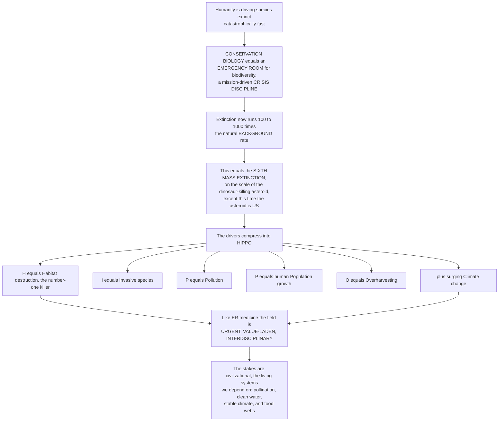

# 🚑 Conservation Biology and the Biodiversity Crisis

> [!abstract] TL;DR
> **Conservation biology** is the **emergency-room science for the planet's biodiversity** — a mission-driven "**crisis discipline**" (Michael Soulé) born from the alarming recognition that humanity is driving species extinct **hundreds to thousands of times faster** than the natural "background" rate, so fast that scientists call it the **sixth mass extinction**, an event on the scale of the asteroid that killed the dinosaurs — except this time **the asteroid is us**. The drivers compress into one mnemonic, **HIPPO** (E. O. Wilson): **H**abitat destruction (the number-one killer), **I**nvasive species, **P**ollution, human **P**opulation growth and overconsumption, and **O**verharvesting — with **climate change** now surging as a major threat. Like ER medicine, the field is **urgent** (you must act before all the data are in), **value-laden** (it starts from the premise that biodiversity is worth saving), and **interdisciplinary** (fusing ecology, genetics, geography, economics, law, and ethics). The stakes are not merely aesthetic but civilizational: the living systems humanity depends on — pollination, clean water, stable climate, food webs — are unraveling. This is the opener to the conservation section, framing the extinction, small-population, habitat-loss, invasive-species, and protected-area notes that follow.

---

## Intuition

**Analogy:** Picture the planet's living diversity wheeled into a **hospital emergency room**, bleeding out. Conservation biology is the trauma team. And an ER, unlike a research lab, runs on a completely different set of rules. You **cannot wait for certainty** — a patient (a species) crashing in front of you cannot survive a twenty-year controlled study, so you act on the best evidence you have *right now*, under deep uncertainty. You are **not neutral** — the entire enterprise begins from a value: this life is worth saving, and its loss is a tragedy to be prevented. And you need **every specialty at once** — the surgeon, the anesthetist, the radiologist, the pharmacist — because saving a life is never one discipline's job. Conservation biology is exactly this: **urgent, value-laden, and interdisciplinary**, a science invented not to satisfy curiosity but to stop a catastrophe already in progress.

And the catastrophe is real and measurable. The natural, geological "**background**" rate of extinction is slow — very roughly one species in a million per year. Today species are vanishing **100 to 1,000 times faster**, fast enough that biologists rank our era alongside the **five great mass extinctions** of deep time — the cataclysms that erased the trilobites and the dinosaurs. This is the **sixth mass extinction**, and its cause is not a wandering asteroid or a volcanic winter: **it is a single species — ours.** What are we doing to cause it? The damage sorts neatly into five hammers, remembered as **HIPPO**: bulldozing and draining **H**abitat (by far the biggest), unleashing **I**nvasive species, spewing **P**ollution, multiplying our own **P**opulation and appetite, and **O**verharvesting fish, forests, and wildlife — with **climate change** now compounding all five. Understanding this crisis, and the emergency science built to fight it, is the foundation for everything else in this section: why small populations are doomed, how habitat loss kills, and how we mount the rescue.

---

## How It Works

### Core Mechanics

1. **Conservation biology is a "crisis discipline."** Soulé (1985) coined the phrase to capture that the field is fundamentally unlike normal, curiosity-driven "**normal science**." Its goals are explicitly *applied*: to **understand and protect biodiversity** and to **maintain the ecological and evolutionary processes** that generate and sustain it. It is a **synthetic** discipline, borrowing tools from wherever it must.
2. **Three defining features flow from the emergency.** First, **urgency** — decisions must be made *before* the data are complete, because delay means irreversible loss (the emergency-room ethos: acting under uncertainty is the norm, not a failure). Second, a **value-laden foundation** — Soulé's *normative postulates*: diversity of organisms is good, ecological complexity is good, evolution is good, and biotic diversity has intrinsic value. Science tells you *what is* and *what will happen if*; the decision to *act* rests on these values. Third, **interdisciplinarity** — it fuses population ecology, genetics, biogeography, and climatology with economics, law, policy, ethics, and social science, because species are lost for social and economic reasons and saved by social and economic means.
3. **The biodiversity crisis is the mass loss of species and ecosystems now underway.** "Biodiversity" spans three nested levels — **genetic** diversity within species, **species** diversity, and **ecosystem** diversity — and all three are eroding simultaneously.
4. **The sixth mass extinction: measuring the pulse.** A **mass extinction** is a short interval in which a large fraction of species is lost across many groups. Earth has had **five** (the "Big Five," e.g., the end-Permian and the end-Cretaceous asteroid impact). Current extinction rates are estimated at roughly **100 to 1,000 times** the natural **background** rate — and rising — a rate comparable to those ancient catastrophes but occurring in **centuries rather than millennia**, and driven by one species. Ceballos, Ehrlich, and Dirzo (2017) call the population-level collapse behind it "**biological annihilation**" or *defaunation*.
5. **Quantifying the crisis.** The **IUCN Red List** classifies species along a threat gradient — Least Concern → Near Threatened → Vulnerable → Endangered → Critically Endangered → Extinct in the Wild → Extinct — and is the global standard for extinction risk. The **Living Planet Index** tracks average declines in monitored vertebrate *populations* (a large drop across recent decades), capturing the erosion of abundance that precedes outright extinction.
6. **The drivers: HIPPO (plus C).** Wilson's mnemonic ranks the proximate causes: **H**abitat destruction and degradation (the leading cause), **I**nvasive species, **P**ollution, human **P**opulation growth and overconsumption, and **O**verexploitation — with **climate change** an increasingly dominant sixth force. These drivers act in **synergy**: fragmented habitat is easier for invasives to enter, a warming climate pushes species out of shrinking reserves, and so on. The compounding is often worse than any single threat alone.
7. **Why biodiversity matters: the case for conservation.** Two families of argument. **Intrinsic value** — species and ecosystems have worth in themselves and a right to exist, independent of human use (an ethical premise). **Instrumental / utilitarian value** — biodiversity underpins **ecosystem services** (pollination, clean water, climate regulation, food, fiber, medicine) plus *option value* (future uses not yet discovered) and *bequest value* (leaving it for descendants). The stakes are the life-support system of civilization itself.

### Flow / Architecture



---

## Key Concepts

### Secondary (foundational)

- **Conservation biology** — the science of **saving life on Earth**: studying why plants and animals are disappearing and figuring out how to stop it. It is like **emergency medicine for nature**.
- **Extinction** — when the **last individual** of a species dies and it is gone forever. It has always happened slowly in nature, but right now it is happening **far too fast**.
- **The sixth mass extinction** — five times in Earth's history a huge share of all species died out (once from a giant **asteroid** that killed the dinosaurs). Scientists warn we are now in a **sixth** great die-off — and this time **humans are the cause**.
- **HIPPO** — an easy way to remember the five main reasons species are vanishing: **H**abitat loss, **I**nvasive species, **P**ollution, human **P**opulation growth, and **O**verhunting/overfishing. **Habitat loss is the biggest.**
- **Why it matters** — nature gives us **clean water, food, pollination for crops, and a stable climate**. Losing biodiversity is not just sad; it threatens the systems that **keep people alive**.

### Undergraduate (core)

- **Crisis discipline (Soulé, 1985)** — conservation biology differs from "normal science" because it must deliver **management decisions under urgency and uncertainty**. Its three hallmarks: **urgency**, a **value-laden (normative) foundation**, and **interdisciplinarity**.
- **Normative postulates** — the explicit value premises Soulé listed: diversity of organisms is good, ecological complexity is good, evolution is good, and biodiversity has **intrinsic value**. These make conservation biology openly *mission-driven* rather than value-neutral.
- **Background vs. mass-extinction rates** — the **background rate** is the slow, normal extinction rate over geological time (roughly ~0.1–1 species per million species-years). Current rates are **~100–1,000× higher**, placing us among **mass-extinction** conditions — the "**Big Five**" analog occurring in the blink of geological time.
- **Measuring biodiversity loss** — the **IUCN Red List** (categories from Least Concern to Critically Endangered to Extinct) quantifies *risk*; the **Living Planet Index** quantifies *population decline*; both convert the abstract "crisis" into trackable indicators.
- **The HIPPO drivers, ranked** — **H**abitat loss and fragmentation (dominant), **I**nvasives, **P**ollution, human **P**opulation/overconsumption, **O**verexploitation, plus **climate change** — with **synergies** amplifying their combined effect beyond the sum of parts.
- **Intrinsic vs. instrumental value** — the two justifications for conservation: species' **right to exist** (intrinsic, ethical) versus the **ecosystem services**, option, and bequest values they provide (instrumental, utilitarian). Most real policy blends both.

### Graduate (advanced)

- **The is/ought structure of a mission-driven science** — conservation biology deliberately couples *descriptive* science (extinction dynamics, population viability) with *prescriptive* goals. Recognizing where the **normative postulates** enter is essential to doing the science rigorously while acknowledging its value commitments — and to navigating disputes (e.g., "new conservation" and its critics) about *which* values guide practice.
- **Estimating extinction rates and their uncertainty** — rates are inferred from the fossil record (background), species–area relationships, IUCN assessments, and population-decline extrapolation, each with large error bars. Ceballos et al. (2015) used a *conservative* background of **2 E/MSY** and still found modern rates ~100× higher; incomplete taxonomy (most species undescribed) and the **extinction debt** (committed but not-yet-realized losses) mean true rates are likely **underestimated**.
- **Biological annihilation and defaunation** — Ceballos, Ehrlich & Dirzo (2017) argue that focusing on species-level extinctions *understates* the crisis: massive declines and **local population extirpations** — the erosion of *abundance and range* — are already dismantling ecosystem function well before a species formally goes extinct.
- **Driver synergies and interaction effects** — HIPPO threats are non-additive: habitat **fragmentation** raises edge exposure and invasion, climate change shifts ranges *out of* static reserves, and overharvest interacts with disease. Modeling these **compounding, nonlinear** interactions (and tipping points) is a frontier of conservation science.
- **Valuation, discounting, and the limits of instrumentalism** — translating biodiversity into **ecosystem-service dollar values** informs policy but is contested: it can undervalue rare or "useless" species, mishandle **non-substitutable** and irreversible losses, and clash with intrinsic-value ethics. The **option** and **bequest** value framing partially addresses deep uncertainty about future usefulness.
- **Diversity–stability and function** — the instrumental case rests partly on evidence that biodiversity underpins **ecosystem functioning and stability** (the biodiversity–ecosystem-function literature, insurance and redundancy hypotheses), linking species loss to measurable declines in productivity, resilience, and service delivery.

---

## Python Demo

```python
# The biodiversity crisis in two views:
#   (A) SIXTH MASS EXTINCTION -- current extinction rates plotted against the natural
#       "background" rate (extinctions per million species-years, E/MSY), on a log axis,
#       showing modern rates run ~100-1000x background. A parallel line shows the
#       Living Planet Index style collapse in average vertebrate populations over recent
#       decades -- the "biological annihilation" of abundance that precedes extinction.
#   (B) HIPPO DRIVERS -- the relative share of threatened species affected by each major
#       driver, showing HABITAT LOSS dominating (illustrative, IUCN-Red-List-flavoured).
import numpy as np
import matplotlib.pyplot as plt

# ---------- (A) Extinction rate vs. background + Living Planet decline ----------
# Extinction rate in E/MSY (extinctions per million species-years).
scenarios = ["Natural\nbackground", "20th-century\nobserved",
             "Recent\ndecades", "Projected\n(business as usual)"]
rate_EMSY = [1.0, 100.0, 500.0, 1500.0]   # illustrative; background conservative ~1-2
colors_A  = ["#4d9221", "#f6a800", "#e8601c", "#b2182b"]

# Living Planet Index style: average monitored vertebrate population size (index=100 at 1970)
years = np.arange(1970, 2021, 2)
# ~68% average decline by 2020 -> exponential-ish decay to index ~32
lpi = 100.0 * np.exp(np.log(0.32) * (years - 1970) / (2020 - 1970))

# ---------- (B) HIPPO drivers: share of threatened species affected ----------
drivers = ["Habitat loss\n(H)", "Overexploitation\n(O)", "Invasive species\n(I)",
           "Pollution\n(P)", "Climate change\n(+C)"]
share   = [85, 55, 30, 25, 20]            # illustrative % of threatened species affected
colors_B = ["#8c2d04", "#cc4c02", "#ec7014", "#fe9929", "#fec44f"]

fig, (ax1, ax2) = plt.subplots(1, 2, figsize=(13.5, 5.2))

# Panel A: extinction rate bars (log) + Living Planet decline on a twin axis
xA = np.arange(len(scenarios))
ax1.bar(xA, rate_EMSY, color=colors_A, width=0.6, zorder=3)
ax1.set_yscale("log")
ax1.set_xticks(xA); ax1.set_xticklabels(scenarios, fontsize=8)
ax1.set_ylabel("Extinction rate  (E / MSY, log scale)")
ax1.set_title("(A) The Sixth Mass Extinction:\ncurrent rates run ~100-1000x background")
ax1.axhline(rate_EMSY[0], ls="--", color="#4d9221", lw=1.2, zorder=2)
for x, r in zip(xA, rate_EMSY):
    factor = r / rate_EMSY[0]
    lbl = f"{r:.0f}\n({factor:.0f}x)" if factor > 1 else f"{r:.0f}\n(baseline)"
    ax1.text(x, r * 1.35, lbl, ha="center", va="bottom", fontsize=7.5)
ax1.set_ylim(0.5, 6000)
ax1.grid(axis="y", which="both", ls=":", alpha=0.4, zorder=0)

# Twin axis: Living Planet Index decline (abundance collapse)
ax1b = ax1.twinx()
ax1b.plot(np.interp(years, [1970, 2020], [0.15, 3.15]), lpi,
          color="#2166ac", lw=2.2, marker="o", ms=3, zorder=4)
ax1b.set_ylabel("Living Planet Index\n(avg vertebrate population, 1970 = 100)",
                color="#2166ac", fontsize=8)
ax1b.tick_params(axis="y", labelcolor="#2166ac")
ax1b.set_ylim(0, 110)
ax1b.annotate("abundance collapse\n(biological annihilation)",
              xy=(2.6, lpi[-1]), xytext=(0.8, 55), fontsize=7.5, color="#2166ac",
              arrowprops=dict(arrowstyle="->", color="#2166ac"))

# Panel B: HIPPO drivers, habitat loss dominating
yB = np.arange(len(drivers))
ax2.barh(yB, share, color=colors_B)
ax2.set_yticks(yB); ax2.set_yticklabels(drivers, fontsize=8.5)
ax2.invert_yaxis()
ax2.set_xlabel("Share of threatened species affected  (percent, illustrative)")
ax2.set_title("(B) HIPPO drivers of extinction:\nhabitat loss dominates")
for y, v in zip(yB, share):
    ax2.text(v + 1.5, y, f"{v}%", va="center", fontsize=8.5)
ax2.set_xlim(0, 100)
ax2.grid(axis="x", ls=":", alpha=0.4)
ax2.text(0.98, -0.16, "Underlying multiplier: human Population growth + overconsumption",
         transform=ax2.transAxes, ha="right", fontsize=7.5, style="italic", color="dimgray")

plt.tight_layout()
plt.savefig("biodiversity_crisis.png", dpi=120)
plt.show()

print("Extinction rate vs. background:")
for s, r in zip(scenarios, rate_EMSY):
    print(f"  {s.replace(chr(10), ' '):28s}: {r:7.0f} E/MSY  ({r / rate_EMSY[0]:.0f}x background)")
print(f"\nLiving Planet Index 2020 : {lpi[-1]:.0f}  "
      f"(a {100 - lpi[-1]:.0f}% average decline in monitored vertebrate populations since 1970)")
print("Top driver               : Habitat loss "
      f"({share[0]}% of threatened species affected)")
```

**What it shows.** **Panel A** makes the "sixth mass extinction" claim quantitative: on a log axis, the natural **background** rate (a conservative ~1 E/MSY) is dwarfed by modern rates that run **~100–1,000×** higher and are still climbing — the same order-of-magnitude jump that defines the "Big Five" catastrophes of deep time. The blue **Living Planet Index** line overlays the *other* face of the crisis: average monitored vertebrate **populations** have collapsed by roughly two-thirds since 1970 — the "**biological annihilation**" of abundance that hollows out ecosystems long before species formally blink out. **Panel B** ranks the **HIPPO** drivers by the share of threatened species each affects: **habitat loss towers over the rest**, with overexploitation, invasives, pollution, and climate change following — while human **population growth and overconsumption** sits beneath all of them as the ultimate multiplier. (Figures are illustrative but faithful to the IUCN Red List and Living Planet Report pattern.)

---

## Real-World Applications

> **Example:** **The IUCN Red List — the planet's biodiversity triage chart.** The single most important operational output of conservation biology is the **IUCN Red List of Threatened Species**, which applies standardized, quantitative criteria (population size, decline rate, range, fragmentation) to place each assessed species into a threat category from Least Concern to Extinct. It is the emergency room's triage system: it tells governments, treaties (CITES), and funders *which* species are crashing and *how fast*, converting the abstract "crisis" into an actionable, globally comparable list that directs limited conservation resources.

- **CITES and the wildlife trade** — the Overharvesting driver made law: the Convention on International Trade in Endangered Species regulates or bans trade in species (elephants, pangolins, rosewood) whose overexploitation threatens survival, a direct policy response to the "O" in HIPPO.
- **Protected-area networks (Aichi Targets, 30x30)** — the primary weapon against Habitat loss is setting land and sea aside; global agreements (the Kunming-Montreal framework's target to protect **30% of the planet by 2030**) are conservation biology's habitat-preservation logic scaled to the whole Earth.
- **Ecosystem-service valuation and payments** — putting a dollar figure on pollination, water purification, and carbon storage (natural-capital accounting, REDD+ forest-carbon payments) operationalizes the *instrumental* case for conservation and channels finance toward keeping ecosystems intact.
- **Invasive-species biosecurity** — border inspection, ballast-water treatment, and island-eradication programs target the "I" in HIPPO, which is the leading cause of extinction on islands specifically.
- **Red List Index and biodiversity indicators** — aggregated trends in Red List status and the Living Planet Index feed directly into UN Sustainable Development Goal reporting and the post-2020 Global Biodiversity Framework, giving policymakers a dashboard for whether the crisis is worsening or easing.

---

## Common Pitfalls

- **Mistaking conservation biology for value-free "normal science."** It is a **crisis discipline** with explicit normative postulates: it *starts* from the premise that biodiversity is worth saving. Pretending it is purely descriptive obscures where the values enter — and disputes over *which* values (intrinsic vs. instrumental, "old" vs. "new" conservation) are really disputes about the mission, not the data.
- **Demanding certainty before acting.** The emergency-room ethos is the whole point: a crashing species cannot wait for a definitive twenty-year study. Treating precaution as unscientific, or waiting for perfect data, guarantees preventable extinctions — the **extinction debt** means some losses are already committed even where populations look stable.
- **Equating "extinction" only with the last individual dying.** By the time a species is formally extinct, its ecological role has usually been dead for decades. The crisis is better measured by **population collapse and range contraction** (defaunation, the Living Planet Index) — "biological annihilation" is well advanced before the Red List says "Extinct."
- **Under-ranking habitat loss (or over-fixating on charismatic threats).** Poaching and climate change dominate headlines, but **habitat destruction is the number-one driver** for the great majority of threatened species. Prioritizing photogenic threats over unglamorous land-use change misallocates the field's scarce resources.
- **Treating the HIPPO drivers as independent and additive.** They act in **synergy**: fragmentation invites invasives, warming pushes species out of static reserves, overharvest compounds disease. Modeling one driver at a time systematically **underestimates** the combined risk and can miss tipping points.
- **Reducing all value to dollars.** Ecosystem-service valuation is powerful but blind to rare, "useless," or irreplaceable species and to irreversible, non-substitutable losses. Leaning solely on instrumental value can justify trading away exactly the biodiversity that intrinsic-value ethics exists to protect.

---

## Related Concepts

This note is the **section opener for biodiversity and conservation biology**; the topics it surveys are each developed in a dedicated sibling note. **Extinction and the sixth mass extinction** drills into extinction dynamics, background-vs-mass rates, and the "biological annihilation" evidence introduced here; **habitat loss, fragmentation, and island biogeography** develops the number-one HIPPO driver and the theory linking area to species number; **population viability and small-population biology** explains *why* small populations are doomed (the genetic and demographic vortices behind Red List criteria); **invasive species and biological invasions** covers the "I" in HIPPO; and **protected areas and conservation strategies** turns to the rescue itself — reserves, corridors, and the 30x30 response to habitat loss. Those five are prose references because they are in-vault siblings of this opener.

- [[Ecology_and_Conservation_Overview]] — the vault hub that places conservation biology as the applied capstone atop population, community, and ecosystem ecology.
- [[Biodiversity_and_Species_Richness]] — the community-ecology note quantifying *what* the crisis is destroying: richness, evenness, and the measurement of diversity.
- [[Metapopulations_and_Spatial_Ecology]] — the spatial-dynamics foundation for why fragmented habitat and small isolated populations wink out, central to small-population conservation.
- [[Biodiversity_and_Conservation]] — Biology's foundational treatment of the same theme; this note is the deep-dive, crisis-discipline framing that extends it (distinct basename by design).
- [[Mass_Extinctions_and_Paleoclimate]] — the Earth-science record of the "Big Five" ancient mass extinctions against which the human-caused sixth is benchmarked.
- [[Anthropogenic_Climate_Change]] — the surging "+C" driver behind HIPPO: how warming ranges, shifting seasons, and ocean change compound every other threat.
- [[Sustainability_and_Planetary_Boundaries]] — the systems-level framing in which biosphere integrity (biodiversity loss) is one of the most transgressed planetary boundaries.
- [[Ecological_Resilience_and_Ecosystems]] — why losing biodiversity erodes the resilience of the ecosystems and services that human survival depends on.

---

## Review Questions

1. **(Secondary)** In your own words, why do scientists call conservation biology an "emergency room" for nature? What does the mnemonic **HIPPO** stand for, and which of its letters is the biggest cause of extinction?
2. **(Undergraduate)** Explain what is meant by the "**background**" extinction rate and how the current rate compares to it. Why does this comparison justify calling our era the "**sixth mass extinction**," and how does the Living Planet Index capture a *different* dimension of the crisis than a species count does?
3. **(Undergraduate)** Soulé described conservation biology as a **crisis discipline** with three hallmarks — urgency, a value-laden foundation, and interdisciplinarity. Illustrate each hallmark with a concrete example, and explain how the "value-laden" hallmark distinguishes it from ordinary descriptive science.
4. **(Graduate)** A government proposes to justify protecting a wetland *entirely* on the dollar value of its ecosystem services. Using the distinction between **intrinsic** and **instrumental** value (and option/bequest values), critique this approach: what kinds of biodiversity does a purely monetary valuation systematically undervalue, and why might that undermine conservation goals?
5. **(Graduate)** The HIPPO drivers are often modeled one at a time, yet they act in **synergy**. Choose two drivers (e.g., habitat fragmentation and climate change) and explain mechanistically how their interaction could produce extinction risk greater than the sum of the two acting alone. What does this imply about the reliability of single-driver risk assessments and the concept of extinction debt?

---

## Sources

- Primack, R. B. — *Essentials of Conservation Biology* (Sinauer/Oxford University Press). — the standard introductory text framing the crisis discipline, HIPPO drivers, and conservation values.
- Soulé, M. E. (1985). "What is Conservation Biology?" *BioScience* 35(11): 727–734. [DOI](https://doi.org/10.2307/1310054) — the founding paper defining conservation biology as a crisis discipline with normative postulates.
- Wilson, E. O. (1992). *The Diversity of Life*. Harvard University Press. — the classic articulation of biodiversity, its value, and the HIPPO drivers of its loss.
- Ceballos, G., Ehrlich, P. R., & Dirzo, R. (2017). "Biological annihilation via the ongoing sixth mass extinction signaled by vertebrate population losses and declines." *PNAS* 114(30): E6089–E6096. [DOI](https://doi.org/10.1073/pnas.1704949114) — evidence for population-level defaunation as the leading edge of the sixth extinction.
- Ceballos, G., et al. (2015). "Accelerated modern human-induced species losses: Entering the sixth mass extinction." *Science Advances* 1(5): e1400253. [DOI](https://doi.org/10.1126/sciadv.1400253) — conservative estimate placing modern extinction rates ~100× above background.

---

#ecology #conservation-biology #biodiversity-crisis #sixth-mass-extinction #HIPPO
