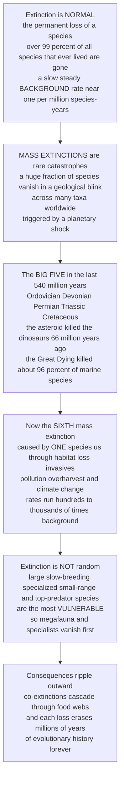

# 🦤 Extinction and the Sixth Mass Extinction

> [!abstract] TL;DR
> **Extinction** — the permanent loss of a species — is not a failure of nature but its **default outcome**: more than **99% of all species that ever lived are already gone**, and every lineage eventually meets the same fate. This happens continuously at a slow, steady **background rate** (roughly **1 extinction per million species-years**) as species are outcompeted, fail to adapt, or are unlucky. What is *not* normal are **mass extinctions** — rare, catastrophic episodes when a huge fraction of all species vanish in a geological blink, driven by a **planetary shock** (an asteroid, continent-scale volcanism, runaway climate and ocean change). Earth has suffered **five** of these — the **"Big Five"** — in the last 540 million years: the most famous is the **asteroid** that ended the non-avian dinosaurs 66 Ma (the **K-Pg**), and the most severe is the **"Great Dying"** 252 Ma, which killed **~96% of marine species** and nearly ended complex life. The alarming part: the evidence increasingly shows we are living through the **sixth** — the first ever driven not by a rock or a volcano but by **one species, us**. Modern extinction rates run **~100–1,000× the background**, and could rival the Big Five within centuries. And extinction is **non-random**: **large-bodied, slow-breeding, specialized, small-ranged, high-trophic** species go first — which is why megafauna and specialists vanish before weeds and rats. Worse, extinction **cascades** (co-extinctions unravel food webs) and **erases millions of years of unique evolutionary history forever**. This distinction — normal background loss versus rare planetary catastrophe, and our accidental authorship of the latter — is the sobering heart of conservation.

---

## Intuition

**Analogy — the graveyard of life is enormous, but the tombstones usually arrive one at a time.** Imagine the history of life as a vast, ancient cemetery. Walk through it and you find that **almost everything that ever lived is buried here** — trilobites, ammonites, giant dragonflies, sabre-tooth cats, the dodo. More than **99 of every 100 species** that have ever existed are in the ground. Extinction is not the exception; it is the **ultimate fate of nearly every lineage**. In normal times, the tombstones arrive slowly and steadily — a species here, a species there — as they lose to competitors, fail to keep up with a changing world, or simply get unlucky. That slow drip is the **background rate**, and it has ticked along for hundreds of millions of years, roughly balanced by new species being born.

Now imagine a day when, instead of the usual quiet drip, **whole sections of the cemetery fill up at once** — a catastrophic burst of burials packed into a geological instant. That is a **mass extinction**, and it takes a planet-scale disaster to cause one: an **asteroid** slamming into Earth, **volcanoes** erupting across an area the size of a continent, oceans losing their oxygen, the climate lurching. It has happened **five** times in the last 540 million years — the **Big Five**. One buried the dinosaurs (a six-mile asteroid, 66 million years ago). The worst, the **"Great Dying"** 252 million years ago, buried **19 of every 20 marine species** and came within a whisker of resetting complex life to zero.

Here is the part that should keep you up at night. Look at the newest section of the cemetery — **the one being dug right now** — and the burials are coming **hundreds to thousands of times faster** than the background drip. This time there is no asteroid and no supervolcano. The cause is a **single species** wielding chainsaws, ships, guns, and a warming atmosphere: **us**. And the graves are not being filled at random. The **big, slow, picky, and rare** go first — the tiger before the rat, the orchid before the dandelion, the top predator before the weed. Pull one of those species out and others that depended on it can follow (**co-extinction**), and every grave erases a branch of the tree of life that took **millions of years to grow and will never grow back**. Understanding this — the normal drip, the rare catastrophes, who dies first, and why we are now the sixth catastrophe — is the whole moral weight of conservation.

---

## How It Works

### Core mechanics

1. **Extinction is the norm, not the anomaly.** A species goes **extinct** the moment its **last individual dies**. Given deep time, this is the near-universal endpoint: **>99%** of all species that have ever lived are extinct, and the average species persists only ~1–10 million years. There are shades of loss: **local extirpation** (a population wiped out in one place but surviving elsewhere), **ecological/functional extinction** (so few individuals remain that the species no longer plays its role in the ecosystem — e.g., too rare to matter), and **global/true extinction** (gone everywhere, forever).

2. **The background rate is the baseline drip.** Absent catastrophe, species are lost at a slow, steady pace — the **background extinction rate**, conventionally measured in **extinctions per million species-years (E/MSY)**. The canonical estimate is **~0.1–2 E/MSY** (roughly *one* species lost per million species each year). It is driven by ordinary forces: **competition**, gradual **environmental change**, **coevolutionary arms races**, and plain **bad luck** (small ranges hit by a local disaster). Over the long run this loss is roughly **balanced by origination** (speciation), so total diversity turns over — the **taxonomic turnover** engine.

3. **Mass extinctions are rare, sharp, global, and broad.** A **mass extinction** is a brief interval in which **a large fraction of species is lost, across many unrelated taxa, worldwide** — the extinction rate spikes far above background. The classic operational definition (**Raup & Sepkoski 1982**): statistically extraordinary peaks in the marine genus/family extinction rate rising above the "normal" range. They require a **planetary-scale forcing** because only such a shock can hammer many independent lineages at once.

4. **The Big Five (last ~540 Myr).** In order: **End-Ordovician (~444 Ma)** — glaciation and sea-level fall; **Late Devonian (~372 Ma)** — anoxia, cooling; **End-Permian / Permian–Triassic (~252 Ma)** — the **"Great Dying,"** the worst, **~96% of marine species** lost, triggered by the **Siberian Traps** flood-basalt volcanism, CO₂-driven warming, ocean acidification and anoxia; **End-Triassic (~201 Ma)** — Central Atlantic volcanism; **End-Cretaceous / K-Pg (~66 Ma)** — the **Chicxulub asteroid impact** (with Deccan Traps volcanism) that ended the non-avian dinosaurs. Common culprits recur: **bolide impact, flood-basalt volcanism, rapid climate change, ocean acidification, and anoxia**.

5. **Catastrophe also creates.** Mass extinctions **remove dominant groups and vacate ecological niches**, clearing the stage for survivors to **radiate**. The K-Pg extinction of the dinosaurs opened the world to the **mammalian radiation** (and, eventually, us). So extinction is not only destruction — it **resets and redirects** the trajectory of life, on a recovery timescale of **millions of years**.

6. **The sixth is different — one species is the asteroid.** Current rates are estimated at **~100–1,000× (some say up to 10,000×) background**, satisfying the trajectory of a mass extinction if sustained. Uniquely, the driver is **a single species — humans** — through the **HIPPO** stressors: **H**abitat loss, **I**nvasive species, **P**ollution, **P**opulation/human overpopulation, and **O**verharvesting, now amplified by **anthropogenic climate change**. Signals include **"biological annihilation"/defaunation** (mass population declines, e.g. the **Living Planet Index** showing large average vertebrate population drops), and **extinction debt** — species already doomed by past habitat loss but **not yet gone** (a lag between the damage and the death).

7. **Extinction is selective, and it cascades.** Risk is **non-random**: **large body size, low reproductive rate (K-strategy), habitat specialization, small geographic range/rarity, high trophic level, poor dispersal, and island endemism** all raise the odds — which is why **megafauna and specialists die first**. And losses **propagate**: **co-extinction** (a parasite dies with its host, a specialist pollinator with its plant) and **trophic cascades** unravel food webs, while each extinction **prunes the tree of life**, erasing unique **phylogenetic and functional diversity** irreversibly.

### Flow



---

## Key Concepts

### Secondary — extinction, and why big animals die first

- **Extinction = gone forever.** A species is **extinct** when its **last member dies**. It cannot come back. Examples: the **dodo**, the **passenger pigeon**, the **woolly mammoth**, the **thylacine** (Tasmanian tiger).
- **It is normal — mostly.** Over the history of life, **more than 99% of all species have gone extinct**. Species are lost slowly and steadily at the **background rate**, roughly balanced by new species evolving.
- **Mass extinctions are the rare disasters.** Five times in the last 540 million years, a **huge fraction of all species died at once** — the **Big Five**. The most famous was the **asteroid** that killed the dinosaurs. The worst, the **"Great Dying,"** killed about **96% of ocean species**.
- **We may be causing the sixth.** Today species are disappearing **hundreds to thousands of times faster** than normal — this time because of **humans** (cutting down forests, hunting, pollution, invasive species, climate change).
- **Extinction is not random.** **Big, slow-breeding, fussy, and rare** animals go first — a tiger is far more likely to vanish than a rat, a panda before a pigeon.

### Undergraduate — rates, the Big Five, and vulnerability traits

- **Measuring extinction: E/MSY.** The **background rate** is expressed as **extinctions per million species-years** — canonically **~0.1–2 E/MSY**. Modern rates for well-studied groups (mammals, birds, amphibians) run **~100× or more** above this, and rise further if you include **committed** (debt) extinctions.
- **Extinction vs origination (turnover).** Diversity through time reflects the **balance of speciation and extinction**. When extinction spikes above origination, standing diversity crashes; recovery requires renewed **radiation** into vacated niches — see [[Speciation_and_Macroevolution]].
- **The Big Five and their causes.** End-Ordovician (glaciation/sea-level), Late Devonian (anoxia), **End-Permian** (Siberian Traps volcanism → warming, acidification, anoxia — **~96% marine species**), End-Triassic (volcanism), **End-Cretaceous / K-Pg** (**Chicxulub asteroid** + Deccan volcanism). Recurring kill mechanisms: **impact, flood-basalt volcanism, rapid climate change, ocean acidification, anoxia** — see [[Mass_Extinctions_and_Paleoclimate]].
- **Extinction selectivity — the vulnerable profile.** Risk rises with **large body size**, **low reproductive rate / slow life history (K-strategists)**, **habitat specialization**, **small geographic range and rarity**, **high trophic level** (top predators), **poor dispersal**, and **island endemism**. Together these explain the **megafauna-first** and **specialist-first** patterns of both past and present extinctions.
- **The sixth extinction, quantified.** **Ceballos et al. (2015)** show that even under *conservative* assumptions, modern vertebrate extinction rates are **tens to hundreds of times** the background — the number of species lost since 1900 would, at background rates, have taken **thousands of years**. This is the empirical case that the sixth mass extinction is **already underway**.
- **Extinction debt.** Habitat destruction condemns species that are **not yet extinct** — a small, isolated population may be "**living dead**," doomed to wink out over the coming decades. Present extinction counts therefore **underestimate** the eventual toll.

### Graduate — kill curves, debt dynamics, and phylogenetic loss

- **The extinction-rate spectrum (Raup's "kill curve").** Plotting genus/species extinction intensity against recurrence interval yields a continuum from constant background loss to rare catastrophic peaks; the **Big Five** are the extreme tail. This reframes "mass extinctions" as the upper end of a **single distribution** rather than a separate phenomenon — and lets us ask *where on that curve* the modern pulse sits.
- **Diagnosing a sixth mass extinction (Barnosky et al. 2011).** The rigorous test compares **modern extinction magnitude and rate** against the fossil-calibrated Big Five. Verdict: current *rates* already **exceed** those inferred for past mass extinctions, but the *magnitude* (fraction of species lost) is not yet Big-Five level — meaning we are **not there yet, but on the trajectory**, and could reach it within **~240–540 years** if threatened species vanish. The window to avoid it is the key policy insight.
- **Extinction-debt dynamics.** Debt follows from the **species–area relationship** and metapopulation theory: after habitat is reduced from $A_0$ to $A_1$, equilibrium richness falls as $S \propto A^{z}$, but the approach to the new, lower equilibrium is **delayed** by demographic and colonization lags. The **relaxation time** scales with generation time — so long-lived, slow species carry the **largest, slowest-paid debts**. This is the mechanism behind [[Anthropogenic_Climate_Change]]-driven *committed* extinctions.
- **Selectivity as a filter on the tree of life.** Because vulnerable traits (large size, slow life history, specialization) are often **phylogenetically clustered**, non-random extinction prunes **whole branches** rather than scattered twigs — disproportionately eroding **phylogenetic diversity (PD)** and **functional diversity**. The loss of an evolutionarily distinct, globally endangered (**EDGE**) species erases more unique history than the loss of a species with many close relatives.
- **Co-extinction and cascade topology.** In mutualistic and antagonistic networks, removing a **hub/keystone** species can trigger secondary extinctions that propagate through dependency links. **Nested** and **modular** network structure buffers some cascades but concentrates risk on **specialists** attached to hubs; the **order** of primary removals (e.g., most-connected first, as in defaunation of large frugivores) strongly shapes total collapse. Loss of **large-bodied seed dispersers and predators** is thus doubly damaging — they are both the most vulnerable *and* the most connected.
- **Defaunation and the "Anthropocene" signature.** Population-level collapse (**defaunation**; the Living Planet Index) *precedes* and *predicts* species extinction, and reshapes ecosystem function (seed dispersal, herbivory, carbon storage) long before the last individual dies — arguing that extinction risk should be assessed at the **population**, not just species, level.

---

## Python Demo

```python
# Extinction & the Sixth Mass Extinction — three views:
#   Panel 1  BACKGROUND vs MASS-EXTINCTION RATE through the Phanerozoic:
#            a low steady background punctuated by the Big Five spikes,
#            with the modern human-driven pulse rising far above (the incipient sixth)
#   Panel 2  EXTINCTION SELECTIVITY: extinction probability vs traits
#            (large / slow-breeding / specialized / small-range species are most at risk)
#   Panel 3  CO-EXTINCTION CASCADE: remove a hub species -> dependents wink out
import numpy as np
import matplotlib.pyplot as plt

rng = np.random.default_rng(7)

# ============================================================ Panel 1: rate through time
t = np.linspace(0, 540, 4000)                      # millions of years before present
background = 3.0 + 0.6 * np.sin(t / 35.0)          # low steady baseline (genera lost / Myr)

def spike(center, amp, width):                     # a mass-extinction pulse (Gaussian)
    return amp * np.exp(-0.5 * ((t - center) / width) ** 2)

big_five = {                                        # (age_Ma, amplitude): the Big Five
    "End-Ordovician": (444, 18, 5),
    "Late Devonian":  (372, 15, 7),
    "End-Permian":    (252, 34, 4),                # the Great Dying — the worst
    "End-Triassic":   (201, 17, 5),
    "K-Pg (asteroid)":( 66, 22, 4),
}
rate = background.copy()
for _, (c, a, w) in big_five.items():
    rate += spike(c, a, w)

# modern human-driven pulse: a sharp spike right at the present (t = 0)
modern = 45.0 * np.exp(-0.5 * ((t - 0.0) / 3.0) ** 2)
rate_modern = rate + modern

# ============================================================ Panel 2: selectivity
# Logistic extinction risk as a function of a standardized trait axis.
# For body size / slow reproduction / specialization: risk RISES with the trait.
# For range size: risk FALLS with the trait.
x = np.linspace(-3, 3, 200)                         # standardized trait value (z-score)
logistic = lambda z: 1 / (1 + np.exp(-z))
risk_bodysize = logistic(1.4 * x - 0.3)             # big-bodied  -> higher risk
risk_slowrepro = logistic(1.1 * x - 0.5)            # slow breeder -> higher risk
risk_special  = logistic(1.6 * x - 0.2)             # specialist   -> higher risk
risk_range    = logistic(-1.5 * x + 0.2)            # small range  -> higher risk (note sign)

# ============================================================ Panel 3: co-extinction cascade
# A small dependency network. An arrow prey -> consumer means the consumer
# depends on that resource. A node goes secondarily extinct when it loses ALL resources.
nodes = {                                            # name: (x, y=trophic level)
    "Fig tree":  (1.4, 0), "Grass": (3.2, 0),
    "Frugivore": (0.8, 1), "Beetle": (2.0, 1), "Grazer": (3.4, 1),
    "Wasp":      (0.4, 2), "Bird":  (1.6, 2), "Predator": (3.0, 2),
}
edges = [                                            # (resource -> dependent)
    ("Fig tree", "Frugivore"), ("Fig tree", "Beetle"), ("Fig tree", "Wasp"),
    ("Grass", "Grazer"),
    ("Frugivore", "Bird"), ("Beetle", "Bird"),
    ("Grazer", "Predator"), ("Bird", "Predator"),
]
def cascade(removed):
    """Iteratively remove any node that has lost ALL of its resources."""
    alive = {n for n in nodes if n not in removed}
    resources = {n: [r for r, d in edges if d == n] for n in nodes}
    changed = True
    dead = set(removed)
    while changed:
        changed = False
        for n in list(alive):
            deps = resources[n]
            if deps and all(r in dead for r in deps):   # every resource gone
                alive.discard(n); dead.add(n); changed = True
    return dead

primary = {"Fig tree"}                              # remove the keystone plant
dead = cascade(primary)
secondary = dead - primary

# =================================================================== plotting
fig, ax = plt.subplots(1, 3, figsize=(18, 5.4))

# Panel 1 — extinction rate through geological time (present on the RIGHT)
ax[0].fill_between(t, background, color="#9ecae1", alpha=0.7,
                   label="Background rate (steady baseline)")
ax[0].plot(t, rate, color="#08519c", lw=1.4, label="Fossil extinction rate")
ax[0].plot(t, rate_modern, color="#08519c", lw=1.4)
ax[0].fill_between(t, rate, rate_modern, where=(rate_modern > rate),
                   color="#e6550d", alpha=0.6, label="Modern human-driven pulse")
for name, (c, a, w) in big_five.items():
    ax[0].annotate(name, xy=(c, background[np.argmin(np.abs(t - c))] + a),
                   xytext=(c, background[np.argmin(np.abs(t - c))] + a + 6),
                   ha="center", fontsize=7, rotation=0,
                   arrowprops=dict(arrowstyle="-", color="0.4", lw=0.6))
ax[0].annotate("The SIXTH?\n(now, one species)", xy=(0, 48), xytext=(70, 52),
               fontsize=8, color="#a63603", fontweight="bold",
               arrowprops=dict(arrowstyle="->", color="#a63603"))
ax[0].set_xlim(540, -15)                             # reversed: deep past left, present right
ax[0].set_xlabel("Millions of years before present")
ax[0].set_ylabel("Extinction rate (genera lost per Myr)")
ax[0].set_title("Background vs mass extinctions\nthrough the Phanerozoic")
ax[0].legend(fontsize=7, loc="upper left"); ax[0].grid(alpha=0.25)

# Panel 2 — extinction selectivity / vulnerability
ax[1].plot(x, risk_bodysize,  lw=2.2, color="#b22222", label="Large body size")
ax[1].plot(x, risk_slowrepro, lw=2.2, color="#e8722c", label="Slow reproduction (K)")
ax[1].plot(x, risk_special,   lw=2.2, color="#6a0dad", label="Habitat specialization")
ax[1].plot(x, risk_range,     lw=2.2, color="#2e8b57", ls="--",
           label="Large geographic range")
ax[1].axhline(0.5, color="0.6", lw=0.8, ls=":")
ax[1].set_xlabel("Standardized trait value  (small  <-->  large)")
ax[1].set_ylabel("Probability of extinction")
ax[1].set_title("Extinction is NON-random\nbig, slow, specialized, small-range go first")
ax[1].legend(fontsize=7.5, loc="center left"); ax[1].grid(alpha=0.25)
ax[1].set_ylim(-0.03, 1.03)

# Panel 3 — co-extinction cascade
level_edge = {0: "#2e8b57", 1: "#d4a017", 2: "#b22222"}
for res, dep in edges:
    x0, y0 = nodes[res]; x1, y1 = nodes[dep]
    ax[2].annotate("", xy=(x1, y1), xytext=(x0, y0),
                   arrowprops=dict(arrowstyle="->", color="0.6", lw=1.1))
for name, (xn, yn) in nodes.items():
    if name in primary:
        fc, label = "black", f"{name}\n(REMOVED)"
    elif name in secondary:
        fc, label = "#d62728", f"{name}\n(co-extinct)"
    else:
        fc, label = level_edge[yn], name
    ax[2].scatter(xn, yn, s=1500, color=fc, edgecolor="black", zorder=3)
    ax[2].text(xn, yn, label, ha="center", va="center", fontsize=6.8,
               color="white" if name in dead else "black", fontweight="bold", zorder=4)
ax[2].set_ylim(-0.5, 2.5); ax[2].set_xlim(-0.1, 4.0)
ax[2].set_yticks([0, 1, 2]); ax[2].set_yticklabels(["Producers", "Consumers", "Top"], fontsize=8)
ax[2].set_xticks([])
ax[2].set_title(f"Co-extinction cascade\nremove 1 hub -> {len(secondary)} secondary extinctions")

plt.tight_layout()
plt.show()

# ---- console summary ----
peak_perm = rate[np.argmin(np.abs(t - 252))]
print(f"Background rate  ~ {background.mean():.1f} genera/Myr (steady baseline)")
print(f"End-Permian peak ~ {peak_perm:.0f} genera/Myr  (the Great Dying, worst of the Big Five)")
print(f"Modern pulse     ~ {rate_modern[np.argmin(np.abs(t-0))]:.0f} genera/Myr at the present")
print(f"Cascade: removing {primary} killed {sorted(secondary)} secondarily "
      f"({len(dead)}/{len(nodes)} species lost from one primary extinction)")
```

**Panel 1** is the money shot: a **low, steady background** hum of extinction runs across 540 million years, punctuated by **five sharp spikes** — the Big Five, with the **End-Permian "Great Dying"** towering above the rest — and then, at the present moment on the far right, a **fresh orange pulse** shoots up: the human-driven **incipient sixth**, already climbing toward Big-Five territory. **Panel 2** shows *selectivity*: extinction probability is a **logistic function of traits** — it **rises** steeply for large-bodied, slow-breeding, specialized species and **falls** with geographic range — so the curves cross the 50% line at very different places, which is *why* megafauna and specialists are the first to go. **Panel 3** makes co-extinction concrete: remove a single **keystone fig tree** and the wasp, frugivore, and beetle that depend on it — and then the bird that ate *them* — wink out in a chain, so **one primary extinction becomes several**. The printout quantifies each: the background rate, the Permian peak, the modern pulse, and the cascade toll.

---

## Real-World Applications

> **The IUCN Red List — turning extinction theory into a global triage system.** The **IUCN Red List of Threatened Species** classifies every assessed species (Least Concern → Near Threatened → Vulnerable → Endangered → Critically Endangered → **Extinct in the Wild** → **Extinct**) using exactly the selectivity logic above: **small population size, small/declining geographic range, and rate of decline** are the core criteria — precisely the traits that raise extinction risk. It is the backbone of conservation prioritization, CITES trade decisions, and national red lists, and its aggregate trend (the **Red List Index**) is a headline indicator that the sixth extinction is accelerating.

- **Living Planet Index & defaunation monitoring.** WWF/ZSL's **Living Planet Index** tracks thousands of vertebrate *populations* to quantify **defaunation** — the population collapse that *precedes* extinction. It operationalizes the graduate-level insight that extinction risk is best measured at the **population**, not just species, level, and it drives global biodiversity targets.
- **Megafauna and rewilding.** Because **large-bodied, slow-breeding** species are the most vulnerable *and* the most ecologically influential (seed dispersers, predators), conservation invests disproportionately in **megafauna** (elephants, rhinos, tigers, large marine predators) and in **rewilding** programs that restore them to reverse trophic downgrading.
- **Island conservation and invasive-species control.** **Island endemics** are extreme-risk (small range, naive to predators), and invasive rats, cats, and snakes have driven a huge share of recorded extinctions. Island **eradication programs** (removing invasive predators) are among conservation's highest-return interventions — a direct application of extinction-selectivity theory.
- **EDGE prioritization — saving evolutionary history.** The **EDGE of Existence** program (ZSL) ranks species by **E**volutionary **D**istinctiveness × **G**lobal **E**ndangerment, funding the tuatara, aye-aye, and pangolins precisely because their loss would erase the most **unique phylogenetic history** — the irreversibility argument made actionable.
- **Climate-driven "committed" extinctions.** Projections of extinction debt under warming (coral reefs, amphibians, alpine and polar specialists) inform climate policy and assisted-migration debates — connecting extinction risk to [[Anthropogenic_Climate_Change]].

---

## Common Pitfalls

- **"Extinction is unnatural / always a tragedy of human making."** Extinction is the **normal fate of nearly every lineage** — >99% of species are gone, most long before humans existed, at a slow **background rate**. The crisis is not that species go extinct, but that they are now going extinct **~100–1,000× faster** than that baseline. Conflating the two muddles the argument.
- **"Mass extinctions and background extinctions are different phenomena."** They sit on a **single continuum** of intensity (Raup's kill curve). Mass extinctions are the rare **upper tail**, not a separate process — which is exactly why the modern pulse can *grow into* one.
- **"We are already in the sixth mass extinction, full stop."** More precisely (**Barnosky 2011**): current *rates* already exceed the Big Five, but the *magnitude* (fraction of species lost) is **not yet** at the 75% threshold. We are **on the trajectory**, not at the destination — a distinction that matters because it means the outcome is **still preventable**.
- **"Extinction is random bad luck."** It is strongly **selective**. **Large, slow-breeding, specialized, small-range, high-trophic** species are systematically more vulnerable. Treating extinction as random leads to badly miscalibrated conservation priorities.
- **"If a species still exists, it's safe."** **Extinction debt** means many surviving species are already the **"living dead,"** doomed by past habitat loss but not yet gone. Current extinction counts therefore **understate** the committed toll, and delay creates false comfort.
- **"Losing one species just subtracts one species."** Extinction **cascades** (co-extinction, unraveling food webs) and erases the entire **evolutionary branch** the species represents — millions of years of unique genetic and functional diversity — **irreversibly**. The true cost is far larger than one line on a list.
- **"Recovery will bounce back quickly once we stop the damage."** Post-mass-extinction recovery in the fossil record takes **millions of years**. On human timescales, the losses are effectively **permanent**.

---

## Related Concepts

- [[Mass_Extinctions_and_Paleoclimate]] — the **Earth-Science / deep-time** companion to this note: the geological evidence, dating, and paleoclimatic *kill mechanisms* (Siberian and Deccan Traps, Chicxulub, anoxia, acidification) behind the Big Five. This note supplies the **ecology/present-crisis** view; that one supplies the paleo view.
- [[Biodiversity_and_Conservation]] — the Biology-vault overview of biodiversity's value and the threats to it; extinction is the **terminal, irreversible endpoint** of the biodiversity loss that note surveys.
- [[Speciation_and_Macroevolution]] — extinction's counterweight: diversity through time is the **balance of speciation and extinction**, and mass extinctions clear niches that fuel post-catastrophe **adaptive radiations**.
- [[Anthropogenic_Climate_Change]] — a principal driver of the sixth extinction and of **committed (debt) extinctions**; the planetary forcing that most resembles the climate/ocean shocks behind past mass extinctions.
- [[Food_Webs_and_Trophic_Dynamics]] — the network substrate of **co-extinction and trophic cascades**: why removing high-trophic, highly connected species triggers secondary extinctions and unravels communities.

Within this vault, this note is the sobering capstone of the biodiversity section, and it leans on several siblings covered elsewhere here. *Conservation_Biology_and_the_Biodiversity_Crisis* frames the sixth extinction as the crisis the whole discipline exists to fight (the HIPPO drivers). *Habitat_Loss_Fragmentation_and_Island_Biogeography* supplies the species–area relationship and island dynamics that generate **extinction debt** and make island endemics so vulnerable. *Population_Viability_and_Small_Population_Biology* explains *why* small, rare populations slide to extinction (stochasticity, extinction vortices) — the mechanism beneath the selectivity curves. *Life_History_Strategies_and_Demography* provides the **K-strategist / slow-life-history** traits that make large, slow-breeding species the first casualties. And *Climate_Change_Ecology* details the warming-driven range shifts and committed extinctions that push species over the edge.

---

## Review Questions

1. **(Secondary)** More than 99% of all species that have ever lived are extinct, yet scientists are alarmed about extinction today. Explain the difference between the **background extinction rate** and a **mass extinction**, and say why the current situation is considered a genuine crisis rather than "just nature taking its course."
2. **(Undergraduate)** Two species live in the same threatened forest: a large, slow-breeding, fruit-specialist monkey with a tiny range, and a small, fast-breeding, generalist rodent found across the continent. (a) Which is at higher extinction risk, and name **four traits** driving that difference. (b) If the monkey is also the main disperser of several tree species, what *additional* extinction phenomenon does its loss risk, and why does that make its extinction cost more than "one species"?
3. **(Graduate)** A colleague claims "we are definitely in the sixth mass extinction." Using the framework of **Barnosky et al. (2011)**, refine this statement by distinguishing extinction **rate** from **magnitude**, explain where the modern pulse sits relative to the Big Five on each axis, and discuss how **extinction debt** and **selectivity-driven loss of phylogenetic diversity** affect both the true current toll and the projected time to reach Big-Five magnitude.

---

## Sources

- Barnosky, A. D., Matzke, N., Tomiya, S., et al. (2011). "Has the Earth's sixth mass extinction already arrived?" *Nature*, 471, 51–57. — the rigorous rate-vs-magnitude test comparing the modern pulse to the fossil-calibrated Big Five.
- Ceballos, G., Ehrlich, P. R., Barnosky, A. D., et al. (2015). "Accelerated modern human-induced species losses: Entering the sixth mass extinction." *Science Advances*, 1(5), e1400253. — the conservative estimate that modern vertebrate extinction rates are ~100× background.
- Raup, D. M., & Sepkoski, J. J. (1982). "Mass extinctions in the marine fossil record." *Science*, 215(4539), 1501–1503. — the foundational statistical identification of the Big Five from the marine record.
- Kolbert, E. (2014). *The Sixth Extinction: An Unnatural History.* Henry Holt. — the Pulitzer-winning synthesis of the modern extinction crisis for a general audience.
- Ceballos, G., Ehrlich, P. R., & Dirzo, R. (2017). "Biological annihilation via the ongoing sixth mass extinction signaled by vertebrate population losses and declines." *PNAS*, 114(30), E6089–E6096. — the defaunation/population-decline evidence underlying the crisis.

---

#ecology #extinction #mass-extinction #sixth-extinction #extinction-risk
