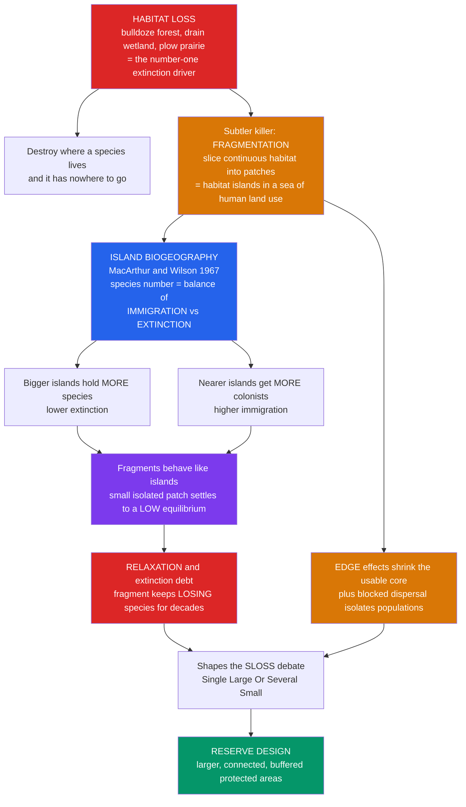

# 🌳 Habitat Loss, Fragmentation, and Island Biogeography

> [!abstract] TL;DR
> **Habitat loss** — bulldozing forests, draining wetlands, plowing prairies — is the **single largest driver of extinction**: destroy where a species lives and it has nowhere to go. But a subtler killer is **fragmentation**: slicing continuous habitat into scattered **patches** turns a landscape into "habitat islands" in a sea of human land use. The **Theory of Island Biogeography** (MacArthur & Wilson, 1967) gives a precise rule for how many species an island holds — a dynamic **equilibrium** between **immigration** and **extinction**, governed by island **size** (bigger = more species) and **isolation** (nearer = more colonists). Because habitat fragments behave like islands, the theory predicts that a small, isolated patch will inexorably shed species down to a lower equilibrium — a decades-long bleed called **relaxation** (extinction debt). Add **edge effects** and blocked dispersal, and fragmentation becomes lethal. This science shaped the **SLOSS debate** and the whole practice of **reserve design**.

---

## Intuition

**Analogy:** Imagine a species as a household that can only live in one kind of neighborhood — a certain forest. **Habitat loss** is demolishing the neighborhood outright: the residents are simply evicted with nowhere to relocate, and they die out. That is the number-one cause of extinction, and it is brutally simple. But now imagine we *don't* flatten the whole neighborhood — we just run highways, farms, and towns through it until the once-continuous forest survives only as scattered blocks separated by hostile ground. We have created an **archipelago of habitat islands**, and islands obey rules.

Here is the beautiful, powerful insight. On a real island in the ocean, the number of species you find is not random — it settles at a balance between new arrivals drifting in (**immigration**) and residents winking out (local **extinction**). Two things dominate that balance: **size** (a big island holds more species than a small one) and **isolation** (an island near the mainland gets more colonists than a remote one). MacArthur and Wilson turned this into an exact theory. The revolutionary leap for conservation was realizing that a **fragment of forest is an island too** — surrounded not by water but by a "sea" of cropland and pavement. So the theory *predicts* fragment biodiversity: a small, cut-off patch holds fewer species and, worse, keeps *losing* them for decades after it is isolated, drifting down to a poorer new equilibrium — a slow hemorrhage called **relaxation**, the "extinction debt" a landscape owes but has not yet paid. Fragmentation compounds the harm three ways: shrinking patches hold **smaller, more vulnerable populations**; isolation **blocks the dispersal** that lets populations rescue one another; and every patch develops an **edge** — hotter, drier, windier, more invaded than the interior — that eats away the usable "core." Understand habitat loss, fragmentation, and the island-biogeography rules and you understand both the leading cause of the extinction crisis and the science of how to design protected areas to fight it.

---

## How It Works

### Core Mechanics

1. **Habitat loss is destruction of the place itself.** Deforestation, agriculture, urbanization, wetland drainage, and dam-building convert natural habitat into human land use. Because a species' persistence depends on the area of suitable habitat, loss translates directly into extinction through the **species-area relationship** `S = c·A^z`: shrink `A` and the number of species `S` the land can hold falls. It is the largest single contributor to the biodiversity crisis.

2. **Degradation vs conversion vs outright loss.** Habitat can be *lost* (paved over), *converted* (forest to pasture — usable by a few generalists, not the specialists it displaced), or merely *degraded* (still standing but polluted, grazed, or invaded so its carrying capacity drops). All three erode biodiversity; only the first is visible from a satellite as "bare ground."

3. **Fragmentation is the breaking of continuity.** Even when total area is only *partly* reduced, carving one continuous expanse into many small, separated **patches** imposes new, independent harms: reduced patch **size**, increased **isolation**, and expanded **edge**.

4. **Island biogeography sets the equilibrium.** For any patch or island, immigration of new species **declines** as the patch fills up (fewer unrepresented species remain to arrive) while local extinction **rises** with the number of species present (more species, more that can wink out, and more crowding). Where the two curves cross is the equilibrium species number `S*`. **Isolation** lowers the immigration curve (fewer colonists reach a distant patch → lower `S*`); small **size** raises the extinction curve (small populations die out faster → lower `S*`). At equilibrium, species identity keeps **turning over** even though the count is roughly stable.

5. **Fragments relax to a lower equilibrium.** A freshly isolated fragment starts with the species richness of the once-continuous forest — but that is *above* its new island equilibrium. So it bleeds species over years to decades toward `S*`, a process called **faunal relaxation**. The gap between current richness and eventual equilibrium is the **extinction debt**: species still present but already doomed.

6. **Edge effects shrink the usable core.** A patch's perimeter is exposed to the matrix — more light, wind, and temperature swings, plus invasive species and predators penetrating inward. As patches shrink, the **perimeter-to-area ratio** climbs, so edge-influenced habitat claims a larger fraction and intact **core** habitat shrinks faster than area alone — a small patch can be *all edge, no core*.

7. **Design follows from theory.** Larger reserves, reserves connected by **corridors** and **stepping stones**, and buffer zones all fall out of "patches are islands." So does the historic **SLOSS debate** — one **S**ingle **L**arge **O**r **S**everal **S**mall reserves of equal total area.

### Flow / Architecture



---

## Key Concepts

### Secondary (intuitive foundations)

- **Habitat loss.** Destroying the natural home of a species — clearing forest, filling a marsh, turning grassland into a parking lot. It is the biggest reason species go extinct, because they simply have nowhere left to live.
- **Fragmentation.** Cutting a big continuous habitat into small, separated pieces with roads, farms, and towns in between. The pieces become like islands.
- **Bigger and nearer hold more.** A large habitat patch holds more kinds of animals and plants than a small one, and a patch close to a big source of wildlife gets more newcomers than a remote one.
- **Edge.** The outer rim of a patch is hotter, windier, and drier than its interior, and more open to weeds and predators. Small patches are mostly edge, leaving little safe "core."
- **Islands lose species slowly.** When a patch is first cut off it still has all its old species, but over the years it slowly loses the ones it can no longer support — like a savings account being drained.

### Undergraduate (the models)

- **Species-area relationship (SAR).** `S = c·A^z`, or `log S = log c + z·log A`. The exponent `z` is typically **0.15–0.35** for habitat patches. It quantifies extinction from habitat loss: reducing area to a fraction `f` retains a fraction `f^z` of species, so **losing 90% of area (`f = 0.1`) keeps only `0.1^z` — roughly half the species** for a mid-range `z`.
- **MacArthur–Wilson equilibrium model.** Immigration rate `I(S)` **falls** with the number of species already present; extinction rate `E(S)` **rises** with it. The equilibrium `S*` is where `I(S*) = E(S*)`. With linear rates `I = I_max·(1 − S/P)` and `E = E_max·(S/P)` for a species pool `P`, `S* = P·I_max /(I_max + E_max)`. **Distance** shrinks `I_max` (fewer colonists → lower `S*`); small **area** raises `E_max` (faster local extinction → lower `S*`).
- **Turnover.** At equilibrium the *count* is stable but *composition* changes: species continually colonize and go locally extinct. Turnover is the dynamic signature the theory predicts and field studies (e.g. defaunation experiments) confirm.
- **Faunal relaxation and extinction debt.** After isolation, richness decays toward the fragment's lower `S*`, often modeled as `S(t) = S_eq + (S_0 − S_eq)·e^(−t/τ)`. The **relaxation time `τ`** is longer for larger fragments and long-lived taxa; the still-unpaid loss `S_0 − S_eq` is the **extinction debt**.
- **Edge effects and core area.** For a square patch of area `A` and edge-penetration depth `d`, interior **core** ≈ `(√A − 2d)²`. Core fraction collapses as `A` shrinks, and below `A = (2d)²` a patch has **zero** core — pure edge.
- **SLOSS.** Given a fixed total area, **S**ingle **L**arge reserves usually maximize core habitat, wide-ranging species, and per-patch persistence; **S**everal **S**mall reserves spread risk, capture more habitat *types* and beta-diversity, and hedge against a single catastrophe. The "right" answer is taxon- and landscape-dependent.

### Graduate (structure, extensions, and application)

- **Fragmentation per se vs habitat amount.** Fahrig's synthesis distinguishes the effect of *breaking up* habitat (number/isolation of patches) from the effect of *losing* habitat *amount*. Empirically, total habitat amount usually dominates, and fragmentation-per-se effects are frequently weak or even positive — a live debate (the "habitat amount hypothesis") with major reserve-design implications.
- **Matrix quality and functional connectivity.** The inter-patch "sea" is not uniformly hostile. A permeable matrix (shade coffee, secondary regrowth) lets species move and forage, so functional connectivity and effective isolation depend on matrix composition, not just Euclidean distance. This softens strict island analogies.
- **Metapopulation coupling.** Island biogeography (species-level equilibrium on a patch) and metapopulation theory (single-species patch occupancy) are complementary lenses on the same fragmented landscape; **metapopulation capacity** `λ_M` extends the area-and-isolation logic to spatially explicit patch networks.
- **Edge as a driver of Amazonian fragment dynamics.** The Biological Dynamics of Forest Fragments Project (Laurance, Lovejoy et al.) showed edge-driven tree mortality, biomass collapse, microclimate change, and altered animal communities penetrating 100+ m into fragments — edge effects can dominate the entire biological response.
- **Reserve-design principles and their critique.** Diamond's rules (larger, rounder, clustered, connected reserves) drew directly on island biogeography; Simberloff and others critiqued their empirical footing (the SLOSS controversy), pushing the field toward evidence-based, taxon-specific, connectivity-aware design and landscape-scale conservation planning (systematic conservation planning, Marxan).
- **Extinction debt as policy risk.** Because relaxation lags fragmentation by decades, present-day species lists overstate viability. Managers must model committed extinctions, not just current occupancy, and target restoration to *pay down* debt (reconnect, enlarge, buffer) before it is realized.

---

## Python Demo

```python
# Habitat loss and island biogeography, four ways:
#   (a) SPECIES-AREA RELATION S = c*A^z  -> extinction from habitat loss
#   (b) MacARTHUR-WILSON equilibrium     -> size & isolation set S*
#   (c) SLOSS + EDGE core area           -> one large vs several small
#   (d) FAUNAL RELAXATION                -> fragment bleeds species over time
import numpy as np
import matplotlib.pyplot as plt

fig, ax = plt.subplots(2, 2, figsize=(13, 10))

# ----------------------------------------------------------------------
# (a) SPECIES-AREA RELATIONSHIP: S = c * A^z ; habitat loss -> species loss
# ----------------------------------------------------------------------
A = np.linspace(1, 1000, 500)          # habitat area (arbitrary units)
c = 5.0
for z, col in [(0.15, "#059669"), (0.25, "#2563eb"), (0.35, "#dc2626")]:
    S = c * A ** z
    ax[0, 0].plot(A, S, color=col, lw=2, label=f"z = {z}")
# quantify: lose 90% of area (keep fraction f = 0.1) -> keep f^z of species
for z in (0.15, 0.25, 0.35):
    kept = 0.10 ** z
    print(f"z={z}: losing 90% of area keeps {kept*100:4.1f}% of species "
          f"({(1-kept)*100:4.1f}% lost)")
ax[0, 0].set_title("(a) Species-area relation: shrinking habitat sheds species")
ax[0, 0].set_xlabel("habitat area  A"); ax[0, 0].set_ylabel("species richness  S")
ax[0, 0].legend(); ax[0, 0].grid(alpha=0.3)

# ----------------------------------------------------------------------
# (b) MacARTHUR-WILSON: I(S) falls, E(S) rises; S* where they cross.
#     Near island -> higher immigration; large island -> lower extinction.
# ----------------------------------------------------------------------
P = 100.0                               # mainland species pool
S = np.linspace(0, P, 400)
I_near, I_far = 1.0, 0.5                # immigration intercepts (isolation)
E_small, E_large = 1.0, 0.5            # extinction slopes (island size)
imm = {"near": I_near * (1 - S / P), "far": I_far * (1 - S / P)}
ext = {"small": E_small * (S / P),    "large": E_large * (S / P)}
ax[0, 1].plot(S, imm["near"], "#059669", lw=2, label="immigration: NEAR")
ax[0, 1].plot(S, imm["far"],  "#059669", lw=2, ls="--", label="immigration: FAR")
ax[0, 1].plot(S, ext["small"],"#dc2626", lw=2, label="extinction: SMALL")
ax[0, 1].plot(S, ext["large"],"#dc2626", lw=2, ls="--", label="extinction: LARGE")
# equilibria S* = P * I_max / (I_max + E_max) -- big+near is richest
for Imax, Emax, name in [(I_near, E_large, "large+near"),
                         (I_far, E_small, "small+far")]:
    Sstar = P * Imax / (Imax + Emax)
    ax[0, 1].axvline(Sstar, color="#7c3aed", ls=":", alpha=0.7)
    ax[0, 1].annotate(f"S*={Sstar:.0f}\n{name}", (Sstar, 0.55),
                      fontsize=8, ha="center", color="#7c3aed")
ax[0, 1].set_title("(b) MacArthur-Wilson: size & isolation set the equilibrium")
ax[0, 1].set_xlabel("species present  S"); ax[0, 1].set_ylabel("rate")
ax[0, 1].legend(fontsize=8); ax[0, 1].grid(alpha=0.3)

# ----------------------------------------------------------------------
# (c) SLOSS + EDGE: split a fixed total area into n equal square patches.
#     Core of one square = (sqrt(area) - 2d)^2 ; edge depth d fixed.
#     Total core across n patches shows the single-large advantage.
# ----------------------------------------------------------------------
A_total, d = 400.0, 2.0
n_patches = np.arange(1, 41)
side = np.sqrt(A_total / n_patches)
core_side = np.maximum(side - 2 * d, 0.0)
total_core = n_patches * core_side ** 2         # summed interior habitat
ax[1, 0].plot(n_patches, total_core, "o-", color="#2563eb", lw=2, ms=4)
ax[1, 0].axhline(total_core[0], color="#059669", ls="--",
                 label=f"single large: core={total_core[0]:.0f}")
ax[1, 0].set_title("(c) SLOSS + edge: fragmenting equal area erodes core habitat")
ax[1, 0].set_xlabel("number of patches (fixed total area)")
ax[1, 0].set_ylabel("total interior 'core' area")
ax[1, 0].legend(); ax[1, 0].grid(alpha=0.3)

# ----------------------------------------------------------------------
# (d) FAUNAL RELAXATION: S(t) = S_eq + (S0 - S_eq)*exp(-t/tau).
#     A fresh fragment starts rich (S0) and decays to its island S_eq.
# ----------------------------------------------------------------------
t = np.linspace(0, 100, 400)            # years since isolation
S0 = 80
for S_eq, tau, col, lab in [(55, 40, "#059669", "large fragment"),
                            (35, 22, "#d97706", "medium fragment"),
                            (18, 12, "#dc2626", "small fragment")]:
    St = S_eq + (S0 - S_eq) * np.exp(-t / tau)
    ax[1, 1].plot(t, St, color=col, lw=2, label=f"{lab} (S_eq={S_eq})")
    ax[1, 1].axhline(S_eq, color=col, ls=":", alpha=0.5)
ax[1, 1].axhline(S0, color="grey", ls="--", alpha=0.6, label="pre-isolation S0")
ax[1, 1].set_title("(d) Relaxation: fragments bleed species toward a lower S_eq")
ax[1, 1].set_xlabel("years since isolation"); ax[1, 1].set_ylabel("species richness")
ax[1, 1].legend(fontsize=8); ax[1, 1].grid(alpha=0.3)

plt.tight_layout()
plt.savefig("habitat_loss_island_biogeography.png", dpi=120)
print("single-large core:", round(total_core[0], 1),
      " | ten-small core:", round(total_core[9], 1))
```

Panel (a) turns habitat loss into a number: with `z ≈ 0.25`, wiping out 90% of area still leaves only about **56%** of the species — and for `z = 0.35` it drops to ~**45%**, so roughly *half* the biota is committed to extinction by losing nine-tenths of the land. Panel (b) reproduces the MacArthur–Wilson crossing: the richest equilibrium is the **large, near** island (high immigration, low extinction), the poorest is **small, far**. Panel (c) shows why single-large usually wins on interior habitat — chopping a fixed area into many small squares multiplies edge and drains total **core** toward zero. Panel (d) is the slow tragedy of **relaxation**: every fragment starts with the old richness `S0` and bleeds down to its island equilibrium `S_eq`, smaller fragments falling further and faster — the extinction debt being paid.

---

## Real-World Applications

- **Biological Dynamics of Forest Fragments Project (Amazon, Brazil).** The world's largest fragmentation experiment (Laurance, Lovejoy et al.) deliberately isolated 1-, 10-, and 100-hectare rainforest plots. Results are textbook island biogeography in action: smaller fragments lost more species, relaxation continued for decades, and **edge effects** (tree death, wind damage, microclimate shifts, invasive penetration) reached 100+ m inward — direct evidence that fragment area *and* edge govern biodiversity.
- **Barro Colorado Island (Panama).** When Gatún Lake formed during Panama Canal construction, a hilltop became an island. Over the following decades it lost dozens of bird species with no compensating colonization — one of the earliest documented cases of **faunal relaxation** on a real, involuntarily created habitat island.
- **Wildlife corridors and reserve networks.** Yellowstone-to-Yukon, highway wildlife overpasses, and hedgerow networks are island biogeography operationalized: raise the effective immigration rate and lower isolation so fragmented reserves behave like a larger, connected system rather than doomed small islands.
- **National-park design and the SLOSS debate.** Whether to gazette one large park or several small reserves of equal area shaped decades of conservation planning, from African savanna reserves to marine protected-area networks. Modern **systematic conservation planning** (e.g. Marxan) formalizes the trade-off with algorithms balancing area, connectivity, cost, and representation.
- **Sky islands and montane specialists.** Cool mountaintop habitats (American pika talus, tropical cloud forests, alpine meadows) are natural islands separated by warm lowlands. Warming shrinks and isolates them further, so recolonization fails and high-elevation communities relax toward extinction — climate-change fragmentation with no matrix to cross.

---

## Common Pitfalls

- **Conflating fragmentation with habitat loss.** They are distinct: *loss* removes area (nearly always harmful), while *fragmentation per se* breaks the same area into pieces (effects are weaker, context-dependent, sometimes positive). Blaming "fragmentation" for what is really *amount* loss misdirects management — the priority is usually protecting total habitat area.
- **Reading a species list as viability.** Because of **extinction debt**, a fragment can still contain species that are already committed to loss and will vanish over coming decades. A present-day survey overstates health; you must model relaxation, not just count what is there today.
- **Ignoring the matrix.** Island biogeography's clean "hostile sea" assumption rarely holds on land. A permeable matrix (regrowth, agroforestry) lets species move and forage, so two maps with identical patch geometry can differ enormously in real isolation. Manage the matrix, not only the patches.
- **Applying Diamond's reserve rules dogmatically.** "Single large is always best" and the geometric design rules were critiqued in the SLOSS controversy for weak empirical support. The right configuration depends on the target taxa, the threats (disease, fire, invasion favor several small for risk-spreading), and habitat heterogeneity.
- **Forgetting edge scaling.** Halving a patch's area more than halves its **core**, because perimeter-to-area ratio rises. Conservation targets stated as raw area can be met while the *usable interior* collapses — small patches can be entirely edge.
- **Assuming turnover means failure.** At equilibrium, species identity naturally changes even as richness holds steady. Observing local extinctions is not automatically a management failure; the question is whether colonization keeps pace — which is exactly what connectivity provides.

---

## Related Concepts

- [[Biodiversity_and_Species_Richness]] — the species-area relationship and richness patterns that habitat loss and fragmentation directly erode; this note is the "what threatens richness" companion.
- [[Community_Ecology_and_Species_Interactions]] — fragmentation dismantles interaction networks (pollination, seed dispersal, predation) as core habitat and connectivity are lost.
- [[Predator_Prey_and_Population_Interactions]] — edge effects and small isolated patches reshape predator access and prey refuge, altering the dynamics that keep communities balanced.
- [[Ecosystem_Services]] — the intact-core habitat that fragmentation destroys is exactly where many regulating and provisioning services are generated.
- [[Biodiversity_and_Conservation]] — the Biology-vault overview of the biodiversity crisis for which habitat loss is the leading cause.
- [[Population_Ecology]] — smaller fragments hold smaller populations, raising the local extinction rate that drives island equilibria downward.
- [[Community_Ecology]] — island biogeography is a community-level equilibrium theory; species turnover and richness are community properties.
- [[Network_Science_Fundamentals]] — patches as nodes and dispersal routes as edges make a fragmented landscape a literal network; connectivity, hubs, and percolation thresholds map onto persistence.
- [[Resilience_and_Robustness]] — corridors and redundant patches confer resilience; fragmentation strips redundancy and makes a landscape fragile.
- [[Ecological_Resilience_and_Ecosystems]] — spatial connectivity and recolonization are how ecosystems absorb local disturbance without regional collapse.
- [[Sustainability_and_Planetary_Boundaries]] — land-system change and biosphere-integrity loss (both driven by habitat conversion) are core planetary boundaries being transgressed.

This note anchors the conservation-biology cluster of the vault. It builds on Metapopulations_and_Spatial_Ecology (the single-species patch-occupancy view of the same fragmented landscape, where connectivity sets colonization), and it sets up Conservation_Biology_and_the_Biodiversity_Crisis (habitat loss as the number-one driver), Extinction_and_the_Sixth_Mass_Extinction (the outcome that the species-area relationship predicts), Population_Viability_and_Small_Population_Biology (why the small populations inside fragments wink out), and Protected_Areas_and_Conservation_Strategies (reserve design, corridors, and the SLOSS debate as the applied payoff of island biogeography).

---

## Review Questions

**Secondary.** Explain in your own words the difference between *habitat loss* and *habitat fragmentation*, and give one reason a small isolated forest patch loses species even if none of its trees are cut down.

**Undergraduate.** Using the species-area relationship `S = c·A^z` with `z = 0.25`, calculate the fraction of species retained when a reserve loses 75% of its area. Then, using the MacArthur–Wilson model, explain qualitatively how making that reserve both smaller *and* more isolated shifts the immigration and extinction curves and the equilibrium species number `S*`.

**Graduate.** A planning agency has a fixed budget of protected land and must choose between one large reserve and four small reserves of equal total area. Drawing on the SLOSS debate, edge/core scaling, matrix permeability, extinction debt, and Fahrig's fragmentation-vs-amount distinction, argue which you would recommend and specify what field data (taxa, threats, matrix type) would flip your decision.

---

## Sources

- MacArthur, R. H., & Wilson, E. O. (1967). *The Theory of Island Biogeography*. Princeton University Press.
- Fahrig, L. (2003). "Effects of habitat fragmentation on biodiversity." *Annual Review of Ecology, Evolution, and Systematics*, 34, 487–515.
- Laurance, W. F., et al. (2011). "The fate of Amazonian forest fragments: A 32-year investigation." *Biological Conservation*, 144(1), 56–67. (Biological Dynamics of Forest Fragments Project.)
- Diamond, J. M. (1975). "The island dilemma: Lessons of modern biogeographic studies for the design of natural reserves." *Biological Conservation*, 7(2), 129–146.
- Simberloff, D., & Abele, L. G. (1976). "Island biogeography theory and conservation practice." *Science*, 191(4224), 285–286. (The SLOSS critique.)

---

#ecology #habitat-loss #fragmentation #island-biogeography #reserve-design
