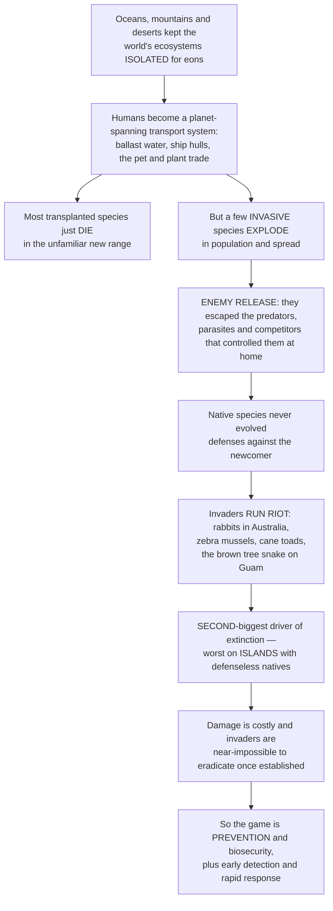

# 🐀 Invasive Species and Biological Invasions

> [!abstract] TL;DR
> For hundreds of millions of years, oceans, mountains, and deserts kept the world's biotas **isolated** — species evolved in place, and the creatures of Australia, the Americas, and Africa almost never met. Then humans became a **planet-spanning transport system**, moving species around the globe at unprecedented speed in ballast water, on ship hulls, in the pet and plant trade, and on our shoes. Most transplanted species simply die. But a few — **invasive species** — arrive in a new land and **explode**, because they have escaped the predators, parasites, and competitors that held them in check back home (the **enemy release** hypothesis), and because native species never evolved defenses against them. Terminology matters: **native** (evolved in place) versus **introduced / non-native / alien** (moved by humans) versus **invasive** (the harmful subset of introduced species that establish, spread, and damage ecosystems or economies — *not* every introduction becomes invasive). The journey runs through a filtering funnel — **transport → introduction → establishment → spread → impact** — with steep odds at each stage (the rough **"tens rule"**: about a tenth of introductions establish, and about a tenth of those turn invasive), often after a long **lag phase** before explosive range expansion. Invasives are the **second-largest driver of extinction** after habitat loss, devastating through predation, competition, hybridization, disease, and wholesale **ecosystem alteration** — and they are catastrophic on **islands**, where predator-naïve, defenseless endemics (flightless birds, unarmed plants) are annihilated by introduced rats, cats, goats, and snakes. The costs run to hundreds of billions of dollars a year, and once established invaders are almost impossible to eradicate — so the whole game is **prevention** (border biosecurity, the cheapest stage) and **early detection and rapid response**. Understanding why isolation matters, why released invaders run riot, and why islands suffer most is understanding one of globalization's great ecological consequences and a central battle in conservation.

---

## Intuition

**Analogy — the islands of an untouched board game, and the player who starts moving pieces between them.** Imagine the continents as separate game boards that have been played independently for eons. On each board, the pieces — the species — spent millions of years evolving *against each other*: every predator has prey that learned to flee it, every plant has herbivores it learned to poison, every parasite has hosts that learned to resist. The pieces are locked in a balanced, co-evolved stalemate, each held in check by its own local rivals. The **ocean, the mountain range, the desert** are the edges of the board — barriers that kept the boards apart.

Now a giant hand — us — starts lifting pieces off one board and dropping them onto another. Most dropped pieces don't fit: the climate is wrong, they land alone with no mate, and they vanish. But every so often a piece lands on a board where **none of the local pieces know how to counter it** — and, crucially, where **its own counters got left behind**. The rabbit arrives in Australia without the foxes, diseases, and competitors that limited it in Europe; freed of its enemies (**enemy release**) and facing defenseless natives, it breeds into the tens of millions and strips the land bare. That is a **biological invasion**: not the mere presence of a foreigner, but the runaway explosion of one that has escaped its regulators and met opponents with no evolved defense. The tragedy is that the **smaller, more isolated boards — islands** — are the most fragile: their pieces evolved with the fewest threats (birds that forgot how to fly because nothing hunted them), so a single introduced rat can sweep the whole board clean. And once a piece is loose and multiplying, you can almost never pick it back up — which is why the only winning move is to stop it at the **edge of the board**.

---

## How It Works

### Core Mechanics

1. **Biogeographic isolation is the baseline.** Continents and oceans divided the planet into distinct biogeographic realms, and each biota co-evolved in place. Species distributions were set by where a lineage *could disperse to* under its own power — a balance humans have now overturned.

2. **Humans as a super-vector.** Global trade and travel dissolve those barriers. Key **pathways**: **ballast water and hull fouling** (ships moving marine organisms between ports), the **horticultural, pet, and aquarium trade** (deliberate imports that escape), **agriculture and biological control** (crops, livestock, and released control agents), **canals** (connecting once-separate seas), and **accidental stowaways** in cargo, soil, and packing. Volume and speed scale with globalization, driving a **homogenization** of the world's biota — the "great reshuffling."

3. **The invasion process is a filtering funnel.** A propagule must survive a sequence of stages, each with high failure: **transport** (survive the journey) → **introduction** (be released into the wild) → **establishment** (found a self-sustaining population) → **spread** (expand its range) → **impact** (cause ecological or economic harm). The heuristic **"tens rule"** (Williamson) says roughly one in ten introduced species establishes, and roughly one in ten of *those* becomes invasive — so most introductions are demographic dead ends.

4. **The lag phase, then explosive spread.** Established populations often sit small and inconspicuous for years or decades (small-population stochasticity, Allee effects, adaptation) before a **lag** breaks into rapid, near-exponential growth and range expansion. Once spreading, an invasion front tends to advance at a roughly **constant velocity**, so invaded *area* grows with the square of time.

5. **Why some species invade — invasiveness.** Successful invaders tend to share **r-selected life histories**: fast growth, early and prolific reproduction, good dispersal, broad environmental tolerance, and generalist diets. They escape the density regulation and enemies that limited them at home, so their realized growth rate in the new range far exceeds what it was in the native range.

6. **Why some communities are invaded — invasibility.** Recipient communities are more invasible when **disturbed**, **species-poor** (open niche space, weaker biotic resistance), or **enemy-free** for the newcomer. The leading explanations are **enemy release** (escaping native predators, parasites, competitors), **novel weapons** (allelochemicals or behaviors residents never faced), **empty-niche / vacant-niche** availability, and **disturbance** opening the door.

7. **Impact — how invaders harm.** Through **predation** on naïve prey, **competition and displacement** of natives, **hybridization** that swamps native gene pools, **disease introduction**, and **ecosystem engineering** that rewires fire regimes, hydrology, or nutrient cycles. The damage is worst on **islands**, whose isolated, predator-naïve endemics have no defenses.

8. **Management follows the funnel backward in cost.** The cheapest, most effective intervention is **prevention / biosecurity** at the border; next is **early detection and rapid response** while a population is tiny; last and by far the most expensive is **control or eradication** once established — mechanical, chemical, or biological, each with limits and (for biocontrol) its own risk of becoming the next invader.

### Flow / Architecture



---

## Key Concepts

### Secondary — invasions in plain words

- **Native vs introduced vs invasive.** A **native** species evolved where it lives. An **introduced** (non-native, alien) species was moved there by humans. An **invasive** species is the harmful minority of introduced species that spread out of control and damage the new place. *Most introduced species are not invasive* — the word is reserved for the ones that run riot.
- **How they travel.** Ships carry them in **ballast water** and stuck to their **hulls**; people bring them through the **pet, aquarium, and garden-plant trade**; they hitchhike in cargo, soil, and on shoes. Globalization moves them faster and farther than ever.
- **Why they explode — enemy release.** Back home, a species is kept in check by predators, diseases, and competitors it evolved with. Drop it somewhere new *without* those enemies, and it can multiply unchecked — meanwhile the local species never learned to defend against it.
- **Why islands suffer most.** Island animals often evolved with no predators — birds that can't fly, plants with no thorns or toxins. When rats, cats, goats, or snakes arrive, the natives have no defense and can be wiped out.
- **Why prevention is everything.** Once an invader is loose and breeding, it is nearly impossible to remove. Stopping it at the border — before it ever arrives — is far cheaper and more effective than fighting it later.

### Undergraduate — the machinery

- **Invasion pathways and vectors.** Deliberate (horticulture, biocontrol, aquaculture, the pet trade) versus accidental (ballast water, hull fouling, contaminated commodities, canals). **Propagule pressure** — the number and frequency of individuals arriving — is one of the strongest predictors of establishment: more arrivals, more chances to beat the odds.
- **The invasion process and the tens rule.** The stage sequence **transport → introduction → establishment → spread → impact** acts as a series of filters. Williamson's **"tens rule"** offers a rough order-of-magnitude: about 10 percent of introduced species establish and about 10 percent of those become pests — a heuristic, not a law, and one that varies widely by taxon and habitat.
- **Enemy release hypothesis (ERH).** Invaders leave behind their specialist natural enemies (predators, herbivores, parasites, pathogens), gaining a per-capita demographic advantage over co-occurring natives that still carry their full enemy load. Related ideas: **EICA** (evolution of increased competitive ability — reallocating resources from defense to growth once enemies are gone) and the **novel weapons hypothesis** (biochemicals or behaviors residents have no tolerance for).
- **Invasibility and biotic resistance.** Elton's **diversity–invasibility** idea holds that species-rich communities resist invasion by leaving little unused niche space; the **fluctuating resource availability** hypothesis (Davis, Grime, Thompson) says invasions succeed when resource supply transiently exceeds native uptake — after disturbance, fire, flooding, or nutrient pulses.
- **Traits of successful invaders.** Broad environmental tolerance, rapid growth and reproduction, effective long-distance dispersal, phenotypic plasticity, generalist diet, and (in plants) self-compatibility or clonal spread. These map onto **r-selected life histories** and the release from density regulation described in population ecology.
- **Impact categories.** Predation, competition, hybridization and genetic swamping, disease/parasite introduction, and **ecosystem-level** alteration by **ecosystem engineers** (e.g., cheatgrass altering fire cycles, tamarisk altering hydrology and salinity, earthworms rewiring forest-soil nutrients).
- **Island vulnerability.** Islands host disproportionate **endemism** and species that evolved under **relaxed selection** for anti-predator and anti-competitor defenses (flightlessness, naïveté, loss of chemical defenses). The great majority of recorded animal extinctions since 1500 are island species, and introduced predators (rats, cats) are implicated in a large share.

### Graduate — dynamics, theory, and management

- **Spread models and range expansion.** **Skellam's (1951)** reaction–diffusion model couples logistic growth with random dispersal and predicts an invasion front advancing at asymptotic velocity $v = 2\sqrt{rD}$ (with intrinsic rate $r$ and diffusion coefficient $D$), so invaded **area grows quadratically** in time. **Fat-tailed (leptokurtic) dispersal kernels** — long-distance jump dispersal — accelerate spread beyond the diffusion prediction, producing patchy, faster-than-linear expansion and satellite outbreaks that dominate real invasions.
- **Establishment, Allee effects, and lags.** Small founding populations face **demographic and environmental stochasticity** and **Allee effects** (reduced per-capita growth at low density — mate limitation, failed group defense), which raise extinction risk and generate **lag phases**. Lags can also be **evolutionary** (local adaptation) or **ecological** (a threshold in habitat or climate), and they make eradication windows short and precious.
- **Propagule pressure as a null model.** Because establishment probability rises with the number and frequency of introductions, propagule pressure is the essential **null hypothesis** against which trait- or community-based explanations of invasion success must be tested — apparent "invasiveness" often reduces to how many times a species was introduced.
- **Enemy release, tested.** ERH predicts (i) invaders carry fewer enemies in the introduced than native range, and (ii) fewer than co-occurring natives. Biogeographic surveys (e.g., Mitchell & Power; Torchin et al. on parasite loss) broadly support enemy loss, but demographic *benefit* is harder to prove — hence complementary hypotheses (novel weapons, EICA) and the recognition that release is often partial and temporary as native enemies adapt.
- **Meltdown and facilitation.** **Invasional meltdown** (Simberloff & Von Holle) describes mutually reinforcing invaders that facilitate one another's establishment and impact (e.g., introduced pollinators aiding invasive plants), producing accelerating, nonlinear community collapse rather than independent additive effects.
- **Impact quantification and context dependence.** Impact scales with **abundance × per-capita effect × range**, and frameworks such as **EICAT** (IUCN) and the **Blackburn unified framework** standardize classification. Impacts are context-dependent, can involve **extinction debt** (delayed native losses), and may include **cryptic** genetic effects through hybridization.
- **Management economics and the prevention gradient.** Expected cost rises steeply along the funnel: **prevention/biosecurity ≪ early detection and rapid response ≪ established-population control ≪ eradication**. Eradication is feasible mainly for small, bounded populations — classically on **islands**, where campaigns against rats, cats, and goats have restored seabird and endemic populations (e.g., South Georgia, Macquarie Island). **Biological control** can succeed spectacularly (cactoblastis moth vs. prickly pear) but carries the risk of the agent itself becoming invasive (the cane toad, introduced *as* biocontrol, is the cautionary archetype), which is why modern programs demand rigorous host-specificity testing.

---

## Python Demo

```python
# Invasive species and biological invasions — four views:
#   (A) INVASION CURVE: an invader's lag-then-explosion vs a native held at carrying capacity
#   (B) SPATIAL SPREAD: constant-velocity radial range expansion from an introduction point
#   (C) NATIVE DECLINE: Lotka-Volterra exclusion — the invader displaces a native as it rises
#   (D) THE TENS RULE: the transport -> introduction -> establishment -> spread/impact funnel
import numpy as np
import matplotlib.pyplot as plt

# ------------------------------------------------------------- (A) the invasion curve
# Invader: logistic growth from a TINY founding population -> long apparent LAG, then
# explosive spread once established (density regulation escaped in the new range).
# Native: fluctuating around a lower carrying capacity, held there by its natural enemies.
t = np.linspace(0, 40, 800)
r_inv, K_inv, N0_inv = 0.45, 1000.0, 2.0                      # fast r-strategist, big ceiling
N_inv = K_inv / (1.0 + (K_inv / N0_inv - 1.0) * np.exp(-r_inv * t))
K_nat = 620.0
N_nat = K_nat + 25.0 * np.sin(0.5 * t)                        # native near carrying capacity
lag_end = t[np.argmax(N_inv > 0.05 * K_inv)]                  # time to reach 5% of ceiling

# ---------------------------------------------------------- (C) native decline via LV
# Strongly asymmetric competition: the invader suppresses the native far more than vice
# versa (a_ni >> a_in), so the native crashes toward extinction as the invader climbs.
def lv(N0, r_i, r_n, K, a_in, a_ni, dt=0.01, steps=4000):
    Ni = np.empty(steps + 1); Nn = np.empty(steps + 1)
    Ni[0], Nn[0] = N0
    for k in range(steps):
        dNi = r_i * Ni[k] * (K - Ni[k] - a_in * Nn[k]) / K
        dNn = r_n * Nn[k] * (K - Nn[k] - a_ni * Ni[k]) / K
        Ni[k + 1] = max(Ni[k] + dt * dNi, 0.0)
        Nn[k + 1] = max(Nn[k] + dt * dNn, 0.0)
    return Ni, Nn

steps, dt = 4000, 0.01
tc = np.arange(steps + 1) * dt
Ni, Nn = lv((10.0, 800.0), r_i=0.9, r_n=0.5, K=1000.0, a_in=0.4, a_ni=1.7)

# ----------------------------------------------------------------- plotting scaffold
fig, ax = plt.subplots(2, 2, figsize=(13.5, 10.5))

# --- (A) invasion curve -------------------------------------------------------------
axa = ax[0, 0]
axa.plot(t, N_inv, color="crimson", lw=2.4, label="Invader (escapes regulation)")
axa.plot(t, N_nat, color="seagreen", lw=2.0, label="Native (held at carrying capacity)")
axa.axvspan(0, lag_end, color="gold", alpha=0.20)
axa.text(lag_end / 2, 720, "lag\nphase", ha="center", va="center", fontsize=9)
axa.annotate("explosive\nspread", xy=(lag_end + 4, 500), xytext=(lag_end + 9, 250),
             fontsize=9, arrowprops=dict(arrowstyle="->", color="crimson"))
axa.set_xlabel("time"); axa.set_ylabel("population size")
axa.set_title("(A) INVASION CURVE: lag, then explosion")
axa.legend(fontsize=8, loc="center right"); axa.grid(alpha=0.3)

# --- (B) radial spatial spread ------------------------------------------------------
# Skellam / Fisher: after an establishment lag the front advances at ~constant velocity,
# so the invaded AREA grows with the square of time. Draw the front at several times.
axb = ax[0, 1]
c_spread, lag_spatial = 1.0, 4.0
front_times = [6, 10, 14, 18, 22]
theta = np.linspace(0, 2 * np.pi, 300)
cmap = plt.cm.autumn(np.linspace(0, 0.85, len(front_times)))
for ft, col in zip(front_times, cmap):
    R = max(0.0, c_spread * (ft - lag_spatial))
    axb.plot(R * np.cos(theta), R * np.sin(theta), color=col, lw=2, label=f"t = {ft}")
    axb.fill(R * np.cos(theta), R * np.sin(theta), color=col, alpha=0.10)
axb.plot(0, 0, "k*", ms=14, label="introduction point")
axb.set_aspect("equal"); axb.set_xlim(-20, 20); axb.set_ylim(-20, 20)
axb.set_xlabel("distance east"); axb.set_ylabel("distance north")
axb.set_title("(B) SPATIAL SPREAD: constant-velocity invasion front")
axb.legend(fontsize=7.5, loc="upper right"); axb.grid(alpha=0.3)

# --- (C) native decline (competitive/predatory exclusion) --------------------------
axc = ax[1, 0]
axc.plot(tc, Ni, color="crimson", lw=2.4, label="Invader")
axc.plot(tc, Nn, color="seagreen", lw=2.4, label="Native")
axc.annotate("native crashes", xy=(18, 60), xytext=(24, 350),
             fontsize=9, arrowprops=dict(arrowstyle="->", color="seagreen"))
axc.set_xlabel("time"); axc.set_ylabel("population size")
axc.set_title("(C) NATIVE DECLINE: invader displaces native")
axc.legend(fontsize=8, loc="center right"); axc.grid(alpha=0.3)

# --- (D) the tens-rule invasion funnel ---------------------------------------------
axd = ax[1, 1]
stages = ["Transported", "Introduced", "Established", "Invasive / impact"]
counts = [1000, 100, 10, 1]                    # ~10% pass each filter -> the "tens rule"
widths = np.log10(counts) + 0.6                # log-scaled widths so all bars are visible
ypos = np.arange(len(stages))[::-1]
bar_cols = ["#4575b4", "#74add1", "#f46d43", "#d73027"]
for yi, w, c, s, n in zip(ypos, widths, bar_cols, stages, counts):
    axd.barh(yi, w, left=-w / 2.0, color=c, edgecolor="black")
    axd.text(0, yi, f"{s}\n~{n} species", ha="center", va="center",
             fontsize=9, fontweight="bold")
axd.set_xlim(-2.4, 2.4); axd.set_ylim(-0.6, len(stages) - 0.4)
axd.set_yticks([]); axd.set_xticks([])
axd.set_title("(D) THE TENS RULE: the invasion funnel\n~10% survive each stage")

plt.tight_layout(); plt.show()

# ------------------------------------------------------------------ printed summary
print(f"Invader reaches 5% of ceiling at t = {lag_end:.1f} (end of apparent lag).")
print(f"Native equilibrium after invasion: Nn* = {Nn[-1]:.1f} (near-extinction).")
print(f"Invader equilibrium after invasion: Ni* = {Ni[-1]:.1f}.")
print(f"Tens rule: {counts[0]} transported -> {counts[-1]} invasive "
      f"({100*counts[-1]/counts[0]:.1f}% of the original pool).")
```

Panel **(A)** contrasts the two demographic signatures: the invader, freed from the density regulation and enemies that capped it at home, grows logistically from a handful of founders — inconspicuous through a long **lag** before an **explosive** climb to a high ceiling — while the native merely fluctuates around its lower carrying capacity. Panel **(B)** renders spread in space: after an establishment lag the invasion front advances at roughly constant velocity, so the concentric fronts spread evenly and the invaded *area* grows with the square of time (Skellam's result). Panel **(C)** couples the two species through asymmetric Lotka–Volterra competition — as the invader rises it drives the native toward extinction, the essence of competitive or predatory **exclusion** that plays out so brutally on islands. Panel **(D)** draws the **tens rule** as a funnel: of ~1000 species transported, ~100 are introduced, ~10 establish, and ~1 becomes genuinely invasive — the steep attrition that makes early stages the smartest place to intervene.

---

## Real-World Applications

> **Example — rats, cats, and the brown tree snake on islands.** The single most instructive invasion story is what introduced predators do to predator-naïve island faunas. The **brown tree snake** (*Boiga irregularis*), an accidental stowaway in post-war cargo, reached **Guam** around 1950 and, meeting forest birds that had evolved with no snakes, ate the island's native avifauna to functional extinction — roughly ten of twelve forest-bird species gone, with cascading losses of pollination and seed dispersal. The same logic — enemy release for the invader, defenselessness for the native — drives the global toll of **ship rats** and **feral cats** on seabird and endemic-bird islands. That logic also underwrites the **solutions**: because islands are bounded, they are the one arena where **eradication** works, and campaigns removing rats and goats (South Georgia, Macquarie Island, and hundreds of smaller islets) have produced some of conservation's clearest recoveries.

- **Marine biosecurity and ballast water.** The **zebra and quagga mussels** that colonized the North American Great Lakes via ballast water clog water intakes, foul infrastructure, and restructure food webs — costing billions and motivating the International Maritime Organization's **Ballast Water Management Convention** (mid-ocean exchange and treatment) as a prevention-first response.
- **Fisheries and reef ecosystems.** The **Indo-Pacific lionfish** invasion of the Atlantic and Caribbean — likely aquarium releases — devastates reef fish that show no fear of the venomous newcomer, illustrating naïveté plus enemy release; management leans on targeted culling and even market-driven harvesting.
- **Agriculture and forestry.** The **emerald ash borer** and pathogens like **chestnut blight** and **Dutch elm disease** show how introduced insects and microbes, meeting hosts with no coevolved resistance, can erase a tree genus from a continent — driving quarantine, wood-movement rules, and resistance-breeding programs.
- **Cautionary biocontrol.** The **cane toad**, imported to Australia to control sugarcane beetles, became a textbook disaster — toxic to native predators that had never encountered a poisonous toad — and is the standing argument for exhaustive host-specificity testing before any biological-control release.
- **Ecosystem engineers.** **Cheatgrass** in the American West alters fire frequency; **tamarisk** alters riparian hydrology and soil salinity; **kudzu** smothers southern US landscapes — cases where the impact is not on a single species but on the physical machinery of the whole ecosystem.

---

## Common Pitfalls

- **Calling every non-native species "invasive."** Most introduced species never spread or cause harm; **invasive** is the harmful, spreading subset. Conflating "alien" with "invasive" inflates the problem and muddies policy — the working distinction is native vs introduced vs invasive.
- **Ignoring the lag phase.** A population that has sat small and harmless for years is not proven benign — many invasions explode only after a long lag. Judging risk from an early snapshot invites the "it's been here for decades and done nothing" trap right before the outbreak.
- **Forgetting propagule pressure as the null.** Apparent "invasiveness" often just reflects how *many times* a species was introduced. Attributing establishment to special traits without controlling for introduction effort is a classic confound.
- **Treating enemy release as complete and permanent.** Invaders rarely escape *all* enemies, and native predators, parasites, and pathogens gradually adapt to exploit them. Enemy release is usually partial and time-limited, not a permanent free pass.
- **Assuming spread is smooth diffusion.** Real invasions are dominated by rare **long-distance jump dispersal** (fat-tailed kernels) that seeds satellite populations far ahead of the front — so simple constant-velocity models underestimate spread and the containment perimeter needed.
- **Betting on eradication over prevention.** Once an invader is widespread, eradication is usually impossible and control is a permanent expense. The cost gradient runs steeply upward from prevention to eradication; underfunding **biosecurity** to pay for later control is a false economy.
- **Believing diverse communities are invasion-proof.** Elton's diversity–resistance idea holds at small scales, but at landscape scales the same conditions that support high native diversity (productivity, favorable climate) also support invaders — the "invasion paradox." Diversity is not a guarantee.
- **Recklessly deploying biological control.** Introducing a control agent is itself an introduction; without rigorous host-specificity testing it can become the next invader (the cane toad). Biocontrol is powerful but must clear a high safety bar.

---

## Related Concepts

- [[Biodiversity_and_Conservation]] — the Biology-vault companion that frames invasive species as the second-largest driver of biodiversity loss after habitat destruction, situating invasions within the broader extinction crisis.
- [[Community_Ecology]] — invasions are community-assembly events; biotic resistance, niche availability, and the predation and competition interactions catalogued here govern whether an introduced species establishes.
- [[Population_Ecology]] — the demographic engine of invasions: r-selected growth, Allee effects at low density, and the lag-then-explosion trajectory of an establishing population.
- [[Natural_Selection_and_Adaptation]] — enemy release and native naïveté are evolutionary: invaders shed coevolved enemies while natives lack coevolved defenses, and both invaders (EICA) and native enemies then adapt to one another.
- [[Network_Dynamics_and_Contagion]] — biological spread across a landscape is formally kin to contagion on a network, sharing the mathematics of thresholds, fronts, and long-distance jumps that drive both epidemics and invasions.

Within this vault, this note anchors the applied-threat side of the biodiversity-and-conservation section. Conservation_Biology_and_the_Biodiversity_Crisis names invasive species among the principal drivers of extinction (the "evil quartet"), and this note supplies the mechanism behind that ranking; Habitat_Loss_Fragmentation_and_Island_Biogeography explains *why islands and fragments are so vulnerable* — the isolation and small, naïve populations that invaders exploit — making it the essential partner to the island-devastation theme here; Competition_and_Niche_Theory provides the competitive-exclusion machinery (the Lotka–Volterra dynamics in the demo) and the enemy-release and vacant-niche logic that explain establishment; Population_Growth_and_Regulation supplies the logistic and density-regulation baseline that invaders escape in the new range; and Protected_Areas_and_Conservation_Strategies covers the management response — biosecurity, early detection, and eradication — that this note argues must be prevention-first.

---

## Review Questions

1. **(Secondary)** Explain the difference between a **native**, an **introduced**, and an **invasive** species, and use the **enemy release** idea to explain why rabbits could explode across Australia after being brought from Europe. Why are **islands** especially vulnerable to introduced predators like rats and cats?
2. **(Undergraduate)** The **"tens rule"** describes the invasion pathway as a filtering funnel (transport → introduction → establishment → spread → impact). Walk through each stage, explain what typically causes failure at it, and argue — using the cost gradient from prevention to eradication — why **biosecurity** at the border is the most cost-effective intervention. How does **propagule pressure** modify the odds at the establishment stage?
3. **(Graduate)** Skellam's reaction–diffusion model predicts an invasion front advancing at velocity $v = 2\sqrt{rD}$ with area growing quadratically in time, yet many real invasions spread faster and more patchily than this. Explain how **fat-tailed dispersal kernels** and **Allee effects** each break the simple diffusion prediction (one accelerating spread, one imposing lags and thresholds), and describe how you would test whether an observed invasion is enemy-release-driven versus simply the product of high propagule pressure.

---

## Sources

- Elton, C. S. (1958). *The Ecology of Invasions by Animals and Plants.* Methuen. (The founding text of invasion ecology.)
- Mack, R. N., Simberloff, D., Lonsdale, W. M., Evans, H., Clout, M., & Bazzaz, F. A. (2000). "Biotic invasions: causes, epidemiology, global consequences, and control." *Ecological Applications*, 10(3), 689–710.
- Lockwood, J. L., Hoopes, M. F., & Marchetti, M. P. (2013). *Invasion Ecology* (2nd ed.). Wiley-Blackwell.
- Simberloff, D. (2013). *Invasive Species: What Everyone Needs to Know.* Oxford University Press.
- Williamson, M., & Fitter, A. (1996). "The varying success of invaders." *Ecology*, 77(6), 1661–1666. (The "tens rule.")

---

#ecology #invasive-species #biological-invasions #enemy-release #island-vulnerability
