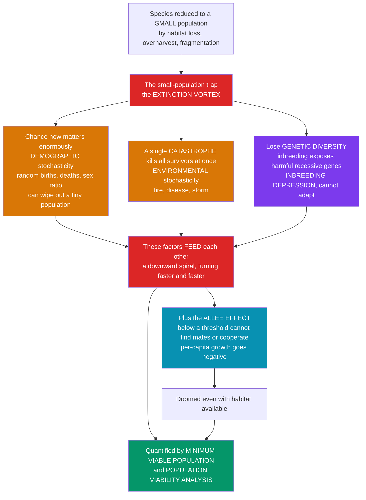

# 🌀 Population Viability and Small Population Biology

> [!abstract] TL;DR
> Once a species is reduced to a **small population**, it enters a compounding extinction trap. Processes that are negligible in a large population turn deadly at small size: sheer **bad luck** in births and deaths (**demographic stochasticity**), a single **catastrophe** that wipes out all the survivors at once (**environmental stochasticity**), and the slow erosion of **genetic diversity** through **inbreeding depression** and lost adaptive potential. Worse, these factors **feed one another** in a self-reinforcing downward spiral — the **extinction vortex** — while the **Allee effect** can doom a population below a threshold even with habitat to spare. The science of quantifying and reversing this fragility, through **minimum viable population** size and **population viability analysis**, is the core of endangered-species conservation.

---

## Intuition

**Analogy:** Think of a species like a coin-flipping game where survival depends on staying above zero. A **large** population is like flipping ten thousand coins at once: a run of unlucky tails barely dents the total, because the good and bad luck average out. But squeeze that same species down to its **last few dozen individuals**, and you are now flipping only a handful of coins — a short streak of tails (a run of male-only births, a couple of bad breeding years) can wipe the whole population out by chance alone. Small numbers make *randomness* lethal.

Now stack three separate dangers on top of that fragility. First, that raw bad luck in individual births and deaths — **demographic stochasticity**. Second, a single **catastrophe** — a fire, a disease outbreak, a storm — that a large, widespread population would shrug off can kill *every* remaining individual at once when they are all crowded into one shrinking refuge (**environmental stochasticity**). Third, and most insidiously, with so few individuals mating becomes mating *with relatives*: **inbreeding** becomes unavoidable, exposing harmful recessive genes (**inbreeding depression**), and the loss of genetic variation cripples the species' ability to adapt to whatever comes next. The cruelest part is that these problems **reinforce each other**: fewer individuals means more inbreeding and more exposure to bad luck, which means fewer surviving offspring, which means still fewer individuals — a vicious spiral that turns faster and faster, the **extinction vortex**. And below a certain threshold the **Allee effect** kicks in: individuals literally cannot find mates, cannot cooperate to raise young or fend off predators, so per-capita growth goes *negative* and the population is doomed even if there is plenty of habitat left. This is why conservationists obsess over **minimum viable population** size and build **population viability analyses** to compute a species' extinction risk — the whole science of pulling species back from the brink starts with understanding why small is so dangerous.

---

## How It Works

### Core Mechanics

1. **Two paradigms, one problem.** Graeme Caughley distinguished the **declining-population paradigm** — the *deterministic* causes that drove a species down (habitat loss, overharvest, invasive predators, pollution) — from the **small-population paradigm** — why *smallness itself* is dangerous, through *stochastic* and *genetic* processes. Saving a species usually requires both: diagnose and reverse the decline, *and* manage the fragility of what remains.
2. **Demographic stochasticity.** Births, deaths, and offspring sex are individually random events. In a large population these average out; in a tiny one, the *variance* dominates. Ten females might by chance all produce sons one year, or a run of deaths might outpace births — pure sampling noise that can drive a small population to zero even when its *average* growth rate is positive.
3. **Environmental stochasticity and catastrophes.** Year-to-year swings in weather, food, and disease affect *all* individuals simultaneously (unlike demographic noise, this does not average out with population size). A rare **catastrophe** — a wildfire, epidemic, or hurricane — can eliminate an entire small, localized population in a single event that a large, geographically spread population would survive.
4. **Genetic erosion.** In a small population, **genetic drift** randomly removes alleles each generation, so heterozygosity decays at roughly `1/(2·Ne)` per generation, where `Ne` is the **effective population size** (almost always *smaller* than the census count `N`). Fewer individuals also force matings among relatives — **inbreeding** — which exposes deleterious recessive alleles and depresses survival and fecundity (**inbreeding depression**), while the loss of variation strips away **evolutionary potential** to adapt to future change.
5. **The Allee effect.** At very low density, per-capita growth can *fall* rather than rise: individuals fail to find mates, cooperative breeding, group defense, and predator-swamping break down. Below a critical **Allee threshold** the per-capita growth rate goes **negative**, so the population shrinks deterministically toward extinction — habitat availability cannot save it.
6. **The extinction vortex.** Gilpin & Soulé's key insight is that these forces are not independent — they *couple*. Small size raises inbreeding and demographic chance, which lower survival and reproduction, which shrink the population further, which deepens inbreeding and chance, and so on. The population spirals inward with accelerating speed. Vortices are conventionally labeled R (demographic/environmental) and F (genetic) feedbacks.
7. **Quantifying viability.** A **minimum viable population (MVP)** is the smallest population size with a high probability of persistence over a set horizon (Shaffer's canonical benchmark: 99 percent probability of surviving 1,000 years, often relaxed to 95 percent over 100 years). A **population viability analysis (PVA)** is the model that estimates extinction risk from demographic, environmental, and genetic parameters — the workhorse tool for recovery targets, reserve sizing, and management triage.

### Flow / Architecture



---

## Key Concepts

### Secondary (intuitive foundations)

- **Small is fragile.** A big population averages out good and bad luck; a tiny one can be destroyed by a short streak of bad luck alone. Size buys safety.
- **Three killers of small populations.** Bad luck in who lives and dies (**demographic chance**), a single disaster that hits everyone at once (**catastrophe**), and inbreeding that weakens the young (**genetic decay**).
- **Inbreeding.** With few individuals, animals end up mating with relatives. This brings out hidden harmful genes, so offspring are weaker and fewer — **inbreeding depression**.
- **The extinction vortex.** These problems make each other worse. Fewer animals → more inbreeding and bad luck → even fewer animals → and around it spirals, faster and faster, toward extinction.
- **The Allee effect.** Below some number, individuals cannot even find mates or work together to survive, so the population shrinks no matter how much habitat is left — it is doomed.
- **Minimum viable population.** Conservationists ask: what is the smallest number that gives a species a good chance of surviving for a long time? That target guides how big a reserve or a captive-breeding program must be.

### Undergraduate (the models)

- **Declining- vs small-population paradigm (Caughley, 1994).** The *declining* paradigm asks *what pushed the species down* (deterministic drivers); the *small* paradigm asks *why smallness itself is dangerous* (stochastic and genetic drivers). Effective conservation reconciles both.
- **Demographic stochasticity.** Births and deaths are random. Extinction risk from demographic noise scales roughly as `exp(-c·N)` — it falls off *steeply* with size, so it matters overwhelmingly for populations of tens, negligibly for thousands.
- **Environmental stochasticity and catastrophes.** Variance in the growth rate `r` that is shared across individuals. Unlike demographic noise, it does *not* shrink with `N`, so it sets a ceiling on viability even for moderately large populations. Rare catastrophes are the extreme tail of this distribution.
- **Effective population size `Ne`.** The size of an idealized (Wright–Fisher) population that would lose genetic diversity at the same rate as the real one. `Ne` is reduced by *unequal sex ratio* (`Ne = 4·Nm·Nf / (Nm + Nf)`), *variance in reproductive success*, and *fluctuating population size* (the **harmonic mean** across generations — a single crash dominates). Typically `Ne/N ≈ 0.1–0.3`.
- **Genetic drift and heterozygosity loss.** Expected heterozygosity decays as `H_t = H_0·(1 − 1/(2·Ne))^t` — small `Ne` bleeds diversity fast. Loss of variation reduces the raw material for adaptation.
- **Inbreeding depression.** Measured by the **inbreeding coefficient** `F` (probability two alleles are identical by descent). Fitness declines roughly linearly with `F`; the **lethal equivalents** per gamete quantify the hidden genetic load exposed by inbreeding.
- **The 50/500 rule (Franklin & Soulé).** `Ne ≥ 50` to limit inbreeding depression in the short term; `Ne ≥ 500` to retain long-term adaptive potential (mutation replacing drift-lost variation). Modern work (e.g., 100/1000) argues these floors are too low.
- **The Allee effect.** A strong Allee model: `dN/dt = r·N·(1 − N/K)·(N/A − 1)`, where `A` is the Allee threshold. Below `A`, per-capita growth is negative — a *deterministic* route to extinction distinct from the stochastic ones.
- **MVP and PVA.** MVP is an *output* (the size meeting a persistence criterion); PVA is the *model* (a stochastic projection of extinction probability over time, given vital rates, their variances, catastrophe frequency, and density dependence).

### Graduate (mechanisms, methods, and application)

- **Formalizing the vortex.** The extinction vortex is a positive feedback between demographic decline and genetic decline: shrinking `N` lowers `Ne`, raising drift and inbreeding load, lowering vital rates, further shrinking `N`. **Mutational meltdown** (Lynch) is the genetic end-stage — mildly deleterious mutations accumulate faster than selection can purge them in small `Ne`, accelerating collapse. Fagan & Holmes' empirical time-series of vertebrate extinctions confirm accelerating decline near the end.
- **PVA methods.** (i) **Count-based / diffusion approximation** (Dennis, Lande): estimate mean growth `μ` and process variance `σ²` from a time series, giving extinction probability in closed form — data-cheap but ignores structure. (ii) **Demographic / stochastic matrix models**: Leslie/Lefkovitch matrices with environmentally varying vital rates and catastrophe draws (VORTEX, RAMAS). (iii) **Individual-based / spatially explicit** models coupling demography, genetics, and landscape. All are better at *relative ranking* of scenarios than *absolute* extinction probabilities.
- **Genetic vs demographic drivers — reconciled.** Lande argued demographic and environmental stochasticity usually dominate at very small size while genetics acts over longer timescales; Frankham and others show inbreeding depression frequently *does* reduce persistence in the wild. Modern PVA integrates both because they interact in the vortex.
- **Estimating and managing `Ne`.** Linkage-disequilibrium, temporal-method, and sibship estimators infer `Ne` from genetic data. Management raises `Ne` by equalizing family sizes, balancing sex ratio, and avoiding bottlenecks — the logic behind studbook-managed captive breeding.
- **Genetic rescue.** Introducing a few immigrants into an inbred population restores heterozygosity and fitness — famously the **Florida panther** (Texas cougars introduced in 1995 reversed inbreeding defects), and Isle Royale wolves. Risks: **outbreeding depression** and loss of local adaptation if source is too divergent.
- **How big is an MVP, really?** Meta-analyses (Traill, Bradshaw & Brook) suggest median MVPs of thousands, not hundreds — sobering for reserve design. Reed et al. and the debate over generalized MVP thresholds highlight taxon-specificity and the danger of one-size-fits-all numbers.
- **Applications.** PVA underpins **IUCN Red List** criterion E (quantitative extinction probability), federal recovery-plan targets, reserve minimum-area calculations, harvest limits, reintroduction planning, and triage among competing endangered species.

---

## Python Demo

```python
# Small-population biology in four panels:
#   (a1) example stochastic trajectories: a small vs a large population
#   (a2) the MVP curve: probability of extinction rising steeply as size falls
#   (b1) genetic decay: loss of heterozygosity per generation as a function of Ne
#   (b2) the Allee effect: per-capita growth going negative below a threshold
import numpy as np
import matplotlib.pyplot as plt

rng = np.random.default_rng(7)

# ----------------------------------------------------------------------
# Stochastic Ricker model with BOTH demographic and environmental noise.
#   env noise: a shared random shock to the growth rate each year
#   demographic noise: next census is a Poisson draw about the mean
# Same MEAN growth rate for every population size -> any size difference in
# extinction risk is due to stochasticity, not to a worse average.
# ----------------------------------------------------------------------
def simulate(N0, K, r0=0.10, sigma_env=0.35, T=100, seed=None):
    g = np.random.default_rng(seed)
    traj = np.empty(T + 1)
    traj[0] = N = N0
    for t in range(T):
        if N <= 0:
            traj[t + 1:] = 0
            return traj, True                    # extinct
        eps = g.normal(0.0, sigma_env)           # environmental stochasticity
        growth = r0 * (1.0 - N / K) + eps
        mean_next = N * np.exp(growth)
        N = g.poisson(min(mean_next, 5 * K))     # demographic stochasticity
        traj[t + 1] = N
    return traj, (N <= 0)

def extinction_prob(K, reps=400, T=100):
    ext = sum(simulate(N0=K, K=K, T=T, seed=s)[1] for s in range(reps))
    return ext / reps

fig, axes = plt.subplots(2, 2, figsize=(13, 9))

# (a1) example trajectories -------------------------------------------------
ax = axes[0, 0]
for s in range(6):
    tr, _ = simulate(N0=15, K=15, T=100, seed=100 + s)
    ax.plot(tr, color="#dc2626", lw=1.2, alpha=0.8)
for s in range(6):
    tr, _ = simulate(N0=150, K=150, T=100, seed=200 + s)
    ax.plot(tr / 10.0, color="#059669", lw=1.2, alpha=0.8)  # scaled /10 to overlay
ax.axhline(0, color="grey", lw=0.8)
ax.set_title("(a1) Small (red, K=15) vs large (green, K=150, scaled /10)\n"
             "small populations hit zero; large ones ride out the noise")
ax.set_xlabel("year"); ax.set_ylabel("population size")
ax.grid(alpha=0.3)

# (a2) MVP curve: extinction probability vs population size ------------------
ax = axes[0, 1]
sizes = np.array([5, 10, 15, 20, 30, 40, 60, 80, 120, 160, 220, 300])
pext = np.array([extinction_prob(int(k)) for k in sizes])
ax.plot(sizes, pext, "o-", color="#7c3aed", lw=2)
ax.axhline(0.05, color="#dc2626", ls="--", lw=1.3, label="5% risk (MVP criterion)")
mvp = sizes[np.argmax(pext <= 0.05)] if np.any(pext <= 0.05) else np.nan
if not np.isnan(mvp):
    ax.axvline(mvp, color="#059669", ls=":", lw=1.3, label=f"approx MVP = {mvp}")
ax.set_title("(a2) Extinction risk climbs steeply as size falls\n"
             "the basis of Minimum Viable Population / PVA")
ax.set_xlabel("population size"); ax.set_ylabel("P(extinct within 100 yr)")
ax.set_ylim(-0.03, 1.03); ax.legend(fontsize=9); ax.grid(alpha=0.3)

# (b1) loss of heterozygosity: H_t = H0 * (1 - 1/(2 Ne))^t -------------------
ax = axes[1, 0]
gens = np.arange(0, 101)
for Ne, col in [(10, "#dc2626"), (50, "#d97706"), (500, "#059669")]:
    H = (1.0 - 1.0 / (2.0 * Ne)) ** gens
    ax.plot(gens, H, color=col, lw=2, label=f"Ne = {Ne}")
ax.axhline(0.9, color="grey", ls=":", lw=1)
ax.set_title("(b1) Genetic decay: small Ne bleeds diversity fast\n"
             "heterozygosity lost at about 1/(2 Ne) per generation")
ax.set_xlabel("generations"); ax.set_ylabel("heterozygosity retained  H_t / H_0")
ax.set_ylim(0, 1.02); ax.legend(fontsize=9); ax.grid(alpha=0.3)

# (b2) Allee effect: strong Allee per-capita growth -------------------------
ax = axes[1, 1]
K, A, r = 100.0, 25.0, 0.5
N = np.linspace(0, K, 400)
per_capita = r * (1.0 - N / K) * (N / A - 1.0)   # negative below the threshold A
ax.plot(N, per_capita, color="#2563eb", lw=2.5)
ax.axhline(0, color="grey", lw=0.9)
ax.axvline(A, color="#dc2626", ls="--", lw=1.4, label=f"Allee threshold A = {int(A)}")
ax.fill_between(N, per_capita, 0, where=(N < A), color="#dc2626", alpha=0.18,
                label="doomed: per-capita growth < 0")
ax.set_title("(b2) Allee effect: below a threshold, growth goes negative\n"
             "population declines even with habitat available")
ax.set_xlabel("population size  N"); ax.set_ylabel("per-capita growth rate")
ax.legend(fontsize=9); ax.grid(alpha=0.3)

plt.tight_layout()
plt.savefig("small_population_biology.png", dpi=120)
print("Extinction probabilities by size:")
for k, p in zip(sizes, pext):
    print(f"  N={k:4d} -> P(extinct) = {p:.2f}")
print(f"Approx MVP (5% risk over 100 yr): {mvp}")
```

Running this reproduces the small-population story quantitatively. Panel (a1) shows red small-population trajectories crashing to zero while green large-population trajectories — with the *same* average growth rate — absorb the same noise and persist. Panel (a2) is the MVP curve: extinction probability rises steeply as size drops, and the horizontal 5-percent line reads off an approximate minimum viable population. Panel (b1) shows heterozygosity draining away far faster for `Ne = 10` than for `Ne = 500` — the genetic arm of the vortex. Panel (b2) shows the strong Allee effect driving per-capita growth *negative* below the threshold, a deterministic doom no amount of habitat can reverse.

---

## Real-World Applications

- **Florida panther genetic rescue.** By the 1990s roughly 20–30 panthers remained, showing kinked tails, heart defects, and poor sperm — classic inbreeding depression. In 1995 managers introduced eight female Texas cougars; heterozygosity and fitness rebounded and the population tripled. The textbook demonstration that adding immigrants can pull a population out of the genetic vortex.
- **California condor.** Down to 22 individuals in 1987, all taken into captivity for studbook-managed breeding designed to maximize `Ne` and minimize kinship. PVA set the recovery targets; the wild population now numbers in the hundreds, though lead poisoning keeps it below the modeled MVP for self-sustaining independence.
- **Isle Royale gray wolves.** An isolated island population collapsed from inbreeding as immigration across the ice bridge ceased with warming winters — a natural extinction-vortex experiment that prompted a genetic-rescue reintroduction beginning in 2018.
- **Northern elephant seal and cheetah.** Both passed through severe bottlenecks (elephant seals to ~20 individuals; cheetahs in the Pleistocene), leaving them with drastically low genetic diversity today — living illustrations of drift-driven variation loss and heightened disease vulnerability.
- **IUCN Red List and recovery planning.** PVA underlies Red List criterion E (explicit extinction-probability thresholds) and quantitative recovery targets, reserve minimum-area design, harvest quotas, and reintroduction plans for species from the whooping crane to the Mauritius kestrel.

---

## Common Pitfalls

- **Treating symptoms, not cause.** Fixing only the small-population problem (captive breeding, genetic rescue) while the deterministic *decline* driver — habitat loss, an invasive predator, poaching — still operates just refills a leaking bucket. Caughley's two paradigms must both be addressed.
- **Equating census size with effective size.** Managers count `N` but genetics depends on `Ne`, typically only 10–30 percent of `N` because of skewed sex ratios, variance in reproductive success, and past bottlenecks. A census of 200 can be an `Ne` of 40 — already in the inbreeding danger zone.
- **Ignoring environmental stochasticity and catastrophes.** Deterministic or demographic-only models are dangerously optimistic. Environmental variance does not shrink with population size, and a single catastrophe can erase an otherwise "safe" population — the fat tail dominates extinction risk.
- **Over-trusting PVA's absolute numbers.** A PVA output like "3.7 percent extinction risk in 100 years" is only as good as its (often sparse) vital-rate and variance estimates. PVAs are far more reliable for *ranking* management options than for producing a precise probability. Report and compare scenarios, not a single decimal.
- **Assuming habitat is enough.** Below the Allee threshold a population declines deterministically even in pristine, empty habitat — mate-finding, cooperative breeding, or predator-swamping have failed. Protecting land without ensuring the population clears the Allee threshold can still let it wink out.
- **Using one MVP number for all species.** Generalized thresholds (500, 1,000, 5,000) are starting points, not answers. MVP depends on life history, environmental variability, and catastrophe regime; a long-lived low-fecundity species and a boom-bust insect need very different floors.

---

## Related Concepts

- [[Population_Ecology]] — the exponential and logistic growth, carrying capacity, and density dependence whose stochastic, small-`N` limit *is* small-population biology; the Allee effect is negative density dependence at the low end.
- [[Population_Genetics_and_Hardy_Weinberg]] — Hardy–Weinberg equilibrium is the large-population baseline that breaks down when drift and inbreeding take over; effective population size and the inbreeding coefficient `F` come straight from this framework.
- [[Natural_Selection_Genetic_Drift_and_Bottlenecks]] — genetic drift and bottlenecks are the mechanism eroding diversity in small populations; this note applies that machinery to extinction risk and genetic rescue.
- [[Biodiversity_and_Conservation]] — small-population biology is the quantitative engine behind endangered-species management, MVP-based reserve sizing, and recovery prioritization within the broader biodiversity-crisis response.
- [[Community_Ecology]] — losing a species to the extinction vortex reverberates through interaction webs; keystone and mutualist losses can trigger secondary extinctions.

This note sits alongside its vault siblings in prose: Conservation_Biology_and_the_Biodiversity_Crisis frames why we care about extinction risk at all; Extinction_and_the_Sixth_Mass_Extinction is the macro-scale outcome that small-population processes drive at the population scale; Habitat_Loss_Fragmentation_and_Island_Biogeography is the leading declining-population driver that forces species into the small, isolated remnants studied here; Metapopulations_and_Spatial_Ecology explains why small *local* populations wink out and how connectivity offers rescue; and Protected_Areas_and_Conservation_Strategies (together with Population_Growth_and_Regulation, which supplies the underlying growth dynamics) turns MVP and PVA outputs into reserve size, corridor, and captive-breeding decisions.

---

## Review Questions

**Secondary.** Explain in your own words why a population of 20 animals is far more likely to go extinct than a population of 20,000, even if both are growing at the same average rate. Give one example of "bad luck" that could wipe out the small one.

**Undergraduate.** Define effective population size `Ne` and explain why it is usually smaller than the census size `N`. Given `Ne = 25`, roughly what fraction of heterozygosity is lost per generation, and how does this connect to the "50/500 rule" and inbreeding depression?

**Graduate.** A recovery team for an endangered mammal has 60 individuals left in one isolated reserve, showing signs of inbreeding depression, while the original cause of decline (an invasive predator) is now controlled. Design a management plan that addresses both the declining-population and small-population paradigms. Justify your choice among habitat expansion, genetic rescue, and captive breeding using the concepts of `Ne`, the extinction vortex, the Allee effect, and PVA — and state what field or genetic data you would collect to parameterize a PVA and to decide whether genetic rescue risks outbreeding depression.

---

## Sources

- Shaffer, M. L. (1981). "Minimum Population Sizes for Species Conservation." *BioScience*, 31(2), 131–134.
- Gilpin, M. E., & Soulé, M. E. (1986). "Minimum Viable Populations: Processes of Species Extinction." In M. E. Soulé (Ed.), *Conservation Biology: The Science of Scarcity and Diversity* (pp. 19–34). Sinauer.
- Caughley, G. (1994). "Directions in Conservation Biology." *Journal of Animal Ecology*, 63(2), 215–244.
- Lande, R. (1993). "Risks of Population Extinction from Demographic and Environmental Stochasticity and Random Catastrophes." *The American Naturalist*, 142(6), 911–927.
- Frankham, R., Ballou, J. D., & Briscoe, D. A. (2010). *Introduction to Conservation Genetics* (2nd ed.). Cambridge University Press.

---

#ecology #population-viability #extinction-vortex #inbreeding #minimum-viable-population
