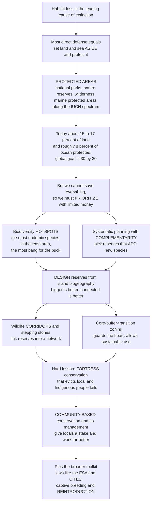

# 🛡️ Protected Areas and Conservation Strategies

> [!abstract] TL;DR
> If **habitat loss is the number-one killer of species**, the most direct defense is almost embarrassingly obvious: **set land and sea aside and protect it**. **Protected areas** — national parks, strict nature reserves, wilderness, and marine protected areas — are conservation's flagship strategy, today covering roughly **15–17% of land and ~8% of the ocean**, with a global goal to reach **"30 by 30"** (30% protected by 2030, the Kunming-Montreal target). But *where* and *how* you protect matters enormously, because **you cannot save everything**. With limited money conservationists face brutal **prioritization** — do you target the **~36 biodiversity hotspots** that pack most of the world's endemic species into a tiny sliver of its land area ("the most bang for the buck")? **Reserve design** draws straight from island-biogeography theory: **bigger is better, connected beats isolated** (hence wildlife **corridors**), and **core-buffer-transition** zoning guards the heart while allowing sustainable use around it. The hard-won modern lesson is that **"fortress conservation"** — walling nature off by evicting local and Indigenous people — often **fails and is unjust**; **community-based** approaches that give locals a stake work far better. Rounding out the toolkit: laws (the Endangered Species Act, CITES), captive breeding, and **reintroduction** (the California condor, wolves). This is conservation's front line — the practical answer to the biodiversity crisis.

---

## Intuition

**Analogy:** Imagine you are handed a **fire and a warehouse full of priceless, irreplaceable paintings**, but only **one fireproof vault** and enough money to move a fraction of the collection into it. You cannot save everything, and the fire is already spreading. What do you do? You do not grab paintings at random. You **triage**: you rush first for the **masterpieces you own nowhere else** — the ones that, if they burn, are gone from the world forever — because that vault space buys you the most irreplaceable value per square foot. And once things are in the vault, you think about *design*: a **bigger vault** is safer than a cramped one, **two vaults connected by a fireproof corridor** are safer than two sealed-off boxes, and a **hardened core with a protective outer shell** beats a single thin wall. Protected areas are exactly this vault, biodiversity is the collection, and habitat loss is the fire.

Now the human twist that took conservation decades to learn. Suppose the warehouse is not empty — **people have lived and worked in it for generations**, and they know every corner better than you do. If your plan is to **lock them out and post armed guards**, they become your enemies: they resent the vault, they have no reason to help fight the fire, and the whole scheme collapses into conflict and injustice. If instead you make them **co-owners of the vault** — give them a stake in what is saved — they become your most effective firefighters. This is the difference between failed **"fortress conservation"** and successful **community-based conservation**. So the real art is not just *building* the vault (protected areas) but deciding **what to put in it (prioritization / hotspots), how to build it (reserve design and corridors), and who guards it (governance and people)** — and backing it all up with laws, seed banks, and the occasional dramatic rescue of a species from the very edge.

---

## How It Works

### Core Mechanics

1. **Set aside space — the flagship move.** A **protected area** is a geographic space, legally or otherwise designated and managed, with conservation of nature as a primary goal. Because **habitat destruction is the leading driver of extinction**, physically protecting habitat is the single most direct countermeasure. Protection is not binary: it runs along a **spectrum** of the six **IUCN management categories**, from strict **Ia nature reserves** and **Ib wilderness** (minimal human presence), through **II national parks** and **III natural monuments**, to **IV habitat/species management**, **V protected landscapes/seascapes**, and **VI areas with sustainable use** of natural resources.
2. **Measure the coverage and set targets.** Global coverage sits near **15–17% of land and ~8% of the ocean**. Under the **Convention on Biological Diversity (CBD)**, the earlier **Aichi Targets** (17% land / 10% sea by 2020) gave way to the **Kunming-Montreal Global Biodiversity Framework (2022)** and its headline **"30 by 30"** goal: **30% of land and sea effectively conserved by 2030**, explicitly including **Indigenous and community lands** and **OECMs** (other effective area-based conservation measures).
3. **Prioritize, because you cannot save everything.** Conservation funding is a fraction of what full protection would cost, so allocation is a **triage** problem. The most influential answer is **biodiversity hotspots** (Myers et al., 2000): regions defined by **exceptional endemism** (many species found nowhere else) *and* **severe threat** (already largely destroyed). The **~36 hotspots** occupy a small fraction of Earth's land yet hold a hugely disproportionate share of endemic plants and vertebrates — a "**silver-bullet**" efficiency argument for concentrating effort there. Complementary schemes include **wilderness/intactness**, **ecoregions** (WWF Global 200), **Key Biodiversity Areas**, **phylogenetic diversity**, and **irreplaceability**.
4. **Plan systematically with complementarity.** **Systematic conservation planning** (Margules & Pressey, 2000) replaces ad-hoc reserve selection with an explicit optimization: represent **all** biodiversity features **efficiently** under a budget. Its key idea is **complementarity** — choose each new reserve for what it **adds** to the existing network (novel species/features), not for its raw richness, so you avoid protecting the same common species over and over. Tools like **Marxan** solve this reserve-selection problem, trading off representation, cost, and **irreplaceability**.
5. **Design reserves from island-biogeography theory.** Fragmented habitat behaves like **habitat islands**, so the theory of island biogeography drives design rules: **bigger reserves** hold larger, more viable populations and lose species more slowly; **connected reserves** (linked by **corridors** and **stepping stones**) sustain **metapopulation** rescue and gene flow; **round, compact shapes minimize edge**; and **core-buffer-transition zoning** (the UNESCO **biosphere-reserve** model) protects a strict core while permitting sustainable activity in surrounding buffers. The old **SLOSS** debate — a **S**ingle **L**arge **O**r **S**everal **S**mall reserves of equal area — sharpened all of this.
6. **Complement in-situ with ex-situ and law.** **In-situ** conservation (protecting species **in the wild**) is the priority, but **ex-situ** measures — **captive breeding, zoos, seed banks, botanical gardens** — act as a safety net and a source for **reintroduction/translocation** (the California condor, black-footed ferret, and wolf recoveries). Wrapping the whole toolkit are **legal instruments**: national laws like the **U.S. Endangered Species Act**, the international wildlife-trade treaty **CITES**, and the umbrella **Convention on Biological Diversity**.
7. **Get the people right — the crucial modern lesson.** Early **"fortress conservation"** created "pristine" parks by **evicting local and Indigenous communities**, producing both **injustice** and **failure** ("paper parks" with no local support, poaching, and conflict). Modern practice favors **community-based conservation**, **Indigenous and community conserved areas (ICCAs)**, **co-management**, and **integrated conservation and development** — recognizing that people living alongside wildlife are essential **allies**, not enemies. This reframes debates like **land sharing vs land sparing** and shifts the metric from area alone to **effectiveness, governance, and equity**.

### Flow / Architecture



---

## Key Concepts

### Secondary (foundational)

- **Protected area** — a place, like a **national park** or **nature reserve**, set aside and looked after so that plants, animals, and their homes are safe from being destroyed. Because **destroying habitat is the biggest reason species vanish**, saving the habitat is the most direct way to save the species.
- **Marine protected area** — the same idea for the **ocean**: a patch of sea where fishing and mining are limited or banned so fish, corals, and whales can recover. A **"no-take" zone** allows no fishing at all.
- **30 by 30** — a worldwide promise to protect **30% of all land and ocean by the year 2030**. Right now only about **15% of land and 8% of the sea** are protected, so there is a long way to go.
- **Biodiversity hotspot** — a special region that is home to a **huge number of unique species found nowhere else**, but is also **badly threatened**. Protecting a hotspot saves lots of species in a small area — the best value for the money.
- **Corridor** — a **strip of protected habitat that connects two reserves**, so animals can move between them to find food, mates, and new homes. Connected parks keep species alive far better than isolated ones.
- **Why not just fence people out?** — early parks kicked local people off their land, which was **unfair and often did not even work**. Today conservationists know that **working with local communities** protects nature much better.

### Undergraduate (core)

- **IUCN protected-area categories (I–VI)** — a spectrum from strict protection to sustainable use: **Ia** strict nature reserve, **Ib** wilderness, **II** national park, **III** natural monument, **IV** habitat/species management, **V** protected landscape/seascape, **VI** sustainable-use area. The spectrum reflects that "protection" ranges from **exclusion** to **coexistence**.
- **Biodiversity hotspots (Myers et al., 2000)** — the two qualifying criteria are **endemism** (≥1,500 endemic vascular plant species) **and threat** (≥70% of original habitat lost). The **~36 hotspots** cover a small percentage of land but harbor a large share of the planet's endemic plants and terrestrial vertebrates — the empirical basis of "**silver-bullet**" prioritization.
- **Systematic conservation planning & complementarity (Margules & Pressey, 2000)** — a structured, transparent method to select reserve networks that **represent** all features **efficiently**. **Complementarity** ranks a site by the **new** features it contributes to the existing set; **irreplaceability** measures how essential a site is to meeting targets. Software: **Marxan**, **Zonation**.
- **Reserve-design principles from island biogeography** — larger reserves (lower extinction, bigger populations), connected over isolated (**corridors**, **stepping stones**, metapopulation rescue), low **edge-to-area** ratio, and buffer zoning. The **SLOSS** debate frames the single-large-vs-several-small trade-off.
- **In-situ vs ex-situ** — **in-situ** protects species in their natural habitat (the priority, because it preserves ecological and evolutionary context); **ex-situ** (zoos, captive breeding, **seed banks**, botanical gardens) is a **safety net** and a source for **reintroduction** and translocation.
- **Legal and policy instruments** — the **Endangered Species Act** (U.S. listing, critical habitat, recovery), **CITES** (regulates/bans international trade in threatened species via Appendices), and the **CBD** (global framework, from Aichi to Kunming-Montreal 30x30).
- **Fortress vs community-based conservation** — **fortress conservation** excludes people (often unjustly and ineffectively); **community-based conservation**, **ICCAs**, and **co-management** integrate local livelihoods and rights, treating residents as **stakeholders and stewards**.

### Graduate (advanced)

- **Reserve selection as an optimization problem** — the core is the **minimum-set** or **maximal-coverage** problem, both NP-hard set-cover variants. Objective: minimize cost subject to representing every feature (minimum-set), or maximize features represented under a budget (maximal-coverage). **Complementarity-based greedy** and **simulated-annealing** (Marxan) heuristics approximate solutions; **irreplaceability** emerges from the frequency with which a site appears across near-optimal solutions.
- **Prioritization frameworks and their value assumptions** — hotspots (**reactive**: high threat) versus **wilderness/last-of-the-wild** (**proactive**: low threat, high intactness) encode different risk philosophies; **phylogenetic diversity (PD)** and **EDGE** prioritize evolutionary distinctiveness rather than species counts. Each scheme optimizes a **different surrogate** for biodiversity, and they do not converge — the choice is partly normative (**species vs places vs processes**).
- **Metapopulation capacity and connectivity conservation** — reserve networks are evaluated by **metapopulation capacity** (a landscape eigenvalue predicting persistence) and **least-cost / circuit-theory connectivity** models. Connectivity conservation scales corridor logic to **large landscapes** (Yellowstone-to-Yukon) and **transboundary** networks, maintaining gene flow and enabling **climate-driven range shifts** across otherwise static reserves.
- **Protected-area effectiveness and "paper parks"** — designation is not protection. Studies (e.g., **Watson et al., 2014**) show many PAs are **understaffed, underfunded, or poorly located**, suffering **PADDD** (protected-area downgrading, downsizing, and degazettement). Effectiveness depends on **management, enforcement, funding, and governance**, and is measured with tools like **METT** and **counterfactual (matching) impact evaluation** to isolate the causal effect of protection on deforestation or species trends.
- **Representation, bias, and gaps** — global PA networks are **biased toward "rock and ice"** — high, cold, remote, economically marginal land — and systematically **under-represent** productive lowlands, freshwater systems, and the open ocean, leaving **coverage gaps** for many threatened species. Gap analysis and **representation targets** address this; 30x30's emphasis shifts from **area** to **areas of particular importance for biodiversity, effectively managed and equitably governed**.
- **Land sharing vs land sparing** — a formal debate about whether biodiversity is better served by **wildlife-friendly farming across large areas** (sharing) or **intensive farming on less land plus strict reserves** (sparing). The answer is context- and taxon-dependent, and hinges on species' density–yield response curves.
- **Environmental justice in conservation** — critical scholarship documents **conservation-induced displacement**, the erosion of Indigenous land rights, and the mismatch between **fortress models** and the reality that Indigenous-managed lands often retain **higher biodiversity**. Equity is now treated not as a constraint on conservation but as a **condition of its durability and legitimacy**.

---

## Python Demo

```python
# Protected areas and conservation strategy in four views:
#   (A) HOTSPOT PRIORITIZATION -- sort regions by endemic-species density and plot the
#       cumulative share of species protected vs the cumulative share of land area. The
#       hotspot-first curve is steeply concave: a small area fraction captures most species
#       ("the most bang for the buck"), versus a random/area-proportional baseline (diagonal).
#   (B) COMPLEMENTARITY -- a systematic-conservation-planning set-cover problem: choosing
#       reserves that ADD new species (complementarity greedy) reaches full representation with
#       far fewer reserves than picking the richest sites (which duplicate) or picking at random.
#   (C) RESERVE DESIGN / CONNECTIVITY -- regional persistence probability vs number of reserves
#       for ISOLATED fragments (no rescue) versus CORRIDOR-connected reserves (rescue effect):
#       connectivity lifts persistence, the quantitative case for corridors.
#   (D) COVERAGE TOWARD 30 BY 30 -- global protected-area coverage of land and ocean over time,
#       with the gap to the 30% by 2030 target.
import numpy as np
import matplotlib.pyplot as plt

rng = np.random.default_rng(7)
fig, axes = plt.subplots(2, 2, figsize=(13.5, 10))

# ------------------------------------------------------------------ (A) HOTSPOTS
n_regions = 250
area = rng.uniform(0.2, 2.0, n_regions)             # relative land-area units
endemism = rng.pareto(1.3, n_regions) + 0.15        # heavy-tailed endemic richness per area
species = area * endemism * 50.0                    # endemic species in each region
density = species / area                            # endemic species per unit area

def cumulative_curve(order):
    a = np.concatenate([[0], np.cumsum(area[order])]);   a /= a[-1]
    s = np.concatenate([[0], np.cumsum(species[order])]); s /= s[-1]
    return a, s

hot_order = np.argsort(density)[::-1]                # hotspots (densest) first
rnd_order = rng.permutation(n_regions)              # random baseline
a_hot, s_hot = cumulative_curve(hot_order)
a_rnd, s_rnd = cumulative_curve(rnd_order)

ax = axes[0, 0]
ax.plot(a_hot * 100, s_hot * 100, color="#b2182b", lw=2.5, label="hotspot-first (target endemism)")
ax.plot(a_rnd * 100, s_rnd * 100, color="#4d9221", lw=2.0, ls="--", label="random / area-proportional")
ax.plot([0, 100], [0, 100], color="grey", lw=0.8, ls=":")
# mark the area fraction that captures 50% of endemic species under hotspot targeting
idx50 = np.searchsorted(s_hot, 0.50)
ax.axhline(50, color="#b2182b", lw=0.8, ls=":")
ax.axvline(a_hot[idx50] * 100, color="#b2182b", lw=0.8, ls=":")
ax.annotate(f"~{a_hot[idx50]*100:.0f}% of land\nholds 50% of endemics",
            xy=(a_hot[idx50] * 100, 50), xytext=(30, 30), fontsize=8.5,
            arrowprops=dict(arrowstyle="->", color="#b2182b"))
ax.set_title("(A) Hotspot prioritization: steep early gains")
ax.set_xlabel("cumulative land area protected  (%)")
ax.set_ylabel("cumulative endemic species protected  (%)")
ax.legend(fontsize=8.5); ax.grid(alpha=0.3)

# ------------------------------------------------------ (B) COMPLEMENTARITY (set cover)
n_sites, n_species = 80, 150
prevalence = rng.uniform(0.02, 0.30, n_species)     # each species' occurrence probability
occ = rng.random((n_sites, n_species)) < prevalence # site x species occupancy
total_species = int((occ.sum(0) > 0).sum())         # species present somewhere

def complementarity(occ):
    covered = np.zeros(occ.shape[1], bool); remaining = list(range(occ.shape[0])); cum = [0]
    while remaining:
        gains = [int((occ[s] & ~covered).sum()) for s in remaining]
        best = remaining[int(np.argmax(gains))]
        covered |= occ[best]; remaining.remove(best); cum.append(int(covered.sum()))
    return np.array(cum)

def by_richness(occ):                                # fixed order, richest sites first
    order = np.argsort(occ.sum(1))[::-1]
    covered = np.zeros(occ.shape[1], bool); cum = [0]
    for s in order:
        covered |= occ[s]; cum.append(int(covered.sum()))
    return np.array(cum)

def random_pick(occ, rng):
    order = rng.permutation(occ.shape[0])
    covered = np.zeros(occ.shape[1], bool); cum = [0]
    for s in order:
        covered |= occ[s]; cum.append(int(covered.sum()))
    return np.array(cum)

cum_comp = complementarity(occ) / total_species * 100
cum_rich = by_richness(occ) / total_species * 100
cum_rand = np.mean([random_pick(occ, rng) for _ in range(20)], axis=0) / total_species * 100

ax = axes[0, 1]
x = np.arange(n_sites + 1)
ax.plot(x, cum_comp, color="#2166ac", lw=2.5, label="complementarity (adds new species)")
ax.plot(x, cum_rich, color="#f6a800", lw=2.0, label="greedy by richness (duplicates)")
ax.plot(x, cum_rand, color="#999999", lw=1.6, ls="--", label="random selection")
ax.axhline(100, color="grey", lw=0.8, ls=":")
ax.set_title("(B) Complementarity represents all species with fewer reserves")
ax.set_xlabel("number of reserves selected")
ax.set_ylabel("species represented  (%)")
ax.set_xlim(0, 40); ax.legend(fontsize=8.5); ax.grid(alpha=0.3)

# ------------------------------------------------------ (C) CONNECTIVITY / RESERVE DESIGN
k = np.arange(1, 13)                                 # number of reserves in the network
s0 = 0.55                                            # per-reserve survival over the horizon, isolated
# Isolated: species persists if >=1 reserve persists, reserves independent
P_isolated = 1.0 - (1.0 - s0) ** k
# Connected: corridors add a rescue effect that raises effective per-reserve survival
s_eff = 1.0 - (1.0 - s0) * np.exp(-0.45 * (k - 1))   # more connected patches rescue each other
P_connected = 1.0 - (1.0 - s_eff) ** k

ax = axes[1, 0]
ax.plot(k, P_connected * 100, "o-", color="#059669", lw=2.2, label="corridor-connected (rescue effect)")
ax.plot(k, P_isolated * 100, "s--", color="#dc2626", lw=2.0, label="isolated fragments (no rescue)")
ax.fill_between(k, P_isolated * 100, P_connected * 100, color="#059669", alpha=0.12)
ax.set_title("(C) Reserve design: connecting reserves raises persistence")
ax.set_xlabel("number of reserves in the network")
ax.set_ylabel("regional persistence probability  (%)")
ax.set_ylim(0, 102); ax.legend(fontsize=8.5); ax.grid(alpha=0.3)

# ------------------------------------------------------ (D) COVERAGE TOWARD 30 BY 30
hist_years = np.array([1990, 2000, 2010, 2016, 2020, 2024])
land_hist  = np.array([8.8, 11.0, 12.7, 14.7, 16.6, 17.5])   # % land protected (illustrative)
ocean_hist = np.array([0.7, 1.0, 2.0, 4.0, 7.4, 8.3])        # % ocean protected (illustrative)
years = np.arange(1990, 2025)
land  = np.interp(years, hist_years, land_hist)
ocean = np.interp(years, hist_years, ocean_hist)

ax = axes[1, 1]
ax.plot(years, land, color="#8c510a", lw=2.4, label="land protected")
ax.plot(years, ocean, color="#2166ac", lw=2.4, label="ocean protected")
ax.plot([2024, 2030], [land[-1], 30], color="#8c510a", lw=1.6, ls=":")
ax.plot([2024, 2030], [ocean[-1], 30], color="#2166ac", lw=1.6, ls=":")
ax.axhline(30, color="#b2182b", lw=1.6, ls="--", label="30 by 30 target")
ax.fill_between([2024, 2030], [land[-1], 30], [30, 30], color="#b2182b", alpha=0.08)
ax.annotate("the gap to close by 2030", xy=(2027, 23.5), fontsize=8.5, color="#b2182b")
ax.set_title("(D) Global coverage vs the 30 by 30 target")
ax.set_xlabel("year"); ax.set_ylabel("area protected  (%)")
ax.set_ylim(0, 34); ax.set_xlim(1990, 2030); ax.legend(fontsize=8.5, loc="upper left")
ax.grid(alpha=0.3)

plt.tight_layout()
plt.savefig("protected_areas_strategies.png", dpi=120)
plt.show()

# ---- console summary ----
print(f"(A) Under hotspot targeting, ~{a_hot[idx50]*100:.0f}% of land holds 50% of endemic species.")
print(f"(B) Complementarity reaches 100% representation after "
      f"{int(np.argmax(cum_comp >= 99.9))} reserves; "
      f"richness-greedy needs {int(np.argmax(cum_rich >= 99.9))}.")
print(f"(C) With 6 reserves: connected persistence {P_connected[5]*100:.0f}% "
      f"vs isolated {P_isolated[5]*100:.0f}%.")
print(f"(D) Current land coverage ~{land[-1]:.0f}% (target 30%); "
      f"ocean ~{ocean[-1]:.0f}% (target 30%).")
```

**What it shows.** **Panel A** makes the hotspot logic quantitative: sort regions by **endemic-species density** and protect the densest first, and the cumulative-species curve rockets upward — a **small fraction of land captures the majority of endemic species**, far outperforming random or area-proportional protection. That steep concavity *is* the "silver-bullet" efficiency argument for hotspots. **Panel B** shows why **complementarity** beats intuition: choosing each reserve for what it **adds** represents every species with the **fewest** reserves, while greedily grabbing the "richest" sites keeps re-protecting the same common species and lags badly. **Panel C** turns island-biogeography design into numbers: a **corridor-connected** network (with a rescue effect) reaches high **regional persistence** with fewer reserves than **isolated** fragments — the quantitative case for **connectivity**. **Panel D** plots the real strategic backdrop: land protection has climbed to ~17% and ocean to ~8%, but both fall well short of the **30% by 2030** line, and the shaded wedge is the gap the world has committed to close. (All figures are illustrative but faithful to the published patterns.)

---

## Real-World Applications

> **Example:** **The "30 by 30" target and the Kunming-Montreal Global Biodiversity Framework.** In 2022, parties to the Convention on Biological Diversity adopted a global goal to **effectively conserve and manage 30% of Earth's land, inland waters, and oceans by 2030**. It is protected-area strategy scaled to the whole planet: it inherits the habitat-preservation logic (set space aside against the number-one extinction driver), embeds **prioritization** (targeting **areas of particular importance for biodiversity**, not just any land), counts **OECMs** and **Indigenous and community lands** (learning the anti-fortress lesson), and demands **effective and equitable governance** rather than mere lines on a map — the modern synthesis of everything in this note.

- **Biodiversity hotspots and Conservation International.** Myers's 2000 hotspots map became the backbone of a multi-billion-dollar prioritization strategy, directing funders (e.g., the Critical Ecosystem Partnership Fund) toward the ~36 regions where the most endemic species are most imperiled — "the most bang for the buck."
- **Marxan and systematic planning of the Great Barrier Reef.** The 2004 rezoning of Australia's Great Barrier Reef Marine Park used **Marxan** to expand **no-take zones** from ~5% to ~33% of the park while minimizing cost to fishers — a landmark application of **complementarity** and systematic conservation planning to a marine protected area.
- **Yellowstone-to-Yukon (Y2Y) connectivity conservation.** A 3,400-km network of parks, reserves, and **wildlife corridors** (including highway overpasses) applies reserve-design and metapopulation theory at continental scale, keeping grizzly bears, wolves, and elk connected across a fragmented landscape and enabling climate-driven range shifts.
- **Reintroduction success stories.** The **California condor** (down to 27 birds, bred in captivity and reintroced), the **black-footed ferret**, and **gray wolf** reintroduction to Yellowstone are flagship **ex-situ safety net plus reintroduction** cases — with the wolves famously triggering a trophic cascade that reshaped the ecosystem.
- **CITES and the ivory trade.** By listing elephants and regulating or banning international trade in ivory, rhino horn, pangolins, and rosewood, **CITES** operationalizes the legal-tool response to overexploitation, complementing habitat protection with demand- and trade-side controls.
- **Community conservancies in Namibia.** Namibia's communal **conservancies** devolve wildlife management and tourism/hunting revenue to local communities, reversing declines in elephants and lions — a widely cited demonstration that **community-based conservation** outperforms the fortress model where people share the landscape with wildlife.

---

## Common Pitfalls

- **Counting area instead of protection ("paper parks").** A designated boundary is not conservation. Without funding, staff, and enforcement, many protected areas fail to reduce deforestation or poaching, and some are quietly downgraded (**PADDD**). Judge a network by **effectiveness and counterfactual impact**, not by the percentage on a map.
- **Protecting "rock and ice."** Because remote, high, cold, economically worthless land is cheapest to protect, global networks are **biased away from the productive lowlands, wetlands, and coastal seas** where biodiversity and threat are highest. Meeting an area target while ignoring **representation and gaps** can leave the most imperiled species unprotected.
- **Selecting reserves by richness instead of complementarity.** Repeatedly protecting the "most species-rich" sites re-covers the same widespread species and wastes budget. **Complementarity** — adding sites for the *new* features they contribute — is essential to represent rare and endemic species efficiently.
- **Building isolated reserves without connectivity.** Protecting patches in isolation ignores the mechanism (metapopulation rescue, gene flow, range shift) that keeps them occupied. Small, sealed-off reserves suffer edge effects and eventually **wink out with no rescue**; corridors and stepping stones are not optional extras.
- **Fortress conservation — excluding the people.** Evicting or criminalizing local and Indigenous residents produces **injustice, conflict, and failure**: alienated communities have no stake in enforcement. Ignoring rights and livelihoods is both unethical and, empirically, a recipe for a park that does not work.
- **Treating ex-situ as a substitute for the wild.** Zoos and seed banks are a **safety net**, not a replacement for **in-situ** protection. Captive-bred animals can lose fitness and behaviors, reintroduction is expensive and often fails without habitat, and betting on "we can always breed them back" removes pressure to protect the habitat that actually sustains them.
- **Assuming static reserves are enough under climate change.** Fixed boundaries cannot follow species whose suitable climate is shifting poleward and upward. Without **connectivity** and forward-looking placement, a reserve can become a beautifully protected box that its target species must leave to survive.

---

## Related Concepts

- [[Ecology_and_Conservation_Overview]] — the vault hub that frames protected areas and conservation strategy as the **applied front line** atop population, community, and ecosystem ecology.
- [[Metapopulations_and_Spatial_Ecology]] — the scientific rationale for **corridors and reserve networks**: patch occupancy, the rescue effect, and connectivity are exactly what reserve design must preserve.
- [[Biodiversity_and_Species_Richness]] — the measurement of *what* protected areas aim to represent (richness, endemism, evenness), and the currency that hotspot prioritization and complementarity optimize.
- [[Ecosystem_Services]] — the **instrumental value** case that funds protection (natural-capital accounting, REDD+, payments for ecosystem services) and motivates protecting habitat beyond charismatic species.
- [[Biodiversity_and_Conservation]] — Biology's foundational treatment of the same theme; this note is the strategy-and-governance deep-dive that extends it (distinct basename by design).
- [[Climate_Politics_and_Environmental_Governance]] — the political-science view of how global targets like the CBD's 30x30 are negotiated, financed, and enforced across sovereign states.
- [[Environmental_Justice_and_Sustainability]] — the ethics of **fortress conservation**, conservation-induced displacement, and Indigenous land rights that makes community-based approaches a matter of justice, not just effectiveness.
- [[Sustainability_and_Planetary_Boundaries]] — the systems-level frame in which biosphere-integrity loss is a transgressed planetary boundary that protected-area networks are meant to help pull back.
- [[Ecological_Resilience_and_Ecosystems]] — why bigger, connected, redundant reserve networks confer the resilience that lets ecosystems absorb disturbance without regional collapse.

This note is a sibling to the other notes in the biodiversity-and-conservation-biology section, referenced here in prose: **Conservation_Biology_and_the_Biodiversity_Crisis** (the crisis-discipline opener and the HIPPO drivers this strategy answers), **Habitat_Loss_Fragmentation_and_Island_Biogeography** (the number-one driver and the island-biogeography theory that reserve design is built on), **Population_Viability_and_Small_Population_Biology** (why small, isolated reserve populations wink out, the demographic basis for "bigger and connected"), **Ecosystem_Based_Management_and_Rewilding** (the process- and landscape-scale complement to species- and site-based protection, including reintroduction), and **Indigenous_Knowledge_and_Community_Conservation** (the governance and equity foundation of community-based conservation and ICCAs).

---

## Review Questions

1. **(Secondary)** Why is creating **protected areas** such a direct way to fight extinction? Explain in your own words what a **biodiversity hotspot** is and why protecting one "gives the most bang for the buck." What is a wildlife **corridor** and why does it help?
2. **(Undergraduate)** A conservation agency has a fixed budget and a list of candidate reserves, each containing a known set of species. Explain why selecting reserves by **complementarity** represents more species than selecting the individually **richest** reserves. How does this relate to the concepts of **irreplaceability** and **representation** in systematic conservation planning?
3. **(Undergraduate)** State three **reserve-design principles** that follow from **island-biogeography theory**, and explain the mechanism behind each. What is the **SLOSS** debate, and why can the answer differ between a landscape of widespread species and one of many narrow endemics?
4. **(Graduate)** A government announces it has met the "30 by 30" land target. As a reviewer, what questions would you ask before accepting that biodiversity is actually being protected? Address **representation bias ("rock and ice")**, **paper parks and effectiveness**, **connectivity under climate change**, and **governance and equity**, and describe how a **counterfactual (matching) impact evaluation** could test the claim.
5. **(Graduate)** "Fortress conservation" and "community-based conservation" represent opposite theories of how to protect nature where people live. Using a concrete example, argue why excluding local and Indigenous communities can cause a protected area to **fail** on its own biodiversity terms, and explain how devolving rights and benefits can align local incentives with conservation. Where might strict exclusion still be justified?

---

## Sources

- Primack, R. B. *Essentials of Conservation Biology* (Sinauer/Oxford University Press) — the standard text covering protected areas, reserve design, prioritization, and the human dimension.
- Myers, N., Mittermeier, R. A., Mittermeier, C. G., da Fonseca, G. A. B., & Kent, J. (2000). "Biodiversity hotspots for conservation priorities." *Nature*, 403, 853–858. [DOI](https://doi.org/10.1038/35002501) — the foundational hotspots prioritization paper.
- Margules, C. R., & Pressey, R. L. (2000). "Systematic conservation planning." *Nature*, 405, 243–253. [DOI](https://doi.org/10.1038/35012251) — the framework and the principle of complementarity.
- Watson, J. E. M., Dudley, N., Segan, D. B., & Hockings, M. (2014). "The performance and potential of protected areas." *Nature*, 515, 67–73. [DOI](https://doi.org/10.1038/nature13947) — effectiveness, funding, "paper parks," and the potential of protected areas.
- Convention on Biological Diversity (2022). *Kunming-Montreal Global Biodiversity Framework* — the "30 by 30" target and equitable, effective area-based conservation. [CBD](https://www.cbd.int/gbf/)

---

#ecology #protected-areas #biodiversity-hotspots #reserve-design #conservation-strategy
