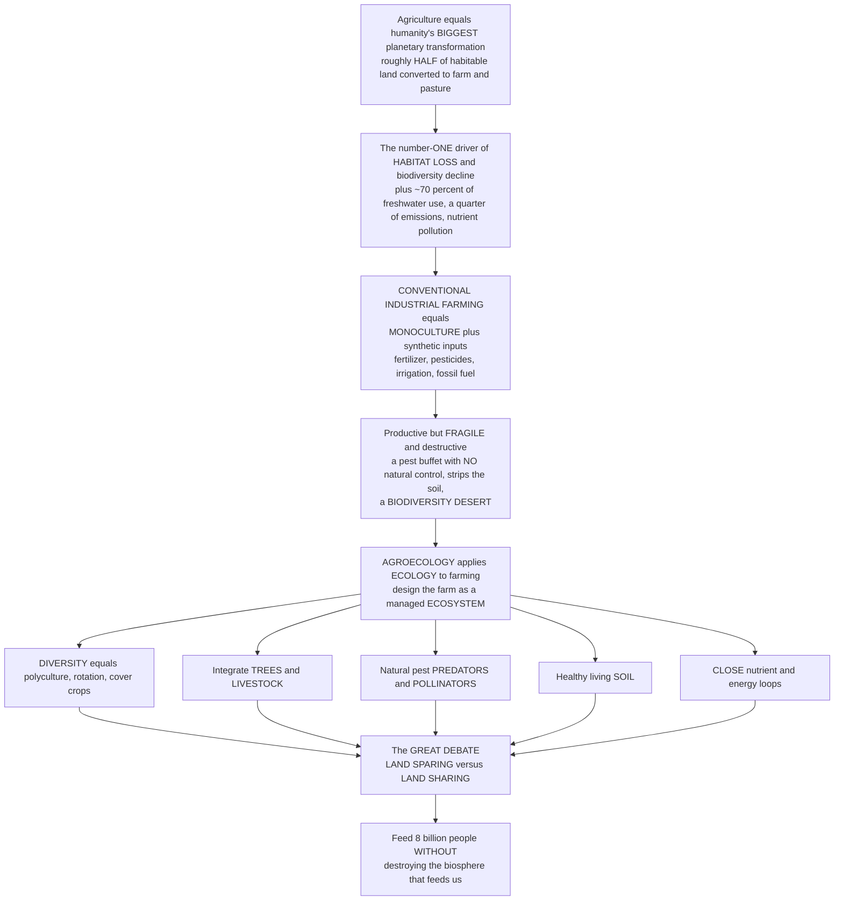

# 🌾 Agroecology and Food Systems

> [!abstract] TL;DR
> **Agroecology** is the science of **applying ecological principles to how we feed the world** — and it exists because agriculture is, by a wide margin, **humanity's single biggest transformation of the planet**. To feed ourselves we have converted **roughly half of all habitable land** to cropland and pasture, making food production the **number-one driver of habitat loss and biodiversity decline**, the consumer of **~70% of humanity's freshwater withdrawals**, the source of **a quarter or more of greenhouse-gas emissions**, and a leading cause of **nutrient pollution** and soil degradation. Conventional **industrial agriculture** treats a field like a factory: a **monoculture** (one crop over vast areas) kept productive by pouring in synthetic **fertilizer**, **pesticides**, irrigation, and fossil fuel. It is astonishingly productive but ecologically **fragile and destructive** — a monoculture is a pest buffet with no natural control, it strips the soil, and it is a biodiversity desert. Agroecology asks the opposite question: *what if we designed farms to work **with** ecology rather than against it?* — mimicking natural ecosystems' **diversity and self-regulation** through polycultures, crop rotation, agroforestry, integrated livestock, fostering natural pest predators and pollinators, building living soil, and closing nutrient loops. The field's defining debate is **land sparing vs land sharing**: farm intensively on less land to spare wild habitat elsewhere, or farm more gently and biodiversity-friendly across more land. How we feed 8+ billion (soon ~10 billion) people without destroying the biosphere that feeds us may be the single most consequential **applied ecological question of the century**.

---

## Intuition

**Analogy:** Imagine two ways to run a kitchen garden. The first is a **billboard-sized field of a single crop** — say, endless identical rows of corn. It is efficient to plant and harvest, but ecologically it is a **loaded gun**: to a corn-eating pest, it is an all-you-can-eat buffet stretching to the horizon with no predators, no barriers, and no escape — so the only way to protect it is to spray, and spray, and spray. Every drop of fertility you take out you must pump back in as a synthetic bag of nitrogen; every insect you kill takes the helpful ones with it; and the soil, worked bare between harvests, blows and washes away. It works — spectacularly, in raw tonnage — but it is a machine that runs only as long as you keep feeding it fuel, and it leaves a desert around itself. The second garden is a **messy, layered thicket**: beans climbing the corn and fixing their own nitrogen, squash shading out weeds, flowers along the edges feeding the wasps and ladybugs that eat the pests for free, chickens turning scraps into fertilizer, a tree throwing shade and dropping leaves that rebuild the soil. It yields a little less of any one thing, but it **feeds and defends itself**, and when a pest or a drought hits, the whole plot does not collapse at once.

That contrast **is** the difference between industrial agriculture and **agroecology**. The first garden is a **monoculture** propped up by synthetic inputs; the second is an **agroecosystem** engineered to behave like a natural ecosystem — diverse, self-regulating, and resilient. And behind the whole debate sits a planetary fact that is easy to miss: growing food is the **largest single thing our species does to the Earth's surface**. We have already turned about **half of all the land plants could grow on** into farm and pasture, which means the way we farm is the biggest lever we have on wild nature. That forces a genuine dilemma — the great debate of feeding the world sustainably. Do we **spare land** (farm a small area as intensively as possible so the rest can stay wild) or **share land** (farm a large area gently, weaving wildlife back into the fields)? Both save biodiversity in theory; they cannot both be right everywhere. Getting this question right — feeding **eight billion people without dismantling the biosphere that sustains them** — is arguably the most important applied problem in all of ecology.

---

## How It Works

### Core Mechanics

1. **Agriculture is the biosphere's biggest makeover.** Feeding humanity, not cities or industry, is what has reshaped the planet's surface. Roughly **half of habitable (ice-free, non-desert) land** is now cropland or pasture; agriculture drives the **majority of deforestation and habitat conversion** (the number-one cause of the biodiversity crisis), withdraws **~70% of all freshwater** humans use, emits **a quarter or more of greenhouse gases** (land clearing, livestock methane, rice paddies, fertilizer manufacture and its nitrous oxide), and is the dominant source of the **reactive nitrogen and phosphorus** that run off fields and choke rivers, lakes, and coasts. Every acre farmed is an acre not left to wild nature — so *how* we farm is the master variable in conservation.

2. **The industrial / conventional model: monoculture + synthetic inputs.** The 20th-century **Green Revolution** roughly tripled cereal yields by combining high-yielding crop varieties with a package of inputs: vast **monocultures** (single-crop stands that simplify mechanization and maximize output per worker), synthetic **nitrogen fertilizer** (the Haber–Bosch process, which fixes atmospheric N₂ into ammonia and now supplies the nitrogen behind roughly half the food calories on Earth), chemical **pesticides and herbicides**, large-scale **irrigation**, and heavy **fossil-fuel** use for machinery, transport, and the fertilizer itself. It succeeded at its one goal — calories per hectare — and helped avert mass famine as populations soared.

3. **Why the industrial model is ecologically fragile.** A monoculture concentrates a single, uniform resource across space, which is exactly what a specialist pest or pathogen needs to explode — there is no diversity to slow it and few natural enemies to check it, so the system becomes **chemically dependent** (spray or lose the crop), and pests evolve **resistance**, demanding ever more spraying (the "pesticide treadmill"). The same simplification **degrades the soil** (continuous cropping without cover mines organic matter and invites erosion), **harms non-target life** (pesticides kill pollinators and beneficial insects; some, like the organochlorines, **biomagnify** up food chains), and turns the field into a **biodiversity desert**. High output, low resilience.

4. **Agroecology: design farms as managed ecosystems.** Agroecology applies the principles of ecology — diversity, competition, mutualism, nutrient cycling, food-web regulation — to **design agroecosystems that supply their own fertility and pest control**. Its core strategies:
   - **Diversification** — **polycultures** (multiple crops grown together), **intercropping**, **crop rotation** (breaking pest cycles and alternating nitrogen-fixing legumes with heavy feeders), and **cover crops** (protecting and feeding the soil between harvests). Diversity provides an **insurance effect**: uncorrelated crop responses buffer the whole farm against any single pest, disease, or weather shock.
   - **Integrating trees and livestock** — **agroforestry** (crops beneath or beside trees for shade, deep nutrient capture, and habitat) and **crop–livestock integration** (animals convert residues into fertilizer, closing loops).
   - **Biological pest control** — fostering the **natural enemies** (predatory and parasitic insects, birds, bats) and **pollinators** that a diverse landscape shelters, so the ecosystem does the spraying for free (**ecosystem services** from wild biodiversity).
   - **Building soil health** — maximizing **organic matter, living soil biota, and decomposition-driven nutrient cycling** rather than relying on synthetic inputs.
   - **Closing nutrient and energy loops** — recycling residues and manure, fixing nitrogen biologically, and minimizing external inputs so the farm approaches the near-closed cycling of a natural ecosystem.
   Related practice families include **regenerative agriculture**, **permaculture**, **organic** farming, and **integrated pest management (IPM)**. Agroecology also has an explicit **social dimension** — **food sovereignty**, support for **smallholders**, and the revaluing of **traditional and Indigenous agricultural knowledge**.

5. **The great debate: land sparing vs land sharing.** For a fixed amount of food the world must produce, biodiversity can be protected two opposite ways. **Land sparing** intensifies yields on the smallest possible footprint so that the maximum area of wild habitat is left untouched — its logic rests on the **density–yield relationship**: because most wild species tolerate farmland very poorly, their density collapses steeply as any farming intensifies, so it is better to concentrate the damage and keep large blocks pristine. **Land sharing** instead spreads gentler, wildlife-friendly, lower-yield farming across more land, weaving biodiversity **into** the agricultural matrix. The empirical answer depends on the *shape* of each species' density–yield curve; evidence (Green et al. 2005 and later studies) suggests **most species are "losers" that favor sparing**, while a minority of farmland-adapted species favor sharing — which is why the compromise banner is **"sustainable intensification"** (raise yields *and* reduce environmental harm, then protect the spared land).

6. **Beyond the farm: the whole food system.** Sustainability is not decided at the field edge alone. **Diet** is a giant lever — ruminant meat (beef, lamb) uses roughly an order of magnitude more land, water, and emissions per calorie or gram of protein than plants — so shifting diets can free enormous areas. **Food waste** (~a third of food produced is lost or wasted) squanders all the land, water, and emissions embodied in it. And the honest target is feeding **~10 billion people within planetary boundaries** — the safe operating space for nitrogen, phosphorus, freshwater, land-system change, and biosphere integrity that agriculture is currently the chief transgressor of.

### Flow / Architecture



---

## Key Concepts

### Secondary (foundational)

- **Farming changed the planet more than anything else we do** — to grow food, humans have turned about **half of all usable land** into fields and pasture. That makes farming the **biggest reason wild habitats and animals are disappearing**, and it uses most of the fresh water people take from rivers and lakes.
- **Monoculture** — growing **one single crop** across a huge area. It is easy to plant and harvest and produces a lot, but it is like an open buffet for pests, so farmers must **spray chemicals** to protect it, and it leaves almost no room for wildlife.
- **Fertilizer and pesticides** — a monoculture cannot feed or defend itself, so farmers add **synthetic fertilizer** (plant food from a factory) and **pesticides** (bug killer). These boost yields but can **pollute rivers** and harm helpful insects like **bees**.
- **Agroecology** — farming that **copies nature** instead of fighting it: mix many crops together, plant trees, let good bugs eat the bad bugs, keep the soil alive, and recycle nutrients. A diverse farm **defends itself** and does not collapse all at once when trouble hits.
- **The big choice (sparing vs sharing)** — to feed everyone while saving nature, we can either **farm a small area very intensively and leave the rest wild** (sparing), or **farm gently over a big area with wildlife mixed in** (sharing). Deciding which is better is one of ecology's biggest questions.

### Undergraduate (core)

- **Agriculture's ecological footprint** — food production is the **dominant human land use** (~50% of habitable land), the leading cause of **deforestation and habitat conversion**, ~70% of global **freshwater withdrawals**, ~a quarter-plus of **greenhouse-gas emissions**, and the primary source of **nutrient pollution** (fertilizer runoff → **eutrophication** and coastal dead zones). The core tension: a still-growing population needs more food while conservation needs more untouched land.
- **The Green Revolution and the high-input model** — mid-20th-century yield gains from high-yielding varieties + **synthetic N fertilizer (Haber–Bosch)** + pesticides + irrigation + mechanization. It roughly tripled cereal output and averted famine, at the cost of biodiversity loss, soil degradation, water pollution, and heavy fossil-energy dependence.
- **Why monocultures are fragile** — spatial uniformity removes the diversity and natural enemies that regulate pests, producing **outbreak vulnerability**, **pesticide dependence**, evolved **resistance** (the pesticide treadmill), pollinator harm, biomagnification of persistent chemicals, soil-organic-matter loss, and erosion. High yield, low resilience.
- **Agroecological principles** — diversification (**polyculture, rotation, intercropping, cover crops**), **agroforestry** and **crop–livestock integration**, **biological pest control** via conserved natural enemies, **pollination** by wild and managed insects, **soil health** via organic matter and decomposition, and **closing nutrient/energy loops** to cut external inputs — in short, **mimicking the structure and self-regulation of natural ecosystems**.
- **The diversity–stability / insurance effect in farming** — greater crop and genetic diversity **buffers yield** against pests, disease, and weather because different crops respond differently (a portfolio effect): the diversified field's total output has **lower variance** than any single crop, so it does not crash all at once. This is the applied face of the ecological diversity–stability relationship.
- **Land sparing vs land sharing** — the framing of Green et al. (2005): for a fixed production target, compare total wildlife under **high-yield/small-area** vs **low-yield/large-area** farming. The winner depends on the **density–yield curve**: convex-declining ("loser") species favor **sparing**; concave ("winner", farmland-tolerant) species favor **sharing**. **Sustainable intensification** is the attempt to raise yields while reducing per-unit harm so spared land can be protected.
- **Food-system sustainability beyond the farm** — **dietary footprint** (ruminant meat vs plants differ ~10× in land/water/emissions per calorie), **food waste** (~1/3 of production), supply chains, and the goal of feeding **~10 billion within planetary boundaries**. Agriculture both **depends on** ecosystem services (pollination, pest control, soil, water) and **degrades** them (disservices: pollution, habitat loss).

### Graduate (advanced)

- **The density–yield relationship and the sparing–sharing formalism** — model species density *d(Y)* as a function of farming yield *Y ∈ [0,1]*. For a fixed regional production target *T* on a unit landscape, **sharing** farms the whole area at yield *Y = T*, giving total population *d(T)*; **sparing** farms fraction *T* at maximum yield (population ≈ 0 there) and keeps *(1−T)* pristine at *d(0)*, giving ≈ *d(0)·(1−T)*. Sparing beats sharing whenever *d(T) < d(0)(1−T)* — i.e. whenever the density–yield curve is **convex-declining**, which empirically describes the **majority of species**. The debate is therefore not ideological but an **empirical question about curve shapes**, land-use baselines, and whether high yields *actually* spare land (the **Jevons/rebound** caveat: intensification can *induce* expansion rather than spare it unless coupled to protection).
- **Nitrogen, phosphorus, and planetary boundaries** — the **Haber–Bosch** doubling of reactive nitrogen and the mining of phosphorus have pushed the biogeochemical-flow **planetary boundaries** furthest into the danger zone of all nine. Fertilizer-use efficiency is low (much N is lost as runoff → **eutrophication**, or as **N₂O**, a potent greenhouse gas), making nutrient-loop closure and precision application central to any within-boundaries food system.
- **Agrobiodiversity and functional redundancy** — resilience of pest regulation and pollination scales with the **functional diversity** of natural enemies and pollinators and with **landscape complexity** (non-crop habitat, hedgerows, field-margin refugia). Simplified landscapes lose the **spatial insurance** that supplies these regulating services, tightening chemical dependence — an agroecosystem analog of the biodiversity–ecosystem-function literature.
- **Yield gaps, closure, and the intensification frontier** — much of the world's cropland produces well below its climatic-potential yield; **closing yield gaps** on existing land (better nutrients, water, genetics, agronomy) is, per Foley et al. (2011), a larger lever for feeding 10 billion than new land conversion — provided it is **sustainable** intensification (higher output *and* lower per-unit water, N, and biodiversity cost), not merely more inputs.
- **Diet, demand-side leverage, and the "cultivated planet" solution set** — Foley et al. frame a five-part strategy: **halt agricultural expansion** (spare habitat), **close yield gaps**, **raise resource-use efficiency**, **shift diets** (less ruminant meat), and **cut waste**. The demand side (diet + waste) can rival the supply side: a large share of crop calories and most agricultural land support animal feed and pasture, so dietary change is among the highest-leverage, least-appreciated conservation actions.
- **Agroecology as science, practice, and movement** — the field spans a **descriptive science** (the ecology of agroecosystems), a **set of practices** (diversification, IPM, regenerative methods), and a **social movement** (food sovereignty, smallholder rights, Indigenous knowledge). Debates persist over whether agroecological systems can match industrial yields at scale, how to value their lower external costs, and how sparing/sharing and sustainable intensification reconcile with agroecology's low-input, landscape-integrated ethos.

---

## Python Demo

```python
# Agroecology and food systems, two demonstrations:
#   (A) DIVERSITY -> RESILIENCE (the "insurance effect"): simulate yield over 40 years for a
#       MONOCULTURE (high mean, but a single pest/disease can crash the whole field) versus a
#       diversified POLYCULTURE (slightly lower mean, but uncorrelated crop responses buffer
#       shocks). Compare their yield stability (mean / standard deviation).
#   (B) LAND SPARING vs LAND SHARING (Green et al. 2005 density-yield model): for a fixed food
#       production target, plot total wild population retained under high-yield/small-area
#       SPARING vs low-yield/large-area SHARING, for a sensitive "loser" species and a
#       farmland-tolerant "winner" species -- showing the answer depends on the density-yield curve.
import numpy as np
import matplotlib.pyplot as plt

rng = np.random.default_rng(42)

# ============================================================
# (A) Monoculture vs polyculture under recurring pest/disease outbreaks
# ============================================================
years = np.arange(0, 40)
base = 100.0

# MONOCULTURE: ~15% higher baseline when healthy, but catastrophic all-or-nothing crashes
# (one pest can wipe the single crop -- no natural control).
mono = np.full(len(years), base * 1.15) + rng.normal(0, 4, len(years))
outbreak_years = [8, 19, 20, 31]
for oy in outbreak_years:
    mono[oy] *= 0.25                       # crop collapse

# POLYCULTURE: 5 crops, each hit by its OWN (uncorrelated) pest in different years.
# The diversified field = average of the crops -> shocks are damped (portfolio/insurance effect).
n_crops = 5
crops = np.zeros((n_crops, len(years)))
for c in range(n_crops):
    ci = np.full(len(years), base) + rng.normal(0, 6, len(years))
    for oy in rng.choice(years, size=3, replace=False):
        ci[oy] *= 0.45
    crops[c] = ci
poly = crops.mean(axis=0)

stability = lambda x: x.mean() / x.std()   # inverse coefficient of variation
S_mono, S_poly = stability(mono), stability(poly)

# ============================================================
# (B) Land sparing vs land sharing (density-yield model)
# ============================================================
T = np.linspace(0.02, 0.98, 200)           # production target (share of max regional output)
d0 = 1.0                                    # density in pristine habitat (yield Y = 0)
p_loser, q_winner = 3.0, 3.0
d_loser  = lambda Y: d0 * (1 - Y) ** p_loser      # convex: collapses as farming intensifies
d_winner = lambda Y: d0 * (1 - Y ** q_winner)     # concave: tolerant of low-intensity farming

# SHARING: whole unit landscape farmed at yield Y = T  -> population = d(T)
share_loser, share_winner = d_loser(T), d_winner(T)
# SPARING: farm fraction T at max yield (Y=1, pop ~ 0), spare (1 - T) as pristine (Y=0)
spare = d0 * (1 - T)                        # same for both species (farmed land ~ empty)

# ============================================================
# Plot
# ============================================================
fig, (ax1, ax2) = plt.subplots(1, 2, figsize=(14, 5.2))

# --- Panel A ---
ax1.plot(years, mono, color="#c0392b", lw=2, marker="o", ms=3, label=f"Monoculture (stability {S_mono:.1f})")
ax1.plot(years, poly, color="#2e8b57", lw=2, marker="s", ms=3, label=f"Polyculture (stability {S_poly:.1f})")
for oy in outbreak_years:
    ax1.annotate("pest\noutbreak", xy=(oy, mono[oy]), xytext=(oy, mono[oy] - 45),
                 ha="center", fontsize=7, color="#c0392b",
                 arrowprops=dict(arrowstyle="->", color="#c0392b", lw=1))
ax1.axhline(base, ls=":", color="gray", alpha=0.6)
ax1.set_xlabel("Year")
ax1.set_ylabel("Yield index")
ax1.set_title("(A) Diversity -> resilience:\nmonoculture crashes, polyculture buffers (insurance effect)")
ax1.legend(fontsize=8, loc="lower left")
ax1.grid(alpha=0.3)
ax1.set_ylim(0, 140)

# --- Panel B ---
ax2.plot(T, spare, color="black", lw=2.5, label="SPARING (any species): d0 x (1 - T)")
ax2.plot(T, share_loser, color="#c0392b", lw=2, ls="--",
         label="SHARING, 'loser' species -> sparing wins")
ax2.plot(T, share_winner, color="#2e8b57", lw=2, ls="--",
         label="SHARING, 'winner' species -> sharing wins")
ax2.fill_between(T, spare, share_loser, where=(spare > share_loser),
                 color="#c0392b", alpha=0.10)
ax2.fill_between(T, share_winner, spare, where=(share_winner > spare),
                 color="#2e8b57", alpha=0.10)
ax2.set_xlabel("Food production target  (share of max regional output)")
ax2.set_ylabel("Total wild population retained  (fraction)")
ax2.set_title("(B) Land sparing vs land sharing:\nthe density-yield curve decides")
ax2.legend(fontsize=7.5, loc="upper right")
ax2.grid(alpha=0.3)
ax2.set_ylim(0, 1.02)

plt.tight_layout()
plt.savefig("agroecology_food_systems.png", dpi=120)
plt.show()

# ---- console summary ----
print("=== (A) Yield resilience over 40 years ===")
print(f"  Monoculture : mean {mono.mean():6.1f}, std {mono.std():5.1f}, stability {S_mono:.2f}")
print(f"  Polyculture : mean {poly.mean():6.1f}, std {poly.std():5.1f}, stability {S_poly:.2f}")
print(f"  -> the polyculture yields a bit less on average but is ~{S_poly / S_mono:.1f}x more STABLE\n")

print("=== (B) Sparing vs sharing at a 40% production target ===")
i = np.argmin(np.abs(T - 0.40))
print(f"  Spared wild population           : {spare[i]:.2f}")
print(f"  Sharing, sensitive 'loser'       : {share_loser[i]:.2f}  -> SPARING better")
print(f"  Sharing, tolerant 'winner'       : {share_winner[i]:.2f}  -> SHARING better")
print("  -> most species are 'losers', so land sparing usually retains more biodiversity.")
```

**What it shows.** **Panel A** is the ecological case for diversity made quantitative. The red **monoculture** posts a higher average yield when healthy, but because a single pest or pathogen can sweep an entire uniform crop with no natural check, it suffers periodic **catastrophic collapses** — the years where the line plunges. The green **polyculture** averages several crops whose pests strike independently, so those shocks partly cancel: it yields a little less on average but is markedly **more stable** (higher mean/std), and it never crashes all at once. That damping is the **insurance / portfolio effect** — the applied face of the diversity–stability relationship and the core reason agroecology diversifies. **Panel B** formalizes the **land sparing vs land sharing** debate with the density–yield model. The black **sparing** line (farm a small area intensively, keep the rest pristine) falls linearly with how much food we demand. The dashed **sharing** lines (farm everything gently) depend on the species: for a sensitive **"loser"** whose density collapses as soon as farming intensifies (red, convex), sparing retains far more wildlife; for a farmland-tolerant **"winner"** (green, concave), sharing wins. Because *most* wild species are losers, the evidence generally favors **land sparing plus protection of the spared land** — the empirical heart of the debate rather than a matter of taste.

---

## Real-World Applications

> **Example:** **The push-pull system in East African maize.** A textbook agroecological design, developed by ICIPE, intercrops maize with **Desmodium** (a nitrogen-fixing legume that "pushes" stemborer pests away and suppresses the parasitic *Striga* weed) and borders the field with **Napier grass** (that "pulls" pests in and traps them). The result: sharply reduced stemborer and *Striga* damage, improved soil nitrogen, fodder for livestock, and higher, more stable yields for smallholders — **with essentially no synthetic pesticide**. It is agroecology in miniature: diversity engineered to deliver pest control, soil fertility, and resilience as emergent ecosystem services rather than purchased inputs.

- **The Green Revolution and its double legacy** — high-yielding wheat and rice varieties plus fertilizer, pesticides, and irrigation roughly tripled cereal output and averted predicted famines in Asia and Latin America — the archetypal land-*sparing* success in raw calories — while leaving a legacy of aquifer depletion, salinization, biodiversity loss, and fertilizer pollution that motivates the agroecological correction.
- **Integrated Pest Management (IPM) in rice** — monitoring pests and conserving natural enemies (spiders, parasitic wasps) instead of calendar spraying cut insecticide use dramatically across Asian rice systems (notably Indonesia's national IPM program), demonstrating that **biological control is a real, scalable input substitute**.
- **Cover cropping and no-till (regenerative agriculture)** — planting cover crops and minimizing tillage rebuilds soil organic matter, cuts erosion and fertilizer runoff, improves water infiltration, and stores carbon — now spreading across large-scale row-crop agriculture in the US Midwest and elsewhere as a partial reconciliation of yield with soil and water health.
- **Land-sparing conservation policy** — set-aside and "sustainable intensification" schemes (e.g. protecting high-carbon, high-biodiversity forest while raising yields on existing farmland) apply the density–yield logic; conversely, EU agri-environment schemes, hedgerow and field-margin subsidies, and organic certification pursue the **land-sharing** strategy of wildlife-friendly farming.
- **The EAT–Lancet planetary-health diet and food-waste initiatives** — demand-side food-system interventions: dietary shifts toward plants and less ruminant meat, plus halving food loss and waste, are quantified as among the largest available levers for keeping agriculture within planetary boundaries — conservation achieved at the fork, not just the field.

---

## Common Pitfalls

- **Forgetting that food is the biggest driver of the biodiversity crisis.** Conservation debates often fixate on poaching, pollution, or climate while **habitat conversion for agriculture** quietly does the most damage of all. Any serious conservation strategy that ignores *how and where we farm* is addressing a symptom, not the primary cause.
- **Treating high yield as automatically "sustainable."** Raw output per hectare says nothing about the water pumped, nitrogen leaked, soil lost, pollinators killed, or fossil energy burned to achieve it. **Sustainable intensification** means higher yield *and* lower per-unit environmental cost together; conflating the two lets input-heavy industrial farming masquerade as green.
- **Assuming intensification automatically spares land (the rebound trap).** Higher yields free land *only if* that land is then protected. Absent policy, cheaper, more profitable farming can **induce expansion** (a Jevons/rebound effect), so intensification without conservation of the spared land can *increase* total habitat loss — the sparing argument's biggest real-world caveat.
- **Believing agroecology means "no technology" or guaranteed lower yields.** Agroecology is knowledge- and design-intensive, not primitive; it uses breeding, monitoring, and precision where they help. Its yield gap versus industrial systems varies enormously by crop and context — sometimes small or reversed once external costs and resilience are counted — so blanket claims in either direction are wrong.
- **Ignoring the demand side.** Endless argument about how to *produce* food overlooks that **diet and waste** are enormous levers: a third of food is wasted, and ruminant meat's land and emissions footprint dwarfs plants'. Optimizing only the supply side leaves the cheapest conservation gains on the table.
- **Framing sparing vs sharing as an ideology rather than an empirical question.** Which strategy retains more biodiversity depends on measurable **density–yield curves**, the conservation value of the baseline habitat, and whether spared land is actually protected. Picking a side on principle, rather than on the species and landscape in question, misreads the science.

---

## Related Concepts

This is the section opener for **applied ecology in the age of global change**, and food is where humanity's ecological footprint is largest. Its closest in-vault siblings are prose references: **Human_Population_and_the_Anthropocene** supplies the demographic driver — more people and rising consumption — that makes feeding the world the central pressure on nature; **Conservation_Biology_and_the_Biodiversity_Crisis** is where agriculture appears as the number-one HIPPO driver (habitat loss) that agroecology and land sparing try to relieve; **Nutrient_Cycling_and_Decomposition** is the biology of the soil fertility and closed nutrient loops that agroecology rebuilds and that synthetic fertilizer short-circuits; **Pollution_and_Ecotoxicology** develops the fertilizer-runoff eutrophication, pesticide biomagnification, and pollinator harm sketched here; and **Ecosystem_Services** frames pollination, pest control, and soil as the services farming both depends on and degrades. Those five are prose-only because they are in-vault siblings of this note.

- [[Ecology_and_Conservation_Overview]] — the vault hub placing agroecology as an applied capstone atop population, community, and ecosystem ecology.
- [[Habitat_Loss_Fragmentation_and_Island_Biogeography]] — the number-one driver agriculture causes; the land-sparing-vs-sharing debate is fundamentally an argument about minimizing this habitat conversion.
- [[Mutualism_Commensalism_and_Symbiosis]] — pollination and legume nitrogen fixation are the mutualisms agroecology harnesses in place of purchased inputs.
- [[Predator_Prey_and_Population_Interactions]] — the predator–prey dynamics behind biological pest control: fostering natural enemies so the ecosystem does the spraying.
- [[Biodiversity_and_Species_Richness]] — quantifies the diversity whose insurance effect stabilizes polyculture yields and whose loss makes monocultures fragile.
- [[Ecological_Stability_Resilience_and_Tipping_Points]] — the diversity–stability and resilience theory underlying why diversified farms resist pest, disease, and weather shocks.
- [[Global_Biogeochemical_Cycles]] — the nitrogen and phosphorus cycles that Haber–Bosch fertilizer overloads, driving eutrophication and transgressing planetary boundaries.
- [[Food_Webs_and_Trophic_Dynamics]] — the trophic structure of agroecosystems and the biomagnification of persistent pesticides up the food chain.
- [[Ecosystem_Ecology_and_Energy_Flow]] — agroecosystems as managed ecosystems; industrial farming as a fossil-energy-subsidized system with open, leaky loops.
- [[Sustainability_and_Planetary_Boundaries]] — the systems-scale framing of feeding ~10 billion within the safe operating space for nitrogen, land, freshwater, and biosphere integrity.
- [[Ecosystems_and_Energy_Flow]] — Biology's treatment of the primary production and energy flow that agriculture appropriates and redirects.
- [[Biogeochemical_Cycles]] — Biology's account of the nutrient cycles that fertilizer and manure manipulate.
- [[Dietary_Patterns_and_Popular_Diets]] — the demand-side lever: the land, water, and emissions footprint of meat-heavy vs plant-forward diets.

---

## Review Questions

1. **(Secondary)** Explain in your own words why a giant field of a single crop (a monoculture) usually needs so much pesticide, while a diverse farm with many crops mixed together needs far less. What does agroecology mean by "farming with nature instead of against it"?
2. **(Undergraduate)** Roughly half of habitable land is now farmed. List four distinct ways agriculture is the leading pressure on the biosphere (habitat, water, emissions, pollution), and for each, explain how a specific agroecological practice — polyculture, cover cropping, biological pest control, or closing nutrient loops — reduces that pressure.
3. **(Undergraduate)** Using the diversity–stability idea, explain the "insurance effect" that makes a polyculture's total yield more stable than a monoculture's, even if the monoculture has a higher average yield. Why does this matter for a smallholder farmer facing an unpredictable pest?
4. **(Graduate)** State the land-sparing vs land-sharing question formally in terms of the density–yield relationship. For a fixed production target, derive when sparing retains more wildlife than sharing, and explain why the empirical shape of species' density–yield curves — not ideology — decides the answer. What is the "rebound" caveat that can undermine land sparing in practice?
5. **(Graduate)** Foley et al. (2011) argue that feeding ~10 billion people sustainably requires action on both the supply side (halt expansion, close yield gaps, raise resource efficiency) and the demand side (shift diets, cut waste). Choose one supply-side and one demand-side lever, quantify why each is powerful, and argue which offers the larger biodiversity payoff per unit of effort — and why the demand side is so often neglected.

---

## Sources

- Altieri, M. A. (1995). *Agroecology: The Science of Sustainable Agriculture* (2nd ed.). Westview Press. — foundational text defining agroecology and the ecological design of agroecosystems.
- Gliessman, S. R. (2015). *Agroecology: The Ecology of Sustainable Food Systems* (3rd ed.). CRC Press. — standard modern textbook spanning the science, practice, and food-system scope of agroecology.
- Foley, J. A., et al. (2011). "Solutions for a cultivated planet." *Nature* 478: 337–342. [DOI](https://doi.org/10.1038/nature10452) — the five-part strategy (halt expansion, close yield gaps, raise efficiency, shift diets, cut waste) for feeding the world within environmental limits.
- Green, R. E., Cornell, S. J., Scharlemann, J. P. W., & Balmford, A. (2005). "Farming and the fate of wild nature." *Science* 307(5709): 550–555. [DOI](https://doi.org/10.1126/science.1106049) — the paper that formalized the land-sparing vs land-sharing debate via the density–yield relationship.
- Tilman, D., Cassman, K. G., Matson, P. A., Naylor, R., & Polasky, S. (2002). "Agricultural sustainability and intensive production practices." *Nature* 418: 671–677. [DOI](https://doi.org/10.1038/nature01014) — the environmental costs of intensification and the case for sustainable intensification.

---

#ecology #agroecology #food-systems #land-sparing #sustainable-agriculture
