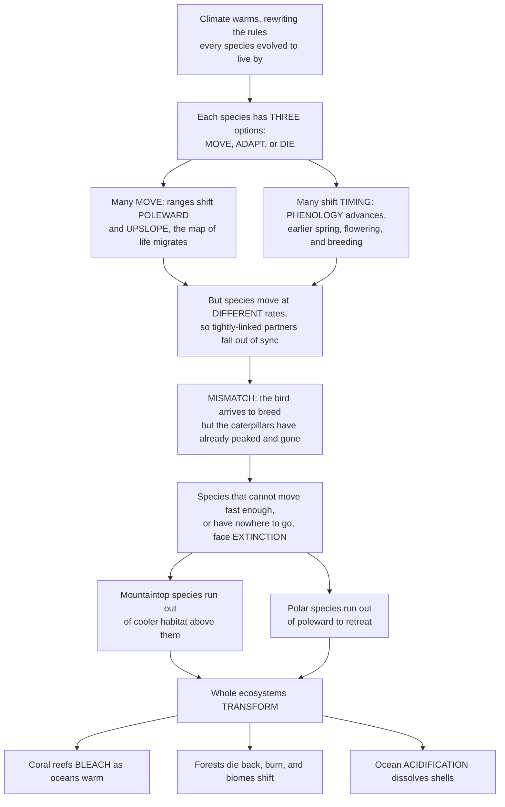

# 🌡️ Climate Change Ecology

> [!abstract] TL;DR
> **Climate change ecology** is the study of how the **greatest environmental force of our age is reshaping life itself** — the ecological-impacts view that complements the physics of warming. Every species alive today evolved to fit a particular climate; as that climate warms, shifts its rainfall, acidifies the oceans, and unleashes new extremes, each species faces just **three options: MOVE, ADAPT, or DIE.** Many are already **MOVING** — shifting their ranges **poleward** (toward the poles) and **upslope** (up mountains), chasing the cooler conditions they need, so the whole map of life is on the march. Many are shifting their **TIMING** — the **phenology** of spring events like flowering, breeding, and migration is happening earlier as warmth arrives sooner. But here is the dangerous catch: species do **not** all respond at the same rate, so tightly-linked partners fall out of step — a **phenological mismatch**, like a bird that migrates by day-length arriving to feed its chicks only to find the caterpillars it depends on have already peaked and vanished. Species that **cannot move fast enough**, or that have **nowhere to go** — a mountaintop species has no "higher," a polar species runs out of "poleward" — face **extinction** on the notorious *escalator to extinction*, which is why climate change is projected to become a leading extinction driver this century. And whole ecosystems are **transforming**: coral reefs **bleaching** and dying as oceans warm, forests burning and shifting, the Arctic thawing, and **ocean acidification** dissolving shells. This is the opener to the global-change section: understanding these **range shifts, mismatches, and ecosystem collapses** is now inseparable from conservation.

---

## Intuition

**Analogy:** Imagine every species on Earth was handed, at birth, a **rulebook written by its climate** — the exact temperatures it can tolerate, when spring will arrive, when its food will appear, how acidic its water is. For millions of years the rules stayed roughly stable, and evolution fine-tuned each species to play the game brilliantly. Now, in the span of a single century, **someone is rewriting the rulebook mid-game** — turning up the heat, moving the seasons, souring the sea. Faced with rules it no longer fits, a species has only three moves. It can **MOVE** — pack up and relocate to somewhere the old rules still hold (toward the poles, or up a mountain, chasing the cool it needs). It can **ADAPT** — evolve or adjust fast enough to live by the new rules. Or, failing both, it **DIES**. That is climate change ecology in one sentence: **move, adapt, or die.**

And the living world is visibly choosing. Across thousands of species we can *watch* the migration: butterflies, birds, fish, and trees are shifting their ranges **poleward and upslope**, a great planetary reshuffling toward cooler ground. We can watch the calendar slip: **spring is arriving earlier**, so leaves unfurl, flowers open, and eggs hatch weeks ahead of a generation ago. But here is the trap that makes climate change so insidious for ecosystems — **partners do not move or shift in lockstep.** A migratory bird cued by the unchanging length of the day arrives on its old schedule, only to discover that the caterpillars its chicks eat — cued by temperature — have already boomed and gone. The food and the feeder have **decoupled**: a *mismatch*, and the chicks starve. Meanwhile the species that simply *can't* keep up — the slow, the long-lived, the ones fenced in by cities and farms, and above all the ones with **nowhere left to flee** (climb to the summit and there is no "higher"; retreat to the pole and there is no "further") — ride the **escalator to extinction**. And it is not just individual species: **entire ecosystems are dismantling** — coral reefs bleaching white and dying, forests dying back and burning, the Arctic thawing, oceans acidifying and dissolving the shells of the creatures at the base of the food web. Climate change ecology reveals how the defining force of our era is remaking the biosphere — and why confronting the **biodiversity crisis** and the **climate crisis** has become a single, inseparable task.

---

## How It Works

### Core Mechanics

1. **The stakes: climate change is a fast-growing driver of biodiversity loss.** Rising temperatures, altered precipitation, more frequent extremes (heatwaves, droughts, fires), **ocean warming**, **ocean acidification**, and sea-level rise together change the environmental conditions every organism experiences. Because species are adapted to specific conditions, this force is now a major and *accelerating* threat to biodiversity — the surging "+C" on top of the classic habitat-loss, invasive-species, pollution, and overexploitation drivers. Faced with it, a population can **move, adapt, or die.**
2. **MOVING — tracking the climate envelope (range shifts).** Each species occupies a **climatic niche** or **climate envelope**: the range of temperature and moisture in which it can persist. As the planet warms, the geographic location of that envelope moves — **isotherms** (lines of equal temperature) migrate **poleward** in latitude and **upslope** in elevation. Species that can disperse follow, so documented **range shifts** now span insects, birds, fish, mammals, and plants, all sliding toward cooler ground. Roughly, tracking the same temperature means moving ~100+ km poleward *or* ~100 m upslope per °C of warming.
3. **The constraints on moving.** Tracking a shifting envelope is not guaranteed. Species are limited by **dispersal ability** (a slow-spreading tree cannot outrun a fast-warming climate), by **barriers** (fragmented habitat, cities, farmland, mountains, and coastlines block the path), by the **velocity of climate change** outpacing the speed at which they can move, and by the emergence of **no-analog / disappearing climates** — future temperature-precipitation combinations that exist nowhere today, leaving no destination to move to.
4. **The escalator to extinction.** For species already living at the cool extreme — **mountaintop** and **polar** species — moving upslope or poleward eventually reaches a wall: there is no higher summit to climb, no further pole to reach. As warming pushes the suitable envelope off the top of the mountain (or off the edge of the land), the habitat shrinks to nothing and the species is squeezed to local **extinction** — the vivid *escalator to extinction*.
5. **ADJUSTING TIMING — advancing phenology.** **Phenology** is the timing of recurring biological events — leaf-out, flowering, insect emergence, breeding, migration. Warmer springs arrive earlier, so across countless species these events have **advanced** (shifted earlier in the year) by days to weeks over recent decades. Shifting timing is a second way to stay matched to suitable conditions.
6. **The trap — phenological mismatch (trophic asynchrony).** Interacting species (predator-prey, plant-pollinator, host-parasite) often respond to **different cues** at **different rates**. A resident caterpillar tracks temperature and advances fast; a long-distance migratory bird tracks day-length (photoperiod), which does not change, and advances slowly. Over years their timing **decouples**: the bird arrives to breed after the caterpillar peak has passed, so peak food demand no longer overlaps peak food supply. This **mismatch** starves offspring, disrupts food webs, and unravels mutualisms — the classic great-tit / caterpillar and migratory-bird cases.
7. **ADAPTING — plasticity, evolution, and their limits.** Species can respond in place through **phenotypic plasticity** (acclimation — a flexible individual adjusting) or through **evolutionary** (genetic) change across generations. But whether adaptation can keep pace is doubtful for **long-lived, slow-reproducing** species (trees, large vertebrates) with small populations and low genetic variation; rapid warming often outruns them. **Assisted evolution** and managed gene flow are experimental attempts to help.
8. **ECOSYSTEM-LEVEL transformation.** Beyond single species, whole systems reorganize: **coral bleaching** and reef collapse (warming plus acidification break the coral-algae mutualism), **forest dieback** and shifting **biomes**, altered **fire and disturbance regimes**, Arctic/permafrost and alpine change, and ocean deoxygenation. Combined, these push **climate-driven extinction risk** high enough to make climate a leading extinction driver this century.
9. **Feedbacks and synergies.** Climate change acts **synergistically** with the other biodiversity drivers — habitat loss *compounds* the inability to shift range (a species with nowhere to go because the corridor is paved over). And ecology feeds *back* onto climate: carbon released from **thawing permafrost** and dying forests amplifies warming, and ecosystems can cross **tipping points** into new, self-reinforcing states.

### Flow / Architecture



---

## Key Concepts

### Secondary (foundational)

- **Move, adapt, or die** — when the climate changes, an animal or plant has only three choices: **move** somewhere the weather still suits it, **change** fast enough to cope, or **die out**.
- **Range shift (moving)** — many species are already **moving toward the poles and up mountains**, following the cooler temperatures they need as the world warms. The whole map of where things live is shifting.
- **Phenology (timing)** — the calendar of nature: when flowers bloom, birds nest, and insects hatch. Because spring now comes **earlier**, these events are happening earlier too.
- **Mismatch** — the danger when partners fall out of step. A bird times its babies for when caterpillars are plentiful — but if the caterpillars now peak **before** the chicks hatch, the food is gone and the chicks go hungry.
- **Nowhere higher to go (escalator to extinction)** — a species living on a **mountaintop** can climb to escape heat, but only until it reaches the peak. After that there is **nowhere cooler left**, and it can disappear.
- **Coral bleaching** — when the sea gets too warm, corals turn ghostly **white** and can die, wrecking the reefs that shelter a huge share of ocean life.

### Undergraduate (core)

- **Climatic niche / climate envelope tracking** — each species persists within a bounded range of temperature and moisture; as warming shifts the *geographic location* of that envelope, species must **track it** in space to survive. Failure to track means the local population sits outside its tolerances and declines.
- **Documented range shifts** — meta-analyses (Parmesan & Yohe 2003; Chen et al. 2011) find species shifting on average **~17 km per decade poleward** and **~11 m per decade upslope**, with faster shifts under faster warming — a fingerprint spanning butterflies, birds, fish, and plants. Isotherm migration drives it.
- **Climate velocity vs. dispersal capacity** — **climate velocity** is the speed (km/yr) at which a given temperature moves across the landscape. Where it exceeds a species' dispersal ability — or where **barriers** (fragmentation, oceans, human land use) block the route — the species cannot keep up and accrues a **climate debt** (lag behind its shifting envelope), risking extinction even before its habitat vanishes.
- **The escalator to extinction** — for cool-adapted species at range margins, upslope/poleward retreat runs out of room; mountaintop endemics and polar specialists face a **shrinking, disappearing climate space**. Documented upslope creep of tropical montane species (e.g., Peruvian cloud-forest birds) shows the escalator in motion.
- **Advancing phenology and the match-mismatch hypothesis** — spring events have advanced by **~2-5 days per decade** on average. Cushing's **match-mismatch hypothesis** predicts that reproductive success depends on the *overlap* between peak demand (offspring) and peak resource; warming that shifts them at different rates degrades the overlap.
- **Phenological mismatch / trophic asynchrony** — when interacting species use **different cues** (temperature vs. photoperiod) or respond at **different rates**, their timing **decouples**. Classic cases: the Dutch great tit whose caterpillar food advances faster than its egg-laying, and long-distance migrant birds arriving after the insect peak. Mismatch disrupts **food webs** and **mutualisms** (plant-pollinator decoupling).
- **Plastic vs. evolutionary adaptation, and its limits** — **phenotypic plasticity** (acclimation) buffers within a generation; **evolutionary adaptation** requires heritable variation and enough generations. Fast, short-lived, large-population species may adapt; **long-lived, slow, small-population** species usually cannot keep pace with the current rate of change.
- **Coral bleaching and acidification** — corals live in **mutualism** with photosynthetic *zooxanthellae*; heat stress makes corals expel them, turning white (**bleaching**) and starving. Compounded by **ocean acidification**, which lowers carbonate saturation and hampers reef-building. Repeated marine heatwaves cause mass mortality.
- **Climate as a growing extinction driver** — Thomas et al. (2004) projected that **15-37% of species** could be "committed to extinction" by 2050 under mid-range warming; later syntheses (Urban 2015) estimate rising risk with temperature (up to ~1 in 6 species at high warming). Climate is becoming a leading extinction force alongside habitat loss.

### Graduate (advanced)

- **Climate velocity as a spatial-analysis framework** — velocity is computed as the ratio of the *temporal* rate of temperature change to the *spatial* temperature gradient (°C/yr divided by °C/km = km/yr). It is **low** in mountains (steep gradients) — making them potential **refugia** — and **high** in flat terrain (shallow gradients), explaining why lowlands and the sea surface demand the fastest tracking. Directionality and *sink/source* velocity fields predict where organisms must go and where climate space disappears.
- **Cue conflict and the evolution of phenology** — mismatch arises because selection historically tuned each species to a *reliable proxy cue*. Temperature-cued and **photoperiod-cued** organisms diverge under warming because day-length is invariant. Whether a species can re-tune its cue-reliance (micro-evolution of reaction norms) versus being locked in determines its mismatch vulnerability; genetic constraints and **countergradient variation** complicate predictions.
- **Evolutionary rescue and adaptive capacity** — **evolutionary rescue** occurs when adaptation is fast enough to reverse a declining population before extinction. Its probability rises with population size, genetic variation, gene flow, and generation turnover, and falls with the *rate* and *magnitude* of change. For most conservation targets (slow K-strategists), rescue is unlikely — motivating **assisted gene flow** and **assisted evolution** (e.g., heat-tolerant coral breeding).
- **Synergies with the HIPPO drivers ("double jeopardy")** — climate change is non-additive with other threats. **Habitat fragmentation** severs the corridors species need to shift range; warming pushes species *out* of static reserves designed for a stationary climate; interactions with invasive species, disease, and overharvest compound risk. Single-driver risk models systematically **underestimate** combined extinction probability.
- **Ecological feedbacks to the climate system** — thawing **permafrost** releases CO2 and methane; **forest dieback** (Amazon, boreal) and megafires convert carbon sinks to sources; loss of albedo (Arctic greening, sea-ice retreat) amplifies warming. These couplings mean ecosystems are not passive victims but active components of **tipping points and tipping cascades** in the Earth system.
- **Community disassembly and no-analog assemblages** — because species respond **individualistically** (different rates and directions), communities do not migrate intact; they **disassemble and reassemble** into novel combinations. Combined with no-analog *climates*, this yields **no-analog communities** with unprecedented species mixtures, unknown interactions, and hard-to-predict function — a frontier for both ecology and paleoecology (the fossil record shows individualistic responses during past deglaciations).
- **Extinction-risk projection and its deep uncertainty** — species-distribution/climate-envelope models, mechanistic niche models, and demographic models each project climate-driven extinction with large, structured uncertainty (dispersal assumptions, biotic interactions, plasticity, and warming scenario dominate the spread). Urban's (2015) meta-analysis formalized the **accelerating risk-vs-warming** relationship; reconciling correlative and mechanistic approaches remains open.
- **Conservation in a nonstationary climate** — strategies shift from preserving a *static* state to enabling *movement and persistence*: **corridors and connectivity** for range shifts, **assisted migration / managed relocation** (contested for invasion and ethical risk), protecting **climate refugia** (velocity-low, microclimatically buffered sites), and **managing for resilience** rather than historical baselines. Climate adaptation is now a core axis of conservation planning.

---

## Python Demo

```python
# CLIMATE-CHANGE ECOLOGY: "move, adapt, or die" in three panels
#   (A) CLIMATE ENVELOPE -- a species' suitable thermal band on a mountainside
#       slides UPSLOPE as the climate warms (it must MOVE to track its niche).
#   (B) ESCALATOR TO EXTINCTION -- pinned against the summit (nowhere higher),
#       that band is squeezed until its area collapses to zero -> local extinction.
#   (C) PHENOLOGICAL MISMATCH -- two partners whose spring timing advances at
#       DIFFERENT rates decouple year by year, so food supply and demand separate.
import numpy as np
import matplotlib.pyplot as plt

# ---- shared climate setup ----
lapse   = 6.5                   # deg C per km (environmental lapse rate)
summit  = 2.3                   # mountain height (km): a low peak, so a cool-adapted
                                #   species already lives near the top
T_base0 = 25.0                  # present sea-level mean temperature (deg C)
warming = 4.0                   # deg C of warming over the horizon
years   = np.arange(0, 101)     # 100-year horizon
T_base  = T_base0 + warming * years / years.max()
niche_lo, niche_hi = 10.0, 14.0 # species suitable where niche_lo <= T <= niche_hi

def T_of_elev(e, Tb):           # temperature at elevation e (km) for base temp Tb
    return Tb - lapse * e

def band_edges(Tb):             # suitable elevation band [warm edge, cool edge], clipped to mountain
    e_warm = np.clip((Tb - niche_hi) / lapse, 0, summit)  # warm limit -> LOWER elevation
    e_cool = np.clip((Tb - niche_lo) / lapse, 0, summit)  # cool limit -> HIGHER elevation
    return e_warm, e_cool

fig, (axA, axB, axC) = plt.subplots(1, 3, figsize=(17, 5.2))
elev = np.linspace(0, summit, 300)

# ---------- (A) climate envelope slides upslope ----------
axA.axvspan(niche_lo, niche_hi, color="green", alpha=0.12)
axA.text((niche_lo + niche_hi) / 2, 0.12, "suitable\nthermal niche",
         ha="center", fontsize=8, color="green")
for Tb, color, lbl in [(T_base0, "#2166ac", "Present"),
                       (T_base0 + warming, "#b2182b", f"after +{warming:.0f} C")]:
    axA.plot(T_of_elev(elev, Tb), elev, color=color, lw=2.2, label=lbl)
    e_w, e_c = band_edges(Tb)
    axA.axhspan(e_w, e_c, color=color, alpha=0.10)
axA.axhline(summit, color="gray", ls="--", lw=1)
axA.text(T_base0 + warming, summit - 0.1, "summit: nowhere higher",
         fontsize=7.5, color="gray", ha="right")
axA.set_xlabel("Temperature  (deg C)")
axA.set_ylabel("Elevation  (km)")
axA.set_title("(A) Climate envelope slides UPSLOPE")
axA.set_ylim(0, summit + 0.15); axA.set_xlim(niche_lo - 2, T_base0 + warming + 1)
axA.legend(loc="upper right", fontsize=8)

# ---------- (B) escalator to extinction ----------
e_warm, e_cool = band_edges(T_base)
habitat = e_cool - e_warm                       # vertical extent of suitable band (km)
axB.fill_between(years, e_warm, e_cool, color="green", alpha=0.18, label="suitable habitat")
axB.plot(years, e_warm, color="#e8601c", lw=2, label="warm (lower) edge climbs")
axB.plot(years, e_cool, color="#2166ac", lw=2, label="cool (upper) edge pinned at summit")
axB.axhline(summit, color="gray", ls="--", lw=1)
ext = int(np.argmax(habitat <= 1e-6)) if np.any(habitat <= 1e-6) else None
if ext:
    axB.axvline(years[ext], color="black", ls=":", lw=1.5)
    axB.annotate("habitat gone:\nEXTINCTION", xy=(years[ext], summit * 0.5),
                 xytext=(years[ext] - 48, summit * 0.30), fontsize=8, fontweight="bold",
                 arrowprops=dict(arrowstyle="->", color="black"))
axB.set_xlabel("Years of warming")
axB.set_ylabel("Elevation  (km)")
axB.set_title("(B) The escalator to extinction")
axB.set_ylim(0, summit + 0.15)
axB.legend(loc="lower left", fontsize=7.5)

# ---------- (C) phenological mismatch ----------
D0        = 140.0                               # baseline spring peak (day of year, mid-May)
food_rate = 0.55                                # caterpillar peak advances 0.55 d/yr (temp-cued, FAST)
bird_rate = 0.18                                # bird demand peak advances 0.18 d/yr (photoperiod-cued, SLOW)
food_peak = D0 - food_rate * years
bird_peak = D0 - bird_rate * years
mismatch  = bird_peak - food_peak               # days the consumer lags the food peak
axC.plot(years, food_peak, color="#1a9850", lw=2.2, label="peak food (caterpillars)")
axC.plot(years, bird_peak, color="#762a83", lw=2.2, label="peak demand (bird chicks)")
axC.fill_between(years, food_peak, bird_peak, color="red", alpha=0.15)
axC.annotate(f"growing MISMATCH:\n{mismatch[-1]:.0f} days by year {years[-1]}",
             xy=(years[-1], (food_peak[-1] + bird_peak[-1]) / 2),
             xytext=(18, 118), fontsize=8, fontweight="bold", color="#b2182b",
             arrowprops=dict(arrowstyle="->", color="#b2182b"))
axC.set_xlabel("Years of warming")
axC.set_ylabel("Spring timing  (day of year)")
axC.set_title("(C) Phenological mismatch:\npartners advance at different rates")
axC.legend(loc="upper right", fontsize=7.5)

plt.tight_layout()
plt.savefig("climate_change_ecology.png", dpi=120)
plt.show()

# ---- console summary ----
p_lo, p_hi = band_edges(T_base0)
print("=== (A/B) Escalator to extinction ===")
print(f"Present suitable band : {p_lo:.2f}-{p_hi:.2f} km  (width {habitat[0]:.2f} km)")
if ext:
    print(f"Habitat collapses to zero at year {years[ext]}  ->  local EXTINCTION")
    print(f"(nowhere cooler above the {summit:.1f} km summit -- the escalator runs out)")
print("\n=== (C) Phenological mismatch ===")
print(f"Food peak advances {food_rate:.2f} d/yr; consumer demand only {bird_rate:.2f} d/yr")
print(f"Timing gap grows from 0 to {mismatch[-1]:.0f} days over {years[-1]} years")
print("-> chicks increasingly miss the caterpillar peak (trophic asynchrony)")
```

**What it shows.** **Panel A** makes "move to survive" concrete: the green vertical band is the species' fixed **thermal niche**, and because temperature falls with elevation, that niche corresponds to a *band of elevations* on the mountain. Warm the base climate (blue → red line) and the whole temperature profile shifts, so the suitable elevation band **slides upslope** — the species must migrate uphill just to stay in the same temperatures. **Panel B** turns that into the **escalator to extinction**: the cool (upper) edge of the band is already pinned against the summit — there is nowhere higher to go — while the warm (lower) edge keeps climbing as the world heats, squeezing the suitable habitat until its area **collapses to zero and the population goes locally extinct**. **Panel C** shows the *timing* failure: the caterpillar food peak (green), cued by temperature, advances fast, while the bird's peak demand (purple), cued by day-length, advances slowly — so the red gap between food supply and food demand **widens year on year** into a large **phenological mismatch**, and the chicks progressively miss the feast. Two independent mechanisms — a spatial squeeze and a temporal decoupling — both driven by the same warming.

---

## Real-World Applications

> **Example:** **Great Barrier Reef mass bleaching — a warming ocean crossing a lethal threshold.** Corals live in mutualism with photosynthetic zooxanthellae, but when sea temperatures exceed the local summer maximum by only ~1 °C for a few weeks, the corals expel their algae and turn white. NOAA's **Coral Reef Watch** quantifies this exposure as **Degree Heating Weeks (DHW)** — accumulated heat stress above the bleaching threshold — and mass bleaching kicks in around 4 DHW, with widespread mortality by 8 DHW. Marine heatwaves drove **back-to-back mass bleaching** on the Great Barrier Reef in 2016, 2017, 2020, and 2022 — events that were essentially unknown before the late 20th century, and a textbook case of a warming climate pushing an ecosystem past a threshold faster than it can recover.

- **Marine range shifts and fisheries redistribution** — commercially vital fish (cod, mackerel, lobster) are shifting poleward and deeper as oceans warm, redrawing the map of who catches what and igniting international quota disputes (e.g., the North Atlantic "mackerel wars"); fisheries management must now track moving stocks rather than fixed grounds.
- **Phenology monitoring networks** — the USA National Phenology Network, long-running cherry-blossom records in Kyoto (nearly 1,200 years), and lilac/honeysuckle observations turn advancing spring into hard data, feeding early-warning of mismatch and validating climate models with the biosphere's own calendar.
- **Assisted migration / managed relocation** — deliberately moving species to newly suitable habitat (e.g., *Torreya taxifolia*, whitebark pine, heat-tolerant coral outplanting) is being trialed as an adaptation of last resort — powerful but contested for risk of creating new invasions.
- **Climate refugia and connectivity planning** — conservation now maps **low-climate-velocity refugia** and designs **corridors** so species can shift range; connectivity and the "30x30" protected-area agenda are increasingly evaluated for how well they let biodiversity *move*, not just where it is today.
- **Species-distribution models in IPCC/IPBES assessments** — climate-envelope and mechanistic niche models projecting range shifts and extinction risk feed directly into IPCC AR6 WGII and IPBES reports, converting ecological theory into the policy-facing risk estimates that shape adaptation strategy.

---

## Common Pitfalls

- **Assuming species track climate smoothly and intact.** Range shifts are limited by dispersal ability, barriers, and **climate velocity outpacing movement**; species accrue a **climate debt** and lag behind their envelopes, and communities **disassemble** rather than sliding along as units. Modeling a clean, instantaneous shift ignores lags, extinction debt, and no-analog reshuffling.
- **Treating warming as the only axis of change.** Climate change is not just higher mean temperature: **altered precipitation, extremes, seasonality, ocean warming, acidification, deoxygenation, and sea-level rise** all matter, and their *interaction* often drives impacts. Focusing on annual-mean temperature alone misses the mechanisms that actually kill.
- **Betting that adaptation or plasticity will keep pace.** Plasticity buffers within a generation and evolution can rescue *some* fast, large-population species — but **long-lived, slow, small-population** organisms usually cannot adapt at the current *rate* of change. Assuming "they'll evolve" is a systematic underestimate of risk for exactly the species conservation most cares about.
- **Overlooking that mismatch comes from *differential* rates, not from no response.** Both partners may be advancing their phenology — the danger is that they advance at **different speeds** (temperature-cued food vs. photoperiod-cued consumer), so overlap erodes. Checking only whether a species is "responding to warming" misses the asynchrony that actually breaks the food web.
- **Conflating bleaching with immediate death.** Bleaching is a *stress response*; corals can reacquire algae and recover if the heat is brief. The lethal problem is **repeated, intensifying** marine heatwaves that arrive faster than recovery — treating a single bleaching event as either harmless or automatically fatal both mislead.
- **Ignoring synergy with habitat loss (the double jeopardy).** A species may have a viable climate destination but **no way to reach it** because the corridor is fragmented by cities and farmland. Assessing climate risk in isolation from land-use ignores the compounding that makes the combined threat worse than either alone.
- **Assuming static reserves are enough.** Protected areas fixed in place were designed for a **stationary** climate; as envelopes shift, species may need to leave the reserve that was meant to save them. Conservation must plan for **movement and refugia**, not just for defending today's boundaries.

---

## Related Concepts

This note opens the **global-change and applied-ecology** section, and several of its threads are developed in dedicated in-vault siblings referenced here in prose. **Ecological_Stability_Resilience_and_Tipping_Points** takes up the ecosystem-transformation and feedback-cascade material — how warming can push reefs, forests, and the Arctic across thresholds into new states; **Extinction_and_the_Sixth_Mass_Extinction** develops the extinction-risk projections that make climate a leading driver, benchmarked against the deep-time record; **Biomes_and_Global_Ecology** supplies the climate-envelope-and-biome-shift machinery (poleward/upslope migration, no-analog communities) that this note applies at the species level; **Restoration_Ecology** and the conservation-response toolkit (corridors, assisted migration, refugia, managing for resilience) turn these impacts into action; and **Human_Population_and_the_Anthropocene** frames climate change within the broader human-driven transformation of the planet. Those five are prose references because they are in-vault siblings of this opener.

- [[Ecology_and_Conservation_Overview]] — the vault hub that situates climate-change ecology as the applied capstone atop population, community, and ecosystem ecology.
- [[Conservation_Biology_and_the_Biodiversity_Crisis]] — the crisis-discipline opener where climate is the surging "+C" compounding the HIPPO drivers; this note is its climate-specific deep dive.
- [[Anthropogenic_Climate_Change]] — the Meteorology treatment of the *physical* driver (warming, precipitation change, extremes) whose *ecological* consequences this note traces.
- [[Ocean_Acidification]] — the "other CO2 problem": lowered carbonate saturation that, alongside warming, undermines corals and shell-builders at the base of marine food webs.
- [[Coral_Reefs_and_Tropical_Marine_Ecosystems]] — the reef systems whose warming-driven bleaching and collapse are the flagship ecosystem-transformation case here.
- [[Ocean_Heat_Content_and_Marine_Heatwaves]] — the accumulating ocean heat and marine heatwaves that cross the bleaching threshold and force marine range shifts.
- [[Sustainability_and_Planetary_Boundaries]] — the systems-level frame in which climate change and biosphere integrity are two of the most-transgressed planetary boundaries, tightly coupled.
- [[Ecological_Resilience_and_Ecosystems]] — resilience, regime shifts, and tipping points: why climate stress can flip ecosystems into new states rather than gradually degrading them.
- [[Biodiversity_and_Conservation]] — Biology's foundational conservation note; this is the climate-driven deep dive that extends it (distinct basename by design).
- [[Mutualism_Commensalism_and_Symbiosis]] — the mutualisms (coral-algae, plant-pollinator) whose breakdown under warming and mismatch drives bleaching and pollination failure.
- [[Food_Webs_and_Trophic_Dynamics]] — the trophic structure that phenological mismatch disrupts when peak food supply and peak demand decouple.
- [[Metapopulations_and_Spatial_Ecology]] — the dispersal, connectivity, and barrier dynamics that determine whether a species can track its shifting climate envelope.
- [[Life_History_Strategies_and_Demography]] — why long-lived, slow-reproducing species cannot adapt or shift fast enough to keep pace with rapid warming.

---

## Review Questions

1. **(Secondary)** When the climate warms, a species has three choices: move, adapt, or die. Explain in your own words what "moving toward the poles or up a mountain" means, and why a species that already lives on a **mountaintop** can be in special danger.
2. **(Secondary/Undergraduate)** A bird times the hatching of its chicks to when caterpillars are most plentiful. Warming makes the caterpillars peak two weeks earlier, but the bird still arrives on its old schedule. Explain what a **phenological mismatch** is and why it can cause the chicks to starve even though there is plenty of food *at some point* in the spring.
3. **(Undergraduate)** Define the **climate envelope** and **climate velocity**. Using them, explain why a species can go extinct from climate change even in a place where its habitat has *not* been destroyed — and why mountains can act as refugia while flat lowlands cannot.
4. **(Undergraduate/Graduate)** Phenological mismatch arises when interacting species respond to **different cues at different rates**. Contrast a temperature-cued resident insect with a photoperiod-cued long-distance migrant, and explain mechanistically why warming decouples them. What would have to evolve to close the mismatch, and why is that unlikely for the migrant?
5. **(Graduate)** Climate change is often modeled as an independent extinction driver, yet it acts in **synergy** with habitat loss ("double jeopardy") and feeds *back* onto the climate system. Choose one synergy and one feedback, explain the mechanism of each, and discuss what they imply for (a) the reliability of single-driver, envelope-only extinction projections and (b) the design of conservation strategies such as corridors, assisted migration, and climate refugia.

---

## Sources

- Parmesan, C. (2006). "Ecological and Evolutionary Responses to Recent Climate Change." *Annual Review of Ecology, Evolution, and Systematics* 37: 637-669. [DOI](https://doi.org/10.1146/annurev.ecolsys.37.091305.110100) — the canonical synthesis of range shifts, phenological advances, and mismatch.
- Walther, G.-R., et al. (2002). "Ecological responses to recent climate change." *Nature* 416: 389-395. [DOI](https://doi.org/10.1038/416389a) — foundational review documenting biological fingerprints of warming across taxa.
- Thomas, C. D., et al. (2004). "Extinction risk from climate change." *Nature* 427: 145-148. [DOI](https://doi.org/10.1038/nature02121) — the influential projection that 15-37% of species could be committed to extinction by 2050.
- Urban, M. C. (2015). "Accelerating extinction risk from climate change." *Science* 348(6234): 571-573. [DOI](https://doi.org/10.1126/science.aaa4984) — meta-analysis showing extinction risk rising with warming (up to ~1 in 6 at high emissions).
- IPCC (2022). *Climate Change 2022: Impacts, Adaptation and Vulnerability* (AR6 WGII), Ch. 2 (Terrestrial and freshwater ecosystems) and Ch. 3 (Ocean and coastal ecosystems). [Report](https://www.ipcc.ch/report/ar6/wg2/) — the authoritative assessment of climate impacts on ecosystems and biodiversity.

---

#ecology #climate-change #range-shifts #phenological-mismatch #coral-bleaching
