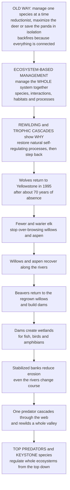

# 🐺 Ecosystem-Based Management and Rewilding

> [!abstract] TL;DR
> For most of its history, wildlife management was **reductionist** — manage one species at a time (maximize the deer for hunters, save the panda, grow the timber stock), treating each in isolation. But ecosystems don't work that way: **everything is connected**, so managing one piece while ignoring the web reliably backfires. **Ecosystem-based management (EBM)** is the paradigm shift to managing the *whole system* — its species, their interactions, their habitats, and the **processes** that link them — for long-term **resilience** rather than short-term yield, treating uncertainty with **adaptive management** ("learning by doing"), crossing property lines to whole landscapes and seascapes, and counting humans as part of the system. The most vivid proof of *why* the whole matters is **rewilding** and the power of **trophic cascades**. The flagship story: when **wolves were reintroduced to Yellowstone in 1995** after ~70 years of absence, they didn't just cut elk numbers — they triggered a cascade that transformed an entire valley. Fewer, warier elk stopped over-browsing young willows and aspen along the rivers; the trees recovered; **beavers** returned to the regrown willows and built dams; the dams created **wetlands** for fish, birds, and amphibians; songbirds came back; even the rivers changed course as stabilized banks slowed erosion. One predator, cascading through the web, rewilded a whole landscape from the **top down**. The deep principle: **apex predators and keystone species often regulate entire ecosystems**, so restoring them can heal systems that piecemeal management never could. Working *with* nature's own self-regulating processes rather than micromanaging pieces is applied ecology's most integrative frontier.

---

## Intuition

**Analogy — the mechanic who fixes one gauge versus the doctor who treats the whole patient.** Imagine a car dashboard with a dozen warning lights, and a mechanic whose only tool is to make each individual light turn off. The oil light is on? Cut the sensor wire. The temperature gauge is high? Tape over it. Every light goes dark and the car *looks* fixed — until the engine seizes, because the lights were symptoms of one connected system, and "fixing" each gauge in isolation ignored what actually links them. That mechanic is **reductionist, single-species management**: maximize the game animal the hunters want, cull the predator that eats it, plant the tree the mill needs — each target hit, the whole system quietly failing.

Now picture a doctor who refuses to treat "the cough" or "the fever" as separate problems and instead asks how the *whole body* is working — how the organs interact, what the underlying process is, how one intervention ripples everywhere else. That is **ecosystem-based management**: you cannot manage a fishery without accounting for the entire food web, its bycatch, and the seafloor habitat; you cannot manage a forest without its fire regime, its water, and its soil; you cannot fix one species while ignoring the tangled web it lives in. The parts are not independent, so you manage the *system*.

And here is the part that makes the whole-system view feel almost magical rather than merely prudent: **restoring one keystone piece can heal everything else on its own.** Put the wolves back in Yellowstone and you don't have to manually re-plant the willows, re-introduce the beavers, dig the wetlands, or re-engineer the rivers — the wolves do all of it *for* you, cascading down through the web. That is **rewilding**: instead of forever micromanaging pieces, you restore the natural, self-regulating **process** — often a top predator or keystone species — and let the ecosystem rebuild itself from the top down. The lesson of the wolf is the thesis of this whole topic: because everything is connected, whole-system management isn't just safer than piecemeal management — it can accomplish what piecemeal management *cannot*.

---

## How It Works

### Core mechanics

1. **The paradigm shift, precisely.** *Reductionist* management optimizes a single target — a game species, a timber stock, one fish quota — in isolation, then discovers **unintended ecosystem consequences** (the culled wolf, the collapsed forage, the eroded stream). **Ecosystem-based management (EBM)** instead manages the *whole system* — species, interactions, habitats, structure, and **processes** — for sustainability and resilience, explicitly accounting for **connectivity**, **indirect effects**, **cumulative impacts**, and humans as part of the system rather than outside it.

2. **EBM's operating principles.** (a) A **holistic / systems view** — the unit of management is the ecosystem, not the single stock. (b) Maintain ecosystem **structure and function**, not just harvest yields. (c) Manage across ecological **boundaries and scales** — whole watersheds, landscapes, seascapes — regardless of who owns the land. (d) Treat **uncertainty** seriously via **adaptive management** (Holling): act, *monitor*, learn, and adjust — management as an ongoing experiment, not a one-time plan. (e) Apply the **precautionary principle** where consequences are irreversible. (f) Include **stakeholders** and integrate human well-being.

3. **Where EBM is applied.** **Ecosystem-based fisheries management** (setting quotas that account for the food web, bycatch, and habitat rather than one stock at a time); **forest and watershed management**; **integrated coastal and marine spatial planning**; and **fire management** (restoring the fire *regime* a system evolved with instead of suppressing all fire).

4. **Rewilding — restoring the process, not just the parts.** Rewilding aims to restore an ecosystem's **self-regulating natural processes** with *minimal ongoing human management*, especially by returning **keystone species** and **apex predators** to reinstate **trophic cascades** — top-down regulation of the whole community. Where classical restoration re-plants and re-engineers, rewilding re-installs the *engine* and steps back.

5. **The trophic cascade — the mechanism that makes rewilding work.** In a top-down-controlled web, restoring the apex predator propagates downward with **alternating sign**: predator ↑ → herbivore ↓ (and warier) → vegetation ↑ → dependent species (beavers, songbirds, fish) ↑. Crucially, species that never directly interact with the predator still change — the essence of **indirect effects**, and exactly what single-species management misses.

6. **The rationale — trophic downgrading.** Estes, Ripple, and colleagues argue that the loss of large predators and herbivores is *humankind's most pervasive influence on nature* — **trophic downgrading of Planet Earth** — reshaping fire, disease, invasion, and carbon storage worldwide. Rewilding is the deliberate *reversal* of that downgrading.

7. **Forms of rewilding.** **Trophic rewilding** (restore keystone predators/megaherbivores); **passive rewilding** (abandon land and let natural succession recover it); **Pleistocene rewilding** (use proxies — e.g., large grazers — to replace extinct megafauna and their ecological roles); and **translocation/reintroduction** of missing species. Related debates include **de-extinction**.

### From reductionism to rewilding — the Yellowstone cascade



---

## Key Concepts

### Secondary — manage the whole system, not one animal

- **Everything is connected.** You can't fix one species in an ecosystem the way you'd swap one part in a machine — pull one thread and the whole web moves. Managing the deer, the fish, or the forest tree *by itself* usually causes problems somewhere else you weren't watching.
- **Ecosystem-based management = manage the whole system.** Instead of one target species, you look after the *entire community* — all its species, how they interact, their habitats, and the natural processes (fire, water, predators) that hold it together.
- **Rewilding = let nature run itself again.** Rather than endlessly gardening an ecosystem by hand, you bring back the missing natural process — often a top predator — and let the system rebuild itself.
- **The wolves of Yellowstone.** Bringing wolves back didn't just reduce the elk. The elk grew cautious and stopped eating all the young riverside trees; the trees grew back; beavers returned and built dams; wetlands formed; birds and fish came back; the rivers even changed shape. *One* predator healed a *whole* landscape — the classic **trophic cascade**.
- **Top predators matter far beyond their numbers.** A handful of predators can control an entire ecosystem from the top. Lose them and things unravel; restore them and things can heal.

### Undergraduate — EBM principles and the forms of rewilding

- **Reductionist vs ecosystem-based.** *Reductionist*: maximize one stock (maximum sustainable yield of a single fishery, one game species) — efficient on paper, blind to indirect effects. *EBM*: manage for the **structure, function, and resilience of the whole system**, accounting for food webs, habitat, bycatch, cumulative impacts, and people.
- **Adaptive management (Holling).** Because ecosystems are uncertain and surprising, EBM treats management as a designed experiment: set an intervention, **monitor** outcomes, and **adjust** — "learning by doing." This is the practical answer to irreducible uncertainty and a direct import from systems thinking and cybernetics (feedback control of a managed system).
- **Scale and boundaries.** Ecological processes ignore fence lines. EBM manages at **landscape/seascape** scale — whole watersheds, migration corridors, marine regions — often requiring cross-jurisdiction cooperation and large-landscape **connectivity conservation**.
- **Top-down vs bottom-up control.** Whether restoring a predator triggers a strong cascade depends on how much the system is **top-down** (predators regulate lower levels) versus **bottom-up** (resources/productivity set abundances) controlled. Rewilding's power is greatest where top-down control is strong — and its effects are muted or complicated where bottom-up forces dominate.
- **Forms of rewilding.** **Trophic rewilding** restores keystone predators or megaherbivores to reinstate cascades. **Passive rewilding** lets abandoned farmland or pasture recover through natural succession (widespread in depopulating parts of Europe). **Pleistocene rewilding** introduces living **proxies** (large grazers, elephants, horses) for the megafauna lost ~10,000 years ago, on the argument that today's ecosystems are "ghosts" missing their large-herbivore engineers. **Translocation/reintroduction** returns locally extinct species.
- **The keystone concept in practice.** Not all species are equal: **keystone species** (Paine's *Pisaster*, sea otters, wolves, beavers) exert influence out of all proportion to their biomass. Rewilding deliberately targets these high-leverage nodes — restore the keystone and the community reorganizes around it.

### Graduate — trophic downgrading, cascades, and the debates

- **Trophic downgrading of Planet Earth (Estes et al. 2011).** The systematic loss of apex consumers is argued to be *the* most pervasive anthropogenic force on ecosystems, with cascading consequences for disease dynamics, wildfire, invasive spread, atmospheric carbon, and biogeochemistry. This reframes predators from "charismatic extras" to **regulators of ecosystem function** — and supplies the scientific rationale for trophic rewilding.
- **Yellowstone, carefully.** Ripple and Beschta document a **behaviorally mediated trophic cascade**: wolves changed not only elk *density* but elk *behavior* (the "ecology of fear" — elk avoiding risky riparian sites), releasing willow and aspen, enabling beaver recolonization, and altering hydrology and channel morphology. The evidence is strong but **contested**: climate, bison, drought, and the fact that the system was profoundly altered mean the cascade is real but *not* a clean, monocausal switch. Honest rewilding science treats it as a well-studied case, not a guaranteed template.
- **Cascade strength is contingent.** Cascades are strongest in relatively simple, aquatic, or species-poor systems and where predators strongly and directly regulate a dominant herbivore. In diverse terrestrial webs with omnivory, compensation, and strong bottom-up control, restoring one predator may produce weak, diffuse, or **unpredictable** results — a central caution against over-generalizing Yellowstone.
- **Baselines and shifting baselines.** Rewilding forces the question: *rewild to what?* There is no single "pristine" reference — ecosystems are dynamic and history-dependent, and **shifting baseline syndrome** means each generation's "natural" is already degraded. Many rewilding projects accept **novel ecosystems** (new species combinations with no historical analog) and define goals by *process and function* (self-regulation, trophic completeness) rather than a fixed species list.
- **The controversies.** (a) **Human–wildlife conflict** — restoring predators (wolves, lynx, bears) collides with livestock and rural livelihoods, making **social license** and coexistence measures decisive. (b) **Unpredictability** — reintroductions can fail or produce surprises; systems may not return to the intended state (hysteresis, alternative stable states). (c) **Ethics and control** — Pleistocene rewilding and de-extinction raise questions about naturalness, animal welfare, and hubris. (d) **Governance** — whose land, whose baseline, whose risk. Rewilding is as much a **social and political** project as an ecological one, and ignoring **Indigenous and community knowledge and rights** has undermined projects that treated people as external.
- **Systems framing.** EBM and rewilding are ecology's explicit embrace of the **complex-adaptive-systems** view: ecosystems as networks with feedbacks, nonlinearity, emergence, and tipping points, where a keystone predator is a **high-leverage intervention point** (in Meadows's sense) and the management goal is to keep the system in a desirable, resilient basin rather than to hold every variable at a target. It complements protected areas and restoration by supplying the *process-restoring, whole-system* frontier.

---

## Python Demo

```python
# Ecosystem-based management & rewilding — two views of "manage the whole system".
#   Panel 1  TROPHIC-CASCADE REWILDING: a degraded, predator-free valley (elk have
#            overgrazed the willow, beavers gone). Reintroduce the top predator and the
#            WHOLE SYSTEM transforms top-down: predator up -> elk down -> willow recovers
#            -> beavers return. We contrast it with the degraded baseline (no reintro).
#   Panel 2  INDIRECT EFFECTS / NETWORK RIPPLE: restore ONE node (the wolf) and propagate
#            the sign of the effect through the food-web network. Species that never touch
#            the wolf (beaver, songbird, river banks) still change — the whole-system point
#            that single-species management misses.
import numpy as np
import matplotlib.pyplot as plt

# =============================================================== Panel 1: the cascade
# Four-level model:  V willow, H elk, P wolf, B beaver (tracks willow it needs).
r, K = 1.0, 1.0     # willow growth & carrying capacity
a    = 2.0          # elk grazing on willow
e    = 0.5          # willow -> elk conversion
m    = 0.3          # elk death
c    = 1.0          # wolf predation on elk
f    = 0.5          # elk -> wolf conversion
d    = 0.05         # wolf death
Kb   = 0.5          # beaver capacity scale (grows with willow)
rb   = 0.5          # beaver growth
eps  = 1e-6
dt, T = 0.01, 160.0
n = int(T / dt)
t = np.linspace(0.0, T, n + 1)
t_reintro = 40.0                                   # wolves brought back here

V = np.empty(n + 1); H = np.empty(n + 1)
P = np.empty(n + 1); B = np.empty(n + 1)
# start in the DEGRADED, predator-free equilibrium: elk have overgrazed the willow
V[0], H[0], P[0], B[0] = 0.30, 0.35, 0.0, 0.15
for i in range(n):
    v, h, p, b = V[i], H[i], P[i], B[i]
    if t[i] >= t_reintro and p == 0.0:
        p = 0.05                                   # reintroduce a seed wolf population
    dV = r * v * (1 - v / K) - a * v * h
    dH = e * a * v * h - m * h - c * h * p
    dP = f * c * h * p - d * p
    Kb_eff = max(Kb * (v / K), eps)                # beaver capacity set by willow
    dB = rb * b * (1 - b / Kb_eff)
    V[i + 1] = max(v + dt * dV, 0.0)
    H[i + 1] = max(h + dt * dH, 0.0)
    P[i + 1] = max(p + dt * dP, 0.0)
    B[i + 1] = max(b + dt * dB, 0.0)

# =============================================================== Panel 2: network ripple
# Restore the wolf (+). Propagate the sign along the web:
#   predation link A->B flips sign (-sign A);  dependency link A->B keeps sign (+sign A).
pos = {"Wolf": (1.5, 3.0), "Elk": (1.5, 2.0),
       "Willow": (0.7, 1.0), "Aspen": (2.3, 1.0),
       "Beaver": (0.3, 0.0), "Songbird": (1.5, 0.0), "River": (2.7, 0.0)}
order = ["Wolf", "Elk", "Willow", "Aspen", "Beaver", "Songbird", "River"]
edges = {("Wolf", "Elk"): "predation",
         ("Elk", "Willow"): "predation", ("Elk", "Aspen"): "predation",
         ("Willow", "Beaver"): "dependency", ("Willow", "Songbird"): "dependency",
         ("Aspen", "Songbird"): "dependency", ("Willow", "River"): "dependency"}
sign = {k: 0 for k in pos}
sign["Wolf"] = +1                                  # the intervention: wolf restored
for tgt in order[1:]:
    s = 0
    for (u, w), typ in edges.items():
        if w == tgt:
            s += (-sign[u]) if typ == "predation" else (+sign[u])
    sign[tgt] = int(np.sign(s))

# ============================================================================== plotting
fig, ax = plt.subplots(1, 2, figsize=(15, 6))

# --- Panel 1: the rewilding cascade over time -------------------------------------
ax[0].axvspan(0, t_reintro, color="0.9")
ax[0].axvline(t_reintro, color="black", ls="--", lw=1.2)
ax[0].text(t_reintro / 2, 0.86, "degraded\npredator-free\nvalley", ha="center",
           fontsize=8, color="0.35")
ax[0].text(t_reintro + 2, 0.86, "wolves\nreintroduced", fontsize=8)
ax[0].plot(t, P, color="#6a0dad", lw=2.4, label="Wolf (apex predator)")
ax[0].plot(t, H, color="#d4a017", lw=2.4, label="Elk (herbivore)")
ax[0].plot(t, V, color="#2e8b57", lw=2.4, label="Willow (vegetation)")
ax[0].plot(t, B, color="#8b5a2b", lw=2.4, label="Beaver (dependent species)")
# degraded baselines (what stays if we do nothing)
for y0, col in [(V[0], "#2e8b57"), (B[0], "#8b5a2b")]:
    ax[0].axhline(y0, color=col, ls=":", lw=1, alpha=0.6)
ax[0].set_xlabel("time"); ax[0].set_ylabel("relative abundance")
ax[0].set_title("Trophic-cascade rewilding:\none predator transforms the whole system")
ax[0].legend(fontsize=8, loc="center right"); ax[0].grid(alpha=0.3)

# --- Panel 2: sign ripple through the food web ------------------------------------
col_up, col_dn = "#2e8b57", "#b22222"
for (u, w), typ in edges.items():
    x0, y0 = pos[u]; x1, y1 = pos[w]
    style = "->" if typ == "predation" else "-|>"
    ls = "-" if typ == "predation" else (0, (4, 3))
    ax[1].annotate("", xy=(x1, y1), xytext=(x0, y0),
                   arrowprops=dict(arrowstyle=style, color="0.55", lw=1.4,
                                   linestyle=ls))
for name, (x, y) in pos.items():
    col = col_up if sign[name] > 0 else col_dn
    ax[1].scatter(x, y, s=2100, color=col, edgecolor="black", zorder=3)
    tag = "+" if sign[name] > 0 else "-"
    ax[1].text(x, y, f"{name}\n({tag})", ha="center", va="center",
               fontsize=7.5, fontweight="bold", color="white", zorder=4)
ax[1].scatter([], [], s=180, color=col_up, label="increases (+)")
ax[1].scatter([], [], s=180, color=col_dn, label="decreases (-)")
ax[1].set_xlim(-0.2, 3.2); ax[1].set_ylim(-0.6, 3.5)
ax[1].axis("off")
ax[1].set_title("Restore ONE node (wolf +), the effect ripples everywhere:\n"
                "beaver, songbird & rivers change though they never touch the wolf")
ax[1].legend(fontsize=8, loc="lower center", ncol=2)

plt.tight_layout(); plt.show()

# --- the numbers behind the pictures ----------------------------------------------
k = int(t_reintro / dt) - 1
print("DEGRADED (predator-free)   :"
      f" wolf={P[k]:.2f} elk={H[k]:.2f} willow={V[k]:.2f} beaver={B[k]:.2f}")
print("REWILDED  (after cascade)  :"
      f" wolf={P[-1]:.2f} elk={H[-1]:.2f} willow={V[-1]:.2f} beaver={B[-1]:.2f}")
print("\nSign of each species' response to restoring the wolf:")
for name in order:
    print(f"  {name:<9}: {'+ (increases)' if sign[name] > 0 else '- (decreases)'}")
```

**Panel 1** starts in a *degraded, predator-free* valley: elk have grazed the willow down to a low, stuck state and the beavers are nearly gone (the flat grey region and the dotted baselines mark "what happens if we do nothing"). The instant the wolves are reintroduced, the cascade fires *top-down*: the wolf population climbs, the elk are driven down (fewer and warier), the willow rebounds, and — because the beaver's carrying capacity is set by the willow it needs — the beavers return. One restored predator moves the entire system to a richer state that no amount of managing willows or beavers *directly* would have reached. **Panel 2** makes the "whole system" point structurally: we restore a single node (Wolf +) and propagate the effect through the food-web network — predation links flip the sign, dependency links pass it along. The willow, aspen, beaver, songbird, and even the river banks all change, *even though none of them directly interact with the wolf*. Those **indirect effects** — invisible to single-species management — are exactly why ecosystem-based management and rewilding manage the web, not the node.

---

## Real-World Applications

> **Yellowstone wolf reintroduction (1995) — the flagship of trophic rewilding.** After ~70 years of absence, gray wolves (*Canis lupus*) were returned to Yellowstone. Elk numbers fell and, critically, elk *behavior* shifted (the "ecology of fear" — avoiding exposed riparian zones). Willow and aspen along streams recovered; beavers recolonized the regrown willow and their dams created wetlands; songbird, amphibian, and fish habitat expanded; scavengers benefited from wolf kills; and stabilized banks altered channel form. It is the most-cited terrestrial **trophic cascade** and the empirical anchor of rewilding — real and well-studied, though genuinely *contested* in magnitude (climate, bison, and drought all co-act), which is itself the honest lesson: whole systems are complex.

- **Ecosystem-based fisheries management.** Rather than setting a single-stock maximum sustainable yield, EBM fisheries use food-web models (e.g., Ecopath with Ecosim) and account for **bycatch**, **forage-fish** roles, and **seafloor habitat** — because harvesting the top of a marine web ripples down through predators and prey. This directly reverses the "fishing down the food web" pattern that single-species quotas produced.
- **Sea otters, urchins, and kelp forests.** Protecting or restoring **sea otters** (a keystone predator) suppresses urchins, letting **kelp forests** regrow — a marine trophic cascade with cascading payoffs for biodiversity, fisheries nurseries, and **blue carbon**. A textbook demonstration that top-down restoration can rebuild an entire habitat.
- **European rewilding and passive rewilding.** As agriculture retreats from marginal land, projects (Rewilding Europe; the Oostvaardersplassen and Knepp experiments) restore large herbivores and predators or simply let succession run. Reintroductions of **beavers** (ecosystem engineers that restore wetlands and buffer floods) and **lynx/wolves** are reshaping European conservation — alongside intense debate over animal welfare, human–wildlife conflict, and baselines.
- **Fire management as process restoration.** Decades of blanket fire *suppression* (single-goal "no fire") produced fuel buildup and catastrophic megafires. EBM-style **fire regime restoration** — prescribed and cultural burning, much of it rooted in Indigenous practice — manages the *process* the ecosystem evolved with rather than eliminating it.
- **Pleistocene rewilding and megafauna proxies.** Projects such as **Pleistocene Park** (Siberia) introduce large grazers to restore the mammoth-steppe grazing regime, arguing that missing megaherbivores are needed to re-create lost ecosystem function (and, controversially, to slow permafrost thaw). It is the most ambitious — and most debated — form of rewilding.

---

## Common Pitfalls

- **Assuming every reintroduction yields a clean Yellowstone-style cascade.** Cascade strength is **contingent** on top-down control, web structure, and productivity. In diverse terrestrial systems with omnivory and strong bottom-up control, restoring one predator can produce weak, diffuse, or surprising outcomes. Yellowstone is a *case study*, not a guaranteed recipe.
- **Treating Yellowstone as monocausal.** The wolf cascade is real but co-driven by climate, drought, bison, and prior degradation. Presenting it as a single clean switch overstates the science and sets up disappointment when other projects behave differently.
- **Ignoring hysteresis and alternative stable states.** Once a system has flipped to a degraded regime, simply re-adding a species may not flip it back — feedbacks can lock in the new state. Rewilding must reckon with the possibility that the door back is *not* symmetric with the door out.
- **Forgetting that humans are part of the system.** Restoring predators without securing **social license**, compensating livestock losses, and building coexistence measures breeds conflict that dooms projects. EBM's "humans in the system" principle is not decoration — it is decisive.
- **Sidelining Indigenous and community knowledge and rights.** Many "wild" landscapes were shaped by long human stewardship (e.g., cultural fire). Rewilding that treats people as external — or that displaces communities to create "wilderness" — repeats colonial conservation's failures and forfeits deep place-based knowledge.
- **Chasing a mythical pristine baseline.** There is no single "natural" reference; ecosystems are dynamic and **shifting baseline syndrome** distorts our sense of normal. Define goals by **process and function** (self-regulation, trophic completeness, resilience), not by a frozen historical species list.
- **Confusing "hands-off" with "no management."** Rewilding aims to *reduce* ongoing intervention, but getting there often needs intensive up-front work (reintroductions, fencing removal, invasive control) and long-term **monitoring** — the adaptive-management loop never fully switches off.

---

## Related Concepts

- [[Ecosystems_and_Energy_Flow]] — the whole-system energy-and-matter budget that EBM manages *as a unit*; primary production, food-web energetics, and nutrient cycling are the system-level currencies rewilding reorganizes from the top down.
- [[Community_Ecology]] — the interaction web (keystone predation, competition, mutualism) that rewilding intervenes in; a trophic cascade is a community-level phenomenon, and keystone species are a community-ecology concept.
- [[Biodiversity_and_Conservation]] — situates EBM and rewilding within the broader conservation toolkit (protected areas, restoration, species recovery) as the systems-level, process-restoring frontier.
- [[Ecological_Resilience_and_Ecosystems]] — the Systems-Thinking treatment of Holling's resilience, adaptive cycles, and panarchy; EBM's goal of keeping a system in a desirable, resilient basin is this idea operationalized, and adaptive management is its practice.
- [[Complex_Adaptive_Systems]] — why you *cannot* manage an ecosystem by optimizing one part: emergence, nonlinearity, feedback, and indirect effects make the whole irreducible to its pieces — the theoretical case for EBM over reductionism.
- [[Feedback_Loops_and_Causality]] — trophic cascades and the feedbacks that lock in degraded or restored states are causal loops; reading cascades as feedback structures is what turns "restore the wolf" into a predictable systems intervention.
- [[Leverage_Points_and_Mental_Models]] — a keystone predator is a high-leverage intervention point in Meadows's sense: a small, well-placed change (restore one species) that reorganizes the whole system, which is precisely rewilding's logic.

Within this vault, this note is the applied-ecology capstone that ties the whole discipline together. Food_Webs_and_Trophic_Dynamics supplies the trophic-cascade and keystone-predation mechanics — the Yellowstone wolves — that rewilding puts to work; Ecological_Stability_Resilience_and_Tipping_Points explains the hysteresis and alternative stable states that make some degraded systems stubbornly resistant to being rewilded back; Restoration_Ecology is the sibling practice EBM and rewilding extend from re-planting parts to re-installing whole self-regulating processes; Protected_Areas_and_Conservation_Strategies provides the spatial backbone (reserves, corridors, connectivity) that large-landscape EBM and rewilding operate across; and Indigenous_Knowledge_and_Community_Conservation supplies the human dimension and place-based stewardship without which restoring predators and fire regimes fails on social ground.

---

## Review Questions

1. **(Secondary)** In your own words, explain the difference between managing a forest "one species at a time" and managing "the whole system." Then use the Yellowstone wolves to describe how restoring a *single* top predator ended up changing the trees, the beavers, and even the rivers.
2. **(Undergraduate)** A marine reserve wants to rebuild its collapsed kelp forest. Explain how **ecosystem-based management** and **trophic rewilding** (restoring sea otters) would approach this differently from a single-species plan to "plant more kelp." Why might restoring the otter succeed where planting kelp directly would fail, and what role does **adaptive management** play given the uncertainty?
3. **(Graduate)** Yellowstone is often cited as proof that "restoring apex predators heals ecosystems." (a) Give two reasons the cascade there is genuinely *contested* rather than a clean monocausal result. (b) Name two system properties (hint: think stability landscape) that could cause an identical wolf reintroduction elsewhere to *fail* to restore the vegetation. (c) Explain why the "trophic downgrading of Planet Earth" thesis nonetheless makes predator restoration a defensible general strategy — and why social license and Indigenous knowledge are as decisive as the ecology.

---

## Sources

- Estes, J. A., Terborgh, J., Brashares, J. S., et al. (2011). "Trophic downgrading of Planet Earth." *Science*, 333(6040), 301–306. — the pervasive ecological consequences of losing apex consumers; the rationale for trophic rewilding.
- Ripple, W. J., & Beschta, R. L. (2012). "Trophic cascades in Yellowstone: The first 15 years after wolf reintroduction." *Biological Conservation*, 145(1), 205–213. — the empirical anchor of the wolf cascade.
- Soulé, M., & Noss, R. (1998). "Rewilding and biodiversity: Complementary goals for continental conservation." *Wild Earth*, 8, 18–28. — the founding statement of rewilding (cores, corridors, carnivores).
- Slocombe, D. S. (1993). "Environmental planning, ecosystem science, and ecosystem approaches for integrating environment and development." *Environmental Management*, 17(3), 289–303. — foundational articulation of the ecosystem approach / ecosystem-based management.
- Holling, C. S. (1978). *Adaptive Environmental Assessment and Management.* Wiley. — the origin of adaptive management ("learning by doing") that EBM operationalizes.

---

#ecology #ecosystem-based-management #rewilding #trophic-cascade #keystone-species
