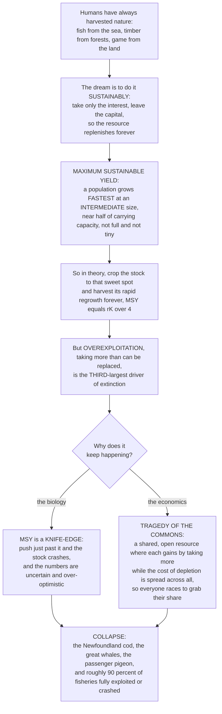

# 🎣 Overexploitation and Sustainable Harvesting

> [!abstract] TL;DR
> Humans have always lived off nature — fish from the sea, timber from forests, game from the land — and the dream is to do it **sustainably**: take only the "**interest**" and leave the "**capital**," so the resource replenishes forever. The elegant theory behind this is **maximum sustainable yield (MSY)**: because populations follow **logistic growth**, a stock's absolute surplus production peaks not when it is full and crowded (near carrying capacity $K$) nor when it is tiny, but at an **intermediate size around $K/2$**, where it replenishes itself as fast as physically possible. So in principle you can crop a stock down to that sweet spot and harvest its rapid regrowth ($\text{MSY} = rK/4$) indefinitely. Beautiful on paper — but in practice **overexploitation** (taking more than a population can replace) is the roughly **third-largest driver of extinction** and the cause of history's great ecological disasters: the passenger pigeon, the great whales, the North American bison, and the collapse of the Newfoundland **cod**. Why does it keep happening? Partly because MSY is a **knife-edge** — push just past it, or overestimate it in a bad year, and the stock crashes, and the numbers are always uncertain and biased toward optimism. But mostly because of the **tragedy of the commons** (Hardin): when a resource is shared and open to all, each individual gains fully from taking more while the cost of depletion is spread across everyone, so all race to grab their share before rivals do — which is why roughly **90% of the world's fisheries are now fully exploited or collapsed**. The remedies are governance and **property rights** (catch shares / ITQs), Ostrom-style co-management, quotas, **marine protected areas**, certification, and international treaties. Understanding both the biology of surplus yield and the economic forces that override it is central to managing fisheries, forests, and wildlife — the whole question of living off nature without destroying it.

---

## Intuition

**Analogy — living off the interest, not the capital.** Imagine you inherit a savings account. If it pays 5% interest, you can withdraw that 5% every year forever and never touch the principal — the account refills itself and lasts for your grandchildren. But spend the principal itself and the interest shrinks too, and soon the account is empty. A wild population is exactly such an account: the "principal" is the breeding stock, and the "interest" is the **surplus** of new individuals it produces each year. Harvest only the surplus and the resource lasts forever; eat into the breeding stock and you shrink all future harvests until the population is gone.

Now the twist that makes ecology richer than a bank. A population's "interest rate" is not constant. A tiny population produces little surplus simply because there are few breeders. A population jammed at its **carrying capacity** produces little surplus too, because it is crowded — every scrap of food and space is already taken, so births barely exceed deaths. The surplus is **greatest in between**, at an intermediate size (roughly half of carrying capacity), where the population is large enough to breed prolifically yet uncrowded enough that resources are still plentiful. This is the beautiful idea of **maximum sustainable yield**: crop the stock down to that fast-growing sweet spot and harvest its rapid regrowth year after year.

So why, if the theory is so elegant, has humanity hunted the passenger pigeon and the great whales to oblivion and crashed one fishery after another? Two reasons. First, **MSY is a knife-edge** — the peak of a hump. Stand exactly on the summit and a single misstep, a bad breeding year, or an over-optimistic estimate tips you down the far side, where harvesting *exceeds* the surplus and the population spirals to collapse. Second, and more fundamental, the ocean's fish are not in *your* private savings account — they are a **commons**, shared and open to all. When a resource is shared, each fisher who catches one more fish gets the whole benefit, while the cost of the emptier sea is spread across every fisher. So everyone rationally races to grab their share before rivals do, and the shared account is drained to nothing. This is the **tragedy of the commons**, and it is why "take only the interest" — so obvious for your own savings — collapses so reliably for the fish, forests, and wildlife we all share.

---

## How It Works

### Core Mechanics

1. **Surplus production comes from logistic growth.** A harvested population's regrowth is its **surplus production** — the extra individuals it adds per unit time. Under the **logistic model**, that surplus is $g(N) = rN\left(1 - N/K\right)$, where $r$ is the intrinsic growth rate and $K$ the carrying capacity. This is a downward hump: zero at $N=0$ (no breeders), zero at $N=K$ (no room to grow), and maximal in between.

2. **The peak sits at half of carrying capacity.** Differentiating the surplus and setting it to zero, $\frac{d}{dN}\big[rN(1-N/K)\big] = r(1 - 2N/K) = 0$, gives the maximum at $N = K/2$. The surplus there — the **maximum sustainable yield** — is $\text{MSY} = rK/4$. This single result is the theoretical heart of fisheries and wildlife management.

3. **Harvesting adds a removal term.** With harvest rate $H$, the stock obeys $dN/dt = rN(1-N/K) - H$. A sustainable harvest is one where removal equals surplus, so the stock sits at a steady state. The **sustainable-yield curve** is just the surplus hump re-read as "how much can be taken forever at each stock size."

4. **Two harvesting strategies, very different stability.** *Constant quota* (fixed catch $H$ each year, e.g. a fixed tonnage) intersects the hump at two stock sizes — a **stable upper** equilibrium and an **unstable lower** one — and *has no equilibrium at all once $H$ exceeds MSY*, so any overshoot collapses the stock. *Constant effort / constant proportion* (harvest a fixed *fraction* $qE\,N$, e.g. fixed fishing days) is self-correcting: as the stock falls, the catch falls too, so it degrades gracefully rather than crashing.

5. **Why MSY fails in practice.** MSY assumes you know $r$, $K$, and current stock precisely, that the environment is constant, and that only the target species matters. Reality violates all three: stock estimates are **uncertain and optimistically biased**, good and bad years shift the curve, age structure and **depensation** (Allee effects at low density) make recovery slow or impossible, and fishing gear takes **bycatch** and "fishes down the food web." Managers therefore now target points *below* MSY (or maximum *economic* yield, MEY) with precautionary buffers.

6. **The commons is the root socio-economic driver.** Even perfect biology fails under **open access**. When no one owns the resource, individually rational effort keeps rising as long as any profit remains, driving the stock down to the **bioeconomic equilibrium** where profit is fully dissipated — typically far below the level that would maximize either yield or profit. Governance that assigns **rights** (catch shares, territorial use rights, community management) realigns private incentive with collective sustainability.

### Flow



---

## Key Concepts

### Secondary — the interest-and-capital idea

- **Overexploitation** — harvesting a wild population (fish, animals, trees, plants) **faster than it can replace itself**, so it shrinks and can vanish. It is one of the top causes of species going extinct.
- **Sustainable harvesting** — taking only the **extra** (the "interest") a population grows each year, and leaving enough breeders (the "capital") so it bounces back to the same size — forever.
- **Maximum sustainable yield (MSY)** — a population grows fastest not when it is packed full and not when it is nearly empty, but at a **middle size**. MSY is the biggest catch you can keep taking without the population shrinking.
- **Tragedy of the commons** — when something is **shared by everyone and owned by no one** (like ocean fish), each person grabs as much as they can before others do, so it gets used up. This is why so many fisheries have crashed.
- **Famous collapses** — the **passenger pigeon** (billions of birds hunted to extinction by 1914), the **great whales**, the American **bison**, and the Atlantic **cod** off Newfoundland (crashed in 1992, still not recovered).

### Undergraduate — the surplus-production model

- **Surplus (recruitment) production** — for a logistically growing stock, $g(N)=rN\!\left(1-\tfrac{N}{K}\right)$: a parabola in $N$, zero at $0$ and $K$, peaking at $K/2$.
- **MSY and the fishing mortality that delivers it** — $\text{MSY}=rK/4$ at $N_{\text{MSY}}=K/2$. Under proportional harvesting $H=qEN$, the yield-maximizing effort is $E_{\text{MSY}}=r/(2q)$, giving equilibrium stock $K/2$.
- **The sustainable-yield curve** — plot equilibrium yield against stock size (or against effort); it is a hump, and the right half (stock $>K/2$) is safe while the left half (stock $<K/2$) is the **overfished danger zone** where more effort yields *less* fish.
- **Constant-quota vs constant-effort harvesting** — a fixed *quota* has a **stable upper** and **unstable lower** equilibrium and collapses catastrophically if the quota exceeds MSY; a fixed *effort/proportion* is far more robust because the catch scales with the (falling) stock and cannot exceed what the stock provides.
- **Depensation / Allee effects** — at low density, per-capita growth can *fall* (mates scarce, schooling defenses lost), bending the surplus curve so that below a threshold the stock cannot recover even if fishing stops — critical to why crashed stocks like cod stay crashed.
- **Bioeconomics (Gordon–Schaefer)** — couple stock dynamics to **effort** driven by profit; open access drives the stock to the **bioeconomic equilibrium** $N_\infty = c/(pq)$ where rents vanish, generally *below* the MSY stock.

### Graduate — uncertainty, incentives, and governance

- **Why single-species MSY is a fragile target** — it ignores age/size structure (recruitment overfishing vs growth overfishing), environmental variability (regime shifts, the surplus curve is non-stationary), multispecies and technical interactions, and ecosystem effects. The response is a shift to **precautionary reference points** ($B_{\text{MSY}}$, $F_{\text{MSY}}$ as *limits* not targets, harvest control rules), **maximum economic yield (MEY)** which prescribes a *larger* stock than MSY, and **ecosystem-based fisheries management**.
- **The knife-edge instability, formally** — for constant-quota harvesting, the equilibria of $rN(1-N/K)=H$ are $N_\pm=\tfrac{K}{2}\big(1\pm\sqrt{1-H/\text{MSY}}\big)$; a saddle-node **bifurcation** annihilates both at $H=\text{MSY}$, so the "optimal" quota sits exactly at the fold where the system loses all stable states. Estimation error or a bad year then guarantees collapse.
- **Optimistic bias and the assessment ratchet** — stock assessments systematically overestimate abundance and MSY (survivorship of data, hyperstable catch-per-unit-effort as fish school, political pressure to set higher quotas); combined with the fold bifurcation, biased-high MSY is a recipe for serial depletion — the "**illusion of the plateau**" preceding collapse.
- **The tragedy of the commons (Hardin, 1968)** — in a **common-pool resource** (rivalrous but non-excludable), the marginal private benefit of extra effort accrues fully to the individual while the marginal cost of depletion is shared, so the dominant strategy is to expand effort: a multi-player **prisoner's dilemma** / social dilemma whose equilibrium is collective overexploitation. This is why open-access rents dissipate and stocks fall to $c/(pq)$.
- **Beyond Hardin — Ostrom's governance of the commons** — Elinor Ostrom's Nobel work showed the commons is neither doomed to ruin nor requires only privatization or top-down state control: real communities sustainably manage common-pool resources when institutions satisfy her **design principles** (clear boundaries, congruent rules, collective-choice arrangements, monitoring, graduated sanctions, conflict resolution, recognized rights to organize, nested enterprises).
- **The instrument menu** — **rights-based management** (individual transferable quotas / catch shares, TURFs), **spatial closures** (no-take **marine protected areas** as insurance and spillover sources), **input controls** (gear, seasons, effort caps), **output controls** (TACs, quotas), **certification** (Marine Stewardship Council) as a market signal, and **international regimes** (the IWC whaling moratorium, CITES for the wildlife trade, RFMOs for high-seas stocks). Worm et al. (2009) documented that combinations of these can rebuild depleted stocks.

---

## Python Demo

```python
# Overexploitation and sustainable harvesting, in three views:
#   Panel A - the SUSTAINABLE-YIELD CURVE: surplus production g(N) = rN(1 - N/K),
#             a hump peaking at MSY = rK/4 at N = K/2, with three constant-quota
#             harvest levels showing the stable/unstable equilibria and the
#             "danger zone" for stock < K/2.
#   Panel B - the KNIFE-EDGE: time trajectories under constant-quota harvest just
#             below, exactly at, and just above MSY. Above MSY -> COLLAPSE to zero.
#   Panel C - the TRAGEDY OF THE COMMONS (open-access bioeconomics): effort rises
#             while profit remains, the stock is drawn down, and the catch booms
#             then busts toward a depleted equilibrium far below MSY -- the cod story.
import numpy as np
import matplotlib.pyplot as plt

# ----------------------------------------------------------------- parameters
r = 0.6            # intrinsic growth rate
K = 1000.0         # carrying capacity (biomass units)
MSY = r * K / 4.0  # maximum sustainable yield = 150 at N = K/2 = 500

# ============================ Panel A: sustainable-yield curve ================
N = np.linspace(0.0, K, 400)
surplus = r * N * (1.0 - N / K)                       # sustainable yield at each stock size

# ============================ Panel B: constant-quota harvesting ==============
def harvest_constant_quota(H, N0=K, T=120.0, dt=0.01):
    steps = int(T / dt)
    t = np.linspace(0.0, T, steps + 1)
    Nt = np.empty(steps + 1); Nt[0] = N0
    for i in range(steps):
        growth = r * Nt[i] * (1.0 - Nt[i] / K)
        Nt[i + 1] = max(Nt[i] + dt * (growth - H), 0.0)  # stock cannot go negative
    return t, Nt

quotas = [0.90 * MSY, 1.00 * MSY, 1.05 * MSY]
labels = ["H = 0.90 MSY  (persists)", "H = 1.00 MSY  (marginal)", "H = 1.05 MSY  (COLLAPSE)"]
qcol   = ["seagreen", "goldenrod", "crimson"]
trajs  = [harvest_constant_quota(H) for H in quotas]

# ============================ Panel C: open-access tragedy of the commons =====
# Stock:  dS/dt = rS(1 - S/K) - qES        (catch = qES)
# Effort: dE/dt = k(p q S - c) E           (effort grows while it is profitable)
q, p, c, k = 0.01, 10.0, 15.0, 0.0015
S_star = c / (p * q)                       # bioeconomic equilibrium stock = 150 (< K/2)
T, dt = 300.0, 0.01
steps = int(T / dt)
tc = np.linspace(0.0, T, steps + 1)
S = np.empty(steps + 1); E = np.empty(steps + 1); catch = np.empty(steps + 1)
S[0], E[0] = K, 2.0
for i in range(steps):
    catch[i] = q * E[i] * S[i]
    dS = r * S[i] * (1.0 - S[i] / K) - q * E[i] * S[i]
    dE = k * (p * q * S[i] - c) * E[i]
    S[i + 1] = max(S[i] + dt * dS, 0.0)
    E[i + 1] = max(E[i] + dt * dE, 0.0)
catch[-1] = q * E[-1] * S[-1]

# --------------------------------------------------------------------- plot
fig, ax = plt.subplots(1, 3, figsize=(17, 4.8))

# Panel A -----------------------------------------------------------------
ax[0].plot(N, surplus, color="navy", lw=2.4, label="Sustainable yield  g(N) = rN(1 - N/K)")
ax[0].axvspan(0, K / 2, color="crimson", alpha=0.07)
ax[0].text(K / 4, MSY * 0.12, "overfished\ndanger zone\n(stock < K/2)",
           ha="center", va="bottom", fontsize=8, color="crimson")
ax[0].plot(K / 2, MSY, "o", color="black", ms=7, zorder=5)
ax[0].annotate("MSY = rK/4\nat N = K/2", xy=(K / 2, MSY), xytext=(K / 2 + 70, MSY * 0.78),
               fontsize=8.5, arrowprops=dict(arrowstyle="->"))
for H, lab, col in zip(quotas, labels, qcol):
    ax[0].axhline(H, ls="--", lw=1.3, color=col, label=lab)
ax[0].set_xlabel("Stock size  N"); ax[0].set_ylabel("Sustainable yield / harvest rate")
ax[0].set_title("(A) Sustainable-yield curve and MSY")
ax[0].legend(fontsize=7.3, loc="upper right"); ax[0].grid(alpha=0.3)
ax[0].set_xlim(0, K); ax[0].set_ylim(0, MSY * 1.25)

# Panel B -----------------------------------------------------------------
for (t, Nt), lab, col in zip(trajs, labels, qcol):
    ax[1].plot(t, Nt, color=col, lw=2.2, label=lab)
ax[1].axhline(K / 2, color="gray", ls=":", lw=1.2, label="K/2  (MSY stock)")
ax[1].set_xlabel("Time"); ax[1].set_ylabel("Stock size  N")
ax[1].set_title("(B) The knife-edge: quota just above MSY collapses the stock")
ax[1].legend(fontsize=7.6, loc="upper right"); ax[1].grid(alpha=0.3)
ax[1].set_ylim(0, K)

# Panel C -----------------------------------------------------------------
ax[2].plot(tc, S, color="steelblue", lw=2.2, label="Stock  S")
ax[2].plot(tc, catch, color="darkorange", lw=2.0, label="Catch  qES")
ax[2].axhline(MSY, color="seagreen", ls="--", lw=1.2, label=f"MSY = {MSY:.0f}")
ax[2].axhline(S_star, color="crimson", ls=":", lw=1.2,
              label=f"open-access stock c/pq = {S_star:.0f}")
ax[2].set_xlabel("Time"); ax[2].set_ylabel("Stock  /  catch")
ax[2].set_title("(C) Tragedy of the commons: effort rises, catch booms then busts")
ax[2].legend(fontsize=7.6, loc="upper right"); ax[2].grid(alpha=0.3)
ax[2].set_ylim(0, K * 1.02)

plt.tight_layout()
plt.savefig("overexploitation_msy.png", dpi=120)
plt.show()

# ------------------------------------------------------------------- report
print(f"MSY = rK/4 = {MSY:.1f}  at stock N = K/2 = {K/2:.0f}")
for (t, Nt), H, lab in zip(trajs, quotas, labels):
    print(f"  quota H = {H:6.1f}  -> final stock {Nt[-1]:7.1f}   [{lab}]")
print(f"Open-access peak catch = {catch.max():.1f}  (vs MSY {MSY:.0f}); "
      f"final stock {S[-1]:.1f} settles toward c/pq = {S_star:.0f} << K/2 = {K/2:.0f}")
```

**What it shows.** **Panel A** is the theory: surplus production is a hump that peaks at $N=K/2$, and MSY $=rK/4$ is its summit. A constant quota is a horizontal line — draw it *below* the summit and it cuts the hump twice (a **stable** upper crossing you can live at, and an **unstable** lower one you must stay above); draw it *above* the summit and it never touches the curve, so removal always exceeds surplus and the stock is doomed. The shaded left half is the overfished danger zone where *pushing harder yields less fish*. **Panel B** turns that geometry into time: a quota at 0.90×MSY settles onto its stable equilibrium, a quota exactly at MSY hangs marginally at $K/2$, and a quota just 5% above MSY — a trivial over-estimate — sends the stock sliding all the way to **zero**. That is the knife-edge. **Panel C** is the economics: with no owner, effort keeps growing while any profit remains, the stock is drawn down, and the **catch booms then busts**, overshooting and then collapsing toward the bioeconomic equilibrium $c/(pq)$ that sits *far below* both MSY and $K/2$ — rents fully dissipated, the sea half-empty. It is the arc of the cod fishery drawn from first principles.

---

## Real-World Applications

> **Example: the collapse and non-recovery of the Newfoundland cod.** The Northern cod off Newfoundland sustained fishing for five centuries. Post-war industrial trawlers, factory ships, and optimistic stock assessments drove catches to a 1968 peak, then a crash; by 1992 the stock had fallen to about **1% of its historic biomass** and Canada declared a moratorium that threw ~35,000 people out of work overnight. Every failure mode in this note appears at once: constant-quota management sitting at the knife-edge, assessments biased high (hyperstable catch rates masked the decline), open-access race-to-fish, ignored age structure, and finally **depensation** — three decades on, the stock has barely recovered because at low density it can no longer bounce back. It is the textbook cautionary tale of MSY meeting the tragedy of the commons.

- **Whaling and its moratorium** — nineteenth- and twentieth-century whaling hunted the great whales toward extinction (blue whales fell below ~1% of pre-whaling numbers). The 1946 IWC managed catch quotas *above* sustainable levels for decades until the 1982 **moratorium**; several species (humpbacks, some blue populations) are now slowly recovering — a rare governance success and a demonstration that below-MSY, even zero-take, targets can rebuild stocks.
- **Individual transferable quotas (catch shares)** — New Zealand, Iceland, Alaska, and Australia assign fishers a tradeable *share* of the total allowable catch, converting an open-access race into a property right. This blunts the tragedy of the commons (fishers now benefit from a larger future stock) and has been associated with slowed or reversed collapse in managed fisheries.
- **Marine protected areas (no-take reserves)** — closing areas entirely (e.g. the Cabo Pulmo reserve in Mexico, whose fish biomass rose several-fold after protection) provides insurance against assessment error and **spillover** of adults and larvae to fished grounds — the spatial hedge against knife-edge management.
- **The wildlife trade and CITES** — overharvesting for the bushmeat, ivory, rhino-horn, pangolin-scale, and tiger-part trades is the terrestrial face of overexploitation; the CITES treaty regulates or bans international trade in threatened species, the legal instrument targeting the "O" in the HIPPO drivers of extinction.
- **Forestry and non-timber harvest** — sustainable-yield forestry (annual allowable cut tied to growth increment) and certification schemes (FSC) apply the same interest-not-capital logic to timber, while the overharvest of slow-growing species (rosewood, wild ginseng) shows how low $r$ makes the sustainable surplus tiny and overexploitation easy.

---

## Common Pitfalls

- **"MSY is a safe target to aim for."** MSY sits *exactly* at the fold where constant-quota harvesting loses all stable equilibria. Aiming at it means one bad year or one over-estimate tips the stock into collapse. Modern management treats $F_{\text{MSY}}$ and $B_{\text{MSY}}$ as **limits to stay away from**, not bullseyes, and fishes below them with a precautionary buffer.
- **"Fishing harder always catches more."** Only on the right half of the yield curve. Once the stock is driven below $K/2$, increasing effort *reduces* long-run catch — the defining trap of the overfished danger zone. Rising effort with falling catch-per-boat is the signature of a stock already past the peak.
- **"Stock estimates are roughly unbiased."** They are systematically **optimistic**: catch-per-unit-effort stays high as fish school even while abundance falls (hyperstability), data favor survivors, and quotas face upward political pressure. Optimistic bias plus a knife-edge equals serial depletion.
- **"A crashed stock will recover once we stop fishing."** **Depensation / Allee effects** mean that below a threshold, per-capita growth turns negative — mates and schooling defenses vanish — so recovery is slow or impossible even with zero harvest. Cod off Newfoundland is the standing rebuttal, decades after the moratorium.
- **"Privatize it or nationalize it — those are the only fixes."** Hardin implied the commons is doomed without private property or state coercion, but **Ostrom** showed that community self-governance with the right design principles (boundaries, monitoring, graduated sanctions) sustainably manages commons worldwide. The real question is *institutional fit*, not a binary choice.
- **"Manage the target species in isolation."** Single-species MSY ignores **bycatch**, habitat damage, and "fishing down the food web" (serially removing top predators, then their prey). Maximizing the yield of one stock can degrade the ecosystem that produces it — the case for ecosystem-based management.

---

## Related Concepts

This note is the **applied-ecology capstone on living off nature without destroying it**, and it leans directly on several vault siblings that are referenced here in prose rather than as links. **Population Growth and Regulation** supplies the logistic engine — the $K/2$ inflection and the $rK/4$ peak are lifted straight from that note's surplus-rate result. **Conservation Biology and the Biodiversity Crisis** ranks overexploitation as the "O" in the HIPPO drivers and the roughly third-largest cause of extinction, framing why this topic matters. **Ecosystem-Based Management and Rewilding** is the successor doctrine that replaces single-species MSY with whole-ecosystem targets, while **Ecological Economics and Natural Capital** formalizes the "interest vs capital" metaphor as sustainable use of natural capital, and **Environmental Policy and Governance** develops the quota, rights, and treaty instruments only sketched here.

- [[Population_Ecology]] — the Biology-vault foundation for logistic growth, carrying capacity, and the surplus production that MSY harvests.
- [[Price_of_Anarchy]] — the game-theoretic quantification of exactly the tragedy of the commons: how far self-interested equilibrium behavior (the race to fish) falls short of the socially optimal outcome.
- [[Externalities_and_Pigouvian_Tax]] — depletion of a shared stock is a negative externality; the microeconomic logic of correcting it (taxes, internalizing the cost) parallels quotas and rights-based management.
- [[Public_Goods]] — common-pool resources like ocean fisheries share the non-excludability of public goods, making them prone to under-provision of restraint and over-provision of effort.
- [[Sustainability_and_Planetary_Boundaries]] — the systems-level framing of overshoot and living within regenerative limits, of which sustainable harvesting is the archetypal single-resource case.

---

## Review Questions

1. **(Secondary)** Explain the "take the interest, not the capital" idea for a wild fish population. Why can a population that is *neither* full *nor* nearly empty be harvested the most each year? What does the term "tragedy of the commons" mean, and how does it explain why ocean fisheries get overfished?
2. **(Undergraduate)** For a logistically growing stock with $r=0.5\,\text{yr}^{-1}$ and $K=2000$ tonnes, compute the maximum sustainable yield and the stock size at which it occurs. A manager sets a **constant quota** equal to MSY. Explain why this is a dangerous choice by describing what happens to the stock after a single bad recruitment year, and contrast the stability of this strategy with **constant-effort** harvesting.
3. **(Undergraduate)** Sketch the sustainable-yield curve and mark the "overfished danger zone." Explain the counterintuitive result that, once a stock is in this zone, *increasing* fishing effort *decreases* the long-run catch. How does this explain the trajectory of the Newfoundland cod?
4. **(Graduate)** Using the constant-quota equilibria $N_\pm=\tfrac{K}{2}\big(1\pm\sqrt{1-H/\text{MSY}}\big)$, describe the saddle-node bifurcation at $H=\text{MSY}$ and explain why systematic *optimistic bias* in stock assessment interacts with this bifurcation to produce serial collapse rather than mere over-fishing. What management reforms (reference points, MEY, precautionary buffers) address this?
5. **(Graduate)** Hardin argued the commons is doomed without privatization or state control, yet Ostrom documented durable community-managed commons. Reconcile these views: under what conditions does open access collapse a stock (relate to the bioeconomic equilibrium $c/(pq)$), and which of Ostrom's design principles most directly prevent that collapse? Evaluate individual transferable quotas and no-take marine reserves as two contrasting solutions.

---

## Sources

- Hardin, G. (1968). "The Tragedy of the Commons." *Science* 162(3859): 1243–1248. [DOI](https://doi.org/10.1126/science.162.3859.1243) — the foundational articulation of why shared, open-access resources drive individually rational actors to collective ruin.
- Clark, C. W. (2010). *Mathematical Bioeconomics: The Mathematics of Conservation* (3rd ed.). Wiley. — the standard treatment of harvesting theory, MSY, open-access dynamics, and the economics of extinction.
- Ostrom, E. (1990). *Governing the Commons: The Evolution of Institutions for Collective Action*. Cambridge University Press. — the Nobel-winning demonstration that communities can sustainably self-govern common-pool resources, with the design principles.
- Worm, B., et al. (2009). "Rebuilding Global Fisheries." *Science* 325(5940): 578–585. [DOI](https://doi.org/10.1126/science.1173146) — a global assessment showing depletion and the mix of management tools (catch shares, effort cuts, closures) that can rebuild stocks.
- Gordon, H. S. (1954). "The Economic Theory of a Common-Property Resource: The Fishery." *Journal of Political Economy* 62(2): 124–142. [DOI](https://doi.org/10.1086/257497) — the origin of open-access bioeconomics and rent dissipation.

---

#ecology #overexploitation #maximum-sustainable-yield #tragedy-of-the-commons #fisheries
