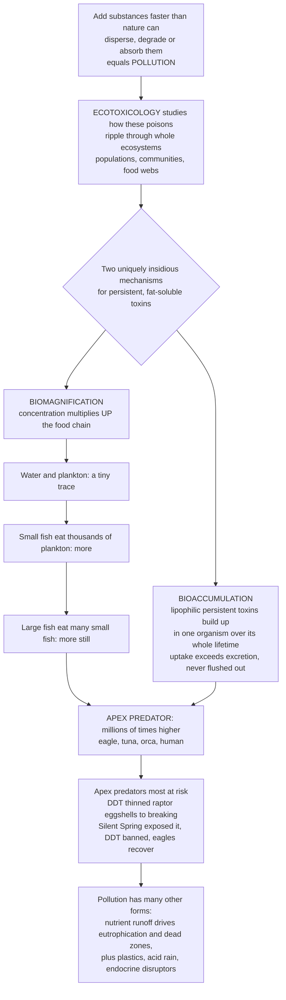

# ☠️ Pollution and Ecotoxicology

> [!abstract] TL;DR
> **Pollution** is what happens when we add substances or energy to the environment **faster than nature can disperse, degrade, or absorb them**, and **ecotoxicology** is the science of how those poisons ripple through whole ecosystems — beyond killing one organism, to reshaping populations, communities, and food webs. Two mechanisms make certain pollutants uniquely insidious. **Bioaccumulation**: fat-soluble (**lipophilic**), persistent toxins — mercury, **DDT**, PCBs — are *not flushed out*; they build up in an organism's tissues over its entire lifetime, so a fish carries the sum of everything it ever absorbed. **Biomagnification**, worse still: these toxins **concentrate as they climb the food chain** — a trace in plankton, more in the small fish that eat lots of plankton, more still in the big fish that eat lots of small fish — until **apex predators** (eagles, tuna, orcas, humans) carry concentrations **millions of times higher** than the surrounding water. That is why top predators — and pregnant women eating tuna — are most at risk, and why DDT nearly wiped out **bald eagles and peregrine falcons** by thinning their eggshells, until Rachel Carson's **_Silent Spring_** (1962) exposed it and launched modern environmentalism. Pollution takes many other forms too: nutrient runoff triggering algal blooms and hypoxic **dead zones** (**eutrophication**), ocean **plastics**, **acid rain**, **endocrine disruptors**, oil spills, and light and noise pollution. As one of the five **HIPPO** extinction drivers, pollution — and understanding how contaminants move, persist, and magnify — is central to protecting both wildlife and ourselves from the invisible chemical consequences of industrial civilization.

---

## Intuition

**Analogy — a spoonful of dye in a river, versus a poison that refuses to leave.** Drop a spoonful of harmless dye into a fast river and it vanishes: the water dilutes and carries it away faster than you add it. That is a pollutant the environment can *absorb*. **Pollution** proper begins the moment you add something **faster than nature can disperse, break down, or soak it up** — the river can no longer keep up, and the substance accumulates. **Ecotoxicology** is the detective work of following that substance downstream: not just "does it kill this one fish?" but "how does it move through the whole living web, and who ends up carrying the most?"

Now imagine a poison that, unlike the dye, is **greasy and indestructible** — it dissolves into fat, not water, and nothing in nature can digest it. Two terrible things follow. First, inside any single animal it **never leaves**: every meal adds a little more to the fat, and none is excreted, so the animal's body becomes a slowly filling reservoir over its whole life — that is **bioaccumulation**. Second, and far more alarming, is what happens *between* animals along the food chain. A stalk of plankton holds a trace. A small fish must eat *thousands* of plankton to grow, inheriting all their traces at once. A big fish eats *hundreds* of those small fish, inheriting all of theirs. An eagle eats many big fish. At each step the toxin is handed **up and concentrated**, because a predator eats far more contaminated mass than it builds into its own body, and the greasy poison stays behind while the water and flesh are used up. By the time you reach the top, the concentration can be **millions of times higher** than in the water where it started — that is **biomagnification**.

This is the cruel geometry that made **DDT** so catastrophic: sprayed to kill insects, it washed into lakes and estuaries at concentrations that looked negligible, then magnified up the food chain until fish-eating birds — **bald eagles, ospreys, peregrine falcons** — accumulated enough to **thin their eggshells** so badly that the eggs cracked under the incubating parent. Whole populations crashed, not from being poisoned outright but from failing to reproduce. It took a marine biologist, **Rachel Carson**, and her 1962 book **_Silent Spring_** — its title evoking a spring with no birdsong — to make the invisible visible and launch the modern environmental movement, leading to the U.S. DDT ban in 1972 and the eagles' eventual return. The lesson generalizes: the top of the food chain suffers most, the source of a poison can be oceans away from its worst victim, and the danger of a pollutant is often less about how toxic one dose is than about how **persistent** and **fat-loving** it is.

---

## How It Works

### Core mechanics

1. **Pollution = input rate exceeding nature's processing rate.** The environment continuously **disperses** (dilutes, mixes), **degrades** (microbial breakdown, photolysis, hydrolysis), and **absorbs/sequesters** (buries in sediment, locks into biomass) foreign substances. Pollution is the regime where the **input flux outpaces this assimilative capacity**, so the contaminant builds up. The same substance can be a nutrient at low flux and a pollutant at high flux — the dose and *rate* make the poison.

2. **Ecotoxicology scales up from the organism to the ecosystem.** Classical **toxicology** asks how a chemical harms an individual (a **dose-response** curve, an LD50). **Ecotoxicology** asks the harder question: what happens to **populations, communities, and food webs** — including indirect effects (removing a predator, collapsing a food source, feminizing a fish population) that no single-organism assay would reveal.

3. **Persistence + lipophilicity = the danger signature.** The worst pollutants share three traits: they are **persistent** (resist degradation, so they linger for years to decades), **lipophilic / fat-soluble** (partition into fatty tissue rather than being excreted in water-based urine), and **bioavailable** (readily taken up). Chemicals with all three — the **Persistent Organic Pollutants (POPs)**: DDT, PCBs, dioxins — and methylmercury are the archetypes.

4. **Bioaccumulation — building up within one organism over time.** An organism **bioaccumulates** a substance when its **uptake rate exceeds its elimination rate**, so the internal concentration climbs over the organism's lifetime. Uptake includes direct absorption from water/air (**bioconcentration**) plus intake from food. Because lipophilic toxins are barely excreted, an old, large individual carries far more than a young one — the body is an integrating reservoir of a lifetime of exposure.

5. **Biomagnification — concentration rising at each higher trophic level.** **Biomagnification** is the *increase in tissue concentration from prey to predator*, step by step up the food web. A predator consumes many contaminated prey; it assimilates the persistent toxin from all of them but respires away most of the ingested *energy and mass*, so the toxin is concentrated into the smaller predator biomass that remains. Multiplied over 4-5 trophic levels, this yields **orders-of-magnitude** enrichment, poisoning **apex predators** most — the classic DDT and methylmercury pattern. (Only persistent, poorly-excreted toxins biomagnify; readily-metabolized ones do not.)

6. **Beyond persistent toxins — the other faces of pollution.** **Nutrient pollution** (excess nitrogen and phosphorus from fertilizer and sewage) drives **eutrophication**: algal blooms, then mass decomposition that consumes dissolved oxygen, creating hypoxic **dead zones**. **Heavy metals** (mercury, lead, cadmium), **plastics and microplastics**, **acid deposition** (acid rain from SO₂/NOₓ), **endocrine-disrupting chemicals** (hormone mimics that feminize fish and disrupt development), **oil spills**, **radioactive** contamination, and even **light and noise** pollution each perturb ecosystems through distinct pathways.

7. **Assess, regulate, recover.** Ecotoxicologists use **bioindicators** and **biomonitoring** (organisms whose condition signals contamination), **toxicity testing** and **dose-response** modeling, and **environmental risk assessment** to quantify hazard. Policy responses — the **Stockholm Convention** on POPs, the U.S. **Clean Air/Water Acts**, the **DDT ban** — plus **bioremediation** can drive real **ecosystem recovery**, as the rebound of raptors after DDT vividly proved.

### The pollution-to-apex-predator pathway



---

## Key Concepts

### Secondary — poisons that build up and climb the food chain

- **Pollution is adding stuff faster than nature can clean it up.** Nature can dilute and break down a little of almost anything. It becomes *pollution* when we add it faster than nature can get rid of it, so it piles up in the air, water, soil, or living things.
- **Some poisons never leave an animal's body (bioaccumulation).** Certain chemicals — especially greasy, fat-loving ones like **mercury** and **DDT** — dissolve into an animal's fat instead of being flushed out. So they build up over the animal's whole life: an old, big fish carries far more than a young one.
- **And they get worse going up the food chain (biomagnification).** A little toxin in the plankton, more in the small fish that eat lots of plankton, more still in the big fish that eat lots of small fish — until the **top predator** (an eagle, a tuna, a human) carries a concentration **millions of times** higher than the water. Top predators suffer most.
- **DDT and _Silent Spring_.** The pesticide **DDT** magnified up the food chain until it made **bald eagle and falcon eggshells so thin** they broke, nearly wiping the birds out. Rachel Carson's 1962 book **_Silent Spring_** exposed it, and DDT was banned — and the eagles came back.
- **Too many nutrients can suffocate water (eutrophication).** Fertilizer and sewage washing into a lake feed a huge **algae bloom**; when the algae die and rot, decomposers use up the oxygen, creating a **"dead zone"** where fish can't breathe.
- **Pollution comes in many forms.** Not just chemicals: **plastics** in the ocean, **acid rain**, oil spills, and even too much **light and noise** all disturb wildlife.

### Undergraduate — mechanisms, pollutant classes, and assessment

- **The assimilative-capacity view.** An ecosystem has a finite capacity to **disperse, degrade, and sequester** inputs. Pollution is input beyond that capacity; the *same* substance (nitrogen, heat, CO₂) is benign below and harmful above threshold flux. Pollution is one of the five **HIPPO** drivers of biodiversity loss (Habitat loss, Invasive species, **Pollution**, Population/overconsumption, Overharvesting).
- **Bioaccumulation, bioconcentration, biomagnification — precise definitions.** **Bioconcentration:** uptake directly from the surrounding medium (water) relative to that medium — quantified by the **Bioconcentration Factor (BCF)**. **Bioaccumulation:** net build-up from *all* routes (water + diet) when uptake exceeds elimination — the **Bioaccumulation Factor (BAF)**. **Biomagnification:** the *stepwise increase* in concentration with each rise in **trophic level** — quantified by the **Biomagnification Factor (BMF = C_predator / C_prey)** and, across a food web, the **Trophic Magnification Factor (TMF)** measured against nitrogen isotope (δ¹⁵N) trophic position.
- **Why lipophilic + persistent is the worst combination.** Lipophilicity is captured by the **octanol-water partition coefficient (log K_ow)**; high log K_ow chemicals partition into fat and resist water-based excretion. Persistence means slow environmental **half-life**. Together they guarantee both bioaccumulation (poor excretion) and biomagnification (survives passage up the web). This defines the **Persistent Organic Pollutants (POPs)** — DDT, PCBs, dioxins, and organochlorine pesticides — regulated globally under the **Stockholm Convention**.
- **The classic cases.** **DDT → eggshell thinning → raptor collapse:** DDT's metabolite DDE disrupts calcium deposition in eggshells; magnified up aquatic food webs it crashed **bald eagle, osprey, brown pelican, and peregrine falcon** populations mid-20th century. **Mercury → Minamata:** industrial **methylmercury** discharged into Japan's Minamata Bay biomagnified into fish and shellfish, causing devastating neurological disease in people who ate them — the founding human tragedy of ecotoxicology.
- **Eutrophication as a nutrient-driven regime shift.** Excess **N and P** → algal/cyanobacterial **bloom** → bloom dies → microbial **decomposition consumes dissolved oxygen** → **hypoxia** (below ~2 mg O₂/L) → **dead zone** where mobile animals flee and sessile ones die. It can be an abrupt **regime shift** with hysteresis (see *Ecological_Stability_Resilience_and_Tipping_Points* in this vault). The Gulf of Mexico dead zone, fed by Mississippi-basin fertilizer, reaches thousands of square kilometers each summer.
- **Major pollutant classes at a glance.** POPs and pesticides; **heavy metals** (Hg, Pb, Cd — persistent, non-degradable, often biomagnifying as methylmercury); **nutrients** (eutrophication); **plastics/microplastics** (entanglement, ingestion, sorbed-toxin vectors); **acid deposition** (acidifies lakes and soils, mobilizes aluminum); **endocrine disruptors** (hormone mimics — feminized fish downstream of sewage); oil, air pollutants, radionuclides, and **light/noise** (behavioral and ecological disruption).
- **Assessment tools.** **Bioindicators/biomonitoring** (lichens for air quality, mayfly larvae for stream health, mussels for coastal contaminants); **dose-response** and **species-sensitivity distributions**; **environmental risk assessment** combining exposure and effect. Recovery levers: **bans** (DDT, leaded gasoline), effluent controls, and **bioremediation** (microbes/plants degrading or sequestering contaminants).

### Graduate — kinetics, magnification models, and system consequences

- **One-compartment toxicokinetics.** Model internal concentration $C(t)$ as uptake minus first-order elimination: $\dfrac{dC}{dt} = k_u \cdot C_w - k_e \cdot C$, where $k_u$ is the uptake rate from water of concentration $C_w$ and $k_e$ the elimination rate. Steady state gives the bioconcentration factor $\text{BCF} = C_{ss}/C_w = k_u/k_e$. **Bioaccumulation** occurs whenever total uptake (including dietary) exceeds $k_e C$; a small $k_e$ (persistent, lipophilic toxin) makes $C_{ss}$ large and the approach to it slow — the organism integrates decades of exposure.
- **Food-web magnification as a product of assimilation and growth dilution.** Between trophic levels, the biomagnification factor rises when **assimilation efficiency of the toxin** is high, **elimination** is low, and **feeding rate per unit predator mass** is high, while **growth dilution** (fast somatic growth spreading toxin over more tissue) works the opposite way. Across a web, concentration scales roughly geometrically with trophic level: $C_n \approx C_0 \prod_{i=1}^{n} \text{BMF}_i$, so 4-5 levels of BMF ≈ 5-30 each multiply to **10⁵-10⁶-fold** enrichment. Empirically this is measured as the slope of $\log C$ against **δ¹⁵N-derived trophic position** (the TMF).
- **Why biomagnification is selective.** Only chemicals that resist metabolism biomagnify. Highly lipophilic PCB congeners and methylmercury biomagnify strongly; readily metabolized compounds (many PAHs in vertebrates, most modern pesticides) bioaccumulate weakly or not at all and can even show *trophic dilution*. Metals differ from organics: most are regulated/excreted, but **methylmercury** — biotically methylated in anoxic sediments — behaves like a lipophilic organic and biomagnifies powerfully, which is why apex marine predators (tuna, swordfish, sharks, toothed whales) carry the highest burdens.
- **Eutrophication dynamics and hysteresis.** Nutrient loading past a threshold flips shallow waters from clear/macrophyte-dominated to turbid/phytoplankton-dominated states, and stratified coastal/benthic systems into seasonal or persistent hypoxia. Because internal loading (sediment P release under anoxia) and altered food webs create **positive feedbacks**, recovery requires cutting loads *far below* the tipping load — a **hysteresis** loop. Diaz & Rosenberg (2008) documented **>400 spreading coastal dead zones** worldwide, a major and growing ecotoxicological syndrome.
- **Sublethal, delayed, and population-level effects.** The ecologically decisive endpoints are often **sublethal**: reproductive failure (eggshell thinning), endocrine disruption (imposex in snails from tributyltin; intersex fish from estrogenic effluent), immunotoxicity, and behavioral change — effects invisible in an acute LD50 but capable of collapsing populations. **Mixture toxicity** (additive/synergistic cocktails), **transgenerational** and **epigenetic** transfer, and interactions with warming and hypoxia complicate real-world risk far beyond single-chemical assays.
- **Global transport and the "grasshopper effect."** Volatile, persistent POPs undergo repeated evaporation-deposition cycles that carry them **poleward** (global distillation), concentrating in cold Arctic ecosystems and biomagnifying into polar bears, seals, and Indigenous peoples' diets **thousands of kilometers from any source** — the starkest demonstration that persistent pollution is a planetary, not local, problem.

---

## Python Demo

```python
# Pollution & ecotoxicology in three pictures:
#   Panel 1  BIOMAGNIFICATION up the food chain: a fat-soluble, persistent toxin
#            (DDT / methylmercury) multiplies orders of magnitude from water to apex predator.
#   Panel 2  EUTROPHICATION dead zone: as nutrient loading rises, an algal bloom rots and
#            dissolved oxygen CRASHES through a regime shift into hypoxia.
#   Panel 3  RECOVERY after a ban: DDT declines and bald-eagle breeding pairs rebound
#            after the 1972 U.S. ban (Silent Spring's legacy).
import numpy as np
import matplotlib.pyplot as plt

# =========================================================== Panel 1: BIOMAGNIFICATION
# Start from a tiny toxin concentration in water; each trophic step multiplies it, because a
# predator eats many contaminated prey and retains the persistent, fat-soluble toxin.
levels   = ["Water", "Phytoplankton", "Zooplankton", "Small fish", "Predatory fish", "Fish-eating bird"]
bmf_step = np.array([1.0, 800.0, 6.0, 9.0, 5.0, 12.0])   # multiplier from the level below
conc_water = 5.0e-5                                        # ppm DDT in water (estuary-scale trace)
conc     = conc_water * np.cumprod(bmf_step)              # cumulative concentration per level
total_magnification = conc[-1] / conc[0]

print("BIOMAGNIFICATION up the food chain (ppm):")
for lv, c in zip(levels, conc):
    print(f"  {lv:<18} {c:12.5f} ppm")
print(f"  Apex predator is {total_magnification:,.0f}x the water concentration "
      f"(~{total_magnification/1e6:.1f} million-fold)\n")

# =========================================================== Panel 2: EUTROPHICATION
N   = np.linspace(0, 100, 500)          # nutrient (N + P) loading index
Nc, k = 55.0, 0.18                       # tipping load and sharpness of the collapse
O2  = 1.0 + 8.0 / (1.0 + np.exp(k * (N - Nc)))   # dissolved O2 (mg/L): ~9 -> ~1 regime shift
hypoxia = 2.0                            # mg/L: below this water is a "dead zone"
i_cross = np.argmax(O2 < hypoxia)        # first loading index that tips into hypoxia
N_tip   = N[i_cross]

# =========================================================== Panel 3: RECOVERY after ban
year  = np.arange(1950, 2011)
ban   = 1972
ddt   = np.where(year < ban, 100.0, 100.0 * np.exp(-0.09 * (year - ban)))   # env. DDT index
K, r, t0 = 10000.0, 0.18, 1992.0        # logistic recovery of bald-eagle breeding pairs
pairs = 500.0 + (K - 500.0) / (1.0 + np.exp(-r * (year - t0)))

# =============================================================================== PLOT
fig, ax = plt.subplots(1, 3, figsize=(18, 5.4))

# --- Panel 1: biomagnification bar chart (log scale) -------------------------------
colors = plt.cm.YlOrRd(np.linspace(0.25, 0.95, len(levels)))
ax[0].bar(range(len(levels)), conc, color=colors, edgecolor="black")
ax[0].set_yscale("log")
ax[0].set_xticks(range(len(levels)))
ax[0].set_xticklabels(levels, rotation=35, ha="right", fontsize=8)
ax[0].set_ylabel("toxin concentration (ppm, log scale)")
ax[0].set_title("Biomagnification: toxin climbs the food chain")
for i, c in enumerate(conc):
    ax[0].text(i, c * 1.6, f"{c:.2g}", ha="center", fontsize=7.5)
ax[0].text(0.05, 0.92, f"apex / water\n= {total_magnification:,.0f}x",
           transform=ax[0].transAxes, fontsize=9, color="#b22222",
           va="top", bbox=dict(boxstyle="round", fc="white", ec="#b22222"))
ax[0].grid(alpha=0.3, axis="y")

# --- Panel 2: eutrophication dead zone ---------------------------------------------
ax[1].plot(N, O2, color="#1f6feb", lw=3, label="dissolved oxygen")
ax[1].axhline(hypoxia, color="#b22222", ls="--", lw=1.5)
ax[1].fill_between(N, 0, hypoxia, color="#b22222", alpha=0.12)
ax[1].axvline(N_tip, color="black", ls=":", lw=1.3)
ax[1].text(N_tip + 1.5, 6.5, f"tips into\nhypoxia\nat load ~{N_tip:.0f}",
           fontsize=8, color="black")
ax[1].text(85, hypoxia + 0.25, "DEAD ZONE\n(hypoxia < 2 mg/L)", fontsize=8,
           color="#b22222", ha="center")
ax[1].text(6, 8.6, "healthy,\noxygenated water", fontsize=8, color="#1f6feb")
ax[1].set_xlabel("nutrient loading  (N + P runoff)  ->")
ax[1].set_ylabel("dissolved oxygen  (mg/L)")
ax[1].set_ylim(0, 10)
ax[1].set_title("Eutrophication: oxygen crashes into a dead zone")
ax[1].legend(fontsize=8, loc="lower left"); ax[1].grid(alpha=0.3)

# --- Panel 3: DDT ban and eagle recovery -------------------------------------------
axr = ax[2].twinx()
l1, = ax[2].plot(year, pairs, color="#2e8b57", lw=3, label="bald-eagle breeding pairs")
l2, = axr.plot(year, ddt, color="#8b4513", lw=2.5, ls="--", label="environmental DDT index")
ax[2].axvline(ban, color="black", lw=1.3)
ax[2].text(ban + 0.6, 8600, "1972\nDDT ban", fontsize=8)
ax[2].set_xlabel("year")
ax[2].set_ylabel("bald-eagle breeding pairs (lower 48)", color="#2e8b57")
axr.set_ylabel("environmental DDT (relative index)", color="#8b4513")
ax[2].set_ylim(0, 11000)
ax[2].set_title("Recovery after a ban: Silent Spring's legacy")
ax[2].legend(handles=[l1, l2], fontsize=8, loc="center right")
ax[2].grid(alpha=0.3)

plt.tight_layout(); plt.show()

# --- numbers behind the pictures ---------------------------------------------------
print(f"Eutrophication: dissolved O2 falls from {O2[0]:.1f} mg/L (clean) "
      f"to {O2[-1]:.1f} mg/L (dead zone); tips below {hypoxia} mg/L at loading ~{N_tip:.0f}.")
print(f"Recovery: eagle pairs rise from ~{pairs[year==1972][0]:.0f} at the 1972 ban "
      f"to ~{pairs[-1]:.0f} by 2010, as DDT decays from 100 to "
      f"{ddt[-1]:.1f} on the relative index.")
```

**Panel 1** is the core of ecotoxicology: starting from a barely-detectable trace in water, a persistent, fat-soluble toxin **multiplies by orders of magnitude at every trophic step** — because each predator eats a large mass of contaminated prey and retains the poison — so the fish-eating bird ends up carrying a concentration **millions of times** that of the water. This is exactly why apex predators (and humans eating tuna) are the most contaminated, and why DDT and methylmercury are so dangerous despite low ambient levels. **Panel 2** shows **eutrophication** as a **regime shift**: as nutrient runoff rises, an algal bloom's decomposition consumes oxygen and dissolved O₂ **crashes** through the 2 mg/L hypoxia threshold into a **dead zone** — the Gulf-of-Mexico syndrome. **Panel 3** delivers the hopeful counterpoint: after the 1972 **DDT ban**, environmental DDT decays and **bald-eagle breeding pairs rebound** from a few hundred to thousands — pollution is, uniquely among extinction drivers, often **reversible** once we stop the input.

---

## Real-World Applications

> **DDT, eggshell thinning, and _Silent Spring_ — the case that built the field.** From the 1940s, DDT was sprayed worldwide as a miracle insecticide. Washing into aquatic food webs, it biomagnified into fish-eating birds, where its metabolite **DDE disrupted eggshell calcification**. **Bald eagles, ospreys, brown pelicans, and peregrine falcons** laid eggs so thin they shattered under the incubating parent, and populations collapsed toward extinction. Rachel Carson's **_Silent Spring_ (1962)** synthesized the science for the public, catalyzing the modern environmental movement, the founding of the U.S. EPA, and the **1972 DDT ban** — after which the raptors recovered and the bald eagle was delisted in 2007. It remains the paradigmatic demonstration of persistence, biomagnification, sublethal reproductive failure, and regulatory recovery.

- **Minamata disease — methylmercury biomagnification.** A chemical plant discharged **methylmercury** into Japan's Minamata Bay from the 1930s-1960s; it biomagnified into fish and shellfish, poisoning thousands who ate them with severe neurological damage. It established that **industrial heavy-metal pollution biomagnifies into human food** and inspired the global **Minamata Convention on Mercury (2013)**.
- **The Gulf of Mexico dead zone — eutrophication at continental scale.** Fertilizer and sewage nitrogen and phosphorus from the entire Mississippi basin drain into the Gulf, fueling summer algal blooms whose decomposition creates a **hypoxic dead zone** of several thousand square kilometers — devastating fisheries. It is the flagship example of nutrient pollution as an ecosystem-scale, food-web-restructuring syndrome (see the Oceanography note [[Harmful_Algal_Blooms_and_Dead_Zones]]).
- **Ocean plastics and microplastics.** Millions of tonnes of plastic enter the ocean yearly, killing wildlife by **entanglement and ingestion**, and fragmenting into **microplastics** that pervade food webs and can **sorb and transport** hydrophobic POPs — an emerging, poorly-bounded ecotoxicological frontier.
- **Endocrine disruptors in rivers.** Estrogenic compounds from sewage effluent (natural and synthetic hormones, industrial chemicals) **feminize male fish** (intersex, vitellogenin induction) downstream of treatment plants; **tributyltin** from antifouling paint caused **imposex** in marine snails — landmark demonstrations that sublethal, hormone-level effects can suppress whole populations.
- **Arctic contamination and Indigenous diets.** Global distillation carries volatile POPs poleward, biomagnifying into seals, whales, and **polar bears**, and into the traditional diets of Arctic Indigenous peoples **thousands of kilometers from any source** — a driving case for the **Stockholm Convention** on POPs.
- **Bioindicators and bioremediation in practice.** **Lichens** monitor air quality, **mayfly and stonefly** larvae index stream health, and **mussel-watch** programs track coastal contaminants; conversely, **bioremediation** deploys microbes and plants to degrade hydrocarbons (as after oil spills) or sequester metals — turning ecotoxicological understanding into cleanup.

---

## Common Pitfalls

- **Confusing bioaccumulation with biomagnification.** They are different axes. **Bioaccumulation** is build-up *within one organism over time* (uptake > excretion). **Biomagnification** is the *increase between trophic levels* up a food web. A toxin can bioaccumulate in an individual without biomagnifying if it is metabolized before transfer — always specify which you mean.
- **Assuming every pollutant biomagnifies.** Only **persistent, poorly-metabolized, lipophilic** chemicals (and methylmercury) biomagnify. Readily-metabolized compounds bioaccumulate weakly and can even show **trophic dilution**. Treating all contaminants as biomagnifiers badly misranks risk.
- **Equating toxicity with danger.** The ecological threat of DDT or PCBs is driven less by acute toxicity than by **persistence** and **fat-solubility** — traits that let a "mildly toxic" chemical concentrate a millionfold and cause **sublethal reproductive collapse**. A low LD50 does not mean low ecological risk.
- **Missing sublethal and indirect effects.** Single-organism, acute assays (LD50) miss what actually collapses populations: eggshell thinning, endocrine disruption, behavioral change, immunotoxicity, and **food-web** effects (removing a predator, starving a consumer). Ecotoxicology must scale beyond the individual.
- **Treating eutrophication as linear and reversible.** Nutrient-driven hypoxia often behaves as a **regime shift with hysteresis**: internal loading and altered food webs lock in the degraded state, so cutting nutrients back to the *pre-collapse* level is not enough to recover it.
- **Thinking pollution is a local problem.** Persistent pollutants travel — **global distillation** deposits POPs in the Arctic; atmospheric mercury and acid deposition cross continents. The worst-affected victim is frequently far from the source.
- **Ignoring mixtures and interactions.** Real environments contain **cocktails** whose effects can be additive or synergistic, and pollution interacts with warming, hypoxia, and habitat loss. Regulating one chemical at a time underestimates combined risk.

---

## Related Concepts

- [[Environmental_Health_and_Toxicology]] — the human-health companion: how the same contaminants (mercury, lead, POPs, air pollution) act as **exposures** shaping human disease, extending ecotoxicology's food-web logic to the exposome and public health.
- [[Toxicology_and_Poisoning]] — the pharmacological foundation beneath ecotoxicology: **dose-response**, LD50/therapeutic index, mechanisms of chemical toxicity, and antidotes at the level of the individual organism, which ecotoxicology scales up to ecosystems.
- [[Ecosystems_and_Energy_Flow]] — trophic levels and energy transfer are the very structure that pollutants ride: biomagnification is the food-web pyramid running in reverse for persistent toxins, concentrating them at the apex.
- [[Biodiversity_and_Conservation]] — situates pollution as one of the principal drivers of biodiversity loss, tying ecotoxicology into the broader conservation agenda.
- [[Harmful_Algal_Blooms_and_Dead_Zones]] — the Oceanography deep-dive on eutrophication's marine endpoint: nutrient loading, algal blooms, hypoxia, and the spreading coastal dead zones central to this note's nutrient-pollution thread.

Within this section and vault, Pollution and Ecotoxicology is the applied "chemical assault" note. **Food_Webs_and_Trophic_Dynamics** supplies the trophic-level machinery that biomagnification exploits, concentrating toxins into apex predators; **Conservation_Biology_and_the_Biodiversity_Crisis** frames pollution as the second "P" in the HIPPO drivers of extinction; **Global_Biogeochemical_Cycles** carries the nitrogen and phosphorus loading that drives eutrophication and the human doubling of reactive nitrogen; **Ecological_Stability_Resilience_and_Tipping_Points** explains why nutrient pollution can flip lakes and coasts into self-reinforcing hypoxic regimes with hysteresis; and **Restoration_Ecology** takes up the recovery side — pollutant bans, bioremediation, and the raptor rebound that proves ecosystems can heal once the input stops.

---

## Review Questions

1. **(Secondary)** A pond is sprayed with a long-lasting insecticide at a level so low it is barely detectable in the water, yet a year later the herons that eat the pond's fish are dying. Using the ideas of **bioaccumulation** and **biomagnification**, explain how a concentration harmless in the water can become deadly at the top of the food chain — and why the herons, not the plankton, are the ones that die.
2. **(Undergraduate)** Explain why a pollutant must be both **persistent** and **lipophilic (high log K_ow)** to biomagnify strongly, and use this to contrast DDT/PCBs with a pesticide that vertebrates readily metabolize. Then describe how **eutrophication** turns excess nitrogen and phosphorus into a hypoxic **dead zone**, naming each step from nutrient input to oxygen depletion.
3. **(Graduate)** (a) From the one-compartment model $dC/dt = k_u C_w - k_e C$, derive the steady-state bioconcentration factor and explain why a very small elimination rate $k_e$ makes an organism a lifelong integrator of exposure. (b) Across a food web, why does concentration scale roughly geometrically with trophic level, and how is this measured empirically using δ¹⁵N and the trophic magnification factor? (c) Given that nutrient-driven hypoxia often shows **hysteresis**, explain why halving fertilizer inputs back to pre-collapse levels may fail to reverse a dead zone, and what additional feedback must be addressed.

---

## Sources

- Carson, R. (1962). *Silent Spring*. Houghton Mifflin. — the landmark exposé of DDT, biomagnification, and eggshell thinning that launched modern environmentalism and ecotoxicology.
- Walker, C. H., Sibly, R. M., Hopkin, S. P., & Peakall, D. B. (2012). *Principles of Ecotoxicology* (4th ed.). CRC Press. — standard text on bioaccumulation, biomagnification, mechanisms, and ecological effects of pollutants.
- Newman, M. C. (2019). *Fundamentals of Ecotoxicology: The Science of Pollution* (5th ed.). CRC Press. — comprehensive treatment of toxicokinetics, dose-response, and ecosystem-level consequences.
- Diaz, R. J., & Rosenberg, R. (2008). "Spreading dead zones and consequences for marine ecosystems." *Science*, 321(5891), 926-929. — the definitive survey documenting the global proliferation of eutrophication-driven hypoxic dead zones.
- Blus, L. J. (2011). "DDT, DDD, and DDE in birds." In *Environmental Contaminants in Biota* (Beyer & Meador, eds.). CRC Press. — synthesis of the organochlorine, eggshell-thinning, and raptor-recovery evidence.

---

#ecology #ecotoxicology #biomagnification #eutrophication #pollution
