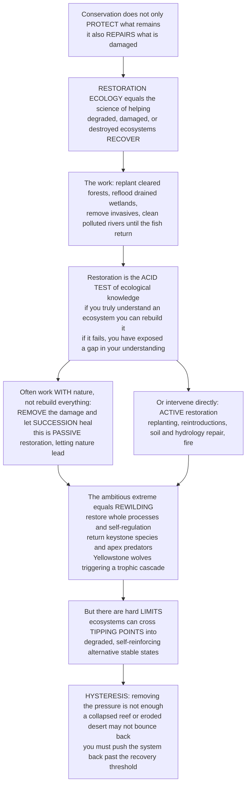

# 🌱 Restoration Ecology

> [!abstract] TL;DR
> Conservation is not only about **protecting what remains** — increasingly it is about **repairing what is damaged**. **Restoration ecology** is the science underpinning **ecological restoration**, defined by the Society for Ecological Restoration as *"the process of assisting the recovery of an ecosystem that has been degraded, damaged, or destroyed."* It is conservation's proactive, hopeful complement to protection: replanting cleared forests, reflooding drained wetlands, ripping out invasives, reintroducing lost species, and cleaning polluted rivers until the fish come back. Bradshaw called it the **"acid test" of ecology** — if you truly understand how an ecosystem works, you should be able to rebuild it; if your restoration fails, you have exposed a gap in your understanding. Crucially, much restoration works *with* nature's own recovery powers: often you don't rebuild everything, you **remove the damage** — stop the pollution, take out the dam, return a keystone species — and let **succession** and natural processes finish the job (**passive restoration**). Its dramatic modern extreme is **rewilding**: restoring whole ecosystems and their self-regulating **processes**, often by returning keystone species and apex predators, the reintroduction of **wolves to Yellowstone** and the trophic cascade that reshaped the landscape being the iconic case. But restoration meets a deep limit: ecosystems can cross **tipping points** into degraded stable states that resist recovery — a collapsed reef or an eroded desert may not bounce back even after the pressure is removed (**hysteresis**). Understanding restoration — its approaches and its limits — completes conservation's toolkit alongside protection and sustainable use.

---

## Intuition

**Analogy — the mechanic who has to prove they understand the engine.** Protecting a rare car in a garage is one thing; anyone can lock a door. But if you claim to *understand* an engine, the real test is this: hand you a wreck — a seized, corroded, half-dismantled engine — and see whether you can make it run again. Restoration ecology is exactly that test applied to nature. Anyone can fence off a healthy forest. The hard, revealing question is whether you can take a bulldozed, poisoned, or drained landscape and **put it back together** so that it lives again. This is why Bradshaw called restoration the **"acid test" of ecology**: rebuilding an ecosystem forces you to prove you know its parts *and* how they fit — its species, food webs, soils, hydrology, and the succession that assembles them. If the engine won't start, you have found the piece you didn't really understand.

And here is the beautiful part — you rarely have to hand-build every part. A good mechanic often just **removes what is jamming the machine** and lets it run on its own power: clear the blockage, and the engine turns over by itself. Restoration works the same way. Frequently the smartest move is not to replant every tree by hand but to **remove the damage** — stop the runoff, breach the dam, pull out the invasive vine, return the missing keystone species — and then let **succession** and natural dispersal do the rebuilding for free. That is **passive restoration**: *letting nature heal.* Its boldest form is **rewilding**, where you restore not just the parts but the whole self-running process — put the wolves back in Yellowstone and let the returning predator re-sculpt the rivers, the willows, and the beaver as it cascades down the food web.

But nature's engine can seize in a way that *won't* restart just because you cleared the blockage. Push an ecosystem past a **tipping point** and it drops into a *different*, self-reinforcing broken state that actively resists repair — the reef that stays algae-choked rubble, the grassland that stays bare desert. Now removing the original pressure is not enough; you have to drag the system *back past the threshold* by force, because the path back is different from the path in (**hysteresis**). Restoration is therefore both ecology's most **hopeful** frontier and its most **humbling** one: it shows us both how much we can rebuild and exactly where our understanding — and nature's resilience — runs out.

---

## How It Works

### Core mechanics

1. **The goal — assisting recovery, not building from scratch.** The SER definition emphasizes *assisting* recovery: restoration aims to return an ecosystem to a self-sustaining, resilient trajectory that resembles a **reference** state and can persist and evolve on its own. The target is usually a **reference ecosystem** — an intact analog or a historical/pre-degradation condition — recovering both **structure** (the species, their abundances, the physical habitat) *and* **function** (the processes — primary production, nutrient cycling, hydrology, disturbance regimes, biotic interactions).

2. **A ladder of ambition — restoration vs rehabilitation vs reclamation vs mitigation.** *Full ecological restoration* aims to return the original ecosystem in structure and function. *Rehabilitation* repairs some functions and services without recreating the exact original community. *Reclamation* stabilizes and makes safe a severely degraded site (e.g., a mine spoil) to a useful, vegetated state. *Mitigation* offsets damage elsewhere (creating or improving habitat to compensate for a loss). They differ in how faithfully they target the reference and how much function versus fidelity they demand.

3. **Two families of approach — passive vs active.** **Passive restoration** removes the *degrading pressure* and lets natural **succession**, dispersal, and recovery proceed — stop the grazing, cut the pollution, remove the dam, and let the system reassemble itself. Where it works, it is typically the **cheapest and most effective** option. **Active restoration** intervenes directly: **revegetation/replanting**, **species reintroductions**, **soil remediation**, **hydrological restoration** (rewetting/reflooding), **invasive removal**, and **prescribed fire**. Real projects usually blend both — often an active "kick-start" (planting nurse plants, reintroducing a missing disperser) that then hands off to passive natural processes (facilitation, succession).

4. **Rewilding — restoring the processes, not just the parts.** Rewilding is the ambitious modern approach: restore ecosystem **processes and self-regulation** and step *back* human management ("letting nature lead"). Its most powerful lever is **trophic rewilding** — reintroducing **keystone species and apex predators** to re-establish **top-down control** and **trophic cascades** (Yellowstone wolves; European bison; beavers as ecosystem engineers). Variants include **Pleistocene rewilding** (using proxies for extinct megafauna to restore lost grazing/browsing) and passive/abandonment rewilding (letting farmland revert).

5. **The limit — thresholds, hysteresis, and irreversibility.** Not every degraded system springs back when you release the pressure. If it has crossed a **tipping point** into an **alternative stable state**, self-reinforcing feedbacks hold it there. Because of **hysteresis**, you must push the driver *past* a recovery threshold — often far below the level that caused the collapse — sometimes accompanied by an active intervention (biomanipulation, keystone reintroduction) that re-establishes the lost stabilizing feedbacks. Removing the pressure alone is not enough.

6. **Measuring success — and the "field of dreams" trap.** Success is judged against reference conditions along recovery trajectories of biodiversity, structure, and function — over **long timescales**, with **monitoring**. A recurring failure mode is the **"field of dreams" fallacy**: *build the habitat and the species will come.* Often they don't — dispersal limitation, missing mutualists, degraded soils, or invasive re-establishment leave a **functional shortfall** where recovery plateaus well below the target.

### The logic of restoration — from repair to rewilding to its limits



---

## Key Concepts

### Secondary — putting nature back together

- **Restoration means repairing damaged nature.** Conservation is not only about guarding the wild places we still have; it is also about **healing the ones we broke** — replanting cut-down forests, letting water back into drained marshes, pulling out plants and animals that don't belong, and cleaning rivers until fish and birds return.
- **Two ways to heal a place.** Sometimes you just **stop the harm and let nature do the work** — quit the pollution, take out a dam, and the plants and animals slowly come back on their own (**passive**). Other times you **roll up your sleeves and help** — plant trees, bring back a missing animal, fix the soil (**active**).
- **Rewilding — bring back the big players.** The boldest kind of restoration returns **keystone animals**, especially top predators, and lets them run the show again. When **wolves were brought back to Yellowstone**, they changed where deer grazed, which let trees grow back, which brought back beavers and songbirds and even changed the rivers — one animal repaired a whole landscape.
- **Aim for a target.** Restorers picture a healthy **reference** version of the place — what it looked like before, or a nearby intact site — and try to guide the damaged one back toward it.
- **Some damage won't just heal.** If a place is broken *too* badly, it can get **stuck** in a new, unhealthy state and *won't* bounce back even after you stop hurting it. That is why preventing damage is still far easier than fixing it.

### Undergraduate — approaches, targets, and the acid test

- **The SER definition and the "acid test."** Ecological restoration is *"the process of assisting the recovery of an ecosystem that has been degraded, damaged, or destroyed."* Bradshaw (1987) framed restoration as ecology's **acid test**: rebuilding an ecosystem is the ultimate check on whether ecological theory actually works — a successful restoration *demonstrates* understanding; a failure *diagnoses* a gap.
- **Structure and function — both matter.** A restoration that replants the right *species list* (structure) but never re-establishes the *processes* (function — nutrient cycling, hydrology, pollination, disturbance) is only half done. Modern practice targets **self-sustaining function and resilience**, not a static snapshot.
- **The ladder of ambition.** *Restoration* (full recovery to reference) > *rehabilitation* (recover key functions/services) > *reclamation* (stabilize a severely damaged site) > *mitigation* (offset losses elsewhere). Knowing which you are actually doing keeps goals — and success criteria — honest.
- **Passive vs active — and working with succession.** **Passive** restoration removes the stressor and lets **succession**, natural dispersal, and **facilitation** rebuild the community; it is often cheapest and most durable *where the seed sources, soils, and species still exist to recolonize.* **Active** restoration (revegetation, reintroductions, soil/hydrology repair, invasive removal, prescribed fire) is needed where natural recovery is blocked — degraded soils, no seed source, or an entrenched alternative state.
- **Rewilding and trophic restoration.** Rewilding restores **processes and self-regulation**, most powerfully by reintroducing **keystone species** and **apex predators** to re-create **trophic cascades** (top-down control). It reduces intensive human management and lets natural disturbance, herbivory, and predation shape the system — a shift from gardening ecosystems to *releasing* them.
- **The reference problem.** Choosing the target is genuinely hard. A purely **historical** reference may be impossible under changed soils, hydrology, or climate; **shifting baselines** mean each generation's idea of "natural" is already degraded. This drives interest in **realistic**, future-oriented, or **novel/no-analog** targets rather than a nostalgic snapshot.
- **The "field of dreams" fallacy and measuring success.** *"Build it and they will come"* often fails — dispersal limits, missing mutualists, and invasives leave recovery **incomplete**. Rigorous restoration therefore requires **long-term monitoring** against explicit, reference-based structural *and* functional criteria.

### Graduate — thresholds, feedbacks, genetics, and restoration at scale

- **Restoration thresholds, alternative stable states, and hysteresis.** A degraded system trapped in an **alternative stable state** will not recover by simply reversing the driver: because of **hysteresis**, the recovery threshold lies *below* the collapse threshold. Effective restoration must (i) reduce the driver past the recovery fold *and/or* (ii) apply an active intervention that re-establishes the **stabilizing feedbacks** of the desired state (macrophytes and biomanipulation in eutrophic lakes; herbivore recovery on algal-dominated reefs). Restoration is thus the applied face of tipping-point theory — see the sibling note *Ecological_Stability_Resilience_and_Tipping_Points*.
- **Trophic rewilding as feedback repair.** Reintroducing an apex predator or keystone engineer is not just "adding a species" — it restores a *process*. Yellowstone wolves illustrate **top-down control**: predator return alters elk behavior and density, releasing willow, aspen, and riparian vegetation, which recovers beaver, stabilizes streambanks, and shifts channel form (a **behaviorally mediated trophic cascade**). The strength and reversibility of such cascades are debated (context-dependence, confounding climate/other predators), which is precisely why rewilding is an experimental test of food-web theory.
- **Genetics and the interaction web, not just the species list.** Durable restoration must restore **genetic diversity**, **local adaptation** (seed **provenance**/sourcing), and the **biotic interactions** (mutualisms — mycorrhizae, pollinators, dispersers) that make a community self-sustaining — not merely a list of present species. Under rapid climate change, **assisted gene flow** and **climate-adjusted provenancing** (sourcing seed pre-adapted to future conditions) trade off local fidelity against future resilience.
- **Novel ecosystems and future-oriented targets.** When abiotic conditions have shifted irreversibly (altered soils, hydrology, climate), the historical reference may be unreachable, producing **novel (no-analog) ecosystems**. This fuels a live debate: restore toward the *past*, or toward a *functional, future-adapted* target (including **assisted migration** of species tracking suitable climate)? The choice reframes success from historical fidelity to functional and service outcomes.
- **Restoration at scale and natural climate solutions.** Global initiatives — the **UN Decade on Ecosystem Restoration (2021–2030)** and the **Bonn Challenge** (restore 350 Mha of degraded/deforested land) — position restoration as a **natural climate solution**: reforestation, **blue carbon** (mangroves, seagrass, saltmarsh), and **peatland rewetting** sequester carbon while restoring biodiversity and services. But carbon-driven "restoration" carries hazards: **afforestation of natural grasslands/savannas** (which are not degraded forests) can destroy biodiversity and even net carbon; monoculture plantations counted as "forest restoration" deliver little ecological recovery. Aligning **carbon and biodiversity** goals — and distinguishing genuine restoration from tree-planting accountancy — is a central graduate-level tension.
- **Measuring recovery: trajectories, timescales, and shortfalls.** Meta-analyses (e.g., Rey Benayas et al. 2009; Moreno-Mateos et al. 2012) show restoration typically increases biodiversity and services but often leaves them **below reference levels**, sometimes for decades or longer — wetlands and forests recover structure faster than full biogeochemical function. Robust assessment tracks **recovery trajectories** against reference *envelopes* (not single points), over ecologically meaningful timescales, and reports **functional shortfalls** honestly rather than declaring premature success.

---

## Python Demo

```python
# Restoration ecology in two views:
#   (A) RECOVERY TRAJECTORIES -- a degraded ecosystem recovering over time toward a
#       reference/target state via succession, comparing PASSIVE restoration (remove the
#       stressor, let nature recover -- slow, dispersal-limited lag) vs ACTIVE restoration
#       (replant + reintroduce -- a head-start and faster rate). A third curve shows an
#       INCOMPLETE recovery that plateaus below the target (a functional shortfall).
#   (B) HYSTERESIS OF RESTORATION -- a degraded ecosystem sitting in an ALTERNATIVE STABLE
#       STATE does NOT recover just by removing the pressure. Using the same fold/cusp
#       model as the tipping-points note (dx/dt = -x^3 + x - c), we show that easing the
#       driver back is not enough (you must push PAST the recovery threshold), while a
#       REWILDING kick -- a keystone reintroduction -- can lift the state over the unstable
#       threshold and let it climb back to the healthy branch at moderate pressure.
import numpy as np
import matplotlib.pyplot as plt

# ===================================================== (A) recovery trajectories
t = np.linspace(0, 60, 400)                    # years since restoration began
target = 100.0                                 # reference-ecosystem condition (index)

def logistic(t, K, r, t0, y0):
    """Recovery of an ecosystem metric (biodiversity/biomass/function), index units."""
    # logistic rising from y0 toward carrying capacity K with rate r, midpoint t0
    return K / (1.0 + ((K - y0) / y0) * np.exp(-r * (t - t0)))

# Passive: remove the stressor, natural succession -- a dispersal lag then slow climb to ~target
passive = logistic(t, K=96.0, r=0.13, t0=26.0, y0=20.0)
# Active: replanting + reintroductions give a head-start (higher y0) and a faster rate
active  = logistic(t, K=100.0, r=0.20, t0=8.0,  y0=42.0)
# Incomplete: recovery stalls well below target (functional shortfall / novel conditions)
incomplete = logistic(t, K=58.0, r=0.16, t0=14.0, y0=20.0)

# ===================================================== (B) hysteresis of restoration
xc = 1.0 / np.sqrt(3.0)                         # fold state  ~0.577
cc = xc - xc**3                                 # fold driver ~0.385
x  = np.linspace(-1.5, 1.5, 1200)
c  = x - x**3                                    # driver c required for each equilibrium state
healthy  = x >  xc                               # upper stable branch (intact ecosystem)
degraded = x < -xc                               # lower stable branch (collapsed ecosystem)
unstable = np.abs(x) <= xc                       # unstable threshold between the two

# interpolators along each stable branch (need c ascending)
def branch_state(mask, cval):
    xb, cb = x[mask], c[mask]
    order  = np.argsort(cb)
    return np.interp(cval, cb[order], xb[order])

print(f"Fold (tipping) points at  x = +/-{xc:.3f},  c = +/-{cc:.3f}")
print(f"Hysteresis width in driver c: {2*cc:.3f}  -> must reverse the driver this far to recover")

# ===================================================================== plot
fig, (axA, axB) = plt.subplots(1, 2, figsize=(15.5, 5.6))

# --- Panel A: recovery trajectories ---------------------------------------------
axA.axhspan(90, 100, color="#2e8b57", alpha=0.10)
axA.axhline(target, ls="--", color="#2e8b57", lw=1.6)
axA.text(1, target + 1.2, "reference / target ecosystem", color="#2e8b57", fontsize=9)
axA.plot(t, active,     color="#1f6feb", lw=2.6, label="ACTIVE (replant + reintroduce): head-start, fast")
axA.plot(t, passive,    color="#d4a017", lw=2.6, label="PASSIVE (remove stressor, let succession heal): slow")
axA.plot(t, incomplete, color="#b22222", lw=2.6, ls=(0, (5, 2)),
         label="INCOMPLETE: recovery plateaus below target")
axA.scatter([0, 0, 0], [42, 20, 20], color=["#1f6feb", "#d4a017", "#b22222"],
            zorder=5, s=35)
axA.annotate("active head-start\n(planting / reintroduction)", xy=(0, 42), xytext=(9, 30),
             fontsize=8, color="#1f6feb",
             arrowprops=dict(arrowstyle="->", color="#1f6feb"))
axA.annotate("dispersal lag\nthen succession", xy=(18, passive[t <= 18][-1]), xytext=(24, 34),
             fontsize=8, color="#9c7a12",
             arrowprops=dict(arrowstyle="->", color="#9c7a12"))
axA.annotate("functional shortfall", xy=(55, incomplete[-1]), xytext=(34, 46),
             fontsize=8, color="#b22222",
             arrowprops=dict(arrowstyle="->", color="#b22222"))
axA.set_xlabel("years since restoration began")
axA.set_ylabel("ecosystem condition  (biodiversity / biomass / function, index)")
axA.set_title("(A) Recovery trajectories: passive vs active vs incomplete")
axA.set_ylim(0, 108); axA.set_xlim(0, 60)
axA.legend(fontsize=8, loc="lower right"); axA.grid(alpha=0.3)

# --- Panel B: hysteresis of restoration + rewilding kick ------------------------
axB.plot(c[healthy],  x[healthy],  color="#2e8b57", lw=3, label="healthy stable state")
axB.plot(c[degraded], x[degraded], color="#8c510a", lw=3, label="degraded stable state")
axB.plot(c[unstable], x[unstable], color="0.55", lw=2, ls="--", label="unstable threshold")
axB.axvspan(-cc, cc, color="orange", alpha=0.10)

# Path 1: PASSIVE -- just easing the pressure keeps you stuck until the recovery fold
c_start = 0.62                                   # heavily degraded, high pressure
axB.scatter(c_start, branch_state(degraded, c_start), s=90, color="#8c510a",
            edgecolor="black", zorder=6)
axB.annotate("degraded\n(high pressure)", xy=(c_start, branch_state(degraded, c_start)),
             xytext=(c_start - 0.05, -1.28), fontsize=8, color="#8c510a", ha="center")
axB.annotate("", xy=(-cc, branch_state(degraded, -cc)), xytext=(c_start, branch_state(degraded, c_start)),
             arrowprops=dict(arrowstyle="-|>", color="#8c510a", lw=2.2))    # ease pressure, still stuck
axB.annotate("", xy=(-cc, branch_state(healthy, -cc)), xytext=(-cc, -xc),
             arrowprops=dict(arrowstyle="-|>", color="#1f6feb", lw=2.5))     # recovery jump at the fold
axB.text(-cc - 0.03, -0.1, "must push PAST the\nrecovery threshold", color="#1f6feb",
         fontsize=8, ha="right")
axB.text(0.12, -1.05, "easing the pressure alone:\nstill degraded (hysteresis)", color="#8c510a", fontsize=8)

# Path 2: REWILDING -- a keystone reintroduction kicks the state over the threshold at moderate pressure
c_kick = 0.0
axB.annotate("", xy=(c_kick, branch_state(healthy, c_kick) - 0.02),
             xytext=(c_kick, branch_state(degraded, c_kick)),
             arrowprops=dict(arrowstyle="-|>", color="#2e8b57", lw=2.6))
axB.text(c_kick + 0.03, 0.15, "REWILDING kick\n(keystone reintroduction)\ntrophic cascade flips it back",
         color="#2e8b57", fontsize=8)

axB.set_xlabel("degradation pressure  c  (nutrient load / grazing / overharvest) ->")
axB.set_ylabel("ecosystem state  x  (function / cover)")
axB.set_title("(B) Hysteresis of restoration: removing the pressure is not enough")
axB.set_ylim(-1.5, 1.5); axB.legend(fontsize=8, loc="upper right"); axB.grid(alpha=0.3)

plt.tight_layout(); plt.show()

# --- numbers behind the picture ------------------------------------------------
print("\nRecovery at year 60 (target = 100):")
print(f"  active     : {active[-1]:5.1f}   (reaches the reference envelope fastest)")
print(f"  passive    : {passive[-1]:5.1f}   (slower start, still recovers)")
print(f"  incomplete : {incomplete[-1]:5.1f}   (plateaus -- a functional shortfall)")
# time for passive vs active to first reach 90% of target
def first_cross(traj, thr=90.0):
    idx = np.argmax(traj >= thr)
    return t[idx] if traj[idx] >= thr else np.inf
print(f"\nYears to reach 90 percent of target:")
print(f"  active  : {first_cross(active):.1f} yr")
print(f"  passive : {first_cross(passive):.1f} yr")
print(f"  incomplete never reaches it (stalls at {incomplete[-1]:.0f}).")
```

**What it shows.** **Panel A** contrasts three restoration trajectories toward a reference ecosystem. **Active** restoration (replanting, reintroductions) buys an immediate **head-start** and a faster rate, reaching the green reference envelope soonest. **Passive** restoration (remove the stressor, let succession heal) begins with a **dispersal/colonization lag** — nothing seems to happen for years — then climbs and, given intact seed sources, still arrives at the target, typically at lower cost. The **incomplete** curve is the sobering common case: recovery accelerates, then **plateaus well below the target** — a *functional shortfall* from degraded soils, missing mutualists, invasives, or altered conditions (the "field of dreams" outcome). **Panel B** encodes the hard limit using the same **fold/cusp** model as the tipping-points note: a system degraded onto the lower (brown) branch does **not** recover by merely easing the pressure — slide the driver `c` leftward and it stays stuck on the degraded branch (**hysteresis**) until you force it all the way to the **recovery threshold** (blue jump), a driver level *lower* than the one that caused collapse. The green arrow shows the rewilding alternative: a **keystone reintroduction** kicks the ecosystem's *state* up over the unstable threshold at moderate pressure, so a **trophic cascade** carries it back to the healthy branch without having to eliminate the driver entirely. (Curves are illustrative but faithful to restoration meta-analyses and alternative-stable-state theory.)

---

## Real-World Applications

> **Example — Yellowstone wolf reintroduction (1995): rewilding as a trophic cascade.** After ~70 years of absence, gray wolves were reintroduced to Yellowstone National Park in 1995–96. As an apex predator they exerted **top-down control** on elk — reducing numbers and, importantly, changing their *behavior* (avoiding risky riparian valleys). Released from heavy browsing, **willow and aspen** regrew along streams, which supported recovering **beaver** (ecosystem engineers whose dams re-wetted valleys), stabilized **streambanks and channel form**, and boosted songbirds and other riparian life — a **behaviorally mediated trophic cascade** that reshaped the landscape. Yellowstone is the iconic demonstration that restoring a single **keystone process** (predation) can rebuild whole-ecosystem structure and function, and the flagship case for **trophic rewilding**. (Its magnitude and confounders are debated — a real reason it remains a live scientific test.)

- **Loess Plateau restoration, China — restoration at continental scale.** One of the largest restoration efforts on Earth: terracing, sediment control, banning grazing on steep slopes, and revegetation across a heavily eroded ~35,000 km² region restored vegetation cover, cut soil erosion into the Yellow River, and boosted local livelihoods — a landmark for large-scale rehabilitation *and* a cautionary tale about matching species to sites.
- **Kissimmee River and the Everglades, USA — hydrological restoration (reflooding).** A river channelized into a straight canal in the 1960s was partially **re-meandered and reflooded**, restoring floodplain wetlands, dissolved-oxygen regimes, and wading-bird and fish communities — the flagship example of restoring *function* by restoring **hydrology**, and a template for the wider Everglades program.
- **Peatland rewetting and blue carbon — natural climate solutions.** Rewetting drained **peatlands** (blocking ditches to raise water tables) halts massive CO₂ emissions and restores carbon accumulation; restoring **mangroves, saltmarsh, and seagrass** ("**blue carbon**") sequesters carbon while rebuilding coastal habitat and storm protection — restoration explicitly aligned with climate mitigation and ecosystem services.
- **Working for Water, South Africa — invasive removal as restoration and jobs.** A national program clears water-hungry invasive alien trees from catchments, restoring **streamflow, native fynbos, and fire regimes** while employing tens of thousands — restoration framed around the **ecosystem service** of water yield.
- **Oostvaardersplassen & Rewilding Europe — process-based rewilding.** Dutch and pan-European projects reintroduce large grazers (and let predators return) to restore natural grazing, disturbance, and self-regulation over farmland reverting to the wild — high-profile, and controversial (animal-welfare and "what baseline?" debates), which sharpens the questions rewilding raises.
- **The UN Decade on Ecosystem Restoration & the Bonn Challenge — the global frame.** The **UN Decade (2021–2030)** and the **Bonn Challenge** (restore 350 Mha by 2030) mobilize restoration worldwide as a biodiversity *and* climate strategy — while the debate over *tree-planting-as-accounting* vs genuine ecological recovery keeps the field honest about what "restoration" really means.

---

## Common Pitfalls

- **The "field of dreams" fallacy — "build it and they will come."** Creating physical habitat does not guarantee the biota returns: **dispersal limitation**, missing **mutualists** (mycorrhizae, pollinators, dispersers), degraded soils, and invasive re-establishment routinely leave recovery **incomplete**. Restoration must address *colonization and interactions*, not just the physical template.
- **Ignoring hysteresis — "just remove the pressure."** For a system trapped in an **alternative stable state**, reversing the driver to pre-collapse levels is not enough; the **recovery threshold** is lower than the collapse threshold. Restoration fails when it doesn't push the driver far enough *and* fails to re-establish the **stabilizing feedbacks** of the desired state.
- **Restoring a species list, not an interaction web.** Getting the right species *present* is not the same as a self-sustaining ecosystem. Neglecting **genetic diversity**, **local provenance**, **trophic interactions**, and **process** yields a brittle, museum-like assemblage that cannot persist or evolve.
- **Freezing a static, historical reference — the shifting-baselines trap.** Aiming at a nostalgic pre-degradation snapshot can be impossible under changed soils, hydrology, or **climate**, and **shifting baselines** mean the chosen "natural" state may already be degraded. Under rapid change, purely historical targets may need to give way to **functional, future-oriented** ones (assisted migration, climate-adjusted provenancing).
- **Confusing tree-planting with forest restoration — and afforesting the wrong ecosystems.** Counting monoculture plantations as "restored forest" delivers little ecological recovery, and **planting trees on natural grasslands and savannas** (which are *not* degraded forests) destroys biodiversity and can even release carbon. Carbon-driven targets must not override ecological reality.
- **Declaring victory too early.** Structure (cover, species presence) recovers faster than **function** (full biogeochemical cycling, complex interactions), which can lag for **decades**. Short monitoring windows and premature "success" claims mask persistent **functional shortfalls** documented across restoration meta-analyses.
- **Treating restoration as a substitute for protection.** Restoration is costly, slow, uncertain, and sometimes impossible (past a tipping point). It **complements** — it does not replace — protecting intact ecosystems and sustainable use; the cheapest, most reliable "restoration" is preventing the damage in the first place.

---

## Related Concepts

This note is the **applied, forward-looking capstone** of the vault: restoration is where the whole toolkit of ecology gets put to the test. Several in-vault topics are its direct scaffolding and are best read alongside it. *Ecological_Succession_and_Disturbance* supplies the natural-recovery engine that **passive restoration** harnesses — succession, dispersal, and facilitation are literally *how* "letting nature heal" works. *Ecological_Stability_Resilience_and_Tipping_Points* is the theory behind restoration's hardest limit — alternative stable states and **hysteresis** explain why a degraded system may resist recovery and must be pushed back past a threshold. *Conservation_Biology_and_the_Biodiversity_Crisis* is the problem restoration answers — the biodiversity crisis whose damage restoration exists to repair. *Ecosystem_Based_Management_and_Rewilding* extends the **rewilding** and process-based management thread introduced here, and *Climate_Change_Ecology* is both a driver restoration must design around (shifting baselines, novel conditions) and a goal it serves (natural climate solutions). Those five are prose references because they are in-vault siblings.

- [[Ecology_and_Conservation_Overview]] — the vault hub that frames restoration as the proactive complement to protection and sustainable use.
- [[Food_Webs_and_Trophic_Dynamics]] — the trophic-cascade and top-down-control mechanics that make **trophic rewilding** (Yellowstone wolves) work.
- [[Ecosystem_Services]] — the services restoration aims to rebuild (water yield, pollination, storm protection, carbon) and the economic case that funds it.
- [[Global_Biogeochemical_Cycles]] — the nutrient and carbon cycling whose *recovery* is the functional target of restoration, and the basis of natural climate solutions.
- [[Habitat_Loss_Fragmentation_and_Island_Biogeography]] — the number-one damage restoration reverses; corridors and area effects shape what can recolonize a restored patch.
- [[Population_Viability_and_Small_Population_Biology]] — the genetics and demography that decide whether reintroduced/restored populations actually persist.
- [[Ecological_Resilience_and_Ecosystems]] — the Systems Thinking treatment of resilience, adaptive cycles, and panarchy that underpins resilience-based restoration.
- [[Anthropogenic_Climate_Change]] — the driver forcing future-oriented targets (assisted migration) and the mitigation goal behind reforestation, blue carbon, and peatland restoration.
- [[Sustainability_and_Planetary_Boundaries]] — scales restoration to the whole Earth system, where restoring biosphere integrity helps pull global systems back from planetary boundaries.
- [[Biodiversity_and_Conservation]] — Biology's foundational conservation treatment that this applied note extends toward active repair (distinct basename by design).
- [[Ecosystems_and_Energy_Flow]] — Biology's energy-and-matter-flow foundation, the *function* that structural restoration must ultimately re-establish.

---

## Review Questions

1. **(Secondary)** Restoration ecology has two broad ways to heal a damaged place: **passive** ("let nature heal") and **active** ("roll up your sleeves"). Explain each in your own words, and describe how bringing **wolves back to Yellowstone** repaired a whole landscape through a chain reaction. Why do scientists say restoration is a *test* of whether we really understand nature?
2. **(Undergraduate)** Bradshaw called restoration the **"acid test" of ecology.** Explain what he meant, and why a restoration that recovers the right *species list* but not ecosystem *function* is only half a success. Then contrast **passive** and **active** restoration: give one situation where passive restoration is the smart, cheap choice and one where it would fail and active intervention is required.
3. **(Undergraduate)** What is the **reference-ecosystem problem**, and how do **shifting baselines** and **novel/no-analog ecosystems** under climate change complicate the choice of a restoration target? Argue for when a **historical** target is appropriate versus when a **functional, future-oriented** target (e.g., assisted migration) makes more sense.
4. **(Graduate)** A eutrophic lake has flipped to a turbid, algae-dominated state. Managers cut nutrient inputs back to the pre-collapse level, yet the lake stays turbid. (a) Using **alternative stable states** and **hysteresis**, explain why. (b) What two things must a successful restoration do that "just remove the pressure" does not? (c) How is this the same logic as a **rewilding** keystone reintroduction that flips a system back at moderate pressure?
5. **(Graduate)** "Tree planting for carbon" is often equated with "forest restoration." Critique this: identify at least two ways carbon-driven planting can *harm* biodiversity or even net carbon (consider grasslands/savannas and monocultures), and explain how genuine restoration — targeting **structure, function, genetic diversity, and interactions** — differs. How should the UN Decade / Bonn Challenge reconcile the carbon and biodiversity goals?

---

## Sources

- Bradshaw, A. D. (1987). "Restoration: an acid test for ecology." In Jordan, W. R., Gilpin, M. E., & Aber, J. D. (eds.), *Restoration Ecology: A Synthetic Approach to Ecological Research*, Cambridge University Press, pp. 23–29. — the classic argument that restoration is the ultimate test of ecological understanding.
- Gann, G. D., et al. / Society for Ecological Restoration (2019). "International principles and standards for the practice of ecological restoration" (2nd ed.). *Restoration Ecology*, 27(S1), S1–S46. [DOI](https://doi.org/10.1111/rec.13035) — the SER definition, reference-ecosystem concept, and standards of practice.
- Suding, K., Higgs, E., Palmer, M., et al. (2015). "Committing to ecological restoration." *Science*, 348(6235), 638–640. [DOI](https://doi.org/10.1126/science.aaa4216) — restoration's promise, limits, novel ecosystems, and the reference/target debate.
- Perino, A., Pereira, H. M., Navarro, L. M., et al. (2019). "Rewilding complex ecosystems." *Science*, 364(6438), eaav5570. [DOI](https://doi.org/10.1126/science.aav5570) — a process-based framework for rewilding: trophic complexity, dispersal, and stochastic disturbance.
- Ripple, W. J., & Beschta, R. L. (2012). "Trophic cascades in Yellowstone: The first 15 years after wolf reintroduction." *Biological Conservation*, 145(1), 205–213. [DOI](https://doi.org/10.1016/j.biocon.2011.11.005) — evidence for the wolf-driven trophic cascade, the iconic rewilding case.

---

#ecology #restoration-ecology #rewilding #ecosystem-recovery #succession
