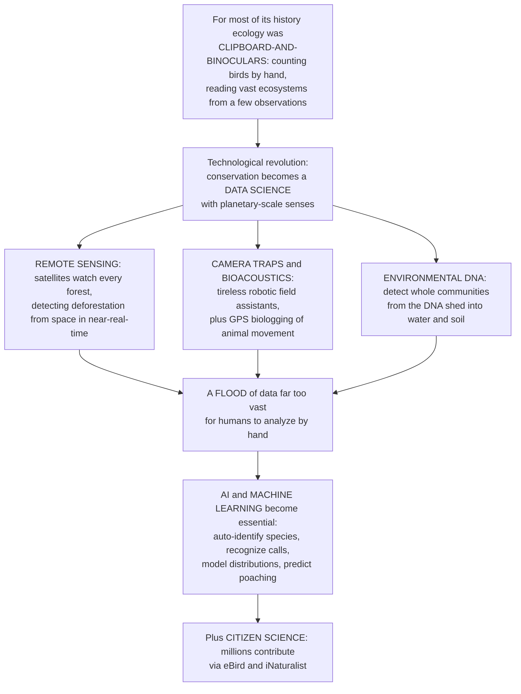

# 🛰️ Conservation Technology and Data Science

> [!abstract] TL;DR
> **Conservation technology and data science** is the technological revolution that is transforming conservation from a **clipboard-and-binoculars craft into a planetary-scale DATA science**, giving ecologists senses they never had. **Satellites** now watch every forest on Earth, detecting deforestation from space in near-real-time (**remote sensing**); cheap automatic **camera traps** and underwater microphones (**bioacoustics**) act as tireless robotic field assistants capturing millions of images and sounds; animals wear **GPS tags** mapping their movements across continents; and we can now detect which species live in a river or forest just by sequencing the DNA they shed into the water and soil (**environmental DNA** — a genetic fingerprint of a whole ecosystem from a cup of water). All of this generates a **flood of data far too vast for humans to analyze by hand**, so **artificial intelligence and machine learning** have become essential — automatically identifying species in camera-trap photos, recognizing whale calls, predicting where species live (**species distribution models**) and where poaching will strike next. Meanwhile **citizen science** apps such as eBird and iNaturalist mobilize millions of ordinary people to build biodiversity datasets no research team could. Understanding these tools — the sensors, the genomics, the AI — reveals how the fight to save biodiversity is being revolutionized, finally offering the ability to monitor the living planet at the **speed and scale the crisis demands** — a key frontier of the conservation science in this vault.

---

## Intuition

**Analogy:** For most of its history, ecology was a **clipboard-and-binoculars science** — a researcher sitting in a cold, wet field at dawn, counting birds by hand, tagging animals one at a time, trying to understand a vast, breathing ecosystem from a few dozen painstaking observations scribbled in a notebook. It was heroic, meticulous work, but it was like trying to map an ocean with a teaspoon. Now imagine that same ecologist is suddenly handed **planetary-scale senses**. Instead of one hillside, they can watch **every forest on Earth from orbit**, and get a text alert the day a chainsaw opens a new clearing in the Amazon. Instead of sitting still for weeks hoping a jaguar walks past, they scatter cheap **camera traps and microphones** through the jungle — tireless robotic field assistants that never sleep, capturing millions of photos and recording every roar, birdsong, and gunshot. Instead of trapping a fish to know it is there, they scoop up **a single cup of river water** and read, from the DNA that fish shed into it, the entire cast of species living upstream. And because all of this produces **more data than any human could ever look at**, they hand the flood to an **artificial intelligence** that learns to name every animal in every photo and predict where poachers will strike next.

That is conservation technology and data science: the shift from small-scale, labor-intensive fieldwork to **high-throughput, big-data ecology.** Satellites (remote sensing), camera traps and acoustic sensors (bioacoustics), GPS biologging, drones, and environmental DNA are the new *senses*; machine learning, species distribution models, and biodiversity databases are the new *brain* that turns raw signals into knowledge; and citizen-science platforms turn *millions of people* into a distributed sensor network. It matters because the biodiversity crisis is unfolding faster than clipboards can track — and for the first time, we have instruments that can watch the whole living planet at the speed the emergency demands.

---

## How It Works

### Core Mechanics

1. **The data revolution — why it matters.** The biodiversity crisis (habitat loss, extinction, climate change) is unfolding across the whole planet and on timescales of years, not decades. **Manual fieldwork cannot keep up**: it is slow, spatially sparse, expensive, and biased toward accessible places. Conservation technology re-tools the discipline for **high-throughput, planetary-scale monitoring** — the goal is to sense biodiversity and its threats at the *speed and scale* of the crisis itself.
2. **Remote sensing and satellites — watching the land from space.** Earth-observation satellites (**Landsat**, ESA's **Sentinel**, commercial fleets like Planet) image every point on land repeatedly, and **spectral indices** (e.g., NDVI, the normalized difference vegetation index) turn reflectance into maps of forest cover, health, and change. Automated **change detection** flags newly cleared pixels, powering near-real-time **deforestation alerts** (Global Forest Watch, GLAD alerts). **LiDAR** adds the third dimension — canopy height and forest structure — while radar sees through clouds. This is the primary tool for tracking **habitat loss** at global scale.
3. **Camera traps and bioacoustics — robotic field assistants.** Motion-triggered **camera traps** photograph wildlife day and night, cheaply and continuously, yielding millions of images. **Passive acoustic monitoring** with autonomous recording units listens for birds, bats, frogs, and whales — and for the sounds of **threats** (chainsaws, gunshots). These sensors decouple observation from a human being present, delivering vastly more, less-biased data.
4. **Biologging and telemetry — following animals across continents.** **GPS and satellite tags** record where individual animals go, at what speed, and when — reconstructing migrations, home ranges, and habitat use. Shared archives like **Movebank** aggregate billions of animal-location records, revealing movement ecology invisible from the ground.
5. **Drones and sensor networks.** **UAVs (drones)** survey inaccessible or dangerous habitats (nesting cliffs, wetlands, forest canopy), map vegetation, count colonies, and support **anti-poaching** patrols with thermal cameras. Networked **IoT sensors** stream environmental data (temperature, sound, movement) in real time.
6. **Environmental DNA and conservation genomics — reading ecosystems molecularly.** Organisms constantly shed cells into their surroundings; **environmental DNA (eDNA)** captures that shed DNA from **water or soil**, and **metabarcoding** amplifies and sequences it to list **whole communities** at once — detecting rare, cryptic, or invasive species without ever seeing them. **Conservation genomics** monitors genetic diversity, inbreeding, and population structure — vital for **small-population biology**.
7. **The data deluge meets AI.** All of the above produce **far more data than humans can process**. **Machine learning and deep learning** automate the bottleneck: convolutional networks classify species in camera-trap and iNaturalist photos (e.g., **MegaDetector**), acoustic models recognize calls (e.g., **BirdNET**), **species distribution models** (SDMs / ecological niche models such as MaxEnt) predict where species live and how ranges shift under climate change, **occupancy models** correct for imperfect detection, and predictive systems (e.g., **PAWS**) optimize ranger patrols to pre-empt poaching.
8. **Biodiversity informatics and citizen science.** Aggregators like **GBIF** turn scattered records into queryable global databases, while **citizen-science** platforms (**eBird**, **iNaturalist**, **Zooniverse**) mobilize millions of volunteers to generate — and help label — biodiversity data at unprecedented scale. **Open data** and reproducibility knit it all into a shared evidence base.
9. **Frontiers and caveats.** The trajectory points toward **real-time "planetary dashboards"** and **digital twins** of ecosystems. But the tools carry pitfalls: **sampling and taxonomic biases** in citizen data, the **technology-versus-boots-on-the-ground** trade-off, **dual-use risk** (tracking data leaking to poachers), and a **digital divide** that concentrates capacity away from the most biodiverse nations. Measurement must *drive* action, not substitute for it.

### Flow / Architecture



---

## Key Concepts

### Secondary (foundational)

- **Conservation tech** — using modern gadgets (satellites, cameras, microphones, drones, DNA kits, computers) to watch over nature at a size and speed that a person with a notebook never could.
- **Remote sensing** — cameras in **space** that photograph the land again and again, so we can spot a forest being cut down almost the moment it happens.
- **Camera trap** — a camera that snaps a picture by itself whenever an animal walks past, working day and night for months so scientists do not have to sit and wait.
- **Environmental DNA (eDNA)** — every animal leaves tiny bits of its DNA in the water and soil around it; scientists can scoop up **a cup of water**, read that DNA, and get a list of the creatures living there — without ever seeing one.
- **GPS tracking** — a little tag on an animal that beams back where it is, so we can follow a whale or an elephant on a map across a whole continent.
- **Artificial intelligence for wildlife** — because the cameras and microphones make **millions** of photos and sounds, computers are taught to recognize each animal automatically, far faster than any human.
- **Citizen science** — ordinary people using phone apps like **eBird** and **iNaturalist** to report the birds and plants they see, together building a picture of nature bigger than any one team could.

### Undergraduate (core)

- **Spectral indices and change detection** — surfaces reflect light differently; indices like **NDVI** contrast near-infrared and red reflectance to quantify green vegetation. Comparing images over time (change detection) isolates newly cleared pixels, the basis of **deforestation alert** systems (GLAD/Global Forest Watch) built on **Landsat/Sentinel** archives.
- **Passive acoustic monitoring** — autonomous recorders sample soundscapes continuously; signal-processing plus machine learning detect and classify species-specific calls (birds, bats, cetaceans) and anthropogenic threats, yielding presence/activity data over long periods and remote sites.
- **Biologging / telemetry** — GPS-Argos tags stream animal locations; movement metrics (step length, turning angle, home range, migratory connectivity) feed **movement ecology** and reserve design. Archives like **Movebank** enable cross-study synthesis.
- **eDNA metabarcoding** — universal PCR primers amplify a barcode region (e.g., COI, 12S) from environmental samples; high-throughput sequencing plus a reference database assigns reads to taxa, producing rapid **community-level biodiversity assessments** and early detection of invasive or rare species.
- **Species distribution models (SDMs) / ecological niche models** — statistical/ML models (logistic regression, random forests, **MaxEnt**) relate species occurrences to environmental predictors (temperature, precipitation, land cover) to predict **habitat suitability** across space and to project **climate-driven range shifts**. The workhorse of spatial conservation planning.
- **Occupancy and imperfect detection** — because a species can be present but undetected on a survey, the **naive occupancy** (fraction of sites where it was seen) is biased *low*. **Occupancy models** use **repeat surveys** to separately estimate detection probability (p) and true occupancy (psi): probability of detecting an occupied site in K visits is 1 − (1 − p)^K. This formalizes why **absence of evidence is not evidence of absence**.
- **Deep learning for automated identification** — convolutional neural networks classify/detect animals in camera-trap and citizen-science images (MegaDetector, iNaturalist's model) and acoustic models (BirdNET) identify calls, collapsing months of manual labeling into minutes.
- **Biodiversity informatics** — infrastructures like **GBIF** standardize and aggregate occurrence records (Darwin Core), enabling global-scale analysis, while data-sharing norms support reproducibility.

### Graduate (advanced)

- **The correlative-vs-mechanistic SDM debate** — correlative niche models capture *realized* niches and can be confounded by biotic interactions, dispersal limitation, and sampling bias; **mechanistic** (process-based) models encode physiology to estimate the *fundamental* niche. Transferring models in space/time (climate projection) demands care with **extrapolation, non-analog conditions, and niche truncation**; validation metrics (AUC, Boyce index) and spatial cross-validation guard against inflated performance from spatial autocorrelation.
- **Detection–occupancy modeling and hierarchical models** — occupancy is a **hierarchical (state-space) model** separating an ecological process (occupancy) from an observation process (detection). Extensions handle multi-species (community occupancy), dynamics (colonization/extinction), abundance (N-mixture), and integrate heterogeneous data streams (**integrated SDMs / point-process models**) that fuse structured surveys with opportunistic citizen data while modeling its bias.
- **Sampling bias in opportunistic big data** — citizen-science and museum records are spatially/temporally/taxonomically biased (roads, weekends, charismatic taxa, observer skill). Correcting this — via effort covariates, thinning, target-group backgrounds, or explicit observation submodels — is central to trustworthy inference; unmodeled bias masquerades as ecological signal.
- **eDNA inference and its limits** — read counts are semi-quantitative at best; **detection probability** depends on shedding, transport, degradation, and PCR/bioinformatic pipeline choices, while **false positives** (contamination, DNA transport) and **false negatives** (primer bias, incomplete reference libraries) require occupancy-style modeling and rigorous controls. eDNA gives presence, rarely abundance or life stage.
- **Deep learning at deployment** — transfer learning, active learning, and few-shot methods reduce labeling cost; but **domain shift** (new sites, camera angles, species), **long-tailed** class distributions, and the need for **calibrated uncertainty** and human-in-the-loop verification determine real-world reliability. Edge/on-device inference enables real-time alerts where connectivity is absent.
- **Predictive anti-poaching and adversarial dynamics** — systems like **PAWS** cast patrol planning as a **Stackelberg security game / spatiotemporal prediction** problem, allocating scarce ranger effort against a strategic, adapting adversary; naive prediction that ignores the feedback between patrols and poacher behavior degrades over time.
- **Frontiers and the sociotechnical caveats** — **real-time planetary dashboards**, ecosystem **digital twins**, and essential biodiversity variables (EBVs) promise continuous global monitoring, but raise governance questions: **dual-use** (tracking data enabling poaching), **data sovereignty** and the **digital divide** in biodiverse low-income nations, reproducibility of black-box pipelines, and the risk that abundant *measurement* substitutes for scarce *action* and funding for on-the-ground protection.

---

## Python Demo

```python
# CONSERVATION TECHNOLOGY & DATA SCIENCE -- two workhorses in three panels
#   (A) SPECIES DISTRIBUTION MODEL: fit a niche from presence/absence data
#       in environmental space (temperature x precipitation).
#   (B) SUITABILITY MAP: project that model across a landscape to predict
#       WHERE the species can live -- the core of conservation planning.
#   (C) IMPERFECT DETECTION / OCCUPANCY: why "absence of evidence is not
#       evidence of absence", and how repeat surveys recover true occupancy.
import numpy as np
import matplotlib.pyplot as plt

rng = np.random.default_rng(7)

# ---------- (A) synthesize occurrence data with a Gaussian niche ----------
T_opt, P_opt = 18.0, 1200.0        # niche optimum: temp (deg C), precip (mm/yr)
T_tol, P_tol = 5.0, 350.0          # niche breadth (tolerance) on each axis
n = 600
T = rng.uniform(2, 32, n)          # surveyed sites: temperature
P = rng.uniform(300, 2200, n)      # surveyed sites: precipitation
suit_true = np.exp(-0.5*(((T-T_opt)/T_tol)**2 + ((P-P_opt)/P_tol)**2))
y = (rng.uniform(size=n) < suit_true).astype(float)   # 1 = present, 0 = absent

# ---------- fit a logistic-regression SDM with quadratic niche terms ----------
# features [1, T, P, T^2, P^2]; standardized so gradient descent is stable
Xraw = np.column_stack([T, P, T**2, P**2])
mu, sd = Xraw.mean(0), Xraw.std(0)
def design(t, p):
    Xs = (np.column_stack([t, p, t**2, p**2]) - mu) / sd
    return np.column_stack([np.ones(len(t)), Xs])
X = design(T, P)
w = np.zeros(X.shape[1])
for _ in range(4000):                       # batch gradient descent
    pr = 1/(1+np.exp(-X @ w))
    w -= 0.3 * X.T @ (pr - y) / n            # gradient of the logistic loss
def sdm(t, p):
    return 1/(1+np.exp(-design(np.ravel(t), np.ravel(p)) @ w))

# ---------- (B) build a synthetic landscape and project suitability ----------
gx, gy = 140, 140
xx, yy = np.meshgrid(np.linspace(0, 1, gx), np.linspace(0, 1, gy))
T_map = 30 - 26*yy + 3*np.sin(4*xx)          # temperature falls to the north
P_map = 400 + 1700*(1-xx) + 200*np.cos(3*yy) # precipitation rises to the west
S_map = sdm(T_map, P_map).reshape(gy, gx)

# ---------- (C) imperfect detection / occupancy ----------
K = np.arange(0, 11)                 # number of repeat surveys
det_ps = [0.2, 0.4, 0.7]             # per-visit detection probabilities
psi_true = 0.60                      # TRUE fraction of sites occupied
cum_det   = {p: 1-(1-p)**K for p in det_ps}          # P(detect | occupied, K)
naive_psi = {p: psi_true*(1-(1-p)**K) for p in det_ps} # biased-low naive estimate

# ============================ PLOT ============================
fig, (axA, axB, axC) = plt.subplots(1, 3, figsize=(17, 5.2))

# (A) environmental space + fitted niche contours
m = y == 1
axA.scatter(T[~m], P[~m], s=12, c="lightgray", edgecolor="gray", lw=0.3, label="absent")
axA.scatter(T[m],  P[m],  s=16, c="#1a9850", edgecolor="k", lw=0.3, label="present")
Tg, Pg = np.meshgrid(np.linspace(2,32,150), np.linspace(300,2200,150))
Sg = sdm(Tg, Pg).reshape(Tg.shape)
cs = axA.contour(Tg, Pg, Sg, levels=[0.25,0.5,0.75], colors="#762a83", linewidths=1.4)
axA.clabel(cs, fmt="%.2f", fontsize=7)
axA.plot(T_opt, P_opt, "*", ms=16, c="gold", mec="k", label="true niche optimum")
axA.set_xlabel("Temperature  (deg C)")
axA.set_ylabel("Precipitation  (mm/yr)")
axA.set_title("(A) SDM fit in environmental space")
axA.legend(loc="upper right", fontsize=7.5)

# (B) predicted suitability map across the landscape
im = axB.imshow(S_map, origin="lower", extent=[0,1,0,1], cmap="YlGn",
                vmin=0, vmax=1, aspect="auto")
axB.contour(xx, yy, S_map, levels=[0.5], colors="k", linewidths=1)
axB.set_title("(B) Predicted habitat suitability MAP")
axB.set_xlabel("West  <-->  East")
axB.set_ylabel("South  <-->  North")
fig.colorbar(im, ax=axB, fraction=0.046, pad=0.04, label="suitability")

# (C) imperfect detection: detection curves + biased naive occupancy
for p in det_ps:
    axC.plot(K, cum_det[p],   "-o", ms=4, label=f"detect|occupied, p={p}")
    axC.plot(K, naive_psi[p], "--", lw=1.3, label=f"naive occupancy, p={p}")
axC.axhline(psi_true, color="k", ls=":", lw=1.5)
axC.text(0.2, psi_true+0.02, f"TRUE occupancy = {psi_true}", fontsize=8)
axC.set_xlabel("Number of repeat surveys  K")
axC.set_ylabel("Probability")
axC.set_title("(C) Imperfect detection:\nrepeat visits recover true occupancy")
axC.set_ylim(0, 1.02)
axC.legend(loc="lower right", fontsize=6.3)

plt.tight_layout()
plt.savefig("conservation_tech_data_science.png", dpi=120)
plt.show()

# ---- console summary ----
acc = np.mean((sdm(T, P) > 0.5).astype(float) == y)
print("=== (A) Species distribution model ===")
print(f"Fitted logistic SDM training accuracy: {acc:.2f}")
print(f"Recovered high-suitability core near T~{T_opt:.0f} C, P~{P_opt:.0f} mm/yr")
print("\n=== (C) Imperfect detection / occupancy ===")
for p in det_ps:
    k80 = int(np.argmax(cum_det[p] >= 0.8))
    print(f"p={p}: need K={k80} repeat surveys for an 80% chance of detection")
print(f"With p=0.2 a single visit finds only ~{psi_true*0.2:.2f} of occupied sites")
print("-> absence of evidence is NOT evidence of absence")
```

**What it shows.** **Panel A** is the guts of a **species distribution model**: green points are sites where the species was recorded present, gray where absent, and the purple contours are the **fitted habitat-suitability surface** a logistic-regression SDM learns from just two environmental predictors — temperature and precipitation. The model recovers a bounded **niche** (a peak of suitability) centered on the true optimum (gold star), exactly as MaxEnt-style tools do in practice. **Panel B** is what conservation actually wants: projecting that fitted model onto a **landscape** where temperature and rainfall vary in space produces a **suitability map** — a prediction of *where the species can live* — with the black line marking the 0.5 suitability boundary of the likely range. This is the workhorse behind reserve siting and climate-range projection. **Panel C** captures the monitoring problem that all this sensing must reckon with: **imperfect detection**. A species can be present but missed, so the **naive occupancy** (dashed lines) sits well below the **true occupancy** (dotted black line at 0.6). As you add **repeat surveys** K, the chance of detecting an occupied site (solid lines) climbs as 1 − (1 − p)^K, and the naive estimate converges toward the truth — quantifying *how many visits* a low-detection species needs and why **absence of evidence is not evidence of absence.**

---

## Real-World Applications

> **Example:** **Global Forest Watch and near-real-time deforestation alerts — planetary remote sensing turned into action.** Global Forest Watch fuses the **Landsat** archive (via the University of Maryland's Hansen Global Forest Change dataset) and **Sentinel** imagery with automated change-detection algorithms (GLAD alerts) to flag newly cleared forest pixels within days of a satellite pass. Anyone can watch tree-cover loss across the entire tropics on a free web dashboard, and enforcement agencies and Indigenous communities receive push alerts pinpointing fresh clearings — turning a task that once took a person walking a transect into a **continuous, global, near-real-time** deforestation-monitoring system that is the archetype of conservation technology.

- **Camera-trap AI at continental scale** — Snapshot Serengeti and Wildlife Insights process **hundreds of millions** of camera-trap images; Microsoft's **MegaDetector** and species classifiers automate what once took armies of volunteers, and citizen-labeled data on **Zooniverse** trains the models — collapsing years of manual review into automated pipelines.
- **BirdNET and passive acoustic monitoring** — the **BirdNET** deep-learning model identifies thousands of bird species from audio, powering apps used by millions and research-grade acoustic sensor arrays that track populations, migration, and habitat quality from sound alone.
- **eDNA biodiversity surveys** — water samples analyzed by **metabarcoding** now routinely detect fish and amphibian communities, catch **invasive species** (e.g., Asian carp, zebra mussels) early, and survey elusive or rare taxa faster and often more sensitively than nets or traps — biodiversity assessment from a bottle of water.
- **Movebank and the ICARUS vision** — the **Movebank** archive aggregates billions of animal-tracking locations, and space-based tracking initiatives aim to follow small animals globally, revealing migratory connectivity essential for designing corridors and protected areas.
- **PAWS predictive anti-poaching** — the Protection Assistant for Wildlife Security applies machine learning and game theory to historical patrol and snare data to **predict poaching hotspots** and optimize ranger patrol routes, deployed in reserves in Africa and Southeast Asia.
- **eBird and iNaturalist as a planetary sensor network** — Cornell's **eBird** ingests over a billion bird observations feeding **Status and Trends** abundance maps, and **iNaturalist** crowdsources hundreds of millions of georeferenced, AI-assisted species records into **GBIF** — biodiversity datasets no single research team could ever assemble.

---

## Common Pitfalls

- **Treating opportunistic big data as unbiased.** Citizen-science and museum records cluster near roads, cities, weekends, and charismatic species, and vary with observer skill. Feeding them into an SDM without modeling **sampling bias** (effort covariates, spatial thinning, target-group backgrounds) makes the model learn *where people look*, not *where the species lives*.
- **Confusing non-detection with absence.** A survey that fails to record a species has **not** proven it absent — detection is imperfect. Ignoring **occupancy/detection** structure and treating naive occupancy as truth systematically **underestimates** range and can wrongly declare recovery or local extinction. Repeat surveys and detection modeling are essential.
- **Over-trusting SDM projections beyond the training envelope.** Correlative niche models extrapolate poorly into **non-analog** climates and confound dispersal limits and biotic interactions with the fundamental niche. High AUC on spatially autocorrelated data is often illusory; use **spatial cross-validation** and honest uncertainty before projecting future ranges.
- **Reading eDNA as abundance or certainty.** eDNA gives **presence signals**, not counts or life stage, and is prone to **false positives** (contamination, DNA transported downstream) and **false negatives** (primer bias, incomplete reference libraries). Without rigorous controls and detection modeling, an eDNA "hit" can mislead.
- **Deploying deep-learning classifiers without accounting for domain shift.** A model trained on one region's camera-trap images degrades on new sites, angles, and rare classes (long-tailed data). Skipping **calibrated uncertainty** and **human-in-the-loop** verification lets confident-but-wrong predictions corrupt datasets.
- **Letting measurement substitute for action.** The most seductive pitfall: technology can make us feel we are "doing something" while producing dashboards, not outcomes. Data must **drive** protection, funding, and enforcement — and must not divert scarce resources from **boots on the ground** and the communities living with wildlife.
- **Ignoring dual-use and the digital divide.** Fine-grained tracking and location data can **leak to poachers**; and capacity, infrastructure, and **data sovereignty** are concentrated in wealthy nations, not the biodiverse tropics where the data originate. Ethical and equitable design is not optional.

---

## Related Concepts

This note sits in the **ecological economics, policy, and frontiers** section and connects tightly to several in-vault siblings referenced here in prose. **Conservation_Biology_and_the_Biodiversity_Crisis** is the crisis-discipline opener whose habitat-loss, extinction, and threat drivers these tools are built to *measure* at scale; **Climate_Change_Ecology** supplies the range-shift and species-distribution-modeling problem that SDMs and remote sensing quantify and project; **Population_Viability_and_Small_Population_Biology** is where the conservation-genomics, inbreeding, and monitoring outputs of these technologies feed directly into PVA and management; **Ecological_Economics_and_Natural_Capital** frames the value, funding, and cost-effectiveness questions that decide which monitoring investments are worth making; and **The_Reach_and_Future_of_Ecology** situates the whole data revolution as a defining frontier of the discipline. Those five are prose references because they are in-vault siblings.

- [[Ecology_and_Conservation_Overview]] — the vault hub that situates conservation technology as the applied, data-driven capstone atop population, community, and ecosystem ecology.
- [[Habitat_Loss_Fragmentation_and_Island_Biogeography]] — the primary threat that satellite remote sensing and deforestation-alert systems are designed to detect and quantify.
- [[Extinction_and_the_Sixth_Mass_Extinction]] — the extinction crisis whose pace these monitoring tools exist to track and, ideally, help avert.
- [[Invasive_Species_and_Biological_Invasions]] — invasions that eDNA metabarcoding and camera/acoustic sensors excel at detecting early, when control is still feasible.
- [[Biodiversity_and_Species_Richness]] — the biodiversity metrics that eDNA, camera traps, and citizen science now estimate rapidly and at scale.
- [[Protected_Areas_and_Conservation_Strategies]] — reserve siting and management informed by SDM suitability maps, movement tracking, and predictive anti-poaching.
- [[Metapopulations_and_Spatial_Ecology]] — the spatial and connectivity theory that biologging and SDMs make operational for corridor and reserve design.
- [[Logistic_Regression]] — the classification workhorse behind the species distribution model in the demo, mapping environmental predictors to presence probability.
- [[CNN_Fundamentals]] — the convolutional networks that automate species identification in camera-trap and iNaturalist imagery.
- [[YOLO_Deep_Dive]] — real-time object detection of the kind used to localize and count animals (and detect threats) in wildlife imagery and drone footage.
- [[Classification_Metrics]] — accuracy, precision/recall, and confusion matrices that evaluate automated species classifiers and detection pipelines.
- [[DNA_Sequencing_Technologies]] — the high-throughput sequencing platforms that make environmental-DNA and conservation genomics possible.
- [[Metagenomics_and_Microbiome]] — the metabarcoding/community-sequencing methods that eDNA borrows to read whole ecosystems from a water sample.
- [[Big_Data_and_the_Social_Sciences]] — the citizen-science and found-data big-data paradigm that parallels biodiversity informatics platforms like eBird and iNaturalist.

---

## Review Questions

1. **(Secondary)** Explain in your own words how a scientist can find out which fish live in a river **without catching a single one**, and how a satellite can help protect a forest. Why are these methods better than one person watching with binoculars?
2. **(Secondary/Undergraduate)** Camera traps and citizen-science apps produce **millions** of photos. Why has **artificial intelligence** become essential to conservation, and what job does it actually do with all those images and sounds?
3. **(Undergraduate)** Define a **species distribution model** and describe its inputs (predictors, occurrences) and output (suitability map). Give one real conservation decision an SDM can inform, and one reason its future projections should be treated cautiously.
4. **(Undergraduate/Graduate)** A field team surveys 100 wetlands once and detects a frog at 20. Using **imperfect detection**, explain why the *true* occupancy is almost certainly higher than 20%, write the probability of detecting an occupied site in K visits, and describe how repeat surveys let you estimate detection probability and true occupancy separately.
5. **(Graduate)** Conservation technology is celebrated as a revolution, yet it carries sociotechnical pitfalls. Choose **two** — for example sampling bias in opportunistic big data, eDNA false positives/negatives, deep-learning domain shift, dual-use tracking data, or the digital divide — explain the mechanism of each, and discuss how they should shape the design of a real-world biodiversity-monitoring program so that measurement genuinely drives conservation action.

---

## Sources

- Pimm, S. L., et al. (2015). "Emerging Technologies to Conserve Biodiversity." *Trends in Ecology & Evolution* 30(11): 685-696. [DOI](https://doi.org/10.1016/j.tree.2015.08.008) — the landmark survey of sensing, tracking, and data technologies transforming conservation.
- Tuia, D., et al. (2022). "Perspectives in machine learning for wildlife conservation." *Nature Communications* 13: 792. [DOI](https://doi.org/10.1038/s41467-022-27980-y) — how ML/deep learning automate species ID, monitoring, and anti-poaching, and the challenges of deployment.
- Elith, J., & Leathwick, J. R. (2009). "Species Distribution Models: Ecological Explanation and Prediction Across Space and Time." *Annual Review of Ecology, Evolution, and Systematics* 40: 677-697. [DOI](https://doi.org/10.1146/annurev.ecolsys.110308.120159) — the canonical review of SDMs and their assumptions and pitfalls.
- Taberlet, P., et al. (2012). "Environmental DNA." *Molecular Ecology* 21(8): 1789-1793. [DOI](https://doi.org/10.1111/j.1365-294X.2012.05542.x) — the foundational framing of eDNA for biodiversity detection.
- Global Forest Watch — [globalforestwatch.org](https://www.globalforestwatch.org/) — the operational near-real-time deforestation-monitoring platform built on Landsat/Sentinel remote sensing.

---

#ecology #conservation-technology #remote-sensing #environmental-dna #machine-learning
