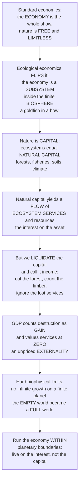

# 🌍 Ecological Economics and Natural Capital

> [!abstract] TL;DR
> **Ecological economics** is the transdiscipline that treats the human economy not as the whole show but as an open **subsystem** embedded within, and utterly dependent on, the finite, non-growing **biosphere**. Its founding move is to see nature as **capital**: forests, fisheries, soils, aquifers, and the climate system are **natural capital** — a stock of assets that yields a continuous *flow* of ecosystem services and resources, exactly as a factory or a bank account yields income. The tragedy it diagnoses is that we have been living by **liquidating** that capital — cutting the forest and booking the timber sale as "income" while ignoring that we destroyed the asset producing clean water, carbon storage, and pollination. This exposes the fatal flaw in **GDP**, which counts the destruction as pure gain and the standing forest's services as nothing, because they are unpriced **externalities** invisible to markets. Building on thermodynamics (Georgescu-Roegen) and ecology (Herman Daly), the field insists on the hard biophysical limits mainstream economics ignores — you cannot have infinite growth on a finite planet — and reframes the challenge as running an economy that thrives *within* planetary boundaries, distinguishing **sustainable scale** from mere efficiency. This section-opener turns that reframing into the policy toolkit — valuation, green accounting, payments for ecosystem services, steady-state and doughnut economics — that underpins the rest of this final section.

---

## Intuition

**Analogy:** Picture the entire human economy as a goldfish swimming in a bowl. Standard economics quietly assumes the fish *is* the world — it can grow forever, and the water is a free, infinite supply that magically cleans itself. Ecological economics starts from the obvious biological fact instead: the fish lives *inside* the bowl. It can never grow bigger than its container, its food and oxygen come *from* the water, and if it fouls that water faster than the water can recover, it dies in its own waste. The economy is that fish; the biosphere is that bowl.

Now notice what the bowl actually is: it is not an afterthought or a backdrop, it is **capital**. Just as a factory is capital that yields goods and a savings account is capital that yields interest, an intact ecosystem is **natural capital** that yields a steady flow of indispensable, mostly free work — a forest purifies water, stores carbon, buffers floods, and houses the pollinators behind a third of our crops. The catastrophe is that we have been treating the *sale of the capital itself* as if it were income: we cut down the forest, count the one-time timber revenue as this year's earnings, and never record that we just destroyed the asset that would have produced clean water and carbon storage forever. It is like a family bragging about a rising "income" that is really just them selling off the furniture. **GDP** enshrines exactly this error — it adds the timber sale as growth and values the standing forest's services at *zero*, precisely because they are free and unpriced, an **externality** the market simply cannot see and therefore destroys. And because the bowl is finite, the deepest insight is that the "empty world" of the past — where nature was vast and humans scarce — has flipped into a **"full world"** where humans and their economy now press against the limits of a biosphere that has become the scarce, binding constraint. Understanding nature as capital, and the economy as its dependent subsystem, is what lets us ask the right question: not how to grow the fish without limit, but how to keep it alive and thriving inside its bowl.

---

## How It Works

### Core mechanics

Ecological economics is built from four moves: **relocate** the economy inside the biosphere, **reconceive** nature as capital, **expose** why markets and GDP systematically destroy it, and **reframe** the goal from limitless growth to sustainable scale.

1. **The economy is a subsystem of the biosphere.** Mainstream (neoclassical) environmental economics treats "the environment" as one sector *inside* the economy — a set of resources and sinks to be priced and traded. Ecological economics inverts the containment: the economy is an *open subsystem* that takes in low-entropy energy and materials from a finite biosphere and returns high-entropy waste and heat to it. This is the **metabolic throughput** view — the economy has a physical metabolism, and that metabolism is bounded by the planet that contains it. Nicholas Georgescu-Roegen grounded this in the second law of thermodynamics (the *entropy law*); Herman Daly built the modern discipline on it.

2. **Nature is capital; ecosystems yield a flow of services.** A *stock* of natural assets — ecosystems, species, soils, freshwater, minerals, the atmosphere and climate — is **natural capital**. Like built or human capital, it yields a *flow*: the resources and **ecosystem services** on which the economy runs. The cardinal rule of any capital is to **live on the interest, not the principal**: harvest a renewable stock at or below its regeneration rate (its *sustainable yield*) and both the asset and its service flow persist indefinitely; draw it down faster and you liquidate the capital, collapsing the future flow with it.

3. **Renewable, non-renewable, and critical natural capital.** *Renewable* natural capital (forests, fisheries, aquifers) regenerates if not overexploited; *non-renewable* capital (fossil fuels, mineral ores) is a one-time inheritance. The crucial category is **critical natural capital** — the climate system, the ozone layer, biodiversity, functioning soils — that has *no substitute at any price*. This is the fault line between **weak sustainability** (built capital can substitute for natural capital, so total capital is what matters) and **strong sustainability** (critical natural capital must be maintained in physical terms, because a filtration plant cannot replace a stable climate).

4. **Markets fail nature in three ways.** (i) **Externalities** — the environmental cost of pollution or depletion is borne by third parties, not the polluter, so the market price is wrong and the damage over-occurs. (ii) **Public goods and the commons** — most regulating services (clean air, climate stability, flood control) are non-excludable and non-rival, so no one owns or bills for them, and self-interested users overexploit them (the *tragedy of the commons*). (iii) **Mis-measurement** — the accounting itself is broken.

5. **GDP counts liquidation as income.** Gross Domestic Product adds up marketed output. It therefore counts cutting a forest, catching the last fish, or cleaning up an oil spill as *positive* contributions (timber sales, catch value, remediation spending — so-called *defensive expenditures*), while recording *nothing* for the standing forest's services and *subtracting nothing* for the natural capital destroyed. The corrective is a family of **"Beyond GDP"** measures: the **Genuine Progress Indicator (GPI)** and **Index of Sustainable Economic Welfare**, which subtract depletion, pollution, and defensive spending; **Inclusive Wealth** and **green/natural-capital accounting** (the UN SEEA standard), which put natural-capital stocks on the national balance sheet. A fourth quiet distortion is **discounting** — applying a market interest rate to future damages shrinks the value of a livable climate a century out to near zero.

6. **Scale, not just allocation and distribution.** Daly's central contribution is to separate three questions a economy must answer: **allocation** (are resources going to the right uses — the market's job, solved by prices), **distribution** (who gets what — a matter of justice), and **scale** (how large is the throughput *relative to the biosphere*). Neoclassical economics obsesses over allocation and treats scale as unlimited. Ecological economics makes **sustainable scale** the first-order constraint: keep total throughput within the biosphere's regenerative and absorptive capacity, *then* let markets allocate and policy distribute inside that ceiling.

7. **From empty world to full world — the growth debate.** When humans were few and nature vast (the *empty world*), human-made capital was the limiting factor and growth in it made everyone richer. In today's *full world*, natural capital is the binding constraint — the fish, not the boats; the atmosphere's carbon-absorbing capacity, not the smokestacks. This motivates the **limits-to-growth** and **decoupling** debates: can GDP keep rising while material and energy throughput falls (*green growth*), or must rich economies deliberately stabilize or shrink throughput? Daly's answer is the **steady-state economy** (constant stocks of population and capital, maintained by minimal throughput); the **degrowth** movement pushes further; Kate Raworth's **doughnut economics** frames the goal as a safe and just space between a *social foundation* (no one falls short on essentials) and an *ecological ceiling* (the **planetary boundaries**).

8. **Valuing nature — and its critics.** To drag unpriced services into decisions, economists estimate their value via *market prices*, *replacement/avoided cost*, *contingent valuation* (stated willingness-to-pay), and *revealed preference* (travel-cost, hedonic pricing). The landmark **Costanza et al. (1997)** aggregation put global ecosystem services on the order of tens of trillions of dollars a year — *exceeding world GDP* — and the **Dasgupta Review (2021)** reframed biodiversity as an asset-management problem for humanity. These feed **Payments for Ecosystem Services (PES)**, **TEEB**, and natural-capital accounting. But deep critiques warn against **commodifying** nature, insist some values are **incommensurable** with money (intrinsic and cultural worth has no exchange rate), and stress that valuation bounded by ability-to-pay can entrench **distributional injustice**.

### Flow / Architecture



---

## Key Concepts

### Secondary
- **The economy lives inside nature** — the economy is like a goldfish in a bowl: it cannot grow bigger than the bowl, and if it dirties the water faster than the water can clean itself, it dies. Nature is not a backdrop to the economy; it is what the economy lives inside of.
- **Nature is money in the bank** — a forest, a river full of fish, or healthy soil is like a savings account. If you live off the *interest* (only take what grows back) it lasts forever. If you spend the *capital* (cut it all down at once) you get one big payment and then nothing, ever.
- **Cutting the forest is not "income"** — when we chop down a forest and sell the wood, we call it money earned, but we really just sold off something priceless that was cleaning our water and air for free. That is spending, not earning.
- **GDP measures the wrong thing** — GDP, the number countries use to say how well they are doing, counts cutting down a forest as good and counts the standing forest as worth nothing, because nobody pays for its free work.
- **You cannot grow forever on one planet** — Earth is finite. An economy that tries to grow bigger and bigger without limit eventually runs out of forests, fish, clean water, and places to put its waste.

### Undergraduate
- **Ecological economics vs environmental economics** — environmental economics treats nature as one *sector inside* the economy, to be priced and traded (weak sustainability, faith in substitution). Ecological economics treats the economy as an *open subsystem of the biosphere* with a physical throughput bounded by thermodynamic and ecological limits (strong sustainability for critical natural capital).
- **Natural capital and the stock–flow rule** — ecosystems are a *stock* of natural capital; ecosystem services and resources are the *flow* it yields. Sustainability means harvesting at or below the *sustainable yield* (the interest), never drawing down the principal. Overexploitation collapses both the asset and every future flow.
- **The three market failures** — externalities (pollution costs fall on third parties), public-goods/commons problems (unowned services get overused), and GDP mis-measurement (depletion and defensive expenditures counted as income; non-market services counted as zero). Together these guarantee that unregulated markets systematically degrade nature.
- **Scale vs allocation vs distribution (Daly)** — markets can efficiently *allocate* and policy can fairly *distribute*, but neither controls the *scale* of throughput relative to the biosphere. Ecological economics makes sustainable scale the primary constraint, inside which allocation and distribution are solved.
- **Beyond GDP** — the Genuine Progress Indicator and Inclusive Wealth adjust for natural-capital depletion, pollution, and defensive spending; green accounting (SEEA) balance-sheets natural capital. The Costanza et al. (1997) estimate — global services on the order of US$33 trillion/yr, exceeding world GNP — was designed to make the invisible visible to policy.

### Graduate
- **Thermodynamic foundations (Georgescu-Roegen, Daly)** — the economy is a dissipative process converting low-entropy inputs into high-entropy waste; the *entropy law* imposes an irreversible arrow that no technology repeals. This grounds the throughput view and the critique of "growth as pure innovation," and connects to biophysical-economics measures like EROI (energy return on energy invested).
- **Weak vs strong sustainability and critical natural capital** — weak sustainability (Hartwick–Solow) requires only that *total* capital (natural + built + human) be non-declining, assuming near-perfect substitutability; strong sustainability requires maintaining *critical natural capital* in physical terms because some functions (climate stability, biodiversity, self-repairing soil) are non-substitutable and their loss is irreversible. The empirical bet on the elasticity of substitution is the crux of the whole growth debate.
- **The decoupling debate** — *relative* decoupling (GDP grows faster than throughput) is common; *absolute* decoupling (throughput falls while GDP rises) globally and durably is contested, complicated by *rebound effects* (Jevons paradox) and by outsourcing material footprints to trade partners. Whether green growth is sufficient, or whether steady-state/degrowth is required for rich economies, hinges on the achievable rate and scope of absolute decoupling within planetary-boundary timelines.
- **Valuation, incommensurability, and the marginal–total distinction** — total economic value decomposes into use, option, and non-use (existence, bequest) value. Costanza-style *totals* multiply average per-hectare values by area, but decisions turn on *marginal* value (the last wetland buffering a city may be near-priceless while the average is modest). Ecological economists further argue for *strong incommensurability* — no single monetary metric can capture intrinsic, cultural, and ecological values — motivating *multi-criteria* and *deliberative* valuation over pure cost–benefit analysis.
- **Doughnut economics and planetary boundaries** — Raworth's doughnut nests the economy between a social foundation and an ecological ceiling defined by the Rockström–Steffen planetary boundaries (climate, biosphere integrity, biogeochemical flows, freshwater, land-system change, and others). It operationalizes Daly's scale constraint as a bounded "safe and just operating space," reframing macroeconomic success as staying *within* the doughnut rather than maximizing GDP.

---

## Python Demo

```python
# Ecological economics, two ideas made visual with numpy + matplotlib:
#   (A) NATURAL CAPITAL vs INCOME (sustainability): a renewable natural-capital stock
#       (a forest / fishery) with logistic regeneration. Harvest at/below the interest
#       (sustainable yield) and both the ASSET and its SERVICE FLOW persist forever;
#       ramp harvest above the interest and you LIQUIDATE the capital -- a boom-bust
#       where "GDP" (the harvest booked as income) spikes then CRASHES while the true
#       natural-capital wealth is drawn down to collapse.
#   (B) FULL-WORLD LIMITS (Beyond GDP): GDP keeps rising, but a genuine-progress /
#       welfare measure -- GDP's diminishing welfare benefit minus the accelerating
#       ecological & social costs of a filling world -- peaks and then DIVERGES downward.
import numpy as np
import matplotlib.pyplot as plt

# ---------------- (A) Renewable natural capital: interest vs liquidation ----------------
K   = 100.0      # carrying capacity: max stock of natural capital (forest / fishery)
r   = 0.4        # intrinsic regeneration rate
S0  = 90.0       # initial (near-pristine) stock
T   = 80         # years
years = np.arange(T)
msy = r * K / 4.0             # maximum sustainable yield = nature's max "interest"

def simulate(harvest_rule):
    """Euler-simulate the stock; harvest_rule(stock, year) -> desired harvest (income)."""
    S = np.zeros(T); H = np.zeros(T); s = S0
    for t in range(T):
        regen = r * s * (1.0 - s / K)              # the interest nature pays this year
        h = min(harvest_rule(s, t), s + regen)      # cannot take more than exists
        H[t] = h
        s = max(s + regen - h, 0.0)                 # stock = principal + interest - harvest
        S[t] = s
    return S, H

# Sustainable: live on the interest -> harvest just below the sustainable yield
S_sus, H_sus = simulate(lambda s, t: 0.9 * msy)
# Liquidation: ramp harvest ~9%/yr, eventually far above the interest -> draw down capital
S_liq, H_liq = simulate(lambda s, t: 0.15 * msy * (1.09 ** t))

serv_sus = 0.5 * S_sus         # ecosystem service flow ~ proportional to standing stock
serv_liq = 0.5 * S_liq

gdp_liq    = H_liq             # "GDP": harvest booked as income (counts liquidation as gain)
wealth_liq = S_liq             # genuine wealth: value of the natural-capital stock remaining

# ---------------- (B) Full world: GDP rises, genuine progress diverges downward ----------
gdp = 100.0 * (1.03 ** years)                       # GDP grows ~3%/yr, without limit
x   = gdp / gdp[0]                                  # GDP relative to its start
welfare_benefit = 300.0 * np.log1p(x)               # diminishing marginal welfare of GDP
eco_social_cost = 5.0 * x**2                        # accelerating costs of a FILLING world
gpi = welfare_benefit - eco_social_cost             # Genuine Progress Indicator (welfare)

# ---------------- Plot ----------------
fig, axes = plt.subplots(1, 3, figsize=(16.5, 4.8))
ax1, ax2, ax3 = axes

# Panel 1: the natural-capital STOCK -- sustainable persists, liquidation collapses
ax1.plot(years, S_sus, color="#2ca02c", lw=2.4, label="Sustainable harvest (live on interest)")
ax1.plot(years, S_liq, color="#d62728", lw=2.4, label="Over-harvest (liquidate capital)")
ax1.axhline(K, ls=":", color="gray", lw=1, label="Carrying capacity K")
ax1.set_title("(A1) Natural capital STOCK over time\n(the asset: forest / fishery)")
ax1.set_xlabel("year"); ax1.set_ylabel("stock of natural capital")
ax1.legend(fontsize=8, loc="lower left"); ax1.grid(alpha=0.3); ax1.set_ylim(0, K * 1.1)

# Panel 2: under liquidation, "GDP" booms then busts while true wealth is drawn down
ax2.plot(years, gdp_liq, color="#ff7f0e", lw=2.4, label='"GDP" = harvest booked as income')
ax2.plot(years, wealth_liq, color="#1f77b4", lw=2.4, label="Genuine wealth = natural capital")
ax2.plot(years, serv_liq, color="#9467bd", lw=1.8, ls="--", label="Ecosystem service flow")
ax2.axvline(np.argmax(gdp_liq), ls=":", color="gray", lw=1)
ax2.text(np.argmax(gdp_liq) + 1, ax2.get_ylim()[1] * 0.55,
         "GDP peak,\nthen COLLAPSE", fontsize=8, color="#ff7f0e")
ax2.set_title("(A2) Liquidation: GDP spikes then CRASHES\nas the capital is destroyed")
ax2.set_xlabel("year"); ax2.set_ylabel("value / flow")
ax2.legend(fontsize=8, loc="upper right"); ax2.grid(alpha=0.3)

# Panel 3: FULL WORLD -- GDP rises, genuine progress peaks then diverges downward
ax3.plot(years, gdp, color="#ff7f0e", lw=2.4, label="GDP (keeps rising)")
ax3.plot(years, gpi, color="#2ca02c", lw=2.4, label="Genuine Progress (welfare)")
peak = int(np.argmax(gpi))
ax3.axvline(peak, ls=":", color="gray", lw=1)
ax3.annotate("welfare peaks,\nthen DIVERGES\nfrom GDP",
             xy=(peak, gpi[peak]), xytext=(peak - 34, gpi[peak] + 120),
             fontsize=8, color="#2ca02c",
             arrowprops=dict(arrowstyle="->", color="#2ca02c"))
ax3.set_title("(B) FULL world: GDP up, genuine welfare down\n(Beyond-GDP divergence)")
ax3.set_xlabel("year"); ax3.set_ylabel("index")
ax3.legend(fontsize=8, loc="upper left"); ax3.grid(alpha=0.3)

plt.tight_layout()
plt.show()

# ---------------- Console summary ----------------
print("=== (A) Natural capital: interest vs liquidation ===")
print(f"  Maximum sustainable yield (the 'interest'): {msy:.1f} units/yr")
print(f"  Sustainable path  -> final stock {S_sus[-1]:5.1f} | final service flow {serv_sus[-1]:4.1f} | ASSET INTACT")
print(f"  Liquidation path  -> final stock {S_liq[-1]:5.1f} | final service flow {serv_liq[-1]:4.1f} | ASSET COLLAPSED")
print(f"  Liquidation 'GDP' peaks at {gdp_liq.max():.1f} in year {int(np.argmax(gdp_liq))}, "
      f"then falls to {gdp_liq[-1]:.1f} (boom-bust)")

print("\n=== (B) Full world: GDP vs genuine progress ===")
print(f"  GDP grows {gdp[0]:.0f} -> {gdp[-1]:.0f} (monotonic, no limit)")
print(f"  Genuine progress peaks (~{gpi[peak]:.0f}) in year {peak}, then falls to {gpi[-1]:.0f}")
print("  => beyond the peak, extra GDP buys LESS welfare than the ecological/social cost it imposes")
```

**Panels (A1) and (A2)** make the capital-vs-income distinction concrete. Harvesting at the *sustainable yield* stabilizes the stock and keeps the service flow running forever — living on the interest. Ramping harvest above the interest liquidates the capital: the stock crashes, the ecosystem service flow crashes with it, and the "GDP" measure — which books each year's harvest as income — shows the classic **boom then bust** (the Atlantic cod story). Crucially, GDP is *rising* right up to the moment of collapse, sending exactly the wrong signal, while the genuine-wealth measure (the value of the standing natural capital) falls steadily throughout, warning of the collapse the whole time. **Panel (B)** dramatizes the *full-world* limit: GDP climbs without bound, but a genuine-progress/welfare measure — the diminishing benefit of more output minus the accelerating ecological and social costs of a filling world — rises, *peaks*, and then diverges downward. Past that threshold, each extra unit of GDP destroys more value than it creates. Both stories share one moral: the number we optimize (GDP, harvest) can point up while the thing we actually care about (natural capital, welfare) points down.

---

## Real-World Applications

- **The Dasgupta Review (2021)** — commissioned by the UK Treasury, Partha Dasgupta's *The Economics of Biodiversity* reframed nature as an *asset* and humanity as an *asset manager* running down its portfolio: estimated produced capital per person roughly doubled 1992–2014 while natural capital per person fell by nearly 40%. It put strong-sustainability and inclusive-wealth accounting onto finance-ministry desks worldwide.
- **Genuine Progress Indicator and Beyond-GDP dashboards** — several US states (Maryland, Vermont) and countries have officially computed the GPI, which subtracts pollution, resource depletion, and defensive spending; the recurring finding that GPI has *plateaued* since the 1970s even as GDP kept climbing is the empirical face of Panel (B). Bhutan's *Gross National Happiness* and the OECD *Better Life Index* are kindred "Beyond GDP" efforts.
- **Natural-capital accounting (UN SEEA)** — the System of Environmental-Economic Accounting Ecosystem Accounting standard, adopted by the UN Statistical Commission in 2021, lets nations put ecosystem stocks and service flows on their balance sheets so that liquidating a forest no longer reads as pure income. Costa Rica, the UK, and others now publish natural-capital accounts.
- **Payments for Ecosystem Services and carbon markets** — Costa Rica's PSA program and the UN's REDD+ operationalize "living on the interest" by paying landowners to keep natural capital standing, monetizing the climate-regulation service of forests; they are ecological economics' Pigouvian answer to the externality of deforestation.
- **Doughnut economics in city policy** — Amsterdam adopted Raworth's doughnut as an official planning framework in 2020 (followed by Copenhagen, Brussels, and others), redefining municipal success as meeting residents' social foundation without overshooting ecological ceilings — a direct application of the scale-first, within-boundaries logic.

---

## Common Pitfalls

- **Confusing income with capital depletion.** The foundational error the whole field exists to correct: booking the one-time sale of a liquidated asset (timber, the last fish, drained aquifer water) as recurring "income." A rising GDP driven by drawing down natural capital is a family selling the furniture and calling it a raise; the corrective is inclusive-wealth or genuine-progress accounting that nets out the depletion.
- **Assuming built capital can always substitute for natural capital (over-trusting weak sustainability).** Some services have engineered substitutes (a filtration plant for a watershed), but critical natural capital — a stable climate, biodiversity, self-repairing soil, the ozone layer — cannot be replaced at any price, and its loss is irreversible. Betting on substitutability where none exists justifies liquidating the irreplaceable.
- **Believing absolute decoupling is already solved.** Pointing to *relative* decoupling (GDP growing faster than emissions) and concluding growth is automatically green ignores that global *absolute* decoupling at the required pace is unproven, is undercut by rebound effects (Jevons paradox), and is often just footprint outsourcing to trade partners. Optimism about decoupling should be an empirical question, not an assumption.
- **Treating unpriced services as worthless — or, oppositely, as infinitely priceless.** A zero implicit price is why ecosystems get destroyed; but declaring nature simply "priceless" removes it from decisions just as effectively, because a number that is infinite is as useless in a budget as one that is zero. The discipline's stance is an explicit, honest, uncertain estimate — while remembering it is a decision aid, not the whole moral truth.
- **Reducing all value to money (the commodification trap).** Monetary valuation can crowd out intrinsic, cultural, and Indigenous values that are genuinely *incommensurable* with dollars, and willingness-to-pay is bounded by ability-to-pay, systematically undercounting the poor's dependence on subsistence services. Valuation belongs alongside — never instead of — deliberative, rights-based, and multi-criteria approaches.
- **Ignoring scale by optimizing only efficiency.** A perfectly efficient allocation of a throughput that is *too large for the biosphere* still wrecks the planet. Efficiency and sustainable scale are different questions; solving allocation beautifully inside an unsustainable total is arranging deck chairs.

---

## Related Concepts

This note opens the vault's final section, **Ecological Economics, Policy and Frontiers**, which turns nature-as-capital into a governance toolkit. Its in-vault siblings are prose references only: **Environmental_Policy_and_Governance** takes the market failures diagnosed here (externalities, commons, mis-measurement) and answers them with instruments — carbon prices, cap-and-trade, PES, and regulation; **Human_Population_and_the_Anthropocene** supplies the demographic and throughput pressure behind the empty-world-to-full-world transition; **Conservation_Technology_and_Data_Science** provides the monitoring that makes natural-capital accounting and PES verifiable; **Indigenous_Knowledge_and_Community_Conservation** carries the incommensurable and relational values that pure monetary valuation misses; and **The_Reach_and_Future_of_Ecology** closes the arc these ideas begin.

- [[Ecosystem_Services]] — the *flow* side of the ledger: the benefits natural capital yields, and the valuation debates this note builds its accounting on.
- [[Ecology_and_Conservation_Overview]] — the vault hub that situates ecological economics within the levels-of-organization and conservation arc.
- [[Overexploitation_and_Sustainable_Harvesting]] — the concrete "live on the interest, not the principal" dynamic of Panel (A), applied to fisheries and forests (sustainable yield vs collapse).
- [[Conservation_Biology_and_the_Biodiversity_Crisis]] — ecological economics supplies the utilitarian, natural-capital case that complements conservation biology's intrinsic-value argument.
- [[Ecological_Resilience_and_Ecosystems]] — resilience determines whether service flows survive disturbance and how close a stock is to the collapse threshold seen in the demo.
- [[Market_Failures]] — the microeconomic root cause: ecosystems are largely public goods and their degradation is a negative externality the market cannot price.
- [[Public_Goods]] — most regulating and supporting services are non-excludable and non-rival, which is why markets underprovide them and PES is required.
- [[Externalities_and_Pigouvian_Tax]] — degrading natural capital is a classic negative externality; carbon taxes and PES are the Pigouvian corrective that aligns private and social value.
- [[GDP_and_Measurement]] — the very metric this note critiques for counting depletion and defensive spending as income; the launchpad for Genuine Progress and inclusive wealth.
- [[Solow_Growth_Model]] — the canonical neoclassical growth model whose treatment of resources and substitutability the limits-to-growth and strong-sustainability debate directly contests.
- [[The_Limits_of_Neoclassical_Equilibrium]] — the complexity-economics critique of the equilibrium and rationality assumptions that ecological economics also rejects in favor of a biophysical, out-of-equilibrium view.
- [[Sustainability_and_Planetary_Boundaries]] — the systems-scale framing of the ecological ceiling (doughnut economics, Rockström–Steffen boundaries) that defines "within limits."

---

## Review Questions

1. **Secondary** — A country cuts down a large forest, sells the timber, and its GDP goes up that year. Using the "money in the bank" idea, explain why this rising GDP might actually mean the country got *poorer*, not richer. Name two free services the forest was providing that GDP counted as worth nothing.
2. **Undergraduate** — Define natural capital and explain the stock–flow "live on the interest" rule using the fishery in the Python demo. Then explain the three ways markets fail nature (externalities, public goods/commons, and GDP mis-measurement) and how each contributes to the boom-bust collapse the demo shows. Why did Costanza et al.'s trillion-dollar valuation matter for policy despite its uncertainty?
3. **Graduate** — Contrast weak and strong sustainability in terms of the substitutability of natural capital, and explain how this distinction underlies the green-growth vs steady-state/degrowth debate. Given the contested evidence on absolute decoupling and the reality of rebound effects, argue whether a rich economy can remain within planetary boundaries while still growing GDP — and address the incommensurability and distributional critiques of resolving the question through monetary valuation alone.

---

## Sources

- Daly, H. E. & Farley, J. (2011). *Ecological Economics: Principles and Applications* (2nd ed.). Island Press.
- Costanza, R. et al. (1997). "The value of the world's ecosystem services and natural capital." *Nature* 387: 253–260.
- Dasgupta, P. (2021). *The Economics of Biodiversity: The Dasgupta Review*. HM Treasury.
- Raworth, K. (2017). *Doughnut Economics: Seven Ways to Think Like a 21st-Century Economist*. Random House.
- Georgescu-Roegen, N. (1971). *The Entropy Law and the Economic Process*. Harvard University Press.

---

#ecology #ecological-economics #natural-capital #ecosystem-services #sustainability
