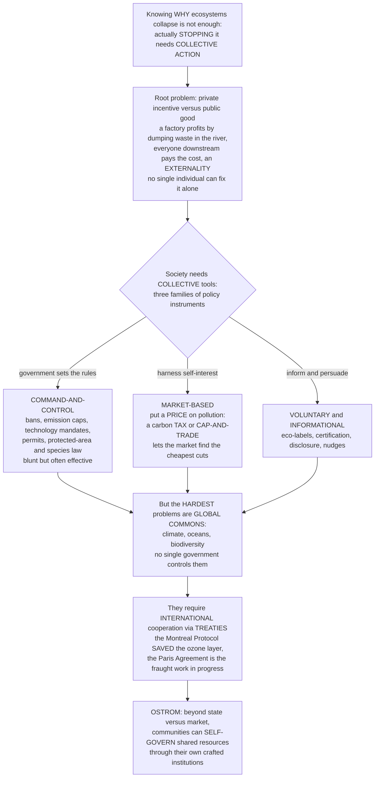

# ⚖️ Environmental Policy and Governance

> [!abstract] TL;DR
> Knowing **why** ecosystems collapse is one thing; actually **stopping** it requires collective action — and that is the domain of **environmental policy and governance**. The fundamental problem is that environmental harms are almost always a **mismatch between private incentive and public good**: a factory profits by dumping waste in the river while everyone downstream pays the cost (a negative **externality**), and no individual can fix it alone. So society needs **collective tools**, of which there are three families. The first is **command-and-control**: the government simply sets rules and limits — ban DDT, cap emissions, require permits, protect this species — and enforces them; blunt but often effective (the **Clean Air Act**, the **Endangered Species Act**). The second is **market-based instruments** that harness self-interest by putting a **price** on pollution: a **carbon tax** makes polluters pay for the damage, or **cap-and-trade** issues a fixed number of tradable permits so the market finds the cheapest cuts (this is how **acid rain** was solved cheaply). The third is **voluntary and informational** approaches — eco-labels, certification, disclosure. But the hardest problems — climate, ocean fisheries, biodiversity — are **global commons** that no single government controls, requiring **international cooperation** through **treaties** (the **Montreal Protocol** that saved the ozone layer is the great success; the **Paris Agreement** the fraught work in progress). And a deep insight from **Elinor Ostrom**'s Nobel-winning work: communities can often **govern shared resources themselves**, without either top-down government *or* privatization, through their own institutions. Understanding the tools, the levels from local to global, and the political challenges of governance is understanding how humanity actually translates ecological knowledge into collective action to protect the planet.

---

## Intuition

**Analogy — the shared pasture and the poisoned well.** Picture a village where everyone grazes sheep on one common meadow. Each family reasons the same way: *one more sheep is pure profit for me, and the slight extra wear on the grass is spread across the whole village.* So everyone adds sheep, the meadow is stripped bare, and every family ends up worse off than if they had all held back — even though each single decision was perfectly "rational." Now picture a tannery on the village stream: it saves money by tipping its poison into the water, and the whole village downstream drinks it. In both cases the trap is identical — the **private benefit** of taking (or polluting) goes to one actor, while the **cost** is smeared across everyone, so no individual, acting alone, has any reason to stop. This is the master problem of environmental harm, and it is why "just let people be responsible" never works at scale.

What breaks the trap is not virtue but **collective arrangements** — the village agreeing on rules. And there are basically three ways the village can act. It can appoint a warden who says *"no family may graze more than five sheep, and dumping in the stream is forbidden"* — that is **command-and-control**. Or it can be cleverer and charge a **fee per extra sheep** (or auction a fixed number of grazing tokens), so that each family now *feels* in its own pocket the cost it used to push onto others, and the ones who value grazing least sell their tokens to those who value it most — that is a **market-based instrument**, pricing the externality so self-interest itself does the conservation. Or the village can simply post a sign — *"grass-friendly farms certified here"* — and let informed buyers reward the careful farmers: **voluntary and informational** policy. The whole science of environmental governance is choosing among these tools, deciding **who** wields them (a village council, a national government, a global treaty), and coping with the fact that the biggest meadows of all — the atmosphere, the oceans, the web of life — are shared by *every* village on Earth, with **no warden above the nations**. That last problem is why the ozone-saving **Montreal Protocol** is celebrated as a near-miracle, and why climate change is so hard. And it is why Elinor Ostrom's discovery matters so much: real villages, all over the world, have quietly governed their own commons for centuries — proving the choice was never merely "government versus markets."

---

## How It Works

### Core Mechanics

1. **Start from the market failure.** Environmental degradation is, in economic terms, a **failure of the price system**. Pollution is a negative **externality** — a cost imposed on third parties that the polluter does not pay — so the market over-produces it. Clean air, a stable climate, and biodiversity are **public goods** (non-excludable, non-rival), so the market under-provides them. Shared resources like fisheries and aquifers are **common-pool resources**, rivalrous but hard to exclude, so they are over-used (the **tragedy of the commons**). Because the harm is structurally invisible to prices, individual and market action alone is **insufficient** — hence the need for governance.

2. **Governance = the structures and processes that steer environmental outcomes.** "Governance" is broader than "government." It includes the state (laws, agencies, courts) but also **markets**, **civil society and NGOs**, **Indigenous and community institutions**, and the **science–policy interface** (bodies like the IPCC for climate and IPBES for biodiversity that translate science into policy-usable assessments). Modern environmental problems are governed across **multiple levels** at once — local, national, regional, and global.

3. **Tool family 1 — command-and-control regulation.** The government directly *sets rules*: **standards** (ambient and emission limits), outright **bans** (DDT, leaded petrol, CFCs), **technology mandates** ("install a scrubber") and **performance mandates** ("emit no more than X per unit output"), **permits** and licensing, **protected-area and species law** (Endangered Species Act, protected-area designations), and **procedural** requirements like **Environmental Impact Assessment**. It is administratively straightforward, legally enforceable, and indispensable for outright hazards — but it is often *inefficient*, because a uniform rule forces every polluter to cut the same amount regardless of how cheaply each *could* cut.

4. **Tool family 2 — market-based (economic) instruments.** These **internalize the externality** by putting a price on pollution so private incentives realign with the public good. A **Pigouvian tax** (e.g. a **carbon tax**) charges polluters per unit of harm, so each cuts pollution up to the point where cutting costs more than the tax. **Cap-and-trade** (tradable permits) fixes the *total* quantity of pollution and lets firms buy and sell allowances, so the market discovers the cheapest cuts. Both share a decisive property: at equilibrium **every polluter faces the same price**, so all abate to the point where their **marginal abatement costs are equal** — the *least-cost* way to hit any target (the **equimarginal principle**). Other instruments in this family: **subsidies and subsidy reform** (removing fossil-fuel subsidies), **Payments for Ecosystem Services**, and **deposit-refund** schemes.

5. **Price versus quantity — the key design choice.** A **tax** fixes the *price* of pollution and lets the quantity float; **cap-and-trade** fixes the *quantity* and lets the price float. Under uncertainty the choice matters: if the *damage* curve is steep (a threshold you dare not cross), fix the **quantity**; if *abatement costs* are steep and uncertain (you fear a price spike), fix the **price**. This is Weitzman's classic "prices vs quantities" result.

6. **Tool family 3 — voluntary and informational approaches.** Where regulation is politically or practically hard, policy can work through **information and reputation**: **eco-labels and certification** (FSC for timber, MSC for seafood, organic labels), **corporate voluntary standards and pledges**, mandatory **disclosure** (emissions registries, right-to-know laws), and behavioral **nudges** (default green tariffs). Cheaper and more flexible, but weaker on enforcement and prone to greenwashing.

7. **The global commons and treaties.** The hardest problems — the **atmosphere**, the **oceans**, **biodiversity** — are **global commons** and **transboundary**: no single government has jurisdiction, so the only remedy is **international cooperation** via **treaties**. The **Montreal Protocol** (1987) phased out ozone-depleting substances and is the great success; the **UNFCCC / Kyoto / Paris Agreement** governs climate; the **Convention on Biological Diversity** and its **Kunming-Montreal framework** (the "30x30" target) govern biodiversity; **CITES** governs the wildlife trade; **Ramsar** governs wetlands; **Basel** governs hazardous-waste movement. Treaties are hard because of **enforcement** (no world police), **free-riding**, **sovereignty**, and **equity** — the principle of **common but differentiated responsibilities** between the global North and South.

8. **Governing the commons without the state–market binary (Ostrom).** Elinor **Ostrom**'s Nobel-winning work showed the commons is *not* inevitably doomed to either ruin, privatization, or top-down control: real communities **sustainably self-govern** common-pool resources when their institutions satisfy a set of **design principles** (clear boundaries, rules matched to local conditions, collective-choice participation, monitoring, graduated sanctions, cheap conflict resolution, recognized rights to organize, and nested/**polycentric** governance). This reframes governance as an *institutional-fit* question rather than a "government or market" dichotomy.

9. **The evaluation criteria and the cross-cutting themes.** Every instrument is judged on **effectiveness** (does it hit the goal?), **efficiency** (at least cost?), **equity** (who bears the burden? — **environmental justice**), **political feasibility**, and **enforceability**. Cutting across all of it: the **precautionary principle** (act despite scientific uncertainty when harm may be grave and irreversible), the **science–policy gap**, the case for **adaptive** and **evidence-based** policy, and the political-economy obstacles — concentrated **interest groups**, short political **time horizons**, and the **North–South divide**.

### Flow



---

## Key Concepts

### Secondary — rules, prices, and shared problems

- **Externality** — when one person's action puts a cost on others who did not choose it. A factory that pollutes a river for free is dumping its cleanup bill on everyone downstream. Environmental problems are almost all externalities.
- **The three toolboxes** — society can protect nature by (1) **making rules** (bans, limits, permits — "command-and-control"), (2) **charging for pollution** so it is no longer free (a **carbon tax** or a system of tradable pollution permits), or (3) **giving people information** (eco-labels like "certified sustainable seafood") so they can choose better.
- **Why one country is not enough** — the air and oceans belong to everyone and no one, so problems like climate change and overfishing need **countries to agree together** through **treaties**.
- **The ozone success story** — in the 1980s scientists found chemicals in fridges and sprays were tearing a hole in the ozone layer that protects us from the Sun. Nearly every country signed the **Montreal Protocol** (1987) to ban them, and the ozone layer is now slowly healing — proof that global cooperation *can* work.
- **Communities can govern themselves** — the scientist **Elinor Ostrom** won a Nobel Prize for showing that ordinary communities — fishers, herders, forest villages — have managed shared resources sustainably for centuries by making and enforcing their own local rules.

### Undergraduate — the instrument toolkit and its logic

- **The market-failure foundation** — pollution is a **negative externality** (marginal social cost exceeds marginal private cost), environmental quality is a **public good**, and shared resources are **common-pool**; all three mean unregulated markets deliver too much degradation, which is *why* governance is needed rather than merely nice.
- **Command-and-control instruments** — ambient/emission **standards**, **bans**, **technology-** and **performance-based mandates**, **permits**, protected-area and endangered-species law, and **EIA**. Strengths: certainty, legal enforceability, good for acute hazards. Weakness: **cost-ineffective**, because a uniform mandate ignores that abatement is far cheaper for some firms than others.
- **Pigouvian taxes** — set a tax equal to the **marginal external damage** so the polluter internalizes it; each firm abates until its **marginal abatement cost** equals the tax. Fixes the *price*, lets the quantity adjust.
- **Cap-and-trade / tradable permits** — cap total emissions, allocate or auction allowances, and let them trade; the permit price emerges where aggregate abatement meets the cap. Fixes the *quantity*, lets the price adjust. The **US SO₂ acid-rain program** and the **EU ETS** are the flagship examples.
- **The equimarginal (least-cost) principle** — a single uniform price on pollution equalizes marginal abatement costs across all polluters, achieving any target at **minimum total cost**; a uniform *quantity* mandate does not. This is the core efficiency argument for pricing over prescriptive rules.
- **Prices vs quantities (Weitzman)** — under cost uncertainty, taxes and caps are no longer equivalent; pick the **cap** when marginal damages are steep (threshold effects), the **tax** when marginal abatement costs are steep and volatile.
- **Coase and property rights** — where transaction costs are low and rights are well-defined, parties can bargain to the efficient outcome *without* a tax (the Coase theorem); catch-share and tradable-permit systems are essentially engineered property rights.
- **Voluntary/informational instruments** — certification (**FSC, MSC**, organic), disclosure/registries, and nudges; low-cost and flexible but vulnerable to weak uptake and **greenwashing**.
- **Multi-level governance and the science–policy interface** — outcomes are steered simultaneously by local, national, regional, and global actors, with assessment bodies (**IPCC**, **IPBES**) bridging science and decision-making.

### Graduate — global commons, treaty design, and self-governance

- **The efficiency of pricing, formally** — minimizing total abatement cost $\sum_i C_i(a_i)$ subject to $\sum_i a_i = A$ yields, by Lagrangian first-order conditions, $C_i'(a_i)=\lambda$ for all $i$: **marginal abatement costs are equalized**, and $\lambda$ *is* the efficient permit price / Pigouvian tax. The **Pigouvian optimum** is where the aggregate marginal abatement cost curve meets the **marginal damage** curve — the socially optimal (nonzero) level of pollution.
- **Double dividend and revenue recycling** — environmental taxes (and auctioned permits) raise revenue that can cut distortionary taxes on labour or capital, potentially yielding a "double dividend"; free permit allocation forgoes this and can create windfall rents, a central EU-ETS design debate.
- **The global-commons cooperation problem** — treaties are **public-goods games** with **free-riding**: every nation prefers others to abate. Without an external enforcer, cooperation must be **self-enforcing**, sustained (per Barrett) by making the treaty a coordination equilibrium — via **minimum-participation clauses**, **trade sanctions** against non-parties, **side payments/transfers**, and technology provisions. This is why the **Montreal Protocol** (concentrated benefits, cheap substitutes, trade restrictions on non-parties) succeeded where broad climate agreements struggle (diffuse benefits, enormous abatement cost, weak enforcement).
- **The regime map** — **Montreal Protocol** (ozone; the model of a strong, enforceable, adaptive treaty with the London/Kigali amendments); **UNFCCC → Kyoto → Paris** (climate; Paris replaced binding top-down targets with **nationally determined contributions** plus transparency and ratchet mechanisms); **CBD + Kunming-Montreal Global Biodiversity Framework** (the **30x30** protected-area target); **CITES** (wildlife trade); **Ramsar** (wetlands); **Basel** (hazardous waste). Persistent difficulties: **enforcement**, **free-riding**, **sovereignty**, and **equity / common-but-differentiated responsibilities**.
- **Ostrom's institutional turn** — against Hardin's binary (privatize or nationalize), Ostrom's **eight design principles** characterize durable common-pool-resource institutions, and **polycentric governance** (many overlapping, semi-autonomous decision centers) is argued to be more robust than any single global authority — directly relevant to climate governance's "bottom-up" turn.
- **Instrument choice under real-world constraints** — the theoretically efficient instrument (a uniform global carbon price) is not always the **politically feasible** one; hybrid designs (price floors/ceilings in cap-and-trade, standards-plus-trading, border carbon adjustments) reflect trade-offs among effectiveness, efficiency, **distributional equity**, feasibility, and enforceability.
- **Governing under uncertainty** — the **precautionary principle**, **adaptive management** (policy as experiment, updated on monitoring), and the political economy of delay (concentrated polluter interests, discounting of future damages, the intergenerational and North–South distribution of costs and benefits).

---

## Python Demo

```python
# Environmental policy and governance, in three views:
#   Panel A - LEAST-COST PRICING (cap-and-trade or tax vs command-and-control):
#             three firms with DIFFERENT marginal-abatement-cost slopes must jointly
#             cut a target amount. A UNIFORM PRICE makes each firm abate until its
#             marginal cost equals the price, so the cheap abaters do MORE -- the
#             equimarginal principle. Compare total cost against a uniform mandate
#             (command-and-control) where every firm cuts the same amount.
#   Panel B - THE PIGOUVIAN OPTIMUM: the aggregate marginal abatement cost curve
#             meets the marginal DAMAGE curve. Their intersection is the socially
#             optimal level of pollution and the efficient carbon price/tax.
#   Panel C - THE TREATY / COLLECTIVE-ACTION OUTCOME (Montreal Protocol): stratospheric
#             chlorine under business-as-usual free-riding (keeps rising) versus under
#             the cooperative treaty (peaks ~1998 then recovers toward the 1980 level).
import numpy as np
import matplotlib.pyplot as plt

# =============================================================== shared setup
# Three firms. Marginal abatement cost of firm i at abatement a:  MAC_i(a) = b_i * a
# Low b = cheap to cut; high b = expensive to cut.
b = np.array([2.0, 5.0, 10.0])          # cost slopes ($ per tonne per tonne)
names = ["Firm 1 (cheap)", "Firm 2 (mid)", "Firm 3 (costly)"]
A_target = 90.0                          # total tonnes that MUST be cut collectively
n = len(b)

# --- Market-based: a single uniform price p* such that total abatement = target ---
# Each firm abates a_i = p / b_i, so sum(p / b_i) = A_target  ->  p* = A_target / sum(1/b)
inv_sum = np.sum(1.0 / b)
p_star = A_target / inv_sum              # equilibrium permit price = Pigouvian-style tax
a_market = p_star / b                    # abatement chosen by each firm
cost_market = np.sum(0.5 * b * a_market**2)     # area under each MAC curve

# --- Command-and-control: every firm cuts the SAME amount (uniform mandate) ---
a_cac = np.full(n, A_target / n)
cost_cac = np.sum(0.5 * b * a_cac**2)
savings_pct = 100.0 * (cost_cac - cost_market) / cost_cac

# =============================================================== Panel B setup
# Aggregate marginal abatement cost as a function of total abatement A:
#   least-cost MAC(A) = A / sum(1/b)   (this equals the uniform price at total cut A)
# Baseline (uncontrolled) total emissions:
E0 = 300.0
slope_MAC = 1.0 / inv_sum                # = 1.25
E = np.linspace(0.0, E0, 400)            # emissions on the x-axis
A_of_E = E0 - E                          # abatement = baseline minus emissions
MAC_agg = slope_MAC * A_of_E             # falls as emissions rise (last tonne is cheap)
d = 0.5                                  # marginal-damage slope ($ per tonne)
MD = d * E                               # marginal damage rises with emissions
# Optimum where MAC(abatement) == MD(emissions): slope_MAC*(E0 - E) = d*E
E_opt = slope_MAC * E0 / (slope_MAC + d)
price_opt = d * E_opt                    # efficient Pigouvian tax / permit price

# =============================================================== Panel C setup
# Montreal Protocol: equivalent stratospheric chlorine (EESC, ppb), illustrative.
year = np.arange(1980, 2081)
baseline_1980 = 1.9                      # the "recovery" benchmark
# With the treaty: rise to a ~1998 peak, then a slow asymmetric decline (recovery ~2066)
rise = np.exp(-((year - 1998) / 12.0) ** 2)
fall = np.exp(-((year - 1998) / 34.0) ** 2)
eesc_treaty = baseline_1980 + 1.9 * np.where(year <= 1998, rise, fall)
# Business as usual (no treaty, everyone free-rides): unchecked ~2.3%/yr growth
eesc_bau = 2.0 * np.exp(0.023 * (year - 1980))

# =================================================================== plotting
fig, ax = plt.subplots(1, 3, figsize=(17, 5.0))

# ---- Panel A: least-cost pricing vs command-and-control --------------------
a_axis = np.linspace(0, 60, 200)
colA = ["seagreen", "goldenrod", "crimson"]
for i in range(n):
    ax[0].plot(a_axis, b[i] * a_axis, color=colA[i], lw=2.0, label=f"{names[i]}  MAC")
    ax[0].plot(a_market[i], p_star, "o", color=colA[i], ms=8, zorder=5)
    ax[0].plot([a_market[i], a_market[i]], [0, p_star], ls=":", color=colA[i], lw=1.0)
ax[0].axhline(p_star, color="black", ls="--", lw=1.6,
              label=f"uniform price p* = {p_star:.1f}")
ax[0].set_xlabel("Abatement by firm (tonnes cut)")
ax[0].set_ylabel("Marginal abatement cost ($ / tonne)")
ax[0].set_title("(A) One price -> equal marginal costs\n(cheap firm cuts most)")
ax[0].legend(fontsize=7.6, loc="upper left"); ax[0].grid(alpha=0.3)
ax[0].set_xlim(0, 60); ax[0].set_ylim(0, p_star * 1.6)
ax[0].text(0.97, 0.03,
           f"same 90 t cut costs\nmarket-based  ${cost_market:,.0f}\n"
           f"command-and-control  ${cost_cac:,.0f}\nsaving  {savings_pct:.0f}%",
           transform=ax[0].transAxes, ha="right", va="bottom", fontsize=8,
           bbox=dict(boxstyle="round", fc="wheat", alpha=0.7))

# ---- Panel B: the Pigouvian optimum ---------------------------------------
ax[1].plot(E, MD, color="firebrick", lw=2.2, label="marginal DAMAGE  MD(E)")
ax[1].plot(E, MAC_agg, color="navy", lw=2.2, label="marginal ABATEMENT cost")
ax[1].plot(E_opt, price_opt, "ko", ms=9, zorder=5)
ax[1].annotate(f"optimum\nE* = {E_opt:.0f}\nprice = {price_opt:.0f}",
               xy=(E_opt, price_opt), xytext=(E_opt + 25, price_opt + 40),
               fontsize=8.5, arrowprops=dict(arrowstyle="->"))
ax[1].axvline(E0, color="gray", ls=":", lw=1.2)
ax[1].text(E0 - 4, 5, "uncontrolled\nemissions E0", ha="right", fontsize=7.5, color="gray")
ax[1].fill_between(E, np.minimum(MD, MAC_agg), color="mediumseagreen", alpha=0.12)
ax[1].set_xlabel("Emissions E (tonnes)")
ax[1].set_ylabel("$ per tonne")
ax[1].set_title("(B) Pigouvian optimum:\nprice the externality where MD meets MAC")
ax[1].legend(fontsize=8, loc="upper center"); ax[1].grid(alpha=0.3)
ax[1].set_xlim(0, E0); ax[1].set_ylim(0, max(MD.max(), MAC_agg.max()) * 1.05)

# ---- Panel C: Montreal Protocol -- cooperation vs free-riding ---------------
ax[2].plot(year, eesc_bau, color="crimson", lw=2.2,
           label="no treaty: free-riding, keeps rising")
ax[2].plot(year, eesc_treaty, color="steelblue", lw=2.4,
           label="Montreal Protocol: cooperation")
ax[2].axhline(baseline_1980, color="seagreen", ls="--", lw=1.4,
              label="1980 level = recovery target")
ax[2].axvline(1987, color="gray", ls=":", lw=1.2)
ax[2].text(1988, 8.5, "Protocol\nsigned 1987", fontsize=7.5, color="gray")
ax[2].set_xlabel("Year")
ax[2].set_ylabel("Stratospheric chlorine  EESC (ppb)")
ax[2].set_title("(C) A treaty shifts the outcome:\nthe ozone layer recovers")
ax[2].legend(fontsize=7.6, loc="upper left"); ax[2].grid(alpha=0.3)
ax[2].set_ylim(0, 10); ax[2].set_xlim(1980, 2080)

plt.tight_layout()
plt.savefig("environmental_policy.png", dpi=120)
plt.show()

# ------------------------------------------------------------------- report
print("=== (A) Least-cost pricing vs command-and-control (cut 90 t total) ===")
print(f"  uniform price p* = {p_star:.2f}  ($/tonne = equilibrium permit price)")
for i in range(n):
    print(f"  {names[i]:16s}: market cuts {a_market[i]:5.1f} t   "
          f"mandate cuts {a_cac[i]:5.1f} t")
print(f"  total cost  market-based      = ${cost_market:,.0f}")
print(f"  total cost  command-and-control = ${cost_cac:,.0f}")
print(f"  --> pricing the externality saves {savings_pct:.1f}% of abatement cost")
print("\n=== (B) Pigouvian optimum ===")
print(f"  optimal emissions E* = {E_opt:.1f} t (of {E0:.0f} uncontrolled)")
print(f"  efficient Pigouvian tax / permit price = ${price_opt:.1f}/tonne")
print("\n=== (C) Montreal Protocol outcome ===")
peak_year = year[np.argmax(eesc_treaty)]
recovery_year = year[(year > peak_year) & (eesc_treaty <= baseline_1980 + 0.05)]
print(f"  chlorine peaks in {peak_year}, "
      f"recovers to ~1980 level around {recovery_year[0] if len(recovery_year) else 'post-2080'}")
print(f"  by 2080 the free-riding path reaches {eesc_bau[-1]:.1f} ppb "
      f"vs {eesc_treaty[-1]:.1f} ppb under the treaty")
```

**What it shows.** **Panel A** is the efficiency case for pricing pollution. Three firms must jointly cut 90 tonnes, but cutting is cheap for Firm 1 and expensive for Firm 3. A **single uniform price** (a carbon tax, or the equilibrium price in a cap-and-trade market) leads each firm to abate only until its *own* marginal cost reaches that price — so the cheap firm does the heavy lifting and marginal costs end up **equal** across firms (the equimarginal principle). A **command-and-control** mandate that forces every firm to cut the same 30 tonnes ignores those cost differences and ends up markedly more expensive for the *same* environmental result — the ~30% saving in the box is exactly the lesson of the acid-rain SO₂ program. **Panel B** is the deeper "how much pollution is optimal?" question: pushing emissions to zero is not efficient, because the marginal cost of the last cut eventually exceeds the marginal damage it prevents. The **Pigouvian optimum** sits where the falling marginal-abatement-cost curve crosses the rising marginal-damage curve, and the height of that crossing is the **efficient price** to charge — the number a well-set carbon tax is trying to hit. **Panel C** is the payoff of governance at the planetary scale: under **business-as-usual free-riding**, stratospheric chlorine climbs without limit and the ozone layer keeps thinning; under the **Montreal Protocol**, near-universal cooperation bends the curve down after its late-1990s peak, and chlorine falls back toward the 1980 benchmark by mid-century — the single clearest proof that a well-designed treaty can solve a global commons problem.

---

## Real-World Applications

> **Example: the Montreal Protocol — the treaty that saved the ozone layer.** When Farman et al. reported the Antarctic ozone hole in 1985, the world faced a textbook global-commons crisis: CFCs from every nation's fridges and aerosols were destroying a shared stratospheric shield, and no country could fix it alone. The 1987 **Montreal Protocol** succeeded where later climate treaties have struggled because it had every ingredient of a **self-enforcing** agreement: the science was clear, cheap chemical **substitutes** existed, benefits were large and concentrated, and — crucially — the treaty imposed **trade restrictions on non-parties**, converting free-riding into a losing strategy. It has been strengthened repeatedly (the London, Copenhagen, and **Kigali** amendments, the last also targeting HFC super-greenhouse gases). Global ODS consumption fell more than 98%, the ozone layer is on track to recover to 1980 levels around **2066**, and the avoided warming makes it, incidentally, one of the most effective *climate* treaties ever signed.

- **The US acid-rain program (SO₂ cap-and-trade)** — Title IV of the 1990 Clean Air Act Amendments capped power-plant sulfur-dioxide emissions and let utilities **trade allowances**. It cut SO₂ far faster and at a **fraction of the projected cost** of a command-and-control mandate, and became the proof-of-concept that made market-based instruments mainstream — the real-world Panel A.
- **Carbon taxes and the EU Emissions Trading System** — Sweden's carbon tax (among the world's highest) and British Columbia's revenue-neutral carbon tax price emissions directly; the **EU ETS**, the world's largest cap-and-trade market, prices industrial and power-sector CO₂. Both illustrate the price-versus-quantity design choice and the politics of allowance allocation versus auctioning.
- **The Endangered Species Act and protected-area law** — the classic **command-and-control** tools: listing a species triggers legal protection of it and its **critical habitat**, and complements the **Kunming-Montreal "30x30"** target under the Convention on Biological Diversity to protect 30% of land and sea by 2030.
- **Payments for Ecosystem Services** — Costa Rica pays landowners to keep forests standing (funded partly by a fuel tax), and the UN's **REDD+** pays tropical nations for avoided-deforestation carbon: market-based instruments that *reward* the provision of a public good rather than punishing its destruction.
- **Certification and eco-labels** — the **Forest Stewardship Council** (timber) and **Marine Stewardship Council** (seafood) are voluntary/informational instruments that use consumer choice and supply-chain pressure to reward sustainable producers where regulation is weak or transboundary.
- **Community forest and fishery governance (Ostrom in practice)** — Nepal's community forestry, Japanese coastal fishery cooperatives, and Maine's lobster-gang territories are documented cases of durable, self-organized commons governance, the empirical backbone of Ostrom's design principles.

---

## Common Pitfalls

- **"Command-and-control and market instruments are rivals; pick a side."** In practice they are **complements**. Bans are right for acute, non-negotiable hazards (leaded petrol, CFCs, a species on the brink); pricing is right for diffuse, cost-heterogeneous problems (carbon). Good policy layers them — a cap *plus* technology standards *plus* disclosure — and Ostrom adds that community self-governance is a third, often-overlooked pillar.
- **"A carbon tax and cap-and-trade are basically the same thing."** They diverge under **uncertainty**: a tax fixes the price and lets emissions float; a cap fixes emissions and lets the price float. Choose the **cap** when you fear crossing a physical threshold (steep damages); choose the **tax** when you fear a price spike (steep, uncertain abatement costs). Ignoring this is the most common instrument-design error.
- **"The goal is zero pollution."** Driving emissions to zero is almost never efficient — the marginal cost of the last cut eventually dwarfs the marginal damage it prevents (Panel B). The target is the **Pigouvian optimum**, not zero; treating "any pollution is unacceptable" as policy wastes resources that could cut more elsewhere.
- **"Free permits and auctioned permits are equivalent."** Both cap quantity, but **free allocation** hands polluters a windfall and forgoes revenue that could fund a "double dividend" (cutting other taxes) or compensate affected workers. Grandfathering is politically expedient but leaves large efficiency and equity gains on the table.
- **"Sign the treaty and the problem is solved."** Treaties without **enforcement** and **anti-free-riding** design are cheap talk. Montreal worked because of trade sanctions on non-parties and cheap substitutes; Kyoto faltered on non-participation and non-compliance. The binding question is always: *is cooperation self-enforcing, or can defectors profit?*
- **"Efficiency is the only thing that matters."** The least-cost instrument can be **regressive** (a flat carbon tax hits the poor hardest) or **politically infeasible**. Ignoring **equity** — environmental justice at home, common-but-differentiated responsibilities between North and South — sinks otherwise-optimal policies. Distribution is not a footnote; it is often the deciding factor.
- **"The commons must be privatized or nationalized."** Hardin's binary is empirically false. **Ostrom** showed communities routinely craft durable institutions to govern shared resources; assuming only the state or the market can work discards the polycentric, community-based solutions that often fit best.

---

## Related Concepts

This note is the **policy-and-governance capstone** of the vault: it is where the ecological science of the preceding sections is translated into collective action. Its in-vault siblings are referenced here in prose rather than as links. **Ecological Economics and Natural Capital** supplies the economic framing — externalities, natural-capital accounting, and the valuation logic that market-based instruments operationalize; **Human Population and the Anthropocene** sets the scale of the collective-action problem these tools must confront; **Protected Areas and Conservation Strategies** are the command-and-control and spatial instruments (the "30x30" target) that this note situates within the broader toolkit; **Indigenous Knowledge and Community Conservation** is the living embodiment of Ostrom's community self-governance and polycentric commons management; and **Overexploitation and Sustainable Harvesting** is the archetypal common-pool-resource failure whose quota, catch-share, and treaty remedies are exactly the instruments developed here. Those five are prose-only because they are in-vault siblings.

- [[Externalities_and_Pigouvian_Tax]] — the microeconomic engine of this entire note: pollution as a negative externality, corrected by a tax equal to marginal damage. Panels A and B are its ecological application.
- [[Market_Failures]] — the general theory of why markets under-provide environmental quality (public goods, externalities, commons), which is precisely *why* governance is required rather than laissez-faire.
- [[Public_Goods]] — clean air, a stable climate, and biodiversity are non-excludable public goods; their under-provision by markets is the demand side of the collective-action problem.
- [[Coase_Theorem]] — the property-rights alternative: with well-defined rights and low transaction costs, parties bargain to efficiency without a tax. Tradable-permit and catch-share systems are engineered Coasean rights.
- [[Price_of_Anarchy]] — the game-theoretic measure of how far self-interested (free-riding) equilibria fall short of the social optimum — the formal statement of why the commons needs governance.
- [[Repeated_Games_and_Folk_Theorems]] — why cooperation can be **self-enforcing** in repeated interaction; the theoretical basis for how treaties (Montreal) sustain compliance without a world government.
- [[International_Institutions_and_Multilateralism]] — the political-science account of how states cooperate through institutions, the machinery behind environmental treaty-making.
- [[Climate_Politics_and_Environmental_Governance]] — the politics of the hardest case (climate), including the UNFCCC/Paris regime, North–South equity, and interest-group obstacles.
- [[Sustainability_and_Planetary_Boundaries]] — the systems-scale framing of the limits within which all this governance must keep humanity operating.

---

## Review Questions

1. **(Secondary)** A town's factory dumps waste into the river for free, and everyone downstream suffers. Explain why the factory has no reason to stop on its own, and describe the *three* different ways society could get it to stop (a rule, a price, and information). Why did nearly every country agree to the Montreal Protocol, and what happened to the ozone layer as a result?
2. **(Undergraduate)** Two power plants must together cut 100 tonnes of pollution. Plant A can cut cheaply; Plant B only at high cost. Compare the *total cost* of (a) ordering each to cut 50 tonnes versus (b) charging both a uniform pollution price. Explain, using the equimarginal principle, why the pricing approach is cheaper, and identify one situation where you would still prefer a flat regulatory ban.
3. **(Undergraduate)** Distinguish a carbon **tax** from **cap-and-trade**. Under uncertainty about abatement costs, which would you choose if the pollutant has a dangerous physical *threshold*, and which if you fear a *price spike*? Justify using the prices-versus-quantities logic.
4. **(Graduate)** Explain why the Montreal Protocol succeeded as a self-enforcing treaty while broad climate agreements have struggled. Reference the structure of the underlying public-goods game, the role of trade sanctions and side payments (Barrett), and how the availability of cheap substitutes and concentrated benefits changed the free-rider calculus.
5. **(Graduate)** Hardin argued the commons must be privatized or nationalized, yet Ostrom documented durable community self-governance. Reconcile these positions: state the conditions under which open access collapses a resource, identify the Ostrom design principles that most directly prevent collapse, and discuss why *polycentric* governance might be more robust than a single global authority for a problem like climate change.

---

## Sources

- Ostrom, E. (1990). *Governing the Commons: The Evolution of Institutions for Collective Action*. Cambridge University Press. — the Nobel-winning demonstration that communities can sustainably self-govern common-pool resources, with the eight design principles.
- Barrett, S. (2003). *Environment and Statecraft: The Strategy of Environmental Treaty-Making*. Oxford University Press. — the definitive game-theoretic analysis of why some environmental treaties (Montreal) are self-enforcing and others fail.
- Tietenberg, T. & Lewis, L. (2018). *Environmental and Natural Resource Economics* (11th ed.). Routledge. — the standard text on externalities, command-and-control versus market-based instruments, and cost-effective pollution control.
- Stavins, R. N. (2003). "Experience with Market-Based Environmental Policy Instruments." In *Handbook of Environmental Economics*, Vol. 1, pp. 355–435. Elsevier. [DOI](https://doi.org/10.1016/S1574-0099(03)01014-3) — the authoritative survey of real-world taxes, cap-and-trade, and their performance.
- Hardin, G. (1968). "The Tragedy of the Commons." *Science* 162(3859): 1243–1248. [DOI](https://doi.org/10.1126/science.162.3859.1243) — the foundational statement of the collective-action problem that all environmental governance responds to.

---

#ecology #environmental-policy #governance #cap-and-trade #environmental-treaties
