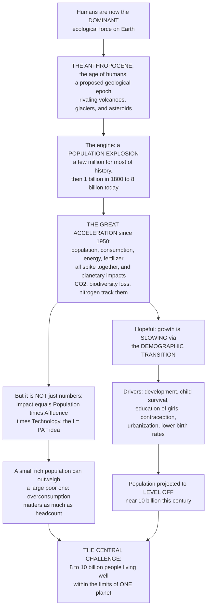

# 🌍 Human Population and the Anthropocene

> [!abstract] TL;DR
> Our species has become the **dominant ecological force on the planet** — so dominant that scientists propose we have entered a new geological epoch, the **Anthropocene** ("the age of humans"), in which humanity rivals **volcanoes, glaciers, and asteroids** as a planet-shaping power: we now move more earth than all the world's rivers, fix more nitrogen than all natural processes, and appropriate a large share of the entire biosphere's production. The engine behind this is a staggering **population explosion**: for almost all of history there were only a **few million** humans, but in just two centuries we surged from **1 billion (1800) to 8 billion today** — a near-vertical spike unlike anything in the fossil record. More dramatic still is the **Great Acceleration**: since roughly **1950**, not just population but **consumption, energy use, fertilizer, water use, and GDP all shot upward together** in synchronized hockey-stick curves — and the planetary impacts (CO2, biodiversity loss, nitrogen pollution, ocean acidification) tracked them **precisely**. But the crucial nuance is that it is **not just the number of people**: impact is captured by **I = PAT** — Impact equals **P**opulation times **A**ffluence (consumption per person) times **T**echnology — so a small rich population can do more damage than a large poor one (the average American's footprint dwarfs the average person's in a low-income country). The hopeful part: growth is now **slowing dramatically** as countries pass through the **demographic transition** — birth rates fall as child survival, education (especially of girls), and prosperity rise — so population is projected to **level off around 10 billion** this century, not grow forever. The defining challenge of the Anthropocene is stark: **how do 8–10 billion people live well within the ecological limits of a single planet?** Understanding human population dynamics and our planet-reshaping impact is the essential context for everything in conservation.

---

## Intuition

**Analogy — the new geological force.** Read the rock layers of Earth's deep past and you can see the great planet-shaping forces written in stone: a black iridium line where an asteroid ended the dinosaurs, thick beds of ash from supervolcanoes, scoured valleys where mile-thick glaciers ground across continents. These are the forces that reshape a world. Now imagine a geologist ten million years from now digging through today's sediments — and finding a razor-thin layer, laid down in barely two centuries, that is utterly unlike anything below it: a sudden spike of plastic and concrete, a flush of nitrogen and phosphorus, a bloom of chicken bones (the most common fossil bird on Earth), radioactive fallout from 1950s bomb tests, and a sharp jump in carbon isotopes marking a fossil-fuel spasm. That geologist would conclude that some **new force** had seized control of the planet — a force acting as fast and as globally as an asteroid strike. That force is **us**. The claim of the **Anthropocene** is simply this: humanity has become a **geological-scale power**, standing shoulder to shoulder with volcanoes and ice ages in its ability to reshape the Earth.

How did a single ape become a planetary force? Through explosive **growth**. Picture the entire human population as a line on a graph running from the Stone Age to today. For **99.9% of that line it is almost flat** — a few million people, then tens of millions, then a slow crawl to about **1 billion by the year 1800**. And then the line does something no population in the fossil record has ever done: it goes **nearly vertical**, rocketing to 2, 4, and 8 billion in the blink of a geological eye. But raw numbers are only half the story. Now overlay a *second* graph — of everything we *do*: energy burned, fertilizer spread, water pumped, goods bought, dollars spent. Since about **1950** every one of those curves has the same violent upward hook, all bending skyward **at the same moment** — the **Great Acceleration**. And here is the part that should stop you cold: overlay a *third* graph — of the planet's own vital signs, its CO2, its temperature, its vanishing species, its poisoned rivers — and those curves bend upward at the **same instant, tracing the same shape**. The human hockey stick and the Earth-system hockey stick are the *same curve*. That precise tracking is the fingerprint of the Anthropocene: our activity and the planet's condition have become **one coupled system**.

Two final twists turn this from a doom story into a genuine dilemma. First, **it is not only about how many of us there are — it is about how much each of us takes.** Environmental impact follows a simple product, **I = P × A × T**: Population times Affluence times Technology. A billion high-consuming people can outweigh six billion low-consuming ones, which is why blaming "overpopulation" while ignoring **overconsumption** by the wealthy is both wrong and unjust. Second, **the explosion is already ending.** As societies develop — as children stop dying young, as girls go to school, as prosperity spreads — families choose to have fewer children, and every developed nation has passed through this same **demographic transition**. Global growth peaked around 1968 and has been falling ever since; the line is bending toward a **plateau near 10 billion** later this century. So the real question of the Anthropocene is not "will we grow forever" — we won't — but the harder one: **can 8 to 10 billion people build good lives within the finite limits of one planet?** That question is the frame around everything else in conservation.

---

## How It Works

### Core Mechanics

1. **The Anthropocene — a proposed new epoch.** In 2000, atmospheric chemist **Paul Crutzen** (with Eugene Stoermer) argued that Earth had left the **Holocene** — the stable ~11,700-year warm window in which all of civilization arose — and entered a human-dominated epoch he named the **Anthropocene**. The claim is not rhetorical but **geological**: human activity is now the *dominant* influence on the planet's climate, biogeochemical cycles, biosphere, and even its rock and sediment record. We move more sediment than all rivers combined, we manufacture more reactive nitrogen than every natural process on land, we have transformed most of the ice-free land surface, and the mass of everything humans have built ("technomass") now rivals the mass of all living things.

2. **Why the population exploded.** For nearly all of prehistory, human numbers were held near-flat by high mortality: births were high, but so many infants and mothers died that populations barely grew. Growth stayed near zero for millennia, reaching perhaps a few hundred million by year 1 CE and only **~1 billion by 1800**. Then agriculture's productivity, sanitation, the germ theory of disease, vaccines, antibiotics, and modern medicine caused **death rates to collapse** — while birth rates stayed high for decades. That widening gap between falling deaths and still-high births *is* the explosion: 2 billion by 1927, 4 billion by 1974, 8 billion by 2022. The **fastest** global growth rate, over **2% per year**, came around **1968**.

3. **Why growth is now slowing — the demographic transition.** No population can double forever, and human birth rates fall predictably as societies develop. The **Demographic Transition Model** describes the universal path: **Stage 1** high births / high deaths (slow growth); **Stage 2** deaths fall first (the growth surge); **Stage 3** births fall as families adapt; **Stage 4** low births / low deaths (slow growth again); and a possible **Stage 5** where births fall below deaths and populations *shrink and age*. The drivers of falling fertility are well established: **child survival** (parents have fewer children when children live), **women's education and empowerment**, access to **contraception**, and **urbanization** (children are an economic asset on a farm, a cost in a city).

4. **The impact equation, I = PAT.** In 1971, **Paul Ehrlich and John Holdren** formalized that environmental **Impact** is a product: **I = P × A × T** — **P**opulation, **A**ffluence (goods/services consumed per person), and **T**echnology (impact per unit of consumption). The insight is that population is only **one** of three multiplicative factors. A wealthy, high-technology society can inflict enormous impact with few people; the richest ~10% of humanity produces roughly **half** of all consumption-based emissions. This reframes the debate from a simple headcount to **who consumes what, and how cleanly**.

5. **Footprint, biocapacity, and overshoot.** The **Ecological Footprint** measures the biologically productive land and sea a population requires; **biocapacity** is what the planet can regenerate. Humanity's footprint now **exceeds** Earth's biocapacity — we use resources faster than they regenerate, drawing down natural capital. **Earth Overshoot Day** marks the date each year when we have used a full year's regenerative budget; it now falls in mid-year, meaning we run the rest of the year in **ecological deficit** — the signature of a "full world."

6. **The Great Acceleration — the empirical fingerprint.** Steffen and colleagues assembled two dozen indicators split into two dashboards: **socio-economic trends** (population, real GDP, primary energy, fertilizer, water use, transport, telecommunications) and **Earth-system trends** (CO2, N2O, methane, surface temperature, ocean acidification, marine fish capture, tropical forest loss, terrestrial biosphere degradation). Plotted against time, **almost every curve bends sharply upward around 1950**, and the two dashboards move in near-lockstep. This synchronized post-1950 surge is the strongest evidence for a **1950 start date** for the Anthropocene, tied to nuclear-test radionuclides as a globally-synchronous stratigraphic marker.

7. **Planetary boundaries — the safe operating space.** The Great Acceleration is pushing Earth's systems past the **planetary boundaries** that kept the Holocene stable. Of the nine boundaries (climate change, biosphere integrity, biogeochemical flows, land-system change, freshwater, ocean acidification, aerosols, ozone, novel entities), several are already **transgressed** — most severely biosphere integrity and the nitrogen/phosphorus cycles. The boundaries define the **safe operating space** within which humanity can thrive; the Anthropocene is the story of leaving it.

8. **The central challenge — living well within limits.** The defining problem is **sustainability with justice**: how do 8–10 billion people achieve good lives without breaching planetary limits? The debates are real — population *versus* consumption as the primary driver, the equity pitfalls of "overpopulation" framing, **degrowth** versus green **development**, and whether technology can **decouple** wellbeing from impact fast enough. Frameworks like **doughnut economics** picture the goal as a ring: meeting everyone's **social foundation** (food, health, education, energy) while staying below the **ecological ceiling**.

### Flow / Architecture



---

## Key Concepts

### Secondary (foundational)

- **The Anthropocene ("age of humans")** — the idea that people have become so powerful we are changing the *whole planet* — its air, its water, its climate, its living things — as much as volcanoes or ice ages once did. Some scientists say Earth has entered a new chapter of its history named after us.
- **The population explosion** — for almost all of history there were only a few million people. Then in just 200 years the number **shot up** from 1 billion to 8 billion — the fastest growth ever, peaking in the late 1960s.
- **Why it grew** — not because people had *more* babies, but because far **fewer people died young**, thanks to better food, clean water, and medicine, while families still had many children.
- **Why it is slowing** — as countries get richer and healthier and girls go to school, families choose to have **fewer children**. This shift is called the **demographic transition**, and it is bending the curve toward a level-off near **10 billion**.
- **It is not just numbers (I = PAT)** — a country's damage depends on **how many** people there are, **how much** each person consumes, and **how clean** their technology is. One rich person can use far more than many poor people — so *how we live* matters as much as *how many we are*.
- **The Great Acceleration** — since about 1950, almost everything humans do (energy, factories, cars, fertilizer) has raced upward at once — and the planet's pollution and species loss raced up **at the same time**, in the same shape.

### Undergraduate (core)

- **Anthropocene: concept and start dates** — proposed by **Crutzen and Stoermer (2000)**; candidate "golden spikes" include the dawn of **agriculture** (~10,000 BP, early land clearing and methane), the **Columbian Exchange** and Orbis spike (~1610, a dip in CO2 from post-contact reforestation of abandoned Americas farmland), the **Industrial Revolution** (~1800, fossil carbon), and the **1950 Great Acceleration** with bomb-test radionuclides — the leading candidate for a formal **Global Boundary Stratotype Section and Point**.
- **The demographic history** — near-stasis through prehistory (growth rate near zero), ~1 billion by 1800, then the explosion: 2B (1927), 3B (1960), 4B (1974), 5B (1987), 6B (1999), 7B (2011), 8B (2022). Peak *growth rate* ~2.1% around 1968; peak *annual increment* ~90 million/yr around 1988.
- **The Demographic Transition Model (DTM)** — the ordered shift high-birth/high-death → high-birth/**low-death** (the surge, as mortality falls first) → **low-birth**/low-death → stable; and a debated Stage 5 (sub-replacement fertility, shrinking, aging populations, as in Japan and much of Europe). The transition gap (births minus deaths) *is* the natural increase that drove the explosion.
- **Drivers of fertility decline** — falling **child mortality** (fewer births needed for surviving offspring), female **education and labor-force participation**, **contraceptive access**, **urbanization** (children shift from farm labor to household cost), rising incomes, and old-age security replacing children-as-insurance.
- **I = PAT (Ehrlich–Holdren 1971)** — Impact = Population × Affluence × Technology. Affluence is consumption per capita; Technology is impact per unit of consumption (can be lowered by efficiency and clean energy). Highlights **footprint inequality**: a rich minority drives a disproportionate share of impact, so consumption is co-equal with population as a driver.
- **Ecological footprint, biocapacity, overshoot** — footprint (global hectares demanded) versus biocapacity (global hectares supplied). Global footprint exceeds biocapacity by roughly **70%** (we would need ~1.7 Earths at current use), the state of **overshoot**; **Earth Overshoot Day** operationalizes the deficit. The "empty world → full world" transition (Herman Daly) means natural capital, not human-made capital, is now the limiting factor.
- **UN World Population Prospects projections** — the **medium variant** projects a peak of roughly **10.3–10.4 billion in the 2080s**, then slight decline; with large **regional divergence** (sub-Saharan Africa still growing, East Asia and Europe already declining and aging) and profound **population aging** as the age pyramid inverts.
- **Great Acceleration indicators** — the ~24 socio-economic and Earth-system time series (Steffen et al. 2015) that hockey-stick from ~1950; the tight coupling between the two dashboards is the empirical case that human activity and Earth-system state are now a single coupled system.

### Graduate (advanced)

- **Stratigraphy and the Anthropocene debate** — formal recognition requires a globally synchronous, correlatable signal in the rock record. Candidate markers: **plutonium-239** and radiocarbon from 1950s–60s nuclear tests (sharp, global, ~1952 peak), fly ash and spheroidal carbonaceous particles, novel materials (plastics, aluminum, concrete), altered N and C isotope ratios, and a global extinction/invasion biostratigraphy. The **Anthropocene Working Group** proposed a mid-20th-century base (candidate GSSP: Crawford Lake, Canada), but in **2024** the ICS Subcommission voted against formalizing it as an epoch — leaving "Anthropocene" as a powerful *concept* and possibly an informal "event" rather than a ratified chronostratigraphic unit. The scientific dispute (event vs. epoch; single spike vs. diachronous process) is itself instructive.
- **Decomposition and the limits of I = PAT** — IPAT is an accounting identity, not a causal model; the **Kaya identity** refines it for carbon (CO2 = Population × GDP/person × Energy/GDP × CO2/Energy), enabling attribution of emissions trends to demographic, economic, energy-intensity, and carbon-intensity components. Because factors are treated as independent multiplicatively, IPAT masks feedbacks (affluence changes technology; technology changes fertility) and **rebound effects** (efficiency gains re-spent on more consumption — Jevons paradox), which erode expected impact reductions.
- **Absolute vs. relative decoupling** — sustainability requires **absolute decoupling** (impact falls while wellbeing rises), not merely **relative decoupling** (impact per dollar falls while total impact still climbs). Empirically, relative decoupling is common but sustained *absolute* decoupling at the required rate and global scale is contested — the crux of the **green-growth versus degrowth** debate.
- **Planetary boundaries and safe operating space** — Rockström and Steffen's nine-boundary framework quantifies the Holocene-like envelope; several boundaries (**biosphere integrity**, **biogeochemical flows** of N and P, **land-system change**, **novel entities**, **climate change**, and as of 2023 **freshwater** ) are transgressed. Boundaries interact (transgressing one can shift another) and some are **slow variables** whose thresholds carry deep uncertainty and potential for abrupt regime shifts.
- **The population-versus-consumption debate and its ethics** — framing environmental crisis as "overpopulation" locates blame in high-fertility, low-emitting regions while the damage is dominated by high-consuming, low-fertility ones (footprint inequality). The history of coercive population control (forced sterilization, China's one-child policy) makes the framing ethically fraught. The evidence-based lever on fertility is **development and rights** — especially girls' education and reproductive autonomy (a top-ranked climate solution in Project Drawdown), which lower fertility as a *byproduct of expanding freedom*, not coercion.
- **Doughnut economics and just sustainability** — Raworth's model reframes the goal as operating between a **social foundation** (twelve dimensions of human need) and an **ecological ceiling** (the planetary boundaries) — the safe and *just* space. Analyses find **no nation** yet meets its citizens' basic needs within globally sustainable resource use, formalizing the Anthropocene predicament as a two-sided optimization, not a single limit.
- **Coupled human–natural systems and the Earth-system view** — the Great Acceleration's tight socio-economic/Earth-system coupling motivates modeling humanity as an active **Earth-system component**. Concepts such as the **technosphere**, **anthromes** (human-shaped biomes replacing "natural" biomes as the terrestrial norm), and **planetary stewardship** follow: in the Anthropocene, conservation is no longer about protecting a separate "nature" but about consciously steering a coupled planet away from tipping cascades (e.g., a "Hothouse Earth" trajectory).

---

## Python Demo

```python
# HUMAN POPULATION & THE ANTHROPOCENE -- three panels
#   (A) POPULATION GROWTH & PROJECTION: the near-vertical modern spike (a few
#       million for millennia -> 1 billion in 1800 -> 8 billion now), overlaid
#       with the projected S-shaped leveling toward ~10.4 billion, and contrasted
#       with a naive exponential continuation (which rockets off the chart).
#       A twin axis shows the global GROWTH RATE peaking ~1968 and now falling.
#   (B) THE GREAT ACCELERATION: several socio-economic AND Earth-system indicators
#       all hockey-sticking from ~1950 on one time axis (normalized 0-1).
#   (C) THE DEMOGRAPHIC TRANSITION: birth & death rates across development stages,
#       with the shaded gap = the natural-increase "population surge."
import numpy as np
import matplotlib.pyplot as plt

# ============================ (A) POPULATION & PROJECTION ============================
# Historical anchor points (year, billions) -- stylized from long-run estimates + UN WPP
hist_yr  = np.array([-10000, -5000, -1000,   1,  1000, 1500, 1700, 1800,
                      1850, 1900, 1927, 1950, 1960, 1974, 1987, 1999, 2011, 2022])
hist_pop = np.array([0.004, 0.005, 0.05, 0.19, 0.27, 0.46, 0.60, 1.00,
                      1.26, 1.65, 2.00, 2.54, 3.03, 4.00, 5.00, 6.00, 7.00, 8.00])

# UN medium-variant projection to 2100 (peak ~10.4 B in the 2080s, slight decline)
proj_yr  = np.array([2022, 2030, 2040, 2050, 2060, 2070, 2080, 2086, 2100])
proj_pop = np.array([8.00, 8.55, 9.20, 9.70, 10.05, 10.25, 10.37, 10.43, 10.35])

# Naive exponential continuation from 2022 at the recent ~0.9%/yr growth rate
exp_yr   = np.linspace(2022, 2100, 200)
exp_pop  = 8.0 * np.exp(0.009 * (exp_yr - 2022))

# Global annual growth rate (%) -- rises to a ~1968 peak, then declines (for twin axis)
rate_yr  = np.array([1750, 1900, 1950, 1968, 1980, 1990, 2000, 2010, 2022,
                     2050, 2075, 2100])
rate_pct = np.array([0.4, 0.6, 1.8, 2.1, 1.8, 1.6, 1.3, 1.2, 0.9,
                     0.5, 0.2, 0.03])

# ============================ (B) THE GREAT ACCELERATION ============================
# Normalized (0-1 at 2010) indicators; near-flat before 1950, sharp upturn after.
ga_yr = np.array([1750, 1800, 1850, 1900, 1950, 1970, 1990, 2000, 2010])
great_accel = {
    "Population":          np.array([0.11, 0.14, 0.18, 0.24, 0.37, 0.54, 0.77, 0.89, 1.00]),
    "Real GDP":            np.array([0.01, 0.02, 0.04, 0.07, 0.13, 0.28, 0.58, 0.80, 1.00]),
    "Primary energy use":  np.array([0.02, 0.03, 0.06, 0.11, 0.19, 0.38, 0.68, 0.85, 1.00]),
    "Fertilizer use":      np.array([0.00, 0.00, 0.01, 0.03, 0.08, 0.34, 0.72, 0.88, 1.00]),
    "Atmospheric CO2":     np.array([0.00, 0.04, 0.07, 0.17, 0.30, 0.43, 0.72, 0.90, 1.00]),  # Earth-system
}

# ============================ (C) DEMOGRAPHIC TRANSITION ============================
# Classic birth/death rates (per 1000/yr) across five development stages.
stage      = np.array([0, 1, 2, 3, 4])      # Stage 1..5 on a "development" axis
birth_rate = np.array([40, 40, 32, 16, 9])  # births stay high, then fall
death_rate = np.array([38, 22, 13, 10, 11]) # deaths fall first, then level, then rise (aging)
dev_fine   = np.linspace(0, 4, 300)
birth_f    = np.interp(dev_fine, stage, birth_rate)
death_f    = np.interp(dev_fine, stage, death_rate)

# =================================== PLOT ===================================
fig, (axA, axB, axC) = plt.subplots(1, 3, figsize=(18, 5.4))

# ---- (A) population: history + projection + naive exponential, with growth-rate twin
axA.plot(hist_yr, hist_pop, color="#08519c", lw=2.4, label="History (to 2022, 8 B)")
axA.plot(proj_yr, proj_pop, color="#238b45", lw=2.4, ls="-",
         label="UN projection: level off ~10.4 B")
axA.plot(exp_yr,  exp_pop,  color="#cb181d", lw=1.8, ls="--",
         label="Naive exponential continuation")
axA.axhline(8.0, color="gray", ls=":", lw=1)
axA.annotate("near-vertical\nmodern SPIKE", xy=(1900, 1.7), xytext=(-8500, 6.2),
             fontsize=8, fontweight="bold", color="#08519c",
             arrowprops=dict(arrowstyle="->", color="#08519c"))
axA.annotate("~1 billion\nin 1800", xy=(1800, 1.0), xytext=(-9000, 3.0), fontsize=8,
             arrowprops=dict(arrowstyle="->", color="gray"))
axA.set_xlim(-10000, 2100)
axA.set_ylim(0, 17)
axA.set_xlabel("Year")
axA.set_ylabel("Population (billions)")
axA.set_title("(A) The population explosion\nand its projected plateau")
axA.legend(loc="upper left", fontsize=7.5)

axA2 = axA.twinx()   # growth RATE on secondary axis
axA2.plot(rate_yr, rate_pct, color="#e08214", lw=1.6, marker="o", ms=3,
          label="Growth rate (%/yr)")
axA2.set_ylabel("Growth rate (%/yr)", color="#e08214")
axA2.tick_params(axis="y", labelcolor="#e08214")
axA2.set_ylim(0, 3.2)
axA2.annotate("growth rate PEAKS\n~1968, then falls",
              xy=(1968, 2.1), xytext=(1000, 2.7), fontsize=7.5, color="#e08214",
              arrowprops=dict(arrowstyle="->", color="#e08214"))

# ---- (B) the Great Acceleration: everything hockey-sticks from ~1950
styles = {"Atmospheric CO2": ("--", "#b2182b")}  # highlight the Earth-system curve
for name, series in great_accel.items():
    ls, col = styles.get(name, ("-", None))
    axB.plot(ga_yr, series, lw=2.0, ls=ls, color=col, marker="o", ms=3, label=name)
axB.axvline(1950, color="black", ls=":", lw=1.2)
axB.text(1955, 0.05, "1950:\nthe 'hockey-stick' elbow", fontsize=7.5)
axB.set_xlim(1750, 2010)
axB.set_ylim(-0.02, 1.05)
axB.set_xlabel("Year")
axB.set_ylabel("Indicator (normalized to 2010 = 1)")
axB.set_title("(B) The Great Acceleration:\nhuman activity AND Earth-system, in lockstep")
axB.legend(loc="upper left", fontsize=7.5)

# ---- (C) demographic transition: the surge is the birth-minus-death gap
axC.plot(dev_fine, birth_f, color="#c51b7d", lw=2.4, label="Birth rate")
axC.plot(dev_fine, death_f, color="#4d4d4d", lw=2.4, label="Death rate")
surge = birth_f > death_f
axC.fill_between(dev_fine, death_f, birth_f, where=surge, color="#fdae61", alpha=0.55,
                 label="Natural increase (the surge)")
decline = birth_f < death_f
axC.fill_between(dev_fine, death_f, birth_f, where=decline, color="#4575b4", alpha=0.45,
                 label="Decline (aging, Stage 5)")
for x, lab in zip([0, 1, 2, 3, 4],
                  ["1: high/high", "2: deaths fall", "3: births fall",
                   "4: low/low", "5: below\nreplacement"]):
    axC.axvline(x, color="lightgray", lw=0.8, zorder=0)
    axC.text(x, 43, lab, ha="center", fontsize=7)
axC.set_ylim(0, 46)
axC.set_xlabel("Development stage  ->")
axC.set_ylabel("Rate (per 1000 per year)")
axC.set_title("(C) The demographic transition:\ndeaths fall first, then births catch up")
axC.legend(loc="center right", fontsize=7)

plt.tight_layout()
plt.savefig("human_population_anthropocene.png", dpi=120)
plt.show()

# ------------------------------- console summary -------------------------------
print("=== (A) Population growth & projection ===")
print(f"1800 -> 2022: {hist_pop[7]:.1f} B -> {hist_pop[-1]:.1f} B "
      f"(x{hist_pop[-1]/hist_pop[7]:.0f} in ~two centuries)")
print(f"Projected peak: ~{proj_pop.max():.1f} B in the 2080s (UN medium variant)")
print(f"Naive exponential @0.9%/yr would reach {exp_pop[-1]:.1f} B by 2100 -- vs ~10.4 B projected")
print("\n=== (B) Great Acceleration ===")
print("All indicators (population, GDP, energy, fertilizer, CO2) hockey-stick from ~1950.")
print("\n=== (C) Demographic transition ===")
print(f"Stage 2 gap (births {birth_rate[1]} - deaths {death_rate[1]}) "
      f"= {birth_rate[1]-death_rate[1]} per 1000/yr  <- the population surge")
print(f"Stage 5 gap (births {birth_rate[4]} - deaths {death_rate[4]}) "
      f"= {birth_rate[4]-death_rate[4]} per 1000/yr  <- decline & aging")
```

**What it shows.** **Panel A** makes the explosion visceral: on a timeline stretching back 12,000 years the human population line is a **flat floor** for almost its entire length, then turns **near-vertical** in the last two centuries — from ~1 billion in 1800 to 8 billion in 2022. The green line then shows the projection *bending over* into an **S-shaped plateau near 10.4 billion**, while the red dashed line shows what *raw exponential* growth would do (rocketing toward 16 billion) — the gap between them is the demographic transition at work. The orange twin-axis curve shows the **growth rate itself peaking around 1968 and falling steadily since**, the deceleration that produces the plateau. **Panel B** is the **Great Acceleration**: five indicators — four socio-economic (population, GDP, energy, fertilizer) and one Earth-system (atmospheric CO2, dashed red) — all lie flat until ~1950 and then **hook sharply upward together**, and crucially the planetary CO2 curve tracks the human-activity curves in the same shape, the empirical fingerprint of the Anthropocene. **Panel C** is the **demographic transition**: the death rate (gray) falls *first* and fast, opening a wide orange gap of **natural increase** (the surge that *is* the population explosion); then the birth rate (pink) falls to meet it, closing the gap in Stage 4; and in Stage 5 births slip *below* deaths, so the blue region marks population **decline and aging**. Three views, one story: a spike, a synchronized acceleration, and the mechanism now bringing the spike to an end.

---

## Real-World Applications

> **Example:** **The nuclear "golden spike" and the Anthropocene Working Group.** To formalize a geological epoch, stratigraphers need a globally synchronous marker preserved in rock, ice, and sediment worldwide. The Anthropocene Working Group identified the **plutonium-239 fallout from 1950s–60s atmospheric nuclear weapons tests** as the sharpest, most globally-correlatable candidate — an artificial isotope that spiked almost simultaneously across the planet around 1952 and is fossilized in lake muds, coral bands, and ice cores. In 2023 the group proposed **Crawford Lake, Ontario**, whose annually-layered (varved) sediments record the plutonium spike alongside fly ash and nitrate, as the reference "golden spike." This is the Great Acceleration made literally readable in the rocks — even though the formal vote in 2024 declined to ratify the epoch, leaving the Anthropocene a scientifically potent but not-yet-official term.

- **UN population projections and national planning** — the UN World Population Prospects (medium-variant peak ~10.4 B in the 2080s) drives real decisions: pension and healthcare systems bracing for **aging** in Europe/East Asia, infrastructure and jobs planning for still-growing sub-Saharan Africa, and the demographic-dividend window that shapes development strategy.
- **Girls' education as a climate and fertility lever** — because fertility falls with female education and autonomy, **educating girls and expanding voluntary family planning** rank among the highest-impact interventions in Project Drawdown — lowering future population *and* emissions as a byproduct of expanding rights, not coercion.
- **Ecological Footprint and Earth Overshoot Day** — the Global Footprint Network's accounts (footprint vs. biocapacity) are used by governments, WWF's Living Planet Report, and city sustainability offices to benchmark **overshoot** and target consumption reductions; the mid-year Overshoot Day is a widely-cited communication tool.
- **Planetary boundaries in policy and corporate strategy** — the nine-boundary framework (with biosphere integrity and N/P flows most transgressed) now informs EU environmental policy, "science-based targets" for corporations, and the framing of the Kunming-Montreal Global Biodiversity Framework's push to halt biodiversity loss within the safe operating space.
- **Doughnut economics in city governance** — Amsterdam, and cities from Copenhagen to Portland, have adopted the **doughnut** (social foundation within ecological ceiling) as an official planning framework — an operational attempt to answer the Anthropocene's central question at municipal scale.

---

## Common Pitfalls

- **Blaming "overpopulation" while ignoring consumption.** I = PAT is a *product*: a high-affluence, high-technology population can dwarf a large low-consuming one (the richest ~10% drive roughly half of consumption emissions). Framing the crisis as too many poor people in high-fertility regions is both empirically wrong about where the impact originates and ethically fraught, given the history of coercive population control.
- **Treating IPAT/Kaya as a causal model.** They are **accounting identities**, not mechanisms. The factors are not independent — affluence changes technology, technology and development change fertility — and **rebound effects** (efficiency gains re-spent on more consumption) can erase expected impact cuts. Do not read "hold P fixed and cut T" as a simple, feedback-free policy.
- **Confusing relative with absolute decoupling.** Impact *per dollar* often falls (relative decoupling) while *total* impact keeps rising because output grows faster. Sustainability requires **absolute** decoupling at global scale and sufficient speed — a far stronger and empirically contested claim. Celebrating efficiency gains while total footprint climbs is a category error.
- **Assuming exponential growth continues forever.** The J-curve of the 20th century is *not* the future: growth rate peaked ~1968 and fertility is falling worldwide via the demographic transition. Extrapolating exponential growth (or its scary "billions upon billions" projections) ignores the plateau near 10 billion that the data already point to.
- **Reading the Anthropocene as settled geology.** "Anthropocene" is a scientifically powerful *concept* whose formal stratigraphic status is genuinely disputed (the 2024 vote declined to ratify it as an epoch; some argue for an "event" or a diachronous process rather than a single 1950 spike). Presenting it as an officially adopted geological epoch overstates the current consensus.
- **Equating the demographic transition's Stage 5 with catastrophe or utopia.** Sub-replacement fertility brings **aging and shrinking** populations with real fiscal and labor strains — but "fewer people" is not automatically good for the planet either, since impact tracks affluence and technology, not headcount alone. Both "population bomb" and "population collapse" panics oversimplify.
- **Ignoring regional divergence by using one global number.** The "10 billion plateau" masks opposite trajectories: rapid growth and youthful pyramids in sub-Saharan Africa versus decline and aging in East Asia and Europe. Global averages hide the actual demographic and equity dynamics that policy must address.

---

## Related Concepts

This note opens the vault's **ecological-economics, policy, and frontiers** section, and several of its threads are developed in dedicated in-vault siblings referenced here in prose. **Ecological_Economics_and_Natural_Capital** develops the footprint/biocapacity, overshoot, and "full world" economics that I = PAT and the Great Acceleration imply; **Environmental_Policy_and_Governance** takes up how societies actually steer within limits (the policy answer to "living well within one planet"); **Conservation_Biology_and_the_Biodiversity_Crisis** is the crisis discipline whose HIPPO drivers are the *biological* face of the Anthropocene this note frames; **Climate_Change_Ecology** traces the ecological consequences of the CO2 curve that tracks the Great Acceleration; and **Population_Growth_and_Regulation** supplies the exponential-versus-logistic mathematics (carrying capacity K, overshoot) that the human trajectory instantiates at planetary scale. Those five are prose references because they are in-vault siblings of this opener.

- [[Ecology_and_Conservation_Overview]] — the vault hub; this note supplies the human-planetary context in which all conservation science operates.
- [[Conservation_Biology_and_the_Biodiversity_Crisis]] — the biodiversity crisis is the biological signature of the Anthropocene; human population and consumption are its ultimate drivers.
- [[Extinction_and_the_Sixth_Mass_Extinction]] — the current human-driven extinction pulse is the Anthropocene's biostratigraphic marker, benchmarked against deep-time mass extinctions.
- [[Global_Biogeochemical_Cycles]] — humans now fix more nitrogen than nature and have overwhelmed the carbon and phosphorus cycles: the biogeochemical core of the Anthropocene.
- [[Ecosystem_Services]] — the natural capital and services being drawn down in overshoot; the "affluence" of I = PAT is ultimately consumption of these services.
- [[Ecological_Stability_Resilience_and_Tipping_Points]] — planetary boundaries and Hothouse-Earth cascades: the thresholds the Great Acceleration is pushing Earth systems toward.
- [[Overexploitation_and_Sustainable_Harvesting]] — resource overshoot at the level of specific harvests (fisheries, forests), the sectoral face of exceeding biocapacity.
- [[Climate_Change_Ecology]] — the ecological consequences of the CO2 curve that tracks the socio-economic Great Acceleration in lockstep.
- [[Sustainability_and_Planetary_Boundaries]] — the systems-level "safe operating space" framework that formalizes the Anthropocene's central limits.
- [[Anthropogenic_Climate_Change]] — the Meteorology treatment of the physical warming that is the flagship Earth-system indicator of the Great Acceleration.
- [[Development_Economics]] — the growth and development processes that both drive affluence (the A in I = PAT) and, via the demographic transition, ultimately lower fertility.
- [[Environmental_Sociology_and_Ecological_Crisis]] — the sociological analysis of how modern society's structure produces the ecological crisis this note quantifies.
- [[Global_Inequality_and_Development]] — the footprint inequality (rich minority vs. poor majority) that makes consumption, not just headcount, central to impact.
- [[Geologic_Time_Scale]] — the chronostratigraphic framework (Holocene, and the proposed Anthropocene) on which this epoch would be formally defined.

---

## Review Questions

1. **(Secondary)** Explain in your own words why scientists call our time the "age of humans" (the Anthropocene), and describe what happened to the human population between the year 1800 and today. Why did the number of people rise so fast — was it because families started having *more* babies?
2. **(Secondary/Undergraduate)** The idea I = PAT says a country's environmental impact depends on Population, Affluence, and Technology. Using it, explain how a country with **fewer** people could still cause **more** environmental damage than a country with many more people. Why does this make blaming "overpopulation" alone misleading?
3. **(Undergraduate)** Describe the four (or five) stages of the **Demographic Transition Model**. Which rate — births or deaths — falls first, and why does that create the "population surge"? Name three drivers that cause birth rates to fall as a society develops.
4. **(Undergraduate/Graduate)** The "Great Acceleration" shows socio-economic indicators and Earth-system indicators both bending sharply upward around 1950 and tracking each other's shape. Explain why this *coupling* — not just the upturn in any single curve — is the central evidence for the Anthropocene, and identify what globally-synchronous stratigraphic marker is proposed to date its base.
5. **(Graduate)** Distinguish **relative** from **absolute** decoupling of impact from wellbeing, and explain why the difference is the crux of the green-growth versus degrowth debate. Then, using the planetary-boundaries and doughnut-economics frameworks, articulate the Anthropocene's central challenge as a *two-sided* optimization rather than a single "limit to growth," and discuss why footprint inequality makes it a question of justice, not just arithmetic.

---

## Sources

- Crutzen, P. J. (2002). "Geology of mankind." *Nature* 415: 23. [DOI](https://doi.org/10.1038/415023a) — the one-page essay that launched the Anthropocene concept into the scientific mainstream.
- Steffen, W., Broadgate, W., Deutsch, L., Gaffney, O., & Ludwig, C. (2015). "The trajectory of the Anthropocene: The Great Acceleration." *The Anthropocene Review* 2(1): 81–98. [DOI](https://doi.org/10.1177/2053019614564785) — the definitive dashboards of synchronized post-1950 socio-economic and Earth-system change.
- Ehrlich, P. R., & Holdren, J. P. (1971). "Impact of Population Growth." *Science* 171(3977): 1212–1217. [DOI](https://doi.org/10.1126/science.171.3977.1212) — the origin of the I = PAT impact identity.
- United Nations, Department of Economic and Social Affairs, Population Division (2022/2024). *World Population Prospects*. [Report](https://population.un.org/wpp/) — the authoritative population estimates and projections (medium-variant peak ~10.4 B in the 2080s).
- Steffen, W., Richardson, K., Rockström, J., et al. (2015). "Planetary boundaries: Guiding human development on a changing planet." *Science* 347(6223): 1259855. [DOI](https://doi.org/10.1126/science.1259855) — the safe-operating-space framework quantifying the limits the Anthropocene is breaching.

---

#ecology #anthropocene #human-population #great-acceleration #demographic-transition
