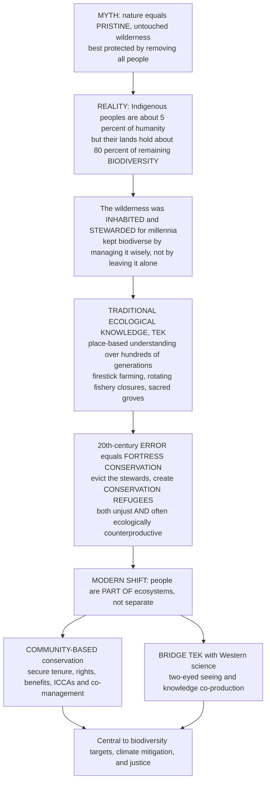

# 🪶 Indigenous Knowledge and Community Conservation

> [!abstract] TL;DR
> Here is a fact that upends the old "pristine wilderness" story of conservation: **Indigenous peoples are about 5% of humanity, yet their lands — roughly a quarter of the Earth's surface — hold about 80% of the planet's remaining biodiversity.** The places the West imagined as untouched — the Amazon, the boreal forests, the fire-shaped grasslands, the coral seas — were in fact **inhabited, used, and actively stewarded** for thousands of years, and often kept biodiverse **not by leaving them alone but by managing them wisely**. These communities hold **traditional ecological knowledge (TEK)**: a deep, place-based understanding of local species, seasons, and ecological relationships, accumulated and refined over **hundreds of generations** and encoded in practice, culture, story, and taboo. It is frequently astonishingly sophisticated — Aboriginal Australians used **"firestick farming"** (controlled cultural burning) to shape landscapes and prevent catastrophic wildfire long before Western fire ecology existed; Pacific islanders ran fisheries with rotating **closures** that presage modern marine reserves; the "three sisters" polyculture and sacred-site reserves are ecological engineering in cultural dress. The tragic irony of 20th-century conservation was **"fortress conservation"** — creating parks by **evicting the very people whose stewardship had maintained the biodiversity**, producing "**conservation refugees**" — which was both a human-rights violation **and** often ecologically counterproductive. The modern correction recognizes that **people are part of ecosystems, not separate from them**: **community-based conservation** gives local people secure rights, stewardship, and a stake in protecting nature, and **bridges Indigenous knowledge with Western science** ("two-eyed seeing"). This is not a soft add-on to conservation — it is **central to it**, both as a matter of justice and because the evidence shows it is frequently the **most effective** way to actually protect biodiversity.

---

## Intuition

**Analogy — the "abandoned" garden that was really a masterpiece.** Imagine walking into a vast, glorious garden — riotous with fruit trees, flowering meadows, and thriving wildlife — and declaring it "untouched wilderness" that must be fenced off and left alone to stay pristine. So you evict the gardeners you find living there, post guards, and forbid all cultivation. Within a few years the garden begins to decline: the fruit trees, unpruned, choke on their own overgrowth; the meadows, unmown and unburned, pile up dry brush until a single spark torches everything; the animals that fed on the tended clearings drift away. You had mistaken **a carefully managed landscape for an accident of nature** — and by removing the very people who managed it, you destroyed the thing you were trying to protect. That garden is most of the world's "wilderness," and those gardeners are its Indigenous and local communities.

This is the intuition that took conservation a century to learn. The rainforest, the savanna, the fire-adapted forest — these are not blank, humanless wildernesses that happened to survive. Many are **anthropogenic mosaics**, shaped over millennia by burning, planting, pruning, harvesting, and seasonal closures, guided by **traditional ecological knowledge (TEK)** — the cumulative body of knowledge, practice, and belief about ecological relationships, refined over hundreds of generations and transmitted through culture. The gardener knows things the visiting botanist does not: which plants to burn and when, which fishing grounds to close this season, which grove is sacred and therefore never cut. The 20th century's great mistake — **fortress conservation** — was to assume nature is best protected by removing humans, and so it evicted the stewards and created **conservation refugees**, an injustice that also often made the ecology *worse*. The modern correction is simple to state and profound in consequence: **humans can be part of a healthy ecosystem, and the surest way to keep the garden is usually to keep — and empower — its gardeners.**

---

## How It Works

### Core Mechanics

1. **Dismantle the "pristine wilderness" myth.** The foundational move is a **paradigm correction**: the Western ideal of nature as untouched wilderness (Yellowstone, the "virgin" Amazon) is largely a **myth**. Most "wild" landscapes have been **inhabited, used, and shaped by humans** for millennia — through fire, cultivation, hunting, and settlement — such that their biodiversity is partly a *product* of human management, not a state that predates it. People are properly understood as **components of ecosystems**, not intruders upon them.

2. **Grasp the striking spatial fact.** **Indigenous peoples are about 5% of the world's population and steward roughly a quarter (about 25%) of the global land surface, yet those lands overlap with about 80% of the planet's remaining biodiversity** (Garnett et al., 2018, mapped Indigenous lands across more than a quarter of Earth). Their territories consistently show **equal or lower rates of deforestation and habitat loss** than adjacent state-run protected areas — the empirical heart of the whole field.

3. **Understand Traditional Ecological Knowledge (TEK).** Following **Berkes**, TEK is "a cumulative body of knowledge, practice, and belief, evolving by adaptive processes and handed down through generations by cultural transmission, about the relationship of living beings with one another and with their environment." Its **character** is holistic, adaptive, long-term, and locally calibrated; it is **encoded** not in journals but in **story, taboo, ritual, calendar, and practice**. Its **content** spans species behavior and phenology, sustainable harvest rules, fire and landscape management, and the designation of **sacred sites** that function as de facto reserves.

4. **Recognize TEK as ecological engineering.** Concrete examples: **firestick farming / cultural burning** (patch-mosaic controlled burns that create landscape heterogeneity, favor food species, and prevent catastrophic wildfire); **polyculture** such as the maize-beans-squash **"three sisters"** (nitrogen fixation, ground cover, structural support in one guild); **rotating fishery closures** and reef tenure that presage modern **marine protected areas**; and **sacred groves** protected by taboo. These are not folklore decorating survival — they are **tested management systems**.

5. **Bridge, do not replace, Western science.** TEK and Western science **differ** (qualitative/relational/long-observation vs quantitative/experimental/short-term) yet are **complementary**. **Knowledge co-production**, **"two-eyed seeing"** (Mi'kmaq elder Albert Marshall: seeing with the strength of Indigenous knowledge in one eye and Western science in the other), and **"braiding"** (Kimmerer) combine them — TEK supplies deep local time-series and mechanism, science supplies generalization and instrumentation.

6. **Confront the fortress-conservation problem.** Classic **"fortress conservation"** created "pristine" parks by **displacing and evicting** Indigenous and local peoples — Dowie's **"conservation refugees,"** estimated in the millions. This is **both a human-rights violation and often ecologically counterproductive**: alienated former stewards lose the incentive and the knowledge to protect the land, and the removal of active management (e.g., burning) can itself degrade the ecosystem.

7. **Adopt the community-based alternative.** The corrective model is **community-based conservation**: **community-based natural resource management (CBNRM)**, **Indigenous and Community Conserved Areas (ICCAs)**, **co-management** and devolved governance, community forestry and fisheries, and above all **secure land tenure, rights, and a fair share of benefits** (ecotourism, wildlife revenue such as Zimbabwe's **CAMPFIRE**). Theoretically this rests on **Ostrom's** demonstration that communities can sustainably govern common-pool resources through the right institutions — neither pure privatization nor top-down state control.

8. **Weigh the evidence and the tensions.** Studies repeatedly find Indigenous- and community-managed lands **match or beat** state protected areas on deforestation and biodiversity outcomes. But the field must avoid **romanticization** (not every traditional practice is sustainable, especially under modern populations, markets, and technology), attend to **equity within communities**, guard against **external threats** (mining, logging, land grabs), and resolve **biopiracy / intellectual-property and benefit-sharing** issues (the **Nagoya Protocol** on access and benefit-sharing).

### Flow / Architecture



---

## Key Concepts

### Secondary — people as part of nature

- **The "wilderness" was never empty** — the forests, plains, and reefs we call "wild" have had people living in and caring for them for **thousands of years**. Many stayed full of life *because* of that care, not despite it.
- **The 5% / 80% fact** — Indigenous peoples are only about **5 out of every 100 people** on Earth, but the lands they look after hold about **80% of all the wild plants and animals** we have left. That is a stunning amount of nature protected by a small number of people.
- **Traditional ecological knowledge (TEK)** — the deep know-how a community builds up over **hundreds of years** about its own land: which plants heal, when the fish spawn, when to burn, when to stop hunting. It is passed down through stories, rules, and everyday practice.
- **Firestick farming** — Aboriginal Australians (and many others) set **small, careful fires** on purpose. This clears dangerous dry brush, helps favored plants and animals, and stops the giant, destructive wildfires that build up when land is left unburned.
- **Fortress conservation** — the old idea that to save nature you must **fence it off and kick the people out**. It made national parks by evicting the very people who had kept the land healthy — unfair to them, and often bad for nature too.
- **Community conservation** — the better idea: let local people **keep their land and their rights**, and give them a real stake in protecting it. When people benefit from healthy nature, they guard it well.

### Undergraduate — TEK, fortress conservation, and the community model

- **TEK defined (Berkes)** — a cumulative, adaptive body of **knowledge, practice, and belief** about ecological relationships, transmitted culturally across generations. Distinct from folklore by being **empirically grounded** in long observation and **tested** by consequences (a bad harvest rule starves its community).
- **Anthropogenic landscapes** — many "natural" systems are **human-shaped**: Amazonian **terra preta** (fertile anthropogenic soils) and forest islands, the fire-managed savannas and eucalypt forests of Australia, the oak woodlands of California. Removing traditional management can trigger succession, fuel build-up, or biodiversity loss.
- **TEK vs Western science — complementarity** — TEK is **qualitative, holistic, place-specific, moral/relational, long-time-series**; science is **quantitative, reductionist, generalizable, value-neutral in aspiration, short-time-series**. **Two-eyed seeing** and **co-production** braid the two rather than ranking them.
- **Fortress conservation and conservation refugees (Dowie)** — the exclusionary model that created parks by **eviction and criminalization** of customary use, displacing millions and generating lasting conflict, "paper parks," and poaching by alienated communities.
- **Community-based natural resource management (CBNRM)** — devolving rights to manage and benefit from wildlife/forests/fisheries to local institutions: Namibian **communal conservancies**, Zimbabwe's **CAMPFIRE**, community forestry in Nepal and Mexico.
- **ICCAs and co-management** — **Indigenous and Community Conserved Areas** are territories governed by Indigenous peoples and local communities that achieve conservation as a by-product of customary governance; **co-management** shares authority between communities and the state. Both now count toward global area targets.
- **Secure tenure as the linchpin** — the strongest predictor of good outcomes is **legally secure land and resource tenure**. Without it, communities cannot exclude outside threats (loggers, miners) or reap long-term benefits, so the incentive to steward collapses.

### Graduate — governance, evidence, and the tensions

- **The spatial-overlap evidence (Garnett et al., 2018)** — Indigenous peoples manage or have tenure rights over **at least about a quarter of the global land surface**, intersecting about **40% of terrestrial protected areas and ecologically intact landscapes**; a large share of remaining low-human-impact biodiversity sits on these lands. Causal-inference studies (matching designs controlling for accessibility, slope, and market distance) find Indigenous tenure **reduces deforestation** relative to comparable non-tenured land.
- **Ostrom's design principles applied** — durable community governance of common-pool resources satisfies principles including **clearly defined boundaries, congruence of rules with local conditions, collective-choice arrangements, monitoring, graduated sanctions, conflict-resolution mechanisms, recognized rights to organize, and nested enterprises**. Many TEK institutions (closures, taboos, rotational access) implement these implicitly; **polycentric** governance nests local rules within regional and national frameworks.
- **Fire as keystone management** — patch-mosaic **cultural burning** engineers **pyrodiversity** (a mixture of burn ages and intensities) that maximizes habitat heterogeneity, sustains fire-dependent species, and **reduces fuel loads** to prevent stand-replacing megafires. The suppression of Indigenous burning is now recognized as a driver of catastrophic wildfire regimes; "**good fire**" programs restore it.
- **Rights-based and decolonizing conservation** — the shift from viewing communities as a **constraint** to viewing rights and equity as a **condition of durability and legitimacy**. Instruments include **FPIC** (free, prior, and informed consent), the **UN Declaration on the Rights of Indigenous Peoples (UNDRIP)**, and legal recognition of Indigenous title. **Decolonizing conservation** critiques the discipline's colonial roots and re-centers Indigenous authority and epistemologies.
- **The tensions, honestly** — (i) **romanticization / the "ecologically noble savage"** myth: not all traditional practice is sustainable, and none is static; sustainability can break down under **population growth, cash markets, and new technology** (rifles, chainsaws, outboard motors). (ii) **Intra-community equity**: elites can capture benefits; women and marginalized members may be excluded. (iii) **Biopiracy and IP**: commercial appropriation of TEK (e.g., pharmaceutical bioprospecting) without consent or benefit-sharing — addressed by the **Nagoya Protocol** on Access and Benefit-Sharing and the CBD's TEK provisions. (iv) **External threats** that even good governance cannot repel without secure rights and state backing.
- **Central to global agendas** — Indigenous stewardship is now framed as **central to the Kunming-Montreal "30x30" target done justly** (counting ICCAs and OECMs, requiring FPIC and equitable governance), to **climate mitigation** (Indigenous lands are vast **carbon stores**; deforestation rises when tenure is insecure), and to **environmental justice**. The metric shifts from *area protected* to *effectively and equitably governed*.

---

## Python Demo

```python
# Indigenous knowledge and community conservation, in four views:
#   (A) STEWARDSHIP OUTCOMES -- forest cover retained over time under three land-tenure
#       types (Indigenous lands vs state protected areas vs unprotected), modeling the
#       empirical finding that Indigenous territories lose forest as slowly as, or more
#       slowly than, strict protected areas -- and far slower than unprotected land.
#   (B) THE DISPROPORTION -- Indigenous peoples are ~5% of humanity and steward ~25% of
#       land, yet those lands hold ~80% of remaining biodiversity: a small population
#       share safeguarding a huge biodiversity share.
#   (C) COMMONS GOVERNANCE -- a shared resource (fishery/game stock) under OPEN ACCESS
#       (race-to-harvest, effort > regrowth -> collapse) versus a COMMUNITY closure rule
#       (Ostrom-style: harvest only when the stock is above a threshold, close it to
#       recover otherwise) that sustains the stock indefinitely.
#   (D) FIRE MANAGEMENT -- patch-mosaic cultural burning keeps fuel load bounded and fires
#       small, versus unmanaged fuel build-up that crosses a threshold into catastrophic
#       stand-replacing megafire.
import numpy as np
import matplotlib.pyplot as plt

fig, axes = plt.subplots(2, 2, figsize=(13.5, 10))

# ------------------------------------------------ (A) STEWARDSHIP: forest retained
years = np.arange(0, 31)                      # 30-year horizon
loss = {"Indigenous lands": 0.006,            # ~0.6%/yr forest loss (lowest)
        "State protected areas": 0.009,       # ~0.9%/yr
        "Unprotected land": 0.028}            # ~2.8%/yr (highest)
colors = {"Indigenous lands": "#1b7837",
          "State protected areas": "#4393c3",
          "Unprotected land": "#b2182b"}
ax = axes[0, 0]
for name, rate in loss.items():
    cover = 100.0 * (1.0 - rate) ** years     # exponential retention of forest cover
    ax.plot(years, cover, lw=2.6, color=colors[name],
            label=f"{name}  (~{rate*100:.1f}%/yr loss)")
ax.set_title("(A) Forest retained by land-tenure type")
ax.set_xlabel("year"); ax.set_ylabel("forest cover remaining  (%)")
ax.set_ylim(50, 101); ax.legend(fontsize=8.5); ax.grid(alpha=0.3)

# ------------------------------------------------ (B) THE DISPROPORTION
cats = ["Share of world\npopulation", "Share of land\nstewarded",
        "Share of remaining\nbiodiversity"]
vals = [5, 25, 80]                            # percent (illustrative, per Garnett et al. 2018)
bcol = ["#762a83", "#9970ab", "#1b7837"]
ax = axes[0, 1]
bars = ax.bar(cats, vals, color=bcol, edgecolor="black", linewidth=0.6)
for b, v in zip(bars, vals):
    ax.text(b.get_x() + b.get_width()/2, v + 1.5, f"~{v}%",
            ha="center", fontsize=11, fontweight="bold")
ax.set_title("(B) 5% of people, stewarding 25% of land, holding 80% of biodiversity")
ax.set_ylabel("percent of global total  (%)")
ax.set_ylim(0, 92); ax.grid(alpha=0.3, axis="y")

# ------------------------------------------------ (C) COMMONS GOVERNANCE
r, K = 0.4, 1000.0                            # logistic growth of the shared stock
T = 80
def simulate(rule):
    N = K; traj = []; cum_harvest = 0.0
    for t in range(T):
        growth = r * N * (1.0 - N / K)
        if rule == "open":
            h = 0.55 * N                       # constant-effort fraction > r  -> collapse
        else:                                  # community closure rule
            h = 0.30 * N if N >= 0.55 * K else 0.0
        N = max(N + growth - h, 0.0)
        cum_harvest += h; traj.append(N)
    return np.array(traj), cum_harvest
open_traj,  open_yield  = simulate("open")
comm_traj,  comm_yield  = simulate("closure")
ax = axes[1, 0]
tt = np.arange(T)
ax.plot(tt, comm_traj, color="#1b7837", lw=2.6, label="community closure rule (sustained)")
ax.plot(tt, open_traj, color="#b2182b", lw=2.4, ls="--", label="open access (collapse)")
ax.axhline(0.55 * K, color="grey", lw=1.0, ls=":", label="closure threshold")
ax.set_title("(C) Commons governance: closure sustains, open access collapses")
ax.set_xlabel("year"); ax.set_ylabel("stock size  N")
ax.set_ylim(0, K * 1.02); ax.legend(fontsize=8.5); ax.grid(alpha=0.3)

# ------------------------------------------------ (D) FIRE MANAGEMENT
T2 = 120
accum = 1.0                                    # fuel accumulation per year
F_crit = 25.0                                  # catastrophic-megafire threshold
# Unmanaged: fuel builds until it crosses F_crit -> stand-replacing megafire, reset
fuel_u = np.zeros(T2); mega = []
f = 0.0
for t in range(T2):
    f += accum
    if f >= F_crit:
        mega.append(t); f = 0.0                # catastrophic fire consumes everything
    fuel_u[t] = f
# Patch-mosaic cultural burning: small controlled burn every 5 yr keeps fuel low
fuel_m = np.zeros(T2)
f = 0.0
for t in range(T2):
    f += accum
    if t > 0 and t % 5 == 0:
        f *= 0.25                              # frequent small burns remove most fuel
    fuel_m[t] = f
ax = axes[1, 1]
tt2 = np.arange(T2)
ax.plot(tt2, fuel_u, color="#b2182b", lw=2.2, label="unmanaged (fuel builds to megafire)")
ax.plot(tt2, fuel_m, color="#1b7837", lw=2.2, label="patch-mosaic cultural burning")
ax.axhline(F_crit, color="black", lw=1.2, ls="--", label="catastrophic-fire threshold")
for i, m in enumerate(mega):
    ax.plot(m, F_crit, "*", color="#b2182b", ms=15,
            label="catastrophic megafire" if i == 0 else None)
ax.set_title("(D) Fire management: cultural burning prevents megafire")
ax.set_xlabel("year"); ax.set_ylabel("fuel load  (relative)")
ax.set_ylim(0, F_crit * 1.25); ax.legend(fontsize=8.5, loc="upper left"); ax.grid(alpha=0.3)

plt.tight_layout()
plt.savefig("indigenous_community_conservation.png", dpi=120)
plt.show()

# ---- console summary ----
print("(A) After 30 yr: Indigenous lands retain "
      f"{100*(1-0.006)**30:.1f}% forest vs protected {100*(1-0.009)**30:.1f}% "
      f"vs unprotected {100*(1-0.028)**30:.1f}%.")
print("(B) ~5% of people steward ~25% of land yet safeguard ~80% of remaining biodiversity.")
print(f"(C) Community closure final stock {comm_traj[-1]:.0f}, cumulative harvest "
      f"{comm_yield:.0f}; open access final stock {open_traj[-1]:.0f}, "
      f"cumulative harvest {open_yield:.0f}.")
print(f"(D) Unmanaged land suffered {len(mega)} catastrophic megafires in {T2} yr; "
      f"cultural burning suffered 0 (peak fuel {fuel_m.max():.1f} < threshold {F_crit:.0f}).")
```

**What it shows.** **Panel A** makes the core empirical claim visible: model three land-tenure types with different annual forest-loss rates and plot the forest they retain — **Indigenous lands hold onto their forest as well as, or better than, strict protected areas, and dramatically better than unprotected land**, exactly the pattern the tenure literature reports. **Panel B** puts the paradigm-correcting fact in one image: **5% of humanity, stewarding a quarter of the land, safeguards four-fifths of remaining biodiversity** — a wildly disproportionate, and easily overlooked, conservation contribution. **Panel C** is the governance mechanism: a shared stock under **open access** is harvested faster than it regrows and **collapses toward zero** (the race-to-fish), while an Ostrom-style **community closure rule** — harvest only above a threshold, close to recover below it — **sustains the stock indefinitely and yields more over the long run**. **Panel D** models cultural fire: **unmanaged fuel accumulates until it crosses a catastrophic threshold and the landscape burns in stand-replacing megafires**, whereas **patch-mosaic cultural burning** keeps fuel bounded and fires small — firestick farming as ecological engineering. (All figures are illustrative but faithful to the published patterns.)

---

## Real-World Applications

> **Example: Indigenous territories as the Amazon's most effective firebreak against deforestation.** Satellite analyses of the Brazilian Amazon repeatedly find that **legally recognized Indigenous territories have among the lowest deforestation rates of any land category — often lower than strict protected areas — despite being inhabited and used.** During surges in forest clearing, Indigenous lands stand out as intact green blocks on the deforestation map, holding the line against agricultural frontier, illegal logging, and mining. The mechanism is precisely this note's thesis: **secure tenure + active stewardship + a community stake** outperforms the fortress model. It also shows the fragility — where tenure is weakened or enforcement withdrawn, invasions and clearing rise, confirming that **rights are the linchpin**, not a nicety.

- **Aboriginal cultural burning and Australia's fire crisis.** After decades of fire suppression contributed to catastrophic megafires (including the 2019–20 "Black Summer"), Australia has increasingly reintroduced **Aboriginal patch-mosaic burning**. Indigenous ranger programs and **carbon-credit savanna-burning schemes** in northern Australia now use early-dry-season cultural burns to cut late-season wildfire, reduce emissions, and fund communities — TEK, science, and markets braided together.
- **Namibian communal conservancies (CBNRM).** Namibia devolved rights over wildlife and tourism revenue to community **conservancies** covering a fifth of the country. Wildlife numbers (elephants, black rhino, lions) rebounded as communities gained a direct stake in living animals through tourism and regulated hunting — a flagship demonstration that community-based conservation can reverse decline where fortress parks failed.
- **Zimbabwe's CAMPFIRE.** The Communal Areas Management Programme for Indigenous Resources channeled revenue from wildlife (safari hunting, tourism) directly to rural communities, realigning incentives so that wildlife became an asset rather than a competitor for cropland — an influential, if contested, CBNRM model studied worldwide.
- **Locally Managed Marine Areas (LMMAs) and traditional closures in the Pacific.** Across Fiji, the Solomon Islands, and beyond, communities revive customary **tabu** (temporary no-take closures) and reef tenure to rebuild fish stocks — indigenous institutions that function as adaptive marine reserves and now form networks spanning tens of thousands of square kilometers.
- **Braiding Sweetgrass and two-eyed seeing in North America.** Robin Wall Kimmerer's work, and Mi'kmaq "two-eyed seeing," inform co-managed restoration (e.g., Indigenous-led salmon, fire, and prairie restoration), showing how TEK's relational, long-observation knowledge complements experimental ecology in practice.

---

## Common Pitfalls

- **Believing the "pristine wilderness" myth.** Treating inhabited, human-shaped landscapes as untouched nature leads directly to evicting the stewards and removing the management (burning, harvesting) that sustained biodiversity. **"Wild" usually means "well-managed by someone you did not notice."**
- **Fortress conservation — protecting nature by removing people.** Excluding and criminalizing Indigenous and local communities is **both unjust and often ineffective**: it creates conservation refugees, breeds conflict and poaching by alienated ex-stewards, and can degrade the ecosystem it aimed to save. Rights and stewardship, not fences and guards, are the durable model.
- **Romanticizing TEK (the "ecologically noble savage").** The opposite error: assuming *everything* traditional is sustainable. Practices calibrated to low populations and simple tools **can break down** under population growth, cash markets, rifles, chainsaws, and outboard motors. TEK is powerful but **not static or automatically sustainable** — evaluate it, do not idealize it.
- **Recognition without secure tenure.** Nominal "co-management" or "consultation" that leaves communities without **legally secure, enforceable rights** to exclude outside threats and capture benefits removes the very incentive that makes stewardship work. Tenure is the linchpin; symbolic inclusion is not enough.
- **Ignoring intra-community equity.** "The community" is not a monolith. Benefits and decision power can be **captured by elites**, and women or marginalized members excluded. Good community conservation attends to **who inside the community gains, decides, and bears costs**.
- **Biopiracy and extractive research.** Mining TEK for commercial value (bioprospecting, data) **without free, prior, and informed consent or benefit-sharing** is exploitation. The **Nagoya Protocol** and FPIC exist precisely to prevent this; treat knowledge holders as partners and co-authors, not resources.
- **Tokenism — TEK as a footnote to "real" science.** Inviting Indigenous knowledge in only to decorate a pre-decided plan, or subordinating it to Western data, defeats **co-production**. Two-eyed seeing requires genuine **shared authority**, not a consultation box to tick.

---

## Related Concepts

This note is the **governance-and-equity keystone of the vault's economics-policy-and-frontiers section**, and it leans on several siblings referenced here in prose rather than as links. **Protected_Areas_and_Conservation_Strategies** is where the fortress-vs-community debate first appears; this note is its deep dive, explaining *why* excluding stewards fails and *how* ICCAs and co-management work. **Ecosystem_Based_Management_and_Rewilding** shares the recognition that people and process, not fenced snapshots, sustain ecosystems — cultural burning is a form of process-based management. **Environmental_Policy_and_Governance** develops the tenure, rights, and treaty instruments (UNDRIP, FPIC, Nagoya) only sketched here, while **Ecological_Economics_and_Natural_Capital** formalizes the benefit-sharing and stake-in-nature logic (ecotourism, payments, CAMPFIRE) that makes community conservation self-sustaining, and **The_Reach_and_Future_of_Ecology** frames Indigenous stewardship as central to a just "30x30" and to conservation's decolonizing future.

- [[Overexploitation_and_Sustainable_Harvesting]] — supplies the commons-governance engine of Panel C: open-access collapse versus Ostrom-style community institutions is exactly the fishery/game-management logic developed there.
- [[Agroecology_and_Food_Systems]] — the "three sisters" polyculture, swidden mosaics, and traditional agroforestry are TEK-based food systems that this note treats as ecological engineering.
- [[Conservation_Biology_and_the_Biodiversity_Crisis]] — the crisis-discipline frame; Indigenous-stewarded lands are where much of the biodiversity this discipline races to save actually persists.
- [[Ecosystem_Services]] — the instrumental-value case (carbon storage, tourism revenue) that funds and motivates community conservation and benefit-sharing.
- [[Indigenous_Rights_and_Sovereignty]] — the anthropology-vault treatment of land rights, self-determination, and sovereignty that underpins secure tenure, UNDRIP, and FPIC in conservation.
- [[Climate_Politics_and_Environmental_Governance]] — the political-science view of how global targets, forest carbon, and multilateral frameworks (CBD, Nagoya) are negotiated and enforced.
- [[Environmental_Justice_and_Sustainability]] — the ethics of conservation-induced displacement and Indigenous rights that makes community-based conservation a matter of justice, not just effectiveness.
- [[Sustainability_and_Planetary_Boundaries]] — the systems-level frame in which stewardship of the biosphere and living within regenerative limits are the shared goal.

---

## Review Questions

1. **(Secondary)** In your own words, why is it wrong to call the Amazon or the Australian bush "untouched wilderness"? Give one example of how Indigenous people have actively *managed* a landscape to keep it healthy. Why did "fortress conservation" — making parks by removing local people — often end up harming nature as well as being unfair?
2. **(Undergraduate)** Define **traditional ecological knowledge (TEK)** and explain three ways it differs from Western scientific knowledge. Using **firestick farming** as an example, explain how a traditional practice can maintain biodiversity and *prevent* catastrophic wildfire, and describe what "two-eyed seeing" means for combining TEK with science.
3. **(Undergraduate)** The fact that Indigenous peoples are ~5% of humanity yet their lands hold ~80% of remaining biodiversity is often cited in conservation. What does this fact actually claim, what does it *not* prove on its own, and what kind of study (think about confounders like remoteness and terrain) would be needed to show that Indigenous *management* — rather than just the location of their lands — reduces deforestation?
4. **(Graduate)** Reconcile the risk of **romanticizing TEK** ("ecologically noble savage") with the strong evidence that Indigenous-managed lands often outperform state protected areas. Under what conditions (population, markets, technology, tenure) does traditional management stay sustainable, and which of **Ostrom's design principles** most directly explain durable community governance of a common-pool resource?
5. **(Graduate)** A government pledges to meet "30x30" partly by counting **Indigenous and Community Conserved Areas (ICCAs)**. As a reviewer concerned with both biodiversity and justice, what would you require before accepting this — address **secure tenure and FPIC**, **intra-community equity**, **biopiracy and benefit-sharing (Nagoya)**, and **effectiveness versus paper recognition** — and explain why rights are treated as a *condition of durability*, not a constraint on conservation.

---

## Sources

- Berkes, F. (2018). *Sacred Ecology: Traditional Ecological Knowledge and Resource Management* (4th ed.). Routledge. — the foundational definition and analysis of TEK, its character, and its role in resource management.
- Garnett, S. T., Burgess, N. D., Fa, J. E., et al. (2018). "A spatial overview of the global importance of Indigenous lands for conservation." *Nature Sustainability* 1, 369–374. [DOI](https://doi.org/10.1038/s41893-018-0100-6) — maps Indigenous management across at least a quarter of Earth's land and its overlap with intact, biodiverse landscapes.
- Dowie, M. (2009). *Conservation Refugees: The Hundred-Year Conflict between Global Conservation and Native Peoples*. MIT Press. — the definitive account of fortress conservation and the displacement it caused.
- Kimmerer, R. W. (2013). *Braiding Sweetgrass: Indigenous Wisdom, Scientific Knowledge, and the Teachings of Plants*. Milkweed Editions. — a widely read synthesis of Indigenous knowledge and Western science ("braiding") from a botanist and Potawatomi author.
- Ostrom, E. (1990). *Governing the Commons: The Evolution of Institutions for Collective Action*. Cambridge University Press. — the Nobel-winning demonstration and design principles for durable community governance of common-pool resources.

---

#ecology #indigenous-knowledge #traditional-ecological-knowledge #community-conservation #environmental-justice
