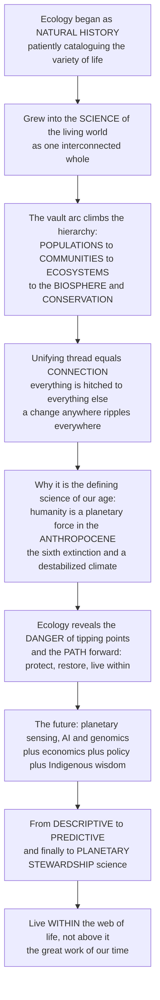

# 🌍 The Reach and Future of Ecology

> [!abstract] TL;DR
> Ecology began as **natural history** — patiently describing and cataloguing the wonderful variety of life — but it has grown into something far more profound and urgent: the **science of how the living world works as an interconnected whole**, and the closest thing we have to an *operating manual for keeping our planet habitable*. This capstone zooms out and reads the whole arc of the vault as one story. We started with **populations** (how numbers grow and are regulated), built up to **communities** (how species compete, cooperate, and coexist), then to **ecosystems** (how energy flows and matter cycles), and finally to the **biosphere** and the great **conservation** challenge of our age. The unifying thread is **connection** — John Muir's insight that "when we try to pick out anything by itself, we find it hitched to everything else in the universe." Nothing in nature stands alone; **a change anywhere ripples everywhere**. That is exactly why ecology has become the defining science of the 21st century: humanity has become a **planetary force** — the **Anthropocene** — running an uncontrolled experiment on the only biosphere we have, driving the **sixth mass extinction** and destabilizing the **climate**. Ecology reveals *both* the danger (how close we are to **tipping points** and the edge of a safe operating space) *and* the path forward (how ecosystems can be **protected, restored, and lived within**). Its future is being reshaped by new powers — planetary-scale **sensing**, **AI**, **genomics** (eDNA), and the integration of ecology with **economics, policy, and Indigenous wisdom** — as it moves from a **descriptive** science to a **predictive** one and, ultimately, to a **planetary-stewardship** science. Its deepest lesson is at once the most humbling and the most hopeful: we are not separate from nature but utterly *part* of it, and **learning to live within the web of life — rather than above it — is the great work of our time.**

---

## Intuition

**Analogy — from the naturalist's cabinet of curiosities to the pilot's cockpit of a planet.** Picture a 19th-century naturalist: a room full of pinned beetles, pressed flowers, and labelled bird skins, each specimen a small wonder catalogued for its own sake. That was ecology's cradle — natural history, the loving *description* of life's variety. Now picture something utterly different: a pilot in a cockpit, watching a bank of gauges that show the health of the entire aircraft, hands on the controls, responsible for keeping it aloft. In a single lifetime, ecology has walked from the cabinet to the cockpit — because we suddenly find ourselves flying the plane. The specimens were never really separate objects; they were readouts of one connected machine, and now we are the ones piloting it, whether we understand the instruments or not.

The reason the cabinet turned into a cockpit is the single deepest discovery of the whole vault: **everything is connected.** Pull one thread and the whole web moves. That is why this discipline could never stay a catalogue. When you truly grasp that the wolf is hitched to the willow, the willow to the beaver, the beaver to the wetland, the wetland to the songbird and the river — and that the plankton are hitched to the climate, the climate to the forests, the forests to the rain — you can no longer treat any piece "by itself." You are forced to think in *systems*, and once you think in systems you realize that a species going extinct in one place, a nutrient over-loaded in another, and a degree of warming everywhere are not separate news items but ripples in one pond.

And here is the turn that makes ecology not just interesting but *the* science of our century. For all of history the biosphere was the vast, stable stage on which human affairs played out — too big to break. That is over. Humanity has become a **geological force**: we move more earth than the rivers, fix more nitrogen than all of nature, have warmed the whole atmosphere, and are erasing species faster than at almost any moment in the last half-billion years. We are conducting an **uncontrolled experiment** on the only life-support system we have, with no control group and no second planet. Ecology is the instrument panel for that experiment. It tells us how near we are to **tipping points** where the plane stalls, and it tells us the flight path back to level: **protect** what remains, **restore** what we've broken, and learn to **live within** the system rather than mining it. Its future — armed with satellites that watch every forest, with AI that turns oceans of data into forecasts, with genomics that reads life from a cup of water, and with the humility to braid modern science together with Indigenous knowledge, economics, and policy — is a shift from merely *describing* the living world to *predicting* its behavior and, finally, to *stewarding* it. The last lesson is the one the naturalist could not see from inside the cabinet: **we are not above the web of life; we are a strand in it. Learning to fly the plane without crashing it is the great work of our time.**

---

## How It Works

### Core mechanics — the grand synthesis in one arc

1. **The hierarchy of ecology (the vault's spine).** Ecology nests neatly: **individuals** → **populations** (how numbers grow and are regulated) → **communities** (how species interact — competition, predation, mutualism, food webs) → **ecosystems** (energy flow and biogeochemical cycling) → **biomes** → the **biosphere**. Each level *emerges* from the one below yet obeys its own rules. This vault climbed that ladder rung by rung, and this note stands at the top and looks back down the whole staircase.

2. **The recurring principles that unify every level.** The same handful of ideas reappear at each scale, which is why ecology is a *science* and not a bestiary: (a) **connection and interdependence** — everything is hitched to everything (Muir); (b) **energy flow and matter cycling** — energy flows *through* (one-way, degrading), matter cycles *around* (conserved); (c) **feedback and regulation** — populations, communities, and the biosphere are held (loosely) in check by loops; (d) the **diversity–stability** relationship — more diverse systems tend to be more resilient; (e) **evolution and adaptation** as the ever-present backdrop that wrote every interaction; (f) **scale and emergence** — patterns at one level are invisible at another; and (g) **non-equilibrium, resilience, and tipping points** — nature is dynamic, and stability can break suddenly and irreversibly.

3. **Ecology as the integrative science.** Because it must track energy (physics), matter (chemistry), organisms (biology), landscapes (geology), and now people (the social sciences), ecology is inherently the **discipline that stitches the others together**. It is where the second law of thermodynamics, the nitrogen cycle, natural selection, plate-shaped biomes, and human economies all have to be true *at once*.

4. **Ecology as the defining science of the Anthropocene.** Humanity is now a **planetary force** running an uncontrolled biosphere experiment. Two coupled crises dominate: the **biodiversity crisis** (the human-driven **sixth mass extinction**) and **climate change**, and — crucially — their **synergy** (warming drives extinction; ecosystem loss weakens carbon sinks; each amplifies the other). Ecology's dual job is to **diagnose the danger** (map **planetary boundaries** and **tipping points**, the edges of a safe operating space) and to **prescribe the cures** (protection, restoration, sustainable use, rewilding, and living within limits).

5. **From descriptive to predictive to stewardship science.** The field is undergoing three transitions at once. (a) A **methodological** one — from *describing* patterns to **forecasting** them (**ecological forecasting**: near-term, iterative, testable predictions of ecosystem change), powered by a **data/technology revolution** (satellite remote sensing, **eDNA**, sensor networks, AI/big data, macrosystems ecology). (b) A **conceptual** one — embracing **eco-evolutionary dynamics** (evolution fast enough to matter *now*), **disease and microbiome ecology / planetary health / One Health**, and **novel ecosystems** we must design and manage for an altered future (assisted migration, and the sharp debates over synthetic biology and de-extinction). (c) A **transdisciplinary** one — coupling ecology with **economics** (natural capital, ecosystem services), **policy and governance**, and **Indigenous and local knowledge**, into **social-ecological systems** thinking and a broader **sustainability / planetary-stewardship** science.

6. **The enduring reframing — humans as part of, not apart from, nature.** The final synthesis is philosophical as much as scientific: the challenge of a *good* Anthropocene is a **thriving biosphere alongside ~10 billion people** living within planetary limits (the "safe and just space" of doughnut economics). Ecology is thus simultaneously a **rigorous predictive science** and a **source of wisdom and humility** about our total dependence on the living world — and an ethical, *hopeful* call to **planetary stewardship**.

### The arc of the vault — and where it points



---

## Key Concepts

### Secondary — the big picture in plain words

- **Ecology is the study of nature's connections.** It started as *natural history* — naming and describing plants and animals — and grew into the science of how all living things fit together with each other and their surroundings. It is basically the **user manual for a living planet.**
- **Everything is connected.** John Muir said that when we try to pick out one thing, we find it "hitched to everything else in the universe." Change one part of nature and the effect ripples out everywhere — that single idea runs through this whole vault.
- **The ladder we climbed.** This vault went step by step: **individuals → populations** (how many, and why) **→ communities** (who eats, helps, or competes with whom) **→ ecosystems** (how energy and nutrients move) **→ the whole biosphere** and how to **protect** it.
- **Why it matters more than ever.** Humans have become powerful enough to change the *whole planet* — the age scientists call the **Anthropocene**. We are causing a **sixth mass extinction** and heating the climate. Ecology is how we see the danger *and* find the way out.
- **The hopeful part.** Ecology shows we are not separate from nature — we are *part* of it. Learning to live inside the web of life instead of wrecking it is, as this note argues, "the great work of our time."

### Undergraduate — the synthesis and the frontiers

- **The unifying principles.** Across every scale, ecology returns to the same laws: **energy flows** (one-way, always degrading toward heat) while **matter cycles** (conserved, endlessly reused); **feedback loops** regulate populations, communities, and the biosphere; **diversity tends to buy stability**; **evolution** is the backdrop to every interaction; and systems are **dynamic**, not fixed — capable of **resilience** but also of sudden **regime shifts**. Learning to see these recurring motifs *is* learning ecology.
- **Ecology is the integrative science.** It is the one discipline forced to hold physics (energy), chemistry (nutrient cycles), biology (organisms and evolution), geology (landscapes and climate), and now the **social sciences** (human economies and choices) all true at once. That breadth is why it sits at the center of environmental problem-solving.
- **The twin crises and their synergy.** The **biodiversity crisis** (sixth mass extinction) and **climate change** are not two separate emergencies but a **coupled** one: warming shifts and shrinks ranges and drives extinctions, while habitat and biodiversity loss cripple the carbon sinks (forests, peat, oceans) that would otherwise buffer warming. Each accelerates the other.
- **Planetary boundaries and a safe operating space.** Rockström and Steffen's framework identifies ~nine Earth-system processes (climate, biosphere integrity, biogeochemical flows, land use, freshwater, ocean acidification, and more) with **boundaries** that define a "safe operating space" for humanity. Several are already transgressed. Ecology supplies the science behind the biosphere-integrity and biogeochemical boundaries — the diagnosis of *how close to the edge* we are.
- **From describing to forecasting.** The most important methodological shift is toward **ecological forecasting** (Dietze): making **near-term, iterative, quantitative, testable predictions** of ecological change — species ranges, fisheries, wildfire, algal blooms, disease outbreaks — the way meteorology forecasts weather. This is only possible because of a **data revolution**: satellite **remote sensing**, **environmental DNA (eDNA)**, camera-trap and acoustic sensor networks, citizen science, and **AI/machine learning** to fuse it all.
- **New conceptual frontiers.** **Macrosystems and global-scale ecology** (patterns and drivers at continental scale); **eco-evolutionary dynamics** (evolution fast enough to change ecology in real time); **disease ecology, the microbiome, and One Health / planetary health** (human, animal, and ecosystem health as one system); and **novel ecosystems** — the recognition that we now manage assemblages with no historical analog, forcing tools like **assisted migration** and hard debates over **de-extinction** and **synthetic biology**.
- **The transdisciplinary turn.** Modern ecology is inseparable from **ecological economics** (valuing natural capital and ecosystem services so nature is no longer "free" and therefore ignored), **policy and governance**, and **Indigenous and local knowledge** — reframing conservation as **social-ecological systems** management and pushing the field toward **sustainability science**.

### Graduate — the deep integration and the reframing

- **Emergence and the failure of pure reductionism.** Ecology is a *complex-adaptive-systems* science: higher levels (community structure, ecosystem function, biosphere regulation) **emerge** from lower-level interactions but are not simply reducible to them, because of nonlinearity, feedback, and history-dependence. This is why single-species, single-variable management reliably backfires, and why the field's frontier (ecosystem-based management, rewilding, planetary-boundary thinking) is explicitly *systems* thinking. The **indirect effect** — a change propagating to species that never directly interact — is the signature of this irreducibility.
- **Non-equilibrium, resilience, and hysteresis as the modern paradigm.** The old "balance of nature" is gone; ecology now works with **alternative stable states**, **basins of attraction**, **critical transitions**, and **hysteresis** (reversing a driver does not reverse the effect). Practically, this reframes the goal of stewardship from *holding variables at targets* to *keeping systems in desirable, resilient basins* and watching for **early-warning signals** (critical slowing down, rising variance) that a tipping point looms — at scales from a lake to the Amazon, ice sheets, and the AMOC.
- **The Anthropocene as an uncontrolled planetary experiment.** Human activity now rivals or exceeds the great biogeochemical forces: we fix more reactive nitrogen than all natural processes combined, have altered the carbon cycle enough to warm the whole climate, appropriate a large fraction of net primary production, and are driving extinction at 100–1000× background rates. Framing this as a **coupled social-ecological Earth system** (Folke et al., "Reconnecting to the biosphere") is the conceptual core of sustainability science: development *within* the biosphere, not against it.
- **Predictive ecology and its epistemics.** Ecological forecasting imports the machinery of numerical weather prediction — **data assimilation**, **ensembles**, formal **uncertainty quantification**, and **iterative model–data cycles** — but confronts harder problems: ecological systems are more heterogeneous, evolve, and often lack conserved governing equations. The payoff is a field that can be *tested in advance* and continuously corrected, converting ecology from a historical, explanatory science into a decision-relevant, anticipatory one.
- **Eco-evolutionary and cross-scale dynamics.** Rapid, contemporary evolution (fisheries-induced evolution, urban adaptation, pathogen evolution, evolutionary rescue) means the "ecological backdrop" is itself moving on management timescales; feedbacks between ecology and evolution, and across spatial and temporal scales (macrosystems ecology), are central research frontiers.
- **The governance and knowledge frontier.** Because the drivers of ecological change are social and economic, the binding constraints are often institutional, not biological: designing **polycentric governance**, valuing **ecosystem services** without commodifying nature into fragility, resolving **environmental justice**, and genuinely partnering with **Indigenous stewardship** (which safeguards a disproportionate share of remaining biodiversity). This is where ecology meets ethics, economics, and law.
- **The reframing and the "good Anthropocene."** The deepest shift is ontological: humans are **within** the web of life, not above it. The aspiration is a **safe and just operating space** — a flourishing biosphere supporting ~10 billion people (the "doughnut": above a social foundation, below the ecological ceiling). Ecology thereby becomes both a rigorous predictive science *and* a wisdom tradition about dependence, limits, and humility — and, ultimately, a science of **planetary stewardship**. That dual character — hard quantitative science *and* an ethic of care for a living world we are part of — is the enduring reach of the discipline this vault has traced.

---

## Python Demo

```python
# The reach & future of ecology — a SYNTHESIS visualization that ties the vault together.
#   Panel 1  THE WEB OF ECOLOGY: the vault's major themes drawn as a network, arranged
#            up the ecological hierarchy (individuals -> populations -> communities ->
#            ecosystems -> biosphere -> conservation & policy) and densely cross-linked,
#            to make the unifying thread visible: EVERYTHING IS CONNECTED.
#   Panel 2  TWO FUTURES FOR THE BIOSPHERE: divergent 21st-century trajectories of a
#            biosphere-health index under "business-as-usual" (continued decline past a
#            safe boundary toward collapse) vs "sustainability / stewardship" (a dip, then
#            stabilization and recovery inside the safe operating space) — the choice
#            ecology illuminates.
import numpy as np
import matplotlib.pyplot as plt

# ============================================================ Panel 1: the web of ecology
# Nodes placed up the ecological hierarchy (higher y = smaller scale / earlier in arc).
pos = {
    "Individuals":              (0.0, 5.0),
    "Populations":              (0.0, 4.0),
    "Species\ninteractions":    (-1.9, 3.0),
    "Food webs":                (1.9, 3.0),
    "Biodiversity":             (0.0, 3.0),
    "Ecosystems\n& energy":     (-1.3, 1.8),
    "Biogeochemistry":          (1.3, 1.8),
    "Biosphere &\nglobal change": (0.0, 0.8),
    "Conservation":             (-1.9, -0.3),
    "Economics\n& policy":      (1.9, -0.3),
}
# Edges = the interdependencies that make ecology a WEB, not a ladder.
edges = [
    ("Individuals", "Populations"),
    ("Populations", "Species\ninteractions"),
    ("Populations", "Food webs"),
    ("Populations", "Biodiversity"),
    ("Species\ninteractions", "Biodiversity"),
    ("Species\ninteractions", "Food webs"),
    ("Food webs", "Biodiversity"),
    ("Food webs", "Ecosystems\n& energy"),
    ("Species\ninteractions", "Ecosystems\n& energy"),
    ("Biodiversity", "Ecosystems\n& energy"),
    ("Ecosystems\n& energy", "Biogeochemistry"),
    ("Biodiversity", "Biogeochemistry"),
    ("Ecosystems\n& energy", "Biosphere &\nglobal change"),
    ("Biogeochemistry", "Biosphere &\nglobal change"),
    ("Biodiversity", "Biosphere &\nglobal change"),
    ("Biosphere &\nglobal change", "Conservation"),
    ("Biosphere &\nglobal change", "Economics\n& policy"),
    ("Conservation", "Economics\n& policy"),
    ("Conservation", "Biodiversity"),
    ("Economics\n& policy", "Ecosystems\n& energy"),
    ("Conservation", "Populations"),
]

# ==================================================== Panel 2: two futures for the biosphere
years = np.arange(2000, 2101)

def bau_curve(y):
    # Business-as-usual: a biosphere-health index sliding from ~75 toward ~35.
    return 33.0 + (78.0 - 33.0) / (1.0 + np.exp(0.05 * (y - 2050.0)))

bau = bau_curve(years)
present_year = 2025
present = float(bau_curve(present_year))          # ~68: shared "today" value
boundary = 62.0                                    # illustrative safe-operating-space edge

# Stewardship: identical to BAU until today, then a further dip, then recovery ABOVE the line.
stew = bau.copy()
m = years >= present_year
ty = years[m] - present_year
stew[m] = present - 5.0 * (1.0 - np.exp(-ty / 8.0)) + 22.0 * (1.0 - np.exp(-ty / 55.0))

# ================================================================================ plotting
fig, ax = plt.subplots(1, 2, figsize=(15.5, 6.6))

# --- Panel 1: the web -------------------------------------------------------------------
ax0 = ax[0]
for u, w in edges:                                 # draw connections first (behind nodes)
    x0, y0 = pos[u]; x1, y1 = pos[w]
    ax0.plot([x0, x1], [y0, y1], color="0.6", lw=1.1, zorder=1)
ys = np.array([p[1] for p in pos.values()])
cmap = plt.cm.viridis
for name, (x, y) in pos.items():
    frac = (y - ys.min()) / (ys.max() - ys.min())  # colour by scale in the hierarchy
    ax0.scatter(x, y, s=3200, color=cmap(0.15 + 0.7 * frac),
                edgecolor="black", linewidth=1.3, zorder=2)
    ax0.text(x, y, name, ha="center", va="center", fontsize=7.4,
             fontweight="bold", color="white", zorder=3)
ax0.set_xlim(-3.0, 3.0); ax0.set_ylim(-1.1, 5.7)
ax0.axis("off")
ax0.set_title("The web of ecology: the vault's themes are one connected whole\n"
              "individuals -> populations -> communities -> ecosystems -> biosphere",
              fontsize=10.5)
ax0.text(0, 5.55, "pull one thread and the whole web moves",
         ha="center", fontsize=8.5, style="italic", color="0.3")

# --- Panel 2: two futures ---------------------------------------------------------------
ax1 = ax[1]
ax1.axhspan(boundary, 100, color="#2e8b57", alpha=0.08)      # safe operating space
ax1.axhspan(0, boundary, color="#b22222", alpha=0.08)        # danger / degraded zone
ax1.axhline(boundary, color="#b22222", ls="--", lw=1.3)
ax1.text(2002, boundary + 1.2, "planetary boundary / edge of safe operating space",
         fontsize=8, color="#7a1414")
ax1.axvline(present_year, color="black", ls=":", lw=1.2)
ax1.text(present_year + 1, 40, "today", fontsize=8.5, rotation=90, va="center")

ax1.plot(years, bau, color="#b22222", lw=2.6,
         label="Business-as-usual: decline past the boundary")
ax1.plot(years, stew, color="#2e8b57", lw=2.6,
         label="Sustainability & stewardship: stabilize & recover")
ax1.scatter([present_year], [present], color="black", zorder=5, s=40)

ax1.annotate("collapse trajectory", xy=(2090, bau[-1]), xytext=(2058, 44),
             fontsize=8.5, color="#7a1414",
             arrowprops=dict(arrowstyle="->", color="#7a1414"))
ax1.annotate("recovery: a 'good Anthropocene'", xy=(2088, stew[-1]),
             xytext=(2035, 84), fontsize=8.5, color="#1f5c37",
             arrowprops=dict(arrowstyle="->", color="#1f5c37"))
ax1.set_xlim(2000, 2100); ax1.set_ylim(30, 90)
ax1.set_xlabel("year"); ax1.set_ylabel("biosphere-health index (illustrative)")
ax1.set_title("Two futures for the biosphere:\nthe choice ecology illuminates", fontsize=10.5)
ax1.legend(fontsize=8.5, loc="lower left"); ax1.grid(alpha=0.3)

plt.tight_layout(); plt.show()

# --- the numbers behind the pictures ----------------------------------------------------
print(f"Web of ecology: {len(pos)} core themes linked by {len(edges)} interdependencies "
      f"(mean degree ~ {2 * len(edges) / len(pos):.1f}) -> a densely connected whole.\n")
idx2100 = -1
print(f"Biosphere-health index in 2025 (shared 'today'): {present:.0f}")
print(f"  Business-as-usual  -> 2100: {bau[idx2100]:5.0f}   "
      f"({'BELOW' if bau[idx2100] < boundary else 'above'} the safe boundary of {boundary:.0f})")
print(f"  Stewardship path   -> 2100: {stew[idx2100]:5.0f}   "
      f"({'BELOW' if stew[idx2100] < boundary else 'above'} the safe boundary of {boundary:.0f})")
print(f"  Stewardship low point: {stew[m].min():.0f} around "
      f"{years[m][np.argmin(stew[m])]}  (dips, then recovers)")
```

**Panel 1** draws the entire vault as a single **network**. The nodes are the discipline's major themes — the ones this vault worked through in order, from *individuals* and *populations* at the top, down through *species interactions*, *food webs*, and *biodiversity*, into *ecosystems*, *biogeochemistry*, and the *biosphere*, and finally out to *conservation* and *economics & policy*. What the picture makes unmistakable is that these are **not a tidy one-way ladder but a dense web**: with roughly two dozen links among ten themes, almost everything touches almost everything else. That is the whole point of ecology, rendered as a graph — *pull one thread and the entire structure moves.* **Panel 2** turns that connectivity into a choice. It plots a single **biosphere-health index** through the 21st century along two paths that are identical up to today and then diverge. On the **business-as-usual** path the index keeps sliding, crosses the **planetary boundary** into the danger zone, and heads toward collapse. On the **sustainability / stewardship** path things still get *worse before they get better* — the honest near-term cost — but the curve then bends, stabilizes, and **recovers back inside the safe operating space**: a "good Anthropocene." The two panels together are the thesis of this note in one image — because everything is connected (Panel 1), our choices ripple through the entire system, and ecology's job is to show us both futures clearly enough to choose the second (Panel 2).

---

## Real-World Applications

> **Ecological forecasting operationalized — from weather-style forecasts of nature.** The clearest sign that ecology is becoming a *predictive* science is the rise of routine, iterative forecasts: NOAA's **harmful-algal-bloom** and **coral-bleaching** forecasts, USA-NPN and other **phenology** (spring "green-up") forecasts, near-real-time **wildfire** and **fisheries** projections, and the NSF-supported **NEON**/EFI ecological forecasting initiative that issues and *scores* predictions the way meteorology scores tomorrow's rain. Each fuses satellite remote sensing, sensor networks, and models with formal uncertainty — ecology moving, exactly as Dietze argues, from explaining the past to anticipating the future.

- **Planetary boundaries as a policy compass.** The Rockström–Steffen framework has moved from a *Science* paper into the machinery of global governance — informing the UN Sustainable Development Goals, corporate "science-based targets for nature," and the framing of the Kunming-Montreal Global Biodiversity Framework. It is ecology supplying the *diagnosis* (how far past safe limits we are) that policy and economics must act on.
- **The eDNA and sensing revolution.** A single litre of seawater or a cup of pond water, run through **environmental-DNA** metabarcoding, can now reveal the fish, amphibians, and invertebrates present without ever seeing them; camera-trap grids, bioacoustic recorders, and satellite biodiversity monitoring (e.g., NASA/ESA missions) are turning biodiversity assessment from slow fieldwork into planetary-scale, near-continuous observation — the raw material for predictive, macrosystems ecology.
- **Rewilding and ecosystem-based management at landscape scale.** Yellowstone's wolves, European beaver and lynx reintroductions, marine ecosystem-based fisheries management, and large-landscape connectivity initiatives put the *whole-system* principle into practice — restoring self-regulating processes rather than managing one species at a time. (This vault's applied-ecology capstone on ecosystem-based management and rewilding develops these cases in full.)
- **Natural-capital accounting and payments for ecosystem services.** Costa Rica's payments for ecosystem services (reversing deforestation), the UN System of Environmental-Economic Accounting, REDD+ forest-carbon markets, and "30×30" protected-area targets all embody the **ecological-economics** turn: making nature's value *visible* in the accounts so it is no longer treated as free and therefore expendable.
- **Planetary health and One Health.** The recognition that pandemics (via spillover from degraded, wildlife-trafficked, and deforested landscapes), food security, and human well-being are inseparable from ecosystem health has made ecology central to public health and disease-emergence policy — the microbiome, zoonotic disease ecology, and One Health as living proof that we are *inside* the web.

---

## Common Pitfalls

- **Mistaking the catalogue for the science.** Ecology's natural-history roots tempt people to see it as "describing plants and animals." Its actual power is *explaining and predicting* how a connected system behaves — and, increasingly, *forecasting* it. Treating ecology as mere description undersells the one science that reads the planet's instrument panel.
- **Reductionism — managing one piece while ignoring the web.** The single most persistent error, at every scale, is optimizing one variable (one species, one nutrient, one goal) in isolation and being blindsided by **indirect effects** and feedbacks. The whole vault is a case against this: emergence means the system is not the sum of separately managed parts.
- **Treating biodiversity loss and climate change as separate problems.** They are a **coupled** crisis that amplifies itself (warming drives extinction; ecosystem loss weakens carbon sinks). Siloed policy that fights one while worsening the other — e.g., bioenergy plantations that raze biodiverse forest — is a classic failure of the interconnection principle.
- **Assuming gradual, reversible change.** The "balance of nature" and smooth-response intuitions are wrong: systems have **tipping points, hysteresis, and alternative stable states**. Planning as if degradation can always be gently undone ignores that some doors, once shut, do not reopen by simply reversing the driver.
- **Over-promising prediction (or under-attempting it).** Ecological forecasting is transformative but must be honest about **irreducible uncertainty**, heterogeneity, and evolving systems — forecasts need ensembles and error bars, not false precision. The opposite error is worse: refusing to forecast at all, leaving decisions to guesswork when testable prediction is now possible.
- **Technocratic tunnel vision — ignoring people, justice, and Indigenous knowledge.** Because the drivers are social and economic, "solutions" that treat humans as external, that commodify nature into fragility, or that sideline the Indigenous stewardship safeguarding much of remaining biodiversity, reliably fail. Ecology's frontier is **social-ecological**, not purely biological.
- **Despair or denial instead of stewardship.** Both the "nothing can be done" and the "nothing is wrong" stances abandon the actual task. The synthesis of this vault is neither doom nor complacency but **agency**: the danger is real, the path exists, and living within the web of life is achievable — and is the work.

---

## Related Concepts

- [[Ecology_and_Conservation_Overview]] — the vault's entry point and roadmap; this capstone is its bookend, looking back over the whole journey the Overview set out.
- [[Levels_of_Ecological_Organization]] — the individuals→populations→communities→ecosystems→biosphere hierarchy that is the literal spine of the synthesis above.
- [[Population_Growth_and_Regulation]] — where the arc begins: how numbers grow and are regulated, the first rung of the ladder.
- [[Community_Ecology_and_Species_Interactions]] — the interaction web (competition, predation, mutualism) that turns populations into communities — the "everything is connected" principle made concrete.
- [[Food_Webs_and_Trophic_Dynamics]] — energy and influence flowing through the network; trophic cascades are the vivid proof that a change anywhere ripples everywhere.
- [[Ecosystem_Ecology_and_Energy_Flow]] — the "energy flows, matter cycles" engine, one of the unifying principles that recurs at every scale.
- [[Global_Biogeochemical_Cycles]] — the planetary matter cycles (carbon, nitrogen) that humanity has now hijacked, a defining Anthropocene signature.
- [[Ecological_Stability_Resilience_and_Tipping_Points]] — the non-equilibrium paradigm (resilience, hysteresis, regime shifts, early-warning signals) behind the "danger" ecology diagnoses and the tipping points in Panel 2.
- [[Conservation_Biology_and_the_Biodiversity_Crisis]] — the mission arm of ecology and the biodiversity half of the twin Anthropocene crises.
- [[Extinction_and_the_Sixth_Mass_Extinction]] — the specific, measurable crisis that makes ecology the defining science of our age.
- [[Climate_Change_Ecology]] — the climate half of the coupled crisis, and its synergy with biodiversity loss.
- [[Ecosystem_Based_Management_and_Rewilding]] — the whole-system, process-restoring frontier: managing the web, not the node.
- [[Ecosystem_Services]] — the bridge to economics that makes nature's value visible so it is no longer treated as free.
- [[Ecosystems_and_Energy_Flow]] — the Biology-vault companion on ecosystem energetics, grounding the synthesis in core biology.
- [[Biodiversity_and_Conservation]] — the Biology-vault companion on biodiversity and its protection.
- [[Sustainability_and_Planetary_Boundaries]] — the Systems-Thinking treatment of the safe-operating-space framework that Panel 2 visualizes.
- [[Ecological_Resilience_and_Ecosystems]] — the Systems-Thinking treatment of Holling's resilience, adaptive cycles, and stewardship of complex systems.
- [[Anthropogenic_Climate_Change]] — the Meteorology-vault physical basis of the destabilized climate ecology now contends with.
- [[Mass_Extinctions_and_Paleoclimate]] — the Earth-Science deep-time context that places today's sixth extinction against the five that came before.

As the capstone of this vault, this note synthesizes *every* section rather than one topic. It gathers the population, community, and ecosystem foundations of sections 01–03; the biodiversity and conservation crisis of section 04; the global-change and applied ecology of section 05; and the economics, policy, and frontier themes of this section 06 — including its sibling *Ecological Economics and Natural Capital* (the natural-capital and ecosystem-services argument that nature's value must be made visible) alongside *Ecosystem-Based Management and Rewilding*, *Climate Change Ecology*, and *Ecological Stability, Resilience, and Tipping Points* — into a single arc: from natural history, through the science of connection, to the planetary-stewardship science of the Anthropocene.

---

## Review Questions

1. **(Secondary)** Ecology started out as "natural history" — just describing plants and animals. In your own words, explain how it grew into "the operating manual for a habitable planet." Use John Muir's idea that everything is "hitched to everything else" to explain *why* ecologists can't study one species by itself, and give one reason ecology matters more now than it did 200 years ago.
2. **(Undergraduate)** The note argues the biodiversity crisis and climate change are one *coupled* crisis, not two. (a) Give two concrete mechanisms by which each drives the other. (b) Explain what "ecological forecasting" adds beyond traditional descriptive ecology, and name one technology (remote sensing, eDNA, or AI) that makes it possible. (c) Using Panel 2's logic, explain what a "planetary boundary" is and why a stewardship path might get *worse before it gets better*.
3. **(Graduate)** "Ecology is moving from a descriptive to a predictive to a planetary-stewardship science." (a) Explain why *emergence* and *alternative stable states* mean reductionist, single-variable management systematically fails — and why this pushes the field toward systems thinking. (b) Ecological forecasting borrows data assimilation and ensembles from weather prediction; give two reasons ecological forecasting is *harder* than weather forecasting. (c) The note claims the binding constraints on stewardship are often social and institutional, not biological. Defend or challenge this using the roles of ecological economics, governance, and Indigenous knowledge, and explain what a "good Anthropocene" (the safe-and-just "doughnut") would require of ecology as a discipline.

---

## Sources

- Begon, M., Townsend, C. R., & Harper, J. L. *Ecology: From Individuals to Ecosystems* (4th ed.). Blackwell. — the standard text whose individuals-to-ecosystems arc mirrors this vault's structure and this capstone's synthesis.
- Steffen, W., Richardson, K., Rockström, J., et al. (2015). "Planetary boundaries: Guiding human development on a changing planet." *Science*, 347(6223), 1259855. — the safe-operating-space framework behind the danger diagnosis and Panel 2.
- Dietze, M. C. (2017). *Ecological Forecasting.* Princeton University Press. — the manifesto and methods for ecology's shift from description to iterative, testable prediction.
- Folke, C., Jansson, Å., Rockström, J., et al. (2011). "Reconnecting to the biosphere." *Ambio*, 40(7), 719–738. — humans within a coupled social-ecological Earth system; the conceptual core of planetary stewardship.
- Estes, J. A., Terborgh, J., Brashares, J. S., et al. (2011). "Trophic downgrading of Planet Earth." *Science*, 333(6040), 301–306. — the pervasive consequences of losing apex consumers; a touchstone for how deeply connected and human-altered the biosphere is.

---

#ecology #synthesis #anthropocene #planetary-stewardship #future-of-ecology
