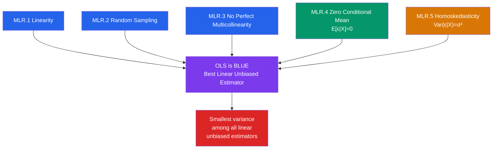

# 🏅 Gauss-Markov Theorem

> [!abstract] TL;DR
> Under five assumptions (MLR.1–MLR.5), OLS is **BLUE** — the **Best Linear Unbiased Estimator**. "Best" means it has the smallest variance among all linear unbiased estimators. When any assumption fails, OLS is still unbiased (if only MLR.1–4 hold) or consistent (with some violations), but it is no longer efficient — GLS or other estimators beat it. The theorem tells you *exactly* what you need to check before trusting OLS standard errors.

## Intuition — analogy FIRST

Imagine ten different surveyors each measuring the height of a building using a tape measure. All of them are unbiased — they do not systematically over- or under-estimate. But some surveyors are more careful than others: their readings cluster tightly around the true height, while sloppy surveyors' readings scatter widely. The Gauss-Markov theorem says: if the error process in your data satisfies five reasonable conditions, OLS is the *most careful surveyor* — it clusters its estimates around the truth more tightly than any other linear unbiased method.

---

## How It Works



## Key Concepts / Details

### The Five Classical Assumptions (MLR.1–MLR.5)

| Assumption | Formal Statement | What It Rules Out | Consequence If Violated |
|-----------|-----------------|-------------------|------------------------|
| **MLR.1** Linearity | $y = X\beta + \varepsilon$ | Nonlinear functional form | Misspecification bias |
| **MLR.2** Random Sampling | $(y_i, x_i)$ i.i.d. from population | Selection bias, clustering | Biased/inconsistent inference |
| **MLR.3** No Perfect Multicollinearity | $\text{rank}(X) = k$ | Exact linear dependence in $X$ | $(X'X)^{-1}$ does not exist — estimation impossible |
| **MLR.4** Zero Conditional Mean | $E[\varepsilon \mid X] = 0$ | Endogeneity, omitted variables, simultaneity | OLS is **biased and inconsistent** |
| **MLR.5** Homoskedasticity | $\text{Var}(\varepsilon \mid X) = \sigma^2 I$ | Heteroskedasticity, autocorrelation | OLS is unbiased but **not efficient**; standard errors are **wrong** |

Adding a sixth assumption:

| **MLR.6** Normality | $\varepsilon \mid X \sim N(0, \sigma^2 I)$ | Non-normal errors | t and F statistics are only approximate in small samples |

MLR.1–5 give the Gauss-Markov result. MLR.6 additionally gives exact finite-sample t and F distributions (the **Classical Linear Model**, CLM).

### Proof Sketch of BLUE

Let $\tilde{\beta} = Cy$ be any other linear unbiased estimator, where $C$ is a $k \times n$ matrix. Unbiasedness requires $CE[y] = \beta$ for all $\beta$, i.e., $CX = I_k$.

Write $C = (X'X)^{-1}X' + D$ where $DX = 0$. Then:
$$\text{Var}(\tilde{\beta}) = \sigma^2 CC' = \sigma^2(X'X)^{-1} + \sigma^2 DD'$$

Since $DD'$ is positive semi-definite, $\text{Var}(\tilde{\beta}) \geq \text{Var}(\hat{\beta}_{OLS})$ in the matrix sense. OLS achieves the minimum. $\square$

### What "Best" Means

"Best" in BLUE means **minimum variance** (equivalently, minimum MSE when unbiased). For a scalar estimator of $c'\beta$:
$$\text{Var}(c'\hat{\beta}_{OLS}) \leq \text{Var}(c'\tilde{\beta})$$

for all $c \in \mathbb{R}^k$ and all linear unbiased $\tilde{\beta}$. This is the Cramér-Rao lower bound within the linear unbiased class.

### The Role of Each Assumption

**MLR.4 is the critical one for unbiasedness.** If $E[\varepsilon \mid X] \neq 0$ (endogeneity), then:
$$E[\hat{\beta}] = \beta + (X'X)^{-1}X'E[\varepsilon] \neq \beta$$

This is the source of [[Omitted_Variable_Bias]], measurement error bias ([[Measurement_Error]]), and simultaneity bias.

**MLR.5 governs efficiency.** If errors are heteroskedastic ($\text{Var}(\varepsilon_i \mid x_i) = \sigma_i^2$), OLS remains unbiased but is no longer BLUE — **WLS is BLUE** instead. Worse, the formula $\hat{\sigma}^2(X'X)^{-1}$ for the variance of $\hat{\beta}$ is wrong: standard errors are biased, invalidating all t and F tests. See [[Heteroskedasticity]].

```r
# Verify BLUE via simulation: compare OLS variance to a competing estimator
library(tidyverse)

set.seed(123)
n_sim <- 5000
n     <- 100

# DGP: y = 1 + 2x + e, e ~ N(0, 1) [homoskedastic]
sim_results <- map_dfr(1:n_sim, function(s) {
  x <- rnorm(n)
  e <- rnorm(n)
  y <- 1 + 2 * x + e

  # OLS
  ols_coef <- coef(lm(y ~ x))[["x"]]

  # A competing estimator: use only the first half of the data
  df_half <- data.frame(y = y[1:50], x = x[1:50])
  half_coef <- coef(lm(y ~ x, data = df_half))[["x"]]

  tibble(ols = ols_coef, half = half_coef)
})

# OLS should have smaller variance
sim_results |>
  summarise(var_ols = var(ols), var_half = var(half))
# var_ols < var_half: BLUE in action
```

### Extensions and Limitations

| Situation | OLS Status | Better Estimator |
|-----------|-----------|-----------------|
| Heteroskedasticity | Unbiased, not efficient | [[GLS_and_WLS]] (WLS) |
| Autocorrelation | Unbiased, not efficient | [[GLS_and_WLS]] (FGLS) |
| Endogeneity | **Biased, inconsistent** | [[Instrumental_Variables]] (IV/2SLS) |
| Non-normal errors, large $n$ | Unbiased; t/F approx by CLT | Asymptotically fine |
| Non-linear relationship | **Biased** (misspecification) | Transformation, [[Probit_and_Logit]] |
| Panel data | Depends on FE/RE structure | [[Fixed_Effects]], [[Random_Effects]] |

---

## Real-World Notes

- The theorem is why econometricians focus so heavily on MLR.4 (exogeneity): violating it destroys unbiasedness entirely, whereas violating MLR.5 (homoskedasticity) merely destroys efficiency and invalidates standard errors but leaves point estimates consistent.
- Robust standard errors (the Huber-White sandwich) rescue inference under heteroskedasticity without improving efficiency. In most applied work today, researchers report heteroskedasticity-robust SEs as a default.
- The Gauss-Markov theorem applies within the **linear** class. The Cramér-Rao lower bound (from MLE theory) applies to all unbiased estimators. For non-normal errors, MLE can beat OLS on efficiency while both are unbiased.

---

## Common Pitfalls

- **Confusing "unbiased" with "consistent"**: OLS can be biased in small samples but consistent (bias → 0 as $n → \infty$), or vice versa.
- **Thinking MLR.4 requires zero unconditional mean**: $E[\varepsilon] = 0$ is weaker than $E[\varepsilon \mid X] = 0$. The conditional version is what OLS needs.
- **Believing robust SEs fix endogeneity**: Sandwich standard errors only fix inference under heteroskedasticity; they do nothing about bias from violated MLR.4.
- **Ignoring MLR.3 in applied work**: Perfect multicollinearity causes R to silently drop variables; near-multicollinearity inflates standard errors without a warning.

---

## Related Concepts

- [[_MOC_Linear_Regression|↑ Section MOC]]
- [[OLS_Estimation]] — The derivation of $\hat{\beta}$
- [[Heteroskedasticity]] — Violation of MLR.5 and the White test
- [[Autocorrelation]] — Another violation of MLR.5 in time-series settings
- [[Omitted_Variable_Bias]] — The consequence of violating MLR.4
- [[GLS_and_WLS]] — The BLUE estimator when MLR.5 fails
- [[Instrumental_Variables]] — Restoring consistency when MLR.4 fails

---

## Review Questions

1. State the five Gauss-Markov assumptions and explain in one sentence what economic situation each one rules out.
2. Prove that any linear unbiased estimator $\tilde{\beta} = Cy$ has variance no smaller than $\sigma^2(X'X)^{-1}$.
3. Suppose you run OLS on a model where errors are heteroskedastic. Which properties of OLS are affected? Which are preserved? What should you do about inference?

---

## Sources

- Wooldridge, J.M., *Introductory Econometrics*, Ch. 3 (Multiple Regression Analysis — Estimation)
- Greene, W.H., *Econometric Analysis*, Ch. 4 — Least Squares Estimation
- Hansen, B., *Econometrics*, Ch. 7 — Gauss-Markov Theorem

#econometrics #statistics #linear-regression #gauss-markov #BLUE
