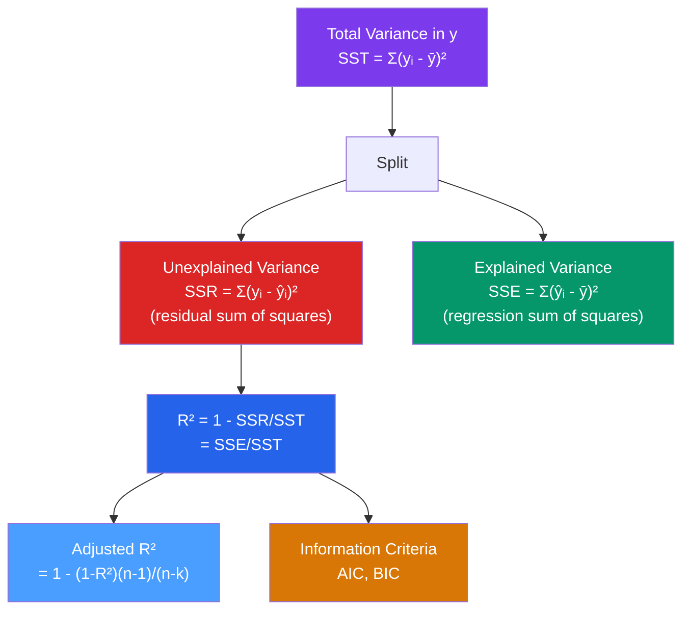

# 📊 Goodness of Fit

> [!abstract] TL;DR
> $R^2 = 1 - \text{SSR}/\text{SST}$ measures the fraction of variance in $y$ explained by the model; it always rises when you add regressors. Adjusted $R^2$ penalizes for additional parameters ($\bar{R}^2 = 1 - [(n-1)/(n-k)](1-R^2)$) and can fall when you add uninformative regressors. For model selection across non-nested models or different sample sizes, use AIC or BIC — which penalize the log-likelihood by the number of parameters. None of these measures assess causality or model correctness.

## Intuition — analogy FIRST

Suppose you want to predict tomorrow's temperature. A constant model (always predict the annual average) explains nothing — 0% of the variation. A model using yesterday's temperature, the season, and weather patterns might explain 85% of the day-to-day variation. $R^2$ is simply: "what fraction of the natural variation in temperatures does my model account for?"

But $R^2$ has a fatal flaw: adding any variable, even a random noise column, will never decrease it. A model with 50 meaningless variables can have $R^2 = 0.99$. Adjusted $R^2$ and information criteria punish you for complexity, so the model must genuinely earn its complexity.

---

## How It Works



## Key Concepts / Details

### The SST/SSE/SSR Decomposition

Under OLS with a constant:
$$\underbrace{\sum_{i=1}^n (y_i - \bar{y})^2}_{\text{SST}} = \underbrace{\sum_{i=1}^n (\hat{y}_i - \bar{y})^2}_{\text{SSE (explained)}} + \underbrace{\sum_{i=1}^n \hat{\varepsilon}_i^2}_{\text{SSR (unexplained)}}$$

This decomposition holds exactly because $\hat{\varepsilon} \perp \hat{y}$ under OLS (a consequence of the normal equations).

> [!warning] Notation Alert
> Some texts use SSE for "Sum of Squared Errors" (residuals) and SSR for "Sum of Squares Regression" (explained). Wooldridge uses SSR for residuals and SSE for explained. Always check the convention being used.

### $R^2$

$$R^2 = 1 - \frac{\text{SSR}}{\text{SST}} = \frac{\text{SSE}}{\text{SST}}$$

- Always $\in [0, 1]$ when a constant is included
- Equals the squared correlation between $y_i$ and $\hat{y}_i$: $R^2 = [r(y, \hat{y})]^2$
- **Never decreases** when you add regressors: $R^2$ with $k+1$ regressors $\geq$ $R^2$ with $k$ regressors
- Has no role in establishing causality — a regression of wage on zip code has high $R^2$ but is not causal

### Adjusted $R^2$

$$\bar{R}^2 = 1 - \frac{(n-1)}{(n-k)} \cdot \frac{\text{SSR}}{\text{SST}} = 1 - \frac{n-1}{n-k}(1 - R^2)$$

- Penalizes for the number of regressors $k$
- Can **decrease** when you add a regressor that does not improve fit enough
- Useful for comparing models with different numbers of regressors on the same outcome and same sample
- Still cannot be used to compare models with different $y$ transformations (e.g., levels vs. logs)

### Information Criteria

For comparing non-nested models, models on different samples, or across transformations:

$$\text{AIC} = -2\ell(\hat{\theta}) + 2k$$
$$\text{BIC} = -2\ell(\hat{\theta}) + k \ln(n)$$

where $\ell(\hat{\theta})$ is the maximized log-likelihood and $k$ is the number of parameters.

For a linear regression with $k$ parameters (including the constant):
$$\text{AIC} = n \ln(\text{SSR}/n) + 2k$$
$$\text{BIC} = n \ln(\text{SSR}/n) + k \ln(n)$$

| Criterion | Penalty | Tendency | Best used for |
|-----------|---------|----------|---------------|
| AIC | $2k$ | Prefers larger models | Prediction |
| BIC | $k \ln n$ | Prefers smaller models (for $n > 7$) | Model identification |

Lower values are better for both. BIC is consistent (selects the true model as $n \to \infty$); AIC is efficient (minimizes prediction error).

```r
library(tidyverse)

# Fit competing models
m1 <- lm(log(wage) ~ educ, data = wage_data)
m2 <- lm(log(wage) ~ educ + exper + I(exper^2), data = wage_data)
m3 <- lm(log(wage) ~ educ + exper + I(exper^2) + female + tenure, data = wage_data)

# R² and adjusted R² from summary
lapply(list(m1, m2, m3), function(m) {
  s <- summary(m)
  c(R2 = s$r.squared, adj_R2 = s$adj.r.squared)
})

# AIC and BIC
AIC(m1, m2, m3)
BIC(m1, m2, m3)

# Manual SST/SSE/SSR
SST <- sum((wage_data$log_wage - mean(wage_data$log_wage))^2)
SSR <- sum(residuals(m2)^2)
SSE <- SST - SSR
cat("R² =", SSE/SST, "\n")
cat("Adjusted R² =", 1 - (SSR/(nrow(wage_data) - length(coef(m2)))) / (SST/(nrow(wage_data) - 1)), "\n")
```

### When $R^2$ Is Misleading

| Situation | Problem |
|-----------|---------|
| Comparing $y$ vs $\log(y)$ models | $R^2$ scales of $y$ and $\log(y)$ are incomparable |
| Adding any regressor | $R^2$ always rises (use $\bar{R}^2$ or BIC) |
| Cross-section vs time-series | Time series $R^2$ is typically much higher (trending variables) |
| High $R^2$ ≠ good model | A regression of GDP on a trending time index has $R^2 \approx 0.99$ but is nonsense |
| Low $R^2$ ≠ bad model | Micro data often has $R^2 \sim 0.1{-}0.3$ but causal estimates are valid and important |

---

## Real-World Notes

- **In microeconometrics, low $R^2$ is normal and acceptable.** A wage regression explaining 30% of wage variation is common and useful — wages depend on countless unobserved factors (personality, luck, local demand). What matters is whether $\hat{\beta}_{educ}$ is causally identified, not whether the model explains all variation.
- **In financial forecasting**, even small improvements in $R^2$ can be economically significant if exploited in trading strategies. A model with $R^2 = 0.02$ for monthly stock returns can still be profitable.
- **Regression to the mean**: Galton's original regression had $R^2 \approx 0.33$ for heights of parents and children. The name "regression" comes from this work.

---

## Common Pitfalls

- **Using $R^2$ as the sole model selection criterion**: it always rises with more regressors. Use adjusted $R^2$ or BIC for nested models.
- **Comparing $R^2$ across different $y$ transformations**: this is mathematically invalid.
- **Treating high $R^2$ as evidence of causality**: a spurious regression of two trending time series can have $R^2 \to 1$ as $n \to \infty$. See [[Cointegration]].
- **Forgetting that BIC and AIC require the same sample**: if models are fit on different subsets, AIC/BIC comparison is invalid.

---

## Related Concepts

- [[_MOC_Linear_Regression|↑ Section MOC]]
- [[OLS_Estimation]] — The SST/SSR/SSE decomposition arises from OLS orthogonality
- [[Hypothesis_Testing_Regression]] — The overall F-test is a function of $R^2$
- [[Regression_Diagnostics]] — Beyond $R^2$: checking model assumptions
- [[Omitted_Variable_Bias]] — Why a low-$R^2$ model with good identification beats a high-$R^2$ model with bias
- [[Cointegration]] — Where spuriously high $R^2$ arises from non-stationary series

---

## Review Questions

1. Prove that adding any regressor to a linear model cannot decrease $R^2$. Why does this make $R^2$ an unreliable model selection criterion?
2. A researcher compares two models: Model A with $R^2 = 0.45$ (3 regressors) and Model B with $R^2 = 0.47$ (8 regressors). Which should they prefer, and why? Calculate adjusted $R^2$ for each if $n = 100$.
3. Explain why you cannot compare $R^2$ values from a model with $y$ as the outcome versus a model with $\ln(y)$ as the outcome. How would you compare these models?

---

## Sources

- Wooldridge, J.M., *Introductory Econometrics*, Ch. 3 (Multiple Regression — Estimation)
- Greene, W.H., *Econometric Analysis*, Ch. 3.5 — Fit of the Regression
- Akaike, H. (1974), "A New Look at the Statistical Model Identification," *IEEE Transactions on Automatic Control*

#econometrics #statistics #linear-regression #R-squared #AIC #BIC
