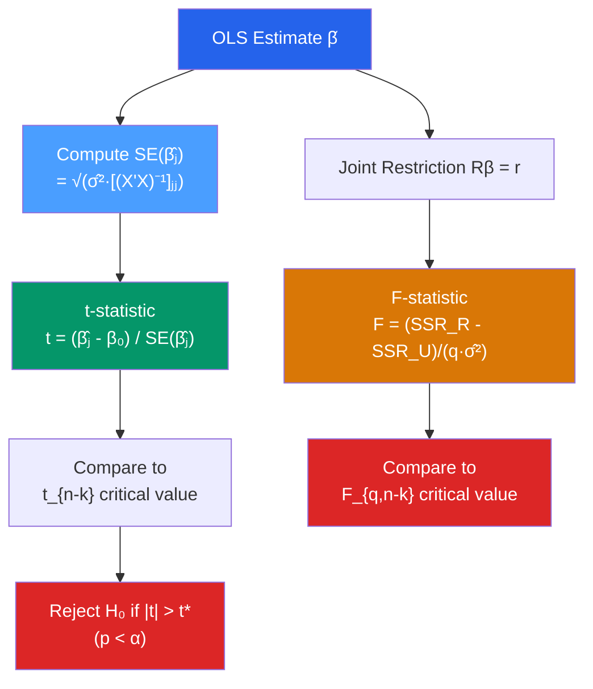

# 🧪 Hypothesis Testing in Regression

> [!abstract] TL;DR
> Regression coefficients are random variables; testing whether they equal specific values uses t-statistics for single restrictions ($t = \hat{\beta}_j / \text{SE}(\hat{\beta}_j)$) and F-statistics for joint restrictions ($F = (R\hat{\beta} - r)'[R(X'X)^{-1}R']^{-1}(R\hat{\beta} - r) / (q\hat{\sigma}^2)$). Under the CLM assumptions, t-stats are exactly $t_{n-k}$ distributed and F-stats are exactly $F_{q,n-k}$. In large samples, these hold asymptotically even without normality. Always report heteroskedasticity-robust standard errors in practice.

## Intuition — analogy FIRST

Imagine you estimate that studying one extra hour raises exam scores by 5 points. But you collected data on only 50 students, so your estimate is noisy. The question is: could this observed 5-point effect have arisen by pure chance even if studying had zero effect? The t-test formalizes this: it divides your estimate by the typical "wobble" in that estimate (the standard error), giving a signal-to-noise ratio. If that ratio is big enough (conventionally > 1.96), the signal is unlikely to be noise alone.

The F-test asks the same question for a group of coefficients simultaneously — "are *all* these effects jointly zero?"

---

## How It Works



## Key Concepts / Details

### The t-Test for a Single Coefficient

**Null hypothesis**: $H_0: \beta_j = \beta_j^0$ (usually $\beta_j^0 = 0$)  
**Alternative**: $H_1: \beta_j \neq \beta_j^0$ (two-sided) or $H_1: \beta_j > \beta_j^0$ (one-sided)

Test statistic:
$$t = \frac{\hat{\beta}_j - \beta_j^0}{\text{SE}(\hat{\beta}_j)}$$

where $\text{SE}(\hat{\beta}_j) = \sqrt{\hat{\sigma}^2 [(X'X)^{-1}]_{jj}}$.

Under $H_0$ and the CLM assumptions (MLR.1–6): $t \sim t_{n-k}$.  
Asymptotically (MLR.1–5 only): $t \xrightarrow{d} N(0,1)$.

**Critical values**: at 5% significance level, two-sided: $|t| > 1.96$ (large $n$) or $t_{n-k,0.025}$.

### Confidence Intervals

A $100(1-\alpha)\%$ confidence interval for $\beta_j$:
$$\hat{\beta}_j \pm t_{n-k,\alpha/2} \cdot \text{SE}(\hat{\beta}_j)$$

A CI that excludes zero is exactly equivalent to rejecting $H_0: \beta_j = 0$ at significance level $\alpha$.

### The F-Test for Joint Hypotheses

To test $q$ linear restrictions $R\beta = r$ (where $R$ is $q \times k$):

**Restricted model**: impose $R\beta = r$ and re-estimate.

**F-statistic** (equivalent forms):
$$F = \frac{(\text{SSR}_R - \text{SSR}_U)/q}{\text{SSR}_U/(n-k)} = \frac{(R\hat{\beta} - r)'[R(X'X)^{-1}R']^{-1}(R\hat{\beta} - r)}{q\hat{\sigma}^2}$$

Under $H_0$ and CLM: $F \sim F_{q, n-k}$.

**Special case**: the overall F-test ($H_0: \beta_1 = \beta_2 = \ldots = \beta_{k-1} = 0$, excluding the intercept):
$$F = \frac{R^2/({k-1})}{(1-R^2)/(n-k)}$$

This tests whether the model as a whole explains anything beyond a constant.

### Robust Standard Errors

Under heteroskedasticity, the classical variance formula $\hat{\sigma}^2(X'X)^{-1}$ is biased. The **Huber-White sandwich estimator** (HC1) is:
$$\widehat{\text{Var}}_{HC1}(\hat{\beta}) = (X'X)^{-1}\left(\sum_{i=1}^n \hat{\varepsilon}_i^2 x_i x_i'\right)(X'X)^{-1}$$

This gives valid standard errors under heteroskedasticity without assuming a specific form. In practice, always use robust SEs unless you have strong reason to believe homoskedasticity.

### The Wald Test (General Form)

For nonlinear restrictions $h(\beta) = 0$, the Wald statistic is:
$$W = h(\hat{\beta})' \left[\frac{\partial h}{\partial \beta'}\hat{V}\frac{\partial h}{\partial \beta}\right]^{-1} h(\hat{\beta}) \xrightarrow{d} \chi^2_q$$

The F-test is a special case with $W/q \sim F_{q,n-k}$ in finite samples.

```r
library(lmtest)
library(sandwich)
library(car)

# Fit model
model <- lm(log(wage) ~ educ + exper + I(exper^2) + female, data = wage_data)

# Classical summary (non-robust)
summary(model)

# Heteroskedasticity-robust standard errors (HC1)
coeftest(model, vcov = vcovHC(model, type = "HC1"))

# Joint F-test: are educ and exper jointly significant?
linearHypothesis(model, c("educ = 0", "exper = 0"),
                 vcov = vcovHC(model, type = "HC1"))

# Test a linear restriction: return to exper at 10 years
# H0: β_exper + 20*β_exper2 = 0
linearHypothesis(model, "exper + 20*I(exper^2) = 0")

# Confidence intervals
confint(model)

# Robust CIs manually
ci_robust <- coeftest(model, vcov = vcovHC(model, "HC1"))
cbind(
  ci_robust[, 1] - 1.96 * ci_robust[, 2],
  ci_robust[, 1] + 1.96 * ci_robust[, 2]
)
```

### p-values and Their Interpretation

The p-value is the probability of observing a test statistic at least as extreme as the one computed, *assuming $H_0$ is true*. It is **not** the probability that $H_0$ is true.

| p-value | Conventional interpretation |
|---------|----------------------------|
| $< 0.01$ | Highly statistically significant |
| $0.01 - 0.05$ | Statistically significant at 5% |
| $0.05 - 0.10$ | Marginally significant (10%) |
| $> 0.10$ | Fail to reject $H_0$ |

**Statistical significance $\neq$ economic significance.** With large $n$, tiny effects become significant. Always report effect sizes and confidence intervals alongside p-values.

---

## Real-World Notes

- **Card and Krueger (1994)**: In their minimum wage study (see [[Difference_in_Differences]]), the key test was whether the coefficient on the New Jersey treatment indicator was significantly different from zero. Using standard errors clustered at the state level dramatically changes inference.
- **The replication crisis**: Many published regressions were reported with small p-values that did not replicate because researchers implicitly tested many specifications (p-hacking). Pre-registration and reporting all specifications mitigate this.
- **Cluster-robust SEs**: When observations are grouped (students in schools, workers in firms), errors within groups are correlated. Cluster-robust SEs — a generalization of HC SEs — are necessary. Use `vcovCL(model, cluster = ~group_id)` in R.

---

## Common Pitfalls

- **Using non-robust SEs with heteroskedastic data**: OLS point estimates remain consistent but all reported t-stats and p-values are wrong. Default to robust SEs.
- **Multiple testing without correction**: Running 20 tests and finding 1 significant at 5% is exactly what you'd expect by chance. Use Bonferroni correction or false discovery rate methods.
- **Forgetting degrees of freedom**: The t-distribution with 10 df has much fatter tails than with 1000 df. With small samples, the 1.96 cutoff is too liberal.
- **Testing one-sided when the theory is ambiguous**: One-sided tests have more power but are only valid if theory firmly predicts the direction before seeing the data.

---

## Related Concepts

- [[_MOC_Linear_Regression|↑ Section MOC]]
- [[OLS_Estimation]] — The estimator being tested
- [[Gauss_Markov_Theorem]] — Assumptions underlying the test distributions
- [[Goodness_of_Fit]] — The overall F-test is closely linked to $R^2$
- [[Heteroskedasticity]] — Violation that invalidates classical SEs
- [[Autocorrelation]] — Time-series violation requiring Newey-West SEs

---

## Review Questions

1. Explain why a 95% confidence interval for $\beta_j$ that excludes zero is equivalent to rejecting $H_0: \beta_j = 0$ at the 5% significance level.
2. You have a model with 5 regressors and 100 observations. You want to test whether the effects of `educ` and `exper` are jointly zero. Set up the F-test: what is $R$, $r$, and the degrees of freedom of the F-distribution?
3. A dataset has 10,000 observations. You find $\hat{\beta}_j = 0.003$ with $p = 0.001$. Is this economically significant? How would you communicate this finding?

---

## Sources

- Wooldridge, J.M., *Introductory Econometrics*, Ch. 4–5 (Inference in MLR)
- Greene, W.H., *Econometric Analysis*, Ch. 5 — Hypothesis Tests and Model Selection
- White, H. (1980), "A Heteroskedasticity-Consistent Covariance Matrix Estimator," *Econometrica*

#econometrics #statistics #linear-regression #hypothesis-testing #t-test #F-test
