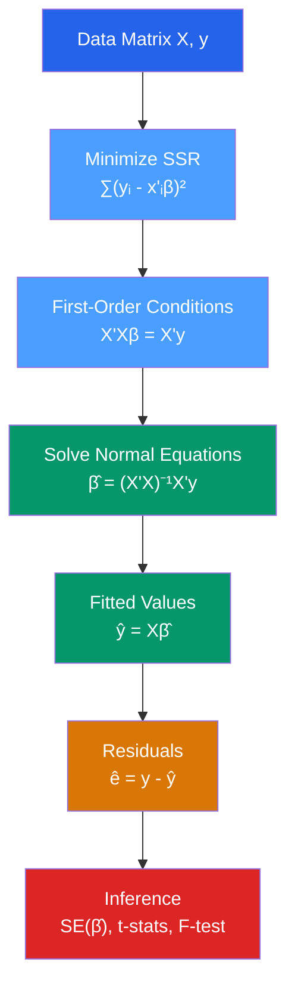

# 📐 OLS Estimation

> [!abstract] TL;DR
> Ordinary Least Squares (OLS) finds the coefficient vector $\hat{\beta} = (X'X)^{-1}X'y$ that minimizes the sum of squared residuals. Geometrically, it projects the outcome vector $y$ onto the column space of $X$. Under the Gauss-Markov assumptions, this estimator is unbiased, consistent, and — by the GM theorem — the most efficient among all linear unbiased estimators.

## Intuition — analogy FIRST

Imagine you have a scatter of points on a graph and you want to draw the single straight line that is "closest" to all of them simultaneously. You cannot make every point sit exactly on the line, so you settle for minimizing the total squared vertical distance from each point to the line. Squaring the distances matters: it penalizes big misses far more than small ones, and it eliminates the problem of positive and negative errors cancelling out.

That is all OLS is — a ruler that finds the line (or hyperplane in multiple dimensions) that minimizes the sum of squared vertical distances to your data cloud.

---

## How It Works



## Key Concepts / Details

### The OLS Problem

The linear regression model is:
$$y = X\beta + \varepsilon$$

where $y$ is an $n \times 1$ vector of outcomes, $X$ is an $n \times k$ matrix of regressors (including a constant column of ones), $\beta$ is a $k \times 1$ vector of coefficients, and $\varepsilon$ is an $n \times 1$ vector of errors.

OLS chooses $\hat{\beta}$ to minimize the sum of squared residuals:
$$\text{SSR}(\beta) = (y - X\beta)'(y - X\beta) = \sum_{i=1}^n (y_i - x_i'\beta)^2$$

### Deriving the Normal Equations

Take the derivative of SSR with respect to $\beta$ and set it to zero:
$$\frac{\partial \text{SSR}}{\partial \beta} = -2X'(y - X\beta) = 0$$

This gives the **normal equations**:
$$X'X\hat{\beta} = X'y$$

Provided $X'X$ is invertible (i.e., no perfect multicollinearity), the unique solution is:
$$\boxed{\hat{\beta} = (X'X)^{-1}X'y}$$

### Geometric Interpretation

OLS is a **projection**. The fitted values $\hat{y} = X\hat{\beta} = X(X'X)^{-1}X'y = Py$ lie in the column space of $X$. The matrix $P = X(X'X)^{-1}X'$ is the **hat matrix** (projection matrix). The residuals $\hat{\varepsilon} = (I - P)y = My$ are orthogonal to every column of $X$:
$$X'\hat{\varepsilon} = 0$$

This orthogonality condition is exactly what the normal equations say. The projection $\hat{y}$ is the point in $\text{col}(X)$ closest to $y$ in Euclidean distance.

### Properties of the Hat Matrix

| Property | Formula | Implication |
|----------|---------|-------------|
| Symmetric | $P = P'$ | Real matrix |
| Idempotent | $P^2 = P$ | Projecting twice = projecting once |
| Rank | $\text{rank}(P) = k$ | $k$ regressors span $k$ dimensions |
| Residual maker | $M = I - P$, $M^2 = M$ | Residuals are in the orthogonal complement |

### Partitioned Regression (Frisch-Waugh-Lovell)

When $X = [X_1, X_2]$, the OLS estimate of $\beta_2$ equals the coefficient from regressing $M_1 y$ on $M_1 X_2$, where $M_1 = I - X_1(X_1'X_1)^{-1}X_1'$ residualizes out $X_1$.

**Implication**: any regression coefficient has a "controlled comparison" interpretation — it measures the relationship between $y$ and $x_j$ after partialling out all other regressors.

### Finite-Sample Properties

Under MLR.1–4 (linearity, random sampling, no perfect collinearity, zero conditional mean):
- **Unbiasedness**: $E[\hat{\beta}] = \beta$
- **Variance**: $\text{Var}(\hat{\beta}) = \sigma^2(X'X)^{-1}$ (requires MLR.5: homoskedasticity)
- **Estimated variance**: $\widehat{\text{Var}}(\hat{\beta}) = \hat{\sigma}^2(X'X)^{-1}$ where $\hat{\sigma}^2 = \frac{\hat{\varepsilon}'\hat{\varepsilon}}{n-k}$

```r
# OLS in R
library(tidyverse)
library(broom)

# Simulate data
set.seed(42)
n <- 200
df <- tibble(
  x1 = rnorm(n),
  x2 = rnorm(n),
  y  = 2 + 1.5 * x1 - 0.8 * x2 + rnorm(n)
)

# Fit OLS
model <- lm(y ~ x1 + x2, data = df)
summary(model)

# Inspect coefficients, SEs, t-stats
tidy(model)

# Hat matrix diagonal (leverage values)
h <- hatvalues(model)

# Manual OLS via matrix algebra
X <- model.matrix(model)
y <- df$y
beta_hat <- solve(t(X) %*% X) %*% t(X) %*% y
print(beta_hat)
```

### Assumptions Required for Unbiasedness

| Assumption | Statement | If violated |
|-----------|-----------|-------------|
| MLR.1 | Model is linear in parameters | Bias from functional form misspecification |
| MLR.2 | Random sample from population | Selection bias, survivorship bias |
| MLR.3 | No perfect multicollinearity | $(X'X)^{-1}$ does not exist — estimation fails |
| MLR.4 | $E[\varepsilon \mid X] = 0$ | OLS is biased (endogeneity) |

---

## Real-World Notes

- **Returns to schooling** (Mincer equation): $\log(\text{wage}_i) = \beta_0 + \beta_1 \text{educ}_i + \beta_2 \text{exper}_i + \varepsilon_i$. OLS of this model is the starting point for every human capital study, though MLR.4 is likely violated because education is endogenous (ability bias) — motivating IV in [[Instrumental_Variables]].
- **OLS is a moment estimator**: The normal equations $X'\hat{\varepsilon} = 0$ are sample analogues of the population moment conditions $E[x_i \varepsilon_i] = 0$.
- **The Gauss-Markov theorem says OLS is efficient** among linear unbiased estimators, but not among all estimators. If errors are non-normal, MLE may dominate; if they are non-constant, GLS dominates. See [[GLS_and_WLS]].

---

## Common Pitfalls

- **Forgetting the intercept**: Dropping the constant forces the regression line through the origin, almost always wrong in economic applications.
- **Interpreting coefficients causally without justification**: OLS gives ceteris paribus correlations, not causal effects, unless MLR.4 holds by design or argument.
- **Using $R^2$ to choose between models with different left-hand-side variables**: $R^2$ is not comparable across transformations of $y$ (e.g., levels vs logs).
- **Ignoring the rank condition**: Always check `alias(model)` or condition number of $X'X$ before trusting standard errors.

---

## Related Concepts

- [[_MOC_Linear_Regression|↑ Section MOC]]
- [[Gauss_Markov_Theorem]] — Conditions under which OLS is BLUE
- [[Hypothesis_Testing_Regression]] — How to do inference on $\hat{\beta}$
- [[Goodness_of_Fit]] — Measuring how well the OLS line fits
- [[Regression_Diagnostics]] — Detecting violations of OLS assumptions
- [[GLS_and_WLS]] — When OLS is not efficient and a weighted estimator dominates
- [[Omitted_Variable_Bias]] — The consequence of violating MLR.4

---

## Review Questions

1. Derive the OLS estimator $\hat{\beta} = (X'X)^{-1}X'y$ from first principles. What mathematical condition on $X$ is required for this formula to exist?
2. Explain the geometric interpretation of OLS as a projection. What does it mean that residuals are orthogonal to the column space of $X$?
3. State the four assumptions required for OLS to be unbiased. Which one is most commonly violated in observational economic data, and why?

---

## Sources

- Wooldridge, J.M., *Introductory Econometrics: A Modern Approach*, Ch. 2–3
- Greene, W.H., *Econometric Analysis*, Ch. 3 — The Classical Multiple Linear Regression Model
- Stock, J.H. & Watson, M.W., *Introduction to Econometrics*, Ch. 4–6

#econometrics #statistics #linear-regression #OLS
