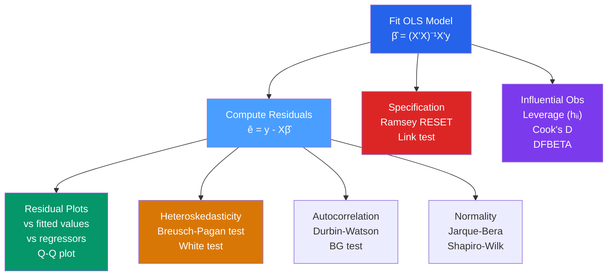

# 🔬 Regression Diagnostics

> [!abstract] TL;DR
> After fitting an OLS model, diagnostics check whether the Gauss-Markov assumptions are satisfied. Residual plots reveal heteroskedasticity, outliers, and nonlinearity. The Ramsey RESET test detects functional form misspecification. Leverage (hat values) and Cook's distance identify influential observations that disproportionately drive the estimates. Running these checks before reporting results is essential — a "significant" coefficient in a misspecified model may be entirely spurious.

## Intuition — analogy FIRST

A structural engineer does not just build a bridge and declare it safe. They run stress tests: apply load, look for cracks, measure deflection. OLS diagnostics are the econometrician's stress tests. You build the model, then systematically probe: Are the residuals random white noise, or do they show patterns that reveal something your model is missing? Are a handful of extreme data points driving your headline result? Diagnostics do not fix problems — they *locate* them so you can apply the right remedy.

---

## How It Works



## Key Concepts / Details

### Residual Plots

The most important diagnostics are visual. For a well-specified model under CLM assumptions, residuals should look like random noise.

| Plot | What It Shows | Red Flags |
|------|--------------|-----------|
| $\hat{\varepsilon}$ vs $\hat{y}$ | Heteroskedasticity, nonlinearity | Fan shape (hetero), U-shape (nonlinearity) |
| $\hat{\varepsilon}$ vs $x_j$ | Omitted nonlinear terms, hetero in $x_j$ | Systematic pattern |
| $\sqrt{|\hat{\varepsilon}|}$ vs $\hat{y}$ (Scale-Location) | Heteroskedasticity | Rising trend |
| Normal Q-Q plot | Normality of residuals | Heavy tails, S-shape |
| $\hat{\varepsilon}$ vs time (or index) | Autocorrelation | Smooth runs, oscillations |

### The Ramsey RESET Test

Tests for omitted nonlinear functional forms (powers of fitted values).

**Auxiliary regression**: $y = X\beta + \delta_2 \hat{y}^2 + \delta_3 \hat{y}^3 + u$

**$H_0$**: $\delta_2 = \delta_3 = 0$ (no nonlinearity)

F-statistic on the joint significance of added powers. Rejection suggests the functional form is misspecified — perhaps you need quadratic terms, interaction terms, or a log transformation.

### Leverage and Influential Observations

**Leverage** (hat value): $h_{ii} = [X(X'X)^{-1}X']_{ii}$

- Measures how far $x_i$ is from the center of the $X$ data
- High leverage: $h_{ii} > 2k/n$ (rule of thumb)
- A point can have high leverage without being influential (if it falls on the regression line)

**Cook's Distance**: combines leverage and residual size to measure influence on all $\hat{\beta}$:
$$D_i = \frac{(\hat{\beta}_{(-i)} - \hat{\beta})'(X'X)(\hat{\beta}_{(-i)} - \hat{\beta})}{k\hat{\sigma}^2} = \frac{h_{ii}}{1-h_{ii}} \cdot \frac{\hat{\varepsilon}_i^2}{k\hat{\sigma}^2}$$

Rule of thumb: $D_i > 4/n$ or $D_i > 1$ warrants investigation.

**DFBETA**: change in each coefficient when observation $i$ is removed:
$$\text{DFBETA}_{ij} = \hat{\beta}_j - \hat{\beta}_{j(-i)}$$

Large DFBETA means that observation is driving the estimate of $\beta_j$.

### Normality Tests

For large samples, normality of $\varepsilon$ is not required (CLT ensures asymptotic normality of $\hat{\beta}$). For small samples, test with:

- **Jarque-Bera test**: $JB = n[S^2/6 + (K-3)^2/24] \sim \chi^2_2$ under normality (where $S$ = skewness, $K$ = kurtosis)
- **Shapiro-Wilk test**: more powerful for small samples

Non-normality in small samples invalidates exact t and F tests. Remedies: transform $y$, use bootstrap inference, or use a different model.

```r
library(lmtest)
library(car)
library(ggplot2)

# Fit model
model <- lm(log(wage) ~ educ + exper + I(exper^2) + female, data = wage_data)

# 1. Residual diagnostic plots (base R)
par(mfrow = c(2, 2))
plot(model)   # fitted vs resid, Q-Q, scale-location, leverage

# 2. Ramsey RESET test
resettest(model, power = 2:3, type = "fitted")

# 3. Breusch-Pagan test for heteroskedasticity
bptest(model)

# 4. Durbin-Watson test for autocorrelation (time series data)
dwtest(model)

# 5. Jarque-Bera normality test
jarque.bera.test(residuals(model))  # from tseries package

# 6. Leverage and Cook's distance
h    <- hatvalues(model)
cook <- cooks.distance(model)
n    <- nobs(model)
k    <- length(coef(model))

# Flag high-leverage observations
high_lev <- which(h > 2*k/n)
high_inf  <- which(cook > 4/n)

# ggplot diagnostics
df_diag <- data.frame(
  fitted  = fitted(model),
  resid   = residuals(model),
  lev     = h,
  cook    = cook
)

ggplot(df_diag, aes(x = fitted, y = resid)) +
  geom_point(alpha = 0.4) +
  geom_hline(yintercept = 0, linetype = "dashed") +
  geom_smooth(se = FALSE, color = "red") +
  labs(title = "Residuals vs Fitted", x = "Fitted Values", y = "Residuals")
```

### Added-Variable Plots (Partial Regression Plots)

Visualize the partial effect of $x_j$ on $y$ after controlling for all other regressors:

1. Regress $y$ on all $x$ except $x_j$; get residuals $\hat{e}_y$
2. Regress $x_j$ on all other $x$; get residuals $\hat{e}_{x_j}$
3. Plot $\hat{e}_y$ vs $\hat{e}_{x_j}$ — the slope of this plot equals $\hat{\beta}_j$

Added-variable plots also reveal outliers in the $x_j$ direction that drive the coefficient.

```r
# Added-variable plots
avPlots(model)
```

---

## Real-World Notes

- **Wage regression diagnostics**: Wage data typically shows right skewness (a few very high earners), which is why log wages are used. Even with logs, the residual plot often shows mild heteroskedasticity (larger residuals for higher earners), motivating robust SEs.
- **Outliers in micro data**: Survey data often has coding errors (wages of $0, extreme ages). A single data-entry error can dominate OLS. Cook's distance routinely flags these.
- **The leverage-influence distinction matters for policy**: An observation can be high-leverage (unusual $x$ values, e.g., a very large firm) without being influential if the unusual observation happens to fit the model well. Removing it changes uncertainty but not much the point estimate.

---

## Common Pitfalls

- **Running RESET without visual inspection first**: RESET is a portmanteau test; it may miss specific nonlinearities visible in a residual plot.
- **Deleting all influential observations without investigation**: An "influential" observation may be correct data that your model cannot fit — that is informative about model misspecification.
- **Over-relying on normality tests in large samples**: With $n = 10000$, even trivial non-normality is detectable. The central limit theorem means this rarely affects inference in practice.
- **Interpreting diagnostic test non-rejection as model validation**: Failing to reject $H_0$ in a specification test does not prove the model is correct — only that this test did not detect a problem.

---

## Related Concepts

- [[_MOC_Linear_Regression|↑ Section MOC]]
- [[Gauss_Markov_Theorem]] — The assumptions diagnostics are checking
- [[Heteroskedasticity]] — The most common assumption violation in cross-section data
- [[Autocorrelation]] — The most common violation in time-series data
- [[Omitted_Variable_Bias]] — What a failed RESET test often signals
- [[Measurement_Error]] — Can create systematic residual patterns

---

## Review Questions

1. You fit a wage regression and plot residuals vs fitted values. You see a fan shape: residuals spread out for higher fitted values. What assumption is likely violated? What should you do?
2. Observation #47 has Cook's distance of 2.3 (with $n = 200$ and $k = 4$). Is this concerning? What would you do to investigate?
3. The Ramsey RESET test rejects at the 1% level. What does this tell you, and what are three possible remedies?

---

## Sources

- Wooldridge, J.M., *Introductory Econometrics*, Ch. 9 — More on Specification and Data Issues
- Greene, W.H., *Econometric Analysis*, Ch. 4.9 — Regression Diagnostics
- Ramsey, J.B. (1969), "Tests for Specification Errors in Classical Linear Least Squares Regression Analysis," *Journal of the Royal Statistical Society*

#econometrics #statistics #linear-regression #diagnostics #RESET #influential-observations
