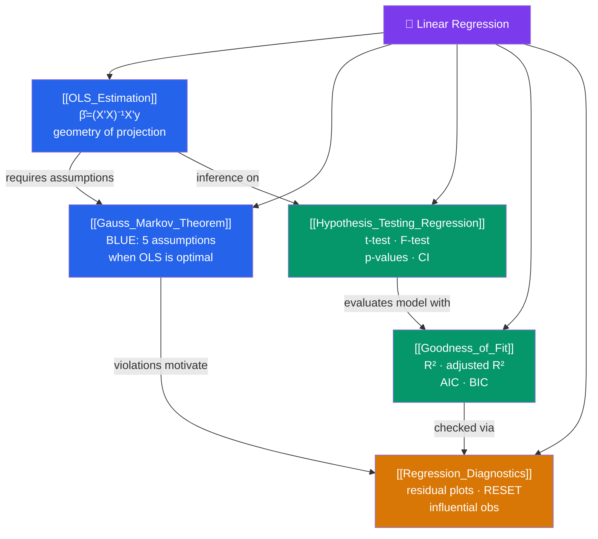

# 🗺️ Linear Regression — Map of Content

> [!abstract] What This Section Covers
> This section is the bedrock of all econometrics. It answers: how do we estimate the line that best fits the data ([[OLS_Estimation]]), when is that estimate the best possible unbiased estimator ([[Gauss_Markov_Theorem]]), how do we test whether our estimates are real or noise ([[Hypothesis_Testing_Regression]]), how much of the variation do we explain ([[Goodness_of_Fit]]), and how do we detect when our model is misspecified or its assumptions are violated ([[Regression_Diagnostics]]). Everything else in this vault — panel data, IV, DiD, time series — builds on this foundation.

## Concept Map

## Learning Path

1. [[OLS_Estimation]] — The algebra of fitting a line: the normal equations, $\hat{\beta} = (X'X)^{-1}X'y$, and the geometric projection interpretation.
2. [[Gauss_Markov_Theorem]] — The five classical assumptions (MLR.1–MLR.5) and why, when they hold, OLS is BLUE (Best Linear Unbiased Estimator).
3. [[Hypothesis_Testing_Regression]] — t-statistics for individual coefficients, F-statistics for joint restrictions, and the logic of confidence intervals.
4. [[Goodness_of_Fit]] — $R^2$, adjusted $R^2$, the SST/SSR/SSE decomposition, and information criteria (AIC/BIC) for model selection.
5. [[Regression_Diagnostics]] — Residual plots, the Ramsey RESET test, leverage and Cook's distance, and spotting misspecification before it corrupts inference.

## All Notes at a Glance

| Note | Difficulty | What You'll Learn |
|------|------------|-------------------|
| [[OLS_Estimation]] | Beginner | Normal equations, matrix OLS formula, projection geometry, partitioned regression |
| [[Gauss_Markov_Theorem]] | Beginner | MLR.1–5, BLUE proof sketch, what breaks when each assumption fails |
| [[Hypothesis_Testing_Regression]] | Intermediate | t-test, F-test, Wald test, joint hypotheses, heteroskedasticity-robust SEs |
| [[Goodness_of_Fit]] | Beginner | R², adjusted R², SST/SSR/SSE, AIC, BIC, model comparison |
| [[Regression_Diagnostics]] | Intermediate | Ramsey RESET, residual plots, leverage, Cook's D, added-variable plots |

## Key Questions This Section Answers

- What does OLS actually minimize, and how is $\hat{\beta}$ derived algebraically?
- Why is OLS called a "projection" and what does that mean geometrically?
- What are the five Gauss-Markov assumptions, and what happens when each is violated?
- How do you test whether a slope coefficient is statistically different from zero?
- How do you test whether a *set* of coefficients are jointly significant?
- What is the difference between $R^2$ and adjusted $R^2$, and why does adding variables always increase $R^2$?
- How do you detect model misspecification without knowing the true model?

## Related Sections

- [[_MOC_Econometrics_Master|↑ Econometrics Master MOC]]
- [[_MOC_OLS_Problems|→ OLS Problems]] — What happens when the Gauss-Markov assumptions fail
- [[_MOC_Advanced_Regression|→ Advanced Regression]] — GLS, MLE, and limited dependent variables
- [[_MOC_Causal_Inference|→ Causal Inference]] — How OLS identification can be undermined by endogeneity

#MOC #Econometrics #linear-regression
