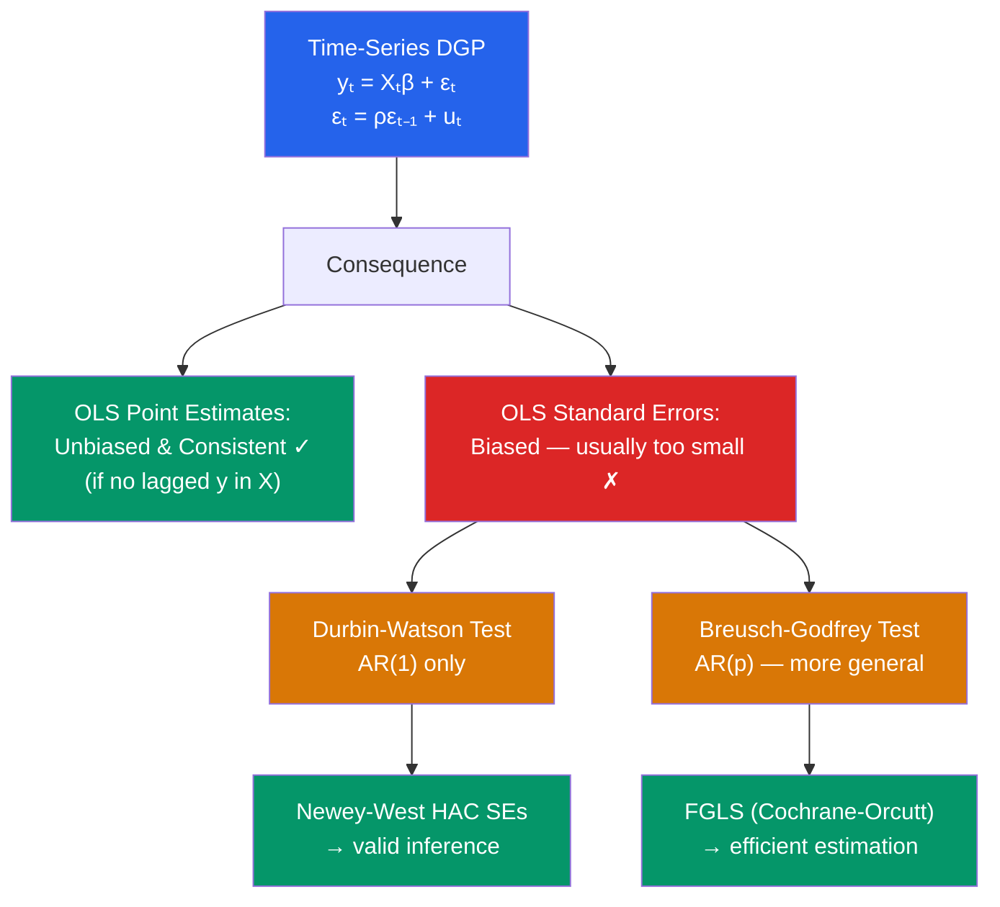

# 🔄 Autocorrelation

> [!abstract] TL;DR
> Autocorrelation (serial correlation) occurs when $\text{Cov}(\varepsilon_t, \varepsilon_{t-s}) \neq 0$ for $s \neq 0$, violating the independence component of MLR.5. Like heteroskedasticity, OLS remains **unbiased and consistent** but is **no longer efficient**, and standard errors are wrong. The AR(1) case gives $\varepsilon_t = \rho \varepsilon_{t-1} + u_t$. Test with the Durbin-Watson ($\rho = 0$) or Breusch-Godfrey (higher-order) test. Remedy: **Newey-West HAC standard errors** or **FGLS (Cochrane-Orcutt)**.

## Intuition — analogy FIRST

Imagine measuring daily stock returns. If you have a bad day, you are likely to have another bad day tomorrow — fear and momentum persist. This is autocorrelation: knowing the error today tells you something about the error tomorrow. The assumption OLS makes is that each observation's error is independent of all others. In time-series data, this assumption is almost always violated to some degree.

The practical consequence is like surveying a crowd where people have copied each other's answers — you think you have 100 independent data points, but really you have far less independent information. OLS treats them as independent, so it is overconfident: standard errors are too small, and you reject $H_0$ too often.

---

## How It Works



## Key Concepts / Details

### The AR(1) Error Process

The most common model: $\varepsilon_t = \rho \varepsilon_{t-1} + u_t$ where $u_t \sim (0, \sigma_u^2)$ i.i.d.

- $|\rho| < 1$: stationary autocorrelation (decays over time)
- $\rho = 1$: unit root — leads to spurious regression (see [[Unit_Roots_and_Integration]])
- $\rho > 0$: positive autocorrelation (common in economic levels)
- $\rho < 0$: negative autocorrelation (common in differenced data)

Variance of $\varepsilon_t$: $\text{Var}(\varepsilon_t) = \sigma_u^2 / (1 - \rho^2)$

Covariance: $\text{Cov}(\varepsilon_t, \varepsilon_{t-s}) = \rho^s \sigma_u^2 / (1 - \rho^2)$

### Consequences of Autocorrelation

| Property | Under AR(1) Autocorrelation |
|----------|----------------------------|
| Unbiasedness | **Preserved** (if no lagged $y$ in regressors) |
| Consistency | **Preserved** |
| Efficiency | **Lost**: Cochrane-Orcutt / FGLS is BLUE |
| Classical SEs | **Wrong**: typically too small for $\rho > 0$ |
| OLS with lagged $y$ | **Biased** even in large samples |

### The Durbin-Watson Test

Tests $H_0: \rho = 0$ against $H_1: \rho > 0$ (or two-sided).

$$DW = \frac{\sum_{t=2}^T (\hat{\varepsilon}_t - \hat{\varepsilon}_{t-1})^2}{\sum_{t=1}^T \hat{\varepsilon}_t^2} \approx 2(1 - \hat{\rho})$$

| DW value | Implication |
|----------|-------------|
| $\approx 2$ | No autocorrelation |
| $< 2$ (toward 0) | Positive autocorrelation |
| $> 2$ (toward 4) | Negative autocorrelation |

Critical values depend on $n$ and $k$: DW has an inconclusive zone; the Breusch-Godfrey test is preferred in practice.

**Limitation**: DW is invalid when lagged $y$ appears as a regressor (use BG test instead).

### The Breusch-Godfrey (LM) Test

Tests for autocorrelation up to order $p$: $H_0: \rho_1 = \rho_2 = \ldots = \rho_p = 0$

**Procedure**:
1. Regress $y$ on $X$; obtain $\hat{\varepsilon}_t$
2. Auxiliary regression: $\hat{\varepsilon}_t = X_t\gamma + \sum_{j=1}^p \delta_j \hat{\varepsilon}_{t-j} + v_t$
3. $\text{LM} = (T-p) R^2_{aux} \sim \chi^2_p$ under $H_0$

Advantages over DW: valid with lagged $y$ regressors, tests any order $p$.

### Remedy 1: Newey-West HAC Standard Errors

**Heteroskedasticity and Autocorrelation Consistent (HAC)** standard errors (Newey-West):
$$\widehat{\text{Var}}_{HAC}(\hat{\beta}) = (X'X)^{-1} \hat{S} (X'X)^{-1}$$

where $\hat{S} = \hat{\Gamma}_0 + \sum_{j=1}^m w_j (\hat{\Gamma}_j + \hat{\Gamma}_j')$ with Bartlett weights $w_j = 1 - j/(m+1)$ and $m$ = bandwidth (often $\lfloor 4(T/100)^{2/9} \rfloor$).

Like HC SEs, Newey-West SEs give valid inference without improving efficiency. They are the standard in macroeconometrics when serial correlation is a concern.

### Remedy 2: Cochrane-Orcutt (FGLS)

Under AR(1) errors:

1. Estimate $\hat{\rho}$ from $\hat{\varepsilon}_t = \rho \hat{\varepsilon}_{t-1} + u_t$
2. Transform: $\tilde{y}_t = y_t - \hat{\rho} y_{t-1}$, $\tilde{x}_t = x_t - \hat{\rho} x_{t-1}$
3. Estimate OLS on transformed (quasi-differenced) model

This removes the AR(1) structure and yields efficient estimates under the maintained AR(1) assumption. Prais-Winsten adds the first observation correctly.

```r
library(lmtest)
library(sandwich)
library(orcutt)

# Load/simulate time-series data
set.seed(42)
T  <- 200
x  <- cumsum(rnorm(T))         # I(1) for illustration
e  <- arima.sim(list(ar = 0.7), T)  # AR(1) errors
y  <- 0.5 * x + e

df <- data.frame(y = y, x = x, t = 1:T)

# OLS
model_ols <- lm(y ~ x, data = df)

# 1. Durbin-Watson test
dwtest(model_ols)

# 2. Breusch-Godfrey test (up to 4th order)
bgtest(model_ols, order = 4)

# 3. Plot residuals vs lagged residuals
e_hat <- residuals(model_ols)
plot(e_hat[-1], e_hat[-T], xlab = "ê_{t-1}", ylab = "ê_t",
     main = "Residual autocorrelation: should be random cloud")

# 4. Newey-West HAC standard errors
coeftest(model_ols, vcov = NeweyWest(model_ols, lag = 4))

# 5. Cochrane-Orcutt FGLS
co_model <- cochrane.orcutt(model_ols)
summary(co_model)

# Alternatively: FGLS via nlme
library(nlme)
fgls_model <- gls(y ~ x, data = df,
                   correlation = corAR1(form = ~t))
summary(fgls_model)
```

### Autocorrelation in Panel Data: Clustering

In panel data with repeated observations per unit, errors within a unit are serially correlated. **Cluster-robust SEs** generalize Newey-West to the panel setting:

$$\widehat{\text{Var}}_{CL}(\hat{\beta}) = (X'X)^{-1}\left(\sum_{g=1}^G X_g' \hat{E}_g \hat{E}_g' X_g \right)(X'X)^{-1}$$

where $g$ indexes clusters and $\hat{E}_g$ is the vector of residuals for cluster $g$.

---

## Real-World Notes

- **Macroeconomic time series**: GDP growth, inflation, unemployment — virtually all macro variables exhibit autocorrelation. Standard errors from non-autocorrelation-corrected regressions are meaningless. Newey-West SEs are the standard.
- **Card-Krueger (1994)**: Their DiD study of minimum wage used only two time periods per state, so autocorrelation was less of a concern. But Bertrand, Duflo, and Mullainathan (2004) showed that DiD studies with longer panels dramatically over-reject $H_0$ when cluster-robust SEs are not used.
- **Financial return predictability**: Cochrane (2008) examines whether stock returns are predictable by dividend yields. The autocorrelation in dividend yields (the regressor) creates spurious regression problems — a subtle interaction of unit roots and autocorrelation.

---

## Common Pitfalls

- **Applying DW test when lagged $y$ is a regressor**: DW is biased toward 2 in this case. Use Breusch-Godfrey.
- **Confusing serial correlation with unit roots**: $\rho$ close to 1 makes tests difficult. Always test for unit roots separately ([[Unit_Roots_and_Integration]]) before testing for autocorrelation.
- **Using too small a Newey-West bandwidth**: Insufficient bandwidth leaves autocorrelation in the residuals. When in doubt, use a larger bandwidth.
- **Ignoring clustering in DiD studies**: The most common mistake in policy evaluation is failing to cluster standard errors at the level at which treatment is assigned.

---

## Related Concepts

- [[_MOC_OLS_Problems|↑ Section MOC]]
- [[Gauss_Markov_Theorem]] — MLR.5 violation
- [[Heteroskedasticity]] — Another violation of the error variance assumption
- [[GLS_and_WLS]] — FGLS (Cochrane-Orcutt) as the efficient remedy
- [[Unit_Roots_and_Integration]] — What happens when $\rho = 1$ (beyond autocorrelation into non-stationarity)
- [[Difference_in_Differences]] — Where cluster-robust SEs matter most in practice

---

## Review Questions

1. Derive the expression $DW \approx 2(1-\hat{\rho})$ and explain why DW = 2 implies no autocorrelation.
2. Why is the Durbin-Watson test invalid when lagged dependent variables appear as regressors? What test should you use instead?
3. You are studying the effect of monetary policy on inflation using 40 years of quarterly data. You find DW = 1.2. Describe step by step what you would do next.

---

## Sources

- Wooldridge, J.M., *Introductory Econometrics*, Ch. 12 — Serial Correlation and Heteroskedasticity in Time-Series Regressions
- Newey, W.K. & West, K.D. (1987), "A Simple, Positive Semi-Definite, Heteroskedasticity and Autocorrelation Consistent Covariance Matrix," *Econometrica*
- Breusch, T.S. (1978), "Testing for Autocorrelation in Dynamic Linear Models," *Australian Economic Papers*

#econometrics #statistics #OLS-problems #autocorrelation #serial-correlation #Newey-West
