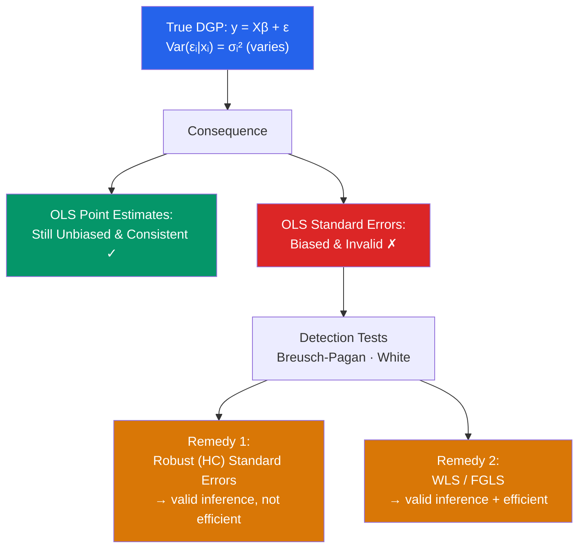

# 📐 Heteroskedasticity

> [!abstract] TL;DR
> Heteroskedasticity occurs when $\text{Var}(\varepsilon_i \mid x_i) = \sigma_i^2$ varies across observations, violating MLR.5. OLS estimates remain **unbiased and consistent**, but they are **no longer efficient**, and the standard formula for standard errors is wrong — all t-stats, F-stats, and CIs are invalid. Detect it with the Breusch-Pagan or White test. Remedy: use **heteroskedasticity-robust (HC) standard errors** for valid inference, or **WLS** for efficiency. 

## Intuition — analogy FIRST

Imagine predicting annual income from years of education. For high-school graduates, incomes cluster tightly around a mean of $40k. For people with PhDs, incomes range wildly — some in academia earn $70k, others in finance earn $400k. The *average* relationship is the same, but the *spread* of outcomes grows with education. That is heteroskedasticity: the error variance is not constant but grows (or shrinks) with some variable.

OLS still finds the right average line, but it weights all observations equally when it should weight low-variance observations more heavily. The cost is inefficiency. Worse, the formula OLS uses to estimate its own uncertainty assumes constant variance — so it reports wrong standard errors.

---

## How It Works



## Key Concepts / Details

### Consequences for OLS

Under heteroskedasticity $\text{Var}(\varepsilon \mid X) = \Omega \neq \sigma^2 I$:

| Property | Effect |
|----------|--------|
| Unbiasedness | **Preserved**: $E[\hat{\beta}] = \beta$ (only needs MLR.1–4) |
| Consistency | **Preserved**: $\hat{\beta} \xrightarrow{p} \beta$ |
| Efficiency | **Lost**: OLS is not BLUE; WLS is BLUE |
| Standard errors | **Wrong**: $\widehat{\text{Var}}_{OLS}(\hat{\beta}) = \hat{\sigma}^2(X'X)^{-1}$ is biased |
| t and F tests | **Invalid**: based on wrong SEs |

### Detection: Breusch-Pagan Test

**Null**: $\text{Var}(\varepsilon_i \mid x_i) = \sigma^2$ (homoskedasticity)  
**Procedure**:
1. Regress $y$ on $X$; obtain residuals $\hat{\varepsilon}_i$
2. Regress $\hat{\varepsilon}_i^2$ on all regressors: $\hat{\varepsilon}_i^2 = \gamma_0 + \gamma_1 x_{i1} + \ldots + \gamma_{k-1} x_{i,k-1} + v_i$
3. Test statistic: $\text{LM} = nR^2_{aux} \sim \chi^2_{k-1}$ under $H_0$

Rejects if variance is a linear function of the regressors.

### Detection: White Test

More general — tests for heteroskedasticity of any form (including interactions and squares).

1. Regress $\hat{\varepsilon}_i^2$ on all regressors, their squares, and cross-products
2. $\text{LM} = nR^2_{aux} \sim \chi^2_p$ where $p$ = number of regressors in auxiliary regression

White test has more power against general heteroskedasticity but fewer degrees of freedom for small $n$.

### Remedy 1: Heteroskedasticity-Robust Standard Errors

The **Huber-White (HC) sandwich estimator**:
$$\widehat{\text{Var}}_{HC}(\hat{\beta}) = (X'X)^{-1}\left(\sum_{i=1}^n \hat{\varepsilon}_i^2 x_i x_i'\right)(X'X)^{-1}$$

Variants:
| Estimator | Formula for $\hat{e}_i^2$ | Recommended for |
|-----------|--------------------------|-----------------|
| HC0 | $\hat{\varepsilon}_i^2$ | Large samples only |
| HC1 | $\frac{n}{n-k}\hat{\varepsilon}_i^2$ | Default: slight finite-sample correction |
| HC3 | $\hat{\varepsilon}_i^2/(1-h_{ii})^2$ | Small samples; most conservative |

HC robust SEs **do not improve efficiency** — they only give valid inference. The point estimates are still OLS.

### Remedy 2: Weighted Least Squares (WLS)

If you know the variance function $\text{Var}(\varepsilon_i \mid x_i) = \sigma^2 h(x_i)$:

Transform: $\tilde{y}_i = y_i / \sqrt{h_i}$, $\tilde{x}_i = x_i / \sqrt{h_i}$

Estimate OLS on the transformed model: $\tilde{y} = \tilde{X}\beta + \tilde{\varepsilon}$ where $\text{Var}(\tilde{\varepsilon}_i) = \sigma^2$ (homoskedastic).

WLS is **BLUE** under the correct weighting. In practice, use FGLS: estimate $h_i$ from the auxiliary regression, then use those as weights.

```r
library(lmtest)
library(sandwich)

# Simulate heteroskedastic data
set.seed(42)
n  <- 300
x  <- rnorm(n, mean = 5, sd = 2)
e  <- rnorm(n, sd = x)   # variance grows with x
y  <- 2 + 1.5 * x + e

df <- data.frame(y = y, x = x)

# OLS
model_ols <- lm(y ~ x, data = df)

# 1. Breusch-Pagan test
bptest(model_ols)

# 2. White test (include squares and cross-products)
bptest(model_ols, ~ x + I(x^2), data = df)

# 3. Visual diagnostic
plot(fitted(model_ols), residuals(model_ols),
     main = "Residuals vs Fitted (fan shape = heteroskedasticity)")

# 4. Robust standard errors (HC1)
coeftest(model_ols, vcov = vcovHC(model_ols, type = "HC1"))

# 5. WLS (knowing true variance function h(x) = x²)
model_wls <- lm(y ~ x, data = df, weights = 1/x^2)
summary(model_wls)

# 6. FGLS: estimate variance from auxiliary regression
aux_model <- lm(log(residuals(model_ols)^2) ~ log(x))
sigma_hat  <- exp(fitted(aux_model))
model_fgls <- lm(y ~ x, data = df, weights = 1/sigma_hat)
summary(model_fgls)
```

### When Heteroskedasticity Matters Most

| Context | Typical Pattern | Recommended Action |
|---------|----------------|-------------------|
| Cross-sectional wage data | Variance rises with income | Always use HC1 robust SEs |
| Firm-level data | Variance proportional to firm size | WLS with $1/\text{size}$ weights |
| Financial returns | Volatility clustering (ARCH) | ARCH/GARCH models, not just WLS |
| Survey data with PSUs | Intra-cluster correlation | Cluster-robust SEs |

---

## Real-World Notes

- **Modern applied econometrics**: Since White (1980), heteroskedasticity-robust SEs have become the default in applied micro. Most published papers report HC or cluster-robust SEs without testing first — the philosophical stance is "why ever report wrong SEs?"
- **Heteroskedasticity and efficiency**: If you care about precision (e.g., power in a clinical trial), use WLS. If you only care about valid inference (e.g., is this coefficient significant?), HC SEs are sufficient.
- **ARCH in finance**: Financial returns exhibit time-varying volatility — large returns tend to be followed by large returns (in absolute value). This is a specific form of autocorrelated heteroskedasticity requiring GARCH models, not just robust SEs.

---

## Common Pitfalls

- **Assuming OLS coefficient estimates are wrong because of heteroskedasticity**: Only SEs are wrong; the coefficients themselves remain consistent.
- **Using HC SEs as a substitute for finding the right model**: Robust SEs paper over the efficiency loss. If a known variance function exists, WLS is strictly better.
- **Forgetting cluster-robust SEs in panel data**: Within-group correlation of errors (students within schools, repeated observations per firm) is a form of heteroskedasticity-autocorrelation that requires cluster-robust SEs.

---

## Related Concepts

- [[_MOC_OLS_Problems|↑ Section MOC]]
- [[Gauss_Markov_Theorem]] — MLR.5 (homoskedasticity) being violated
- [[Regression_Diagnostics]] — Visual detection of heteroskedasticity
- [[GLS_and_WLS]] — The efficient estimator under heteroskedasticity
- [[Autocorrelation]] — The time-series analogue of non-constant variance structure

---

## Review Questions

1. Prove that OLS standard errors are biased under heteroskedasticity. What is the direction of the bias (over- or under-statement) in a typical wage regression with variance rising in income?
2. Describe the Breusch-Pagan test step by step. What is its null hypothesis and test statistic distribution?
3. You detect significant heteroskedasticity in your model. Give two remedies and explain when you would choose each.

---

## Sources

- Wooldridge, J.M., *Introductory Econometrics*, Ch. 8 — Heteroskedasticity
- White, H. (1980), "A Heteroskedasticity-Consistent Covariance Matrix Estimator," *Econometrica* 48(4), 817–838
- Breusch, T.S. & Pagan, A.R. (1979), "A Simple Test for Heteroscedasticity," *Econometrica* 47(5), 1287–1294

#econometrics #statistics #OLS-problems #heteroskedasticity #robust-standard-errors
