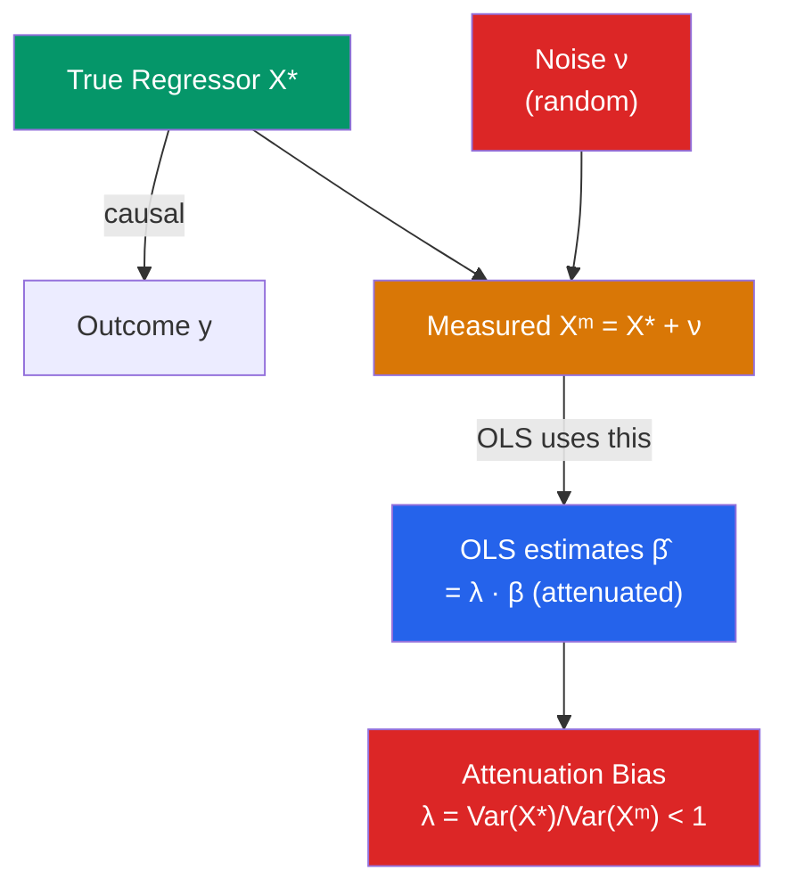

# 📏 Measurement Error

> [!abstract] TL;DR
> Classical measurement error in a regressor ($X^* = X + \nu$, where $\nu$ is pure noise) biases OLS coefficients toward zero — **attenuation bias**. The OLS estimate equals the true coefficient times the **reliability ratio** $\lambda = \text{Var}(X)/\text{Var}(X^*)$. Measurement error in the outcome $y$ does not bias coefficients but inflates residual variance and reduces precision. Both types can be addressed with instrumental variables (using another mismeasured proxy as the IV), or with LATE estimators under non-classical measurement error.

## Intuition — analogy FIRST

You want to measure whether people who exercise more live longer. But you cannot observe true exercise — you ask people to self-report hours per week, and people systematically mis-remember (random noise around the truth). Your regressor, self-reported exercise, equals true exercise plus random noise. The noise obscures the signal: observations with high reported exercise sometimes just got unlucky with a high noise draw, not because they truly exercise a lot. OLS averages together "true high exercisers" and "those with high noise" into the same high-reported group, diluting the estimated effect toward zero.

---

## How It Works



## Key Concepts / Details

### Classical Measurement Error in a Regressor

True model: $y_i = \alpha + \beta x_i^* + \varepsilon_i$ where $x^*$ is the true (unobserved) regressor.

Observed: $x_i^m = x_i^* + \nu_i$ where $\nu_i$ is measurement error.

**Classical ME assumptions**:
- $E[\nu_i] = 0$
- $\text{Cov}(\nu_i, x_i^*) = 0$ (error uncorrelated with truth)
- $\text{Cov}(\nu_i, \varepsilon_i) = 0$ (error uncorrelated with structural error)

Substituting $x^* = x^m - \nu$ into the true model:
$$y_i = \alpha + \beta(x_i^m - \nu_i) + \varepsilon_i = \alpha + \beta x_i^m + (\varepsilon_i - \beta \nu_i)$$

The composite error $(\varepsilon_i - \beta \nu_i)$ is **correlated with $x^m$** because $\text{Cov}(x_i^m, -\beta \nu_i) = -\beta \text{Var}(\nu_i) \neq 0$.

**Attenuation bias**:
$$\text{plim}(\hat{\beta}_{OLS}) = \beta \cdot \frac{\text{Var}(x^*)}{\text{Var}(x^*) + \text{Var}(\nu)} = \beta \cdot \lambda$$

where the **reliability ratio** $\lambda = \text{Var}(x^*)/\text{Var}(x^m) \in (0, 1)$.

**Attenuation is always toward zero**: $|\hat{\beta}| < |\beta|$ regardless of the sign of $\beta$.

### Measurement Error in the Outcome $y$

If $y^m = y^* + \eta$ where $\eta$ is classical ME in $y$:
- **No bias**: $\text{plim}(\hat{\beta}) = \beta$ because $\text{Cov}(x, \eta) = 0$
- **But**: $\text{Var}(\hat{\beta})$ increases, reducing precision and power

ME in $y$ makes OLS less precise but not biased. ME in $x$ makes OLS biased.

### Multiple Regressors

With multiple regressors, classical ME in one regressor does not simply attenuate its coefficient — the bias spills over to all coefficients. The direction of bias in other coefficients depends on the correlation structure of $X$.

### Attenuation vs Other Endogeneity

| Problem | Direction of Bias | Mechanism |
|---------|------------------|-----------|
| Classical ME in $x$ | Toward zero | Noise dilutes signal |
| OVB (positive confound) | Away from zero | Confounder inflates estimate |
| Simultaneity | Ambiguous | Depends on system |
| Non-classical ME | Ambiguous | Depends on error structure |

### Remedies

**1. Instrumental Variables (IV)**

If you have a second mismeasured proxy $z = x^* + \xi$ where $\xi \perp \nu$ and $\xi \perp \varepsilon$, use $z$ as an instrument for $x^m$:

$$\hat{\beta}_{IV} = \frac{\text{Cov}(z, y)}{\text{Cov}(z, x^m)} \xrightarrow{p} \beta$$

This works because the instrument shares only the true variation in $x^*$ with $y$, not the noise $\nu$. See [[Instrumental_Variables]].

**2. LATE under Non-Classical ME**

For discrete mismeasured treatments (e.g., self-reported treatment status), bounds on the true effect can be derived without instruments under monotonicity assumptions.

**3. Repeated Measures**

If you have two independent measurements of $x^*$, you can estimate $\lambda$ directly and correct the bias:
$$\hat{\lambda} = 1 - \frac{\widehat{\text{Var}}(\nu)}{\widehat{\text{Var}}(x^m)}$$

```r
library(AER)
library(tidyverse)

# Simulate classical ME
set.seed(42)
n      <- 500
x_star <- rnorm(n, mean = 5, sd = 2)       # true regressor
nu     <- rnorm(n, sd = 1.5)               # ME with sd = 1.5
x_m    <- x_star + nu                       # observed regressor
eps    <- rnorm(n)
y      <- 2 + 0.8 * x_star + eps            # true model

# True reliability ratio
lambda <- var(x_star) / var(x_m)
cat("True λ:", lambda, "\n")
cat("Expected attenuation:", 0.8 * lambda, "\n")

# OLS on mismeasured x (biased)
model_ols <- lm(y ~ x_m)
cat("OLS β̂:", coef(model_ols)["x_m"], "\n")

# OLS on true x (infeasible — for comparison)
model_true <- lm(y ~ x_star)
cat("True β̂:", coef(model_true)["x_star"], "\n")

# IV correction: use second measurement as instrument
nu2  <- rnorm(n, sd = 1.5)   # independent ME
x_m2 <- x_star + nu2          # second measure of x_star

df_me <- data.frame(y, x_m, x_m2)
model_iv <- ivreg(y ~ x_m | x_m2, data = df_me)
cat("IV β̂ (using 2nd measure as IV):", coef(model_iv)["x_m"], "\n")
summary(model_iv, diagnostics = TRUE)

# Variance decomposition: estimate λ
cov_measures <- cov(x_m, x_m2)     # cov(x* + ν, x* + ξ) = Var(x*)
var_x_m      <- var(x_m)
lambda_hat   <- cov_measures / var_x_m
cat("Estimated λ:", lambda_hat, "\n")

# Bias-corrected OLS
beta_corrected <- coef(model_ols)["x_m"] / lambda_hat
cat("Corrected β̂:", beta_corrected, "\n")
```

### Non-Classical Measurement Error

Classical ME assumes $\text{Cov}(\nu, x^*) = 0$. Real-world ME often violates this:

- **Mean-reverting recall error**: People underreport extreme values. $\text{Cov}(\nu, x^*) < 0$ → attenuation may be stronger.
- **Social desirability bias**: People systematically report higher (or lower) values for socially coded variables (income, alcohol, charitable giving). This creates systematic (non-random) ME.
- **Seam bias** in panel surveys: Respondents report constant values within a survey reference period but then jump at the seam between periods.

With non-classical ME, attenuation is not guaranteed and the bias direction is ambiguous.

---

## Real-World Notes

- **Angrist and Krueger (1991)**: Their compulsory schooling IV study exploits quarter of birth as an instrument partly because self-reported years of schooling is measured with error (attenuation bias in OLS), and the IV using quarter of birth provides a consistent estimate. See [[Instrumental_Variables]].
- **PSID and income data**: The Panel Study of Income Dynamics has extensive validation studies showing substantial ME in reported hours worked and earnings, particularly at the tails.
- **Health data**: Self-reported BMI underestimates true BMI (people underreport weight). OLS of health outcomes on BMI suffers attenuation bias — the true health effect of obesity is larger than OLS estimates.

---

## Common Pitfalls

- **Confusing ME in $y$ with ME in $x$**: ME in $y$ reduces precision but not bias; ME in $x$ creates attenuation bias. These have very different implications.
- **Assuming attenuation means "the true effect is even bigger"**: Attenuation holds for classical ME. With non-classical ME (correlated error), the true effect could be smaller or even opposite in sign.
- **Using two correlated proxies as instruments**: The exclusion restriction for the IV approach requires the ME in the two measures to be independent ($\text{Cov}(\nu_1, \nu_2) = 0$). Correlated measurement errors invalidate the instrument.

---

## Related Concepts

- [[_MOC_OLS_Problems|↑ Section MOC]]
- [[Omitted_Variable_Bias]] — Another source of endogeneity violating MLR.4
- [[Instrumental_Variables]] — The standard remedy for ME in regressors
- [[Gauss_Markov_Theorem]] — MLR.4 violation from ME-induced endogeneity

---

## Review Questions

1. Derive the attenuation bias formula $\text{plim}(\hat{\beta}_{OLS}) = \beta \lambda$ where $\lambda = \text{Var}(x^*)/\text{Var}(x^m)$. Show explicitly why the composite error is correlated with the mismeasured regressor.
2. A researcher uses self-reported hours of exercise to explain health outcomes. She finds no statistically significant effect. Should she conclude exercise does not affect health? What alternative explanation might account for this result?
3. Under what conditions can a second, independently mismeasured proxy for $x^*$ be used as an instrument to correct attenuation bias?

---

## Sources

- Wooldridge, J.M., *Introductory Econometrics*, Ch. 9.4 — Properties of OLS under Measurement Error
- Greene, W.H., *Econometric Analysis*, Ch. 8.5 — Errors in Variables
- Bound, J., Brown, C. & Mathiowetz, N. (2001), "Measurement Error in Survey Data," *Handbook of Econometrics*, Vol. 5

#econometrics #statistics #OLS-problems #measurement-error #attenuation-bias
