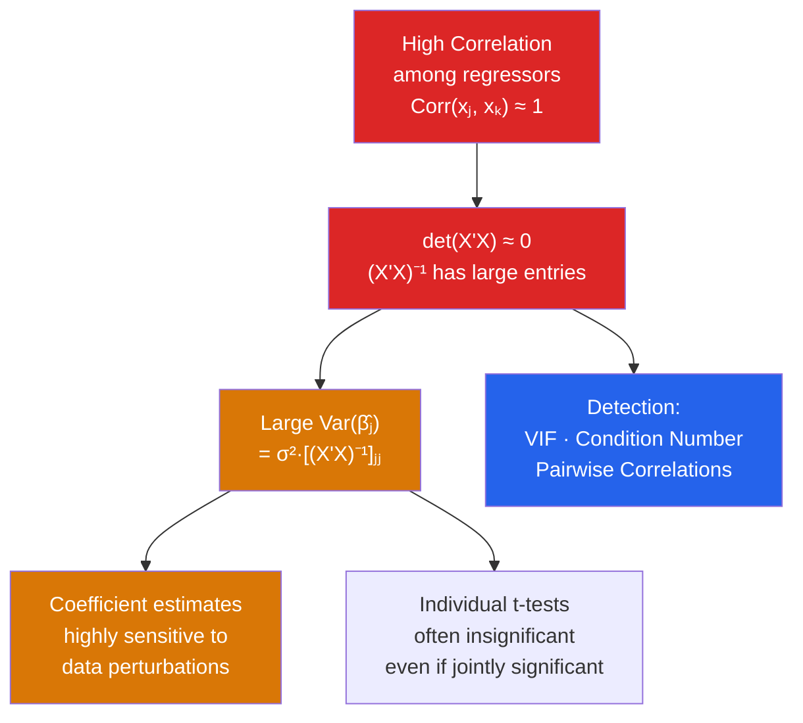

# 🔀 Multicollinearity

> [!abstract] TL;DR
> **Perfect multicollinearity** (exact linear dependence in $X$) makes $X'X$ singular, so OLS cannot be computed. **Near-multicollinearity** (high but imperfect correlation among regressors) inflates standard errors, makes individual t-tests unreliable, and creates sensitivity to minor data changes — but OLS point estimates remain unbiased. Detect with VIF (Variance Inflation Factor) or condition number. Unlike heteroskedasticity or endogeneity, multicollinearity is fundamentally a data limitation, not a model failure: more or better data is the real remedy.

## Intuition — analogy FIRST

Imagine trying to measure the separate effects of height and arm span on athletic performance. In the real world, height and arm span are extremely highly correlated (tall people have long arms). Your data simply cannot distinguish "this athlete is good because they are tall" from "this athlete is good because they have long arms." Both coefficients will be estimated imprecisely — huge standard errors, unstable estimates, and coefficients that flip sign with small sample changes.

This is near-multicollinearity: the data does not contain enough independent variation to separately identify the two effects. It is not a model misspecification problem; it is a data informativeness problem.

---

## How It Works



## Key Concepts / Details

### Perfect vs Near Multicollinearity

**Perfect multicollinearity**: $X$ has linearly dependent columns, e.g., $x_3 = 2x_1 + x_2$. Then $\text{rank}(X) < k$ and $(X'X)^{-1}$ does not exist. OLS cannot be computed. R automatically drops linearly dependent columns with a warning.

**Near-multicollinearity**: No exact dependence, but columns are highly correlated. $(X'X)^{-1}$ exists but has large entries, inflating $\text{Var}(\hat{\beta}_j)$.

### The Variance Inflation Factor (VIF)

For regressor $x_j$, regress $x_j$ on all other regressors and obtain $R^2_j$:
$$\text{VIF}_j = \frac{1}{1 - R^2_j}$$

This decomposes the variance of $\hat{\beta}_j$:
$$\text{Var}(\hat{\beta}_j) = \frac{\sigma^2}{\text{SST}_j} \cdot \text{VIF}_j$$

where $\text{SST}_j = \sum_i (x_{ij} - \bar{x}_j)^2$.

| VIF | Interpretation |
|-----|----------------|
| 1 | No collinearity |
| 1–5 | Moderate; usually acceptable |
| 5–10 | High; warrants investigation |
| > 10 | Very high; standard errors severely inflated |

**GVIF** (Generalized VIF): handles categorical variables with multiple dummies.

### Condition Number

The condition number of $X'X$ measures overall collinearity:
$$\kappa = \sqrt{\lambda_{\max}(X'X) / \lambda_{\min}(X'X)}$$

| $\kappa$ | Severity |
|---------|----------|
| < 10 | Mild |
| 10–30 | Moderate |
| > 30 | Severe |

### Consequences for Inference

| What changes | What does not change |
|-------------|---------------------|
| Standard errors (inflated) | Unbiasedness of $\hat{\beta}$ |
| t-test power (reduced) | Consistency of $\hat{\beta}$ |
| Coefficient stability | Overall F-test (joint significance often intact) |
| Confidence interval width | Fitted values $\hat{y}$ |

**Key insight**: Near-multicollinearity makes it hard to *separate* effects but does not bias estimates. The overall fit (and predictions) may be fine even when individual coefficients are imprecise.

### Detecting Multicollinearity

1. **Pairwise correlations**: $|r(x_j, x_k)| > 0.9$ suggests a problem (though not sufficient — multicollinearity can exist without high pairwise correlations)
2. **VIF**: $\text{VIF}_j > 10$ triggers investigation
3. **Condition number**: $\kappa > 30$
4. **Symptom**: large standard errors, jointly significant F-test but individually insignificant t-tests, coefficients that change dramatically when you add/remove regressors

```r
library(car)
library(tidyverse)

# Simulate near-collinear data
set.seed(42)
n  <- 200
x1 <- rnorm(n)
x2 <- x1 + rnorm(n, sd = 0.2)  # highly correlated with x1
y  <- 1 + 2*x1 + 0.5*x2 + rnorm(n)
df <- data.frame(y, x1, x2)

model <- lm(y ~ x1 + x2, data = df)
summary(model)

# 1. Pairwise correlations
cor(df)

# 2. VIF
vif(model)

# 3. Condition number of X'X
X     <- model.matrix(model)
svd_X <- svd(X)
kappa <- max(svd_X$d) / min(svd_X$d)
cat("Condition number:", kappa, "\n")

# 4. GVIF for models with factor variables
model2 <- lm(log(wage) ~ educ + exper + I(exper^2) + female + as.factor(industry),
             data = wage_data)
vif(model2)   # car package handles factor GVIF automatically

# 5. Joint F-test (often significant even when individual t's are not)
linearHypothesis(model, c("x1 = 0", "x2 = 0"))
```

### Remedies for Multicollinearity

| Remedy | When to Use | Trade-off |
|--------|------------|-----------|
| **Collect more data** | Always best if feasible | Often not practical |
| **Drop one variable** | If one is a near-duplicate | Omitted variable bias risk |
| **Principal components** | Many collinear predictors | Coefficients lose direct interpretation |
| **Ridge regression** | Prediction focus | Introduces bias, reduces variance |
| **Reframe question** | Can you study the joint effect? | Scientifically may be valid |

**Important**: never drop a variable just because of multicollinearity if theory requires it to be included — that introduces [[Omitted_Variable_Bias]].

---

## Real-World Notes

- **Wage equations**: Years of education and years of experience are negatively correlated (people who study longer enter the workforce later) but not so highly that it causes severe multicollinearity. Age and experience can be near-collinear in cross-sections where everyone started school at similar ages.
- **Macroeconomics**: GDP, consumption, and investment all trend together — very high pairwise correlations. This is why time-series macro regressions in levels often have inflated standard errors. First-differencing reduces but may not eliminate multicollinearity.
- **The "dummy variable trap"**: Including all $k$ dummies for a $k$-category variable plus an intercept creates perfect multicollinearity (the dummies sum to the intercept column). Always drop one category as the reference group.

---

## Common Pitfalls

- **Thinking high VIF means the coefficient is wrong**: High VIF just means the coefficient is imprecisely estimated — the point estimate is still unbiased.
- **Dropping variables to fix multicollinearity without checking for OVB**: Dropping a correlated but causally relevant regressor trades multicollinearity (precision problem) for OVB (bias problem). Bias is far worse.
- **Confusing multicollinearity with spurious correlation**: Spurious regression (trending variables) is a different problem involving non-stationarity, not correlation structure in $X$.

---

## Related Concepts

- [[_MOC_OLS_Problems|↑ Section MOC]]
- [[OLS_Estimation]] — Why $(X'X)^{-1}$ failing matters
- [[Gauss_Markov_Theorem]] — MLR.3 (no perfect multicollinearity)
- [[Omitted_Variable_Bias]] — The cost of dropping variables to fix multicollinearity
- [[Regression_Diagnostics]] — VIF as a standard post-estimation check

---

## Review Questions

1. Explain why near-multicollinearity inflates standard errors without biasing OLS point estimates. Use the formula $\text{Var}(\hat{\beta}_j) = \sigma^2 \cdot \text{VIF}_j / \text{SST}_j$ in your answer.
2. You have a model with 10 regressors and find that three of them have VIF > 15. What are three possible remedies, and what are the trade-offs of each?
3. Is it ever correct to drop a variable because of high VIF? Explain when this is justified and when it causes a worse problem.

---

## Sources

- Wooldridge, J.M., *Introductory Econometrics*, Ch. 3.4 — Multicollinearity
- Greene, W.H., *Econometric Analysis*, Ch. 4.9 — Collinearity
- Belsley, D.A., Kuh, E. & Welsch, R.E. (1980), *Regression Diagnostics: Identifying Influential Data and Sources of Collinearity*, Wiley

#econometrics #statistics #OLS-problems #multicollinearity #VIF
