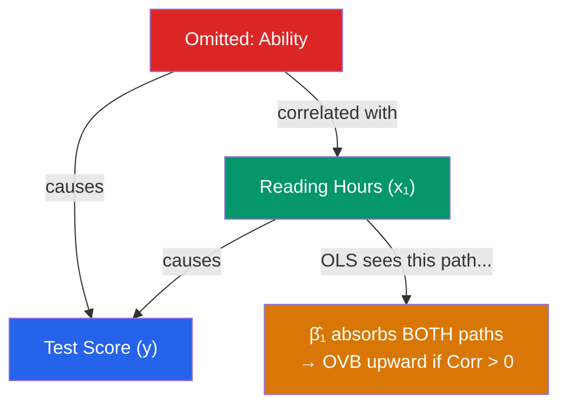
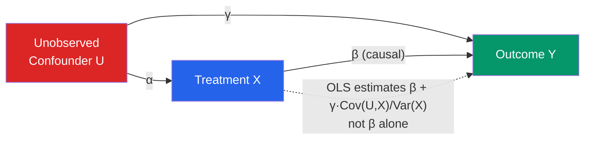

# 🎭 Omitted Variable Bias

> [!abstract] TL;DR
> Omitted Variable Bias (OVB) occurs when a variable that (1) belongs in the true model and (2) is correlated with an included regressor is left out. OLS then absorbs the omitted variable's effect into the residual, violating $E[\varepsilon \mid X] = 0$ and making $\hat{\beta}$ biased and inconsistent. The bias formula is $\text{Bias} = \tilde{\delta}_1 \cdot \hat{\beta}_{2\text{ on }1}$, where $\tilde{\delta}_1$ is the omitted variable's effect and $\hat{\beta}_{2\text{ on }1}$ is the regression of the omitted on the included variable. Remedies: add the variable, use IV, panel FE, or DiD.

## Intuition — analogy FIRST

You want to know if reading to children causes higher test scores. You run a regression of test scores on "hours parent reads to child" and find a large positive coefficient. But smarter, more educated parents both read to their children more *and* pass on higher cognitive ability genetically and environmentally. Ability is the omitted variable — it is correlated with reading (included) and independently affects test scores (the outcome). OLS cannot tell which effect is reading and which is ability, so it inflates the reading coefficient to absorb both.

This is OVB: the regressor you care about carries the shadow of the omitted confounder.

---

## How It Works



## Key Concepts / Details

### The OVB Formula

True model: $y = \beta_0 + \beta_1 x_1 + \beta_2 x_2 + u$ where $E[u \mid x_1, x_2] = 0$

Estimated (misspecified) model: $y = \tilde{\beta}_0 + \tilde{\beta}_1 x_1 + v$ where $v = \beta_2 x_2 + u$

Auxiliary regression of omitted on included: $x_2 = \delta_0 + \delta_1 x_1 + r$

**OVB formula**:
$$E[\tilde{\beta}_1] = \beta_1 + \beta_2 \delta_1 = \beta_1 + \underbrace{\text{(effect of omitted on } y) \times \text{(correlation of omitted with included)}}_{\text{Omitted Variable Bias}}$$

### Signing the Bias

| $\beta_2 > 0$ (omitted raises $y$) | $\delta_1 > 0$ (omitted corr. with included) | Bias: upward |
| $\beta_2 > 0$ | $\delta_1 < 0$ | Bias: downward |
| $\beta_2 < 0$ | $\delta_1 > 0$ | Bias: downward |
| $\beta_2 < 0$ | $\delta_1 < 0$ | Bias: upward |

**Rule**: Bias is positive if $\beta_2$ and $\delta_1$ have the same sign; negative if opposite signs.

### Classic Examples

| Context | Included Regressor | Omitted Variable | Direction of Bias |
|---------|-------------------|-----------------|------------------|
| Returns to schooling | Education | Ability | Upward (ability raises wages, correlates with education) |
| Class size & test scores | Class size | School resources | Ambiguous (rich schools have both smaller classes and more resources) |
| Minimum wage & employment | Minimum wage (NJ) | Regional economic trends | Upward or downward (DiD addresses this) |
| Crime & police | Police presence | Crime rate (reverse causality) | Upward |

### OVB vs Measurement Error vs Simultaneity

All three violate $E[\varepsilon \mid X] = 0$ but through different mechanisms:

| Problem | Mechanism | Bias Type |
|---------|-----------|-----------|
| OVB | Missing confounder correlated with $x$ | Bias from omission |
| Measurement Error | $x$ measured with noise | Attenuation (usually) |
| Simultaneity | $y$ and $x$ jointly determined | Depends on system |

All three are forms of **endogeneity**. All three can be addressed (sometimes) by [[Instrumental_Variables]].

### Causal DAG Representation

OVB maps to **confounding** in the causal graph literature (Pearl):



**Backdoor paths**: OVB arises from open backdoor paths from $X$ to $Y$ through the confounder $U$. Identification strategies block these paths.

### Remedies

| Remedy | Mechanism | Conditions Required |
|--------|-----------|---------------------|
| **Add the variable** | Directly control for omitted confounder | Must be observable |
| **[[Instrumental_Variables]]** | Find $z$ that affects $x$ only through $y$ | Valid instrument exists |
| **[[Fixed_Effects]]** | Remove time-invariant confounders | Panel data, confounder constant within unit |
| **[[Difference_in_Differences]]** | Difference out common trends | Parallel trends assumption |
| **[[Regression_Discontinuity]]** | Local randomization near threshold | Running variable and cutoff exist |
| **[[Propensity_Score_Matching]]** | Match on observed confounders | Conditional independence (no unobservables) |

```r
library(tidyverse)

# Simulate OVB
set.seed(42)
n       <- 500
ability <- rnorm(n)                     # omitted variable
educ    <- 2 + 0.6 * ability + rnorm(n)  # correlated with ability
wage    <- 1 + 0.3 * educ + 0.5 * ability + rnorm(n)

df <- data.frame(wage, educ, ability)

# Short regression (omitting ability) — biased
model_short <- lm(wage ~ educ, data = df)
cat("Short (biased) β_educ:", coef(model_short)["educ"], "\n")

# Long regression (correctly specified) — unbiased
model_long <- lm(wage ~ educ + ability, data = df)
cat("Long (unbiased) β_educ:", coef(model_long)["educ"], "\n")

# OVB formula: β₂ * δ₁
beta2  <- coef(model_long)["ability"]
delta1 <- coef(lm(ability ~ educ, data = df))["educ"]
cat("Predicted OVB:", beta2 * delta1, "\n")
cat("Actual OVB:", coef(model_short)["educ"] - coef(model_long)["educ"], "\n")
# These should be equal

# Ability bias direction: positive (ability raises wages, and ability correlates positively with education)
```

### Sensitivity Analysis: Oster Bounds

When the omitted variable is unobservable, **Oster (2019)** provides bounds on the true $\beta$ by asking: how strong would selection on unobservables need to be relative to selection on observables to explain away the estimated effect?

If controlled coefficients are stable as you add observables, the omitted variable is less likely to be a major concern (Altonji-Elder-Taber logic).

```r
library(psacalc)
# Oster bounds: requires psacalc package
psacalc(model_long, model_short, beta = 0)
```

---

## Real-World Notes

- **Card (1995) IV for education**: OVB from ability is the main threat to OLS estimates of returns to education. Card uses proximity to college as an instrument, arguing it affects education (instrument relevance) but not wages directly (exclusion restriction). See [[Instrumental_Variables]].
- **Griliches (1977)**: Found that including IQ test scores (a proxy for ability) in wage regressions reduced the education coefficient by ~25%, providing direct evidence of upward ability bias in OLS.
- **Program evaluation**: Almost all policy evaluations face OVB because treatment (a job training program, a school intervention) is not randomly assigned — those who select into treatment differ from controls in unobserved ways. This motivates the entire [[_MOC_Causal_Inference]] agenda.

---

## Common Pitfalls

- **Thinking $R^2$ catches OVB**: A high $R^2$ does not mean no omitted variables — your included regressors might explain a lot of *variation* but still be correlated with an omitted confounder.
- **Controlling for post-treatment variables**: Including a variable that is itself caused by the treatment (a "bad control") creates a different form of bias (collider bias). Only control for pre-treatment confounders.
- **Believing "controlling for X" always helps**: Adding $x$ to a regression reduces OVB only if $x$ is a confounder (causes both $y$ and the regressor of interest). Adding irrelevant variables reduces precision without reducing bias.

---

## Related Concepts

- [[_MOC_OLS_Problems|↑ Section MOC]]
- [[Gauss_Markov_Theorem]] — MLR.4 violation ($E[\varepsilon \mid X] \neq 0$)
- [[Potential_Outcomes_Framework]] — The formal causal framework for thinking about OVB
- [[Instrumental_Variables]] — The primary remedy for unobservable confounders
- [[Fixed_Effects]] — Removes time-invariant unobserved heterogeneity
- [[Difference_in_Differences]] — Differences out common trends as a source of OVB
- [[Measurement_Error]] — A related source of endogeneity

---

## Review Questions

1. Derive the OVB formula $E[\tilde{\beta}_1] = \beta_1 + \beta_2 \delta_1$. A researcher studies the effect of class size on test scores but omits per-pupil spending. In which direction will the OLS estimate of the class-size effect be biased? Explain using the formula.
2. Draw a causal DAG for the ability bias problem in returns to schooling. Label each arrow with its meaning. Where is the backdoor path that OLS fails to close?
3. When is "controlling for observable confounders" insufficient to eliminate OVB? Name two specific situations and the appropriate remedy for each.

---

## Sources

- Wooldridge, J.M., *Introductory Econometrics*, Ch. 3.3 — OVB
- Angrist, J.D. & Pischke, J.S., *Mostly Harmless Econometrics*, Ch. 2.3 — OVB and the Regression Anatomy Formula
- Oster, E. (2019), "Unobservable Selection and Coefficient Stability," *Journal of Business & Economic Statistics*

#econometrics #statistics #OLS-problems #OVB #endogeneity #causal-inference
