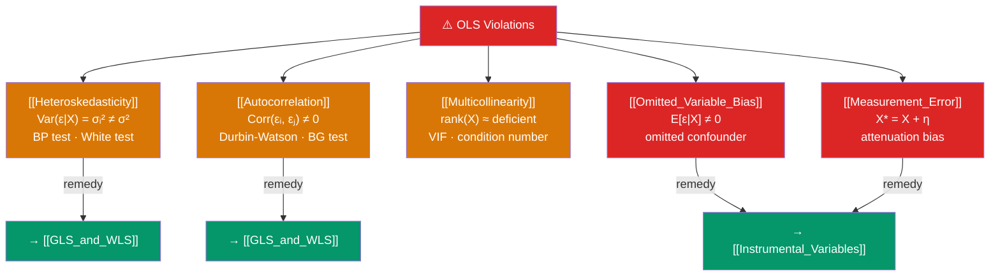

# 🗺️ OLS Problems — Map of Content

> [!abstract] What This Section Covers
> The Gauss-Markov theorem guarantees OLS is BLUE — but only when its five assumptions hold. This section catalogues the most important violations: **heteroskedasticity** (non-constant error variance), **autocorrelation** (correlated errors across observations), **multicollinearity** (near-linear dependence among regressors), **omitted variable bias** (missing confounders that violate $E[\varepsilon \mid X] = 0$), and **measurement error** (noise in $y$ or $X$ that distorts estimates). Each note covers detection tests, consequences for bias/efficiency, and the correct remedy.

## Concept Map

## Learning Path

1. [[Heteroskedasticity]] — Non-constant error variance: Breusch-Pagan and White tests, robust SEs, WLS remedy.
2. [[Autocorrelation]] — Serial correlation in time-series or cross-section clustered data: Durbin-Watson, Breusch-Godfrey, Newey-West SEs.
3. [[Multicollinearity]] — Near-collinear regressors: VIF diagnostics, consequences for standard errors, ridge regression.
4. [[Omitted_Variable_Bias]] — Missing confounders that bias $\hat{\beta}$: the omitted variable bias formula and how IV/FE/DiD address it.
5. [[Measurement_Error]] — Classical vs non-classical measurement error: attenuation bias in $X$, attenuation and non-attenuation in $y$.

## All Notes at a Glance

| Note | Difficulty | What You'll Learn |
|------|------------|-------------------|
| [[Heteroskedasticity]] | Intermediate | BP/White tests, HC robust SEs, WLS, when heteroskedasticity matters |
| [[Autocorrelation]] | Intermediate | DW and BG tests, Newey-West SEs, FGLS, clustering |
| [[Multicollinearity]] | Intermediate | VIF, condition index, near-collinearity consequences, remedies |
| [[Omitted_Variable_Bias]] | Intermediate | OVB formula, sign/magnitude of bias, IV and panel FE as solutions |
| [[Measurement_Error]] | Advanced | Classical ME in $X$ (attenuation), ME in $y$, errors-in-variables, IV |

## Key Questions This Section Answers

- What happens to OLS estimates and standard errors when errors are heteroskedastic?
- How do you detect autocorrelation, and what is the difference between the Durbin-Watson and Breusch-Godfrey tests?
- Why does multicollinearity inflate standard errors, and when is it a "real" problem vs a data limitation?
- What is the omitted variable bias formula, and how does the sign of the bias depend on the correlations involved?
- Why does classical measurement error in a regressor always attenuate OLS coefficients toward zero?

## Related Sections

- [[_MOC_Econometrics_Master|↑ Econometrics Master MOC]]
- [[_MOC_Linear_Regression|← Linear Regression]] — The assumptions being violated
- [[_MOC_Advanced_Regression|→ Advanced Regression]] — GLS/WLS as the efficiency remedy
- [[_MOC_Causal_Inference|→ Causal Inference]] — IV, DiD, RD as the endogeneity remedy

#MOC #Econometrics #OLS-problems
